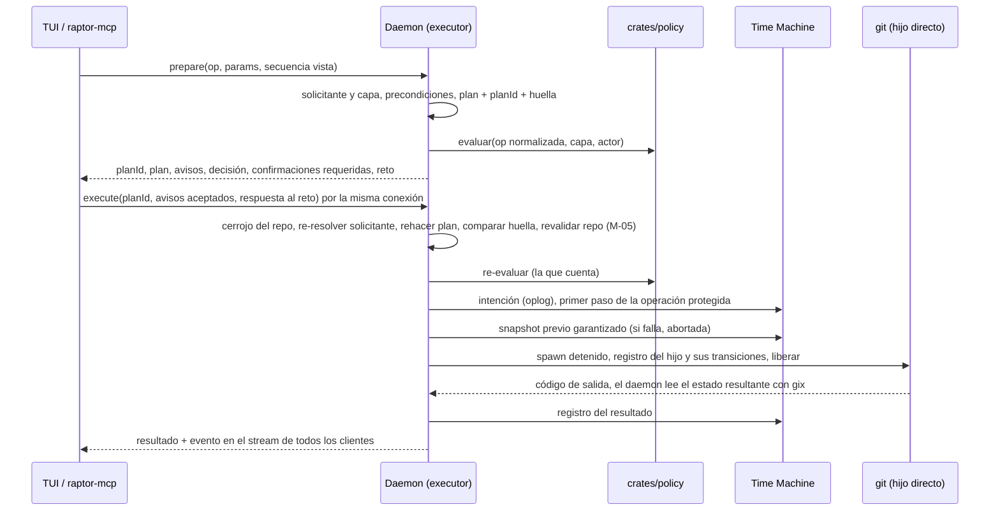

# ADR-CKP-002 — Catálogo de operaciones de usuario y ejecutor del daemon

**Status**: Aceptado · **Fecha**: 2026-10-04 · **Decisores**: Orquestador (delegación de Rene Bonilla, 2026-10-04) · **Feature**: Cockpit (F-001-02), compartido con el Servidor MCP (F-001-05)

**Decisión del orquestador (2026-10-04), validada por Arquitecto, PO y security-expert.** Rene Bonilla delegó estas decisiones el 2026-10-04. La pasada de endurecimiento del mismo día incorpora los ajustes del PO y los hallazgos H-01 a I-03 del security-expert (ver "Revisión de seguridad (2026-10-04)") y las dependencias DEP-MCP-2, DEP-MCP-3 y DEP-MCP-5 del Servidor MCP (CTX-MCP-001). Las enmiendas a otros ADRs se listan al final con su estado.

## Contexto

ADR-TMC-002 § 5 deja las operaciones de usuario al **ejecutor de operaciones del daemon**, que es de F-001-02 y F-001-05, y no de la capa de escritura de la Time Machine. ADR-TMC-004 § 1 hace de la **operación protegida** (intención, snapshot previo, ejecución, registro) la única vía de escritura de una superficie de GitRaptor. ADR-TMC-007 § 2 pide que cada operación declare si es destructiva, y ante la duda lo es. ADR-GRD-003 § 4 reconoce al ejecutor como **padre directo** del `git` y reutiliza su decisión por transición registrada. El contexto del Cockpit fija qué acciones hay (Q-CKP-8 a Q-CKP-16, Q-CKP-19), sus precondiciones (BR-CKP-ELIG-001 a 006), quién decide (BR-CKP-AUTH-001 a 003) y sus casos límite (BR-CKP-EDGE-002, 007, 008, 009). El Servidor MCP (CTX-MCP-001, BR-MCP-001) usa el mismo catálogo con sus herramientas de BR-14 (Q-MCP-1) y pide operaciones que el Cockpit no ofrece: commit, snapshot manual y un rebase atómico (DEP-MCP-2). También pide cerrar el *confused deputy*: un hook del usuario, lanzado por el ejecutor, no puede actuar con poder ajeno (DEP-MCP-3, R-MCP-1). Faltan los artefactos de DEP-CKP-7, DEP-CKP-10, DEP-CKP-12 y DEP-CKP-13, y la respuesta a los riesgos R-CKP-5, R-CKP-6 y R-CKP-7.

**Constitución**: no hay `architecture-constitution.md` en la cascada. Las restricciones activas salen de AGENTS.md y de los ADRs aceptados: Rust; gitoxide para leer y Git CLI para escribir (ADR-GRP-001); monorepo con `crates/{core,policy,git,api}` (ADR-GRP-002); daemon por usuario y canal local (ADR-GRP-005); sin shell, argv fijo y allowlist (NFR-02, ADR-GRP-009); nunca push. Fuente: inline. Se formaliza con `--init-constitution`.

**Pregunta**: ¿qué operaciones puede pedir un cliente, cómo se decide y se ejecuta cada una sin otra vía de escritura, en qué entorno corre `git`, y cómo lo comparten la TUI y el MCP?

## Decisión

**Un catálogo cerrado y versionado de ocho operaciones, definido en `crates/api`, con una marca por superficie (Cockpit, MCP). Toda petición sigue dos fases: *preparar* devuelve un plan con su `planId` y su huella, sin escribir nada; *ejecutar* acepta solo un plan de la misma conexión, toma el cerrojo de escritura del repo, rehace el plan y solo sigue si la huella coincide. La ejecución va dentro de la operación protegida, después de la decisión de Guardrails, que se registra una sola vez, con la capa que fija el daemon según el solicitante. El ejecutor vive en `crates/core` y lanza `git` desde su propio módulo de invocación de `crates/git`, como padre directo, sin TTY ni shell, tras una barrera de arranque, y respetando los hooks y la configuración del usuario. El canal rechaza los comandos reservados de todo descendiente del daemon (`daemon-descendant`); al que desciende de un hijo del ejecutor se le atribuye el solicitante del plan en el registro, en Guardrails y en la auditoría, nunca sus privilegios de humano.**

### 1. Catálogo (versión 1)

| Id | Qué hace | Ámbito (snapshot y permiso) | Clase (ADR-TMC-007 § 2) | Gobernada (BR-VAL-002, Guardrails) | Cockpit | MCP (herramienta de BR-14) |
|---|---|---|---|---|---|---|
| `merge-into-base` | Integra en la base confirmada un **oid** de la rama del agente: `git merge` en el worktree que tiene la base sacada o, si ninguno la tiene, avance rápido de la ref (§ 7) | Worktree destino + ref de la base; el worktree del agente solo se lee | **Destructiva** (ante la duda: Git sobrescribe ignorados que el snapshot no guarda) | Merge | Sí | **No en el MVP** (fuera de BR-14, Q-MCP-1) |
| `rebase-onto-base` | Rebasa la rama del worktree del solicitante sobre el oid de la base confirmada, en **modo `stop`** o **`atomic`** (§ 9) | Worktree + su rama | Destructiva | Rebase | Sí, modo `stop` | Sí: `safe_rebase`, modo `atomic` |
| `discard-worktree` | Quita el worktree y borra su rama; con HEAD separado, solo el worktree (§ 8) | Worktree + su rama | Destructiva | Borrar worktree + borrar rama | Sí | **No en el MVP** (fuera de BR-14, Q-MCP-1) |
| `create-worktree` | Crea rama nueva y worktree desde el oid de la base confirmada | Refs del repo | No destructiva | Crear worktree | Sí | Sí: `create_worktree`, **solo con la plantilla** (H-02) |
| `commit` | Commitea en el worktree del solicitante rutas literales o "todo lo preparado"; el mensaje no viaja por argv (§ 6) | Worktree + su rama | No destructiva: solo añade un commit; el previo guarda el índice | Commit | No en el MVP (no es acción de BR-07) | Sí: `safe_commit` (DEP-MCP-2, Q-MCP-5) |
| `snapshot` | Captura manual del worktree del solicitante con una etiqueta corta, con cuota y rate limit | Ese worktree; no escribe en el repo | Sin escritura en el repo: captura de la Time Machine, sin `git` | No está en BR-VAL-002 (ver Pendientes) | No en el MVP | Sí: `snapshot` (DEP-MCP-2, Q-MCP-11) |
| `abort-in-progress` | Aborta un merge o un rebase que **dejó detenido el propio ejecutor** (§ 9) | Ese worktree | Destructiva | No (no está en BR-VAL-002) | Sí | No como operación suelta: solo dentro de `rebase-onto-base` atómico y sobre lo propio |
| `open-in-editor` | Resuelve el editor configurado y valida la ruta destino; lo lanza la TUI (§ 10) | Ninguno: no escribe | Sin escritura: fuera de la operación protegida y de Guardrails (BR-CKP-ELIG-006) | No | Sí | **No** |

- **Capa y conjunto de operaciones** (M-03): la capa la fija el daemon (§ 4), nunca el cliente. Con capa `mcp` solo se aceptan las operaciones con marca MCP, y con capa `cockpit`, las de marca Cockpit. El resto se rechaza con "operación no disponible para este solicitante". Así un agente no rodea BR-14 abriendo la TUI o hablando JSON-RPC directo con el socket. Decisión del orquestador (2026-10-04), validada por Arquitecto.
- **Parámetros**: tipados y validados en el daemon (SEC-02). Una operación desconocida o un campo de más se rechazan (`deny_unknown_fields`). Los oids van completos y salen del plan, nunca de texto libre.
  - **Rutas de worktrees que ya existen** (`open-in-editor` y el worktree objeto de una operación): absolutas, sin UNC, canonicalizadas y **dentro** de un worktree observado.
  - **Ruta nueva de `create-worktree`** (H-02, BR-CKP-VAL-001): sin ruta, se usa la plantilla `cockpit.worktreePathTemplate` (perfil o local personal) o `<padre>/<repo>-<rama-saneada>`. `<rama-saneada>` sustituye `/` por `-` y rechaza el resultado vacío y `.`. La ruta que se pasa a Git es la canónica y debe cumplir todo esto: el padre existe; **ningún componente es un enlace simbólico** (comprobado con `lstat`); el padre es del uid y no es escribible por el grupo ni por otros; la ruta queda **fuera** de cualquier `.git`, del perfil y de todos los worktrees observados; el último componente **no existe**. Esto último se comprueba otra vez con `lstat` bajo el cerrojo (§ 5), justo antes de lanzar `git`. **Por MCP no existe el parámetro `ruta`**: solo la plantilla.
  - **Ramas nuevas** (L-02): reglas de `check-ref-format`, sin `-` inicial y con tope de longitud. Se rechazan `HEAD`, `@`, todo nombre que contenga `@{`, los nombres hexadecimales de 40 o 64 caracteres, el prefijo `refs/` y los caracteres de control, bidi y de anchura cero (las categorías de SEC-12). Toda actualización o borrado de ref usa siempre el nombre completo `refs/heads/<x>`.
  - **`commit`** (Q-MCP-5, Q-MCP-21): rutas relativas al worktree, tratadas como literales (nunca patrón ni opción) y con tope, o "todo lo preparado". En un worktree compartido, y siempre con capa `mcp`, "todo lo preparado" se rechaza si hay otra sesión presente. El mensaje es obligatorio, con tope de longitud y sin NUL. Su hash entra en la huella; el mensaje nunca se registra ni se devuelve. Nunca `--amend`, `--no-verify` ni `--allow-empty`: el módulo de invocación no tiene esas variantes.
  - **`snapshot`**: etiqueta corta, con tope y sin caracteres de control, guardada como texto no confiable.
- **Precondiciones**: las matrices BR-CKP-ELIG-001 (Cockpit) y BR-MCP-ELIG-001 (MCP), **todas revalidadas en el daemon** al preparar y otra vez al ejecutar, con el estado que el motor publica y lecturas de `gix`.
  - **Orden** (Q-MCP-30): primero "operación en curso", después HEAD separado y luego el resto.
  - **HEAD separado** (Q-MCP-30): `commit` y `rebase-onto-base` se rechazan con la acción "crea una rama o cámbiate a una". `snapshot` sigue permitido.
  - **Otra sesión presente en el worktree** (Q-MCP-21): con capa `mcp`, bloquea `rebase-onto-base`. Con capa `cockpit` es un aviso que se confirma (§ 2).
  - **Las de Git**, que la TUI no ve: sin locks de Git en el ámbito (`index.lock`, `HEAD.lock`, locks de refs; se informa "Git ocupado" y **nunca se borran**, como ADR-TMC-002 § 3.1); worktree no bloqueado con `git worktree lock`; rama no sacada en otro worktree; repo sin `info/grafts` (L-04: se rechaza con el motivo).
- **Ver diff** no es una operación del catálogo: es una consulta del canal (DEP-CKP-3).
- **Versión**: `catalogVersion = 1`, negociada en el handshake del canal. Añadir una operación o un parámetro opcional sube la versión menor. Cambiar una semántica, la clase, la gobernanza o una marca de superficie sube la mayor y exige revisar este ADR. El canal expone una consulta `describe` con los ids, el esquema de parámetros, la clase y las marcas Cockpit y MCP. Los textos los pone cada cliente (i18n en/es, NFR-10).

### 2. Flujo: preparar y ejecutar

1. **Preparar** (sin efectos y sin oplog): el daemon resuelve el solicitante y la capa (§ 3 y § 4), comprueba las precondiciones y construye el **plan**: la operación, los parámetros, los valores esperados (oid de la base, punta de la rama, HEAD de cada worktree del ámbito), la identidad del repo (directorio común, raíz y `.git` de cada worktree del ámbito, con su `(dev, inode)`), la marca de secuencia del motor, la huella del working tree que publica el motor, los avisos (⚡, sesión Activa con "se integra hasta el commit X") y, en `discard-worktree`, la lista de lo no recuperable (§ 8). La **huella** es el hash del plan e incluye el **solicitante, la capa y `catalogVersion`** (M-04). El daemon evalúa Guardrails como vista previa y la devuelve.
2. **`planId`** (M-04): aleatorio de al menos 128 bits, ligado a la conexión y al solicitante. `execute` solo acepta planes de la **misma conexión**; un `planId` de otra conexión, desconocido o caducado se rechaza sin efectos.
3. **Confirmaciones**: los avisos son UX. La petición de ejecutar debe enumerar los códigos de aviso del plan; si no coinciden, se rechaza. Las confirmaciones que **son controles** (trabajo de otro actor, § 3; excepción consciente, § 4) las verifica el daemon.
4. **Ejecutar**: el daemon toma el cerrojo (§ 5), **re-resuelve el solicitante**, vuelve a aplicar el § 3, rehace el plan y revalida el repo (§ 5). Si la huella cambió, incluido un solicitante o una capa distintos: `rejected` con "el estado cambió", sin efectos y sin apunte en el oplog (BR-CKP-CONS-004). Si coincide, re-evalúa Guardrails y, si la operación procede, entra en la operación protegida, cuyo primer paso es anotar la **intención** en el oplog (ADR-TMC-003 § 3; Dev Spec de TS-TMC-004 § 3). Orden fijado el 2026-10-04 para que el texto, el diagrama y la operación protegida implementada en main coincidan: un rechazo por huella o por Guardrails no deja intención en el oplog; la denegación queda en el registro de Guardrails al cerrarse el plan. Decisión del orquestador (2026-10-04), validada por Arquitecto. La re-evaluación de Guardrails es **la decisión que cuenta**. Se toma antes de cualquier efecto en el repo, snapshot incluido (BR-CKP-WF-002). Sigue el snapshot previo garantizado; si falla, `aborted` sin cambios (D-TMC-10). Después la ejecución (§ 6) y el registro. La intención es un apunte del oplog, no un efecto en el repo.
5. **Resultado**: `done`, `stopped` (Git dejó una operación en curso, § 9), `conflict-reverted` (rebase atómico que chocó y se abortó: el repo queda como antes, con las rutas en conflicto, § 9), `failed-unchanged` (Git falló y el daemon comprueba que el ámbito es igual al previo), `failed-changed` (falló con cambios: se ofrece Deshacer), `rejected`, `aborted` (snapshot) o `cancelled`. Cada resultado lleva el código y el motivo tipado (también `time-limit`, § 6). La **salida de Git** es texto no confiable, se trunca y **solo va a una conexión con capa `cockpit` que pidió la operación** (M-03). Nunca va al perfil (SEC-05) ni a la capa `mcp` (§ 12). El inicio y el fin de cada operación se publican en el stream para todos los clientes (Q-CKP-19).
6. **Caducidad del plan**: ⚠️ **ASSUMPTION**: 60 s, igual que el reto de ADR-TMC-005 § 3. Un plan caducado obliga a preparar otra vez.

### 3. Solicitante, permisos y confirmación ligada al plan (Q-CKP-16)

- **Solicitante**: lo resuelve el daemon por ascendencia, con el identificador no reutilizable del canal (ADR-TMC-005 § 1). El plan lo devuelve y la TUI lo muestra ("Actúas como claude-1", BR-CKP-AUTH-002; R-CKP-7). Se resuelve al preparar y **otra vez al ejecutar** (M-04).
- **Descendientes del ejecutor** (H-01, DEP-MCP-3, BR-MCP-AUTH-005). Reconciliado con main el 2026-10-04: decisión del orquestador (2026-10-04), validada por Arquitecto.
  - **Rechazo en el canal (main)**: un llamante que tiene al daemon en su ascendencia o en la de su líder de sesión, o un eslabón marcado como hijo del ejecutor, **se rechaza** en todo comando reservado con el motivo `daemon-descendant` y queda en la auditoría (ADR-GRP-005, Enmienda (2026-10-04, TS-GRP-004), punto 7; Dev Spec de TS-GRP-004, D21; marcas del ejecutor de la Dev Spec de TS-TMC-004 § 7, que cubren al nieto reparentado de su grupo de procesos). Es más estricto que lo que pedía H-01 y lo sustituye en ese punto.
  - **Atribución**: todo proceso cuya ascendencia pase por un **hijo registrado del ejecutor** (§ 4) se atribuye al **solicitante del plan de ese hijo**, nunca a "sin atribuir". Rige para el registro (oplog y registro de decisiones, con la capa del plan), para el **actor de Guardrails** de los `git` nietos (ADR-GRD-003, Enmienda (2026-10-04, Cockpit)) y para la **auditoría** del rechazo. **Nunca concede privilegios**: la capa del plan no le da los de la capa `cockpit`.
  - **Rechazos propios del ejecutor**, con el motivo: confirmaciones de trabajo ajeno, la excepción consciente, Cancelar, recibir la salida de Git y las operaciones del catálogo (el cerrojo del repo lo tiene su propio plan y la petición lo esperaría para siempre). Las consultas de lectura sí se permiten. Ejemplo: el `pre-commit` del usuario, lanzado por un `commit` de claude-1, abre el canal y pide un comando reservado: el canal lo rechaza con `daemon-descendant` y la auditoría lo registra como claude-1.
  - **Requisitos de D21 para el ejecutor**: registro de las operaciones en curso con el solicitante y la identidad del hijo (§ 4); contención donde el SO la ofrezca (en Linux, el daemon como *subreaper*; Windows: Job Object sin *breakaway*; macOS sin equivalente); nada heredable, ni terminal de control ni descriptores del canal (§ 6); y una prueba de un hook con doble fork (Validación 17).
  - **Riesgo residual aceptado**, el de ADR-GRP-005 § 6 extendido a los descendientes del daemon (ADR-TMC-005 § 3): un descendiente que se desacopla de su árbol y de su grupo (doble fork con `setsid`, `launchctl`) escapa a la marca y a la ascendencia; lo compensa el snapshot previo. Linux y Windows: **Pendiente: etapa de validación multiplataforma**.
- **Trabajo afectado** por operación: `merge-into-base`, los commits que entran en la base; `rebase-onto-base`, los commits reescritos; `discard-worktree`, los commits que no están en la base más los cambios sin commitear (si no hay nada, no afecta a nadie); `abort-in-progress`, lo que dejó la operación detenida; `commit`, las rutas que entran en el commit (los cambios sin commitear de esas rutas). `create-worktree` y `snapshot` no afectan trabajo de nadie. El actor de cada parte sale de los eventos del motor (ADR-GRP-013). **Sin atribución clara o con atribución mixta, cuenta como otro actor** (conservador, como ADR-TMC-005 § 5).
- **Regla base**: la tabla de ADR-TMC-005 § 2, extendida al catálogo. Un agente X solo actúa sobre trabajo de X; sobre otro, rechazo. Un "sin atribuir" con capa `cockpit` actúa sobre trabajo sin atribuir sin control; sobre trabajo de un agente, necesita la **confirmación interactiva ligada al plan**. Un "sin atribuir" que no tiene capa `cockpit`, rechazo (TQ-7).
- **Confirmación ligada al plan**: reutiliza ADR-TMC-005 § 3 sin duplicarlo. El daemon comprueba los controles 1 a 3 de ADR-GRP-005 § 6, con el rechazo `daemon-descendant` (el cliente no desciende del daemon ni de un hijo marcado del ejecutor), y emite un **reto de un solo uso** ligado a la conexión, al proceso y a la **huella del plan**. Se invalida si el plan cambia. El ConfirmPrompt de la TUI muestra ese plan; es UX. Un mismo prompt reúne todos los motivos (⚡, sesión Activa, trabajo ajeno).
- **Windows**: sin confirmación de trabajo ajeno; la operación se rechaza con su motivo (TQ-14, BR-CKP-AUTH-003). Pendiente: etapa de validación multiplataforma.

### 4. Decisión de Guardrails: capa fijada por el daemon, registrada una sola vez (DEP-CKP-10)

- **Capa** (M-03): la fija el daemon según el solicitante resuelto, sea cual sea el cliente:
  - `mcp` si el solicitante es un agente, también desde la TUI, la CLI o un cliente JSON-RPC directo;
  - `cockpit` solo para un "sin atribuir" que pasa los controles 1 a 3 de ADR-GRP-005 § 6, incluido `daemon-descendant`;
  - un "sin atribuir" que no pasa esos controles recibe `mcp`, la más restrictiva, y por tanto se rechaza (§ 3). En Windows, donde no hay controles equivalentes (TQ-14), esto deja el Cockpit sin capa `cockpit`. **Pendiente: etapa de validación multiplataforma**.
  - un descendiente de un hijo del ejecutor lleva la capa del plan solo para la atribución y el registro (§ 3);
  - **Cancelar** (§ 6) y **recibir la salida de Git** (§ 2) exigen capa `cockpit`, que un descendiente del daemon nunca tiene.
- **Evaluación**: la misma función pura de ADR-GRD-003 § 1, con la operación normalizada del plan (transiciones exactas cuando se conocen), el actor resuelto y la capa. "Pedir confirmación" se aplica como denegar mientras no haya cola (S-GRD-9). Es la única protección para merge y borrar worktree, que los hooks no impiden (ADR-GRD-002).
- **Barrera de arranque** (I-02): **ningún hook corre antes de que el hijo quede registrado**. El ejecutor crea el `git` detenido (o bloqueado antes de `exec`), registra su identidad (pidfd, audit token o handle con hora de inicio) y las transiciones del plan, y solo entonces lo libera. Si el registro falla, mata el hijo antes de liberarlo y el resultado es `failed-unchanged`. ⚠️ **ASSUMPTION** a confirmar en la Dev Spec: en macOS se lanza suspendido y se registra la identidad posterior al `exec`, porque el audit token cambia con él; en Linux basta con bloquear antes del `exec`. Windows: **Pendiente: etapa de validación multiplataforma**.
- **Ligadura con los hooks**: las transiciones que no se conocen de antemano se registran como en ADR-GRD-007 § 3.4: ref más base en el rebase; ref, valor viejo y oid integrado en el merge. Cuando un hook de Guardrails pregunta y el `git` más cercano es ese hijo, con el daemon como padre directo, recibe la decisión ya tomada. Otra transición se evalúa de nuevo (ADR-GRD-003 § 4 y § 6). Un `git` nieto, lanzado por un hook del usuario, no hereda la decisión: se evalúa con el actor del plan (§ 3). Con ese hijo no se pide el snapshot `previo_hook`, porque ya existe el `previo_garantizado`. **La evaluación de un hook nunca espera al cerrojo de escritura del repo**; si lo hiciera, el hook de un `git` del ejecutor se bloquearía con él.
- **Abort del rebase atómico** (DEP-MCP-5): el `git rebase --abort` del modo `atomic` (§ 9) es otro hijo registrado **del mismo plan**. Sus transiciones (HEAD y la rama vuelven al valor previo) se registran con él y reciben la decisión ya tomada, sin reevaluarse y sin entrada propia en el registro.
- **Registro único**: cada plan deja **como mucho una** entrada en el registro de ADR-GRD-006, con `layer` = la capa del plan, escrita **al cerrarse el plan**. El `kind` depende del desenlace: `denial` si se denegó y el humano no siguió o el plan caducó; `exception`, `exception-rejected` o `exception-cancelled` si siguió por la excepción; ninguna si se permitió sin regla. Las evaluaciones de hooks del hijo del ejecutor no crean entradas.
- **Excepción consciente desde el Cockpit** (Q-CKP-15, ADR-GRD-007 § 1, D10): es un comando reservado sobre el proceso de la TUI (controles 1 a 3, con `daemon-descendant`), con anuncio `reserved-action-pending`, ventana cancelable (⚠️ **ASSUMPTION** heredada: 10 s, S-CKP-3) y auditoría con la ascendencia completa y la aceptación del riesgo. En el MVP lleva el mecanismo de D5 sin factor del SO; ADR-GRD-008 lo adopta en modo **preferente** en una historia posterior (OQ-GRD-008-3), y entonces el factor va antes de la ventana.
  - **Orden** (decisión del orquestador (2026-10-04), validada por Arquitecto): la petición de excepción va ligada al `planId` y a la huella del plan preparado. Los controles, el anuncio, el factor cuando exista y la ventana corren **antes de tomar el cerrojo del repo**, para no retenerlo durante la espera. Al vencer la ventana, la TUI pide ejecutar ese plan por la misma conexión; bajo el cerrojo el daemon rehace el plan y compara la huella como en el § 2, paso 4. Si el plan cambió durante la ventana, la excepción no se aplica: `rejected` con "el estado cambió", sin efectos y con la entrada `exception-rejected`. Cancelar en la ventana deja `exception-cancelled`. La caducidad del plan (§ 2, paso 6) se cuenta desde el cierre de la ventana.
  - **No emite un token en el entorno**: el emisor y el padre del `git` son el mismo daemon. La ligadura de un solo uso a la transición exacta la dan el registro del hijo y la huella del plan. **En el rebase** (I-01), la excepción queda ligada a `(ref, punta del plan, onto)`. Al terminar, el daemon comprueba que la nueva punta desciende de `onto` y que tiene el número de commits del plan. Si no, el resultado es `failed-changed` con el motivo, y se ofrece Deshacer. Se rechaza si el solicitante es un agente o un descendiente del ejecutor, y nunca se ofrece con capa `mcp`.

### 5. Serialización y revalidación (Q-CKP-19)

- **Un cerrojo de escritura por repo** (clave del directorio común) en el daemon, **compartido con el aplicador de la Time Machine** (undo, redo, restauración; ADR-TMC-002 § 3.3). Vive en un módulo neutro de `crates/core` que los dos usan. Así un merge y un undo nunca se mezclan. **Estado en main (2026-10-04)**: TS-TMC-003 ya creó el cerrojo del aplicador dentro del módulo `timemachine`, con clave la ruta del almacén del repo (única por repo y perfil) y sin espera (una segunda petición recibe "ocupado"). La Dev Spec de TS-CKP-002 lo reutiliza: lo saca a un módulo neutro o lo reexporta sin que `executor` importe la capa de escritura de la Time Machine, y le añade la cola de este apartado. No se usa un cerrojo por worktree, porque un merge toca dos worktrees y refs del repo.
- **Cola**: las peticiones del mismo repo esperan en orden de llegada y se ven como "en cola" en todos los clientes. Al obtener el cerrojo, la huella se compara de nuevo. Dos TUIs que descartan el mismo worktree: la primera se ejecuta y la segunda recibe "el worktree ya no existe" (BR-CKP-CONS-004). Los topes de la cola los fija la Dev Spec.
- **Revalidación del repo bajo el cerrojo** (M-05): antes de lanzar, el daemon vuelve a verificar SEC-11 (`gitdir` bidireccional del worktree enlazado) y el `(dev, inode)` de la raíz y del `.git` de la huella. Si algo cambió, `rejected` sin efectos.
- **Contra procesos externos**, que el cerrojo no ve: los valores esperados del plan se pasan a Git donde Git lo admite (merge de un oid y no de un nombre de rama; actualizar y borrar refs con el valor viejo). Si no se puede, se comprueba bajo el cerrojo justo antes de lanzar `git`. El riesgo residual es la ventana entre esa comprobación y Git, y lo cubre el snapshot previo.

### 6. Entorno del ejecutor (R-CKP-5)

- **Padre directo**: el daemon lanza `git` directamente, sin shell ni procesos intermedios. Usa el binario que ya resolvió (ADR-GRP-009 § 4; nota E6 de ADR-TMC-002), con argv fijo por operación y `--` antes de las rutas donde Git lo admite.
  - **Repo explícito** (M-05): siempre `--git-dir=<validado>` y, si la operación tiene working tree, `--work-tree=<raíz>`, con los valores revalidados del § 5. Nunca por descubrimiento desde el cwd. El cwd es la raíz del worktree validada.
  - **Sesión**: nueva y **sin terminal de control** (`setsid`), con stdin a nulo y stdout y stderr capturados con tope. La excepción es `commit`: el mensaje entra por stdin (`-F -`), que se cierra tras escribirlo. ⚠️ **ASSUMPTION**: Git lee `-F -` al analizar argumentos, antes de lanzar ningún hook, y los hooks de commit no reciben esa entrada; lo comprueba la Validación 27. Windows: `CREATE_NO_WINDOW`, sin consola. Pendiente: etapa de validación multiplataforma.
  - **Descriptores** (L-07): el hijo solo hereda los fds 0, 1 y 2. Todo descriptor que abre el daemon lleva `CLOEXEC`.
- **Se respeta lo del usuario** (NFR-07, ADR-TMC-002 § 5): los hooks (incluido `core.hooksPath` y el despachador de Guardrails), los filtros `clean`/`smudge`/LFS, los drivers de merge, `rerere`, la identidad, la firma (`commit.gpgsign`, `gpg.format`) y `merge.ff`. Una `merge.ff=only` que impide el merge da `failed-unchanged`, con el motivo y la acción.
- **Se neutraliza**, con `-c` y variables fijas:
  - Los ejecutables de ADR-GRD-007 § 3.5: `core.fsmonitor`, `core.pager`, `core.editor`, `sequence.editor`, diff externo y `textconv`.
  - **Editor de rechazo** (L-01): `GIT_EDITOR`, `GIT_SEQUENCE_EDITOR`, `core.editor` y `sequence.editor` apuntan a un **ejecutable sin argumentos**: el enlace multillamada `raptor-no-editor`, que instala GitRaptor junto a `raptor` y que termina con error y un mensaje fijo, o `/usr/bin/false` si ese enlace no existe o su ruta tiene espacios o metacaracteres. Con una ruta absoluta limpia, Git lo ejecuta sin shell. **Nunca `:`**, que Git trata como "aceptar sin editar". Además, `GIT_MERGE_AUTOEDIT=no`, merge con `--no-edit` y un mensaje con plantilla fija que solo lleva el nombre de la rama validado.
  - **Red** (M-02): `-c protocol.allow=never -c credential.helper= -c submodule.recurse=false`, `GIT_TERMINAL_PROMPT=0` y sin `GIT_ASKPASS` ni `SSH_ASKPASS`. Ninguna operación del catálogo usa la red y **nunca hay push ni fetch** (BR-CKP-CONS-002). En un *partial clone* (`extensions.partialClone` o algún `remote.*.promisor`), un objeto ausente hace fallar la operación con "objeto ausente", sin descarga y sin red. SPIKE-CKP-001 lo confirma.
  - **Historia sustituida** (L-04): `-c core.useReplaceRefs=false`, para que Git ejecute sobre los mismos objetos que leyó `gix` al preparar. Un repo con `info/grafts` se rechaza (§ 1).
  - `gc.auto=0` y `maintenance.auto=false`: el `gc` desacoplado escaparía del árbol de procesos del ejecutor. El usuario lo tendrá en su siguiente `git`.
  - **Rebase** (DEP-MCP-2): `--no-update-refs`, `--no-autosquash` y `--no-autostash` (y `rebase.updateRefs=false`, `rebase.autoStash=false`), y nunca `--exec`. El rebase no mueve otras ramas, que pueden ser de otros actores.
- **Variables de entorno**: el entorno se construye desde cero con la allowlist de ADR-GRP-009 § 3 (sin `GIT_*`, `LD_*`, `DYLD_*`, `GIT_SSH_COMMAND`, `XDG_CONFIG_HOME`), más las fijas de arriba, más una **lista cerrada de variables de sesión** que el cliente declara en la petición y el daemon valida (M-01). Una variable o una entrada que no pasa se omite y el plan lo dice con un diagnóstico.
  - `PATH`: entradas absolutas, existentes, que no son escribibles por el grupo ni por otros y que quedan fuera de los worktrees observados y del `.git` común, con tope de entradas y de longitud (⚠️ **ASSUMPTION**: 64 entradas y 4 KiB; lo fija la Dev Spec). **El PATH declarado nunca resuelve `git`, el editor de rechazo ni `raptor`**: el daemon los usa siempre por ruta absoluta y ese PATH solo llega a los hooks.
  - `SSH_AUTH_SOCK`: un socket del uid.
  - `GNUPGHOME`: un directorio del uid con permisos 0700.
  - `LANG` y `LC_ALL`, `LC_CTYPE`, `LC_COLLATE`, `LC_MESSAGES`, `LC_MONETARY`, `LC_NUMERIC`, `LC_TIME`: valor que cumple `^[A-Za-z0-9_.@-]+$`.

  Sin estas variables, los hooks del usuario (p. ej. los que llaman a `node`) y la firma SSH fallarían con el PATH mínimo del daemon. ⚠️ **ASSUMPTION**: con esta lista basta para los hooks y la firma habituales; lo verifica la Validación 9.
- **Si un hook o la firma piden interacción**: no hay TTY, así que `/dev/tty` falla y stdin da EOF. Un editor pedido acaba en el editor de rechazo. El resultado es un fallo de Git, nunca una espera en una terminal invisible. Si Git deja la operación a medias (un `commit-msg` que rechaza el commit de merge, un `gpg` que no firma), aplica el § 9. Si Git falla sin cambios, `failed-unchanged`. La TUI muestra la salida de Git saneada (SEC-12).
- **Tiempo y Cancelar** (BR-CKP-WF-008, DEP-MCP-2): matar `git` a mitad deja locks y estados a medias, así que el ejecutor solo interrumpe, como un Ctrl-C al grupo de procesos.
  - **Capa `cockpit`: sin límite de tiempo automático**. La TUI muestra el tiempo transcurrido y ofrece **Cancelar**. Lo puede pedir la conexión solicitante o, si se cerró, cualquier cliente CLI/TUI del usuario con capa `cockpit` (M-03); nunca la capa `mcp` ni un descendiente del ejecutor (H-01). Cancelar nunca se aplica a un `git` que el ejecutor no lanzó. Lo que Git deje se trata como `stopped` o `failed-changed`, con Deshacer.
  - **Capa `mcp`: tiempo máximo por operación** (⚠️ **ASSUMPTION**: 300 s, a fijar con S-MCP-1 en la Dev Spec), porque el agente no tiene Cancelar ni puede quedar esperando. Al vencer, el ejecutor interrumpe igual que Cancelar, con el motivo `time-limit`. En `rebase-onto-base` atómico sigue el abort del § 9. La llamada del MCP puede volver antes con el estado y el id de la operación (BR-MCP-TIME-001). Una TUI puede cancelar una operación de capa `mcp` cuya conexión se cerró (BR-CKP-WF-008).
  - Decisión del orquestador (2026-10-04), validada por Arquitecto y PO: el tiempo máximo solo rige en la capa `mcp`.
- **Caída del daemon** a mitad: la operación queda `interrumpida` (ADR-TMC-003 § 6) y Deshacer vuelve al previo. El `git` huérfano puede terminar, y sus hooks caen en el modo degradado de Guardrails, que es más estricto. En Linux el hijo muere con el daemon (señal de muerte del padre); en macOS y Windows, no. Pendiente: etapa de validación multiplataforma.

### 7. Merge cuando ningún worktree tiene la base sacada (BR-CKP-EDGE-009)

- **Con un worktree que tiene la base sacada** (es único): `git merge` del oid del plan en ese worktree, con las precondiciones de BR-CKP-ELIG-002.
- **Sin ninguno**: solo **avance rápido**. Si el oid desciende de la punta esperada de la base, el ejecutor actualiza `refs/heads/<base>` con el valor viejo esperado, en una sola transacción de ref. Antes comprueba, bajo el cerrojo, que ningún worktree tiene la base sacada. No hay working tree que actualizar. El hook `reference-transaction` sí corre, y Guardrails ve la transición.
- **Sin ninguno y sin avance rápido**: rechazo con el motivo y la acción "saca la base en un worktree para integrar".
- Respeta "nunca push" y "nunca escribir fuera de la operación protegida": no crea worktrees temporales ni escribe objetos fuera de Git.

### 8. Descartar: confirmación que nombra lo no recuperable, sin cuarentena (R-CKP-6)

- **Ejecución**: `git worktree remove --force` y después el borrado de `refs/heads/<rama>` con el valor viejo esperado. Con HEAD separado, solo el worktree. Un worktree bloqueado se rechaza; no se usa el doble `--force`. La sección `branch.<rama>.*` de la config se conserva, y así Deshacer devuelve la rama con su upstream.
- **Qué no recupera el snapshot** (ADR-TMC-001 § 2), calculado **en el daemon** al preparar y parte de la huella: ignorados, la lista cerrada de credenciales, el contenido de los submódulos y los repos anidados. **Los archivos grandes sí se recuperan**: el previo garantizado los incluye siempre. La lista va resumida (directorios colapsados, recuento y tamaño) y acotada en tiempo. **Si el recorrido no termina, el resultado nunca dice "nada"**: dice "puede haber más contenido no recuperable" y exige confirmación.
- **Confirmaciones**: las de BR-CKP-ELIG-004 y BR-CKP-EDGE-008. Con algo no recuperable, el ConfirmPrompt es obligatorio (default No) y lo nombra. El toast dice "recupera todo salvo lo listado".
- **Cuarentena: descartada en el MVP**. Se revisa tras el dogfooding si el registro muestra descartes confirmados con pérdida (ver Opciones).

### 9. Rebase que choca: modo `stop` (Cockpit) y modo `atomic` (MCP) (Q-CKP-11, Q-MCP-6)

**Decisión del orquestador (2026-10-04), validada por Arquitecto y PO**: `rebase-onto-base` tiene dos modos. **El modo lo fija la capa, no el cliente**: `stop` con capa `cockpit` y `atomic` con capa `mcp`. Es una divergencia consciente: el humano tiene Abortar y el editor; el agente no, y un estado a medias bloquearía el undo y otras sesiones (BR-MCP-WF-002).

- **Modo `stop`** (y todo merge que choca): la operación se queda **como la deja Git**. Es `stopped`, con las rutas sin fusionar (el motor las publica: DEP-CKP-14). El ejecutor no aborta solo ni resuelve nada.
  - **Abortar** es `abort-in-progress`, una operación protegida. Solo se ofrece si el oplog registra que **el ejecutor** dejó esa operación detenida en ese worktree y el estado coincide (BR-CKP-EDGE-002). Su snapshot previo guarda las resoluciones a medias como archivos.
  - **Abrir en el editor** se ofrece siempre (§ 10).
  - **Deshacer** solo después de abortar: la Time Machine rechaza con una operación en curso (BR-TMC-EDGE-004). El estado en conflicto no se restaura tal cual: los pseudo-refs como `MERGE_HEAD` no están en el snapshot.
- **Modo `atomic`** (`safe_rebase`, BR-MCP-WF-002): exige worktree limpio, base confirmada, sin operación en curso, sin HEAD separado y sin otra sesión presente (§ 1). Si el rebase choca o vence el tiempo máximo, el ejecutor lanza `git rebase --abort` **dentro de la misma operación protegida**, como otro hijo registrado del plan (§ 4).
  - **Abort correcto**: el repo queda como antes y el resultado es `conflict-reverted`, con las rutas en conflicto (o `time-limit`). El timeline registra "rebase abortado por conflicto" con el solicitante.
  - **Abort fallido** (BR-MCP-WF-003, R-MCP-5): el resultado es `stopped`, con motivo y acción ("resuélvelo desde el Cockpit"). El oplog registra que lo dejó el ejecutor, así que el Cockpit ofrece Abortar (BR-CKP-EDGE-002). Toda escritura siguiente en ese worktree se rechaza por "operación en curso", y el snapshot previo sigue disponible.

### 10. Abrir en el editor (DEP-CKP-12, DEP-CKP-13)

- **El daemon resuelve y valida, la TUI lanza** (coherente con ADR-CKP-003 § 9). `open-in-editor` en el daemon devuelve el argv de `cockpit.editor` (perfil o local personal), si existe, y valida que la ruta destino está dentro de un worktree observado (SEC-02). Sin esa clave, la TUI usa su `$VISUAL` y después su `$EDITOR`. En los dos casos, la separación en palabras sin shell y el rechazo de metacaracteres (BR-CKP-VAL-003) son **una sola función pura de `crates/api`**, compartida por el daemon y la TUI. La TUI **revalida** con ella el argv recibido del daemon (L-06). Sin editor: error accionable (BR-CKP-EDGE-007).
- **Ruta destino** (I-03): el editor recibe siempre la ruta **absoluta** validada, nunca una relativa al cwd de la TUI.
- **Argv visible** (L-05): la TUI muestra el argv que va a lanzar y pide confirmación si cambió respecto del último aprobado (ADR-CKP-003 § 9). Un agente que reescribe `cockpit.editor` en la configuración local no lanza nada sin que el humano lo vea.
- **Tipo de editor**: lo clasifica la TUI con una lista conocida; lo desconocido se trata como de terminal (ADR-CKP-003 § 9). La clave opcional `cockpit.editorKind` (`auto`, `terminal`, `gui`) fuerza la clasificación. Con uno de terminal, la TUI suspende la pantalla, lanza el editor con su terminal y espera. Con uno gráfico, lo lanza desacoplado y no espera.
- **Por qué lanza la TUI**: un editor de terminal necesita la terminal de la TUI, y uno gráfico debe heredar el entorno de la sesión del usuario, no el entorno limpio del daemon. Así el daemon solo lanza `git`.
- **Dónde**: el módulo de lanzamiento autorizado y nombrado `tui::editor` de `apps/cli` (ADR-CKP-003 § 9). Resuelve `argv[0]` a ruta absoluta con un PATH sin entradas relativas y sin el cwd, y solo ejecuta un argv que ya pasó la validación. Es el único `Command::new` de la TUI.
- **Claves del editor y de la plantilla**: `cockpit.editor`, `cockpit.editorKind` y `cockpit.worktreePathTemplate` solo en el perfil y en la local personal; en la del equipo se ignoran con diagnóstico (Q24 de motor-local, DEP-CKP-13). **Quedan fuera del esquema de preferencias de la TUI** (L-05): las preferencias no pueden escribirlas. El MCP nunca abre el editor.

### 11. Código y fronteras

- **`crates/api`**: el catálogo (ids, parámetros, clase, marcas Cockpit y MCP, `catalogVersion`), el plan, el `planId`, la huella, los avisos, los resultados y los códigos de motivo, y la función pura de validación del editor.
- **`crates/core`, módulo `executor`**: preparar, ejecutar, la cola, la resolución de la capa, la barrera de arranque y el registro de hijos (para Guardrails y para atribuir a sus descendientes). Usa la API pública de la operación protegida del módulo `timemachine` (intención, previo, registro) y su API de captura para `snapshot`. Lanzar requiere un **tipo que solo construye la Time Machine al completar el previo**, así que "sin snapshot no hay operación" se cumple por construcción. Lee con la capa de lectura de ADR-GRP-009.
- **`crates/git`, módulo de invocación de operaciones de usuario**: una lista cerrada y tipada (merge de un oid, abortar merge, rebase sobre un oid con los flags del § 6, abortar rebase, commit de rutas literales o de lo preparado con mensaje por stdin, añadir worktree con rama nueva, quitar worktree, actualizar ref con valor viejo, borrar ref con valor viejo), con el entorno del § 6. Es el único sitio donde el ejecutor lanza procesos. No tiene variantes con `--amend`, `--no-verify`, `--allow-empty`, `--exec` ni `--force` doble.
- **Prohibido**, con una comprobación estática en CI: que `executor` importe la capa de escritura de la Time Machine (ADR-TMC-002 § 1), las capas de escritura de Guardrails o sus módulos de invocación (ADR-GRD-001 § 7), y que alguien que no sea `executor` importe el módulo de operaciones de usuario.
- **`crates/policy`**: sin cambios de forma; solo admite la capa `cockpit`.

### 12. Uso desde el Servidor MCP (F-001-05)

- **El mismo catálogo y el mismo flujo**: preparar y ejecutar, las mismas validaciones (SEC-02), argv fijo, sin shell (NFR-02) y allowlist de repos. El repo y el worktree salen del cwd del llamante (ADR-TMC-005 § 1). Capa `mcp`, fijada por el daemon (§ 4, ADR-GRD-003 § 5).
- **Correspondencia** (DEP-MCP-2, DEP-MCP-5): cada herramienta de escritura es una operación del catálogo y una operación normalizada de Guardrails. Las demás herramientas no pasan por el ejecutor.

  | Herramienta (BR-14) | Operación del catálogo | Operación normalizada (BR-VAL-002) |
  |---|---|---|
  | `safe_commit` | `commit` | Commit |
  | `safe_rebase` | `rebase-onto-base`, modo `atomic` (el abort va dentro) | Rebase |
  | `create_worktree` | `create-worktree`, solo con la plantilla | Crear worktree |
  | `snapshot` | `snapshot` | Ninguna (ver Pendientes) |
  | `undo` | No es del catálogo: Time Machine (ADR-TMC-005) | — |

- **Fuera del MCP en el MVP** (Q-MCP-1): `merge-into-base`, `discard-worktree`, `abort-in-progress` como operación suelta y `open-in-editor`. Tampoco los comandos reservados, la excepción consciente ni Cancelar.
- **Avisos**: el agente debe enumerar los códigos de aviso del plan al ejecutar, igual que la TUI.
- **Controles**: lo que necesita confirmación de trabajo ajeno o excepción **se rechaza** con capa `mcp`. Un "sin atribuir" por MCP se rechaza siempre.
- **Hooks**: sin stdin ni terminal, como toda operación del ejecutor, y con el tiempo máximo de la capa `mcp` (§ 6).
- **Respuestas** (SEC-12, OWASP LLM01): estructuradas, solo con códigos y campos tipados. Sin la salida de Git ni de los hooks, sin mensajes de commit ni contenido, y limitadas al repo del llamante. El texto no confiable que sí viaja (rutas, ramas, etiquetas) se escapa con las mismas categorías que la TUI (ADR-CKP-003 § 8: C0, DEL, C1, bidi incluido U+061C, U+2028 y U+2029, anchura cero incluido U+2060 a U+2064, y la tabla de Tags U+E0000 a U+E007F), y los nombres llevan un tope de 100 caracteres (L-03).
- **Lo que fija F-001-05**: qué operaciones con marca MCP publica como herramienta. **No puede ampliar el catálogo**: lo que no tiene marca MCP queda fuera.

## Opciones consideradas

| Tema | Opción | En contra | Veredicto |
|---|---|---|---|
| Dónde vive | **`executor` en `crates/core` + módulo de invocación en `crates/git`** | Un módulo más en la comprobación estática | **Elegida**: sigue el patrón de la Time Machine y Guardrails y no enmienda ADR-GRP-002 |
| | Crate nuevo `crates/executor` | Enmienda ADR-GRP-002 y duplica la invocación de Git | Descartada |
| | Dentro de la capa de escritura de la Time Machine | Sin hooks del usuario; lo prohíbe ADR-TMC-002 | Descartada |
| | Ejecutar en el cliente | Otra vía de escritura; solicitante en un cliente no confiable (ADR-TMC-004) | Descartada |
| Flujo | **Preparar y ejecutar con `planId` y huella** | Una ida y vuelta más | **Elegida**: confirmaciones ligadas al plan y revalidación con varias TUIs |
| | Una sola llamada | La confirmación no se puede ligar a lo que se mostró | Descartada |
| Capa | **La fija el daemon según el solicitante** (M-03) | Un agente que abre la TUI pierde merge y descarte | **Elegida**: un agente no rodea BR-14 cambiando de cliente |
| | La declara el cliente | Un agente se declara `cockpit` | Descartada |
| Rebase que choca | **Dos modos fijados por la capa: `stop` (Cockpit) y `atomic` (MCP)** | Dos caminos que probar | **Elegida** (Q-CKP-11, Q-MCP-6): el humano resuelve; el agente nunca deja un estado a medias |
| | Siempre `stop` | El agente no tiene Abortar ni editor, y el worktree queda bloqueado | Descartada |
| | Siempre `atomic` | El humano pierde la resolución en su editor | Descartada |
| Tiempo máximo | **Solo en la capa `mcp`** | Un hook lento de un agente se interrumpe | **Elegida**: el humano tiene Cancelar; el agente no |
| | Ninguno | Un agente quedaría esperando sin salida | Descartada |
| | En todas las capas | Corta tests largos que el humano quiere esperar | Descartada |
| Mensaje de commit | **Por stdin (`-F -`)** | Depende del orden de lectura de Git (Validación 27) | **Elegida**: sin argv (Q-MCP-5) y sin contenido del usuario en el perfil (SEC-05) |
| | Archivo temporal en el perfil | Contenido del usuario en disco; borrar tras la operación | Descartada |
| | Por argv (`-m`) | Visible en la lista de procesos y sujeto a topes de argv | Descartada |
| Merge sin la base sacada | **Solo avance rápido de la ref con valor viejo** | El merge con commit pide sacar la base | **Elegida**: sin escritura fuera de Git ni hooks saltados |
| | Worktree temporal del ejecutor | Escribe fuera del repo y del perfil, ejecuta hooks de checkout en una ruta que el usuario no conoce y deja residuos si se cae | Descartada |
| | `merge-tree` + `commit-tree` + actualizar la ref | Salta `pre-merge-commit` y `commit-msg` (rompe NFR-07) y un conflicto no tiene salida | Descartada |
| | Exigir siempre un worktree | Rechaza un avance rápido inocuo | Descartada |
| Descartar | **Confirmación que nombra lo no recuperable** | Lo ignorado se pierde si el humano confirma | **Elegida**: ya aceptada por BR-CKP-EDGE-008 |
| | Cuarentena en el perfil | Copia credenciales al perfil (contra SEC-TMC-06), `node_modules` agota las cuotas y añade otro ciclo de retención y purga | Descartada en el MVP |
| | Apartar el directorio en el mismo volumen, o papelera del SO | Escribe fuera del repo y del perfil (Q17); entre volúmenes es una copia; la API depende del SO | Descartada en el MVP; candidata tras el dogfooding |
| Editor | **El daemon resuelve la configuración y valida la ruta, la TUI lanza** | Un módulo de lanzamiento autorizado en `apps/cli` | **Elegida** (coherente con ADR-CKP-003 § 9) |
| | Lo lanza el daemon | Sin la terminal de la TUI (editores de terminal) y con el entorno limpio | Descartada |
| | Lo resuelve la TUI sola | No puede leer el perfil ni la configuración (ADR-GRP-005) | Descartada |
| Interacción | **Sin TTY + editor de rechazo sin argumentos** | Un hook interactivo falla | **Elegida**: falla y se ve; nunca se queda colgado |
| | `raptor` con un subcomando como editor | El espacio es un metacarácter: Git lo lanzaría con shell (L-01) | Descartada |
| | Pty propia del daemon | El prompt quedaría en una terminal invisible | Descartada |
| | `git` en la terminal de la TUI | La TUI sería el padre de `git` y escribiría el cliente | Descartada |
| Entorno | **Allowlist + variables de sesión declaradas y validadas** | El cliente declara su PATH | **Elegida**: un agente ya puede lanzar `git` con su PATH; con M-01 no gana nada |
| | Entorno limpio del daemon | Los hooks con `node` y la firma SSH fallan | Descartada |
| | Entorno completo del cliente | `LD_PRELOAD`, `GIT_*` (SEC-10) | Descartada |
| Serialización | **Cerrojo por repo compartido con la Time Machine** | Un hook lento retiene el repo | **Elegida** |
| | Por worktree | Un merge toca dos worktrees y refs del repo | Descartada |

## Consecuencias

- ✅ Una sola vía de escritura (ADR-TMC-004): cada operación del catálogo pasa por la operación protegida, y el tipo del previo lo garantiza en compilación.
- ✅ La TUI y el MCP comparten catálogo, validaciones y decisión. Solo cambian la capa, los modos y lo que se puede confirmar, y la capa la fija el daemon.
- ✅ Guardrails gobierna merge y borrar worktree desde el Cockpit, aunque los hooks no los impidan, con una entrada por operación.
- ✅ El *confused deputy* queda cerrado: el canal rechaza los comandos reservados de los descendientes del daemon (`daemon-descendant`, TS-GRP-004, D21) y el ejecutor les niega confirmaciones, excepción, Cancelar y operaciones; se atribuyen al solicitante del plan, sin privilegios de humano (H-01, DEP-MCP-3).
- ✅ Varias TUIs no se pisan: cerrojo, cola, `planId` por conexión y huella.
- ⚠️ **Un hook lento** (p. ej. tests en `pre-merge-commit`) retiene el cerrojo del repo y el resto de operaciones esperan. **Mitigación**: el estado "en cola" se ve, existe Cancelar y la capa `mcp` tiene tiempo máximo.
- ⚠️ **Los hooks interactivos fallan** desde el ejecutor (R-CKP-5). **Mitigación**: el fallo se ve con la salida de Git y la operación se recupera; el usuario puede repetirla desde su terminal.
- ⚠️ **Desviaciones declaradas de NFR-07**: `gc.auto` y `maintenance.auto` desactivados; `rebase.updateRefs`, autosquash y autostash desactivados; editores rechazados; sin `post-merge` en el avance rápido sin worktree; `submodule.recurse=false`; `core.useReplaceRefs=false` y repos con `info/grafts` rechazados; y el repo siempre explícito con `--git-dir` y `--work-tree`.
- ⚠️ **El rebase diverge entre superficies**: el Cockpit deja el conflicto detenido y el MCP lo aborta. Es consciente (Q-MCP-6) y lo fija la capa.
- ⚠️ **Un agente que abre la TUI** recibe capa `mcp`: no puede integrar, descartar, cancelar ni ver la salida de Git (M-03).
- ⚠️ **En Windows**, el "sin atribuir" no puede integrar ni descartar trabajo de un agente desde el Cockpit (TQ-14), y sin controles equivalentes no hay capa `cockpit`. Pendiente: etapa de validación multiplataforma.
- ⚠️ **Descartar puede perder lo ignorado**, nombrado antes de confirmar. **Mitigación**: confirmación obligatoria y revisión tras el dogfooding.
- ⚠️ **La lista de variables de sesión** puede quedarse corta para algún hook. **Mitigación**: el fallo se ve; ampliar la lista exige revisar este ADR.
- ⚠️ **Un descendiente que se desacopla** de su árbol y de su grupo de procesos escapa a la marca y a `daemon-descendant`. Es el riesgo residual de ADR-GRP-005 § 6, extendido por su Enmienda (2026-10-04, TS-GRP-004), y lo compensa el snapshot previo.

## Validación

Repos y perfiles temporales; nunca este repo.

1. **Una vía**: test de contrato de `crates/api`: ninguna operación del catálogo escribe sin una fila `previo_garantizado`; con el almacén lleno, `merge-into-base` da `aborted` y el repo no cambia.
2. **Frontera**: la comprobación estática falla si `executor` importa la capa de escritura de la Time Machine, las de Guardrails o sus módulos de invocación, o si otro módulo importa la invocación de operaciones de usuario. Auditoría dinámica de `exec` (INF-GRP-001): todo hijo `git` del ejecutor tiene el daemon como padre directo.
3. **Huella**: dos TUIs descartan el mismo worktree; la segunda recibe "el worktree ya no existe". Un agente simulado commitea entre preparar y ejecutar un rebase: `rejected`, sin cambios.
4. **Valor esperado**: con la base movida por un proceso externo entre la comprobación y Git, la actualización de la ref falla entera.
5. **Registro único**: un merge permitido sin regla no deja entrada. Un borrado de rama denegado deja una `denial` con `layer = cockpit`. Una excepción aplicada deja una sola `exception`, aunque los hooks pregunten varias veces.
6. **Ligadura**: un `git` lanzado por un hook del usuario durante la operación (nieto del daemon) no hereda la decisión y se evalúa con el actor del plan. Una transición distinta de la registrada se evalúa de nuevo.
7. **Sin interbloqueo**: un hook de Guardrails bajo el ejecutor recibe su decisión mientras el cerrojo del repo está tomado.
8. **Entorno sin TTY**: con un `prepare-commit-msg` que lee `/dev/tty`, `core.editor` y `sequence.editor` apuntando a un canario y un `commit-msg` que rechaza: el canario no se ejecuta, nada se queda colgado y el resultado es `stopped` o `failed-unchanged` con la salida saneada.
9. **Lo del usuario**: un hook con `node` del PATH de la sesión y un merge firmado con SSH funcionan. Con `rebase.updateRefs=true` y `rebase.autoStash=true` en la config, otras ramas no se mueven y no hay autostash.
10. **Merge sin la base sacada**: con avance rápido, la base avanza, no se crea ningún worktree y `reference-transaction` corre. Sin avance rápido, rechazo con la acción.
11. **Descartar**: con `.env.local`, `node_modules/` y un submódulo, la confirmación los nombra. Un archivo de 200 MB sin seguimiento se recupera con Deshacer. Un worktree bloqueado se rechaza.
12. **Detenido (modo `stop`)**: un merge que choca queda `stopped` con sus rutas. Abortar solo se ofrece si lo detuvo el ejecutor. Tras abortar, Deshacer está disponible.
13. **Trabajo ajeno**: "sin atribuir" en macOS confirma el descarte de un worktree de claude-2 con el reto ligado. El reto reutilizado o el de un plan cambiado se rechazan. claude-1 sobre trabajo de claude-2: rechazo. En Windows: rechazo con motivo.
14. **Editor**: `code --wait`, `vim` y `vim; rm -rf ~` (este último rechazado). `cockpit.editor` en la configuración del equipo, ignorado con diagnóstico. El MCP no ofrece `open-in-editor`. El editor recibe la ruta absoluta (I-03).
15. **MCP**: un "sin atribuir" se rechaza; un agente que no enumera los avisos se rechaza; las respuestas no llevan la salida de Git (instantánea de la respuesta); una rama con U+202E, U+2028, U+2061 o un carácter de la tabla de Tags sale escapada y recortada a 100 caracteres (L-03).
16. **Nunca push ni descargas**: captura de red durante todo el catálogo: 0 conexiones. En un *partial clone* con un objeto ausente y un remoto *promisor* local (`file://`), el merge falla con "objeto ausente", sin conexiones ni lectura del remoto (M-02).
17. **Descendientes (H-01, DEP-MCP-3, D21)**: un hook bajo el plan de claude-1 que se conecta al canal se atribuye a claude-1. Si pide un comando reservado, el canal lo rechaza con `daemon-descendant` y la auditoría lo registra como claude-1; si pide una confirmación, la excepción o Cancelar, se rechaza; también si abre una pty con `script`. Un hook con doble fork: en Linux, con el daemon como *subreaper*, se rechaza; en macOS es el riesgo residual (Pendiente: etapa de validación multiplataforma para Linux). Si pide una operación del catálogo, se rechaza sin esperar al cerrojo. Bajo un plan de "sin atribuir", el hook tampoco puede confirmar.
18. **Barrera (I-02)**: un hook que se conecta en cuanto arranca encuentra al hijo ya registrado. Si el registro falla (fallo inyectado), el hijo muere sin ejecutar ningún hook y el resultado es `failed-unchanged`.
19. **Ruta nueva (H-02)**: se rechazan un padre con un componente enlace simbólico, un padre escribible por el grupo, una ruta dentro de `.git`, del perfil o de un worktree observado, y una ruta que aparece entre preparar y ejecutar (`lstat` bajo el cerrojo). La rama `feat/x` da `<repo>-feat-x`; una rama que se sanea a `.` o a vacío se rechaza. Por MCP, una petición con `ruta` falla por esquema.
20. **Variables de sesión (M-01)**: se omiten, con diagnóstico, una entrada de PATH relativa, una escribible por otros, una dentro de un worktree observado, un `SSH_AUTH_SOCK` que no es socket o es de otro uid, un `GNUPGHOME` con 0755 y un `LANG` con `;`. Un PATH con un `git` falso primero no cambia el `git` que lanza el daemon.
21. **Capa (M-03)**: un agente que abre la TUI recibe capa `mcp`; `merge-into-base`, `discard-worktree` y Cancelar se rechazan y no recibe la salida de Git. Un cliente JSON-RPC directo de un agente que pide `merge-into-base` se rechaza.
22. **Plan (M-04)**: `execute` con un `planId` de otra conexión se rechaza; un plan preparado como "sin atribuir" y ejecutado tras cambiar el solicitante resuelto da `rejected`.
23. **Repo revalidado (M-05)**: sustituir el archivo `.git` de un worktree enlazado entre preparar y ejecutar, o romper su `gitdir` bidireccional, da `rejected` sin efectos. La auditoría de `exec` muestra `--git-dir` y `--work-tree` en todo hijo.
24. **Editor de rechazo y ramas (L-01, L-02)**: con `raptor` instalado en una ruta con espacios, el editor de rechazo es `/usr/bin/false`; nunca `:`. Se rechazan las ramas `HEAD`, `@`, `a@{1}`, un hex de 40 caracteres, `refs/heads/x` y una con U+200B.
25. **Historia sustituida y descriptores (L-04, L-07)**: con un `refs/replace/*` que cambia un commit del plan, Git opera sobre el objeto original; un repo con `info/grafts` se rechaza. Un hook que lista sus descriptores abiertos solo ve 0, 1 y 2.
26. **Excepción en el rebase (I-01)**: con la excepción aplicada, un hook que añade un commit durante el rebase hace que el resultado sea `failed-changed` con el motivo.
27. **`commit` (DEP-MCP-2)**: un mensaje con `$(rm -rf ~)` y con `--amend` queda literal en el commit y no aparece en la lista de procesos ni en el perfil; los hooks no leen el mensaje por stdin. Rutas `:(glob)**` se tratan como literales. Con HEAD separado se rechaza con la acción. En un worktree compartido con otra sesión, "todo lo preparado" se rechaza.
28. **Rebase atómico (Q-MCP-6, DEP-MCP-5)**: un `safe_rebase` que choca da `conflict-reverted` con las rutas, el repo igual al previo y una sola evaluación de Guardrails (el abort no se reevalúa). Con un abort fallido inyectado: `stopped`, el Cockpit ofrece Abortar y el siguiente `safe_commit` se rechaza por "operación en curso". Con otra sesión presente, rechazo previo.
29. **Tiempo máximo**: un hook de capa `mcp` que no termina se interrumpe al vencer el tiempo, con el motivo `time-limit`; en `safe_rebase`, seguido del abort. Un hook igual de capa `cockpit` no se interrumpe hasta Cancelar.

## Enmiendas que implica

**Estado (2026-10-04)**: las filas de la primera pasada están aplicadas como "Enmienda (2026-10-04, Cockpit)" en el ADR de destino. Las de la pasada de endurecimiento se indican en la columna Estado. El contrato del canal sigue pendiente (ver Pendientes).

| ADR | Sección | Texto propuesto (breve) | Origen | Estado |
|---|---|---|---|---|
| ADR-GRP-009 | Validación 5 y nota de integración | Añadir a los módulos autorizados (1) la **invocación de operaciones de usuario** de `crates/git`, que solo importa `crates/core::executor`, y (2) el **lanzador del editor** `tui::editor` de `apps/cli` (ADR-CKP-003 § 9), que solo ejecuta un argv validado por la función pura de `crates/api`. `executor` no importa ninguna capa de escritura ni los módulos de invocación de Guardrails. El autoarranque (overview § 10.5) lo cierra la enmienda E3 de ADR-CKP-003: módulo de arranque de la biblioteca cliente de `crates/api` (ajuste de coherencia, 2026-10-04) | DEP-CKP-7, DEP-CKP-12 | Aplicada |
| ADR-GRP-009 | § 4 | El ejecutor usa el mismo binario de Git resuelto (une la nota E6 de ADR-TMC-002) | DEP-CKP-7 | Aplicada |
| ADR-GRD-003 | § 1 | Capa del contexto: `hooks` \| `mcp` \| `cockpit` | DEP-CKP-10 | Aplicada |
| ADR-GRD-003 | § 4 y § 5 | El ejecutor registra el hijo y sus transiciones con la capa de la petición. Con un `git` del ejecutor no se pide `previo_hook`. La evaluación del hook no espera al cerrojo de escritura del repo. La capa `cockpit` sigue el contrato del § 5: decidir antes de la operación protegida | DEP-CKP-10 | Aplicada |
| ADR-GRD-003 | § 4, § 5 y § 6 | La capa la fija el daemon según el solicitante (M-03); el actor de un `git` nieto es el solicitante del plan (H-01); las transiciones del abort del rebase atómico se registran con el plan y no se reevalúan (DEP-MCP-5) | H-01, M-03, DEP-MCP-5 | Aplicada (2026-10-04, endurecimiento) |
| ADR-GRD-006 | § 1 y § 6 | `layer` admite `cockpit`. Una operación del ejecutor deja como mucho una entrada, escrita al cerrarse el plan, con el `kind` del desenlace. Las evaluaciones de hooks bajo el ejecutor no crean entradas | DEP-CKP-10 | Aplicada |
| ADR-GRD-007 | § 1, "Interfaz para el Cockpit" | La excepción del Cockpit no emite token en el entorno: la ligadura es el registro del hijo del ejecutor más la huella del plan, con los mismos controles, D5 y D10 | Q-CKP-15 | Aplicada |
| ADR-GRD-007 | § 1, "Interfaz para el Cockpit" | En el rebase, la excepción se liga a `(ref, punta del plan, onto)` con comprobación posterior de descendencia y número de commits | I-01 | Aplicada (2026-10-04, validación final) |
| ADR-TMC-005 | § 2 y § 3 | La regla base y la confirmación ligada al plan se extienden a las operaciones del catálogo, con la definición de "trabajo afectado" del § 3 de este ADR; Windows rechaza (TQ-14) | Q-CKP-16, BR-CKP-AUTH-003 | Aplicada |
| ADR-TMC-005 | § 1 | Un proceso cuya ascendencia pasa por un hijo registrado del ejecutor se atribuye al solicitante del plan, con su capa para el registro, y no puede pedir reservados, confirmaciones, excepciones ni Cancelar | H-01, DEP-MCP-3 | Aplicada (2026-10-04, endurecimiento); reconciliada con `daemon-descendant` (2026-10-04) |
| ADR-GRP-005 | § 6 | Control añadido a los comandos reservados y a las confirmaciones: el cliente no desciende de un hijo registrado del ejecutor | H-01, DEP-MCP-3 | Aplicada (2026-10-04, endurecimiento); **subsumida** por la Enmienda (2026-10-04, TS-GRP-004), punto 7 (`daemon-descendant`), más estricta |
| ADR-TMC-002 | § 3.3 y § 5 | El cerrojo por repo del aplicador es el mismo cerrojo de escritura del repo que usa el ejecutor; el catálogo es el de ADR-CKP-002 | Q-CKP-19 | Aplicada |
| ADR-TMC-002 / ADR-TMC-004 § 4 | API de captura y niveles | Captura manual (`snapshot`) pedida por el ejecutor, con etiqueta, cuota y rate limit; su nivel declarado | DEP-MCP-2 | **Pendiente**, dueño: Time Machine |
| ADR-GRP-006 | Preferencias de la TUI | El esquema excluye `cockpit.editor`, `cockpit.editorKind` y `cockpit.worktreePathTemplate`; solo escribe un "sin atribuir" que pasa los controles 1 a 3 | L-05 | **Pendiente** del orquestador |
| ADR-GRP-007 | Tabla de claves | `cockpit.editor` (string; perfil y local; equipo no admitido), `cockpit.editorKind` (`auto`\|`terminal`\|`gui`; perfil y local) y `cockpit.worktreePathTemplate` (string; perfil y local) | DEP-CKP-13, BR-CKP-VAL-001 | Aplicada |
| ADR-GRP-008 | Extracto de niveles | El nivel local personal admite esas tres claves | DEP-CKP-13 | Aplicada |
| `non-functional.md` | SEC-12 | Categorías de L-03 en el saneado de CLI/TUI y en las respuestas MCP; tope de 100 caracteres en nombres | L-03 | Aplicada (2026-10-04, endurecimiento) |

## Pendientes

- **Contrato del canal** (pendiente, dueño: worker del canal, TS-GRP-004): los métodos `describe`, `prepare`, `execute` y `cancel`; el `planId`; `catalogVersion` y las marcas Cockpit y MCP en `describe`; los eventos de inicio, fin y cola de operación; la declaración de variables de sesión en la petición; la capa y el solicitante resueltos en el handshake; y la forma en dos fases frente al `operation.run` de una sola llamada que expone hoy la Dev Spec de TS-TMC-004 § 2 (sin ejecutor cableado): o un método de preparar más `operation.run` con el `planId`, o métodos nuevos. No se aplica aquí (DEP-CKP-6). **El lado del canal de DEP-MCP-3 ya está en main**: rechazo `daemon-descendant` de lo reservado (TS-GRP-004, D21) y marcas del ejecutor con la vía `executor` en la resolución del solicitante (TS-TMC-004 § 4 y § 7).
- **Motor-local**: publicar el estado en conflicto con sus rutas (DEP-CKP-14) y la atribución commit→evento para "trabajo afectado" (DEP-CKP-2, opcional). Sin ella, cuenta como otro actor.
- **Para el PO**:
  - BR-CKP-WF-008: Cancelar exige capa `cockpit` (M-03) y ningún descendiente del ejecutor puede pedirlo; las operaciones de capa `mcp` sí tienen tiempo máximo (§ 6), así que "sin límite de tiempo automático" vale para la capa `cockpit`.
  - BR-MCP-VAL-001 y BR-MCP-ELIG-004 todavía citan una "ruta opcional" de `create_worktree`; con H-02, por MCP solo hay plantilla.
  - BR-MCP-ELIG-001 exige decisión de Guardrails para `snapshot`, pero `snapshot` no es una operación normalizada de BR-VAL-002: o se añade a BR-VAL-002, o se quita esa fila.
  - En BR-CKP-EDGE-008, "excluidos por tamaño" sobra (el previo garantizado los incluye) y faltan los repos anidados. En BR-CKP-AUTH-003 falta el rebase como trabajo ajeno. En BR-CKP-ELIG-004 conviene añadir el worktree bloqueado.
- **Para F-001-05**: añadir y quitar repos de la allowlist del MCP como comandos reservados en ADR-GRP-005 § 6 y SEC-03 (la otra mitad de DEP-MCP-3). No se aplica aquí.
- **Pendiente: etapa de validación multiplataforma**: sesión sin terminal y consola en Windows, barrera de arranque en Windows, muerte del hijo con el daemon en macOS y Windows, capa `cockpit` y confirmación de trabajo ajeno en Windows, el editor de rechazo en Windows y la lista de variables de sesión en Linux y Windows.

## Revisión de seguridad (2026-10-04)

**Decisión del orquestador (2026-10-04), validada por Arquitecto, PO y security-expert.** El gate del security-expert (H-01 y H-02, con sus enmiendas a ADR-TMC-005 § 1 y ADR-GRD-003 § 6, y M-01 a M-05 en el mismo pase) queda cubierto en texto.

| Hallazgo | Dónde quedó resuelto |
|---|---|
| H-01 · Descendientes del ejecutor sin atribuir (*confused deputy*) | § 3 (regla y riesgo residual), § 4 (registro de hijos, capa, excepción), § 6 (Cancelar); ADR-TMC-005 § 1, ADR-GRD-003 § 6 y ADR-GRP-005 § 6 (Enmienda, Cockpit); lado del canal en main: `daemon-descendant` (ADR-GRP-005, Enmienda TS-GRP-004, punto 7; D21); Validación 6 y 17 |
| H-02 · Ruta nueva de `create-worktree` | § 1 (Parámetros), § 5 (`lstat` bajo el cerrojo); se quita la contradicción "dentro de un worktree observado" frente a "fuera de cualquier worktree"; por MCP solo plantilla (§ 12); Validación 19 |
| M-01 · Variables de sesión | § 6 (Variables de entorno); Validación 20 |
| M-02 · *Partial clone* y red | § 6 (Red); ADR-CKP-001 § 1 para el predictor; Validación 16 |
| M-03 · Capa fijada por el daemon | § 1 (conjunto por capa), § 2 (salida de Git), § 4 (Capa), § 6 (Cancelar); Validación 21 |
| M-04 · `planId` y re-resolución | § 2 (pasos 1, 2 y 4), § 3; Validación 22 |
| M-05 · Revalidación del repo y `--git-dir` | § 5 (Revalidación), § 6 (Repo explícito); Validación 23 |
| L-01 · Editor de rechazo | § 6 (Editor de rechazo); Opciones; Validación 24 |
| L-02 · Nombres de rama | § 1 (Ramas nuevas), § 8 (`refs/heads/<rama>`); Validación 24 |
| L-03 · Categorías de saneado | § 12 (Respuestas); ADR-CKP-003 § 8; SEC-12 de `non-functional.md`; Validación 15 |
| L-04 · Objetos de reemplazo y grafts | § 1 (Precondiciones), § 6 (Historia sustituida); ADR-CKP-001 § 1 para el predictor; Validación 25 |
| L-05 · Preferencias y argv del editor | § 10 (Argv visible, claves fuera del esquema); ADR-CKP-003 § 4 (N9), § 7 y § 9 |
| L-06 · Revalidación del argv del editor | § 10; ADR-CKP-003 § 4 y § 9 |
| L-07 · Descriptores heredados | § 6 (Descriptores); Validación 25 |
| I-01 · Excepción en el rebase | § 4 (Excepción consciente); Validación 26 |
| I-02 · Barrera de arranque | § 4 (Barrera de arranque); Validación 18 |
| I-03 · Ruta absoluta al editor | § 10 (Ruta destino); Validación 14 |

**Ajustes del PO** incorporados: marca MCP del catálogo con `merge-into-base` y `discard-worktree` "No en el MVP" (§ 1, § 12); `abort-in-progress` por MCP solo dentro de `safe_rebase` (§ 1, § 9); correspondencia con `create_worktree` y `safe_rebase` (§ 12); Cancelar citado como BR-CKP-WF-008 (§ 6). **Del Servidor MCP**: DEP-MCP-2 (§ 1, § 6, § 9, § 12), DEP-MCP-3, lado del ejecutor (§ 3, § 4), y DEP-MCP-5 (§ 4).

## Referencias

- **Contexto y reglas**: CTX-CKP-001 (Q-CKP-8 a Q-CKP-16, Q-CKP-19; DEP-CKP-7, 10, 12, 13; R-CKP-5, 6, 7); BR-CKP-ELIG-001 a 006, BR-CKP-AUTH-001 a 003, BR-CKP-WF-002, BR-CKP-WF-003, BR-CKP-WF-008, BR-CKP-CONS-002, BR-CKP-CONS-004, BR-CKP-VAL-001, BR-CKP-VAL-003, BR-CKP-EDGE-002, 007, 008, 009.
- **Servidor MCP**: CTX-MCP-001 (Q-MCP-1, 5, 6, 11, 21, 30; DEP-MCP-2, 3, 5; R-MCP-1, R-MCP-5) y BR-MCP-001 (ELIG-001 a 005, WF-001 a 003, AUTH-004, AUTH-005, TIME-001), en `docs/requirements/features/mcp/`.
- **ADRs**: ADR-GRP-005 § 5 y § 6, ADR-GRP-009 § 3 y § 4, ADR-GRP-013; ADR-TMC-001 § 2, ADR-TMC-002 § 3 y § 5, ADR-TMC-003 § 3 y § 6, ADR-TMC-004 § 1, ADR-TMC-005, ADR-TMC-007 § 2; ADR-GRD-002, ADR-GRD-003 § 1, § 4, § 5 y § 6, ADR-GRD-006, ADR-GRD-007 § 1 y § 3.
- **NFR y seguridad**: NFR-01, NFR-02, NFR-03, NFR-07, NFR-10; SEC-02, SEC-05, SEC-10, SEC-11, SEC-12; SEC-TMC-03, SEC-TMC-06.
- **Git**: `githooks(5)`, `git-rebase(1)`, `git-commit(1)` (`-F`), `git-config(1)` (`protocol.allow`, `core.useReplaceRefs`, `submodule.recurse`), `git-var(1)` (orden de `GIT_EDITOR`).
