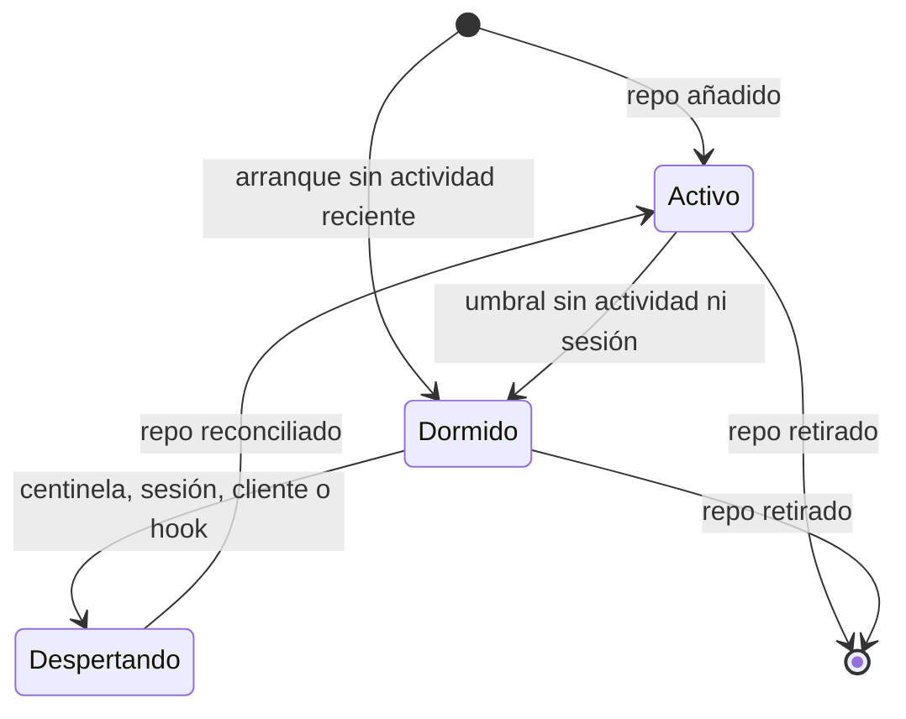

# ADR-GRP-010 — Observación de cambios en worktrees

> **Estado**: aceptado por Rene Bonilla el 2026-10-04. La [Enmienda (2026-10-07, observación por niveles)](#enmienda-2026-10-07-observación-por-niveles) está **aceptada**. **Decisión de Rene (2026-10-07)**: acepta la enmienda, incluido el diseño de centinela (un repo dormido conserva sus watchers para que un edit seguido de `reset --hard` no escape a Time Machine, Q49).

## Contexto

El motor tiene que reflejar el estado de cada worktree (rama, cambios sin commitear, ahead/behind, operaciones en curso, BR-EDGE-002) con tres exigencias que tiran en direcciones distintas:

- **Frescura**: la TUI refleja un cambio en menos de 500 ms (NFR-04); al motor le tocan 300 ms de ese presupuesto (ADR-GRP-011).
- **Escala**: 10 o más worktrees activos y repos de más de 100K commits sin degradarse (NFR-05), con agentes que generan ráfagas (instalar dependencias, compilar, reescribir cientos de archivos) y que crean y borran worktrees constantemente (BR-EDGE-001).
- **Sin huecos**: la observación es continua aunque no haya ninguna superficie abierta (BR-CONS-005, Q1, Q6). Si aun así hay un hueco, se reconcilia el estado actual y lo no visto queda "sin atribuir" (BR-EDGE-005, Q25, Q26).

Restricciones: el motor es un proceso en segundo plano por usuario (ADR-GRP-005); no escribe nada en el repo, ni siquiera transitoriamente, y no ejecuta programas del usuario (ADR-GRP-009); no instala hooks (Q22); no modifica la máquina fuera del perfil (Q17), lo que incluye los límites del kernel. Los repos en WSL quedan fuera (Q8). Con Git por debajo de 2.38 no se observa nada (Q28).

En un repo con worktrees, el directorio Git común (`.git/`) guarda refs, objetos y `packed-refs`, y cada worktree enlazado tiene su `HEAD`, su `index` y sus marcadores de operación en `.git/worktrees/<nombre>/`. El working tree de un worktree enlazado puede estar en cualquier ruta del disco (p. ej. `~/orca/workspaces/...`).

## Decisión

Recomendación aceptada por Rene Bonilla el 2026-10-03 (índice de ADRs, opción 1). El observador vive en `crates/core` y lee a través de la capa de solo lectura de `crates/git` (ADR-GRP-009).

### 1. Mecanismo

- Crate `notify` sobre las APIs nativas: **FSEvents** en macOS, **inotify** en Linux y **ReadDirectoryChangesW** en Windows. Un único watcher compartido por el proceso (en Linux, una sola instancia de inotify, que respeta `max_user_instances`). En macOS puede pasar a un watcher por worktree si se confirma la medición del punto siguiente.
- **Recreación del stream en macOS** (Enmienda 2026-10-04): con `notify` 8.2, cada `watch()` o `unwatch()` detiene y vuelve a crear el stream de FSEvents "desde ahora", y los eventos de ese intervalo se pierden **sin marca de rescan**. SPIKE-GRP-002 midió de 11 a 17 archivos perdidos en 40 recreaciones, con un archivo nuevo por milisegundo. Recrean el stream el alta y la baja de un worktree, la activación o retirada de la vigilancia de Guardrails (apartado 2) y la recreación de un watch que falló. Por eso:
  - todas esas altas y bajas de watches se agrupan (`paths_mut()`) para recrear el stream una sola vez por lote;
  - cada recreación dispara una reconciliación de todos los worktrees del stream (apartado 6), **después** de que el stream nuevo esté arrancado: si se reconciliara antes, quedaría un hueco entre el escaneo y el arranque;
  - la versión de `notify` la fija `Cargo.lock`, y el escenario de recreación de INF-GRP-002 corre en macOS en el CI y bloquea cualquier PR que suba `notify`.
  **Decisión del orquestador (2026-10-04), validada por el Arquitecto**, sobre las mitigaciones que plantea el spike:
  - **Reconciliación tras la recreación** (la de arriba): adoptada como red de seguridad obligatoria, con cualquier otra opción.
  - **Un watcher por worktree en macOS**: candidata. En `notify` cada instancia tiene su stream, así que el alta o la baja de un worktree solo recrearía el suyo; el directorio Git común se vigila una vez por repo. El "único watcher por proceso" viene del límite de instancias de inotify, que no aplica en macOS. ⚠️ **ASSUMPTION**: que los demás worktrees no pierdan eventos; se mide con el experimento de recreación del prototipo en la Dev Spec de US-GRP-002 y, si pierden 0, se adopta en macOS.
  - **Un único stream sobre un ancestro estable**: descartada. Los worktrees enlazados viven en rutas arbitrarias, así que el ancestro común puede ser `$HOME` o `/`: el volumen de eventos y la observación de todo `$HOME` no son aceptables, y el ancestro cambia cuando se da de alta un worktree fuera de él.
  - **Otro backend**: descartada. Watchman choca con NFR-06; kqueue necesita un descriptor por archivo y no escala a 10 worktrees de 5.000 archivos; el sondeo ya es el modo degradado.
  - **Fijar la versión de `notify`**: como control (punto anterior), no como solución: ninguna versión publicada evita la recreación.
  - **Integración propia con FSEvents que reanuda desde el último `FSEventStreamEventId`**: optimización posterior al MVP, solo si el dogfooding muestra que las reconciliaciones por recreación degradan la atribución o la CPU.
- El watcher solo abre handles de lectura o de notificación; nunca escribe ni crea archivos en el repo (ADR-GRP-009). En Windows, los handles de directorio se abren con borrado compartido.

### 2. Qué se vigila

| Ruta | Profundidad | Para qué |
|---|---|---|
| Working tree de cada worktree (raíz) | Recursiva, sin directorios ignorados en Linux | Cambios sin commitear |
| `.git/` común: `HEAD`, `index`, `packed-refs`, `ORIG_HEAD`, `MERGE_HEAD`, `CHERRY_PICK_HEAD`, `REVERT_HEAD`, `BISECT_LOG`, `rebase-merge/`, `rebase-apply/` | Archivos y marcadores concretos | Rama, preparación y operaciones en curso del worktree principal |
| `.git/refs/` y `.git/logs/` | Recursiva | Commits, ramas, tags, stash y ramas remotas conocidas (base de los eventos de Git) |
| `.git/worktrees/` y cada `.git/worktrees/<nombre>/` | Un nivel más sus marcadores | Alta y baja de worktrees, y `HEAD`, `index` y operaciones en curso de cada worktree enlazado |
| `.git/objects/` | No se vigila | Ruido sin valor: los commits se detectan por refs y reflogs |
| Archivos de configuración de los niveles personales (ADR-GRP-007) | Archivos concretos | Recarga de configuración (solo lectura). El nivel de equipo se lee de objetos commiteados y se recarga por los cambios de refs y `HEAD` de las filas anteriores (ADR-GRP-007, Enmienda 2026-10-04) |
| **Solo en repos protegidos por Guardrails**: `<git-common-dir>/config`, el `config.worktree` de cada worktree (`<git-common-dir>/config.worktree` y `<git-common-dir>/worktrees/<nombre>/config.worktree`) y `<git-common-dir>/gitraptor/` | Archivos concretos; `gitraptor/`, recursiva | Detección de pérdida de la protección: `core.hooksPath` reescrito o añadido en un `config.worktree`, dispatchers editados o carpeta borrada (Enmienda 2026-10-04; ADR-GRD-005 § 4). El motor solo notifica; la comprobación es de Guardrails |

- **Altas y bajas de worktrees**: un directorio nuevo en `.git/worktrees/` lanza la lectura de su `gitdir` y el alta del watch de su working tree, sin intervención del desarrollador. La desaparición del directorio o de su working tree lanza la baja (ver apartado 6).
- **Validación del worktree enlazado (SEC-11, M2)**: `.git/worktrees/<nombre>/gitdir` lo puede escribir un agente. Antes de vigilar, el motor exige que el enlace sea **bidireccional** (el `.git` del working tree apunta de vuelta a ese `.git/worktrees/<nombre>`) y que la raíz **no sea `/`, `$HOME`, la raíz de una unidad ni un ancestro del repo**. Si no cumple, el worktree se reporta "no disponible" con el motivo y no se vigila. Las rutas UNC o de red no se vigilan sin acción explícita del desarrollador (M9).
- **Tope de watches por repo**: además del límite del SO, cada repo tiene un tope de watches (⚠️ **ASSUMPTION**: valor fijado en SPIKE-GRP-002); al superarlo, el worktree pasa a modo degradado (apartado 5) en vez de consumir los watches de los demás repos. En macOS el tope no aplica: FSEvents usa un único stream sin watches por directorio (SPIKE-GRP-002: el proceso pasa de 4 a 9 descriptores con 10 worktrees). El valor para Linux sigue pendiente de la medición de SPIKE-GRP-002 en ese SO.
- **Filtros**: los eventos de rutas ignoradas por Git se descartan antes del debounce. Las reglas de ignore (`.gitignore`, `.git/info/exclude`, `core.excludesFile`) se leen con `gix` y se recargan cuando cambia cualquiera de esos archivos. Directorios pesados como `target/` o `node_modules/` no tienen trato especial: se excluyen porque y solo si Git los ignora; si no están ignorados, sus cambios son cambios del usuario y se observan.
- **Linux**: inotify no es recursivo, así que se registra un watch por directorio no ignorado, al recorrer el árbol y al aparecer directorios nuevos. El escaneo de un directorio recién creado se hace de inmediato para no perder archivos creados antes de registrar su watch.

### 3. Debounce

- **Ventana fija por worktree, no deslizante**: el primer evento abre una ventana de 75 ms (ADR-GRP-011); al cerrarse, se recomputa con todas las rutas acumuladas. Los eventos que llegan durante el recomputo abren la ventana siguiente. Una ráfaga continua produce una publicación cada ciclo, en lugar de posponerla hasta que la ráfaga acaba: la espera máxima por debounce está acotada.
- Ventanas independientes por worktree: la ráfaga de un worktree no retrasa a los demás (SPIKE-GRP-002: con una ráfaga de 10K archivos en un worktree, los otros nueve publican en 95 ms p95).
- **Holgura del temporizador** (Enmienda 2026-10-04): el temporizador del SO se despierta tarde (SPIKE-GRP-002 en macOS: hasta 10 ms; una ventana programada de 75 ms dura 85 ms p95). La ventana se programa con la holgura descontada, medida por SO, para que su duración efectiva sea de 75 ms, y sin espera activa. ADR-GRP-011 § 2 presupuesta la duración efectiva. ⚠️ **ASSUMPTION**: la holgura es una constante por SO que calibra el banco (INF-GRP-002). Está sin decidir si basta o si hace falta calibrarla en tiempo de ejecución. En ambos casos, la Validación mide la duración efectiva (`t_recv` → `t_flush`).

### 4. Recomputo incremental

- **Eventos del working tree**: solo se recalcula el estado de las rutas tocadas, con una caché de stat en memoria del motor por worktree (nunca en el repo, ADR-GRP-009) que evita volver a leer contenido sin cambios. (Enmienda 2026-10-04, Cockpit: el conjunto completo de rutas sin commitear se mantiene en memoria para el predictor; ver la sección final.)
- **`index` del worktree**: recálculo del estado completo de ese worktree (lo preparado puede haber cambiado entero).
- **Refs, `HEAD` y reflogs**: relectura de las refs afectadas; ahead/behind solo si cambió la punta de la rama o la base, con caché por par de commits.
- **Operaciones en curso**: relectura de los marcadores para reportar el estado especial (BR-EDGE-002). (Enmienda 2026-10-04, Cockpit: también el estado en conflicto; ver la sección final.)
- **Escala de historia (100K commits)**: ahead/behind se calcula con un recorrido acotado desde la base de fusión, usando el `commit-graph` del repo si existe, solo para leerlo (nunca se escribe, ADR-GRP-009).
- **Ahead/behind fuera del primer evento** (Enmienda 2026-10-04): sin `commit-graph`, una rama a 50K commits de la base cuesta 145 ms p50 (SPIKE-GRP-002, medido con `git rev-list`; el coste con `gix` está sin medir), casi todo el presupuesto de cómputo. Por eso ahead/behind no entra en el presupuesto del primer evento:
  - se publica en la segunda fase, con caché por par de commits;
  - se calcula en proceso con la primitiva `ahead_behind` de `crates/git` (TS-GRP-002: recorrido con `gix`, acotado por un límite), sin lanzar un proceso de Git por cada cambio de punta. ⚠️ **ASSUMPTION**: que `gix` cueste lo mismo o menos que `git rev-list`, que es lo que se midió (ver Validación). Hasta medirlo, `git rev-list --count --left-right` de la allowlist (ADR-GRP-009) se mantiene como alternativa.
- **Cachés de `gix` por repo** (Enmienda 2026-10-04): la instancia de repo y sus cachés de objetos se comparten entre los worktrees de un mismo repo, que comparten la base de objetos, en lugar de abrir una por worktree. SPIKE-GRP-002 midió hasta 200 MiB de RSS con 10 worktrees y una instancia por worktree (cota superior que incluye el banco), y la duplicación de cachés es la causa probable. El presupuesto de las cachés lo fija la Dev Spec de US-GRP-002, y el RSS aislado lo mide INF-GRP-002 (HUELLA en `non-functional.md`).
- **Publicación en dos fases**: si un cambio grande (p. ej. un checkout de miles de archivos) no cabe en el presupuesto de cómputo, el motor publica primero lo barato (rama, `HEAD`, operación en curso) y después los recuentos (ADR-GRP-011). Cuando hay que recalcular ahead/behind, este también va en la segunda fase, aunque el cambio sea pequeño (punto anterior).

### 5. Sondeo de respaldo y modo degradado

- **Sondeo ligero de respaldo** para cada worktree observado por eventos (⚠️ **ASSUMPTION**: cada 30 s): compara una huella barata (oid de `HEAD`, tamaño y mtime de `index` y `packed-refs`, marcadores de operación) con la última conocida. Si difiere sin que haya llegado un evento, lanza una reconciliación de ese worktree. Cubre eventos perdidos o fusionados por el SO **que tocan metadatos de Git** (commit, checkout, `git add`, ramas).
  - **Alcance** (Enmienda 2026-10-04): la huella no detecta un cambio del working tree cuyo evento se perdió (SPIKE-GRP-002: 4 de 7 no recuperados por el sondeo). Esos cambios se recuperan con los disparadores de reconciliación del apartado 6, incluida la reconciliación periódica (punto siguiente).
- **Reconciliación periódica de baja frecuencia** (Enmienda 2026-10-04; decisión del orquestador, validada por el Arquitecto): cada worktree observado por eventos se reconcilia por completo, por stat, cada 5 min (⚠️ **ASSUMPTION**; mínimo 60 s), con los worktrees escalonados. Sin ella, un cambio cuyo evento se perdió sin marca, en un archivo que nadie vuelve a tocar, deja el estado obsoleto indefinidamente (BR-CONS-005), y en Linux y Windows las causas de pérdida siguen sin medir. Coste en macOS: unos 18 ms por worktree de 5.000 archivos, alrededor del 0,006% de un núcleo con 10 worktrees. Reglas:
  - se ejecuta en la misma tarea serializada del worktree, después de vaciar su ventana de debounce, para que los eventos en vuelo no aparezcan como huecos falsos;
  - lo que encuentra se publica "sin atribuir" en un hueco de causa "reconciliación periódica", desde la reconciliación anterior hasta ahora (ADR-GRP-013 § 1); la obsolescencia en el peor caso es igual al intervalo;
  - no se ejecuta en los worktrees en modo degradado, que ya leen el estado completo;
  - el motor cuenta las reconciliaciones periódicas que encontraron diferencias y lo expone como diagnóstico: un valor mayor que 0 en dogfooding señala una causa de pérdida sin identificar;
  - el intervalo se configura en los niveles perfil y local, nunca en el de equipo (ADR-GRP-007).
- **Modo degradado por worktree**: cuando no se puede vigilar por eventos, ese worktree pasa a sondeo frecuente (⚠️ **ASSUMPTION**: cada 2 s, con el estado completo por stat) y el motor expone "observación degradada" con el motivo. Ocurre si se agota el límite de watches de inotify, en sistemas de archivos de red o sin notificaciones, o si falla el registro del watch. En modo degradado NFR-04 no se garantiza, pero la observación sigue sin huecos. Coste medido en macOS (SPIKE-GRP-002): 17,6 ms p50 por ciclo en un worktree de 5.000 archivos, es decir, un 8,8% de un núcleo con 10 worktrees degradados cada 2 s. Crece de forma lineal con los archivos. Si el intervalo pasa a adaptarse al número de archivos lo decide la Dev Spec de US-GRP-002, con la medición de INF-GRP-002 en worktrees de más de 5.000 archivos (Enmienda 2026-10-04).
- **Límites de inotify**: el motor estima los watches necesarios (directorios no ignorados) y los compara con `max_user_watches` leído de `/proc`. Nunca cambia `sysctl` ni ningún límite del sistema (Q17); expone el déficit y la guía para subirlo, y el Cockpit y la CLI la presentan.

### 6. Reconciliación y robustez

- **Cuándo se reconcilia por completo** (estado actual leído de cero y comparado con el último estado persistido en el perfil, ADR-GRP-013):
  - Al arrancar el motor.
  - Al volver de suspensión, detectada por la notificación de energía del SO o por un salto entre el reloj de pared y el monótono.
  - Ante un desbordamiento de la cola del watcher: `IN_Q_OVERFLOW` en inotify, `MustScanSubDirs` o eventos descartados en FSEvents y desbordamiento del búfer en ReadDirectoryChangesW. Se reconcilia el worktree afectado o todos si el SO no indica cuál.
  - Al volver a añadir un repo (Q25), al recuperar Git 2.38 o superior (S19) y al recrear un watch que falló.
  - Tras cada recreación del stream del watcher, p. ej. por el alta o la baja de un worktree en macOS (apartado 1; Enmienda 2026-10-04): se reconcilian todos los worktrees de ese stream, una vez arrancado el stream nuevo.
  - Periódicamente, cada 5 min por worktree (apartado 5; Enmienda 2026-10-04).
- **Resultado**: las diferencias encontradas se publican como eventos **"sin atribuir"** con una marca de hueco (inicio y fin del periodo no observado) para que la Time Machine sepa que no hay atribución en ese tramo (BR-EDGE-005). Nunca se atribuyen a un agente, aunque hubiera uno registrado antes del hueco.
- **Worktree o repo que desaparece** (BR-EDGE-001): el evento de borrado de la raíz, de su `gitdir` o un error del watch disparan una comprobación de existencia. Si no existe o no es accesible, se cierran sus watches de inmediato, el worktree pasa a "no disponible" y sus sesiones terminan (BR-WF-001). Cada worktree se procesa en una tarea aislada: el error de uno no detiene a los demás.
- **Windows**: los handles del watcher no deben impedir borrar ni mover un worktree. Al primer evento de borrado dentro de una raíz vigilada, o si el directorio queda pendiente de borrado, el motor cierra el handle de esa raíz y vuelve a abrirlo solo si el directorio sigue existiendo (lo valida SPIKE-GRP-002).

## Alternativas consideradas

- **Solo sondeo**: simple y sin límites del kernel, pero 10 o más worktrees por debajo de 300 ms obligan a recorrer árboles grandes varias veces por segundo, con CPU y disco constantes aunque nadie trabaje. Se mantiene solo como respaldo y modo degradado.
- **fsmonitor de Git**: el daemon integrado crea archivos y un socket en `.git` y el hook escribe la untracked cache; lo prohíbe ADR-GRP-009.
- **Watchman**: excelente a escala, pero es una dependencia externa que el usuario tiene que instalar (choca con NFR-06, binario único) y con Q17 si el motor la instalara.
- **Eventos de hooks de Claude Code o de Git**: el motor no instala hooks (Q22) y los hooks de Guardrails son solo señal adicional opcional; tampoco ven los cambios sin commitear.
- **Watcher nativo con debounce, recomputo incremental, sondeo de respaldo y reconciliación (elegida)**: única opción que cumple frescura, escala y cero huecos sin dependencias ni escrituras.

## Consecuencias

- ✅ Frescura dentro de los 300 ms del motor en el caso normal, con espera de debounce acotada aunque haya ráfagas.
- ✅ CPU casi nula en reposo: sin eventos no hay trabajo, salvo el sondeo de respaldo.
- ✅ Cero huecos silenciosos en los casos con causa detectable: lo que se pierde por la suspensión, un desbordamiento o la recreación del stream se recupera por reconciliación y queda marcado como hueco. La pérdida sin marca de un evento del working tree fuera de esos casos se recupera, como mucho, en el intervalo de la reconciliación periódica (ver el ⚠️ del sondeo de respaldo).
- ✅ Los worktrees que crean y borran los agentes se incorporan y se retiran solos.
- ⚠️ En Linux, repos con muchos directorios no ignorados pueden agotar `max_user_watches` (por defecto 8192 en kernels antiguos; proporcional a la RAM desde 5.11). **Mitigación**: estimación previa, modo degradado por worktree y guía para subir el límite; el motor nunca lo cambia (Q17).
- ⚠️ Un desbordamiento durante una sesión activa produce un micro-hueco cuyos cambios quedan "sin atribuir", lo que reduce la atribución de Claude Code. **Mitigación**: búfer amplio del watcher, filtrado temprano de ignorados y medición de la frecuencia en SPIKE-GRP-002. ADR-GRP-012 puede reatribuir el hueco solo si tiene evidencia independiente del watcher, nunca por suposición.
- ⚠️ FSEvents fusiona eventos y su latencia configurable compite con el presupuesto de detección (≤ 50 ms). **Mitigación**: latencia del stream mínima (0,0, la que usa `notify`) y eventos por archivo. SPIKE-GRP-002 midió una detección de 12,2 ms p95, y la fusión nunca dejó un estado final incorrecto.
- ⚠️ En macOS, cada alta o baja de un worktree recrea el stream de FSEvents y abre un micro-hueco silencioso en todos los worktrees (Enmienda 2026-10-04). **Mitigación**: altas y bajas agrupadas y reconciliación tras cada recreación (apartados 1 y 6). Los cambios de ese tramo quedan "sin atribuir".
- ⚠️ El sondeo de respaldo no ve los cambios del working tree con eventos perdidos sin marca. **Mitigación**: disparadores de reconciliación del apartado 6, incluida la recreación del stream, y reconciliación periódica cada 5 min (apartado 5), que acota la obsolescencia a ese intervalo. Su contador de diferencias encontradas dice en dogfooding si hay causas de pérdida sin identificar.
- ⚠️ En Windows, un handle abierto sobre la raíz puede hacer fallar `git worktree remove` o un borrado del agente. **Mitigación**: cierre del handle al primer borrado (apartado 6); si SPIKE-GRP-002 muestra que no basta, se vigila desde el directorio padre o se pasa ese worktree a sondeo.
- ⚠️ El sondeo de respaldo y el modo degradado añaden carga en máquinas con muchos worktrees. **Mitigación**: huella barata y solo por stat; intervalos configurables en los niveles perfil y local, nunca en el de equipo (ADR-GRP-007).
- ⚠️ El arranque con 10 o más worktrees en repos grandes hace una reconciliación completa costosa. **Mitigación**: reconciliación en paralelo por worktree, con el estado previo del perfil publicado primero como "reconciliando"; el arranque no cuenta para NFR-04.

## Validación

**SPIKE-GRP-002** (prototipo aislado, en los tres SO) confirma o invalida este ADR antes de que US-GRP-002 entre en desarrollo:

- **Latencia**: p95 de detección SO → motor ≤ 50 ms y del ciclo completo del motor ≤ 300 ms (ADR-GRP-011), con un archivo modificado, un `git add`, un commit, un checkout y la creación y el borrado de un worktree.
- **Debounce**: duración efectiva de la ventana (`t_recv` → `t_flush`) de 75 ms en p95 en cada SO, con la holgura calibrada (apartado 3).
- **Ahead/behind con `gix`**: coste en proceso en una rama a 50K commits de la base, con y sin `commit-graph`, comparado con `git rev-list --count --left-right`. Hasta tener esta medición, la alternativa de la allowlist se mantiene (apartado 4).
- **Escala**: 10 worktrees de un repo de 100K commits o más, con ráfaga de 10K archivos en uno de ellos; se miden watches usados, memoria, CPU en reposo y p95 de los otros nueve durante la ráfaga.
- **Huecos**: suspensión y reanudación, desbordamiento forzado de la cola con búfer reducido, watcher reiniciado, y alta y baja de worktrees con escrituras concurrentes en los demás (recreación del stream, Enmienda 2026-10-04), y un evento descartado sin marca en un archivo que no se vuelve a tocar, que recupera la reconciliación periódica dentro de su intervalo; en todos los casos la reconciliación detecta el 100% de los cambios y los marca "sin atribuir".
- **Watcher por worktree en macOS** (Enmienda 2026-10-04): con el experimento de recreación, un worktree dado de alta o de baja no hace perder eventos a los demás. Si se cumple, se adopta (apartado 1).
- **Windows**: `git worktree remove`, borrado y renombrado de la raíz y de archivos con el watcher activo, sin fallos atribuibles al motor.
- **Linux**: comportamiento al agotar `max_user_watches` (modo degradado, sin caída del resto).
- **Seguridad (SEC-11)**: un `gitdir` manipulado hacia `$HOME` o `/`, o sin enlace de vuelta, no se vigila y el worktree queda "no disponible"; un repo que supera el tope de watches pasa a degradado sin afectar a otros; una ruta UNC no abre conexiones SMB. Los tests de seguridad viven en INF-GRP-001.

**Éxito**: todas las cifras dentro de presupuesto en los tres SO. **Fracaso**: si una no se cumple, se revisa este ADR (p. ej. sondeo por defecto en el SO afectado o vigilancia desde el padre en Windows) y, si cambia el reparto, también ADR-GRP-011. Después, INF-GRP-002 convierte estas mediciones en gate de CI e INF-GRP-001 comprueba que el observador no escribe nada en el repo.

**Guardrails (Enmienda 2026-10-04)**: en un repo protegido, reescribir `core.hooksPath` en `<git-common-dir>/config`, añadirlo al `config.worktree` de un worktree, editar un dispatcher o borrar `<git-common-dir>/gitraptor/` llega a Guardrails como notificación dentro de su objetivo (⚠️ **ASSUMPTION** de ADR-GRD-005 § 4: ≤ 5 s); en un repo no protegido esas rutas no se vigilan. No forma parte de SPIKE-GRP-002: lo valida ADR-GRD-005 (Validación 2) con el observador de este ADR.

## Referencias

- Requerimiento: `docs/requirements/features/motor-local/context.md` (Q1, Q6, Q8, Q17, Q21, Q22, Q25, Q26, Q28; supuestos S4 y S19).
- Reglas: BR-CONS-005, BR-EDGE-001, BR-EDGE-002, BR-EDGE-005, BR-WF-001.
- BRD: NFR-04, NFR-05, NFR-06.
- ADRs: ADR-GRP-001 (watcher en el core), ADR-GRP-005 (proceso por usuario), ADR-GRP-007 (configuración), ADR-GRP-009 (frontera de solo lectura), ADR-GRP-011 (presupuesto), ADR-GRP-012 (atribución), ADR-GRP-013 (eventos y huecos persistidos).
- Historias técnicas: SPIKE-GRP-002 (valida), INF-GRP-002 (banco de frescura y escala), INF-GRP-001 (repo intacto).
- Documentación: crate `notify`; Apple File System Events; `inotify(7)`; Win32 `ReadDirectoryChangesW`.

## Revisión de seguridad (2026-10-03)

Enmienda tras la revisión del security-expert. No cambia el mecanismo ni el reparto de presupuesto.

| Hallazgo | Cómo se cubre |
|---|---|
| M2 · `gitdir` escribible por un agente permite vigilar `$HOME` o `/` | Apartado 2: enlace `gitdir` bidireccional, raíces prohibidas (`/`, `$HOME`, raíz de unidad, ancestros del repo) y tope de watches por repo (SEC-11) |
| M9 · Rutas UNC en Windows | Apartado 2: no se vigilan sin acción explícita del desarrollador (SEC-11) |

Validación ampliada: SEC-11 (punto "Seguridad").

## Enmienda (2026-10-04, Guardrails)

Aplicada desde la tabla de enmiendas de [non-functional-guardrails.md](../non-functional-guardrails.md) (J10). No cambia el mecanismo, el debounce, el sondeo ni la reconciliación. El `status` siguió en `proposed` hasta su aceptación (Rene Bonilla, 2026-10-04).

| Cambio | Dónde | Fuente |
|---|---|---|
| Vigilar `<git-common-dir>/config`, el `config.worktree` de cada worktree y `<git-common-dir>/gitraptor/` en los repos protegidos | § 2 (tabla); Validación | ADR-GRD-005 § 4 |
| Aclaración derivada de la Enmienda de ADR-GRP-007: la fila de configuración cubre los niveles personales; el nivel de equipo se recarga por refs y `HEAD`, que ya se vigilan (sin rutas nuevas) | § 2 (tabla) | ADR-GRP-007, ADR-GRD-004 § 1 |

## Enmienda (2026-10-04, SPIKE-GRP-002)

Aplicada desde las recomendaciones de [SPIKE-GRP-002-resultados.md](../../requirements/features/motor-local/research/SPIKE-GRP-002-resultados.md) (§ 6), que se midieron **solo en macOS**. No cambia el mecanismo elegido. El `status` sigue en `accepted`: la enmienda no cambia la decisión aceptada por Rene Bonilla. Linux y Windows siguen pendientes de la Validación. En macOS también quedan sin verificar la suspensión y reanudación reales y el desbordamiento forzado (Resultados § 3.6).

| Cambio | Dónde | Fuente |
|---|---|---|
| Recreación del stream de FSEvents con `notify` 8.2: altas y bajas agrupadas y reconciliación tras cada recreación; reanudar desde el último `FSEventStreamEventId` queda como optimización | § 1, § 6, Consecuencias, Validación (escenario de huecos) | Resultados § 3.6 |
| Tope de watches por repo: no aplica en macOS; el valor para Linux sigue pendiente | § 2 | Resultados § 3.4 |
| Ventana con la holgura del temporizador descontada (duración efectiva de 75 ms) | § 3 | Resultados § 3.2; ADR-GRP-011 § 2 |
| Ahead/behind fuera del presupuesto del primer evento: segunda fase, con caché y en proceso con `gix` | § 4 | Resultados § 3.11 |
| Alcance del sondeo de respaldo (solo metadatos de Git) y coste medido del modo degradado | § 5, Consecuencias | Resultados § 3.5 y § 3.6 |
| Revisión de coherencia: la consecuencia "cero huecos silenciosos" se limita a los casos con causa detectable; ahead/behind va en la segunda fase también en cambios pequeños; la cifra de 145 ms se midió con `git rev-list` | Consecuencias, § 4 | Revisión del Arquitecto (2026-10-04) |
| Ahead/behind en proceso con `gix` marcado como ⚠️ ASSUMPTION; Validación nueva con una rama a 50K commits de la base, con y sin `commit-graph`; `git rev-list` de la allowlist como alternativa hasta medirlo | § 4, Validación | Resultados § 3.11; Artifact Judge (reservas) |
| Holgura del temporizador: constante por SO calibrada por el banco (INF-GRP-002), como ⚠️ ASSUMPTION; Validación de la duración efectiva de la ventana | § 3, Validación | Resultados § 3.2; Artifact Judge (reservas) |
| Mitigación de la recreación del stream decidida: reconciliación obligatoria tras arrancar el stream nuevo; altas, bajas, Guardrails y watches recreados en un solo lote; `notify` fijado por `Cargo.lock` con el escenario de recreación como gate de CI en macOS; un watcher por worktree en macOS como candidata a medir; ancestro común y otro backend descartados; reanudar desde `FSEventStreamEventId` como optimización posterior al MVP | § 1, § 6, Validación | Resultados § 3.6; decisión del orquestador (2026-10-04), validada por el Arquitecto |
| Reconciliación periódica de baja frecuencia (5 min, mínimo 60 s, ⚠️ ASSUMPTION) tras vaciar el debounce, con hueco de causa propia y contador de diferencias; sustituye a "valorarla si el dogfooding la pide" | § 5, § 6, Consecuencias, Validación | Resultados § 3.5 y § 3.6; decisión del orquestador (2026-10-04), validada por el Arquitecto |
| Ahead/behind con la primitiva `ahead_behind` de `crates/git` (TS-GRP-002), en proceso | § 4 | Resultados § 3.11; revisión del Arquitecto (2026-10-04) |
| Cachés de `gix` por repo, compartidas entre sus worktrees; RSS aislado medido en INF-GRP-002 | § 4 | Resultados § 3.4 (memoria); decisión del orquestador (2026-10-04), validada por el Arquitecto |
| Intervalo adaptativo del modo degradado: lo decide la Dev Spec de US-GRP-002 con la medición de INF-GRP-002 | § 5 | Resultados § 3.5 |
| Causas de hueco nuevas (recreación del stream, desbordamiento, reconciliación periódica) llevadas al modelo de ADR-GRP-013 | § 6 | ADR-GRP-013, Enmienda (2026-10-04, SPIKE-GRP-002) |

## Enmienda (2026-10-04, Cockpit)

Aplicada desde DEP-CKP-14 y la parte de rutas de DEP-CKP-1 de [CTX-CKP-001](../../requirements/features/cockpit/context.md), con [ADR-CKP-001](./ADR-CKP-001-prediccion-conflictos-merge-en-seco.md) § 3 y § 9 y [ADR-CKP-002](./ADR-CKP-002-catalogo-operaciones-ejecutor.md) § 9 (accepted 2026-10-04). **Decisión del orquestador (2026-10-04), validada por Arquitecto**; el PO valida el alcance después. No cambia el mecanismo, el debounce, el sondeo ni la reconciliación, y no añade rutas vigiladas. El `status` sigue en `accepted`.

| Cambio | Dónde | Fuente |
|---|---|---|
| Estado en conflicto: con una operación en curso, el recomputo lee también las rutas sin fusionar y los oids de la operación | § 4 | DEP-CKP-14; ADR-CKP-002 § 9; ADR-CKP-001 § 9 |
| El conjunto completo de rutas sin commitear por worktree se mantiene en memoria y lo consume el predictor, sin persistirlo ni publicarlo | § 4 | DEP-CKP-1; ADR-CKP-001 § 3 |

**Estado en conflicto** (DEP-CKP-14):

- **Cuándo**: con un merge, rebase, cherry-pick o revert en curso en el worktree (marcadores de BR-EDGE-002). Lo disparan los cambios del índice y de los marcadores, que ya se vigilan (§ 2).
- **Qué se lee**, en solo lectura con `gix` (ADR-GRP-009 § 2, "leer marcadores de operación en curso"): las **rutas sin fusionar** (entradas del índice con etapa mayor que 0) y los oids de la operación: `MERGE_HEAD` en un merge, y `onto` y la rama de origen en un rebase.
- **Topes**: ⚠️ **ASSUMPTION**: hasta 1.000 rutas por worktree; por encima, "truncado" con el total. Las rutas son texto no confiable (SEC-12).
- **Publicación**: con el estado especial del worktree, en la primera fase (§ 4), en la instantánea y en el stream. La entrada y la salida del estado en conflicto se ven como cambios del estado del worktree (ADR-GRP-013, Enmienda (2026-10-04, Cockpit)). Lo consumen la TUI (operación detenida, BR-CKP-EDGE-002) y el registro del KPI de ADR-CKP-001 § 9 ("conflicto real").
- **Forma del contrato**: **pendiente, dueño: worker del canal (TS-GRP-004)**.

**Rutas sin commitear completas** (ADR-CKP-001 § 3): el recomputo ya calcula el conjunto completo de rutas sin commitear de cada worktree. Ese conjunto se mantiene **en memoria** junto a la caché de stat y se entrega al predictor de `crates/core`. No se persiste (el último estado conocido sigue guardando solo la huella, ADR-GRP-013 § 1) y no se publica: el contrato no cambia. ⚠️ **ASSUMPTION** de ADR-CKP-001: con más de 10.000 rutas por worktree, el solape de ese worktree se publica como "parcial"; la cifra la fija SPIKE-CKP-001. El coste en memoria entra en la medición de HUELLA de INF-GRP-002.

**Validación añadida**: un merge que choca en un worktree temporal publica sus rutas sin fusionar y el oid de `MERGE_HEAD`; al abortarlo, el estado en conflicto desaparece; un rebase detenido publica `onto`. El repo queda intacto (INF-GRP-001).

## Enmienda (2026-10-05, US-GRP-002)

Aplicada desde la [Dev Spec de US-GRP-002](../../requirements/features/motor-local/dev-specs/US-GRP-002-dev-spec.md). **Decisión del orquestador (2026-10-05), validada por el Arquitecto.** No cambia el mecanismo elegido. El `status` sigue en `accepted`.

| Cambio | Dónde | Fuente |
|---|---|---|
| **Un watcher por raíz vigilada en macOS, adoptado.** El experimento `stream_isolation` del prototipo midió 0 archivos sin evento en el worktree vecino con 80 recreaciones de stream (17.592 archivos), frente a 89 perdidos con el watcher compartido (18.137 archivos). Se cumple la condición del § 1. La reconciliación tras crear un stream se mantiene como red de seguridad. Linux y Windows siguen con un watcher compartido | § 1, Validación ("Watcher por worktree en macOS") | Dev Spec US-GRP-002 § 1; `spikes/watcher-viability/results/results-macos-stream-isolation.json` |
| **Recomputo completo por ventana en el MVP**: el hilo del worktree relee `HEAD` y el status completo con `crates/git`, sin la caché de stat incremental del § 4. SPIKE-GRP-002 midió ~18 ms por status de 5.000 archivos, dentro de los 150 ms de cómputo. La caché de stat y la publicación en dos fases se añaden si INF-GRP-002 muestra que no cabe | § 4 | Dev Spec US-GRP-002 D4 |
| **Filtro previo de ignorados con caché de directorios**: cada directorio se consulta a las reglas de Git (`gix`) una vez; la caché se vacía al cambiar un `.gitignore` o `info/exclude`. Cumple el § 2 ("se descartan antes del debounce") sin consultar Git por evento: una ráfaga sostenida en un directorio ignorado no provoca recomputos | § 2 (Filtros) | Dev Spec US-GRP-002 D4; revisión del Arquitecto (CPU con `target/`) |
| **Cachés de `gix` por repo**: no hay cachés persistentes que compartir. El lector se abre por recomputo y se suelta (ADR-GRP-009, `crates/git`), así que los worktrees de un repo no duplican memoria entre recomputos. Si INF-GRP-002 muestra que abrirlo no cabe en el presupuesto, se pasa a una instancia por repo | § 4 | Dev Spec US-GRP-002 D3 |

## Enmienda (2026-10-05, INF-GRP-002)

Aplicada desde la [Dev Spec de INF-GRP-002](../../requirements/features/motor-local/dev-specs/INF-GRP-002-dev-spec.md), con las cifras del banco en el Mac de Rene y en los runners de CI de macOS y Linux. **Decisión del orquestador (2026-10-05), validada por el Arquitecto y el PO.** No cambia el mecanismo. Aparta un gate de lo que Rene aceptó (ver ADR-GRP-011, Enmienda INF-GRP-002), y por eso se le nombra aquí. El `status` sigue en `accepted`.

| Cambio | Dónde | Fuente |
|---|---|---|
| **Holgura del temporizador: basta una constante por SO**, sin calibración en ejecución. Linux: 0,2 ms p95, con la constante 0 correcta (debounce efectivo de 75,4 ms). Mac real: 5 ms p95; la constante de 10 ms deja una ventana efectiva de 70 ms, que sobrecompensa sin daño. El ⚠️ ASSUMPTION del § 3 queda resuelto en macOS; en Linux, pendiente de la etapa multiplataforma | § 3 | Dev Spec, D4 |
| **Invariante refutada en macOS**: "la ráfaga de un worktree no retrasa a los demás" no se cumple. Con 1.000 archivos, el p95 del motor en los demás llega a 336 ms en el Mac y a 627 ms en el runner; con 10.000, a 496 ms en el Mac. Sin daemon, la misma ráfaga no degrada `git status`, así que el cuello está dentro del motor. En Linux se cumple (193 ms). Lo corrige TD-GRP-002, lo que activa el disparador de la Enmienda US-GRP-002 (caché de stat y dos fases) | § 3, § 4 | Dev Spec, § 6.1; [TD-GRP-002](../../requirements/features/motor-local/technical-stories/TD-GRP-002-motor-bajo-rafaga.md) |
| **Ahead/behind con `gix`**: con `commit-graph` empata con `git rev-list` (Mac: 30 y 34 ms). Sin él es más lento (Mac: 297 y 281 ms; Linux: 429 y 191 ms). El ASSUMPTION del § 4 queda refutado sin `commit-graph`; como va en la segunda fase, no afecta a NFR-04, y si conviene volver a `git rev-list` sin `commit-graph` se decide en dogfooding | § 4 | Dev Spec, § 6.4 |
| **Riesgo nuevo**: el temporizador del runner de macOS (VM) se despierta de 92 a 147 ms tarde. Un daemon arrancado por launchd con QoS de fondo podría sufrir el mismo coalescing de timers. Pendiente de verificar en dogfooding con el autoarranque | § 3, Consecuencias | Dev Spec, § 6.3; TD-GRP-002 |

## Enmienda (2026-10-07, observación por niveles)

> **Estado de la enmienda**: **aceptada.** **Decisión de Rene (2026-10-07)**: acepta la enmienda tal como está, incluido el diseño de centinela que corrige la propuesta B (Q49). El `status` del ADR sigue en `accepted`, porque para los repos activos el mecanismo no cambia. Pero la enmienda cambia lo que Rene aceptó el 2026-10-04 en dos puntos: un repo dormido deja de procesar sus eventos y de reconciliarse cada 5 min, y lo hace de una forma distinta de la que él propuso el 2026-10-06 (ver "Discrepancia con la propuesta B"). Por eso necesitaba su aceptación, que ya está dada.

Origen: propuesta B de Rene Bonilla (2026-10-06), preocupado por tener más de 100 repos clonados; propuesta A1, que el PO recoge en BR-AUTH-003 y US-GRP-020 a 022; y la condición del PO en Q49 ("dormir no puede reducir la protección"). **Decisión del orquestador (2026-10-07), validada por el Arquitecto**, con las correcciones de cada punto. La implementa [TS-GRP-006](../../requirements/features/motor-local/technical-stories/TS-GRP-006-observacion-por-niveles.md). El descubrimiento lo implementan las historias del PO, porque tiene un resultado observable ("¿Observar *x*?"). Objetivos: RES-11, RES-12 y SEC-15 de [non-functional.md](../non-functional.md).

| Cambio | Dónde | Fuente |
|---|---|---|
| **Niveles por repo**: activo, despertando y dormido. NFR-04 solo rige en los activos | N1 | Propuesta B; ADR-GRP-011 (Enmienda 2026-10-07) |
| **Un repo dormido conserva sus vigilancias como centinela**: no procesa eventos, y el primero lo despierta. Lo que se ahorra es el trabajo periódico, el almacén abierto y el estado residente | N1, N2 | Condición Q49 del PO; NFR-01; corrige la propuesta B ("sin watchers") |
| **Redes de seguridad de los dormidos**: barrido de metadatos cada 120 s y reconciliación lenta con presupuesto. El sondeo de respaldo de 30 s y la reconciliación periódica de 5 min solo corren en los activos | N3; § 5 | Propuesta B |
| **Despertar**: el repo reconcilia por completo con las vigilancias que nunca se retiraron, así que no hay hueco | N4; § 6 | Revisión del Arquitecto |
| **Huecos**: los cambios que señala el centinela no son un hueco. Lo que encuentra una red de seguridad sin que el centinela lo señalara sí lo es, con la causa `dormant` | N5; § 6 | BR-CONS-005, BR-EDGE-005; ADR-GRP-013 (Enmienda 2026-10-07) |
| **Descubrimiento en raíces**: primer nivel sin recursión, raíces en el perfil gestionadas solo con comandos reservados y nada por MCP. `$HOME` se admite como raíz amplia con confirmación y exclusiones fijas (**Decisión de Rene (2026-10-07)**) | N6; § 2 | BR-AUTH-003; SEC-15; SEC-MCP-01 |
| **Claves** `engine.observation.*` | N7 | ADR-GRP-007 |
| **Contrato aditivo**: nivel por repo, bloque `observation` de `engine.resources` y métodos de descubrimiento | N8 | ADR-GRP-015 § 4; ADR-GRP-016 § 1 |

### Discrepancia con la propuesta B

Rene propuso que un repo dormido no tuviera watchers y que solo se sondearan `HEAD`, el reflog y el mtime del índice. **Con eso, dormir reduce la protección**: una edición sin commitear hecha en un repo dormido, seguida de un `reset --hard` con Git en crudo, no la ve ningún sondeo de metadatos. Guardrails no puede impedir un `reset --hard` (ADR-GRD-002), y su única mitigación es la captura por observación de la Time Machine (ADR-TMC-004 § 2), que necesita eventos. Eso incumple la condición del PO (Q49) y NFR-01.

Hay tres opciones:

- **Centinela (elegida)**: el repo dormido conserva sus vigilancias, que en reposo no gastan CPU, y la primera señal lo despierta.
- **No dormir los repos con trabajo sin commitear**: no cubre una edición nueva en un repo dormido que estaba limpio.
- **Incluir en el barrido una huella del working tree**: es un recorrido por stat de todo el árbol cada pocos minutos, que es lo que se quiere ahorrar, y aun así no llega antes que un `reset --hard`.

**Qué se ahorra entonces.** Un repo observado en reposo no gasta CPU por tener vigilancias: solo trabaja cuando hay eventos. Lo que no escala con 100 repos es lo demás:

- **El almacén del perfil abierto** (ADR-GRP-006): 3 descriptores por repo (la base, `-wal` y `-shm`) y hasta 2 MiB de caché de páginas. Con 100 repos son unos 300 descriptores y unos 200 MiB: no caben en RES-11 (≤ 256 y < 150 MiB).
- **El sondeo de respaldo de 30 s y la reconciliación periódica de 5 min**: unos 18 ms por cada 5.000 archivos y worktree. Con 95 repos es alrededor del 0,6 % de un núcleo en reposo, y crece con su tamaño.
- **El estado residente**: las rutas sin commitear, las cachés, la verificación periódica y las capturas de la Time Machine.

El centinela conserva la protección y elimina todo eso. **Lo que no se ahorra** son las vigilancias:

- **macOS**: un stream de FSEvents inactivo por raíz. ⚠️ **ASSUMPTION**: que `notify` no dedique un hilo por stream; si lo hace, son hilos inactivos y el banco los cuenta.
- **Windows**: un handle por raíz.
- **Linux**: los watches de inotify. No ocupan descriptores ni RSS del proceso, pero sí memoria del kernel y el cupo de `max_user_watches`, dentro del límite de RES-04 (≤ 50 %).

### N1. Niveles de observación

El nivel es **por repo**, no por worktree: los worktrees comparten el `.git` común, y un commit en uno cambia el ahead/behind de los demás.

| Nivel | Cuándo | Qué hace el motor | Frescura | Coste en reposo |
|---|---|---|---|---|
| **Activo** | Una sesión presente en algún worktree (ADR-GRP-012), un cliente suscrito a ese repo o actividad dentro del umbral (`dormantAfterHours`) | Todo lo de § 1 a § 6 | NFR-04 (≤ 300 ms el motor) | El de hoy (RES-01, RES-02, RES-04) |
| **Despertando** | Transitorio: desde un disparador (N4) hasta el fin de la reconciliación | Reconcilia; los eventos esperan en el debounce | "Reconciliando" (ADR-GRP-011 § 2), fuera de NFR-04 | — |
| **Dormido** | Ninguna de las condiciones de "activo" durante el umbral | Vigilancias como centinela (N2) y redes de seguridad (N3). Almacén cerrado y sin estado residente | El cambio despierta el repo en ≤ 2 s (RES-12). Fuera de NFR-04 | Sin CPU fuera de las redes de seguridad y sin descriptores propios del repo (RES-11) |

- **Actividad**: un evento de cambio publicado en cualquier worktree del repo, una sesión presente o una suscripción de un cliente **a ese repo**. Listar la flota (el Cockpit con todos los repos) no cuenta: si contara, despertaría los 100.
- **Un repo con una sesión presente nunca duerme.**
- **Solo duerme un repo con todos sus worktrees vigilados por eventos.** Un worktree en modo degradado (§ 5) no tiene centinela. Si durmiera, perdería la protección de la condición del PO, así que se queda activo y degradado, con su coste actual.
- **Dormir**: el daemon revisa el umbral en cada ciclo del barrido. Al dormir un repo:
  1. vacía sus ventanas de debounce;
  2. guarda la huella de N3 y la marca "procesado hasta";
  3. deja sus vigilancias como centinela;
  4. cierra su almacén del perfil;
  5. suelta su estado residente (rutas sin commitear, cachés).

  No se retira ni se recrea ninguna vigilancia, así que en macOS no hay recreaciones del stream (§ 1).
- **Al arrancar el daemon**:
  - Un repo añadido, o vuelto a añadir, arranca activo.
  - Un repo cuya última actividad persistida supera el umbral arranca dormido: registra sus vigilancias, compara la huella de N3 con la persistida y despierta solo si difiere.

  Así, arrancar con 100 repos no supone 100 reconciliaciones completas (Consecuencias de este ADR, "arranque costoso"). Lo que cambió en el working tree con el daemon parado lo encuentra la reconciliación lenta (N3), como un hueco de causa "daemon parado" (ADR-GRP-013).

### N2. Centinela

- Las vigilancias del repo dormido son las mismas de § 2, ya registradas. Del working tree, del `.git` común y, en un repo protegido, de lo que vigila Guardrails.
- **Un evento de un repo dormido no se procesa**: pasa el filtro de ignorados de § 2, y el primero que lo supera despierta el repo (N4). No abre ventana de debounce, no recomputa y no abre el almacén.
- Una ráfaga en un repo dormido (un `npm install`) produce un único despertar.
- Si el centinela se desborda o falla, el repo despierta y reconcilia con un hueco de esa causa, como en un activo (§ 6).

### N3. Redes de seguridad de los dormidos

Son las mismas redes que tienen los activos (§ 5), con menos frecuencia.

- **Barrido de metadatos**: sustituye en los dormidos al sondeo de respaldo de 30 s.
  - Corre en una sola tarea para todos los repos dormidos, en clase `utility` (ADR-GRP-015 § 1), con un despertar por ciclo (RES-03). No hay un temporizador por repo.
  - La huella es solo de metadatos:
    - por worktree, el contenido de `HEAD` (≤ 4 KiB) y el tamaño y el mtime de su reflog de `HEAD`, del `index` y de los marcadores de operación;
    - por repo, `packed-refs`, `FETCH_HEAD`, la lista de `.git/worktrees/` y el mtime de los directorios de refs locales.
  - No lanza procesos `git` ni abre el repo con la capa de lectura (ADR-GRP-009): solo hace `stat` y lee `HEAD`. Si la huella difiere, despierta el repo.
  - Intervalo: `engine.observation.dormantPollSeconds` (120 s). En modo de ahorro de energía, 300 s (ADR-GRP-015 § 2).
- **Reconciliación lenta**: sustituye a la periódica de 5 min, que no corre en los dormidos.
  - Es una reconciliación completa, por stat, con un intervalo mínimo de `engine.observation.dormantReconcileMinutes` (60 min).
  - Corre escalonada, de un repo en un repo, en clase `utility`.
  - **Tiene un presupuesto**: no gasta más del 0,1 % de un núcleo de media (RES-11). El coste crece de forma lineal con los archivos. Si los dormidos no caben, el intervalo efectivo se alarga y el daemon lo expone en `engine.resources` (N8).
  - En modo de ahorro de energía, el intervalo mínimo es de 180 min.
- Si cualquiera de las dos redes encuentra una diferencia, despierta el repo.
- ⚠️ **ASSUMPTION**: las cuatro cifras (120 s, 300 s, 60 min y 180 min) y el presupuesto. Se revisan en dogfooding.

### N4. Despertar

- **Disparadores**:
  - el centinela (N2);
  - S1 encuentra una sesión de Claude Code con el cwd en un worktree del repo (ADR-GRP-012);
  - un cliente se suscribe al estado de ese repo o pide algo sobre él: la TUI abierta en el repo, `raptor status` dentro de él o una lectura MCP de un repo habilitado para el MCP;
  - el hook de Guardrails de ese repo llama al daemon;
  - una red de seguridad (N3) encuentra un cambio;
  - se vuelve a añadir el repo.

  Despertar es un efecto interno: ningún método duerme ni despierta un repo.
- **Sin hueco**: las vigilancias no se retiraron al dormir, así que lo que ocurre durante el despertar llega como eventos y espera en la ventana de debounce del worktree. Al despertar, el repo abre su almacén y reconcilia por completo todos sus worktrees, en paralelo. Después procesa la cola en la misma tarea serializada (§ 5). El orquestador propuso "reconciliar y luego activar los watchers": ese orden deja un hueco entre el escaneo y el arranque de los watchers (§ 1), y con el centinela ya no hace falta, porque los watchers no se paran.
- Mientras despierta, el repo se publica como "reconciliando", con su último estado conocido (ADR-GRP-011 § 2).
- **Objetivo** (RES-12): ≤ 2 s p95 desde el disparador hasta el estado activo publicado, con un worktree de hasta 5.000 archivos. El intervalo de escaneo de S1 no entra en esa cifra: es de ADR-GRP-012.
- **Eventos de Git**: la reconciliación del despertar los reconstruye de los reflogs con `gix`, en orden y con la hora que guarda el reflog. Así, varios commits seguidos no quedan fundidos en uno. ⚠️ **ASSUMPTION**: que la reconciliación de § 6 no lo haga ya. Si lo hace, se reutiliza.

### N5. Qué pasa con lo ocurrido en un repo dormido (BR-CONS-005, BR-EDGE-005)

- **Los cambios que señala el centinela no son un hueco.** El repo no dejó de vigilarse: el primer evento lo despertó y la reconciliación publica el cambio con su hora de llegada.
  - El actor se resuelve con las reglas de siempre (ADR-GRP-012). Como un repo con una sesión presente no duerme, lo habitual es "sin atribuir", y nunca se atribuye por suposición (BR-EDGE-004).
  - **La Time Machine** captura en cuanto el repo publica, con los mismos `Q` y `M` (ADR-TMC-004 § 2).
  - **Guardrails** no cambia: los hooks llaman al daemon igual y el snapshot `previo_hook` no depende del nivel.
- **Lo que encuentra una red de seguridad sin que el centinela lo señalara sí es un hueco**, con la causa nueva "observación en reposo" (`dormant`, ADR-GRP-013, Enmienda 2026-10-07). Es un evento perdido sin marca, como los que recupera la reconciliación periódica, y "sin atribuir". El intervalo va desde la red de seguridad anterior hasta ahora. El motor los cuenta, como la reconciliación periódica (§ 5): un valor mayor que 0 en dogfooding señala un centinela con fugas.
- **El único coste para la protección es el tiempo de despertar**:
  - la primera edición tras dormir tarda hasta 2 s más en publicarse y, por tanto, en capturarse;
  - el riesgo residual R2 de ADR-TMC-004 (de 1 a 5 s) crece en ese tiempo, y solo para esa edición.

  **Pendiente del PO**: confirmar que eso cumple su condición Q49. Si no la cumple, la alternativa es que la Time Machine capture al recibir la señal del centinela, antes de reconciliar.
- **Pendiente del PO**: BR-CONS-005 y BR-EDGE-005, con la causa `dormant`.

### N6. Descubrimiento en raíces (BR-AUTH-003)

- **Las raíces viven en el índice global del perfil** (ADR-GRP-006), como la lista de repos observados, y **no en `settings.json`**. Un agente puede escribir un archivo del perfil del usuario, y BR-AUTH-003 (condición 8) le prohíbe declarar raíces. Por eso declarar y retirar una raíz son **comandos reservados** (SEC-03). El orquestador proponía una clave de configuración; se corrige.
- **Validación de cada raíz** (SEC-15). La raíz tiene que ser absoluta, canónica, existir y ser una carpeta. No puede ser:
  - `/`, la raíz de la unidad del sistema (`C:\`) ni un ancestro de `$HOME` (`/Users`, `/home`, `C:\Users`), porque contienen las carpetas de otros usuarios (criterio de propietario de SEC-11);
  - un repo ni una carpeta dentro de un repo (BR-AUTH-003, condición 2); un `$HOME` con `~/.git` (dotfiles) es un repo y se rechaza;
  - una ruta dentro del perfil;
  - una ruta de red, UNC o de un sistema de archivos de red.

  Como mucho hay 16 raíces (⚠️ **ASSUMPTION**). Una raíz rechazada se devuelve con su motivo y no se toca.
  - **`$HOME` sí, como raíz amplia** *(enmienda 2026-10-07; **Decisión de Rene (2026-10-07)**: "que el usuario dé el path de la ruta que quiere monitorear"; sustituye a "`$HOME` no")*. **Decisión del orquestador (2026-10-07), validada por el Arquitecto.** Una raíz es **amplia** si es `$HOME`, la raíz de otro volumen (`/Volumes/X`, `D:\`) o tiene más de **512** entradas de primer nivel (⚠️ **ASSUMPTION**: la octava parte del tope de 4.096). `discovery.root.add` la devuelve con el código tipado `root_broad` y el motivo (`home`, `volume` o el número de entradas). La CLI avisa del coste, pregunta `[s/N]` y reintenta con `confirm_broad: true`; el daemon vuelve a validar la ruta y al solicitante por la ascendencia del proceso. Sin TTY se rechaza y no hay flag en el MVP. Si una raíz normal pasa después de 512 entradas, cambia a la vigilancia de raíz amplia con un diagnóstico, sin volver a pedir confirmación.
  - **Una raíz amplia no se vigila** (RES-03): en macOS, kqueue avisa de cualquier cambio del directorio sin decir qué entrada cambió, y en `$HOME` cada comando de la shell reescribe el historial. Su primer nivel solo se lista cada 60 s (⚠️ **ASSUMPTION**) y se compara con el listado anterior. Las raíces normales mantienen la vigilancia, con una espera de 2 s antes de relistar. En Linux y Windows el evento trae el nombre de la entrada y se filtra contra las exclusiones antes de despertar al motor.
  - **Exclusiones fijas**, que no se miran nunca:
    - en cualquier raíz: las entradas que no son carpeta, las ocultas (`.*`) y los enlaces simbólicos; en Windows, además, las carpetas con atributo oculto o de sistema, los reparse points y los placeholders de nube que se descargan al leerlos (OneDrive); en macOS, las entradas *dataless* de iCloud sin copia local;
    - solo cuando la raíz es `$HOME`: en macOS, `Library`, `Desktop`, `Documents`, `Downloads`, `Pictures`, `Movies` y `Music` (datos de otras aplicaciones y carpetas protegidas por TCC: mirar su `.git` haría que macOS pidiera permiso de acceso para el daemon); en Linux, `snap` (las ocultas ya cubren `.cache`, `.config` y `.local`); en Windows, `AppData` y `OneDrive`.
  - **SEC-11 no cambia**: regula la raíz de un worktree que se observa, y descubrir no es observar. Un `gitdir` que apunta a `$HOME` o a `/` sigue sin vigilarse. Los nombres del primer nivel de `$HOME` no se guardan: solo se persisten los candidatos.
- **Solo el primer nivel, sin recursión**, con una vigilancia no recursiva por raíz:
  - Linux: inotify sobre el directorio.
  - Windows: ReadDirectoryChangesW sin subárbol.
  - macOS: la notificación del propio directorio (kqueue, un descriptor por raíz). FSEvents es recursivo y entregaría todos los eventos del subárbol, incluidos los builds de los repos de dentro. ⚠️ **ASSUMPTION**: que kqueue sea viable con la versión fijada de `notify` o con una integración mínima. Si no lo es, en macOS se lista el primer nivel cada 30 s.
- **Listado de seguridad**: en todos los SO, el primer nivel se lista además cada 5 min, para cubrir los eventos perdidos y los clones en curso. Tope: 4.096 entradas por raíz (⚠️ **ASSUMPTION**); por encima, se trunca con un diagnóstico.
- **Qué se lee de una entrada**: solo lo necesario para saber si es un repo Git. Se mira si `<entrada>/.git` es un directorio con `HEAD` o un archivo `gitdir:` (≤ 4 KiB), y esa es la única lectura.
  - No se siguen enlaces simbólicos, no se lee la configuración, no se abre el repo con la capa de lectura y no se ejecuta nada.
  - Si un clon está en curso y todavía no tiene `HEAD`, se vuelve a mirar en el listado siguiente.
- **Deduplicación** por la clave de repo (ADR-GRP-006: ruta canónica del directorio Git común). Un worktree enlazado de un repo ya observado no es candidato. El descarte se guarda por ruta, según el supuesto del PO en BR-AUTH-003, ratificado (**Decisión de Rene (2026-10-07)**).
- **Un candidato no consume nada** hasta que el humano lo acepta con `repo.add` (reservado). Descartarlo también es reservado (BR-AUTH-003, condición 8).
- **Nada por MCP** (SEC-MCP-01): ni las raíces, ni los candidatos, ni sus eventos.
- **Coste**: como mucho 16 vigilancias o descriptores, un listado cada 5 min (cada 60 s en una raíz amplia, que no se vigila) y ningún efecto en el repo descubierto (BR-AUTH-003, condición 9).
- La notificación nativa del SO queda fuera del MVP (Q46; **Decisión de Rene (2026-10-07)**). Si vuelve: en macOS, un daemon sin bundle de aplicación no puede usar el centro de notificaciones sin lanzar un proceso del sistema, y hoy la auditoría de `exec` de INF-GRP-001 no lo permite.

### N7. Configuración (ADR-GRP-007)

| Clave | Tipo | Niveles | Por defecto | Regla |
|---|---|---|---|---|
| `engine.observation.dormantAfterHours` | entero, de 1 a 720 | Perfil y local | `24` | N1. En el nivel local, un repo puede no dormirse casi nunca (720 h) |
| `engine.observation.dormantPollSeconds` | entero, de 30 a 900 | Solo perfil | `120` | N3. Es un único barrido para todos los repos dormidos, así que no tiene sentido por repo |
| `engine.observation.dormantReconcileMinutes` | entero, de 15 a 1440 | Solo perfil | `60` | N3. Es un intervalo mínimo: el presupuesto puede alargarlo |

- **Nunca en el nivel de equipo**, como los intervalos del watcher (§ 5).
- **Las raíces no son configuración**: son estado del perfil, gestionado con comandos reservados (N6). Una raíz escrita en un archivo de configuración se ignora con un diagnóstico (BR-AUTH-003, condición 1).
- **No es `idleThresholdMinutes`**: esa clave (5 min, BR-TIME-001) decide cuándo una sesión pasa a inactiva.
- ⚠️ **ASSUMPTION**: los valores por defecto.

### N8. Contrato (aditivo, ADR-GRP-016 § 1)

- **Capacidad `observation.tiers`**: el estado de cada repo, en la instantánea y en `repo.observation`, lleva `tier` (`active` | `waking` | `dormant`). Un repo dormido lleva además `checked_at` (hora de pared de la última red de seguridad), para que la TUI muestre "dormido" sin despertarlo.
- **`engine.resources`, bloque `observation`** (opcional, detrás de la misma capacidad; la vista es de US-GRP-017):
  - `active {repos, worktrees, watches}`
  - `waking {repos}`
  - `dormant {repos, worktrees, watches, sweep_interval_s, reconcile_interval_s, safety_net_cpu_pct?}`. `reconcile_interval_s` es el efectivo.
  - `degraded {worktrees}`
  - `discovery {roots, watches, candidates}`

  Solo hay números y enums (NFR-10).
  - **Coste por nivel**: vigilancias por nivel y CPU de las tareas propias de los dormidos (barrido y reconciliación lenta) y del descubrimiento. La CPU de los repos activos no se puede separar del resto del proceso. La memoria por nivel tampoco se mide dentro del proceso: la mide el banco (RES-11).
  - Fuera del perfil `mcp`.
- **Descubrimiento** (fuera del perfil `mcp`):
  - Métodos de lectura `discovery.roots` y `discovery.candidates`.
  - Métodos reservados `discovery.root.add`, `discovery.root.remove` y `discovery.dismiss`. Aceptar un candidato es `repo.add`.
  - Evento `repo.discovered` (capacidad `discovery.events`).
  - Subcomandos: `raptor repo roots`, `raptor repo roots add <ruta>`, `raptor repo roots remove <ruta>`, `raptor repo discovered` (PO), `raptor repo add <ruta>` para aceptar y `raptor repo dismiss <ruta>` para descartar.
  - ⚠️ **ASSUMPTION**: los nombres definitivos los fijan las Dev Specs de US-GRP-020 y US-GRP-022.

### Alternativas consideradas (de esta enmienda)

| Alternativa | Por qué se descarta |
|---|---|
| Dormidos sin vigilancias, solo con barrido de metadatos (propuesta B tal cual) | Una edición en un dormido seguida de un `reset --hard` escapa a la Time Machine: incumple Q49 y NFR-01. Queda como opción si Rene acepta ese riesgo de forma explícita |
| No dormir los repos con trabajo sin commitear | No cubre una edición nueva en un dormido limpio |
| Retirar las vigilancias y volver a registrarlas al despertar | En macOS recrea streams, y entre el escaneo y el arranque queda un hueco |
| Nivel por worktree | El `.git` es común, y un commit en un worktree cambia el ahead/behind de todos |
| Raíces en `settings.json` | Un agente puede escribir el perfil y declararía raíces (BR-AUTH-003, condición 8) |
| Descubrimiento recursivo | Coste proporcional a todo el árbol y lectura de carpetas que el usuario no ofreció |

### Consecuencias (de esta enmienda)

- ✅ **La CPU, la memoria y los descriptores en reposo escalan con los repos activos**, no con los observados (RES-11).
- ✅ **Dormir no reduce la protección**, salvo por el tiempo de despertar en la primera edición (N5).
- ✅ **Un repo descubierto no consume nada** hasta que el humano lo acepta.
- ⚠️ **En Linux, los watches de inotify siguen escalando con los repos observados.** Cuestan memoria del kernel y cupo de `max_user_watches`, no CPU. **Mitigación**: el gate de RES-04 (≤ 50 % del máximo). Al agotarse el cupo, el worktree pasa a modo degradado y no se duerme (N1), y el motor muestra la guía para subir el límite (§ 5).
- ⚠️ **Al abrir la TUI en un repo dormido**, se ve "reconciliando" hasta 2 s (RES-12).
- ⚠️ **La reconciliación lenta cuesta de forma lineal con los archivos.** **Mitigación**: el presupuesto de CPU (N3).
- **Pendiente**: la nota de integración en ADR-TMC-004 (la captura se reanuda al despertar) y en ADR-GRD-005 § 4 (la pérdida de la protección la ve el centinela y despierta el repo).

### Validación (de esta enmienda)

- **Tests funcionales** (TS-GRP-006, en `crates/core`, con repos temporales):
  - un repo dormido tiene el almacén cerrado y conserva sus vigilancias;
  - una edición en un dormido lo despierta y queda publicada sin hueco;
  - una edición seguida de un `reset --hard` en un dormido deja su contenido en la Time Machine, cuando exista la captura por observación;
  - el barrido no lanza ningún proceso `git` (shim en el `PATH`, como INF-GRP-001);
  - un evento descartado a propósito en un dormido lo encuentra una red de seguridad, en un hueco `dormant`;
  - un worktree degradado no se duerme;
  - una sesión simulada despierta el repo.
- **Tests funcionales de US-GRP-020 y US-GRP-022**:
  - un corpus de raíces inválidas (`/`, un ancestro de `$HOME`, un repo, una carpeta dentro de un repo, UNC, un enlace simbólico y el perfil) se rechaza con su motivo;
  - `$HOME`, otro volumen y una carpeta con más de 512 entradas devuelven `root_broad`; sin TTY no se declaran; con `confirm_broad: true` desde la terminal del humano, sí;
  - con `$HOME` como raíz, ni las ocultas ni las exclusiones del SO se miran (en macOS, ningún aviso de permiso de TCC), y los despertares en reposo cumplen RES-03;
  - un clon en curso pasa a candidato cuando termina;
  - un repo canario con configuración y hooks hostiles no deja ningún marcador;
  - un cliente bajo un agente no puede declarar una raíz, ni aceptar ni descartar un candidato.
- **Banco**: escenario `tiered-scale` de INF-GRP-002 (Dev Spec, Enmienda 2026-10-07).
- **Linux y Windows**: **Pendiente: etapa de validación multiplataforma**. En macOS, kqueue para las raíces y el coste de los streams inactivos son supuestos (N6, Discrepancia).
