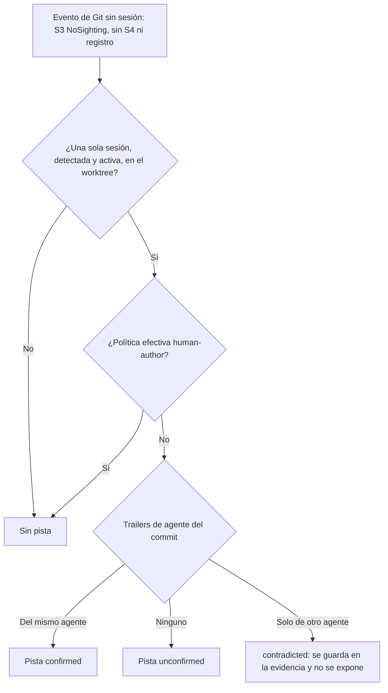

# ADR-GRP-012 — Detección de sesiones de Claude Code sin hooks propios

> **Estado**: aceptado por Rene Bonilla el 2026-10-04.

## Contexto

El motor tiene que saber qué sesión de Claude Code trabaja en cada worktree, en qué estado está y qué eventos le pertenecen (US-GRP-007), sin atribuirle nunca el trabajo que el desarrollador hace en su editor (US-GRP-008, BR-EDGE-004). Claude Code es el único agente con soporte completo en el MVP (Q32).

Restricciones:

- **Sin hooks propios** (Q22): el motor no instala hooks de Git ni de Claude Code, y no toca `~/.claude/settings.json`. Fuera del repo solo escribe en su perfil (Q17, Q21).
- **Sin APIs privadas** (NFR-08).
- **Solo dos valores de actor**: "agente X" con su origen, o "sin atribuir". Nunca "humano" (Q34, Q35).
- **Meta de precisión**: 90% de sesiones detectadas correctamente en dogfooding (Q9).
- **Estados**: activo, inactivo y terminado según el umbral de inactividad (BR-WF-001, BR-TIME-001; perfil o configuración local, 5 min por defecto, Q24). Una sesión terminada no se reactiva (Q41).
- **Instalación tardía**: Claude Code instalado después se detecta sin reconfigurar GitRaptor (BR-EDGE-006, Q29).
- **Límite clave**: el SO no informa de qué proceso escribió un archivo. La ubicación sola no distingue a Claude Code del editor humano abierto en el mismo worktree (R2).

**Decisión de producto de Rene Bonilla (2026-10-03, PQ-2)**: se permite leer `~/.claude/projects` limitado a **metadatos** (herramienta, ruta de archivo, marca de tiempo, id de sesión y cwd). Nunca se leen prompts, respuestas ni contenido de código. La lectura va detrás de una comprobación de versión y forma del formato que desactiva la señal si no lo reconoce.

## Decisión

Se adopta la **opción 3 del outline**: detección por proceso y cwd, con atribución por evidencia positiva y un adaptador de transcripts versionado y degradable.

### Señales

| Señal | Qué observa | Papel | Peso |
|---|---|---|---|
| **S1 · Proceso y cwd** | Procesos de Claude Code y su cwd, con `sysinfo` configurado con un `ProcessRefreshKind` que **no carga `cmd` ni `environ`** (SEC-04). **Identificación**: por la **ruta del ejecutable**. Solo si el ejecutable es un intérprete (`node`), una **lectura acotada de argv[1]** (el script de entrada) con una API por SO que no carga el resto de argv ni `environ`, con tope de bytes, y que se descarta en cuanto se clasifica el proceso. La viabilidad por SO la mide SPIKE-GRP-001 | **Existencia y fin de la sesión.** La identidad de la sesión es `(pid, hora de inicio)` para evitar la reutilización de PID | Necesaria. Sin S1 no hay sesión detectada |
| **S2a · mtime de transcripts** | mtime de `~/.claude/projects/<cwd-codificado>/*.jsonl` | Correlaciona el proceso con su transcript y desempata dos sesiones del mismo worktree | Auxiliar. **Nunca atribuye un cambio por sí sola** |
| **S2b · Metadatos de transcripts** | Por registro: herramienta, ruta de archivo, marca de tiempo, id de sesión y cwd | **Atribución por archivo.** Una escritura del worktree cuya ruta coincide con una herramienta de edición de esa sesión dentro de la ventana Δ | Evidencia positiva. Se desactiva sola si no reconoce el formato |
| **S3 · Ascendencia de procesos** | Árbol de procesos (y la marca de entorno heredada, si el SO deja leerla) de los `git` vivos al detectar un evento de Git | **Atribución de commits y operaciones de Git**. También responde PQ-6: si un llamante del MCP desciende de una sesión detectada | Evidencia positiva. Es una carrera con procesos cortos: si se pierde, no hay evidencia |
| **S4 · Hooks de Guardrails** | Señales que dejan los hooks de Guardrails, si existen (R8) | Atribución de commits sin carrera, porque el hook se ejecuta dentro del proceso `git` | Evidencia positiva y opcional. El motor no depende de ella |

**Regla de combinación**:

1. **La sesión existe** si S1 encuentra un proceso de Claude Code cuyo cwd está dentro de un worktree observado. Su origen es "detectado".
2. **Un evento o cambio se atribuye a una sesión** solo con evidencia positiva que apunte a **esa** sesión: S2b, S3, S4 o el **registro explícito** del punto 3.
3. **La co-ubicación de una sesión detectada nunca basta.** Es más estricto que el outline: el SO no permite saber, sin APIs privadas, si un editor o una terminal del desarrollador tienen abierto el worktree. **Excepción, el registro explícito** (BR-VAL-001, BR-EDGE-004, US-GRP-009): quien registra declara que ese agente trabaja en el worktree, así que el registro es evidencia positiva para los eventos del worktree **mientras su sesión sea la única presente en él**. **Solo aplica a sesiones creadas por el registro de un agente sin detección automática** ("otro agente"). **Confirmar una sesión detectada** (Q39) **no activa esta evidencia**, aunque con P16 su origen pase a "registrado": para esa sesión siguen valiendo solo S2b, S3 y S4, y las ediciones del humano en ese worktree nunca se atribuyen a Claude Code (US-GRP-008, BR-EDGE-004). Si hay varias sesiones presentes (worktree compartido), se vuelve a la evidencia por evento (S2b, S3 o S4) y, ante la duda, "sin atribuir" (punto 4 y ADR-GRP-013 § 3).
4. **Dos sesiones en el mismo worktree** (detectadas o registradas): si la evidencia no distingue entre ellas, el evento queda "sin atribuir", porque cada evento apunta a una sola sesión (ADR-GRP-013).
5. **Trabajo en otro directorio** (R3): una escritura con S2b en un worktree distinto del cwd se atribuye a la sesión. La sesión sigue asociada al worktree de su cwd.
6. **En cualquier otro caso, "sin atribuir"**. Cubre el commit simultáneo del humano y de Claude Code en el mismo worktree cuando S3 pierde la carrera y no hay S4.

**Salida del motor**: `Claude Code (detectado)`, el agente registrado con origen "registrado" (incluido "otro agente: <nombre>") o `sin atribuir`. Nunca "humano".

### Ciclo de vida de la sesión

- **Aparece** (activo): S1 ve un proceso nuevo de Claude Code en un worktree observado. El escaneo es periódico; el intervalo es un parámetro interno que mide SPIKE-GRP-001.
- **Activo ↔ inactivo**: se rige por la "actividad" de BR-WF-001, es decir, cambios en los archivos del worktree o eventos de Git dentro del umbral. S2a no cuenta como actividad.
- **Terminado**: el proceso `(pid, hora de inicio)` desaparece (cierre normal o forzado). No se reactiva (Q41). Un `claude --resume` o `--continue` es un proceso nuevo y, por tanto, una sesión nueva, aunque reutilice el id de sesión del transcript.
- **Suspensión del equipo**: el proceso sigue vivo, así que la sesión no termina. Al reanudar, pasa a inactivo si se superó el umbral.
- **Reinicio del motor**: una sesión con la misma `(pid, hora de inicio)` continúa. Si el proceso murió mientras el motor estaba parado, la sesión se cierra como terminada al reconciliar (ADR-GRP-010 y ADR-GRP-013).
- **Registro explícito** de un Claude Code ya detectado: confirma la sesión, sin duplicarla (Q39, US-GRP-009).
- **Retiro del registro**: una sesión registrada figura presente hasta que se retira su registro (Q41, BR-WF-001). El retiro la pasa a terminado con causa "registro retirado" y no se reactiva. Quién puede retirar lo fija ADR-GRP-013 § 2 (⚠️ ASSUMPTION).

### Adaptador de transcripts (S2)

- **Aislamiento**: vive en un adaptador por agente y por versión de formato (`claude_code::transcripts::v1`) detrás de un trait común. Ninguna otra parte del motor conoce el formato.
- **Comprobación de forma**: al arrancar y cuando cambia la versión de Claude Code, valida una muestra de registros: campos esperados, tipos y versión declarada.
  - **Forma reconocida**: S2b activa. Una versión nueva con forma válida se acepta y se anota en el diagnóstico.
  - **Forma no reconocida**, o una tasa de registros ilegibles por encima del límite en ejecución: S2b se desactiva sola y el motor sigue con S1 + S2a + S3 + S4. Lo que S2b habría atribuido queda "sin atribuir". El diagnóstico lo indica; no hay error ni bloqueo.
- **Lectura mínima**: lectura en streaming. De cada registro se extraen los campos permitidos y el resto se descarta sin copiarse.
- **Lectura defensiva (SEC-04, M4)**: `~/.claude` es de un tercero y lo puede escribir un agente. El adaptador abre con `O_NOFOLLOW` (en Windows, sin seguir reparse points), acepta solo **archivos regulares** dentro de `~/.claude/projects`, lee en modo **no bloqueante** (rechaza FIFOs y dispositivos), aplica un **tope por línea y por escaneo** y un **timeout**; si se excede, descarta la línea o el archivo y lo anota en el diagnóstico sin contenido. Las rutas extraídas de un registro **solo se comparan** con las del worktree; nunca se abren.

### Encaje con NFR-08

NFR-08 prohíbe las APIs privadas de un IDE. Leer archivos locales del usuario, con sus permisos y sin llamar a ningún proceso ni servicio de Claude Code, **no es usar una API privada**. Aun así, el formato no es contractual y puede cambiar en cualquier versión. **Riesgo aceptado por Rene Bonilla (PQ-2)**, mitigado con el adaptador versionado, la desactivación automática y el registro explícito como respaldo (R1).

## Alternativas consideradas

1. **Hooks de Claude Code** (`SessionStart`, `PostToolUse` en `~/.claude/settings.json`): es la señal más precisa, pero exige escribir fuera del perfil. **Descartada** por Q17 y Q22.
2. **OpenTelemetry opt-in de Claude Code (S5)**: interfaz documentada y estable, pero el usuario tiene que configurarla en `~/.claude`. **Queda como evolución**: un adaptador más que el usuario activa por su cuenta, y la vía preferente si SPIKE-GRP-001 fracasa o el formato de transcripts se rompe a menudo.
3. **Solo procesos (S1 + S3, opción 1 y parte de la 2)**: detecta las sesiones y los commits con S3, pero casi todos los cambios sin commitear quedan "sin atribuir". Es la **degradación automática** de esta decisión, no la decisión.
4. **Solo transcripts (S2)**: sin S1 no hay un fin de sesión fiable, porque un transcript sin escrituras no indica si el proceso murió. Además, la detección dependería entera de un formato no contractual. **Descartada**.

## Consecuencias

**Positivas**

- Detecta Claude Code sin instalar nada y sin reconfigurar GitRaptor tras instalarlo (BR-EDGE-006).
- Un cambio del formato degrada la precisión, pero nunca produce atribuciones falsas: R1 se convierte en más cambios "sin atribuir".
- El árbol de procesos sirve también a la seguridad del MCP (PQ-6).

**Negativas y riesgos**

- **Commit de Claude Code sin S4**: depende de que S3 gane la carrera. Si la pierde, el commit queda "sin atribuir" y el escenario de commit de US-GRP-007 falla en esa ejecución. SPIKE-GRP-001 mide la tasa.
- **Humano y Claude Code editando el mismo archivo dentro de Δ**: S2b no los distingue. Riesgo residual de atribuir al agente un cambio humano. Lo mide la suite guionizada; si aparece, se reduce Δ o se exige S2b + escritura sin otra escritura en la ventana.
- **Activo no implica que Claude Code esté trabajando**: según BR-WF-001, las ediciones del humano en el worktree también mantienen activa la sesión.
- **Coste de mantenimiento**: el adaptador v1 se revisa con cada cambio de formato de Claude Code.
- **Lectura de cwd y entorno de otros procesos**: varía por SO (Windows y macOS restringen el entorno). S3 con marca de entorno es "si el SO lo permite" y lee **solo esa variable**, nunca el entorno completo; la ascendencia es la base. ADR-GRP-005 usa la ascendencia con identificadores no reutilizables (pidfd, audit token, handle) para los comandos reservados.

Nota de integración (Time Machine, ADR-TMC-005, TQ-8, aceptado el 2026-10-03): el registro explícito de un agente guarda la identidad no reutilizable del proceso que se registra (pidfd, audit token o handle, con su hora de inicio), para que la ascendencia reconozca a ese agente como solicitante de un undo, un redo o una restauración.

## Validación

La valida **SPIKE-GRP-001** (prototipo aislado, sin código del motor):

- **Precisión de sesiones (Q9)**: ≥ 90% en dogfooding en macOS y en la suite guionizada en los tres SO. Cuenta como fallo cada sesión registrada o corregida a mano.
- **0 cambios humanos atribuidos a Claude Code** en la suite guionizada (BR-EDGE-004).
- **Aportación por señal**: se mide por separado la variante **solo mtime** (S1 + S2a + S3 ± S4) y la variante **metadatos** (S1 + S2a + S2b + S3 ± S4). También la tasa de carreras perdidas de S3, el intervalo de escaneo de S1 y el valor de Δ.
- **Seguridad (SEC-04, SEC-05)**: hash de `~/.claude` idéntico antes y después; una línea de 100 MB, un symlink a `/dev/zero` o una FIFO no bloquean ni tumban el daemon; con `claude -p "CANARY"` y un transcript con canario, el canario no aparece en el perfil, los logs ni el stream IPC. Estos tests viven en INF-GRP-001.
- **Criterio de fracaso**: precisión < 90%, o cualquier atribución humano → Claude Code que la regla "ante la duda, sin atribuir" no evite. En ese caso **se replantea este ADR** (S5 opt-in como vía preferente y refuerzo del registro explícito) y se escala a Rene el posible replanteo de US-GRP-007 y 008.

## Privacidad

| Se lee | Nunca se lee | Se persiste en el perfil |
|---|---|---|
| Ruta del ejecutable; solo si es un intérprete (`node`), argv[1] mediante una lectura acotada por SO, descartado al clasificar el proceso. PID, hora de inicio, PPID y cwd | El resto de argv de `claude` (puede llevar el prompt, como en `claude -p "..."`) y `environ`: ni `sysinfo` ni la lectura acotada los cargan | La sesión: agente, origen, worktree, `(pid, hora de inicio)`, estados y sus horas |
| mtime de los transcripts | — | — |
| De cada registro del transcript: herramienta, ruta de archivo, marca de tiempo, id de sesión y cwd | Prompts, respuestas, contenido de código, diffs y el comando de las herramientas de shell | La evidencia de cada atribución: tipo de señal y hora. Su forma la fija ADR-GRP-013 |
| Marca de entorno de Claude Code en los `git` (si el SO lo permite) | Cualquier otra variable de entorno | Nada de los transcripts más allá de lo anterior. **Nunca** prompts, respuestas ni código |

El motor no escribe en `~/.claude` ni en ningún otro lugar fuera de su perfil (Q17, Q21).

## Referencias

- [Índice de decisiones](./index.md), fila y ficha de ADR-GRP-012.
- [Context de motor-local](../../requirements/features/motor-local/context.md): Q9, Q17, Q21, Q22, Q24, Q29, Q32-Q35, Q39 y Q41; riesgos R1, R2, R3, R7 y R8.
- [Reglas de negocio](../../requirements/features/motor-local/business-rules.md): BR-WF-001, BR-TIME-001, BR-EDGE-003, BR-EDGE-004, BR-EDGE-006 y BR-AUTH-002.
- [US-GRP-007](../../requirements/features/motor-local/user-stories/US-GRP-007-sesiones-claude-code.md) y [US-GRP-008](../../requirements/features/motor-local/user-stories/US-GRP-008-editor-humano-sin-atribuir.md).
- [Historias técnicas](../../requirements/features/motor-local/technical-stories.md): SPIKE-GRP-001.
- [Documento de negocio](../../business/gitraptor-documento-de-negocio.md): NFR-08, D2.
- ADR-GRP-005 (comandos reservados y ascendencia), ADR-GRP-006 (perfil), ADR-GRP-007 (umbral), ADR-GRP-009, ADR-GRP-010 (observador y huecos) y ADR-GRP-013 (modelo persistido de atribución).

## Revisión de seguridad (2026-10-03)

Enmienda tras la revisión del security-expert. No cambia las señales ni la regla de combinación.

| Hallazgo | Cómo se cubre |
|---|---|
| M3 · `sysinfo` carga `cmd`/`environ` completos por defecto | Señal S1 y tabla de Privacidad: `ProcessRefreshKind` sin `cmd` ni `environ`; identificación por la ruta del ejecutable y, solo con un intérprete, lectura acotada de argv[1] descartada al clasificar (SEC-04) |
| M4 · Lector de transcripts sin límites | Adaptador de transcripts: `O_NOFOLLOW`, solo archivos regulares, lectura no bloqueante, topes por línea y por escaneo y timeout; rutas extraídas solo se comparan (SEC-04) |
| I4 · Supuesto "la shell de Claude Code no tiene TTY" | Deja de ser crítico: ADR-GRP-005 ya no se apoya en la terminal del cliente, sino en comprobaciones del daemon (terminal de control y líder de sesión). SPIKE-GRP-001 lo sigue midiendo como dato |

Validación ampliada: SEC-04 y SEC-05 (punto "Seguridad"), con los tests en INF-GRP-001.

## Enmienda (2026-10-05, US-GRP-007)

Derivada de la [Dev Spec de US-GRP-007](../../requirements/features/motor-local/dev-specs/US-GRP-007-dev-spec.md). **Decisión del orquestador (2026-10-05), validada por el Arquitecto y el PO.** No cambia las señales, la regla de combinación ni el ciclo de vida: concreta cómo se leen los procesos y la regla de S3, y cómo se valida el spike. El `status` sigue en `accepted`.

| Cambio | Dónde | Motivo |
|---|---|---|
| **Lectura de procesos sin `sysinfo`**: macOS con `libproc` (lista por uid, `BSDInfo`, `pidpath`) y el cwd con `PROC_PIDVNODEPATHINFO` mediante un tipo propio que implementa el trait `PIDInfo` (sin `unsafe` en el código de GitRaptor); Linux con `/proc`. Nunca se cargan `cmd` ni `environ`. Windows: sin detección todavía (`sessions.list` lo dice con `detection_available: false`). Pendiente: etapa de validación multiplataforma | Señal S1; Revisión de seguridad (M3) | Más estricto que `sysinfo` con `ProcessRefreshKind` y sin la dependencia |
| **Intérpretes**: un Claude Code instalado por npm (`node …/cli.js`) no se detecta hasta tener la lectura acotada de argv[1], que en macOS necesita `KERN_PROCARGS2` sin envoltorio seguro. No produce falsos positivos | Señal S1 | Lo mide SPIKE-GRP-001 |
| **Regla concreta de S3**: el observador avisa al detector de cada escritura en el directorio Git (incluido `objects/`) antes del debounce; se toma una muestra con el primer aviso. Un evento de Git apunta a una sesión solo si, en las muestras de la ventana de su lote, hay `git` de **exactamente una sesión** con cwd **en el worktree del evento** y **ningún `git` ajeno** con cwd en el repo, contando solo los `git` que **empezaron antes del aviso**. Los `git` del propio daemon cuentan como ajenos. Un `git` ajeno que está terminando (cwd ilegible) se sitúa por el cwd de su ancestro vivo legible más cercano; si no hay ninguno, se ignora. Un `git` de la sesión con cwd ilegible no cuenta. Ventana: `[t_recv − 100 ms, t_flush]` del lote | Señal S3; regla de combinación, puntos 2, 4 y 6 | Medido en la máquina de dogfooding: 6 de 47 `git` muestreados estaban terminando; contarlos siempre como ajenos dejaba sin atribuir los commits de Claude Code |
| **Riesgo residual de S3**: un `git` de Claude Code vivo en el mismo worktree cuando el desarrollador hace un commit cuyo `git` ya terminó, o lanzado desde un IDE con su cwd fuera del repo (GitKraken, VS Code), atribuiría ese commit a Claude Code. Lo mide la suite guionizada de SPIKE-GRP-001, con los commits desde IDE marcados aparte | Consecuencias | Hueco declarado |
| **Identificador de sesión**: `<pid>:<inicio_us>`, el mismo texto que usa el solicitante de la Time Machine, para que una corrección de la sesión llegue a sus operaciones (ADR-TMC-005) | Ciclo de vida | Un solo formato |
| **Validación con el motor real**: SPIKE-GRP-001 se valida con US-GRP-007 en dogfooding, no con un prototipo aislado, y **solo para S1 + S3**; S2a y S2b quedan abiertas hasta que US-GRP-008 conecte el adaptador de transcripts. El procedimiento está en el § 5 de la Dev Spec. El cambio de secuencia (el spike decía validar antes de desarrollar) queda pendiente de que Rene lo ratifique | Validación | Instrucción del coordinador para el hito M1 |

## Enmienda (2026-10-06, carrera S3 de commits cortos)

Origen: primer dogfooding real (2026-10-06). `raptor events` mostró 3 commits de un worktree como "sin atribuir", aunque ese worktree tenía exactamente una sesión de Claude Code activa y `raptor sessions` la veía. Es la carrera de S3 que este ADR acepta: el `git commit` termina antes de la muestra. **Decisión del orquestador (2026-10-06), validada por el Arquitecto con ajustes, todos incorporados.** No cambia las señales, la regla de combinación (punto 3: la co-ubicación nunca basta para atribuir) ni ADR-GRP-013 § 3 y § 6. El `status` sigue en `accepted`.

**Regla: pista de sesión única, no atribución.**

- **Cuándo se aplica**: a un evento de Git (nunca a una reconciliación, BR-EDGE-005, ni a cambios de archivos) cuyo resultado S3 es "ningún `git` visto" (`NoSighting`) y al que la regla 3 (registro) no atribuye.
- **Condición**: el worktree del evento tiene **exactamente una** sesión presente. Esa sesión es **detectada** (no registrada) y está **activa** (no inactiva) antes de contar la actividad del propio evento. Una sesión registrada en el mismo worktree cuenta como segunda sesión.
- **Ambigüedad**: si S3 vio un `git` ajeno o de varias sesiones, no hay pista. Con 0 o con 2 o más sesiones, tampoco.
- **Efecto**: el evento se guarda **sin sesión**, así que su actor sigue siendo "sin atribuir". La evidencia del evento guarda la pista: `{"signals":["single-session"],"session":"<id>"}`. El contrato la expone en `GitEventView.inferred` (`{kind, session_id}`), un campo opcional que no toca el actor. `raptor events` muestra "unattributed; inferred: Claude Code" / "sin atribuir; inferido: Claude Code", y la salida JSON la lleva en `inferred`.
- **Sin efectos de autorización**: como el evento no tiene sesión, la Time Machine lo trata como "sin atribuir" (ADR-TMC-005). Una corrección (Q37) no lo convierte en "registrado". Las métricas de precisión de atribución no lo cuentan como atribuido.

**Riesgo residual**: un commit humano hecho en una terminal dentro de un worktree con una sola sesión activa, y no visto por S3, mostrará la pista de esa sesión. Por eso la pista lleva otra etiqueta y no atribuye. **La aceptación de ese riesgo y cualquier cambio de BR-EDGE-004 los decide el PO o Rene, no el Arquitecto.** Con esta forma (actor "sin atribuir"), BR-EDGE-004 no cambia: queda anotado en el PR para que Rene lo ratifique.

**Solución de fondo**: S4, un hook que corre dentro del proceso `git` y no tiene carrera, o S5 opt-in. La pista es un paliativo. SPIKE-GRP-001 mide los aciertos de la pista en una métrica separada de la precisión de atribución.

**Límite conocido**: la condición "proceso vivo durante la ventana del lote" se aproxima con la sesión presente y activa en el detector en el momento de atribuir. El escaneo S1 retira las sesiones cuyo proceso terminó.

Implementación: `Detector::single_session` (`crates/core/src/detect/mod.rs`), `attribute_one` y `inferred_agent` (`crates/core/src/daemon/sessions.rs`). Tests: casos de 0, 1 y 2 sesiones, sesión registrada e inactiva en `detect/tests.rs`; ida y vuelta de la evidencia en `daemon/sessions.rs`; contrato en `api/src/messages.rs`; texto y JSON en `apps/cli/src/events.rs`.

## Enmienda (2026-10-06, autoría de commits: BR-26 / US-GRD-018 / US-GRD-019)

Origen: decisión de Rene Bonilla (2026-10-06). GitRaptor acepta commits de personas y de agentes. **Modelo por defecto**: el autor del commit es la persona y el agente va como trailer `Co-Authored-By`, porque los permisos y las credenciales de Git son del usuario y el agente actúa con ellos. Variantes por repo en Guardrails: `agents-commit` (el agente puede hacer commits y se exige el trailer), `human-author` (el agente no hace commits: bloquear o avisar según la política) y `flexible` (solo registrar). El PO las recoge como **BR-26** (D6 del documento de negocio; no es la D6 de Guardrails), **BR-AUTH-005** de Guardrails, **US-GRD-018** (la política) y **US-GRD-019** (quién ejecutó frente a a nombre de quién, y la validación de la pista). **Decisión del orquestador (2026-10-06), validada por el Arquitecto.** No cambia las señales, la regla de combinación, el ciclo de vida ni los valores del actor (Q34, Q35). El `status` sigue en `accepted`. El modelo de datos está en ADR-GRP-013, Enmienda (2026-10-06, autoría declarada).

### 1. Quién ejecutó y a nombre de quién entra

Son dos preguntas distintas, con fuentes distintas, y el motor no las mezcla:

| | **Quién ejecutó** (observación) | **A nombre de quién entra** (autoría declarada) |
|---|---|---|
| Fuente | Proceso, sesión y worktree: S1 a S4 y el registro (este ADR) | El objeto commit: autor, committer y trailers `Co-Authored-By` |
| Valor | El actor de ADR-GRP-013 § 2 (agente con origen o "sin atribuir") y la pista `inferred` | Identidades de Git tal como las declara el commit, como texto no confiable (SEC-12). Un co-autor reconocido como agente lleva además su tipo |
| Quién lo fija | El motor, por observación | Quien hace el commit: el mensaje y la identidad los escribe él |
| Para qué sirve | Atribución, correcciones, Time Machine (ADR-TMC-005) y el actor de Guardrails | Mostrar la autoría, validar la pista (§ 2) y las reglas de autoría de Guardrails (§ 4) |

- **La autoría declarada nunca es evidencia de atribución.** Un trailer de un agente no asigna el evento a ninguna sesión, y un autor persona no se la quita. Las evidencias siguen siendo S2b, S3, S4 y el registro (regla de combinación, punto 2). Cualquiera puede escribir un trailer.
- **No introduce el valor "humano".** El autor declarado es una identidad de Git (nombre y correo), no un valor del actor. Los clientes dicen "commit de <nombre>", nunca "humano" (Q34).
- **Agentes reconocidos en el trailer**: los reconoce el adaptador de cada agente con una tabla versionada de identidades conocidas, con el mismo aislamiento que el adaptador de transcripts. Un co-autor no reconocido queda como identidad sin tipo.

### 2. La pista `inferred` frente al trailer

> ✅ **Decisión de Rene (2026-10-07): pista `inferred` ratificada.** La política de autoría ya está en `main` (US-GRD-018, PR #137 y #141; US-GRD-019, PR #144): la pista se contrasta con el trailer al guardar el evento (`confirmed` / `unconfirmed`), se descarta si un trailer nombra a otro agente y no se muestra con `human-author`. Sigue sin contar como atribución: no tiene efecto en la Time Machine ni en Guardrails.

Al observar el evento, si su commit nuevo se puede leer, el motor compara la pista con los trailers de agente del commit:

| Trailers de agente en el commit | Estado de la pista | Qué se muestra |
|---|---|---|
| Uno del **mismo agente** que la sesión de la pista | `confirmed` | "sin atribuir; inferido: Claude Code (confirmado por el trailer)" |
| Ninguno | `unconfirmed` | Lo de hoy: "sin atribuir; inferido: Claude Code" |
| Solo de **otro** agente | `contradicted` | **No se muestra la pista**: el contrato omite `inferred` y queda la autoría declarada ("commit de <persona> con <otro agente>") |

- **Confirmada no es atribuida.** El actor sigue "sin atribuir": el trailer lo escribe quien hace el commit y no prueba qué proceso lo ejecutó. Si una pista confirmada pasa a ser atribución lo decide el PO o Rene con BR-26; en ese caso se enmienda la regla de combinación de este ADR.
- **Ante la contradicción, no se infiere.** Dos señales débiles que no coinciden no se resuelven a favor de ninguna. La evidencia guarda `contradicted` para la métrica de la pista de SPIKE-GRP-001; el contrato no lo expone.
- **Con `human-author` no hay pista.** Allí el agente no hace commits: el humano los hace desde el worktree del agente, que suele tener su única sesión activa, así que la pista señalaría al agente casi siempre. El motor no la registra si la política efectiva del repo al observar es `human-author`.
- **Con `agents-commit` (también el valor por defecto, sin política configurada) o `flexible`**, la pista se registra y se valida según la tabla.
- **De dónde sale la política**: de la configuración efectiva (ADR-GRP-007, ADR-GRD-004), aunque los hooks no estén instalados. Se toma al observar porque los eventos no se reescriben (ADR-GRP-013 § 4): cambiar la política después no reescribe pistas antiguas.
- **S4 la vuelve innecesaria**: con los hooks de Guardrails instalados, el hook corre dentro del `git` y da el actor sin carrera (ADR-GRD-003 § 4), así que el caso `NoSighting` sin S4 desaparece en los commits gobernados.

### 3. Cómo se muestra (Cockpit y `raptor events`)

Historia dueña: US-GRD-019. Para un evento que crea un commit, la línea junta las dos respuestas cuando difieren:

- **Forma base**: "commit de <autor> con <agente> · <worktree>", donde `<autor>` es el autor declarado y `<agente>`, los co-autores reconocidos como agente. Sin trailer de agente: "commit de <autor> · <worktree>".
- **Lo que añade la observación** va detrás, solo si aporta algo: "· ejecutado por Claude Code (detectado)" cuando el actor es un agente que no figura como co-autor; "· sin atribuir" o "· sin atribuir; inferido: …" según el § 2. Si el actor es el mismo agente que el co-autor, no se repite.
- **Ejemplos**:
  - Actor Claude Code (detectado) con su trailer: "commit de Rene Bonilla con Claude Code · feat-login".
  - Sin atribuir, pista confirmada: "commit de Rene Bonilla con Claude Code · feat-login · sin atribuir; inferido: Claude Code (confirmado por el trailer)".
  - Actor Claude Code (detectado) sin trailer: "commit de Rene Bonilla · feat-login · ejecutado por Claude Code (detectado)".
- Nombres, correos y worktrees son texto no confiable (SEC-12) y se limpian antes de mostrarlos (ADR-GRP-005 § 5). El Cockpit aplica la misma regla donde muestra eventos de commit; el actor por commit en el grafo sigue pendiente (ADR-GRP-013, Enmienda Cockpit).

### 4. Qué hace el motor en cada variante

| Variante | Detección y pista (este ADR) | Guardrails (capa de hooks) |
|---|---|---|
| `agents-commit` (por defecto, también sin política configurada, BR-AUTH-005) | Pista registrada y validada (§ 2) | Si el actor del hook es un agente y el commit no lleva su `Co-Authored-By` reconocido, no se ejecuta ("trailer exigido"). Solo actúa con los hooks instalados; no forma parte del mínimo seguro de ADR-GRD-003 § 2 y el suelo del equipo puede cambiar la variante |
| `human-author` | **Sin pista** | Si el actor del hook es un agente: deniega o avisa, según la política. Con el actor "sin atribuir", no actúa |
| `flexible` | Pista registrada y validada | Ninguna decisión: solo queda la autoría declarada en el evento |

- **Dónde se evalúa**: en la capa de hooks de ADR-GRD-001, con la matriz del commit de ADR-GRD-002 § 1. `pre-commit` ya conoce el actor, así que `human-author` puede cortar antes de que se escriba el mensaje. `commit-msg` ve los trailers, para `agents-commit`. `reference-transaction` en `prepared` es la segunda línea, la que `--no-verify` no salta: lee autor, committer y trailers de los commits del rango.
- **Qué evalúa**: reglas nuevas de autoría en `crates/policy`, añadidas sin cambiar el contrato (ADR-GRD-003 § 1 y § 7). Reciben la autoría declarada como hechos de contenido y el actor de ADR-GRD-003 § 4: la ascendencia desde el hook, que es la señal S4 y no tiene carrera.
- **Choque con ADR-GRD-003 § 1** ("El actor no cambia la decisión", Q-GRD-1): `agents-commit` y `human-author` son las primeras reglas cuya condición lee el actor. No eximen a nadie de otra regla y solo endurecen, así que se mantiene el fail-safe de Q-GRD-1. Aun así, el texto de ADR-GRD-003 § 1 hay que enmendarlo con US-GRD-018. Hasta entonces estas reglas no existen y no hay contradicción vigente.
- **Ante la duda, no se bloquea**: con el actor "sin atribuir" ninguna regla de autoría deniega. Eso incluye a un agente no detectado ni registrado y al modo degradado de ADR-GRD-003 § 4, donde el actor siempre es "sin atribuir". Bloquear en la duda bloquearía commits humanos (BR-EDGE-004). **Residuo declarado**: en esos casos un agente escapa a `agents-commit` y `human-author`, y el modo degradado pierde estas reglas aunque estén en el suelo legible. La garantía de ADR-GRD-003 § 4 se enmienda con US-GRD-018 para declararlo.
- **"Avisar"**: el contrato de ADR-GRD-003 § 3 solo tiene `allow`, `ask` y `deny`. La forma del aviso que deja pasar el commit la fija la Dev Spec de US-GRD-018, sin cambiar el orden `deny > ask > allow`.
- **Registro**: el registro de decisiones (ADR-GRD-006) nunca guarda el mensaje de commit (ADR-GRD-003 § 1, M-06). De la autoría guarda solo lo que usa la regla: el tipo de agente del trailer y si estaba.

### 5. Validación (con US-GRD-018 y US-GRD-019)

- **Pista**: los estados `confirmed`, `unconfirmed` y `contradicted` (este último sin `inferred` en el contrato); con `human-author`, sin pista; cambiar la política después no reescribe la evidencia de eventos anteriores.
- **Autoría sin efecto en la atribución**: un commit sin sesión con un trailer falso de Claude Code sigue "sin atribuir" y sin pista. Una prueba de propiedades con trailers y autores aleatorios comprueba que el actor resuelto no cambia.
- **Guardrails**, en repos temporales: con `human-author`, un commit de Claude Code se deniega (o avisa) y un commit humano en el worktree del agente pasa. Con `agents-commit`, un commit de Claude Code sin trailer se deniega y con trailer pasa. `--no-verify` lo cubre `reference-transaction`. En modo degradado, ninguna regla de autoría deniega y la causa queda en el spool.

### 6. Para las Dev Specs de US-GRD-018 y US-GRD-019

- La tabla versionada de identidades de agente en trailers, por adaptador.
- De dónde sale la identidad del autor en `pre-commit` y `commit-msg`, y qué commits se leen en eventos con varios (rebase, cherry-pick de un rango, merge).
- La clave de configuración, sus niveles (suelo de equipo, personal) y el efecto por defecto de cada variante (ADR-GRP-007, ADR-GRD-004).
- La forma del aviso, las cadenas en/es, el JSON de `raptor events` y la presentación en el Cockpit.
- Las enmiendas de ADR-GRD-003 § 1 (actor como condición de las reglas de autoría) y § 4 (garantía del modo degradado).
