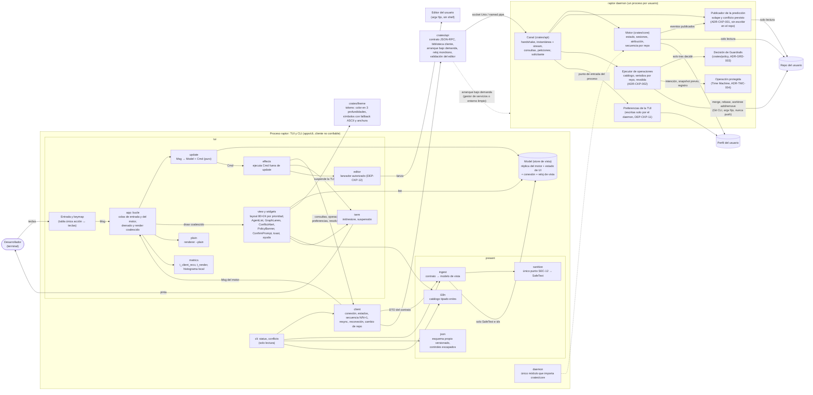

# C4 L3 — Componentes del Cockpit: TUI y CLI de solo lectura, y su relación con el daemon

> Componentes de la TUI `raptor` y de la CLI de solo lectura (`raptor status`, `raptor conflicts`) en `apps/cli`, y las piezas del Cockpit (F-001-02) dentro del proceso `raptor daemon`. Cubre ADR-CKP-003 (TUI), ADR-CKP-001 (publicador de la predicción) y ADR-CKP-002 (ejecutor de operaciones). El canal y el motor son de motor-local (ADR-GRP-005, 011, 013); la operación protegida es de la Time Machine (ADR-TMC-004); la decisión es de Guardrails (ADR-GRD-003).

**Lectura del diagrama**: el proceso de la TUI no tiene ninguna flecha hacia el repo ni hacia el perfil. Todo lo que pinta llega por `client`, pasa por `ingest` y su saneador, y queda en el `Model`. `view` solo lee el `Model`, el tema y el catálogo. El único proceso que lanza la TUI es el editor, desde su módulo autorizado. El daemon lo arranca la biblioteca de `crates/api`, nunca la TUI incrustando el motor: el módulo `daemon` de `apps/cli` solo es el punto de entrada de `raptor daemon` en su propio proceso. Las escrituras salen como peticiones al ejecutor del daemon, que pide la decisión a Guardrails y ejecuta como operación protegida. La predicción la calcula y la publica el daemon para todos los clientes, sin escribir en el repo. La CLI de solo lectura reutiliza `client`, `ingest` e `i18n`, y solo tiene una salida propia: `json`.
