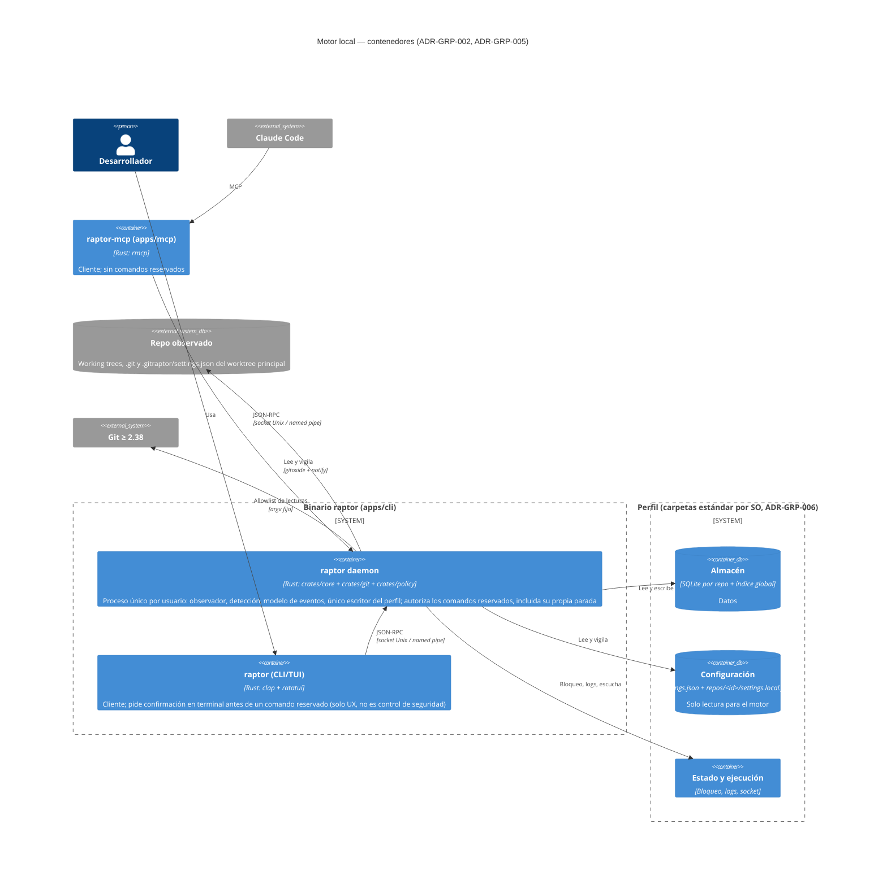

# C4 · Nivel 2 — Contenedores del motor local

- `crates/api` define el contrato que comparten el daemon y los dos clientes. Los clientes nunca abren el perfil.
- **Comandos reservados** (añadir o retirar repos, corregir, retirar el registro de otro agente y parar el daemon): la autorización la hace **el daemon** con la ascendencia del llamante (ADR-GRP-005 § 6). La confirmación de la CLI/TUI es solo UX.
- **Time Machine (F-001-03)**: el daemon aloja también la Time Machine (módulo `timemachine` de `crates/core`) y el ejecutor de operaciones de usuario del Cockpit y el MCP. El perfil contiene, en `tm/<id-repo>/`, el almacén de snapshots (repo Git bare) y el oplog de la Time Machine (ADR-TMC-001, ADR-TMC-002, ADR-TMC-003). Detalle en [c4-tmc-components.md](./c4-tmc-components.md); este diagrama no cambia.
