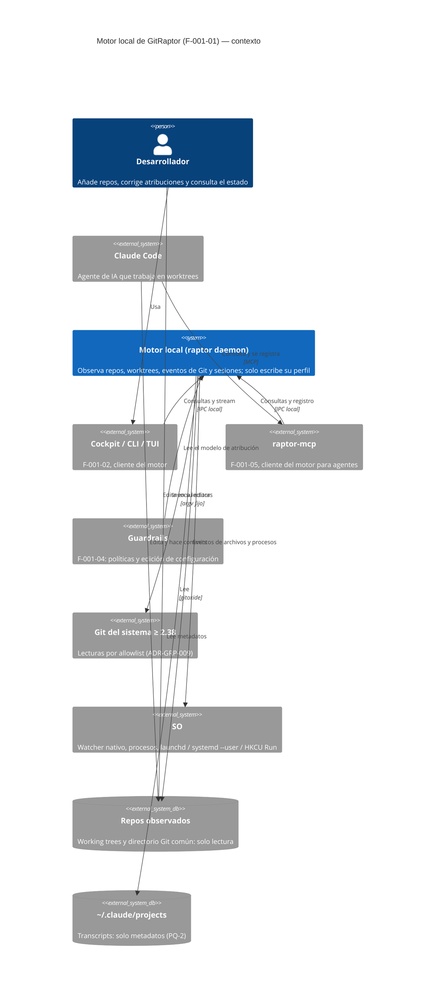

# C4 · Nivel 1 — Contexto del motor local

- El motor no escribe en los repos, en `~/.claude` ni en la configuración de Git (ADR-GRP-009, ADR-GRP-012). La única escritura fuera del perfil es el registro del autoarranque, que hace el instalador o `raptor daemon enable` (PQ-1, ADR-GRP-005).
