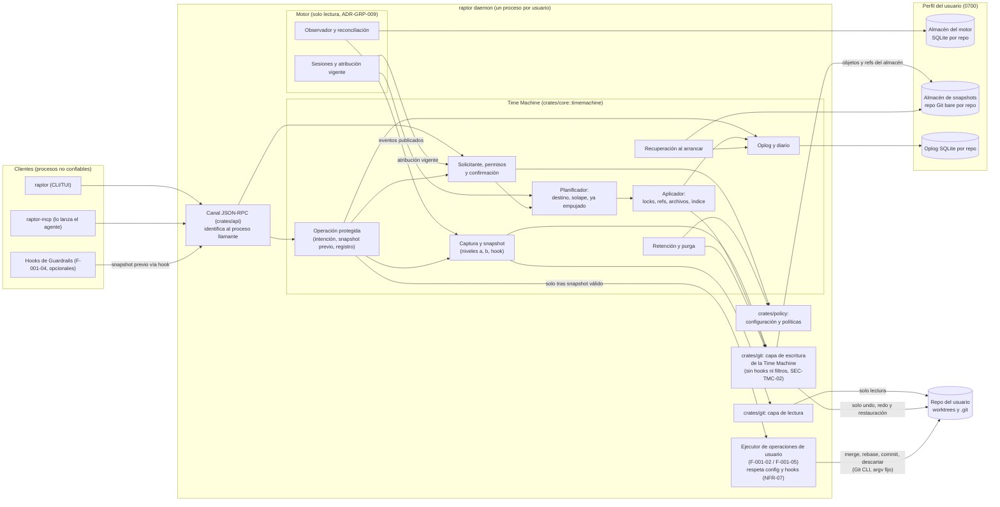

# C4 L3 — Componentes de la Time Machine dentro del daemon

> Componentes de la Time Machine (F-001-03) en el proceso `raptor daemon`, junto al motor de solo lectura y al ejecutor de operaciones de usuario, y los almacenes del perfil. Cubre ADR-TMC-001..005 y ADR-TMC-007. El motor, el canal y el perfil son de motor-local (ADR-GRP-005, 006, 009, 010, 013); el ejecutor es de F-001-02 y F-001-05.

**Lectura del diagrama**: la Time Machine solo escribe en el repo con su capa de escritura y por el aplicador (undo, redo, restauración; BR-TMC-CONS-004). Las operaciones de usuario del Cockpit y del MCP las ejecuta el ejecutor del daemon, fuera de esa capa y con los hooks del usuario, después de que la operación protegida tenga un snapshot válido. Capturar y purgar escriben solo en el almacén del perfil. El motor no tiene ninguna flecha hacia una capa de escritura.
