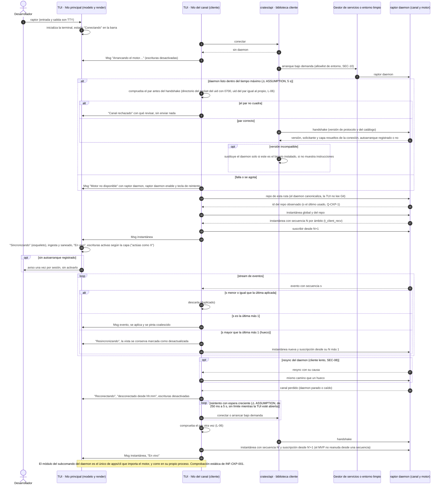

# Secuencia — Arranque de la TUI: daemon bajo demanda, instantánea N y suscripción N+1, reconexión (BR-04)

> Covers: BR-04 (BR-CKP-WF-004, CONS-001) · INF-CKP-001, TS-GRP-004 · ADR-CKP-003 § 3 a § 5, ADR-GRP-005 § 3 y § 4, ADR-GRP-013 (secuencia por repo) · US-CKP-001, US-CKP-003.

La TUI nunca embebe el motor ni lee Git o el perfil (Q-CKP-22). Si no hay daemon, lo arranca la biblioteca cliente de `crates/api`. La vista se llena con una instantánea con secuencia N por ámbito (global y repo seleccionado) y una suscripción desde N+1: un duplicado se descarta y un hueco o un `resync` llevan a pedir otra instantánea. Al perder el canal, la réplica se conserva marcada como desconectada y las escrituras se desactivan hasta volver a "En vivo". Antes de cada handshake, el cliente comprueba el par del canal (L-06); si la biblioteca cliente ya lo hace, se reutiliza. La forma de estos mensajes (N1 a N7 de ADR-CKP-003 § 4) y dónde vive la comprobación del par son **pendiente, dueño: worker del canal (TS-GRP-004)**.

Linux (servicio de usuario) y Windows (pipe con nombre, consola): **Pendiente: etapa de validación multiplataforma**.
