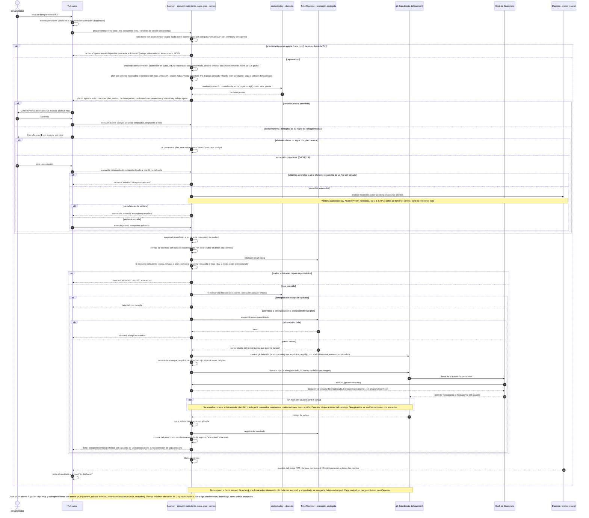

# Secuencia — Operación de usuario desde la TUI: preparar, decidir, proteger y ejecutar (BR-07)

> Covers: BR-07 (BR-CKP-ELIG-002, WF-002, WF-003, WF-008, CONS-002, CONS-004, AUTH-001, AUTH-002) · TS-CKP-002, TS-CKP-003, INF-CKP-001 · ADR-CKP-002 § 1 a § 6, ADR-TMC-004 § 1, ADR-TMC-005 § 1 y § 3, ADR-GRD-003 § 4 a § 6, ADR-GRD-007. Todavía no hay historias de usuario del Cockpit.

El desarrollador integra en la base confirmada el trabajo del worktree W2 (`merge-into-base`). La TUI no escribe: pide un plan, muestra lo que el daemon devuelve y pide ejecutar ese plan por la misma conexión. El daemon fija el solicitante y la capa, toma la decisión de Guardrails antes de cualquier efecto, toma el snapshot previo y lanza `git` como padre directo tras registrarlo. Los hooks de Guardrails de ese `git` heredan la decisión, y todo proceso que desciende de él actúa como el solicitante del plan. Incluye la rama denegada y la excepción consciente.

Decisión del orquestador (2026-10-04), validada por Arquitecto: la ventana de la excepción consciente corre **antes** de tomar el cerrojo del repo y queda ligada al `planId` y a la huella; si el plan cambia durante la ventana, el `execute` se rechaza. ADR-CKP-002 § 4 no fija ese orden; se confirma en la Dev Spec de la historia de la excepción. Windows (capa `cockpit`, barrera de arranque, confirmación de trabajo ajeno) y Linux: **Pendiente: etapa de validación multiplataforma**.
