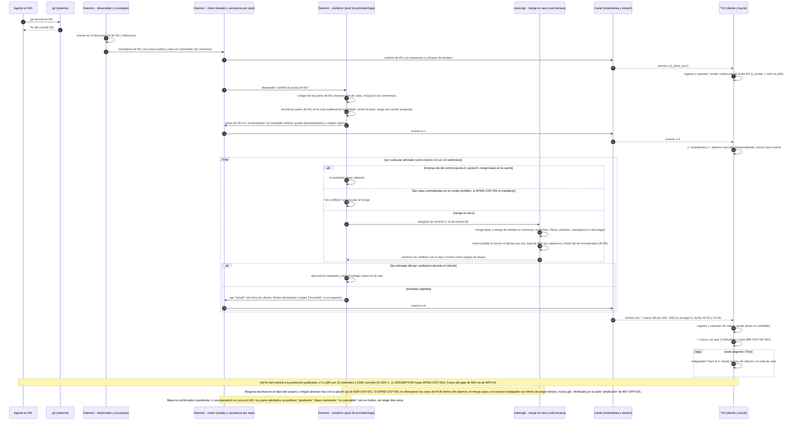

# Secuencia — Predicción de conflictos: de un commit en un worktree al ⚡ en la TUI (BR-06)

> Covers: BR-06 (BR-CKP-CALC-002, CALC-003, WF-005, WF-007) · TS-CKP-001, INF-CKP-001 · ADR-CKP-001 § 2 a § 8, ADR-CKP-003 § 3, § 4 y § 8, ADR-GRP-010, ADR-GRP-011 · US-CKP-006, US-CKP-007, US-CKP-008.

Un agente commitea en el worktree W1. El motor publica el cambio de W1 dentro de su presupuesto de 300 ms (ADR-GRP-011) y avisa al predictor, que corre en su propio pool de prioridad baja. El solape se recalcula al momento. El merge en seco se hace solo en los pares afectados que no resuelven la caché ni el prefiltro, en memoria y sin escribir en el repo. Cada resultado sale con la secuencia del motor y su hora de cálculo; la TUI deriva la antigüedad con su reloj de vista. `raptor conflicts` y `check_conflicts` del MCP leen el mismo estado.

Linux y Windows (prioridad baja del SO, latencias): **Pendiente: etapa de validación multiplataforma**.
