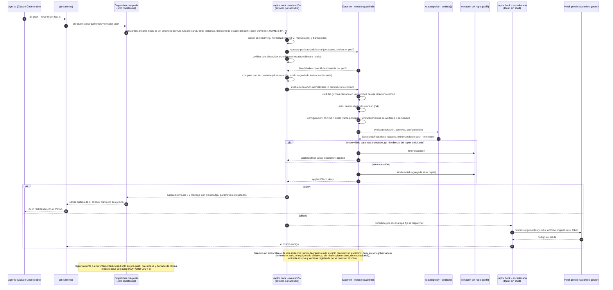

# Secuencia — Decisión de Guardrails en un hook de Git (US-GRD-001, US-GRD-002, US-GRD-005, US-GRD-006)

Muestra un agente que hace un force-push con Git crudo en un repo protegido:

- el dispatcher, que solo contiene constantes;
- la evaluación con entorno por allowlist, contra un daemon autenticado;
- la decisión en el daemon: directorio común, `git` más cercano, actor, suelo de D6 y decisión pura;
- el encadenado en Rust con el hook previo cuando la decisión permite.

También muestra el modo degradado.

