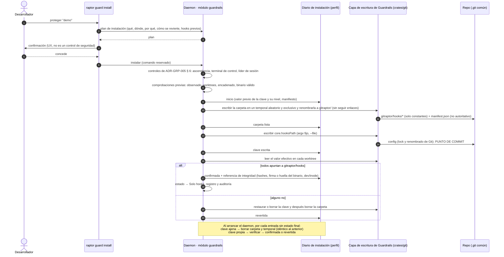

# Secuencia — Instalación transaccional y recuperación (US-GRD-001, US-GRD-002, US-GRD-003)

Muestra el comando reservado, el diario en el perfil, la carpeta escrita con renombrado atómico, el único punto de commit (la clave local) y la verificación por worktree. Al final, cómo recupera el daemon una instalación interrumpida.

