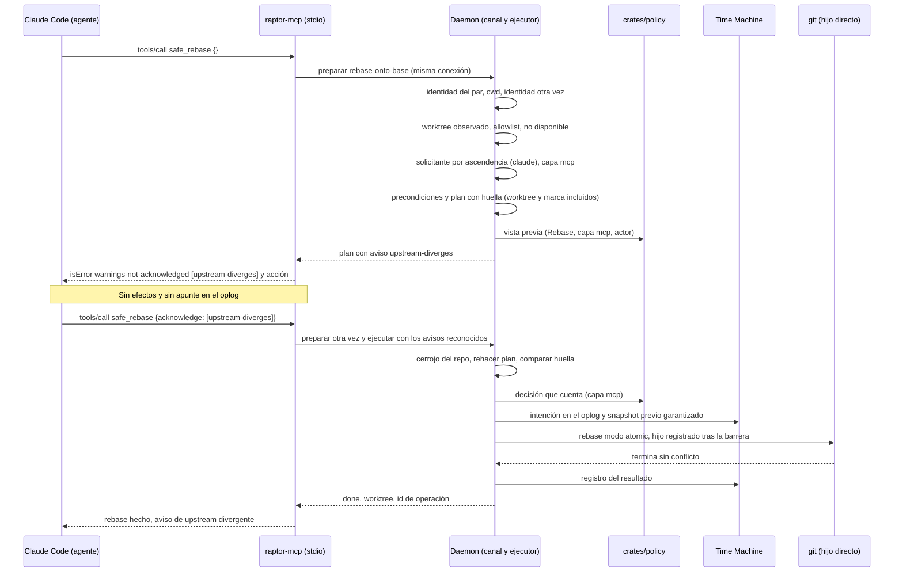

# Secuencia — Herramienta MCP de escritura (`safe_rebase` de una rama ya empujada)

> Covers: BR-14, BR-16 (BR-MCP-WF-001, CALC-001, VAL-005, EDGE-004, EDGE-007, TIME-001, TIME-002) · ADR-MCP-001 § 2 a § 7, ADR-CKP-002 § 2 a § 4 y § 9 · US-MCP-003, US-MCP-009, US-MCP-011, US-MCP-018.

Claude Code lanzó `raptor-mcp` con el cwd en su worktree. El agente pide `safe_rebase`. El daemon comprueba la identidad del par, lee su cwd, resuelve ámbito, allowlist y solicitante, y prepara el plan. El plan trae el aviso de upstream divergente: la primera llamada se rechaza sin efectos y la segunda, que lo reconoce, se ejecuta como operación protegida. La forma exacta de los métodos de preparar y ejecutar la fija TS-CKP-002; aquí se muestran como pasos.

**Variantes**:

- Repo fuera de la allowlist: el daemon responde `repo-not-enabled` antes de leer nada del repo; la herramienta devuelve el rechazo con la acción del desarrollador.
- El rebase choca: el ejecutor lanza `git rebase --abort` dentro de la misma operación (hijo del mismo plan, sin reevaluar) y el resultado es `conflict-reverted` con las rutas.
- La operación pasa de 30 s: la herramienta devuelve `running` con el id; la operación sigue y el agente consulta el resultado con `explain_history`.
- El agente cancela la llamada o cierra la sesión: la operación termina igualmente y queda en el timeline.
