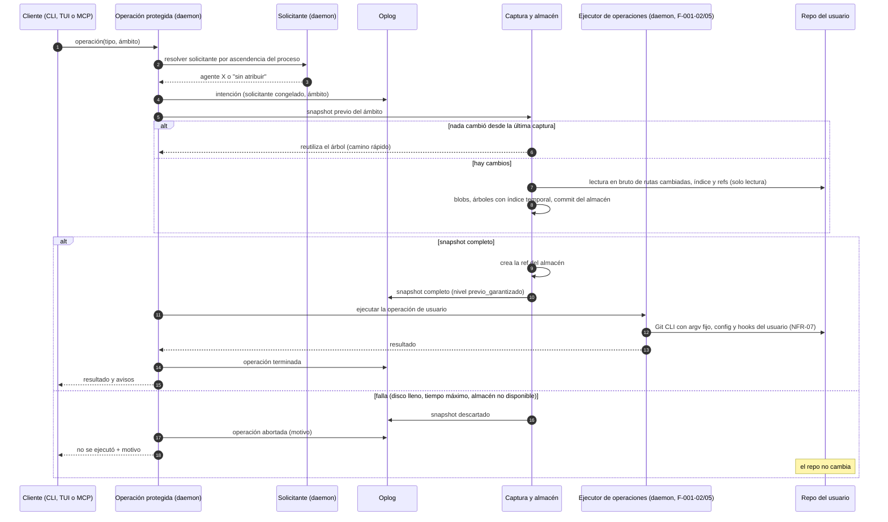

# Secuencia — Operación de GitRaptor con snapshot previo garantizado

> Covers: US-TMC-001, US-TMC-020 · ADR-TMC-004 § 1, ADR-TMC-001, ADR-TMC-003 § 3. Una superficie de GitRaptor (CLI, TUI o MCP) pide una operación que modifica el repo; sin snapshot previo válido no se ejecuta.

