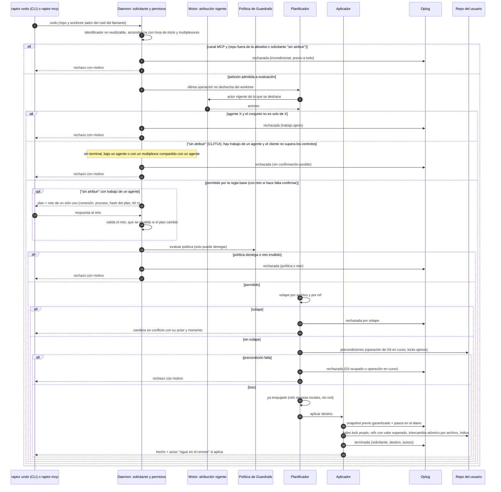

# Secuencia — Undo con solicitante, confirmación, política y solape

> Covers: US-TMC-002, US-TMC-012, US-TMC-013, US-TMC-014, US-TMC-015, US-TMC-021 · ADR-TMC-005, ADR-TMC-002 § 3-4, SEC-TMC-03, SEC-TMC-15. Orden: allowlist y canal, validación, conjunto, regla base, confirmación, política, solape, precondiciones. Cada rechazo termina el flujo: el repo no cambia y la petición queda en el oplog.

