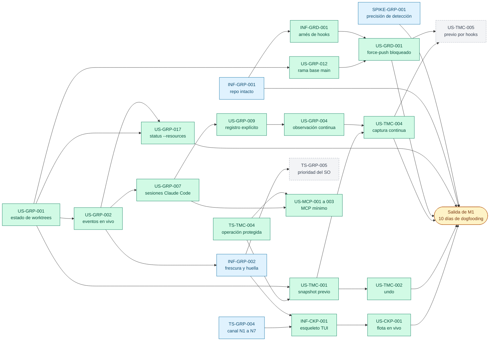

# Product Backlog

> Índice maestro de GitRaptor. Agrupa las Épicas y, dentro de ellas, las Features. Cada Feature enlaza a su `context.md` en `docs/requirements/features/<feature>/`.
> Fuente del alcance: [BRD-GRP-001](../business/gitraptor-documento-de-negocio.md) § 6.
> Estado de cada ficha, por feature y por hito: [release-status.md](release-status.md), generado con `node tools/status/release-status.mjs` desde el frontmatter de las fichas (no se edita a mano; docs-lint falla si está desactualizado).
> Hitos y control de estado: [plan de releases](release-plan.md) (M1, M2, M3 y M4 = v0.1.0, con criterio de salida, avance y fecha estimada por velocidad real; propuesto el 2026-10-08, pendiente de la aprobación de Rene Bonilla).

---

## Epic: E-001 - MVP Fase 1: Cockpit + Time Machine + Guardrails (CLI/TUI + MCP)
**Status**: In Progress | **Value**: High
> Hipótesis: una persona que orquesta varios agentes de IA (en el MVP, Claude Code con soporte completo y el resto como "otro agente"; Q32, BRD v0.5) en paralelo sobre el mismo repo necesita **ver** qué hace cada agente, **deshacer** cualquier operación sin perder datos y **acotar** lo que los agentes pueden hacer con Git. Si el MVP lo resuelve desde la terminal y vía MCP, el usuario adopta GitRaptor en su día a día (ver KPIs en BRD § 9).

### Features

*   **F-001-01**: Motor local (BR-01, BR-02, BR-03)
    -   **Contexto**: [context.md](features/motor-local/context.md)
    -   **Historias**: [user-stories.md](features/motor-local/user-stories.md) (22 historias expandidas en `features/motor-local/user-stories/`: 16 del 2026-10-03, US-GRP-017 a 019 (recursos) del 2026-10-05 y US-GRP-020 a 022 (repos descubiertos y `raptor clone`) del 2026-10-07; ninguna bloqueada desde el 2026-10-04: US-GRP-013 y US-GRP-016 se desbloquearon al aceptarse ADR-GRP-007, que cierra P8)
    -   **Implementación (2026-10-08)**: US-GRP-001, 002, 004, 007, 009, 012, 017, 020 y 022 implementadas; TS-GRP-001 y 002 hechas; TS-GRP-003 y TS-GRP-006 implementadas; TS-GRP-004, INF-GRP-001 a 004, TD-GRP-001, SPIKE-GRP-001 y SPIKE-GRP-002 implementadas en parte. Detalle y PR en la sección "Estado de la implementación" de cada ficha.
    -   **Status**: In Progress

*   **F-001-02**: Cockpit (BR-04, BR-05, BR-06, BR-07)
    -   **Contexto**: [context.md](features/cockpit/context.md) (reglas en [business-rules.md](features/cockpit/business-rules.md), 2026-10-04; decisiones Q-CKP-1 a Q-CKP-30 tomadas por el orquestador y validadas por PO y Arquitecto. Depende de 14 huecos del motor y de otras features, anotados como DEP-CKP-1 a DEP-CKP-14 sin aplicar; entre ellos SPIKE-CKP-001/ADR-CKP-001 (predicción de conflictos) y ADR-CKP-002 (catálogo y ejecutor de operaciones))
    -   **Historias**: [user-stories.md](features/cockpit/user-stories.md) (25 historias en `features/cockpit/user-stories/`, 2026-10-04, tras aprobar Rene Bonilla el requerimiento (marca del 2026-10-05), más US-CKP-025 (la TUI en un repo no observado) y US-CKP-026 (autoría del último commit en la flota) del 2026-10-07; 25 listas para Dev Spec y 1 bloqueada: US-CKP-023, la cola de confirmación, por US-GRD-015 y el factor fuera de banda de Q-GRD-19. DAG en olas con esqueletos US-CKP-001 (lectura) y US-CKP-014 (escritura))
    -   **Implementación (2026-10-08)**: US-CKP-001 y US-CKP-026 implementadas y US-CKP-025 en parte; TS-CKP-002, TS-CKP-004, TS-CKP-005 e INF-CKP-001 implementadas. Detalle y PR en la sección "Estado de la implementación" de cada ficha.
    -   **Status**: In Progress

*   **F-001-03**: Time Machine (BR-08, BR-09, BR-10)
    -   **Contexto**: [context.md](features/time-machine/context.md)
    -   **Historias**: [user-stories.md](features/time-machine/user-stories.md) (21 historias expandidas en `features/time-machine/user-stories/`, 2026-10-03; desde el 2026-10-04, 2 bloqueadas (US-TMC-011 por P17, US-TMC-020 por SPIKE-TMC-001) y 1 fuera del MVP (US-TMC-021, Fase 2), por decisiones de Rene Bonilla)
    -   **Implementación (2026-10-08)**: US-TMC-001, 002 y 004 y TS-TMC-001 a 004 implementadas; SPIKE-TMC-001 hecho. Detalle y PR en la sección "Estado de la implementación" de cada ficha.
    -   **Status**: In Progress

*   **F-001-04**: Guardrails (BR-11, BR-12, BR-13, BR-26)
    -   **Contexto**: [context.md](features/guardrails/context.md) (reglas en [business-rules.md](features/guardrails/business-rules.md), 2026-10-03)
    -   **Historias**: [user-stories.md](features/guardrails/user-stories.md) (19 historias en `features/guardrails/user-stories/`, 2026-10-04 y 2026-10-06; 18 listas y 1 bloqueada, US-GRD-016, por el MCP. US-GRD-018 (política de autoría de los commits) y US-GRD-019 (quién ejecutó frente a a nombre de quién entra) se añadieron el 2026-10-06 por BR-26 y D6 del BRD (decisión de Rene Bonilla); entran en el MVP, fuera de M1 (decisión del orquestador, 2026-10-06, validada por el PO). US-GRD-013 y US-GRD-015 se desbloquearon el 2026-10-04 al aceptarse ADR-GRD-008 (factor del SO de Q-GRD-19); su Dev Spec espera a SPIKE-GRD-002. ADR-GRP-005 a 013 y ADR-GRD-001 a 008 aceptados el 2026-10-04. Pendiente del PO: historia de la relajación personal pendiente (Q-GRD-32) y de la adopción del factor por D8, desinstalar y la excepción (OQ-GRD-008-3))
    -   **Implementación (2026-10-08)**: US-GRD-001, US-GRD-002 y US-GRD-019 implementadas y US-GRD-003, US-GRD-005 y US-GRD-018 en parte; TS-GRD-001 e INF-GRD-001 implementadas y SPIKE-GRD-001 en parte. Detalle y PR en la sección "Estado de la implementación" de cada ficha.
    -   **Deuda técnica (2026-10-08)**: [TD-GRD-001](features/guardrails/technical-stories/TD-GRD-001-dispatcher-plantilla-3-pre-push-toda-ref.md) (`draft`, prioridad alta, Dev Spec pendiente): dispatcher plantilla 3 para evaluar el `pre-push` de toda ref empujada (tags, notes y demás refs no gobernadas). Residuo declarado `policy-reach` de DS-US-GRD-008; nota B1 del Arquitecto resuelta por el coordinador.
    -   **Status**: In Progress

*   **F-001-05**: Servidor MCP (BR-14, BR-15, BR-16)
    -   **Contexto**: [context.md](features/mcp/context.md) (reglas en [business-rules.md](features/mcp/business-rules.md), 2026-10-04; decisiones Q-MCP-1 a Q-MCP-31 tomadas por el orquestador y validadas por PO y Arquitecto. Cubre BR-14, BR-16 y NFR-02; BR-15 parcial por D2 (solo Claude Code). El MCP es cliente del daemon y comparte el catálogo de operaciones del Cockpit (DEP-CKP-7). Depende de 9 huecos anotados como DEP-MCP-1 a DEP-MCP-9 sin aplicar; entre ellos ADR-MCP-001 (contrato del MCP), ADR-CKP-002 (catálogo y ejecutor) y la enmienda de comandos reservados por el "confused deputy" de los hooks. Desbloquea US-GRD-016 cuando exista ADR-MCP-001)
    -   **Historias**: [user-stories.md](features/mcp/user-stories.md) (19 historias expandidas en `features/mcp/user-stories/`, 2026-10-04, en 5 olas según Q-MCP-19; requerimiento aprobado por Rene Bonilla el 2026-10-05. 18 esperan ADR-MCP-001 (bloqueo de arquitectura, DEP-MCP-1; US-MCP-002 solo espera DEP-MCP-3 y DEP-MCP-4); las escrituras esperan además ADR-CKP-002 (propuesto). Bloqueo de producto: US-MCP-014 por la cola de confirmación US-GRD-015. Desbloquean US-GRD-016)
    -   **Implementación (2026-10-08)**: US-MCP-001, 002, 003 y 005 implementadas. Detalle y PR en la sección "Estado de la implementación" de cada ficha.
    -   **Status**: In Progress

---

## Hito M1 — Dogfooding

**Status**: En curso — en validación (dogfooding) (2026-10-08) | **Valor**: High
> Hitos siguientes (M2, M3 y v0.1.0) y fecha estimada de cada uno: [plan de releases](release-plan.md).
> **Decisión de Rene Bonilla (2026-10-05)**: las próximas tandas se orientan a M1, el mínimo para usar GitRaptor a diario mientras se desarrolla GitRaptor con agentes. Le preocupa también que GitRaptor consuma los recursos del equipo del usuario. El alcance, el criterio de salida y el DAG son **decisión del orquestador (2026-10-05), validada por el PO y el Arquitecto** (ajustes al final). Las NFRs de recursos están en [non-functional.md](../architecture/non-functional.md) § Consumo de recursos y en [ADR-GRP-015](../architecture/decisions/ADR-GRP-015-consumo-recursos.md).

### Objetivo

Rene desarrolla GitRaptor a diario con varias sesiones de Claude Code en paralelo y, con GitRaptor, **ve** la flota en vivo, **deshace** lo que un agente rompa (también con Git crudo) y **no sufre** un force-push de un agente, sin notar que GitRaptor gasta recursos de su máquina.

### Criterio de salida

M1 termina cuando se cumplen los seis puntos, verificados en **macOS** (Linux y Windows: *Pendiente: etapa de validación multiplataforma*):

1. **Uso real**: 10 días laborables seguidos en el repo de GitRaptor, con al menos 3 sesiones de Claude Code en paralelo y el daemon encendido. Los tests siguen en repos temporales (NFR-01); el dogfooding es uso real, no un test.
2. **Detección**: SPIKE-GRP-001 cerrado con su Research Brief: al menos el 90 % de las sesiones detectadas y 0 trabajo humano atribuido a Claude Code.
3. **Cero pérdida de datos**: el gate "repo intacto" (INF-GRP-001) está en verde y se recuperó con `raptor undo` al menos una operación destructiva real de un agente (por ejemplo, un `reset --hard` con trabajo sin commitear).
4. **Protección**: un force-push de un agente a un repo protegido queda bloqueado (US-GRD-001).
5. **Recursos**: los gates RES-01 y RES-02 de INF-GRP-002 están en verde en CI, y `raptor status --resources` (US-GRP-017) muestra a diario la CPU en reposo y la memoria del daemon dentro de su objetivo (CPU < 1 % y RSS < 150 MB con 10 worktrees). ⚠️ **ASSUMPTION**: Rene confirma esas cifras antes de cerrar M1; la cifra exacta del gate la fija la Dev Spec de INF-GRP-002.
6. **Frescura**: la TUI refleja un cambio en menos de 500 ms p95 (NFR-04, gate de INF-CKP-001 e INF-GRP-002).

### Estado del criterio de salida (2026-10-08)

Todo lo que el criterio de salida necesita construir está en `main`. Lo que falta es, sobre todo, evidencia de uso real. Evaluación del orquestador (2026-10-08), validada por el PO.

| # | Criterio | Estado | Evidencia y PR | Qué falta |
|---|---|---|---|---|
| 1 | Uso real | En curso | Primer dogfooding el 2026-10-06 (#126). Instrumento: registro diario de dogfooding, PR #188 ([`tools/dogfooding/`](../../tools/dogfooding/README.md)): una muestra cada 15 minutos con `launchd`, informe del día con el semáforo de los criterios 1, 2 y 5, y la racha | Que Rene lo instale (`tools/dogfooding/install.sh`) y 10 días laborables seguidos con al menos 3 sesiones. El registro es también la evidencia de los criterios 2 (con las marcas de falsos positivos de Rene), 3 (nota de la recuperación real) y 5 (lectura diaria) |
| 2 | Detección | No cumplido | SPIKE-GRP-001 en parte: S1 y S3 (#80) y S4 (#155, #169) con suites guionizadas en macOS | Medición en el dogfooding real (2 semanas, al menos 50 sesiones) y su Research Brief |
| 3 | Cero pérdida de datos | En parte | Gate "repo intacto" en verde y obligatorio en CI en los tres SO (#30, #34, #97, #109, #113, #163); `raptor undo` deshace operaciones de GitRaptor y Git crudo (US-TMC-002 #90, US-TMC-004 #120) | Recuperar con `raptor undo` una operación destructiva **real** de un agente y anotarla en el registro de dogfooding |
| 4 | Protección | Cumplido (capacidad) | US-GRD-001 (#116, #121): `e2_a_force_push_is_denied_by_the_safe_minimum` ejecuta Git directo con los hooks activos, como lo haría un agente; el mínimo seguro deniega el force-push a cualquier solicitante, agente incluido. Verificado con Git 2.38.5, 2.50 y 2.56 | Nada. El criterio no exige verlo en uso real |
| 5 | Recursos | En parte | Banco de INF-GRP-002 con RES-01 y RES-02 en CI (#76, calibrado en #98): corre en cada PR (ubuntu), en cada push a `main` y cada noche (ubuntu y macOS), sin ser un check obligatorio. `raptor status --resources` (US-GRP-017, #93, #173). CPU en reposo con sesiones: banco `idle` y escaneo S1 sin syscalls por proceso, de 0,38 a 0,08 % con 10 sesiones y 10 worktrees (#192) | La lectura diaria dentro del objetivo durante el dogfooding. ⚠️ **ASSUMPTION** abierta: solo Rene puede confirmar las cifras (CPU < 1 %, RSS < 150 MB con 10 worktrees) |
| 6 | Frescura | Cumplido en macOS | Escenario `tui-modify` del banco con `--gate reference` en el Mac: p95 de punta a punta 125,9 ms (#118); gate de 100 ms de la TUI (#100) y gate E2 con el daemon real (#174). En CI (ubuntu) p95 223,2 ms; allí los 500 ms solo se reportan y bloquea el techo de regresión | Linux y Windows: *Pendiente: etapa de validación multiplataforma* |

**Partes de cada INF que exige M1** (propuesta del PO, aceptada por el orquestador, 2026-10-08): de INF-GRP-001, el gate "repo intacto"; de INF-GRP-002, los gates RES-01 y RES-02 y el de frescura. La auditoría dinámica de `exec` (INF-GRP-001) y RES-03, RES-04, RES-05 y RES-07 (INF-GRP-002) no las pide ningún criterio de salida: pasan a M2, igual que N8 a N11 de TS-GRP-004. Siguen en el MVP.

### Alcance

| Bloque | Item | Prioridad M1 | Estado al 2026-10-08 | Por qué está |
|---|---|---|---|---|
| Ver | US-GRP-001 | Must | Implementada (#46) | Base de todo: repo observado |
| Ver | US-GRP-002 | Must | Implementada (#57, #75) | Cambios y eventos en vivo |
| Ver | US-GRP-007 | Must | Implementada (#80, #119, #124, #155, #169) | Sesiones de Claude Code, el único agente del MVP |
| Ver | US-GRP-009 | Must | Implementada (#106) | La pide US-GRP-004 (registros que sobreviven al reinicio) |
| Ver | US-GRP-004 | Must | Implementada (#112) | Observación continua; la pide la captura continua (US-TMC-004) |
| Ver | TS-GRP-004: N1 a N7 de ADR-CKP-003 § 4 | Must | Implementados (#87). La TS queda en parte por N8 a N11 | Lo que necesita INF-CKP-001; N8 a N11 son Should |
| Ver | INF-CKP-001 | Must | Implementada (#100, #139, #174) | Esqueleto de la TUI y gate de 100 ms |
| Ver | US-CKP-001 | Must | Implementada (#118; ajustes en #126, #130, #131, #136) | La flota en vivo en la TUI |
| Ver | SPIKE-GRP-001 | Must | En parte (#80, #155, #169): falta la medición en dogfooding | Se valida durante el dogfooding (criterio 2) |
| Deshacer | TS-TMC-004 | Must | Implementada (#40) | Operación protegida y solicitante |
| Deshacer | US-TMC-001 | Must | Implementada (#61) | Snapshot previo de las operaciones de GitRaptor |
| Deshacer | US-TMC-002 | Must | Implementada (#90) | `raptor undo` |
| Deshacer | US-TMC-004 | Must | Implementada (#120) | **Añadida por el PO**: Claude Code usa Git crudo y `operation.run` aún no existe; sin captura continua el undo no protege nada en el dogfooding |
| Deshacer | US-TMC-006 | Must | Implementada (#198) | `raptor timeline`: qué cambió, cuándo y quién |
| Proteger | US-GRP-012 | Must | Implementada (#55) | Dependencia de US-GRD-001 (rama base `main`) |
| Proteger | INF-GRD-001 | Must | Implementada (#65, #121) | Arnés de la capa de hooks |
| Proteger | US-GRD-001 | Must | Implementada (#116, #121) | Force-push de un agente bloqueado |
| Gates | INF-GRP-001 | Must | En parte; la parte de M1 (gate "repo intacto") está hecha (#30 y siguientes) | Repo intacto: se usa sobre un repo real y propio |
| Gates | INF-GRP-002 | Must | En parte; la parte de M1 (RES-01, RES-02 y frescura) está hecha (#76, #98, #133) | Frescura y huella (RES-01, RES-02) como gate |
| Recursos | US-GRP-017 | Must | Implementada (#93, #173) | Mide el criterio 5 cada día |
| Recursos | TS-GRP-005 | Should | Sin empezar (Dev Spec pendiente) | Prioridad de segundo plano del SO (RES-06, RES-07) |
| Deshacer | US-TMC-005 | Should | Sin empezar | Previo por los hooks que M1 ya instala; poco coste extra |
| MCP mínimo | US-MCP-001, US-MCP-002, US-MCP-003 | Should | Implementadas (#70, #140, #159) | No bloquea la salida: la detección funciona por observación y US-MCP-002 arrastra US-GRP-006 y US-GRD-004. Si no entra, es lo primero de M2 |
| Ver | TS-GRP-004: N8 a N11 | Should | Pendiente; pasan a M2 | Solo si una historia de M1 los usa |

**Fuera de M1** (siguen en el MVP): US-TMC-022 (tope de disco; sube a M1 si US-GRP-017 mide un almacén de más de 2 GiB), US-GRP-018 (`raptor doctor`), US-GRP-019 (ahorro de energía; el predictor no está en M1), US-GRP-014, US-GRP-015 e INF-GRP-004 (Rene ya tiene Git y compila desde el código), el predictor de conflictos (SPIKE-CKP-001, TS-CKP-001) y la política de autoría de los commits (US-GRD-018 y US-GRD-019, BR-26): el criterio de salida no la necesita y Claude Code ya añade el trailer `Co-Authored-By` por defecto (decisión del orquestador, 2026-10-06, validada por el PO). Tampoco entran los repos descubiertos (US-GRP-020 y US-GRP-022, Should), `raptor clone` (US-GRP-021, Could) ni la TUI en un repo no observado (US-CKP-025, Should): Rene ya observa sus repos con `raptor repo add` (decisión del orquestador, 2026-10-07, validada por el PO). US-CKP-025 corrige el hallazgo 1 del dogfooding y conviene tomarla en cuanto haya un agente libre. **Al 2026-10-08 ya están en `main`**, sin cambiar el alcance de M1: US-GRD-019, US-GRP-020, US-GRP-022, US-CKP-026 y US-MCP-005 implementadas, y US-GRD-005, US-GRD-018 y US-CKP-025 en parte.

### DAG del hito

Las aristas son "requiere terminada". En verde, lo implementado; en azul, lo implementado en parte (la parte que exige M1 está hecha, salvo SPIKE-GRP-001); en gris, los Should, que no bloquean la salida. Estado al 2026-10-08.

**Ruta crítica** (2026-10-05; al 2026-10-08 toda la ruta está implementada y queda el dogfooding): US-GRP-001 → 002 → 007 → 009 → 004 → US-TMC-004 → salida. En paralelo desde hoy: TS-TMC-004 → US-TMC-001 → 002; INF-GRP-001 → INF-GRD-001 → US-GRD-001; INF-GRP-002 y los N1 a N7 del canal → INF-CKP-001 → US-CKP-001.

### Riesgos

1. **¿Alcanza `raptor undo` lo que capturó US-TMC-004?** Si la pila de undo de US-TMC-002 no llega a las operaciones de Git crudo capturadas, el criterio 3 necesita US-TMC-009 (restaurar un punto), que arrastra el timeline (US-TMC-006). Lo confirma la Dev Spec de US-TMC-002 antes de empezarla. Si no llega, US-TMC-009 entra en M1. **Resuelto (2026-10-08)**: US-TMC-004 (#120) mete el Git crudo en la pila de undo, así que no hace falta US-TMC-009 (#90).
2. **N1 a N11 del canal tienen un dueño externo** (TS-GRP-004) y pueden retrasar US-CKP-001. **Resuelto (2026-10-08)**: N1 a N7 entraron con #87 y US-CKP-001 con #118.
3. **Sin canal de instalación**, el binario compilado puede desfasarse del daemon en marcha; ADR-GRP-005 § 4 ("versión incompatible") lo detecta.
4. **US-GRD-001 tiene el merge bloqueado** por SPIKE-GRD-001 en Linux y Windows. Para M1 se acepta en macOS. *Pendiente: etapa de validación multiplataforma*. **Estado (2026-10-08)**: US-GRD-001 se mergeó (#116) y #121 midió las tablas con Git 2.56; la matriz de Linux y Windows sigue pendiente.
5. **Cifras de huella sin decidir**: RES-01 y RES-02 son ⚠️ **ASSUMPTION** hasta que Rene las confirme (criterio 5). Sigue abierto al 2026-10-08.

### Decisiones registradas

| Decisión | Quién |
|---|---|
| Objetivo, criterio de salida y alcance de M1 | Decisión del orquestador (2026-10-05), validada por el PO |
| Añadir US-GRP-001, US-GRP-009, US-GRP-004, US-GRP-012, US-TMC-004, INF-GRP-001 e INF-GRP-002 a la propuesta inicial | Propuesta del PO, aceptada por el orquestador |
| De los cambios del canal, solo N1 a N7 son Must | Propuesta del PO, aceptada por el orquestador |
| **MCP mínimo como Should, no como Must ni fuera de M1** | El PO propuso sacarlo de M1. El orquestador lo deja como Should porque US-MCP-001 ya está en curso, pero no bloquea la salida |
| US-GRP-017 Must; TS-GRP-005 Should; US-TMC-022, US-GRP-018 y US-GRP-019 fuera de M1 | Decisión del orquestador (2026-10-05), validada por el PO y el Arquitecto |
| Repos descubiertos y observación por niveles (propuestas A1 a A4 y B de Rene Bonilla, 2026-10-06): US-GRP-020 y US-GRP-022 Should, US-GRP-021 Could y US-CKP-025 Should, todas en el MVP y fuera de M1; nueva BR-AUTH-003 y enmienda de BR-AUTH-001; la notificación nativa del SO queda fuera del MVP (**Decisión de Rene (2026-10-07)**: ratificado; en el MVP el aviso solo sale en la TUI); A4 pasa a la épica E-002 (Fase 2); la observación por niveles no tiene historia propia y se ve en la enmienda de US-GRP-017 | Decisión del orquestador (2026-10-07), validada por el PO. El PO separó US-GRP-022 de US-GRP-020 (seis escenarios como máximo) |
| Estado de M1 al 2026-10-08: "En curso — en validación (dogfooding)"; criterios 4 y 6 cumplidos, 3 y 5 en parte, 1 en curso y 2 sin cumplir; hace falta un registro diario de dogfooding como evidencia de los criterios 1, 2, 3 y 5 | Evaluación del orquestador (2026-10-08), validada por el PO. El PO pidió no llamarlo "construcción completa" mientras INF-GRP-001 e INF-GRP-002 estén en parte |
| La auditoría dinámica de `exec` (INF-GRP-001), RES-03, RES-04, RES-05 y RES-07 (INF-GRP-002) y N8 a N11 de TS-GRP-004 pasan a M2; siguen en el MVP | Propuesta del PO (2026-10-08), aceptada por el orquestador: ningún criterio de salida los exige |

---

## Epic: E-002 - Fase 2: Revisión e integración con la plataforma de código
**Status**: Propuesta (2026-10-07) | **Value**: Medium
> Fuente: BRD § 6.2 (Fase 2). No se construye en el MVP. Sin features ni historias expandidas todavía.

*   **Conectar GitHub o Azure DevOps** (propuesta A4 de Rene Bonilla, 2026-10-06; Q48 del contexto del Motor local): el desarrollador conecta su cuenta de GitHub o de Azure DevOps para listar sus repos remotos, clonar uno y observarlo en un paso, y enlazar las ramas de los agentes con sus PRs. Encaja con BR-19 (creación de PRs con work items).
    -   **Condición**: **opt-in explícito**. Sin conectar nada, GitRaptor no usa la red ni guarda tokens (NFR-03, 100 % local). Conectar una cuenta es una decisión del humano, nunca de un agente; observar un repo clonado así sigue exigiendo su confirmación (BR-AUTH-003).
    -   **Status**: Propuesta (pendiente de la edición que le corresponde, pregunta abierta 5 del BRD)
