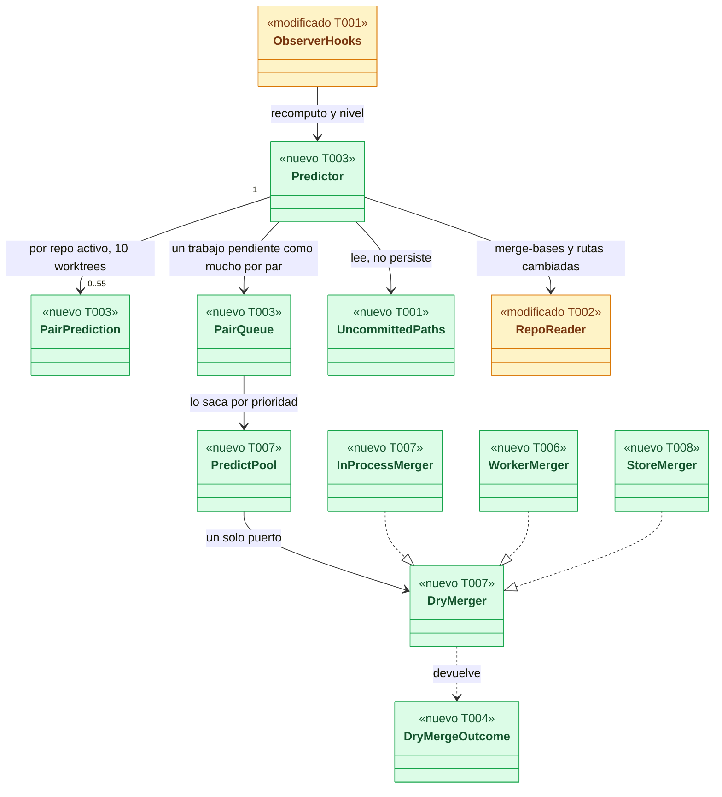
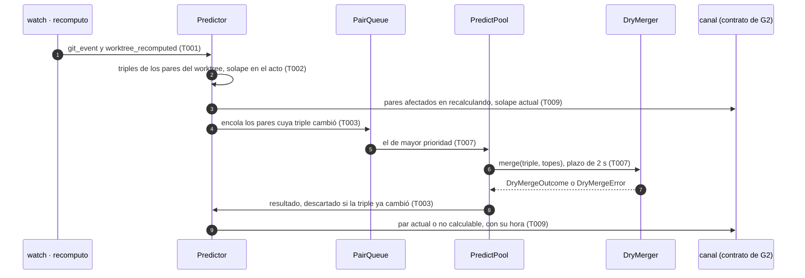
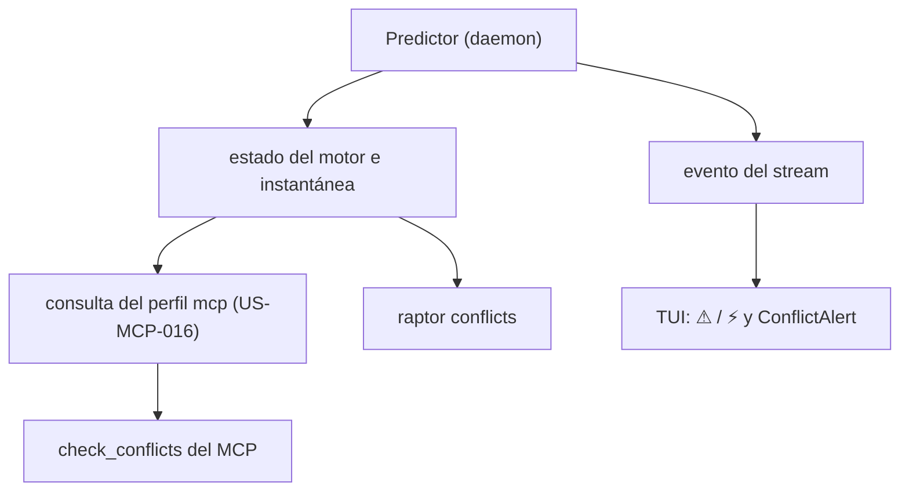
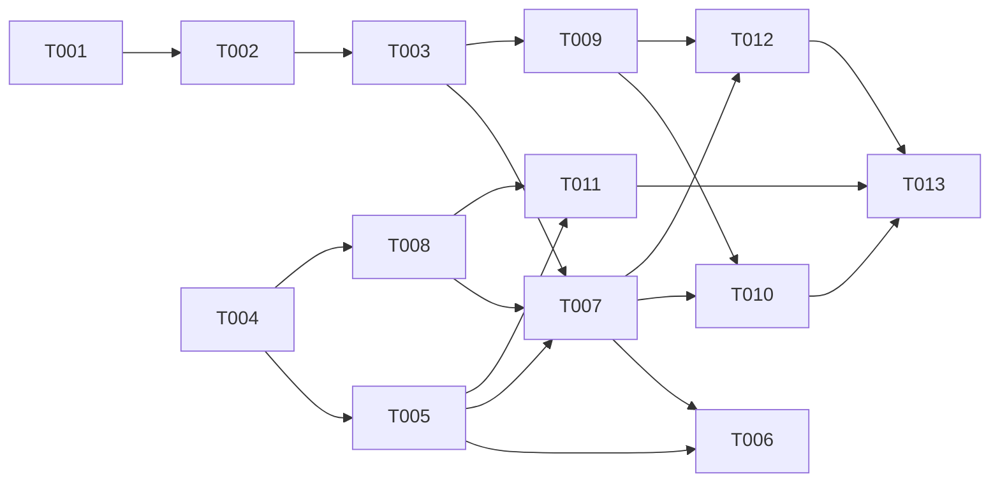

# DS-TS-CKP-001 · Predictor de conflictos en el daemon

## Contexto rápido

Al terminar, la TUI, `raptor conflicts` y `check_conflicts` del MCP leen del motor, para cada par de worktrees y para cada worktree contra la rama base, qué archivos se tocan a la vez (⚠ solape) y qué archivos chocarían al integrar, con los rangos de líneas (⚡ conflicto previsto). Cada par llega con su estado y su hora de cálculo, y el repo del usuario queda intacto. Hoy no pueden: `attention.conflicts` se publica como no disponible (`crates/api/src/scope.rs:110`) y el motor no tiene módulo de predicción.

Para eso, la entrega monta cuatro piezas:

- el conjunto de rutas sin commitear de cada worktree, retenido en memoria;
- el módulo `predict` de `crates/core`, con los pares, el solape, los estados, la caché y la cola;
- el merge en seco de `crates/git`, con el mecanismo que elija SPIKE-CKP-001;
- la publicación por el canal.

Las decisiones son de ADR-CKP-001 § 1 a § 8 y § 10; aquí no se reabren.

**Esto es un borrador condicionado.** El mecanismo, dónde corre y las cifras los fija [SPIKE-CKP-001](../research/SPIKE-CKP-001-plan.md) (G1). Por eso el plan tiene una rama por cada salida del SPIKE, y nada se implementa antes de sus resultados.

| Término | Qué es aquí |
|---|---|
| Par | Worktree contra la rama base, o worktree contra worktree. Con 10 worktrees hay hasta 55 |
| Trabajo propio | Rutas cambiadas entre `merge-base(punta, base)` y la punta, más las rutas sin commitear. Sin trabajo propio un worktree no forma pares |
| Solape (⚠) | Intersección de rutas de trabajo propio, incluido lo sin commitear. No lee contenido |
| Conflicto previsto (⚡) | Merge en seco de lo commiteado: archivos en conflicto, su tipo y los hunks como rangos de líneas |
| Merge en seco | Merge de dos commits cuyo resultado nunca se escribe en el repo |
| Triple | Punta A, punta B y merge-base: la clave de la caché de un par |
| A2, A2-W, B | Alternativas del plan del SPIKE (§ 2): merge en memoria en el daemon, el mismo en un proceso trabajador, y `merge-tree` en un almacén del perfil |
| S1…S6 | Salidas del árbol de decisión del plan del SPIKE (§ 5) |

### Ramas de decisión

| Rama | Salida del SPIKE | Mecanismo | Dónde corre | Tareas propias |
|---|---|---|---|---|
| **R-A2** | S1, o S4 si las cotas pasan en el proceso | `gix_merge::tree` con plataforma de blobs sin drivers, pila de atributos vacía y objetos en memoria | Pool `utility` del daemon | T005 |
| **R-A2W** | S2, o S4 si las cotas solo pasan fuera | El de R-A2 | Proceso trabajador: el propio binario, con límites de CPU y memoria | T005, T006 |
| **R-B** | S3 o S3b | `git merge-tree --write-tree` con `--git-dir` en un almacén *bare* del perfil con `alternates` | Un `git` por par (2.38) o por lote (`--stdin`, ≥ 2.39) | T008 |
| **R-SOLAPE** | S6 | Ninguno: el ⚡ se publica "no disponible" hasta un ADR nuevo | — | Ninguna; borra T004 a T008, T011 y T012 |

S5 (ninguna cumple los 5 s) no elige rama: deja el escenario de T012 como aviso y lleva el objetivo al PO (Q-CKP-6). Al cerrar G1, el orquestador borra las tareas de las ramas descartadas y sus aristas en `Depende:`.

**Decisiones del orquestador (2026-10-09), validadas por Arquitecto:**

- **D1**: la Dev Spec existe como borrador condicionado (`status: draft`, `ready_to_implement: false`), con G1 como hueco bloqueante del spec entero. Es compatible con el propósito de la regla de ADR-CKP-001 ("no se escribe antes"): no implementar sobre un mecanismo sin medir.
- **D2**: una rama por salida del SPIKE (tabla de arriba). Las tareas comunes no cambian de rama a rama.

**Decisiones del Arquitecto como autor de la Dev Spec (2026-10-09), aceptadas por el orquestador al revisar el borrador (2026-10-09):**

- **D3**: ninguna tarea arranca antes del SPIKE; no hay `blocked_tasks`. Las tareas que no dependen del mecanismo (T001 a T003) toman sus cifras del SPIKE (E11: tope de rutas y memoria del solape), y sin el contrato (G2) no publican nada que se pueda probar de punta a punta. Al cerrar G1, el spec pasa a `ready_to_implement: true` con `blocked_tasks` igual al cierre de G2.
- **D4**: **repo dormido** (ADR-GRP-010, Enmienda 2026-10-07, N1: "sin estado residente"). El predictor suelta la caché y los conjuntos de rutas del repo y publica sus pares `pendiente (repo dormido)`, con el último resultado y su hora. Al despertar, recalcula como en el cálculo inicial.
- **D5**: **ahorro de energía** (ADR-GRP-015 § 2, decisión de Rene del 2026-10-05: "pausar el predictor"). Se pausan los dos niveles. Los pares quedan `pendiente (ahorro de energía)`, con el último resultado y su hora. Al volver a corriente se recalculan los pares cuya triple cambió.
- **D6**: la subida de `gix` a ≥ 0.89.0 va en un PR `chore/` propio antes de T005 (G3). La feature `merge` se pide solo en la dependencia de `crates/git`.
- **D7**: los hunks se publican en las coordenadas de cada lado (ADR-CKP-001 § 3). Se calculan desde el blob fusionado con marcadores y un diff de alineación con cada lado. El método final y su fidelidad los fija E7 (G1).
- **D8**: el pool ve un solo puerto, `DryMerger`, con una implementación por rama. Así T003 y T007 no cambian entre R-A2, R-A2W y R-B.

---

## 📋 Índice

> **Para aprobar:** [Contexto rápido](#contexto-rápido) · [⚠️ Gaps](#gaps-y-violaciones-de-la-constitución) · [🔭 La forma](#la-forma) · [El trabajo de un vistazo](#el-trabajo-de-un-vistazo).
> **Para implementar:** [🚀 Plan](#plan-de-implementación), en orden. Las secciones `_(ref)_` se abren desde la tarea que las cita.

| Sección | Propósito |
|---------|-----------|
| [Contexto rápido](#contexto-rápido) | Qué se construye, las ramas y las decisiones |
| [⚠️ Gaps y violaciones de la constitución](#gaps-y-violaciones-de-la-constitución) | Qué impide empezar |
| [🔭 La forma](#la-forma) | Piezas, flujo y consumidores |
| [🚀 Plan de implementación](#plan-de-implementación) | T001…T013, en orden |
| ↳ [El trabajo de un vistazo](#el-trabajo-de-un-vistazo) | Las tareas, su rama y su orden |
| [Estructura de ficheros](#estructura-de-ficheros) _(ref)_ | Árbol de archivos |
| [Contratos compartidos](#contratos-compartidos) _(ref)_ | Tipos, ciclos de vida y firmas |
| [Contrato de API](#contrato-de-api) _(ref)_ | Publicación, errores y valores numéricos |
| [Modelo de datos](#modelo-de-datos) _(ref)_ | Lo que se guarda (casi nada) |
| [Estrategia de pruebas y cobertura](#estrategia-de-pruebas-y-cobertura) _(ref)_ | Pruebas y gates |
| [Gate de seguridad](#gate-de-seguridad) | Checklist previo al merge |
| [Fuera de alcance](#fuera-de-alcance) | Lo que esta entrega no toca |
| [Notas del autor](#notas-del-autor) _(ref)_ | Lo que no bloquea |

---

## ⚠️ Gaps y violaciones de la constitución

| ID | Qué falta | Severidad | Alcance | Acción | Owner |
|----|-----------|-----------|---------|--------|-------|
| G1 | Resultados de SPIKE-CKP-001: salida S1 a S6 (rama), dónde corre el merge, tope de rutas sin commitear por worktree, topes de archivos y hunks, tope de tamaño de blob, `rewrites.limit`, `marker_size_multiplier`, concurrencia, tiempo y memoria por par, si el prefiltro se mantiene, umbral de fidelidad y método de los rangos por lado (E7). Hoy todo es ⚠️ ASSUMPTION (`SPIKE-CKP-001-plan.md` § 7) | Bloqueante | todo el spec | Ejecutar el SPIKE; enmendar ADR-CKP-001 con los resultados; actualizar este spec: borrar las ramas descartadas, fijar § Valores numéricos y pasar a `ready_to_implement: true` | Orquestador (SPIKE) y Arquitecto |
| G2 | Forma del estado y del evento de predicción en el contrato: tipos, nombres de campos, consulta bajo demanda, evento de lote y capacidad. ADR-CKP-001 § 8 la deja "pendiente, dueño: worker del canal"; `api-contract-ipc.md:210` declara `repo.attention` sin emisor | Bloqueante | T009 | Fijar la forma en `api-contract-ipc.md` y en la Dev Spec de TS-GRP-004, con la consulta del perfil `mcp` de US-MCP-016 (ADR-CKP-001, Enmienda 2026-10-05) | Worker del canal (TS-GRP-004) |
| G3 | `gix` está en 0.88 sin la feature `merge` (`Cargo.toml:27`), y `gix-pack` 0.75 está fijado a esa versión (`Cargo.toml:30`). R-A2 y R-A2W necesitan `gix` ≥ 0.89.0 (F2: pérdida silenciosa de datos en 0.88) | Bloqueante | T005 | PR `chore/` que sube `gix` y `gix-pack` en el workspace, con la suite completa, `repo_intact` y los bancos de la Time Machine en verde. Añadir `merge` solo en `crates/git/Cargo.toml` | Orquestador |
| G4 | Enmiendas de ADR-GRP-009 que dependen de la rama, sin aplicar (ADR-GRP-009:224 y ADR-CKP-001, tabla de enmiendas). R-A2W: el lanzador del trabajador entra en la lista de la Validación 5, fuera de `crates/git`. R-B: `merge-tree` en la allowlist del § 3, un módulo de invocación nuevo y el almacén de trabajo de ADR-GRP-006 § 4 | Bloqueante | T006, T008 | Aplicar la enmienda de la rama elegida al cerrar G1 | Orquestador, con security-expert |
| G5 | TS-GRP-005 (`WorkClass::Utility` y `PowerSource`) está en `ready`, sin implementar. TS-CKP-001 no la lista en `related.stories` | Bloqueante | T007 | Implementar TS-GRP-005 antes de T007 y añadirla a las dependencias de TS-CKP-001 | Orquestador |

---

## 🔭 La forma

Cuando esto termine, el daemon tiene un módulo `predict` que escucha al observador, mantiene los pares de cada repo activo, calcula el solape en el acto y encola el merge en seco en un pool de prioridad baja detrás de un puerto con una implementación por rama.



🟩 nuevo · 🟨 modificado · ⬜ existente. Tras G1 sobrevive una sola implementación de `DryMerger` (dos en R-A2W, porque `WorkerMerger` ejecuta la misma función que `InProcessMerger`).

**Cómo fluye** un commit en un worktree, con R-A2:



El paso 9 es el único que cambia un contrato publicado, y su forma es G2. El paso 8 decide que un resultado viejo no se publique nunca como `actual`.

**Dónde acaba el dato:**



Los tres consumidores leen el mismo resultado del motor (BR-CKP-CONS-001). T009 comprueba que la instantánea y el evento llevan el mismo par con la misma hora.

---

## 🚀 Plan de implementación

> Se ejecuta en orden topológico (`Depende:`), solo con las tareas de la rama que elija G1. Rutas relativas a la raíz del repo.

### El trabajo de un vistazo

Tres frentes y un cierre: el predictor común (T001 a T003, T009), el merge en seco de la rama elegida (T004 a T008) y las verificaciones (T010 a T012), con T013 al final.

| # | Tarea | Depende | Aterriza en | Rama |
|---|---|---|---|---|
| T001 | Retener las rutas sin commitear y avisar al predictor del recomputo y del nivel | — | `crates/core/src/{observe.rs,watch}` | todas |
| T002 | Crear el módulo de predicción con los pares, el trabajo propio y el solape | T001 | `crates/core/src/predict`, `crates/git/src/reader.rs` | todas |
| T003 | Crear los estados, la caché por triple y la cola coalescente, y registrar el módulo del daemon | T002 | `crates/core/src/predict`, `daemon/modules` | todas |
| T004 | Crear los tipos del merge en seco y el extractor de hunks | — | `crates/git/src/dry_merge` | A2 · A2W · B |
| T005 | Implementar el merge en seco en memoria con `gix_merge::tree` | T004 | `crates/git/src/dry_merge/memory.rs` | A2 · A2W |
| T006 | Implementar el proceso trabajador del predictor | T005, T007 | `crates/core/src/predict/worker`, `apps/cli/src/commands` | A2W |
| T007 | Montar el pool `utility` con los topes por par y la pausa por ahorro de energía | T003, T005, T008 | `crates/core/src/predict/pool.rs` | A2 · A2W · B |
| T008 | Implementar el merge en seco con `merge-tree` en el almacén del perfil | T004 | `crates/git/src/dry_merge/store.rs` | B |
| T009 | Publicar el estado y el evento de predicción | T003 | `crates/api/src`, `crates/core/src/channel` | todas |
| T010 | Añadir la suite "predicción" de INF-GRP-001 y las comprobaciones estáticas | T007, T009 | `crates/{core,git}/tests`, `crates/testkit` | todas |
| T011 | Crear el corpus fijo de fidelidad | T005, T008 | `crates/git/tests` | A2 · A2W · B |
| T012 | Añadir el escenario "commit hasta predicción publicada" a INF-GRP-002 | T007, T009 | `apps/cli/benches` | A2 · A2W · B |
| T013 | Cerrar la historia y la documentación | T010, T011, T012 | `docs` | todas |

### En qué orden

Dos frentes paralelos (el predictor en `crates/core` y el merge en seco en `crates/git`) que se juntan en el pool. Las aristas hacia T005 y T008 son alternativas: al cerrar G1 se borra la de la rama descartada. En R-SOLAPE, T010 depende solo de T009.



### T001 — Retener las rutas sin commitear y avisar al predictor del recomputo y del nivel

**Objetivo.** Al cerrar el recomputo de un worktree, el conjunto completo de sus rutas sin commitear llega al predictor, y un cambio de nivel del repo también. No se persiste ni se publica.

**Ubicación.**
- `crates/core/src/observe.rs` (**MODIFY**)
- `crates/core/src/watch/mod.rs` (**MODIFY**)
- `crates/core/src/daemon/modules/mod.rs` (**MODIFY**)

**Reglas**
- `UncommittedPaths` se construye con la lista completa de `changes()`, antes de `bounded()`, con las rutas de todas las áreas sin repetir.
- Con más rutas que `MAX_UNCOMMITTED_FOR_OVERLAP`, se guardan las primeras en orden de bytes y `partial = true`.
- `ObserverHooks` gana `worktree_recomputed(repo_id, root, &UncommittedPaths)` y `repo_tier_changed(repo_id, Tier)`, con implementación por defecto vacía. Se llaman desde un solo sitio de `watch`.
- El conjunto se comparte con `Arc` y no se clona por par.

> **Nota técnica.** Hoy `read_worktree` calcula el estado completo y `bounded()` (`observe.rs:793`) lo recorta a `MAX_WORKTREE_CHANGES` para publicarlo. La Enmienda 2026-10-04 de ADR-GRP-010 § 4 pide retener el conjunto completo y no está implementada: `all_changes` vuelve a leer el repo a petición.

- **Depende:** —
- **Refs:** ADR-CKP-001 § 3; ADR-GRP-010 § 4 (Enmienda 2026-10-04) y N1 (Enmienda 2026-10-07); `extender-sin-archivos-compartidos.md` § Añadir un módulo del daemon
- **Aceptación:** `cargo test -p gitraptor-core --lib observe::tests::uncommitted_paths`

### T002 — Crear el módulo de predicción con los pares, el trabajo propio y el solape

**Objetivo.** Para un repo activo, la lista de pares con su triple y el solape de cada uno. El merge en seco queda fuera.

**Ubicación.**
- `crates/core/src/predict/mod.rs` (**CREATE**)
- `crates/core/src/predict/pairs.rs` (**CREATE**)
- `crates/core/src/predict/overlap.rs` (**CREATE**)
- `crates/core/src/lib.rs` (**MODIFY**)
- `crates/git/src/reader.rs` (**MODIFY**)

**Reglas**
- Trabajo propio de W = `changed_paths(merge_base(punta W, punta base), punta W)` ∪ `UncommittedPaths` de W. Sin trabajo propio, W no forma pares.
- Pares: cada W con trabajo propio contra la base, salvo el W que tiene sacada la base, y cada pareja de W con trabajo propio.
- Base `Unconfirmed` → pares contra la base `pendiente (base no confirmada)`, y los pares entre worktrees siguen. Base `Invalid`, o una rama base sin ref → `no calculable (base inexistente)`, sin buscar otra rama.
- Solape W–base = trabajo propio de W ∩ `changed_paths(merge_base, punta base)`. Solape W1–W2 = trabajo propio de W1 ∩ trabajo propio de W2. Si una de las entradas es `partial`, el resultado es `partial`.
- Un `ChangedPaths` con `total` mayor que su `max` da un solape `partial`, nunca uno vacío.
- `RepoReader::merge_bases(a, b)` recibe ids hex y devuelve todas las merge-bases, para que el merge en seco construya la base virtual.

> **Nota técnica.** `changed_paths` compara árboles sin detectar renombrados, así que un renombrado aparece con su ruta de origen y su ruta de destino. El prefiltro de T003 no tiene que añadir los orígenes aparte. `merge_base` existente (`reader.rs:484`) recibe `RefName` y devuelve una sola base.

- **Depende:** T001
- **Refs:** ADR-CKP-001 § 2 y § 3; BR-CKP-WF-005, BR-CKP-EDGE-001
- **Aceptación:** `cargo test -p gitraptor-core --lib predict::pairs` y `cargo test -p gitraptor-core --lib predict::overlap`
- **Guard ⛔2.1:** `predict::pairs::tests::a_worktree_on_an_older_base_does_not_overlap_by_base_commits`

### T003 — Crear los estados, la caché por triple y la cola coalescente, y registrar el módulo del daemon

**Objetivo.** El ciclo de vida de cada par, el recálculo incremental y el módulo `predict` registrado en el daemon. La ejecución del merge queda en T007.

**Ubicación.**
- `crates/core/src/predict/state.rs` (**CREATE**)
- `crates/core/src/predict/queue.rs` (**CREATE**)
- `crates/core/src/predict/prefilter.rs` (**CREATE**)
- `crates/core/src/daemon/modules/predict.rs` (**CREATE**)
- `crates/core/src/daemon/modules/mod.rs` (**MODIFY**)

**Pasos**
1. Disparadores del merge en seco: cambio de punta de un worktree (`git_event`), cambio de punta de la base, base confirmada o cambiada, alta o baja de un worktree. `worktree_recomputed` solo recalcula el solape.
2. Una triple igual a la de la caché no encola nada.
   2.1 ⛔3.1 Un trabajo en curso cuya triple cambió se descarta al terminar. Publicarlo como `actual` presenta una predicción vieja como vigente (BR-CKP-CALC-003).
3. Cola coalescente: como mucho un trabajo pendiente por par; uno nuevo sustituye al anterior.
4. Prioridad: (1) los pares contra la base del worktree que cambió; (2) sus pares con worktrees con sesión presente; (3) el resto. En el cálculo inicial, primero los pares con sesión presente.
5. Operación en curso en un worktree (rebase o merge a medias) → sus pares `pendiente (operación en curso)`, sin encolar.
6. Prefiltro, si G1 lo mantiene: rutas commiteadas de cada lado desde la merge-base del par, ampliadas con sus directorios padre. Sin intersección, el par es `actual` sin conflicto y sin ejecutar el merge.
7. `repo_tier_changed(Dormant)` → D4. `repo_retired` → se borran los pares del repo.
8. Registrar el módulo con una línea en `MODULES`.

- **Depende:** T002
- **Refs:** ADR-CKP-001 § 4, § 5 y § 6; ADR-GRP-010 N1; D4
- **Aceptación:** `cargo test -p gitraptor-core --lib predict::state` y `cargo test -p gitraptor-core --lib predict::queue`
- **Guard ⛔3.1:** `predict::state::tests::a_result_of_stale_inputs_is_never_current`

### T004 — Crear los tipos del merge en seco y el extractor de hunks

**Objetivo.** El resultado tipado del merge en seco y los rangos de líneas por lado. La ejecución del merge queda en T005 y T008.

**Ubicación.**
- `crates/git/src/dry_merge/mod.rs` (**CREATE**)
- `crates/git/src/dry_merge/hunks.rs` (**CREATE**)
- `crates/git/src/lib.rs` (**MODIFY**)

**Reglas**
- Las entradas son ids de commit hex ya resueltos, nunca nombres de ref.
- Los rangos son números de línea (inicio en 1 y longitud) en la versión de cada lado, nunca contenido (NFR-03, D7).
- Un archivo binario, un submódulo o un blob por encima de `max_blob_bytes` dan el archivo sin hunks.
- Pasados `max_files` archivos o `max_hunks_per_file` hunks, se corta y se marca `truncated` o `hunks_truncated`.
- Un marcador solo cuenta con la longitud ampliada exacta (`7 + 2 × marker_size_multiplier`) y al principio de línea.

> **Nota técnica.** `gix-merge` no expone los hunks: el blob con marcadores queda en `ContentMerge::merged_blob_id` (anexo, A2). Los números de línea del blob fusionado no son los de cada lado, porque las partes resueltas solas pueden venir del otro lado. D7 los alinea con un diff contra cada lado.

- **Depende:** —
- **Refs:** ADR-CKP-001 § 3; plan del SPIKE F6, H7 y E7; D7
- **Aceptación:** `cargo test -p gitraptor-git --lib dry_merge::hunks`
- **Guard ⛔4.1:** `dry_merge::hunks::tests::a_line_that_mimics_a_short_marker_is_content`

### T005 — Implementar el merge en seco en memoria con `gix_merge::tree`

**Objetivo.** R-A2 y R-A2W: `merge_in_memory` calcula el conflicto previsto de una triple sin escribir nada en disco y sin lanzar procesos.

**Ubicación.**
- `crates/git/src/dry_merge/memory.rs` (**CREATE**)
- `crates/git/Cargo.toml` (**MODIFY**)

**Reglas**
- Abrir con `RepoReader::open` (permisos de `reader.rs:639`, `bail_if_untrusted`, `ignore_replacements = true`) y una instancia `with_object_memory()` por trabajo, que se descarta al terminar.
- Llamar a `gix_merge::tree(...)` con `blob::Platform::new(<pipeline sin drivers>, <modo>, <pila de atributos vacía>, Vec::new(), opts)`.
- Fijar `rewrites.limit`, `marker_size_multiplier` y `max_blob_bytes` desde `DryMergeLimits`. Nunca se leen de la configuración del repo; el umbral de similitud sí.
- Leer el tamaño de cada blob de su cabecera antes de cargarlo. Por encima del tope, el archivo es binario.
- Objeto ausente (*partial clone*) → `DryMergeError::MissingObject`, sin red. Repo superficial sin la merge-base → `DryMergeError::Shallow`.
- Prohibido llamar a `merge_trees`, `merge_commits` o `merge_resource_cache` (los barre T010).

> **Nota técnica.** `Repository::merge_trees` construye su propia caché de recursos, que lee `merge.<x>.driver`, `.gitattributes` del índice o del árbol de `HEAD` y monta filtros que lanzan procesos (anexo, A3; plan F4). `gix-merge` no tiene interrupción cooperativa (F3): el plazo de 2 s lo impone T007 o el trabajador de T006, según G1.

- **Depende:** T004
- **Refs:** ADR-CKP-001 § 1 (a); ADR-GRP-009, Enmienda 2026-10-04 (merge en memoria); L-04, M-02, M-06; G3
- **Aceptación:** `cargo test -p gitraptor-git --lib dry_merge::memory`
- **Guard ⛔5.1:** `dry_merge::memory::tests::a_merge_attribute_runs_no_driver`

### T006 — Implementar el proceso trabajador del predictor

**Objetivo.** R-A2W: el merge en seco corre en un proceso hijo de vida larga, el propio binario, que el daemon mata y relanza si un par pasa del plazo o de la cota de memoria.

**Ubicación.**
- `crates/core/src/predict/worker/mod.rs` (**CREATE**)
- `crates/core/src/predict/worker/serve.rs` (**CREATE**)
- `apps/cli/src/commands/predict_worker.rs` (**CREATE**)
- `apps/cli/src/commands/mod.rs` (**MODIFY**)

**Reglas**
- Argv fijo: la ruta del ejecutable que resolvió el daemon al arrancar y el subcomando oculto `predict-worker`. Sin shell. Entorno con la allowlist de ADR-GRP-009 § 3.
- Tramas con prefijo de longitud por stdin/stdout, con un tope por trama (`MAX_WORKER_FRAME`). El daemon trata la respuesta como no confiable: valida tamaños y tipos antes de usarla.
- El primer intercambio compara la versión del binario. Si no coincide, el trabajador se relanza.
- El trabajador fija su clase `utility` y sus límites al arrancar, antes de leer el primer trabajo. EOF en stdin → sale.
- El daemon mata el trabajador al vencer el plazo por par o al superar la cota de memoria. El par queda `no calculable (límite excedido)`, sin reintento hasta que cambie su triple.
- El trabajador no abre el perfil, ni el canal, ni el cerrojo del daemon (ADR-GRP-005: el daemon es el único escritor del perfil).

> **Nota técnica.** En macOS `RLIMIT_AS` es un alias de `RLIMIT_RSS`, y XNU no lo impone (⚠️ **ASSUMPTION**, lo confirma E10). Por eso la cota de memoria de R-A2W la impone el daemon midiendo la memoria residente del hijo, además de `RLIMIT_AS` en Linux.

- **Depende:** T005, T007
- **Refs:** ADR-CKP-001 § 1 y § 5; ADR-GRP-009 Validación 5 (G4); ADR-GRP-015 § 1
- **Aceptación:** `cargo test -p gitraptor-core --test predict_worker`

### T007 — Montar el pool `utility` con los topes por par y la pausa por ahorro de energía

**Objetivo.** Los trabajos de la cola se ejecutan fuera del camino caliente, con los topes de ADR-CKP-001 § 5, a través del puerto `DryMerger`.

**Ubicación.**
- `crates/core/src/predict/pool.rs` (**CREATE**)
- `crates/core/src/predict/merger.rs` (**CREATE**)

**Reglas**
- Hilos con `WorkClass::Utility` de TS-GRP-005 (G5), separados del observador y del recomputo. Concurrencia `PREDICT_CONCURRENCY`, o 1 con 4 núcleos o menos.
- `InProcessMerger` (R-A2 y dentro del trabajador de R-A2W) llama a `merge_in_memory`. `StoreMerger` (R-B) llama a `merge_in_store`. Solo se compila la de la rama elegida.
- Plazo por par `PAIR_DEADLINE`. Superado, o con la memoria por encima de `JOB_MEMORY_CAP` → `no calculable (límite excedido)`, sin reintento hasta que cambie la triple.
- `PowerSource` en ahorro → D5: no se saca nada de la cola. El cambio se aplica en ≤ 60 s.

- **Depende:** T003, T005, T008
- **Refs:** ADR-CKP-001 § 5; ADR-GRP-015 § 1 y § 2; D5, D8; G5
- **Aceptación:** `cargo test -p gitraptor-core --lib predict::pool`
- **Guard ⛔7.1:** `predict::pool::tests::power_saving_computes_no_pair`

### T008 — Implementar el merge en seco con `merge-tree` en el almacén del perfil

**Objetivo.** R-B: `merge_in_store` ejecuta `git merge-tree --write-tree` sobre un almacén de trabajo *bare* del perfil, con `alternates` hacia el repo, y lee del almacén los blobs en conflicto.

**Ubicación.** `crates/git/src/dry_merge/store.rs` (**CREATE**)

**Reglas**
- Argv fijo de ADR-CKP-001 § 1 (b): `--git-dir=<almacén> -c protocol.allow=never -c credential.helper= -c submodule.recurse=false -c core.useReplaceRefs=false merge-tree --write-tree -z --name-only --messages`, más `--no-lazy-fetch` con Git ≥ 2.45.
- Con Git ≥ 2.39, un proceso por lote con `--stdin`. Con 2.38, uno por par.
- `HEAD` del almacén sin nacer. Configuración global y de sistema aisladas. Entorno con la allowlist del § 3.
- El almacén vive en `<datos>/ckp/<id-repo>/` con 0700/0600, y se vacía tras cada lote.

- **Depende:** T004
- **Refs:** ADR-CKP-001 § 1 (b) y tabla de enmiendas; ADR-GRP-009:224 (G4)
- **Aceptación:** `cargo test -p gitraptor-git --lib dry_merge::store`

### T009 — Publicar el estado y el evento de predicción

**Objetivo.** Espera a G2. Cada par se publica con su nivel, estado, motivo, hora de cálculo y límites declarados como datos, en la instantánea y en el stream, y `attention.conflicts` pasa a contar los ⚡. Lleva los campos que fije G2.

**Ubicación.**
- `crates/api/src/prediction.rs` (**CREATE**)
- `crates/api/src/methods/prediction.rs` (**CREATE**)
- `crates/api/src/methods/mod.rs` (**MODIFY**)
- `crates/core/src/channel/conn.rs` (**MODIFY**)

**Reglas**
- Rutas y nombres de rama van como texto no confiable (`Untrusted`, `UntrustedName`). Nunca contenido de archivos.
- Los límites declarados (§ 7 de ADR-CKP-001) son datos con un código cada uno, no texto libre.
- R-SOLAPE: el ⚡ de cada par se publica no disponible, con su motivo.
- La forma nueva va detrás de una capacidad (ADR-GRP-016). En el mismo PR se adaptan la CLI, la TUI y `raptor-mcp`.
- `<los tipos, nombres de campos, consulta y evento de lote que fije G2>`

- **Depende:** T003
- **Refs:** ADR-CKP-001 § 6 a § 8; BR-CKP-CALC-002, CALC-003, CONS-001; G2
- **Aceptación:** `cargo test -p gitraptor-core --test predict_publish` + los campos de G2

### T010 — Añadir la suite "predicción" de INF-GRP-001 y las comprobaciones estáticas

**Objetivo.** El gate de esta historia: repo intacto, cero ejecución, sin red, mismos objetos y fronteras.

**Ubicación.**
- `crates/core/tests/predict_repo_intact.rs` (**CREATE**)
- `crates/core/tests/predict_boundary.rs` (**CREATE**)
- `crates/git/tests/static_check.rs` (**MODIFY**)
- `crates/testkit/src/canary.rs` (**MODIFY**)

**Reglas**
- Los tests de la suite van dentro de un `mod repo_intact`, el filtro del gate de CI (`repo-intact.yml:183`).
- Repo intacto: 10 worktrees, los 55 pares, recálculos por commit y por movimiento de la base, `gc` concurrente del usuario. Cero diferencias en la huella, con el mtime de packs, objetos sueltos y directorios de `objects/`.
- Canario ampliado: `merge.<x>.driver`, `.gitattributes` con `merge=<x>` en el disco, en el índice y en el árbol, `refs/replace/*` e `info/grafts`. El marcador nunca aparece. Con R-A2, la auditoría de `exec` ve 0 procesos del predictor.
- *Partial clone* con remoto *promisor* local: `no calculable (objeto ausente)`, 0 conexiones.
- Comprobaciones estáticas: `predict` no importa `tm_write`, `guard_write`, `user_ops` ni `invoke`; `merge_trees`, `merge_commits` y `merge_resource_cache` no aparecen en `crates/git/src`; `dry_merge/memory.rs` entra en la excepción de `gix_writes_only_in_store_writer` solo si contiene `with_object_memory`.
- R-A2W: el único lanzamiento de procesos bajo `predict/` está en `predict/worker/mod.rs`. R-B: `dry_merge/store.rs` entra en `AUTHORIZED`.

- **Depende:** T007, T009
- **Refs:** ADR-CKP-001, Validación 1 a 3, 9 y 10; ADR-GRP-009 Validación 5 y 7
- **Aceptación:** `cargo test --workspace -- repo_intact` y `cargo test -p gitraptor-core --test predict_boundary`

### T011 — Crear el corpus fijo de fidelidad

**Objetivo.** El corpus sintético del SPIKE (R-SYN, con la demo del BRD § 13) como test que se repite al subir `gix`.

**Ubicación.** `crates/git/tests/dry_merge_fidelity.rs` (**CREATE**)

**Reglas**
- La referencia es `git merge-tree --write-tree --name-only -z` en un clon temporal desechable, nunca en el repo observado.
- Paridad ≥ `FIDELITY_THRESHOLD`, medida sobre los pares con conflicto en alguno de los dos motores. 0 falsos negativos en la demo del BRD § 13.
- Con el prefiltro activo, 0 falsos negativos en todo el corpus.

- **Depende:** T005, T008
- **Refs:** ADR-CKP-001, Validación 4; Q-CKP-25
- **Aceptación:** `cargo test -p gitraptor-git --test dry_merge_fidelity`

### T012 — Añadir el escenario "commit hasta predicción publicada" a INF-GRP-002

**Objetivo.** Medir del fin del commit a la predicción publicada con 10 worktrees y el repo `H` de `repogen`, y el p95 del motor durante una ráfaga.

**Ubicación.** `apps/cli/benches/engine.rs` (**MODIFY**)

**Reglas**
- Escenario con `ENGINE_BENCH_ROOT` y `repogen::generate`, como los existentes. ≥ 200 muestras, descartando las 10 primeras (ADR-GRP-011 § 4).
- `FRESHNESS_TARGET` es aviso hasta que G1 confirme la cifra; después, gate (S-CKP-1). El p95 del motor (`ENGINE_P95`) es gate desde el principio.

- **Depende:** T007, T009
- **Refs:** ADR-CKP-001, Validación 5; ADR-GRP-011
- **Aceptación:** `cargo bench -p gitraptor-cli --bench engine -- prediction`

### T013 — Cerrar la historia y la documentación

**Objetivo.** TS-CKP-001 y su índice reflejan lo construido.

**Ubicación.**
- `docs/requirements/features/cockpit/technical-stories/TS-CKP-001-predictor-conflictos.md` (**MODIFY**)
- `docs/requirements/features/cockpit/technical-stories.md` (**MODIFY**)

**Reglas**
- `status: implemented`, `related.specs: [DS-TS-CKP-001]` y la referencia "Dev Spec: Generado".

- **Depende:** T010, T011, T012
- **Refs:** —
- **Aceptación:** `cargo fmt --all --check`, `cargo clippy --all-targets -- -D warnings` y `cargo test --workspace` en verde

---

> Las secciones siguientes son de referencia. Se abren desde la tarea que las cita.

## Estructura de ficheros

```text
crates/
├── git/                                   # ADR-GRP-009: única capa que toca repos
│   ├── Cargo.toml                         ← MODIFY  feature `merge` de gix (R-A2, R-A2W)
│   ├── src/lib.rs                         ← MODIFY  `pub mod dry_merge;`
│   ├── src/reader.rs                      ← MODIFY  merge_bases por ids
│   ├── src/dry_merge/mod.rs               ← CREATE  tipos
│   ├── src/dry_merge/hunks.rs             ← CREATE
│   ├── src/dry_merge/memory.rs            ← CREATE  R-A2 · R-A2W
│   ├── src/dry_merge/store.rs             ← CREATE  R-B
│   └── tests/
│       ├── static_check.rs                ← MODIFY
│       └── dry_merge_fidelity.rs          ← CREATE
├── core/                                  # ADR-CKP-001 § 10: lógica del motor
│   ├── src/lib.rs                         ← MODIFY  `pub mod predict;`
│   ├── src/observe.rs                     ← MODIFY  UncommittedPaths
│   ├── src/watch/mod.rs                   ← MODIFY  puntos nuevos de ObserverHooks
│   ├── src/daemon/modules/mod.rs          ← MODIFY  una línea en MODULES
│   ├── src/daemon/modules/predict.rs      ← CREATE
│   ├── src/predict/                       ← CREATE  mod, pairs, overlap, state, queue, prefilter, pool, merger
│   ├── src/predict/worker/                ← CREATE  R-A2W
│   ├── src/channel/conn.rs                ← MODIFY  G2
│   └── tests/
│       ├── predict_repo_intact.rs         ← CREATE
│       ├── predict_boundary.rs            ← CREATE
│       ├── predict_publish.rs             ← CREATE
│       └── predict_worker.rs              ← CREATE  R-A2W
├── api/src/prediction.rs                  ← CREATE  G2
├── api/src/methods/prediction.rs          ← CREATE  G2
├── api/src/methods/mod.rs                 ← MODIFY
└── testkit/src/canary.rs                  ← MODIFY
apps/cli/
├── src/commands/predict_worker.rs         ← CREATE  R-A2W
├── src/commands/mod.rs                    ← MODIFY  R-A2W
└── benches/engine.rs                      ← MODIFY
```

`← CREATE`: fichero nuevo. `← MODIFY`: fichero existente. Una cita a una carpeta vale para todo lo que contiene.

---

## Contratos compartidos

### Tipos y datos compartidos

```rust
// crates/git/src/dry_merge/mod.rs
pub struct DryMergeInput { pub ours: String, pub theirs: String }        // ids hex resueltos
pub struct DryMergeLimits {
    pub max_blob_bytes: u64, pub rewrites_limit: usize, pub max_files: usize,
    pub max_hunks_per_file: usize, pub marker_size_multiplier: u8,
}
pub enum MergeBaseUsed { Single(String), Virtual { bases: Vec<String> }, None }
pub enum ConflictKind { Content, AddAdd, ModifyDelete, Rename, DirectoryFile, Binary, Submodule }
pub struct LineRange { pub start: u32, pub len: u32 }                    // 1-based, nunca contenido
pub struct ConflictFile {
    pub path: String, pub kind: ConflictKind,
    pub ours: Vec<LineRange>, pub theirs: Vec<LineRange>, pub hunks_truncated: bool,
}
pub struct DryMergeOutcome { pub merge_base: MergeBaseUsed, pub files: Vec<ConflictFile>, pub truncated: bool }
pub enum DryMergeError { MissingObject, Shallow, TooLarge, Unavailable(String) }

// crates/core/src/observe.rs
pub struct UncommittedPaths { pub paths: Arc<BTreeSet<String>>, pub partial: bool }

// crates/core/src/predict/mod.rs
pub enum PairSide { Base, Worktree(PathBuf) }
pub struct PairKey { pub repo_id: String, pub a: PathBuf, pub b: PairSide }
pub struct Triple { pub tip_a: String, pub tip_b: String, pub merge_base: Option<String> }
pub enum PendingReason { BaseUnconfirmed, OperationInProgress, PowerSaving, Dormant }
pub enum NotComputableReason { BaseMissing, MissingObject, Shallow, LimitExceeded, Error }
pub enum PairState { Calculating, Current, Recalculating, Pending(PendingReason), NotComputable(NotComputableReason) }
pub struct Overlap { pub files: Vec<String>, pub partial: bool }
pub struct PairPrediction {
    pub key: PairKey, pub triple: Option<Triple>, pub state: PairState,
    pub computed_at_utc_ms: Option<i64>, pub overlap: Overlap, pub conflict: Option<DryMergeOutcome>,
}
pub struct Predictor { /* pares y caché por repo activo; implementa DaemonModule y ObserverHooks */ }

// crates/core/src/predict/queue.rs
pub struct PairQueue { /* un trabajo pendiente por PairKey, con su prioridad y su generación */ }

// crates/core/src/predict/pool.rs
pub struct PredictPool { /* hilos WorkClass::Utility que sacan de PairQueue y llaman a DryMerger */ }

// crates/core/src/predict/merger.rs y predict/worker/mod.rs: una implementación de DryMerger por rama
pub struct InProcessMerger;                                              // R-A2 (y dentro del trabajador)
pub struct WorkerMerger { /* hijo, temporizador, vigilancia de memoria */ }  // R-A2W
pub struct StoreMerger { /* ruta del almacén de trabajo del perfil */ }      // R-B
```

### Ciclos de vida (DI)

| Servicio / componente | Ámbito / ciclo de vida | Razón |
|---------------------|------------------|--------|
| `Predictor` (módulo `predict`) | Uno por daemon, de `start` a `stop` | Registro en `MODULES` (ADR-GRP-016) |
| Pares y caché de un repo | Mientras el repo está activo o despertando | D4: un repo dormido no tiene estado residente |
| `UncommittedPaths` | Hasta el siguiente recomputo del worktree, compartido con `Arc` | ADR-GRP-010 § 4: en memoria, sin persistir |
| Instancia `with_object_memory()` | Un trabajo | ADR-CKP-001 § 1 (a): se descarta al terminar |
| Proceso trabajador (R-A2W) | Vida larga, relanzado tras un límite o un cambio de versión | ADR-CKP-001 § 1 |
| Almacén de trabajo (R-B) | Un lote | ADR-CKP-001 § 1 (b): se vacía tras cada lote |

### Firmas del stack

```rust
// crates/git
impl RepoReader {
    pub fn merge_bases(&self, a: &str, b: &str) -> Result<Vec<String>, ReadError>;
}
pub fn merge_in_memory(repo: &Path, input: &DryMergeInput, limits: &DryMergeLimits)
    -> Result<DryMergeOutcome, DryMergeError>;                            // R-A2, R-A2W
pub fn merge_in_store(store: &Path, repo: &Path, batch: &[DryMergeInput], limits: &DryMergeLimits)
    -> Vec<Result<DryMergeOutcome, DryMergeError>>;                       // R-B
pub fn hunk_ranges(merged: &[u8], ours: &[u8], theirs: &[u8], limits: &DryMergeLimits)
    -> (Vec<LineRange>, Vec<LineRange>, bool);

// crates/core
pub trait ObserverHooks: Send + Sync {
    // … existentes
    fn worktree_recomputed(&self, _repo_id: &str, _root: &Path, _paths: &UncommittedPaths) {}
    fn repo_tier_changed(&self, _repo_id: &str, _tier: Tier) {}
}
pub trait DryMerger: Send + Sync {
    fn merge(&self, repo: &Path, input: &DryMergeInput, limits: &DryMergeLimits, deadline: Instant)
        -> Result<DryMergeOutcome, DryMergeError>;
}
```

---

## Contrato de API

_Sin métodos ni campos definidos aquí._ La forma de la publicación es G2 (T009). Lo que el contrato tiene que poder decir, por par: nivel (⚠ y ⚡), estado y motivo de § Forma del error, hora de cálculo en UTC, archivos con su tipo, rangos por lado, `partial` y `truncated`, y los límites declarados como códigos.

### Forma del error y del cuerpo de respuesta

No hay respuestas de error nuevas en el canal. Los errores del merge en seco terminan en un estado del par:

| Causa | Estado publicado | Motivo |
|---|---|---|
| Base `Invalid` o rama base sin ref | `no calculable` | `base-missing` |
| `DryMergeError::MissingObject` | `no calculable` | `missing-object` |
| `DryMergeError::Shallow` | `no calculable` | `shallow` |
| Plazo o memoria superados; trabajador muerto | `no calculable` | `limit-exceeded` |
| `DryMergeError::Unavailable` | `no calculable` | `error` (el texto no se publica) |
| Base `Unconfirmed` | `pendiente` | `base-unconfirmed` |
| Operación en curso en el worktree | `pendiente` | `operation-in-progress` |
| Ahorro de energía (D5) | `pendiente` | `power-saving` |
| Repo dormido (D4) | `pendiente` | `dormant` |

`DryMergeError::TooLarge` no llega al par: el archivo pasa a binario. Los nombres de los motivos los fija G2.

### Forma de la configuración

_No aplica — los topes son constantes de GitRaptor. Un repo no puede cambiarlos (ADR-CKP-001 § 7) y no hay clave de perfil nueva._

### Valores numéricos

| Concepto | Valor | Fuente |
|---------|-------|--------|
| Pares con 10 worktrees | 55 (10 contra la base, 45 entre worktrees) | ADR-CKP-001 § 2 |
| `PAIR_DEADLINE` | 2 s | ADR-CKP-001 § 5 |
| `PREDICT_CONCURRENCY` | 2 trabajos (1 con ≤ 4 núcleos), ⚠️ **ASSUMPTION** | ADR-CKP-001 § 5; G1 (E9) |
| `JOB_MEMORY_CAP` | 256 MB por trabajo, ⚠️ **ASSUMPTION** | Plan del SPIKE, H8; G1 (E9, E10) |
| `MAX_UNCOMMITTED_FOR_OVERLAP` | 10.000 rutas por worktree, ⚠️ **ASSUMPTION** | ADR-CKP-001 § 3; G1 (E11) |
| `max_files` | 200 por par, ⚠️ **ASSUMPTION** | ADR-CKP-001 § 3; G1 |
| `max_hunks_per_file` | 50, ⚠️ **ASSUMPTION** | ADR-CKP-001 § 3; G1 |
| `max_blob_bytes` | sin cifra: la fija el SPIKE | ADR-CKP-001 § 1 (a); G1 (E10) |
| `rewrites_limit` | sin cifra: la fija el SPIKE | ADR-CKP-001 § 7; G1 (E10) |
| `marker_size_multiplier` | sin cifra: la fija el SPIKE | ADR-CKP-001 § 1 (a); G1 (E7) |
| `MAX_WORKER_FRAME` | sin cifra: la fija el SPIKE (R-A2W) | G1 (E10) |
| `FIDELITY_THRESHOLD` | 95 %, ⚠️ **ASSUMPTION** | SPIKE-CKP-001, H3; G1 (E6) |
| `FRESHNESS_TARGET` | ≤ 5 s p95, de fin del commit a predicción publicada, ⚠️ **ASSUMPTION** S-CKP-1 | ADR-CKP-001 § 5; G1 (E8) |
| `ENGINE_P95` | ≤ 300 ms p95 | ADR-GRP-011 |
| Cambio de fuente de energía aplicado | ≤ 60 s | ADR-GRP-015 § 2 |
| Versión mínima de `gix` | 0.89.0 | Plan del SPIKE, F2; G3 |

---

## Modelo de datos

_No aplica en R-A2, R-A2W ni R-SOLAPE — el predictor no persiste nada. El registro del KPI es de US-CKP-010._

Solo en R-B: un repo *bare* de trabajo por repo observado en `<datos>/ckp/<id-repo>/`, con `objects/info/alternates` hacia el directorio de objetos común del repo, permisos 0700/0600, vaciado tras cada lote, fuera de las copias de seguridad y con cuota (ADR-CKP-001, tabla de enmiendas, ADR-GRP-006 § 4; G4).

---

## Estrategia de pruebas y cobertura

### 9.1 Pirámide de pruebas

| Tipo | Cantidad | Tareas dueñas | Herramientas | Cuándo |
|------|---------:|-------------|---------|------|
| Unit | 14 | T001, T002, T003, T004, T005, T007, T008 | `cargo test` | PR gate |
| Integration | 3 | T006, T009, T011 | `cargo test`, repos temporales de `gitraptor_testkit` | PR gate |
| Security | 2 | T010 | `cargo test -- repo_intact`, canario, auditoría de `exec` | PR gate (`repo-intact.yml`) |
| Performance | 1 | T012 | `cargo bench`, banco de INF-GRP-002 | aviso hasta G1, gate después |

### 9.2 Umbrales de cobertura

| Capa | Línea | Rama | Mutación | Camino crítico 100% |
|-------|-----:|-------:|---------:|:------------------:|
| `crates/core/src/predict` | — | — | — | ✅ estados, descarte de entradas viejas, pausa, dormido |
| `crates/git/src/dry_merge` | — | — | — | ✅ cero drivers, objeto ausente, tope de blob, marcadores |

### 9.3 Datos de prueba

- Repos temporales con `gitraptor_testkit::Fixture`; repo `H` de `repogen` para T012; canario de `canary.rs` ampliado en T010; corpus sintético del SPIKE para T011. Nunca este repo (NFR-01).
- `PowerSource` simulado de TS-GRP-005 y reloj simulado para la pausa.
- Sin PII: el corpus es sintético.

### 9.4 Comportamientos críticos verificados

- [ ] Repo intacto con los 55 pares, mtime incluido (T010)
- [ ] Ningún driver, filtro ni atributo del repo se ejecuta ni se lee (T005, T010)
- [ ] *Partial clone*: `no calculable (objeto ausente)` sin red (T005, T010)
- [ ] Un resultado de entradas viejas nunca es `actual` (T003)
- [ ] Base no confirmada: pares contra la base `pendiente`, entre worktrees siguen (T002)
- [ ] Un repo hostil da `no calculable` o `truncado` dentro del plazo (T007, T010)
- [ ] 0 falsos negativos en la demo del BRD § 13 (T011)
- [ ] Ninguna publicación lleva contenido de archivos (T009)

### 9.5 Plataformas

| Plataforma | Cómo se verifica | Pendiente |
|---|---|---|
| macOS | CI `repo-intact.yml` (macOS) y máquina de dogfooding | — |
| Linux | CI `ubuntu-latest` | Clase `utility` (nice 5) y `RLIMIT_AS` en R-A2W |
| Windows | — | Pendiente: etapa de validación multiplataforma (`xplat-pendientes.md`): prioridad del hilo, `config.system = false` (F9) y auditoría de `exec` |

---

## Gate de seguridad

- **Repo intacto (NFR-01):** la suite de T010 bloquea el merge de esta historia.
- **Cero ejecución (SEC-09, L-04):** sin drivers, sin filtros, pila de atributos vacía (ni disco, ni índice, ni árbol), sin `refs/replace` ni grafts. `merge_trees`, `merge_commits` y `merge_resource_cache` prohibidos por comprobación estática.
- **Sin red (M-02):** un objeto ausente nunca se descarga.
- **Cotas (M-06):** plazo por par, tope de blob por cabecera, `rewrites.limit` propio, topes de archivos y hunks; en R-A2W, el trabajador muere al superarlos.
- **Texto no confiable (SEC-12):** rutas y ramas salen como `Untrusted`; el saneado con las categorías de L-03 es de los clientes. El texto de un error del merge no se publica.
- **Sin contenido (NFR-03):** solo rutas y rangos de líneas.
- **Fronteras:** `predict` no importa ninguna capa de escritura (ADR-GRP-009, Validación 5, punto 3).
- **R-A2W:** argv fijo, sin shell, entorno por allowlist, tramas con tope, respuesta del hijo validada antes de usarse, sin acceso al perfil.
- **R-B:** almacén 0700/0600 vaciado tras cada lote; opciones fijas de ADR-CKP-001 § 1 (b).

Corre `/security-review --scope devspec docs/requirements/features/cockpit/dev-specs/TS-CKP-001-predictor-conflictos.md` antes de mezclar.

---

## Fuera de alcance

> No-goals con gate verificable: cómo se comprueba que la story NO tocó cada ítem.

| Ítem / no-objetivo | Historia que lo cubre | Gate (cómo se verifica) |
|----------------|--------------------|-------------------------|
| Registro del KPI de detección (Q-CKP-21) | US-CKP-010 | `predict` no escribe en el perfil: no importa `crates/core/src/profile` (`predict_boundary.rs`) |
| Presentación del ⚡, ConflictAlert y el toast | US-CKP-006, US-CKP-007, US-CKP-008, US-CKP-009 | Sin cambios en `apps/cli/src/tui` |
| `raptor conflicts` | US-CKP-011 | Sin subcomando `conflicts` en `apps/cli/src/commands` |
| `check_conflicts` y la consulta del perfil `mcp` | US-MCP-016 | Sin cambios en `apps/mcp` |
| Estado en conflicto real (`MERGE_HEAD`, rutas sin fusionar) | DEP-CKP-14 (motor-local) | Sin cambios en el estado publicado del worktree |
| Linux y Windows | Etapa de validación multiplataforma | § 9.5 |

---

## Notas del autor

| ID | Nota | Acción | Owner |
|----|------|--------|-------|
| G6 | ADR-GRP-009 (Enmienda 2026-10-04, Cockpit) pide "pila de atributos sin `.gitattributes` del disco", que es más laxo que L-04. Este spec sigue a ADR-CKP-001 § 1: ni disco, ni índice, ni árbol (la ruta por defecto de `gix` lee el índice o el árbol de `HEAD`, anexo A3) | Corregir el texto de ADR-GRP-009 | Orquestador |
| G7 | D4 y D5 añaden dos motivos de `pendiente` que ADR-CKP-001 § 6 no tiene, porque los niveles (ADR-GRP-010, 2026-10-07) y la pausa (ADR-GRP-015) son posteriores | Incluirlos en la enmienda de ADR-CKP-001 con los resultados del SPIKE | Orquestador |
| G8 | El texto de NFR-07 en el BRD depende de la rama (ADR-CKP-001 § 11) | Reformularlo si gana R-A2 o R-A2W | PO |
| G9 | `static_check.rs:64` prohíbe `write_buf` fuera de `tm_write/store`: `dry_merge/memory.rs` necesita la excepción de T010, condicionada a `with_object_memory` | Ninguna (T010) | — |
| G10 | Solo se verificará en macOS y Linux; Windows sigue la etapa de validación multiplataforma | Etapa de validación | Rene |
