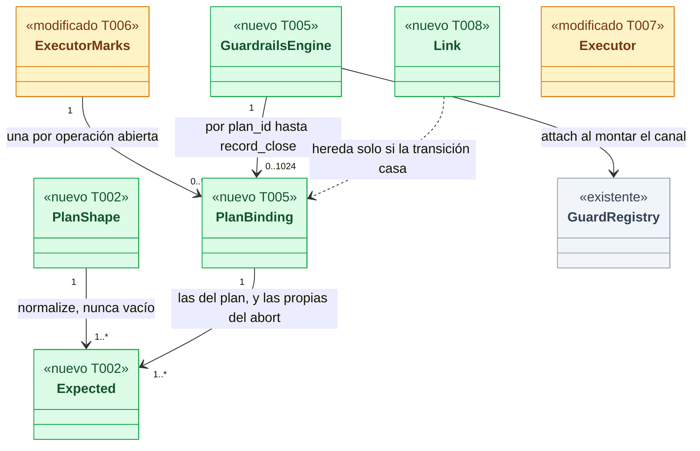
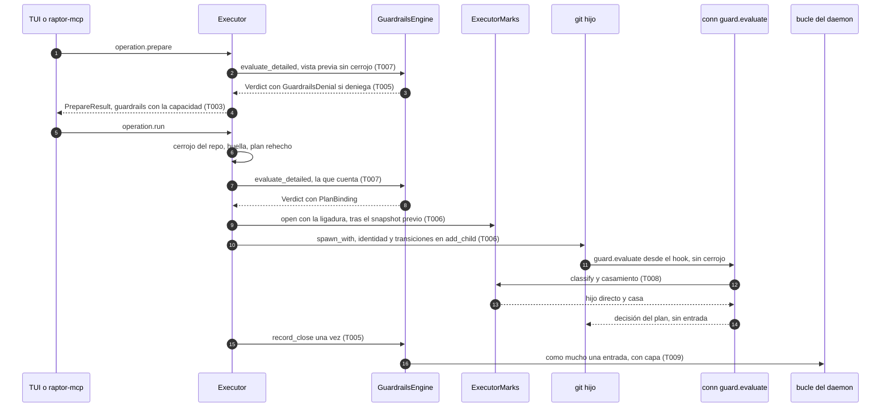
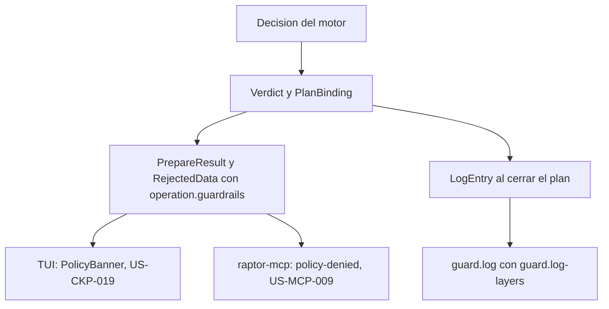
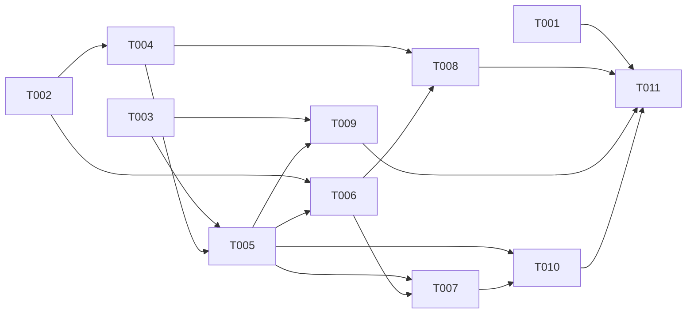

# DS-TS-CKP-003 · Capa cockpit en la decisión de Guardrails

## Contexto rápido

Al terminar, una operación gobernada del catálogo (merge, rebase, commit, crear y borrar worktree) pedida por la TUI o por un agente recibe una sola decisión de Guardrails antes de cualquier efecto, los hooks del `git` que lanza el daemon la heredan sin preguntar otra vez, y el registro guarda como mucho una entrada por plan con su capa. Hoy no puede: en producción la puerta es `NoGuardrails`, que rechaza todo lo gobernado, y un hook bajo el ejecutor se evalúa como uno cualquiera y solo se le suprime la entrada.

Para eso: (1) normalizar el plan a operaciones de Guardrails y a transiciones esperadas, en código puro; (2) un motor de producción detrás de `GuardrailsGate` que evalúa con la misma función que los hooks y escribe la entrada única al cerrar el plan; (3) registrar las transiciones de cada hijo `git` junto a su identidad y clasificar en `guard.evaluate` a quién pertenece el `git` del hook; (4) devolver la denegación tipada por una capacidad. Las decisiones de fondo son de ADR-CKP-002 § 4 y ADR-GRD-003 (Enmienda Cockpit); aquí no se reabren. Lo que el ADR no fijaba está en [Decisiones](#decisiones).

| Término | Qué es aquí |
|---|---|
| Plan | Lo que prepara `operation.prepare` (DS-TS-CKP-002 § 3): operación, argumentos, hechos, huella y `plan_id` |
| Forma del plan (`PlanShape`) | Los nombres y oids que la historia dueña calcula en `plan_op` y que Guardrails necesita: ref, valor viejo, oid integrado, `onto`, rutas preparadas |
| Transición registrada (`Expected`) | Lo que un hijo `git` del plan va a pedir a Guardrails. Unas son exactas (`ref`, viejo, nuevo); otras se conocen solo en parte (ref y base en el rebase; ref, viejo y oid integrado en el merge), como en ADR-GRD-007 § 3, paso 4 |
| Hijo registrado | Un `git` que el ejecutor lanzó con `StepCtx::spawn_with`, marcado por `(pid, inicio)` |
| Nieto | Un `git` lanzado por un hook del usuario bajo un hijo registrado (H-01) |
| Ligadura (`PlanBinding`) | La decisión que contó, la capa, el solicitante y las transiciones del plan, compartidas entre el motor, las marcas y el ejecutor mientras el plan vive |
| Capa | `hooks`, `mcp` o `cockpit`. La fija el daemon (M-03, `executor::layer_for`); nunca el cliente |

---

## 📋 Índice

> **Para aprobar:** [Contexto rápido](#contexto-rápido) · [⚠️ Gaps](#gaps-y-violaciones-de-la-constitución) · [Decisiones](#decisiones) · [🔭 La forma](#la-forma) · [El trabajo de un vistazo](#el-trabajo-de-un-vistazo).
> **Para implementar:** [🚀 Plan](#plan-de-implementación), en orden. Las secciones `_(ref)_` se abren desde la tarea que las cita.

| Sección | Propósito |
|---------|-----------|
| [Contexto rápido](#contexto-rápido) | Qué se construye, por qué, y el glosario |
| [⚠️ Gaps y violaciones de la constitución](#gaps-y-violaciones-de-la-constitución) | Qué impide empezar o liberar |
| [Decisiones](#decisiones) | D1 a D18, con la alternativa descartada |
| [Enmiendas que implica](#enmiendas-que-implica) | Cambios de texto en ADRs, para el orquestador |
| [🔭 La forma](#la-forma) | Qué piezas quedan, qué cambia y cómo fluye |
| [🚀 Plan de implementación](#plan-de-implementación) | T001…T011, en orden |
| [Estructura de ficheros](#estructura-de-ficheros) _(ref)_ | Archivos a crear o modificar |
| [Contratos compartidos](#contratos-compartidos) _(ref)_ | Tipos, ciclos de vida y firmas |
| [Contrato de API](#contrato-de-api) _(ref)_ | Capacidades, error, configuración y numéricos |
| [Modelo de datos](#modelo-de-datos) _(ref)_ | Columna `layer` y clave de agregación |
| [Estrategia de pruebas y cobertura](#estrategia-de-pruebas-y-cobertura) _(ref)_ | Un test por criterio de la ficha |
| [Gate de seguridad](#gate-de-seguridad) | Checklist pre-merge |
| [Fuera de alcance](#fuera-de-alcance) | Lo que esta entrega no toca, con dueño |
| [Notas del autor](#notas-del-autor) _(ref)_ | Hallazgos que no bloquean |

---

## ⚠️ Gaps y violaciones de la constitución

El repo no tiene `architecture-constitution.md` en la cascada. Las restricciones activas son las de [AGENTS.md](../../../../../AGENTS.md) y los ADRs: `unsafe_code = forbid` (ADR-GRP-001), protocolo congelado en 9 y códigos en `-32016` (ADR-GRP-016), sin E/S en `crates/policy` (ADR-GRD-003 § 1). Ninguna tarea las viola.

_No gaps. Ready to implement._

**Resueltos** (PO, 2026-10-09): G1 (qué ve un agente de la denegación por MCP) con el ajuste de D10; G2 (la capa en `raptor guard log` y la evaluación en repos sin hooks) con D11 y el ajuste de D12. G3 (enmiendas de ADR-GRD-003, ADR-GRD-006 y ADR-CKP-002), aplicadas como "Enmienda (2026-10-09, TS-CKP-003)" en el mismo PR que esta Dev Spec.

---

## Decisiones

Todas son **Decisión del orquestador (2026-10-09), validada por Arquitecto**; D10, D11 y D12, **validadas por Arquitecto y PO** (2026-10-09). D5, D6, D8, D14 y D18 se ajustaron tras una revisión adversarial de otro Arquitecto (2026-10-09).

- **D1. Dónde vive la normalización.** La historia dueña rellena `OpPlan.governed: Option<PlanShape>` en su `plan_op` (lee oids, rutas preparadas y el mensaje). `crates/policy/src/guard/plan.rs` convierte la forma en operaciones evaluables y transiciones esperadas, y casa una transición del hook con ellas; todo puro. Las lecturas de Git quedan en `crates/core`. Descartada: normalizar en el gate desde `GovernedAs`, que repetiría las lecturas de cada historia y metería E/S en la decisión.
- **D2. Correspondencia de `GovernedAs`** (tabla de [Contratos compartidos](#tipos-y-datos-compartidos)). Merge: transacción sobre la base con viejo e integrado; rebase: `Rebase` más el movimiento de la rama; crear worktree: creación de la rama nueva; borrar worktree: borrado de su rama; commit: `Commit` más el movimiento de la rama con las rutas preparadas. En el commit el movimiento se evalúa con el centinela `old → old`: el oid nuevo no existe al preparar, `policy.protected-branch` actúa por el nombre de la ref, las rutas llegan precargadas y el mínimo permite `old == new` (solo mira borrados y alias). Descartada: evaluar solo `Rebase` en el rebase, porque las ramas protegidas y las rutas prohibidas viven en el movimiento de ref y la herencia las saltaría.
- **D3. Una sola función de decisión.** `guardrails::evaluate` se parte en `decide(&DecideInput) -> Served`, que usan `guard.evaluate` y el motor del plan. El plan se evalúa siempre con todas las reglas (autoría, ramas protegidas, rutas prohibidas, configuración protegida): las capacidades `guard.authorship` y `guard.policies` son compatibilidad con hooks viejos y el ejecutor no tiene ese problema. La decisión del plan es el máximo de sus operaciones, con las razones de ese máximo (BR-CALC-001). Descartada: una segunda implementación en el gate.
- **D4. La capa en el contexto.** `policy::guard::Context` gana `layer: LogLayer`, y `LogLayer` pasa a `hooks | mcp | cockpit` (los valores de la columna de ADR-GRD-006). Ninguna regla la lee; un test de propiedades lo fija. Descartada: dejarla fuera del contexto, que contradice ADR-GRD-003 § 1.
- **D5. Clasificación del hook bajo el ejecutor** (`guardrails::link::classify`), después de la resolución del solicitante para respetar la barrera I-02:
  1. **Hijo directo**: el `git` más cercano al cliente del hook es un hijo registrado (`(pid, inicio)`) y su padre directo es el daemon (pid y hora de inicio). Si la transición casa con las suyas, recibe la decisión del plan; si no, D6.
  2. **Nieto**: algún antecesor está marcado (grupo o hijo) y el `git` más cercano no es un hijo registrado. Evaluación nueva, capa `hooks`, actor = solicitante del plan, con **su propia entrada** (H-01). Incluye un `exec git` desde un hook y cualquier `git` interno que lance un hijo (por ejemplo, el `git branch` de `worktree add -b`, si Git lo hace en un subproceso): la capa y el actor no cambian la decisión y el plan ya permitió esa transición, así que el resultado es `allow` sin entrada; el coste es una evaluación más, dentro de NFR-GRD-04.
  3. **Sin relación**: como hoy.

  Sin desviación del "padre directo" de ADR-GRD-003 § 4. Descartadas: seguir usando `executor_operation.is_some()`, que trata igual a hijos y nietos (brecha 4 del mapa); y heredar por cadena de procesos `git`: el daemon reconoce un `git` solo por el nombre del ejecutable (`requester::file_name`, `second_line::nearest_git`), así que un `exec git` de un hook heredaría (viola H-01 y H-02). Heredar por cadena de `git` con `(dev, inode)` del binario relaja H-02 y necesita revisión de seguridad; no compensa una evaluación extra.
- **D6. Transición distinta del hijo directo.** Se evalúa de nuevo con la capa y el actor del plan, con **todas las reglas** (`RuleSet::all()`, como D3; nunca las capacidades de la conexión del hook), y **no crea entrada propia**. El resultado se acumula en `PlanBinding.late` con `Evaluation::add` (máximo y razones del máximo; avisos incluidos). `record_close` toma el máximo entre la decisión del plan y `late`. Si la ejecución falla con `late` denegada, la respuesta lleva `guardrails` = esa decisión (con `operation.guardrails`) y su `decision_id` es el de la entrada única. Descartada: entrada propia, que rompería "como mucho una por plan" (ADR-CKP-002 § 4).
- **D7. Registro de transiciones.** `ExecutorMarks::add_child` recibe las transiciones del hijo y las guarda en la misma sección crítica que su identidad, antes de soltar el *spawn* pendiente: un hook que espera la barrera ya las encuentra. El abort del rebase atómico usa `StepCtx::spawn_with_transitions` con `RestoreTo` (DEP-MCP-5). El *spawn* suspendido **no** se asume aquí: sigue pendiente en ADR-CKP-002 para la primera historia que arme una operación gobernada que lance `git` ([Fuera de alcance](#fuera-de-alcance)). Descartada: un registro aparte después del lanzamiento, que abre una ventana entre identidad y transiciones.
- **D8. Entrada única al cerrar** (`record_close`). `denial` si la última decisión del plan no permitió (al ejecutar o en la vista previa y el plan caducó, se cerró o se rechazó), o si D6 dejó una denegación tardía. `notice` si corrió permitido con avisos (US-GRD-005). Ninguna si se permitió sin regla. `config.relax-ignored` no aplica al ejecutor (ADR-GRD-003, Enmienda US-GRD-010/012). El motor guarda el estado por `plan_id`, acotado a 1 024 planes, y lo borra al cerrar. Solo se expulsa (FIFO) un estado sin ligadura viva; una vista previa expulsada escribe su `denial` si denegó. Si los 1 024 tienen ligadura viva, `prepare` deniega con `system.internal-error`. Las entradas van por el mismo `LogSink` con tope y nunca esperan.
- **D9. Almacén sin migración.** El `CHECK` de `layer` ya admite `mcp` y `cockpit` (`profile/schema.rs`). Se escribe la capa de la entrada (hoy se fija `hooks`), se lee al consultar y entra en la clave de agregación de la fila y de la fila de exceso. Descartada: columna nueva.
- **D10. Denegación tipada** — validada por el PO con ajuste. Capacidad `operation.guardrails`: `GuardrailsDenial {decision_id, effect, applied_effect, reasons}` en `PrepareResult`, `McpPrepareResult` y `RejectedData` cuando hay denegación. Los parámetros son `Untrusted` y se sanean al pintar (SEC-12). Por MCP viaja lo mismo; nunca un campo de excepción, y `raptor-mcp` lo traduce a `policy-denied` en su historia. Sin la capacidad, la forma de hoy. No sube `PROTOCOL_VERSION` (congelado en 9, ADR-GRP-016). **Ajuste del PO**: la plantilla y el `action` de `policy-denied` nunca nombran `raptor guard exec` ni otra vía de excepción, ni sugieren editar la configuración (BR-AUTH-004, Q-GRD-7); los `params` solo describen la operación del propio agente (rama, ruta, tamaño), acotados, y nunca llevan mensajes de commit, contenido, ni `configStatus` o `configRef` con texto (ADR-GRD-006 § 6). `GuardrailsDenial` no tiene esos campos, y un test de la proyección MCP lo fija. Descartada: subir el protocolo, que está congelado.
- **D11. Capa en `guard.log`** — validada por el PO. Capacidad `guard.log-layers`: con ella las entradas llevan su capa real; sin ella el listado omite las que no son `hooks` y el resumen las cuenta igual (el KPI no cambia por capa, ADR-GRD-006 Enmienda Cockpit). `raptor guard log` pide la capacidad: la tabla compacta puede ocultar `hooks`, pero la salida detallada y la JSON muestran siempre la capa. El filtro por capa de la consulta es de US-GRD-005 ([Fuera de alcance](#fuera-de-alcance)). Descartada: proyectar `cockpit` como `hooks`, que mentiría.
- **D12. Repos sin la capa de hooks** — validada por el PO con ajuste. El ejecutor evalúa igual, como una instalación huérfana (`serve_audited` sin entrada del registro), y sin confirmación inicial protege la unión {`main`, rama principal, rama base leída} (Q-GRD-21, BR-CONS-003). Merge y borrar worktree no tienen otra protección. La denegación queda en el registro. Pendiente con dueño US-GRD-004 (BR-WF-002): el estado de protección debe reflejar la cobertura de las capas `cockpit` y `mcp` en esos repos; hoy diría "Sin protección" y aun así la TUI denegará. Descartada: permitir sin evaluar en esos repos.
- **D13. Cableado de producción.** `OperationsWiring::production()` pone `GuardrailsEngine`; el daemon le da el registro y el sumidero del log al montar el canal (`attach`). Antes de eso, el motor deniega con `system.internal-error`. `armed_without_guardrails` solo filtra si la puerta no decide (`NoGuardrails`). Esta TS no arma brazos reales: con ella, cada historia dueña arma el suyo con una línea en `ops/mod.rs`. Desbloquea US-CKP-012 a 024 y US-MCP-009 a 019. Descartada: dejar el cableado a cada historia, que repartiría el mismo cambio en ocho PRs.
- **D14. Brazos de prueba solo en depuración.** `executor/ops/test_arms.rs` (`#[cfg(debug_assertions)]`) arma `commit`, `merge-into-base` (avance rápido), `create-worktree` (con rama nueva), `discard-worktree` (borra el worktree y su rama) y `rebase-onto-base` atómico con su abort, solo si el daemon arranca con `GITRAPTOR_TEST_EXECUTOR_ARMS=1` **y** `GITRAPTOR_PROFILE_DIR` (`CARGO_PROFILE_RELEASE_DEBUG_ASSERTIONS=true` activa `debug_assertions` también en release). Corren dentro de la operación protegida, con snapshot previo. Sirven para las pruebas de proceso con `raptor-hook` real. No son la lógica de producto de esas operaciones: el `discard-worktree` de prueba no lleva la confirmación que nombra lo no recuperable (R-CKP-6). Descartada: esperar a la primera historia, que dejaría sin probar la regresión de INF-GRD-001 y la ligadura con el hook real.
- **D15. `previo_hook`.** No existe en main: hay el nivel `hook-prior` en el almacén y la línea de tiempo, pero ningún camino de `guard.evaluate` pide ese snapshot (US-GRD-017 no implementada). Queda como invariante con test: un hijo del ejecutor nunca produce un snapshot `hook-prior`. Descartada: implementarlo aquí.
- **D16. Cerrado ante fallos con razón.** Una operación gobernada sin `PlanShape`, un repo ilegible o un motor sin `attach` dan `deny` con `system.internal-error`, y dejan su `denial`. Descartada: `NotEvaluated`, que no lleva razón para el banner. `NotEvaluated` sigue siendo de `NoGuardrails`.
- **D17. Hechos del commit.** El mensaje se convierte en `AuthorshipFacts` con `guardrails::plan_gate::commit_facts` (las mismas `MessageOptions` que `hook.rs`). El texto nunca entra en la forma, la huella ni el registro. Las rutas son las preparadas. Si un hook del usuario cambia el índice o el mensaje, la transición deja de casar y aplica D6.
- **D18. Rutas del rebase.** Se leen los commits de la punta que no están en `onto`, ocultando solo `onto` (`Hide::OldOnly`, sin segunda pasada). Es más estricto que el hook: sin segunda pasada, un commit ya aplicado aguas arriba (mismo patch-id, que el rebase descartaría) puede denegar. Descartada: ocultar las otras ramas locales, que dejaría pasar una ruta prohibida en un commit que también está en otra rama.

---

## Enmiendas que implica

Aplicadas en el mismo PR que esta Dev Spec, como "Enmienda (2026-10-09, TS-CKP-003)" al final de cada ADR:

| ADR | Sección | Texto propuesto (breve) | Origen |
|---|---|---|---|
| ADR-GRD-003 | § 6 y Enmienda Cockpit | Una transición distinta pedida por el hijo directo se evalúa con la capa y el actor del plan y todas las reglas, y no crea entrada; se acumula con la decisión del plan y la entrada única lleva el máximo | D6 |
| ADR-GRD-003 | § 4 (nota) | El ejecutor evalúa también en repos sin capa de hooks, con la unión {`main`, rama principal, rama base leída} mientras no hay confirmación | D12 |
| ADR-GRD-006 | Enmienda (2026-10-07, US-GRD-005), fila "`layer` hoy siempre es `hooks`" | Sustituir: `layer` lleva `mcp` o `cockpit` en las entradas del ejecutor; la clave de agregación incluye la capa; sin `guard.log-layers` esas entradas no se listan y sí se cuentan | D9, D11 |
| ADR-CKP-002 | § 4, "Registro único" | Añadir el desenlace `notice` (permitido con aviso) y la denegación tardía de D6 | D6, D8 |
| ADR-CKP-002 | Sección nueva "Implementación (TS-CKP-003)" | Capacidad `operation.guardrails`, motor con `attach`, brazos de prueba de depuración y `production()` con el motor | D10, D13, D14 |

Desviación del código respecto a los ADRs, corregida aquí: `LogContext.under_executor` se activa para cualquier proceso marcado, también un nieto por su grupo, y suprime su entrada; H-01 pide la entrada propia (ADR-GRD-003, pasada de endurecimiento). No necesita enmienda.

---

## 🔭 La forma

Queda un motor de decisión de producción detrás de `GuardrailsGate`, una ligadura por plan que comparten el motor, las marcas y el ejecutor, y una clasificación del cliente del hook que decide si hereda, se evalúa con el plan o se evalúa como nieto.



🟩 nuevo · 🟨 modificado · ⬜ existente (contexto: no cambia). Cada pieza dice qué tarea la toca.

La ligadura tiene tres dueños a la vez (motor, marcas y ejecutor) y muere cuando el último la suelta: al cerrar el plan y al cerrar sus marcas.

**Cómo fluye:**



El paso 13 es el que decide: solo hereda el hijo directo cuya transición casa; si no casa, se evalúa con el plan (D6), y todo `git` que no sea un hijo registrado es nieto, con capa `hooks` y su propia entrada (D5). El contrato publicado cambia en los pasos 4 y 15, siempre detrás de una capacidad.

**Dónde acaba el dato:**



Sale igual por las dos rutas: el mismo `decision_id` y las mismas razones, también cuando la denegación es tardía (D6: la respuesta lleva la decisión acumulada, la misma de la entrada). La entrada guarda las razones sin parámetros (ADR-GRD-006, Enmienda US-GRD-005); la respuesta los lleva como no confiables. Lo comprueba `plan_gate::tests::the_response_and_the_entry_share_the_decision_id` (T005).

---

## 🚀 Plan de implementación

> Se ejecuta en orden topológico (`Depende:`). Una casilla se marca cuando su `Aceptación` está verificada. Rutas relativas a la raíz del repo.

### El trabajo de un vistazo

Tres frentes y un cierre: el contrato y lo puro (T002, T003), el lado del plan (T004 a T007, T010) y el lado del hook y del registro (T008, T009), con los tests en rojo al principio (T001) y la verificación al final (T011).

| # | Tarea | Depende | Aterriza en |
|---|---|---|---|
| T001 | Escribir las pruebas de proceso en rojo | — | `apps/cli/tests` |
| T002 | Crear la normalización y el casamiento puros | — | `crates/policy/src/guard` |
| T003 | Ampliar el contrato con la capa y la denegación tipada | — | `crates/api/src` |
| T004 | Extraer la decisión compartida de `guardrails::evaluate` | T002 | `crates/core/src/guardrails` |
| T005 | Crear el motor del plan detrás de `GuardrailsGate` | T003, T004 | `crates/core/src/guardrails`, `crates/core/src/executor` |
| T006 | Registrar las transiciones de cada hijo con su identidad | T002, T005 | `crates/core/src/channel`, `crates/core/src/timemachine/protected` |
| T007 | Llevar el veredicto y la ligadura por el ejecutor | T005, T006 | `crates/core/src/executor`, `crates/core/src/channel` |
| T008 | Clasificar el hook bajo el ejecutor en `guard.evaluate` | T004, T006 | `crates/core/src/guardrails`, `crates/core/src/channel` |
| T009 | Escribir y consultar la capa en el registro | T003, T005 | `crates/core/src/profile`, `crates/core/src/channel`, `apps/cli` |
| T010 | Cablear el motor en producción y los brazos de prueba | T005, T007 | `crates/core/src/executor/ops`, `crates/core/src/daemon` |
| T011 | Verificar, medir y documentar | T001, T008, T009, T010 | `docs`, `apps/cli/tests` |

### En qué orden

Dos frentes que arrancan en paralelo (T002 y T003) y se juntan en el motor (T005); después se abren en el lado del plan y el del hook.



### T001 — Escribir las pruebas de proceso en rojo

**Objetivo.** Dos suites de proceso con `raptor` y `raptor-hook` reales, temporales y en rojo, que solo hablan JSON-RPC y CLI, así que compilan sin las APIs nuevas.

**Ubicación.**
- `apps/cli/tests/guard_ts_ckp_003.rs` (**CREATE**)
- `apps/cli/tests/guard_ts_ckp_003_chaining.rs` (**CREATE**)

**Reglas**
- Repos, remotos desnudos y perfiles temporales (`GITRAPTOR_PROFILE_DIR`), nunca este repo (NFR-01); Guardrails instalado con `raptor guard install` en cada repo temporal.
- El daemon arranca con `GITRAPTOR_TEST_EXECUTOR_ARMS=1`; el agente es `raptor-fake-agent` (patrón de `protected_process.rs`).
- Sin `sleep` fijos: se espera por respuesta del canal o por condición con `recv_timeout` acotado.
- `#![cfg(target_os = "macos")]`, como `protected_process.rs`; Linux y Windows en § 9.5.
- Un test por criterio de la ficha, con los nombres de § 9.4.

> **Nota técnica.** Los tests no pueden fallar por compilación: no importan tipos de T002 a T010. Fallan porque hoy `operation.prepare` de una operación gobernada da `-32004` y `NoGuardrails` rechaza al ejecutar.

- **Depende:** —
- **Refs:** TS-CKP-003 Plan de Verificación; ADR-CKP-002 Validación 5 a 7, 17, 18, 21 y 28
- **Aceptación:** `cargo test -p gitraptor-cli --test guard_ts_ckp_003 --test guard_ts_ckp_003_chaining` compila y falla en todos sus tests

### T002 — Crear la normalización y el casamiento puros

**Objetivo.** `PlanShape`, `Expected`, `normalize` y `matches` en `crates/policy`, y la capa en el contexto; sin E/S, sin reloj.

**Ubicación.**
- `crates/policy/src/guard/plan.rs` (**CREATE**)
- `crates/policy/src/guard/mod.rs` (**MODIFY**)

**Reglas**
- `normalize` sigue la tabla de [Tipos y datos compartidos](#tipos-y-datos-compartidos); nunca devuelve `registered` vacío.
- `matches` es igualdad estricta: un viejo `Zero` no casa con un viejo esperado, y cualquier duda es "no casa" (se evalúa de nuevo).
- `Context` gana `layer`; ninguna regla la lee.
- Las rutas preparadas de un commit pasan de 100 000 → `Touched { unverifiable: true }`.

> **Nota técnica.** Lo que necesita leer el repo para casar (padres de un commit de merge, ascendencia de `onto`, rutas del commit nuevo) llega ya calculado en `MatchFacts`; por eso `matches` sigue siendo puro.

- **Depende:** —
- **Refs:** D1, D2, D4, D18; ADR-GRD-003 § 1; ADR-GRD-007 § 3.4
- **Aceptación:** `cargo test -p gitraptor-policy guard::plan`
- **Guard:** `guard::plan::tests::the_layer_never_changes_the_decision` (propiedades: misma entrada con las tres capas, misma `Evaluation`)

### T003 — Ampliar el contrato con la capa y la denegación tipada

**Objetivo.** `LogLayer::{Mcp, Cockpit}`, `GuardrailsDenial`, sus campos opcionales y las dos capacidades.

**Ubicación.**
- `crates/api/src/guard.rs` (**MODIFY**)
- `crates/api/src/catalog.rs` (**MODIFY**)
- `crates/api/src/methods/operation.rs` (**MODIFY**)
- `crates/api/src/methods/guard.rs` (**MODIFY**)

**Reglas**
- Capacidades en el archivo de su módulo (ADR-GRP-016): `CAP_OPERATION_GUARDRAILS` en `operation.rs`, `CAP_GUARD_LOG_LAYERS` en `guard.rs`. Ni `lib.rs` ni `rpc.rs` cambian.
- Campos nuevos con `#[serde(default, skip_serializing_if = "Option::is_none")]`; las estructuras conservan `deny_unknown_fields`.
- `PrepareResult::for_mcp` copia `guardrails`; `McpPrepareResult` no gana nada de excepción.
- Sin código de error nuevo: la denegación sigue siendo `-32014` con `reason: guardrails-denied`.

- **Depende:** —
- **Refs:** D4, D10, D11; ADR-GRP-016; ADR-GRD-003 § 3
- **Aceptación:** `cargo test -p gitraptor-api` (incluye `tests/architecture.rs`)

### T004 — Extraer la decisión compartida de `guardrails::evaluate`

**Objetivo.** `decide(&DecideInput) -> Served`, usado por `serve_audited` y por el motor, con hechos precargados y la capa.

**Ubicación.** `crates/core/src/guardrails/evaluate.rs` (**MODIFY**)

**Pasos**
1. Mover el cuerpo de `serve_audited` a `decide`, que recibe `common_dir`, `repo_id`, actor, worktree, capa, banderas de reglas y `Preset`.
   1.1 ⛔4.1 No cambiar lo que ve un hook: `serve_audited` llama a `decide` con `rules = RuleSet::from_caller(caller)` (tipo nuevo, [Tipos y datos compartidos](#tipos-y-datos-compartidos)) y `layer = Hooks`, y su salida es idéntica byte a byte. El plan y D6 usan `RuleSet::all()`.
2. Aplicar `Preset.touched` y `Preset.config_touched` en lugar de leerlos cuando vienen (commit, rebase).
3. `decide_all(&[Operation], …)` combina con `Evaluation::add` (máximo y razones del máximo) y une los avisos solo si el resultado permite.

- **Depende:** T002
- **Refs:** D3, D17, D18; DS-US-GRD-008 § 3
- **Aceptación:** `cargo test -p gitraptor-core guardrails::evaluate` y `cargo test -p gitraptor-core --test guard_evaluate`
- **Guard ⛔4.1:** `cargo test -p gitraptor-cli --test guard_us_grd_008 --test guard_us_grd_018` sin cambios

### T005 — Crear el motor del plan detrás de `GuardrailsGate`

**Objetivo.** `GuardrailsEngine` evalúa planes, crea la ligadura, guarda el estado por `plan_id` y escribe la entrada única al cerrar.

**Ubicación.**
- `crates/core/src/guardrails/plan_gate.rs` (**CREATE**)
- `crates/core/src/guardrails/mod.rs` (**MODIFY**)
- `crates/core/src/executor/gate.rs` (**MODIFY**)

**Reglas**
- `GateRequest` gana `plan_id`, `common_dir`, `worktree`, `branch` y `shape`; el trait gana `evaluate_detailed`, `decides` y `attach`, con implementación por defecto, para no tocar los ocho dobles de test.
- La forma del plan se normaliza con `policy::guard::plan::normalize` y se evalúa con `decide_all`; la ligadura solo se crea si `applied_effect == Allow`.
- `record_close` aplica D8 una sola vez por `plan_id`, con el máximo entre la decisión del plan y `late` (D6), y suelta su estado.
- El mapa nunca pasa de 1 024: solo se expulsa (FIFO) un estado sin ligadura viva, que cierra como `Dropped` y escribe su `denial` si denegó; si todos tienen ligadura viva, la vista previa deniega con `system.internal-error`.
- Sin `attach`, sin forma, sin repo legible: `deny` con `system.internal-error` (D16).
- El motor no toma el cerrojo del repo ni espera al bucle: escribe por `LogSink::try_reserve` y `guard_record`, y cuenta el exceso.

> **Nota técnica.** `PlanClose` es `Copy` y lo comparan los dobles de `channel_protected.rs`; por eso la última decisión vive en el estado del motor y no en `PlanClose`.

- **Depende:** T003, T004
- **Refs:** D3, D8, D12, D13, D16; ADR-CKP-002 § 4; ADR-GRD-006, Enmienda Cockpit
- **Aceptación:** `cargo test -p gitraptor-core guardrails::plan_gate`
- **Guard:** `guardrails::plan_gate::tests::ask_is_applied_as_deny` (S-GRD-9), `::an_unattached_engine_denies_with_a_reason`, `::a_running_plan_is_never_evicted`, `::the_response_and_the_entry_share_the_decision_id` y `::a_commit_evaluates_its_branch_with_the_old_to_old_sentinel`

### T006 — Registrar las transiciones de cada hijo con su identidad

**Objetivo.** Las marcas guardan la ligadura de la operación y las transiciones de cada hijo; el paso puede lanzar un hijo con transiciones propias.

**Ubicación.**
- `crates/core/src/channel/marks.rs` (**MODIFY**)
- `crates/core/src/timemachine/protected/mod.rs` (**MODIFY**)

**Pasos**
1. `ExecutorMarks::open` recibe `Option<Arc<PlanBinding>>`; `add_child` recibe las transiciones y las guarda junto a `(pid, inicio)` en el mismo `lock()`.
   1.1 ⛔6.1 Las transiciones se registran antes de soltar `PendingSpawn`; registrarlas después abre una ventana en la que un hook ve al hijo sin transiciones y no hereda.
2. `ProtectedRequest` gana `binding`; `ProtectedOperation::run` lo pasa a `open` (sigue después del snapshot previo).
3. `StepCtx::spawn_with` registra las transiciones de la ligadura; `spawn_with_transitions(launch, &[Expected])` registra las suyas (abort atómico, D7).
4. `child_link(pid, start) -> Option<ChildLink>` devuelve operación, solicitante, ligadura y transiciones de un hijo; `lookup` no cambia.

- **Depende:** T002, T005
- **Refs:** D7; ADR-CKP-002 § 4 (barrera I-02); ADR-GRD-003, Enmienda Cockpit
- **Aceptación:** `cargo test -p gitraptor-core channel::marks timemachine::protected`
- **Guard ⛔6.1:** `marks::tests::transitions_are_visible_once_the_barrier_drops`

### T007 — Llevar el veredicto y la ligadura por el ejecutor

**Objetivo.** El ejecutor guarda la forma del plan, usa `evaluate_detailed` en las dos fases, pasa la ligadura a la operación protegida y devuelve la denegación tipada.

**Ubicación.**
- `crates/core/src/executor/mod.rs` (**MODIFY**)
- `crates/core/src/channel/conn.rs` (**MODIFY**)

**Reglas**
- `OpPlan` gana `governed: Option<PlanShape>` (entra en la huella); `StoredPlan` guarda la forma.
- Al ejecutar, la forma es la del plan rehecho bajo el cerrojo; si la huella coincide, es la misma.
- `ExecError::GuardrailsDenied(Option<Box<GuardrailsDenial>>)`; `Prepared` gana `denial`.
- En `conn.rs`, `guardrails` solo va en la respuesta si la conexión tiene `operation.guardrails`; si no, la forma de hoy.
- Orden de `run` sin cambios: la decisión que cuenta, bajo el cerrojo, antes de la intención y del snapshot previo (BR-CKP-WF-002).

- **Depende:** T005, T006
- **Refs:** D10, D16; DS-TS-CKP-002 § 4; ADR-CKP-002 § 2, paso 4
- **Aceptación:** `cargo test -p gitraptor-core executor:: --test channel_protected`

### T008 — Clasificar el hook bajo el ejecutor en `guard.evaluate`

**Objetivo.** `guard.evaluate` hereda, evalúa con el plan o evalúa como nieto según D5 y D6, y el registro deja de suprimir la entrada del nieto.

**Ubicación.**
- `crates/core/src/guardrails/link.rs` (**CREATE**)
- `crates/core/src/guardrails/log.rs` (**MODIFY**)
- `crates/core/src/guardrails/actor.rs` (**MODIFY**)
- `crates/core/src/guardrails/config_guard.rs` (**MODIFY**)
- `crates/core/src/channel/conn.rs` (**MODIFY**)

**Pasos**
1. `classify(peer, checks, marks)` llama primero a `requester::resolve` (respeta la barrera I-02) y después recorre desde el cliente del hook con `second_line::nearest_git` y `requester::parent`.
   1.1 ⛔8.1 El padre del hijo tiene que ser `checks.daemon` con su hora de inicio; un pid reutilizado no cuenta.
2. `match_facts` lee con `evaluate::open` lo que el casamiento necesita (padres, ascendencia de `onto`, rutas de un commit nuevo), con los topes de US-GRD-008.
3. En el brazo `GUARD_EVALUATE`: hijo que casa → la decisión de la ligadura, sin entrada; hijo que no casa → `decide` con capa y actor del plan y `RuleSet::all()`, sin entrada, acumulado en `late` con `Evaluation::add`; nieto → `decide` con capa `hooks` y su entrada.
4. `LogContext.under_executor` pasa a `inherited`, verdadero solo para el hijo; `actor::resolve_logged` devuelve el `Link`; `config_guard::relax_entry` (que hoy lee `under_executor`) lee `inherited`, así que un nieto sí emite `config.relax-ignored`.
5. El brazo sigue en el hilo de la conexión, sin cerrojo del repo ni espera al bucle.

- **Depende:** T004, T006
- **Refs:** D5, D6, D15; H-01; ADR-GRD-003 § 4 y § 6
- **Aceptación:** `cargo test -p gitraptor-core guardrails::link guardrails::log`
- **Guard ⛔8.1:** `link::tests::a_reused_pid_of_the_daemon_is_not_a_parent`
- **Guard (H-01):** `link::tests::an_exec_git_from_a_hook_is_a_grandchild` y `link::tests::a_git_under_a_registered_child_that_is_not_it_is_a_grandchild`

### T009 — Escribir y consultar la capa en el registro

**Objetivo.** La capa llega a la fila, a la clave de agregación, a la consulta y a la CLI.

**Ubicación.**
- `crates/core/src/profile/guard_log.rs` (**MODIFY**)
- `crates/core/src/guardrails/log.rs` (**MODIFY**)
- `crates/core/src/channel/conn.rs` (**MODIFY**)
- `apps/cli/src/guard.rs` (**MODIFY**)
- `apps/cli/i18n/en/guard.txt` (**MODIFY**)
- `apps/cli/i18n/es/guard.txt` (**MODIFY**)

**Reglas**
- `LogEntry` y `OverflowRow` ganan `layer`; `agg_key` la incluye; `entry_row` la lee de la columna.
- `guard.log` sin `guard.log-layers` omite las entradas que no son `hooks` del listado; el resumen no cambia.
- La CLI muestra la capa solo cuando no es `hooks`, con clave del grupo `guard.` en los dos idiomas.

- **Depende:** T003, T005
- **Refs:** D9, D11; ADR-GRD-006 § 1, § 2 y § 6
- **Aceptación:** `cargo test -p gitraptor-core profile::guard_log --test guard_log` y `cargo test -p gitraptor-cli guard::`

### T010 — Cablear el motor en producción y los brazos de prueba

**Objetivo.** El daemon real decide con el motor y, en depuración y con la variable, arma los brazos de prueba.

**Ubicación.**
- `crates/core/src/executor/ops/mod.rs` (**MODIFY**)
- `crates/core/src/executor/ops/test_arms.rs` (**CREATE**)
- `crates/core/src/daemon/serve.rs` (**MODIFY**)

**Reglas**
- `production()` pone `Arc::new(GuardrailsEngine::default())`; `ARMS` sigue siendo `[Snapshot]`.
- `armed_without_guardrails` solo se aplica si `gate.decides()` es falso.
- `serve.rs` llama a `ops.gate.attach(&self.guard, record)` antes de servir el canal; `record` es `ShutdownHandle::guard_record`.
- `test_arms.rs` entero bajo `#[cfg(debug_assertions)]`; se arma solo con `GITRAPTOR_TEST_EXECUTOR_ARMS=1` y `GITRAPTOR_PROFILE_DIR` a la vez, leídos una vez en `production()` (D14).
- Los brazos de prueba corren como operación protegida (snapshot previo), lanzan `git` solo con `executor::git::run_git` y rellenan `PlanShape`.

- **Depende:** T005, T007
- **Refs:** D13, D14; ADR-CKP-002, Enmienda US-MCP-008; guía de extensión, "Añadir una operación del catálogo"
- **Aceptación:** `cargo test -p gitraptor-core executor::ops`
- **Guard:** `ops::tests::production_wires_the_engine_and_no_real_governed_arm` y `ops::tests::test_arms_are_inert_without_the_variable` (sin una de las dos variables, ningún brazo de prueba queda armado)

### T011 — Verificar, medir y documentar

**Objetivo.** Las suites de T001 en verde, el presupuesto medido y la ficha y los pendientes al día.

**Ubicación.**
- `docs/requirements/features/cockpit/technical-stories/TS-CKP-003-capa-cockpit-guardrails.md` (**MODIFY**)
- `docs/architecture/xplat-pendientes.md` (**MODIFY**)

**Reglas**
- `cargo clippy --workspace --all-targets` y `cargo test --workspace` en verde.
- La latencia de las evaluaciones heredadas se anota contra NFR-GRD-04 (< 100 ms p95); el gate de p95 sigue siendo el runner en reposo de INF-GRD-001.
- La ficha pasa a `implemented` con el PR; los pendientes de § 9.5 van a `xplat-pendientes.md` con el id que asigne el orquestador.

- **Depende:** T001, T008, T009, T010
- **Refs:** NFR-GRD-04; AGENTS.md, "Reglas de calidad"
- **Aceptación:** `cargo test -p gitraptor-cli --test guard_ts_ckp_003 --test guard_ts_ckp_003_chaining`

---

> Las secciones siguientes son de referencia. Se abren desde la tarea que las cita, no se leen en orden.

## Estructura de ficheros

```text
crates/
├── policy/src/guard/
│   ├── plan.rs                    ← CREATE  (T002; D1, D2)
│   └── mod.rs                     ← MODIFY  (T002; Context.layer)
├── api/src/
│   ├── guard.rs                   ← MODIFY  (T003; LogLayer)
│   ├── catalog.rs                 ← MODIFY  (T003; GuardrailsDenial)
│   └── methods/{operation,guard}.rs ← MODIFY (T003; capacidades)
└── core/src/
    ├── guardrails/
    │   ├── evaluate.rs            ← MODIFY  (T004)
    │   ├── plan_gate.rs           ← CREATE  (T005)
    │   ├── link.rs                ← CREATE  (T008)
    │   ├── log.rs                 ← MODIFY  (T008, T009)
    │   ├── actor.rs               ← MODIFY  (T008)
    │   ├── config_guard.rs        ← MODIFY  (T008; lee `inherited`)
    │   └── mod.rs                 ← MODIFY  (T005)
    ├── executor/
    │   ├── gate.rs                ← MODIFY  (T005)
    │   ├── mod.rs                 ← MODIFY  (T007)
    │   └── ops/{mod,test_arms}.rs ← MODIFY / CREATE (T010)
    ├── channel/{marks,conn}.rs    ← MODIFY  (T006, T007, T008, T009)
    ├── timemachine/protected/mod.rs ← MODIFY (T006)
    ├── profile/guard_log.rs       ← MODIFY  (T009)
    └── daemon/serve.rs            ← MODIFY  (T010)
apps/cli/
├── src/guard.rs                   ← MODIFY  (T009)
├── i18n/{en,es}/guard.txt         ← MODIFY  (T009)
└── tests/guard_ts_ckp_003{,_chaining}.rs ← CREATE (T001)
```

`← CREATE`: fichero nuevo. `← MODIFY`: fichero existente. Ningún archivo de la tabla de la guía de extensión cambia salvo `conn.rs`, cuyo `match` sigue siendo compartido: los brazos nuevos van junto a los de `guard.` y `operation.`.

---

## Contratos compartidos

### Tipos y datos compartidos

```rust
// crates/policy/src/guard/plan.rs — puro (T002)
pub enum PlanShape {
    Merge { base: String, old: String, integrated: String },          // refs/heads/<base>
    Rebase { branch: String, upstream: String, old_tip: String, onto: String },
    CreateWorktree { branch: String, at: String },                     // rama nueva
    DeleteWorktree { branch: String, tip: String },
    Commit { branch: String, old: String, paths: Vec<String>, authorship: AuthorshipFacts },
}
pub enum Expected {
    Exact { refname: String, old: RefValue, new: RefValue },
    MergeInto { refname: String, old: String, integrated: String },    // nuevo = integrado, o fusión [old, integrado]
    RebaseStart { upstream: String, branch: String },                  // pre-rebase
    RebaseOf { refname: String, old: String, onto: String },           // nuevo desciende de onto
    CommitStages { authorship: AuthorshipFacts },                      // pre-commit, commit-msg, second-line
    NewCommitOn { refname: String, old: String, paths: Vec<String> },  // padre = old, rutas ⊆ preparadas
    RestoreTo { refname: String, value: String },                      // abort del rebase atómico
}
pub struct Normalized { pub evaluated: Vec<Operation>, pub preset: Vec<Preset>, pub registered: Vec<Expected> }
pub struct Preset { pub touched: Option<Touched>, pub config_touched: Option<Touched> } // alineado con evaluated
pub struct MatchFacts { pub parents: Vec<String>, pub descends_from_onto: bool, pub new_paths: Option<Vec<String>> }

// crates/api/src/catalog.rs (T003)
pub struct GuardrailsDenial {            // deny_unknown_fields, camelCase
    pub decision_id: String,
    pub effect: guard::Effect,
    pub applied_effect: guard::Effect,   // nunca allow
    pub reasons: Vec<guard::Reason>,     // params: Untrusted (SEC-12)
}
// RejectedData.guardrails, PrepareResult.guardrails, McpPrepareResult.guardrails: Option<GuardrailsDenial>
// crates/api/src/guard.rs: LogLayer { Hooks, Mcp, Cockpit }

// crates/core/src/executor/gate.rs (T005)
pub struct Verdict { pub view: GateDecision, pub decision: Option<Decision>, pub binding: Option<Arc<PlanBinding>> }
pub struct PlanBinding {
    pub plan_id: String,
    pub decision: Decision,              // la que contó, permitida
    pub layer: Layer,
    pub who: Who,
    pub registered: Arc<[Expected]>,
    pub late: Mutex<Option<Decision>>,   // D6: la primera denegación de un hijo directo
}
// crates/core/src/executor/mod.rs (T007): Executor (existente) guarda la forma en StoredPlan,
// llama a evaluate_detailed y pasa Verdict.binding a ProtectedRequest.binding
// crates/core/src/guardrails/evaluate.rs (T004) — tipo nuevo
pub struct RuleSet { pub authorship: bool, pub policies: bool, pub second_line_skip: bool }
impl RuleSet {
    pub fn from_caller(caller: &Caller) -> Self;  // hook: lo que la conexión pidió (guard.authorship, guard.policies)
    pub fn all() -> Self;                         // plan y D6: authorship y policies siempre, second_line_skip = false
}
// crates/core/src/guardrails/link.rs (T008)
pub enum Link { None, Child(ChildLink), Grandchild { who: Who } }  // Child = hijo directo, padre = daemon
```

**Correspondencia (D2).** `branch`, `base` y `refname` son nombres completos `refs/heads/…`.

| `GovernedAs` | Operaciones evaluadas | Hechos precargados | Transiciones registradas |
|---|---|---|---|
| `Merge` | `RefTransaction [base: old → integrated]` | — (se leen como en un hook) | `MergeInto` |
| `Rebase` | `Rebase {upstream, branch}` + `RefTransaction [branch: onto → old_tip]` | rutas y configuración con `Hide::OldOnly` (D18) | `RebaseStart`, `RebaseOf`; el abort añade `RestoreTo` |
| `CreateWorktree` | `RefTransaction [branch: Zero → at]` | — | `Exact [branch: Zero → at]` |
| `DeleteWorktree` | `RefTransaction [branch: tip → Zero]` | — | `Exact [branch: tip → Zero]` |
| `Commit` | `Commit {commit-msg}` con `AuthorshipFacts` + `RefTransaction [branch: old → old]` (centinela) | rutas = preparadas; configuración = las preparadas bajo `/.gitraptor` | `CommitStages`, `NewCommitOn` |

La entrada del registro usa la primera operación evaluada de cada fila. El centinela `old → old` del commit existe porque el oid nuevo no se conoce al preparar: `policy.protected-branch` actúa por el nombre de la ref, las rutas van precargadas y el mínimo (`ref_update`) solo mira borrados y alias, así que permite `old == new`. Test: `plan_gate::tests::a_commit_evaluates_its_branch_with_the_old_to_old_sentinel` (una rama protegida deniega, una libre permite).

### Ciclos de vida (DI)

| Servicio / componente | Ámbito / ciclo de vida | Razón |
|---|---|---|
| `GuardrailsEngine` | Uno por daemon (`Arc` en `OperationsWiring`), con `attach` una vez al montar el canal | Comparte el `GuardRegistry` y el `LogSink` del canal |
| `PlanBinding` | Uno por plan permitido al ejecutar; `Arc` compartido entre motor, marcas y ejecutor | Muere al cerrarse el plan y sus marcas |
| Estado por `plan_id` del motor | Desde la vista previa hasta `record_close`; como mucho 1 024 | Cada plan gobernado se cierra una vez (DS-TS-CKP-002 D8) |
| `ExecutorMarks` | Uno por daemon (existente) | Lo leen el canal y la operación protegida |

### Firmas del stack

```rust
// crates/policy/src/guard/plan.rs
pub fn normalize(shape: &PlanShape) -> Normalized;
pub fn matches(registered: &[Expected], op: &Operation, authorship: Option<&AuthorshipFacts>, facts: &MatchFacts) -> bool;

// crates/core/src/guardrails/evaluate.rs
pub fn decide(registry: &GuardRegistry, input: &DecideInput<'_>) -> Served;
pub fn decide_all(registry: &GuardRegistry, input: &DecideInput<'_>, ops: &[Operation], preset: &[Preset]) -> Served;

// crates/core/src/executor/gate.rs
pub trait GuardrailsGate: Send + Sync {
    fn evaluate(&self, req: &GateRequest) -> GateDecision;                 // existente
    fn record_close(&self, req: &GateRequest, close: PlanClose);           // existente
    fn evaluate_detailed(&self, req: &GateRequest) -> Verdict { /* view = evaluate(req) */ }
    fn decides(&self) -> bool { true }                                     // NoGuardrails: false
    fn attach(&self, _registry: &Arc<GuardRegistry>, _record: Arc<dyn Fn(LogEntry) -> bool + Send + Sync>) {}
}

// crates/core/src/guardrails/plan_gate.rs
pub fn commit_facts(common: &Path, message: &str) -> AuthorshipFacts;

// crates/core/src/channel/marks.rs
pub fn open(self: &Arc<Self>, operation_id: &str, who: &Who, opened_us: u64, binding: Option<Arc<PlanBinding>>) -> MarkGuard;
pub fn add_child(&self, operation_id: &str, pid: u32, start_us: u64, pgid: u32, transitions: Arc<[Expected]>);
pub fn child_link(&self, pid: u32, start_us: u64) -> Option<ChildLink>;

// crates/core/src/timemachine/protected/mod.rs
pub fn spawn_with_transitions(&mut self, launch: impl FnOnce() -> io::Result<Child>, transitions: &[Expected]) -> io::Result<MarkedChild>;

// crates/core/src/guardrails/link.rs
pub fn classify(peer: AcceptedPeer, checks: &Checks<'_>, marks: &ExecutorMarks) -> Link;
pub fn match_facts(reader: &RepoReader, op: &Operation, registered: &[Expected]) -> MatchFacts;
```

---

## Contrato de API

| Capacidad | Módulo | Con ella | Sin ella |
|---|---|---|---|
| `operation.guardrails` | `operation` | `guardrails: GuardrailsDenial` en `prepare` (completo y MCP) y en `data` de `-32014` cuando hay denegación | La forma de hoy: `decision: deny` y `reason: guardrails-denied` |
| `guard.log-layers` | `guard` | `GuardLogEntry.layer` con su valor real | El listado omite las entradas que no son `hooks`; el resumen las cuenta |

`guard.evaluate` no cambia de forma: un hook bajo el ejecutor recibe una `Decision` como hoy.

### Forma del error y del cuerpo de respuesta

```json
{ "code": -32014, "message": "operation rejected",
  "data": { "reason": "guardrails-denied",
            "guardrails": { "decisionId": "9f…", "effect": "deny", "appliedEffect": "deny",
                            "reasons": [ { "rule": "policy.protected-branch", "level": "floor",
                                           "params": [ { "kind": "branch", "value": { "untrusted": "main" } } ] } ] } } }
```

`guardrails` solo va con `operation.guardrails`. Por MCP la misma forma, sin campo de excepción (D10). El envoltorio de `value` es el de `Untrusted` en el contrato actual.

### Forma de la configuración

_No aplica — ninguna clave nueva de configuración._ La única variable es `GITRAPTOR_TEST_EXECUTOR_ARMS=1`, de depuración (D14), como las demás `GITRAPTOR_TEST_*` de `daemon/env.rs`.

### Valores numéricos

| Concepto | Valor | Fuente |
|---|---|---|
| Estado de planes en el motor | 1 024 planes, FIFO | D8 |
| Espera de la barrera de arranque | 2 s (`REGISTRATION_WAIT`, existente) | ADR-CKP-002 § 4, Enmienda TS-CKP-002 |
| Rutas preparadas de un commit | 100 000; más → `unverifiable` | ADR-GRD-003, Enmienda US-GRD-008 |
| Commits leídos para casar o precargar | 256 nuevos, 100 000 visitados (topes existentes) | DS-US-GRD-008 § 7.3 |
| Entradas en vuelo al bucle | 1 024 (`MAX_IN_FLIGHT`, existente) | ADR-GRD-006, Enmienda US-GRD-005 |
| Refs guardadas por operación registrada | 16 (`MAX_REFS`, existente) | ADR-GRD-006, Enmienda US-GRD-005 |
| Presupuesto por evaluación gobernada | < 100 ms p95 | NFR-GRD-04 |
| Planes vivos por conexión | 4 (existente) | DS-TS-CKP-002 D8 |

---

## Modelo de datos

Sin migración (D9). La columna `layer TEXT NOT NULL CHECK (layer IN ('hooks', 'mcp', 'guardrails', 'cockpit'))` de `guardrails_decisions` ya existe (`crates/core/src/profile/schema.rs`). Cambios:

- `record_guard_decision` escribe `entry.layer` en lugar de la constante `hooks`; `add_over_cap` escribe la capa de la fila de exceso.
- `entry_row` lee la columna `layer`.
- `agg_key` = `("full", worktree, branch, actor, operation, kind, reasons, authorship, layer)`; la fila de exceso añade `layer` a su clave. Las filas anteriores no se agregan con las nuevas; la ventana es de 60 s, así que no se pierde nada.

---

## Estrategia de pruebas y cobertura

### 9.1 Pirámide de pruebas

| Tipo | Cantidad | Tareas dueñas | Herramientas | Cuándo |
|------|---------:|-------------|---------|------|
| Unit | 20 | T002, T004, T005, T006, T008, T009, T010 | `cargo test` | PR gate |
| Integration | 4 | T007, T008, T009 | `cargo test -p gitraptor-core --test …` | PR gate |
| Contract | 4 | T003, T009 | `cargo test -p gitraptor-api` | PR gate |
| E2E | 10 | T001 | `cargo test -p gitraptor-cli --test guard_ts_ckp_003*` (macOS) | merge gate |

### 9.2 Umbrales de cobertura

| Capa | Línea | Rama | Mutación | Camino crítico 100% |
|-------|-----:|-------:|---------:|:------------------:|
| `crates/policy/src/guard/plan.rs` | — | — | — | ✅ `normalize`, `matches` |
| `crates/core/src/guardrails/{link,plan_gate}.rs` | — | — | — | ✅ los cuatro casos de `classify`, las reglas de D8 |

El repo no fija umbrales numéricos de línea ni de mutación; los caminos críticos tienen un test cada uno (§ 9.4).

### 9.3 Datos de prueba

- Builders / fixtures: `gitraptor_testkit::Fixture` y `PriorHooks::ALL` (INF-GRD-001); `gitraptor_testkit::fingerprint::Snapshot` y `diff` para "nada cambió"; dobles de `ProcSource` como en `requester.rs` para `classify`.
- Multi-tenant data: no aplica.
- PII / PHI: el mensaje de commit es contenido de usuario (SEC-05): los tests comprueban que no aparece en el registro ni en la huella.
- Time / clock: ninguna espera fija; `recv_timeout` acotado y espera por condición.

### 9.4 Comportamientos críticos verificados

Un test por criterio de la ficha (archivo `apps/cli/tests/guard_ts_ckp_003.rs` salvo donde se dice):

- [ ] **Registro único**: `a_plan_leaves_at_most_one_entry`: un merge permitido sin regla no deja entrada; un `discard-worktree` cuya rama protege `policies.protectedBranches` con `appliesTo: everyone` deja una sola `denial` con capa `cockpit`; un commit de agente con aviso deja una sola `notice` aunque `pre-commit`, `commit-msg` y `reference-transaction` pregunten. (La parte de la excepción aplicada es de US-CKP-019 sobre esta misma base.)
- [ ] **Antes de efectos**: `a_denied_plan_changes_nothing_and_takes_no_snapshot`: huella del repo igual antes y después; la línea de tiempo no tiene snapshot nuevo; el oplog, ninguna intención.
- [ ] **Lo no impedible**: `a_merge_into_a_protected_base_is_denied_by_the_executor`: base protegida con `everyone`; ningún hook lo impediría (ADR-GRD-002); `-32014` con `guardrails.reasons[0].rule = policy.protected-branch`.
- [ ] **Ligadura (nieto)**: `a_grandchild_git_is_evaluated_with_the_plan_requester`: el `pre-commit` del usuario lanza `git push --force` a un remoto desnudo durante un `commit` de `raptor-fake-agent`; se deniega por el mínimo y deja su propia entrada con capa `hooks` y actor `claude-code`.
- [ ] **Ligadura (transición distinta)**: `a_transition_other_than_the_registered_one_is_evaluated_again`: el `pre-commit` del usuario añade al índice una ruta prohibida; la rama no se mueve, queda una sola `denial` con la capa del plan y la respuesta lleva `guardrails` con el mismo `decision_id`.
- [ ] **Ligadura (`git` interno o `exec git`)**: `a_worktree_add_with_a_new_branch_leaves_no_second_entry` (E2E, `create-worktree` de prueba): ninguna entrada y desenlace `done`; y en `crates/core/src/guardrails/link.rs`, `tests::an_exec_git_from_a_hook_is_a_grandchild` y `tests::a_git_under_a_registered_child_that_is_not_it_is_a_grandchild`.
- [ ] **Abort del rebase atómico**: `an_atomic_rebase_that_conflicts_is_evaluated_once`: desenlace `conflict-reverted`, la rama en su punta previa y ninguna entrada; y `crates/core/src/guardrails/link.rs` `tests::the_abort_child_reuses_the_plan_decision`, que comprueba que `RestoreTo` casa sin llamar a `decide`.
- [ ] **Sin interbloqueo**: `crates/core/tests/ts_ckp_003_deadlock.rs` `a_hook_under_the_executor_is_answered_while_the_repo_is_locked`: un paso de prueba mantiene el cerrojo mientras un cliente doble (este binario reejecutado) pide `guard.evaluate` como hijo marcado; la respuesta llega con el cerrojo tomado, dentro de un `recv_timeout` de 10 s. La latencia se anota contra NFR-GRD-04.
- [ ] **Capa fijada por el daemon**: `an_agent_plan_from_the_tui_is_evaluated_and_logged_as_mcp`: `raptor-fake-agent` lanza un cliente de tipo TUI; el `commit` con una ruta prohibida (`agents`) se deniega y la entrada lleva capa `mcp`.
- [ ] **Regresión de hooks (INF-GRD-001 con el ejecutor como padre)**: `apps/cli/tests/guard_ts_ckp_003_chaining.rs` `chained_prior_hooks_behave_the_same_under_the_executor`: para cada `PriorHooks::ALL`, el `commit` del brazo de prueba con el marcador que rechaza el linter falla igual que con Git crudo (`commit_with_marker_rejected`) y el que no lo lleva entra.
- [ ] Invariante D15: `crates/core/tests/ts_ckp_003_deadlock.rs` `the_executor_child_never_asks_for_a_hook_prior`: ninguna fila `hook-prior` en el oplog tras una operación con hooks.
- [ ] Capacidades en las dos direcciones: `crates/api/src/catalog.rs` `tests::guardrails_denial_only_with_its_capability` y `crates/core/tests/guard_log.rs` `log_layers_only_with_its_capability`.
- [ ] S-GRD-9: `plan_gate::tests::ask_is_applied_as_deny`.
- [ ] D8: `plan_gate::tests::a_running_plan_is_never_evicted` (con 1 024 ligaduras vivas, la vista previa deniega con `system.internal-error`; una vista previa expulsada que denegó deja su `denial`).
- [ ] D10 (ajuste del PO): `crates/api/src/catalog.rs` `tests::the_mcp_projection_carries_no_message_content_or_config_text`: la proyección MCP no lleva mensajes, contenido, `configStatus`, `configRef` ni campos de excepción, y los `params` son de tipo rama, ruta o tamaño.
- [ ] D14: `ops::tests::test_arms_are_inert_without_the_variable`.
- [ ] El mensaje de commit no sale del plan: `plan_gate::tests::the_commit_message_never_reaches_the_log_or_the_fingerprint`.

### 9.5 Plataformas

| Plataforma | Cómo se verifica | Pendiente |
|---|---|---|
| macOS | Suites unitarias, de integración y E2E de § 9.4 | — |
| Linux | CI `ubuntu-latest`: unitarias y de integración | **Pendiente: etapa de validación multiplataforma**: las E2E (hoy `cfg` macOS, como `protected_process.rs`), la identidad del hijo y el recorrido hasta el `git` más cercano con un hook que hace doble fork; ver [`xplat-pendientes.md`](../../../../architecture/xplat-pendientes.md) |
| Windows | Máquina real | **Pendiente: etapa de validación multiplataforma**: la identidad del hijo (handle con hora de creación), el padre directo en el árbol de procesos, la capa `cockpit` sin controles equivalentes (TQ-14) y las E2E; ver [`xplat-pendientes.md`](../../../../architecture/xplat-pendientes.md) |

---

## Gate de seguridad

- **H-01**: un nieto nunca hereda; se evalúa con el actor del plan y deja su entrada. La atribución no concede nada (`daemon-descendant` sigue rechazando lo reservado).
- **M-03**: la capa sale de `layer_for`; ningún parámetro del cliente la fija. `GuardrailsDenial` nunca lleva campos de excepción por MCP.
- **Ligadura estricta**: casar es igualdad exacta o una prueba leída del repo (padres, ascendencia, rutas ⊆ preparadas); cualquier duda evalúa de nuevo. El padre del hijo se comprueba con pid y hora de inicio.
- **Cerrado ante fallos**: sin forma, sin `attach` o sin lectura → `deny` con razón (D16). `NoGuardrails` sigue cerrado.
- **SEC-05 y M-06**: el mensaje de commit solo entra como `AuthorshipFacts`; ningún argv, oid ni mensaje en el registro.
- **SEC-12**: los parámetros de las razones son `Untrusted`; los clientes los sanean al pintar.
- **Brazos de prueba**: compilados solo con `debug_assertions` y armados solo con `GITRAPTOR_TEST_EXECUTOR_ARMS=1` más `GITRAPTOR_PROFILE_DIR`; `ops::tests::test_arms_are_inert_without_the_variable` lo fija.
- **Mensaje al agente (D10)**: nunca menciona `raptor guard exec` ni otra vía de excepción ni sugiere editar la configuración (BR-AUTH-004, Q-GRD-7).
- **Sin interbloqueo**: `guard.evaluate` nunca toma el cerrojo del repo ni espera al bucle.

Corre `/security-review --scope devspec docs/requirements/features/cockpit/dev-specs/TS-CKP-003-capa-cockpit-guardrails.md` antes de mezclar.

---

## Fuera de alcance

> No-goals con gate verificable: cómo se comprueba que esta entrega NO tocó cada ítem.

| Ítem / no-objetivo | Historia que lo cubre | Gate (cómo se verifica) |
|----------------|--------------------|-------------------------|
| Excepción consciente desde el Cockpit (anuncio, ventana, auditoría, ligadura del rebase a ref, punta y `onto`) | US-CKP-019 (Q-CKP-15, ADR-GRD-007) | Ningún `kind` `exception*` escrito; ningún método reservado nuevo en `methods/` |
| Cola de confirmación | US-GRD-015 (DEP-CKP-8) | `ask_is_applied_as_deny` |
| Capa `mcp` de las herramientas que no pasan por el ejecutor | US-GRD-016 | `guard.evaluate` sigue sin ofrecerse a `raptor-mcp` (`methods/guard.rs`) |
| Lógica de cada operación (`plan_op` y `step` reales) | US-CKP-014 a 018, US-MCP-009, US-MCP-018, US-MCP-019 | `ARMS = [Snapshot]` en `ops/mod.rs`; `production_wires_the_engine_and_no_real_governed_arm` |
| *Spawn* suspendido de la barrera de arranque | La primera historia que arme una operación gobernada que lance `git` (US-MCP-009 o US-CKP-018); ADR-CKP-002, Pendientes | `unsafe_code = forbid` sin excepción nueva en `Cargo.toml` |
| `previo_hook` con `allow` destructivo | US-GRD-017 | `the_executor_child_never_asks_for_a_hook_prior` |
| PolicyBanner en la TUI | US-CKP-019, TS-CKP-005 | Ningún archivo de `apps/cli/src/tui/` en el diff |
| Traducción a `policy-denied` en `raptor-mcp` (con el ajuste del PO de D10) | US-MCP-005, US-MCP-009 | Ningún archivo de `apps/mcp/src` en el diff |
| Filtro por capa en la consulta de `guard.log` (ADR-GRD-006 § 6) | US-GRD-005 (pendiente suyo, a más tardar al cerrar US-GRD-016) | `GuardLogParams` sin campo nuevo en el diff |
| Estado de protección que refleje la cobertura de las capas `cockpit` y `mcp` en repos sin hooks | US-GRD-004 (BR-WF-002) | `GuardStatus` sin cambios en el diff |
| Linux y Windows | Etapa de validación multiplataforma | § 9.5 |

---

## Notas del autor

| ID | Nota | Acción | Owner |
|----|------|--------|-------|
| G4 | Si `git worktree add -b` crea la rama en un subproceso `git branch`, ese `git` es nieto (D5): se evalúa otra vez con capa `hooks`, permite y no deja entrada. `a_worktree_add_with_a_new_branch_leaves_no_second_entry` lo comprueba se haga o no en un subproceso | Ninguna | — |
| G6 | `hook_claims` (S4) se sigue llamando con la decisión heredada, igual que hoy para cualquier hook; los hijos del ejecutor se atribuyen por el oplog, así que no cambia nada visible | Ninguna | — |
| G7 | La prueba de abort cuenta las evaluaciones en `link.rs`; a nivel de proceso solo se ve el desenlace y la ausencia de entrada | Ninguna | — |
