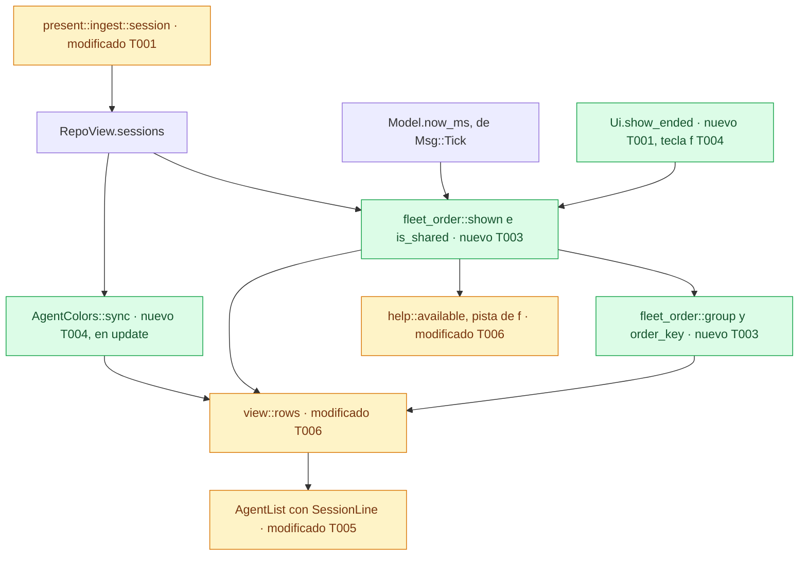
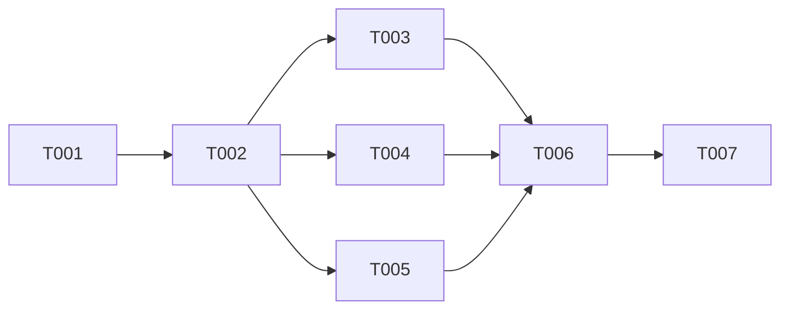

# DS-US-CKP-002 · La flota ordenada por atención, con las sesiones terminadas

## Contexto rápido

Al terminar, el desarrollador encuentra en segundos el worktree que necesita su intervención: el principal arriba, luego lo que pide atención, luego los agentes Activos, los Inactivos, los Terminados y, al final, los worktrees sin agente. Una sesión terminada se ve 24 h, o hasta que otra sesión empieza en su worktree. Después queda la línea "último agente: claude-4 (terminó hace 1 d)", y la tecla `f` vuelve a mostrarla. Un worktree con dos o más sesiones presentes se marca "compartido". Cada agente conserva su color mientras dure su sesión, también tras una resincronización. Hoy la TUI pinta los worktrees en el orden en que los publica el motor, descarta las sesiones terminadas (la fila dice "Sin agente") y asigna el color por posición, así que cambiaría al reordenar.

Para eso:

- un módulo puro de la vista decide qué sesiones enseña cada fila y en qué grupo va (`tui/fleet_order.rs`);
- un registro de colores en `Model.ui` da a cada sesión presente un hueco estable (`model/agent_colors.rs`);
- AgentList gana una línea de sesiones bajo la fila;
- la tecla `f` alterna el filtro "ver terminadas", en la barra y en la ayuda `?`.

No hay métodos ni campos nuevos en el contrato. La TUI lee `started_utc_ms`, `ended_utc_ms` y `end_cause`, que `SessionView` ya publica. Se implementa después de DS-US-CKP-005 y DS-US-CKP-003 y se apoya en lo que ellas dejan: `Say`, `help::available`, `every_text()`, `EngineMsg::Lagged` y el test `no_action_targets_a_row`.

| Término | Qué es aquí |
|---|---|
| Sesión presente | Sesión en estado Activo o Inactivo |
| Terminada visible | La última sesión terminada del worktree, por `(started_utc_ms, session_id)`, mientras `ahora − fin < 24 h` y ninguna sesión del worktree empezó después de su fin (BR-CKP-TIME-002) |
| Fin | `ended_utc_ms`. Si falta, `state_since_utc_ms`, la hora en que el motor publicó el estado Terminado. Con `end_cause = ended-during-gap` es "sin observar"; sin hora por otro motivo, "no disponible" (D6) |
| Grupo | Posición de la fila en el orden: principal, atención, Activo, Inactivo, Terminado, sin agente |
| Hueco de color | Índice 0, 1, 2… que `agent_color(index % 8)` convierte en `agent.1..8` |

### Decisiones

Las incorporan las reglas de cada tarea.

| # | Decisión | Alternativa descartada y por qué | Validación |
|---|---|---|---|
| D1 | **Orden.** Grupos: principal, atención (la fila tiene ⚡ o ⛔), Activo, Inactivo, Terminado visible y sin agente. "Agente no disponible" va con sin agente. El grupo sale de la sesión de mayor rango que la fila enseña. Dentro del grupo, el desempate es el nombre de la carpeta, luego la ruta y luego la clave. La función es pura y `view` la recalcula en cada frame (ADR-CKP-003 § 2: el orden es presentación). Una fila solo se mueve cuando cambia de grupo | Ordenar por actividad reciente dentro del grupo: la fila saltaría con cada archivo guardado | Decisión del orquestador (2026-10-09), validada por Arquitecto y PO |
| D2 | **⚡ y ⛔ cableados pero inactivos.** La atención de la fila es `conflict \|\| blocked` de su `AgentRowModel`, hoy fijos a `false`. Cuando US-CKP-006 y US-CKP-019 los rellenen, la fila sube sin tocar el orden | Un campo de atención nuevo en el modelo que nadie rellena | Decisión del orquestador (2026-10-09), validada por Arquitecto y PO sin objeciones |
| D3 | **El hueco de observación no usa `last_activity_in_gap`.** Ese campo dice que la hora de la última actividad puede caer en un hueco, y el primer cambio en vivo lo borra aunque lo ocurrido en el hueco siga sin revisar. La señal por worktree es una dependencia de US-GRP-005. Mientras tanto, el hueco no sube ninguna fila | Usarlo como señal: la TUI daría a un campo del contrato un significado que no tiene | Decisión del orquestador (2026-10-09), validada por Arquitecto y PO |
| D4 | **Color estable por sesión.** `Model.ui.colors` asigna a cada sesión presente el hueco libre más bajo, en orden `(started_ms, session_id)`, y lo conserva mientras siga presente. Libera un hueco cuando su sesión termina, o cuando una lista completa y con detección (`sessions.list` con `detection_available: true`) ya no la trae. Una lista que falla no llega a `update`, y una con `detection_available: false` no libera nada. Una instantánea, un `Lagged` o una reconexión no tocan el registro. Al abrir otro repo, el registro se vacía. Con 8 huecos ocupados, la novena sesión recibe el 8, que repite `agent.1`. `agent_color(index % 8)` e `is_agent_color_reused` no cambian | Hash de `session_id`: con 3 agentes, dos comparten color el 34 % de las veces. Orden de llegada sin reutilizar huecos: tras 8 sesiones en la ejecución, dos agentes vivos comparten color. Orden por inicio sin estado: al terminar una sesión antigua, cambian de color todas las posteriores. Conservar el registro al cambiar de repo: las sesiones del repo anterior ocuparían los huecos bajos y los agentes del nuevo empezarían a repetir colores antes de tener ocho | Decisión del orquestador (2026-10-09), validada por Arquitecto y PO, con ajuste: tests de que una lista fallida o sin detección no libera huecos y de que tras `Lagged` o una reconexión cada agente conserva su color; se fija qué pasa al cambiar de repo |
| D5 | **Ventana de 24 h en la TUI.** Una Terminada es visible si `ahora − fin < 24 h` y ninguna sesión del worktree empezó después de su fin. Solo cuenta la última Terminada de cada worktree por `(started_ms, session_id)`, la misma que publica `sessions.list` con `include_ended: false`, así que la vista es igual antes y después de una resincronización. Comparar una hora publicada con el reloj de `Msg::Tick` es presentación, como la antigüedad de la actividad (DS-US-CKP-001 § 6, E1) | `include_ended: true`: trae todo el historial, choca con la página de 500 y no añade nada que la fila enseñe | Decisión del orquestador (2026-10-09), validada por Arquitecto y PO sin objeciones |
| D6 | **Fin sin hora publicada.** Sin `ended_utc_ms`, la ventana cuenta desde `state_since_utc_ms`, la hora en que el motor publicó el fin. Eso alarga la ventana como mucho lo que duró el hueco, y nunca la acorta. El texto sale del motivo publicado: con `end_cause = ended-during-gap`, "terminó sin observar; detectado hace 2 h". Sin hora de fin por cualquier otro motivo, "hora de fin no disponible" | Deducir "sin observar" de la ausencia de `ended_utc_ms`: la TUI afirmaría un motivo que el motor no publicó | Decisión del orquestador (2026-10-09), validada por Arquitecto y PO, con ajuste: el texto sale de `EndedDuringGap`, no de la ausencia de `ended_ms`; sin hora por otro motivo, "no disponible"; textos del PO |
| D7 | **Filtro "ver terminadas" con `f`**, igual en en y en es, sin choque con otras teclas. Vive en `Model.ui.show_ended` y no se guarda entre ejecuciones. Enseña la última Terminada de cada worktree aunque esté oculta. En la barra, la pista sale solo si hay alguna oculta o el filtro está activo: "f show ended (3)" / "f ver terminadas (3)", donde 3 es cuántas hay ocultas, y "f hide ended" / "f ocultar terminadas" con el filtro activo. En la ayuda `?` aparece siempre en el grupo de la flota | `e` (en) y `t` (es): la `e` es la tecla natural del editor (BR-CKP-ELIG-006). Persistir el filtro: es de la vista recordada (US-CKP-004, BR-CKP-CONS-006) | Decisión del orquestador (2026-10-09), validada por Arquitecto y PO |
| D8 | **"Compartido" = dos o más sesiones presentes** (Activo o Inactivo). Una Terminada visible se pinta pero no cuenta, y el filtro no influye. La regla vive solo en `fleet_order::is_shared`, marcada como provisional. Es una excepción temporal a BR-CKP-CALC-001 (G1): cuando US-GRP-011 publique la marca, la TUI usa su valor y la función se borra | Contar las sesiones que la fila enseña, Terminadas incluidas: contradice US-GRP-011, escenario 3. Esperar a US-GRP-011: el escenario 4 quedaría bloqueado | Decisión del orquestador (2026-10-09), validada por Arquitecto y PO, con ajuste: solo presentes, regla aislada y provisional, excepción registrada en Gaps y escenario 4 reescrito |
| D9 | **Línea de sesiones bajo la fila**, en tono tenue: "└ compartido con ◐ claude-2, ○ claude-3 (terminó hace 2 h)", "└ ○ claude-1 (terminó hace 1 h)", "└ terminó hace 2 h" o "└ último agente: claude-4 (terminó hace 1 d)". El espacio se reparte así: primero las filas, luego las líneas de sesiones y luego las de commit (US-CKP-026) | Etiqueta tras la rama: a 80 columnas la rama tiene unas 15 y la etiqueta se omite (`BRANCH_MIN`) | Decisión del orquestador (2026-10-09), validada por Arquitecto y PO sin objeciones; el texto sigue el ajuste de D8 |
| D10 | **La fila con solo una Terminada deja de decir "Sin agente"** (cambia DS-US-CKP-001 § 7, F1). Durante las 24 h dice "○ claude-4 · feat-old", con el nombre tenue y "└ terminó hace 2 h", y ordena como Terminado. Después dice "○ Sin agente · feat-old", con "└ último agente: claude-4 (terminó hace 1 d)", y ordena como sin agente. Una Terminada nunca tiene color de agente: su nombre va en `text.muted` | Mantener "Sin agente" con la línea del último agente dentro de las 24 h: la ventana no cambiaría nada visible | Decisión del orquestador (2026-10-09), validada por Arquitecto y PO |
| D11 | **"hace 24 h" se pinta "hace 1 d"** (en: "1 d ago"). El catálogo usa la unidad entera mayor (`present/i18n.rs`, `fn age`). El escenario 2 de la historia ya dice "terminó hace 1 d" | Forzar horas hasta 48 h solo aquí: la misma pantalla tendría dos formatos de antigüedad | Decisión del orquestador (2026-10-09), validada por Arquitecto y PO |
| D12 | **La historia queda `partially-implemented` al mezclar.** Pendientes: la subida por hueco (US-GRP-005), por ⚡ (US-CKP-006) y por ⛔ (US-CKP-019) del escenario 1 | `in-progress`, o `implemented` con el escenario 1 a medias | Decisión del orquestador (2026-10-09), validada por Arquitecto y PO, con ajuste: `partially-implemented` |
| D13 | **Orden de implementación: DS-US-CKP-005, DS-US-CKP-003 y esta, en serie.** Esta va al final porque regenera más snapshots. Sus variantes de `i18n.rs` van en un bloque propio con comentario | Implementarlas en paralelo: las tres tocan `view.rs`, `i18n.rs` y los snapshots `fleet_*` | Decisión del orquestador (2026-10-09), validada por Arquitecto |

## 📋 Índice

> **Para aprobar:** [Contexto rápido](#contexto-rápido) · [⚠️ Gaps](#gaps-y-violaciones-de-la-constitución) · [🔭 La forma](#la-forma) · [El trabajo de un vistazo](#el-trabajo-de-un-vistazo).
> **Para implementar:** [🚀 Plan](#plan-de-implementación), en orden. Las secciones `_(ref)_` se abren desde la tarea que las cita.

| Sección | Propósito |
|---------|-----------|
| [Contexto rápido](#contexto-rápido) | Qué se construye, por qué y las decisiones |
| [⚠️ Gaps y violaciones de la constitución](#gaps-y-violaciones-de-la-constitución) | Qué impide empezar y la excepción temporal |
| [🔭 La forma](#la-forma) | Qué piezas quedan y cómo fluye el dato |
| [🚀 Plan de implementación](#plan-de-implementación) | T001…T007 |
| [Estructura de ficheros](#estructura-de-ficheros) _(ref)_ | Árbol de archivos |
| [Contratos compartidos](#contratos-compartidos) _(ref)_ | Tipos y firmas |
| [Contrato de API](#contrato-de-api) _(ref)_ | Campos que se leen y valores numéricos |
| [Estrategia de pruebas y cobertura](#estrategia-de-pruebas-y-cobertura) _(ref)_ | Pruebas |
| [Gate de seguridad](#gate-de-seguridad) | Texto no confiable y fronteras |
| [Fuera de alcance](#fuera-de-alcance) | Lo diferido y su dueño |
| [Notas del autor](#notas-del-autor) _(ref)_ | Lo que no bloquea |

---

## ⚠️ Gaps y violaciones de la constitución

| ID | Qué falta | Severidad | Alcance | Acción | Owner |
|----|-----------|-----------|---------|--------|-------|
| G1 | Excepción temporal a BR-CKP-CALC-001: el motor no publica la marca "compartido" (no hay campo `shared` en `crates/api`) y la TUI la calcula en `fleet_order::is_shared` como dos o más sesiones presentes (D8). La regla coincide con US-GRP-011 | Informativo | T003 | Cuando US-GRP-011 publique la marca, la TUI usa su valor y borra `is_shared` y sus tests | US-GRP-011 |

No hay gaps bloqueantes. Lo que depende del motor tiene dueño en [Fuera de alcance](#fuera-de-alcance).

---

## 🔭 La forma

Quedan dos piezas nuevas. La primera es una función pura de la vista que decide, por worktree, qué sesiones se enseñan y en qué grupo va la fila. La segunda es un registro de colores que vive en el estado de la interfaz y sobrevive a las resincronizaciones.



`AgentColors` se actualiza en `update`, que puede mutar el modelo. `shown` y `group` se calculan en `view` y en `help`, que no pueden. Por eso el color es estado y el orden no.

---

## 🚀 Plan de implementación

> Orden topológico (`Depende:`). Rutas relativas a la raíz del repo.

Empieza cuando DS-US-CKP-005 y DS-US-CKP-003 estén mezcladas (D13). Va en una sola franja. `view.rs`, `model.rs` e `i18n.rs` los tocan casi todas las tareas, y añadir un campo a `AgentRowModel` rompe la compilación de la vista y de la galería a la vez.

### El trabajo de un vistazo

| # | Tarea | Depende | Aterriza en |
|---|---|---|---|
| T001 | Ingerir las horas y el motivo de fin de la sesión y fijar el contrato con stubs | — | `apps/cli/src/{model,present/ingest}.rs`, `model/agent_colors.rs`, `tui/fleet_order.rs`, `tui/widgets/agent_list.rs` |
| T002 | Escribir en rojo los tests de la historia | T001 | `apps/cli/src/{tui,model}/*_tests.rs`, `apps/cli/tests/live_fleet.rs` |
| T003 | Implementar qué enseña cada fila, si es compartida y en qué orden | T002 | `apps/cli/src/tui/fleet_order.rs` |
| T004 | Asignar los colores en `update` y añadir la tecla `f` | T002 | `apps/cli/src/model/agent_colors.rs`, `tui/{update,keymap}.rs` |
| T005 | Pintar la línea de sesiones en AgentList | T002 | `apps/cli/src/tui/widgets/agent_list.rs` |
| T006 | Componer la flota ordenada en la vista y en la ayuda, con textos en/es y snapshots | T003, T004, T005 | `apps/cli/src/tui/{view,help}.rs`, `present/i18n.rs` |
| T007 | Cerrar la historia y la documentación | T006 | `docs` |

### En qué orden



### T001 — Ingerir las horas y el motivo de fin de la sesión y fijar el contrato con stubs

**Objetivo.** `SessionRow` lleva el inicio, el fin y el motivo de fin publicados, y los tipos y firmas de [Contratos compartidos](#contratos-compartidos) existen y compilan. Los cuerpos nuevos son `unimplemented!()` y nadie los llama todavía.

**Ubicación.**
- `apps/cli/src/model.rs` (**MODIFY**)
- `apps/cli/src/model/agent_colors.rs` (**CREATE**)
- `apps/cli/src/present/ingest.rs` (**MODIFY**)
- `apps/cli/src/tui/fleet_order.rs` (**CREATE**)
- `apps/cli/src/tui/mod.rs` (**MODIFY**)
- `apps/cli/src/tui/widgets/agent_list.rs` (**MODIFY**)
- `apps/cli/src/tui/gallery/stories.rs` (**MODIFY**)
- `apps/cli/src/tui/view.rs` (**MODIFY**)

**Reglas**
- `SessionRow` gana `started_ms: i64` (de `started_utc_ms`), `ended_ms: Option<i64>` (de `ended_utc_ms`) y `end_cause: Option<SessionEndCauseView>` (de `end_cause`).
- `Ui` gana `show_ended: bool` (`false` en `Model::new`) y `colors: AgentColors` (`Default`).
- `model.rs` declara `mod agent_colors;` y reexporta `pub use agent_colors::AgentColors;`. El archivo vive en `apps/cli/src/model/agent_colors.rs`.
- `tui/mod.rs` declara `pub mod fleet_order;`.
- `AgentRowModel` gana `sessions: Option<SessionLine>`. Todos los literales existentes (vista, galería y tests del widget) ponen `sessions: None`.
- Los ayudantes de `view::tests` que usará T002 (`render`, `lines`, `screen`, `engine`, `ready`, `worktree`, `session`, `model_with`, `row`) pasan a `pub(super)`.
- Test nuevo en `present::ingest::tests`: `a_session_keeps_its_start_its_end_and_why_it_ended` (con `ended_utc_ms`, sin él y con `ended-during-gap`).

> **Nota técnica.** `model.rs` no es `mod.rs`: `mod agent_colors;` declarado en él busca `src/model/agent_colors.rs`. Un `#[path = "agent_colors_tests.rs"]` puesto en la raíz de `agent_colors.rs` se resuelve en su misma carpeta, como `crates/core/src/daemon/sessions_s3_tests.rs`.

- **Depende:** —
- **Refs:** D4, D5, D6, D7, D9
- **Aceptación:** `cargo test -p gitraptor-cli --lib present::ingest`

### T002 — Escribir en rojo los tests de la historia

**Objetivo.** Los seis escenarios y los ajustes de D4, D6 y D8 como tests que compilan y fallan: los puros sobre `fleet_order` y `AgentColors`, los de vista sobre `TestBackend` y tres de proceso con el daemon real.

**Ubicación.**
- `apps/cli/src/tui/fleet_order_tests.rs` (**CREATE**)
- `apps/cli/src/model/agent_colors_tests.rs` (**CREATE**)
- `apps/cli/src/tui/view_order_tests.rs` (**CREATE**)
- `apps/cli/tests/live_fleet.rs` (**MODIFY**)

**Reglas**
- Los tests van en archivos propios, enganchados con `#[cfg(test)] #[path = "…_tests.rs"] mod tests;` (o `mod order_tests;` en `view.rs`). Ningún archivo de producción figura como test en el contrato de `/implement`.
- Las horas son fijas en el modelo (`now_ms`, `started_utc_ms`, `ended_utc_ms`): nunca el reloj del sistema ni `sleep`.
- `fleet_order_tests.rs`:
  - `main_first_then_attention_then_active_inactive_ended_and_no_agent` (escenario 1: con `attention = true`, una fila Inactiva va antes que una Activa);
  - `ties_keep_the_folder_name_order_so_rows_do_not_jump` (cambiar `last_activity_ms` o `state_since_ms` no mueve filas del mismo grupo);
  - `an_ended_session_is_hidden_at_24_hours` (escenario 2: visible a `fin + 24 h − 1 ms`, oculta a `fin + 24 h`, y `last_agent` la nombra);
  - `a_later_session_hides_the_ended_one` (escenario 3: una sesión con `started_ms > fin`);
  - `an_overlapping_ended_session_stays_visible` (escenarios 4 y 5: la Terminada terminó después de que empezaran las presentes);
  - `two_present_sessions_are_shared` y `an_ended_and_an_inactive_session_are_not_shared` (D8, los dos casos límite);
  - `the_filter_shows_the_latest_ended_session_and_never_changes_shared`;
  - `an_end_during_a_gap_counts_from_when_the_engine_published_it` (D6: `ended_ms = None`, `end_cause = EndedDuringGap` → `EndKind::Unobserved`);
  - `an_end_without_time_nor_gap_cause_is_not_available` (D6: `ended_ms = None`, otro motivo o ninguno → `EndKind::NotAvailable`);
  - `only_the_latest_ended_session_of_a_worktree_counts` (por `(started_ms, session_id)`).
- `agent_colors_tests.rs`:
  - `the_ninth_present_session_takes_slot_eight` (escenario de los 9 agentes);
  - `an_ended_session_frees_its_slot_for_the_next_one`;
  - `a_partial_update_never_frees_a_slot`;
  - `a_list_without_detection_never_frees_a_slot` (D4);
  - `another_repo_empties_the_register` (D4).
- `view_order_tests.rs`, en en y es salvo donde se diga. Alimentan el modelo con mensajes por `update`:
  - `the_fleet_goes_main_active_inactive_ended_no_agent`;
  - `an_ended_session_shows_when_it_ended_then_its_last_agent` (escenario 2: "terminó hace 2 h", y a las 24 h "último agente: claude-4 (terminó hace 1 d)" / "last agent: claude-4 (ended 1 d ago)"; con `f`, vuelve a verse);
  - `a_session_ended_unobserved_says_so` ("último agente: claude-4 (terminó sin observar; detectado hace 2 h)" / "last agent: claude-4 (ended unobserved; detected 2 h ago)");
  - `a_new_session_replaces_the_ended_one` (escenario 3);
  - `a_shared_worktree_shows_all_its_sessions` (escenario 4: `claude-1` Activo, `claude-2` Inactivo y `claude-3` Terminado; la fila dice "compartido con" y nombra a los tres);
  - `a_present_and_an_ended_session_are_not_shared` (escenario 5: enseña las dos y no dice "compartido");
  - `nine_agents_the_ninth_shares_the_first_color_and_keeps_its_name` (mismo `fg` en el nombre de `claude-9` y de `claude-1`, y `claude-9` con su símbolo; solo en);
  - `each_agent_keeps_its_color_after_lagged_and_a_reconnection` (D4: `EngineMsg::Lagged`, conexión caída, instantánea nueva y lista; el `fg` de cada nombre no cambia);
  - `a_failed_sessions_list_never_frees_a_color` (D4: instantánea nueva, `session.state` de una sola sesión y ninguna lista; las demás conservan su `fg` cuando la lista llega después);
  - `the_show_ended_hint_counts_what_is_hidden` ("f show ended (3)" / "f ver terminadas (3)", "f hide ended" con el filtro activo, ninguna pista sin ocultas; y `f` en la ayuda `?`, grupo de la flota);
  - snapshots `fleet_order_{80x24,120x40}_{en,es}`, `fleet_shared_80x24_{en,es}` y `fleet_last_agent_80x24_{en,es}`.
- `live_fleet.rs`, con el arnés `Shop` y `raptor agent register|withdraw` bajo `script`:
  - `rows_go_by_what_asks_for_attention`: `claude-1` en `pagos`, y la fila de `pagos` va antes que la de `docs`, aunque alfabéticamente sería al revés;
  - `an_ended_session_stays_until_a_new_one_replaces_it`: `withdraw` deja "○ claude-1 · pagos" con "ended"; otro `register` deja "● claude-1 · pagos" sin "ended";
  - `a_shared_worktree_shows_all_its_sessions`: con `claude-1` y `claude-2` en `pagos`, la fila dice "shared with". Tras retirar `claude-1`, sigue nombrándolo con "ended" y ya no dice "shared with".

> **Nota técnica.** Registrar un agente distinto en un worktree con sesión añade una sesión. Registrar el mismo agente tras retirarlo abre una sesión nueva, porque una Terminada no se reabre (`crates/core/src/daemon/sessions.rs`, `register`). Por eso los escenarios 3 y 4 se reproducen con el daemon real. Una lista de sesiones que falla o que el daemon rechaza no produce `EngineMsg::Sessions` (`apps/cli/src/client/mod.rs`, `fn sessions`): en los tests de vista, "lista fallida" es no enviar la lista.

- **Depende:** T001
- **Refs:** escenarios 1 a 6 de US-CKP-002; D4, D6, D8
- **Aceptación:** `cargo test -p gitraptor-cli --no-run` compila, y `cargo test -p gitraptor-cli --lib tui::fleet_order` falla en rojo

### T003 — Implementar qué enseña cada fila, si es compartida y en qué orden

**Objetivo.** `shown`, `ended_at`, `is_shared`, `group`, `order_key` y `hidden_count` según D1, D5, D6 y D8. Nada de pintar: eso es de T005 y T006.

**Ubicación.** `apps/cli/src/tui/fleet_order.rs` (**MODIFY**)

**Pasos**
1. `ended_at(s)`: `None` si `s.state != Ended`. Si no:
   - con `s.ended_ms = Some(t)`: `EndedAt { at_ms: t, kind: EndKind::Published }`;
   - sin `ended_ms` y con `s.end_cause == Some(EndedDuringGap)`: `at_ms = s.state_since_ms`, `kind: EndKind::Unobserved`;
   - en cualquier otro caso: `at_ms = s.state_since_ms`, `kind: EndKind::NotAvailable`.
2. `shown(sessions, worktree, now_ms, show_ended)`:
   2.1 Presentes: las sesiones del worktree en Activo o Inactivo.
   2.2 Última Terminada `E`: la de mayor `(started_ms, session_id)` entre las Terminadas del worktree. Las demás Terminadas no se miran.
   2.3 `E` es visible por defecto si `now_ms.saturating_sub(fin.at_ms) < ENDED_VISIBLE_MS` y ninguna sesión del worktree, presente o terminada, tiene `started_ms > fin.at_ms`.
   2.4 `sessions` = presentes + `E` si es visible o si `show_ended`, ordenadas por rango (Activo, Inactivo, Terminada), luego por `state_since_ms` más reciente y luego por `session_id`.
   2.5 `hidden` = existe `E` y no es visible por defecto. `last_agent` = `E` si `hidden`, no hay presentes y el filtro está apagado.
3. `is_shared(shown)` = dos o más sesiones de `shown.sessions` en Activo o Inactivo. Doc comment: provisional, excepción a BR-CKP-CALC-001 hasta que el motor publique la marca (US-GRP-011); se borra entonces.
   3.1 ⛔3.1 Una Terminada nunca cuenta, ni visible ni mostrada por el filtro: si contara, una Inactiva junto a una Terminada se marcaría compartida, contra el escenario 5.
4. `group(main, attention, lead)`: `Main` si `main`. Si no, `Attention` si `attention`. Si no, según el estado de `lead`: `Active`, `Inactive` o `Ended`. Sin `lead`, `NoAgent`.
5. `order_key(group, w)` = `(group, w.name.as_str(), w.path.as_str(), w.key)`.
6. `hidden_count(repo, now_ms)` = cuántos worktrees de `repo` tienen `shown(…, false).hidden`. Con `repo.detection != Some(true)`, 0.

- **Depende:** T002
- **Refs:** D1, D5, D6, D8; BR-CKP-WF-001, BR-CKP-TIME-002, BR-CKP-EDGE-004
- **Aceptación:** `cargo test -p gitraptor-cli --lib tui::fleet_order`
- **Guard ⛔3.1:** `tui::fleet_order::tests::an_ended_and_an_inactive_session_are_not_shared`

### T004 — Asignar los colores en `update` y añadir la tecla `f`

**Objetivo.** Cada sesión presente tiene un hueco estable durante la ejecución, `f` alterna el filtro y el reloj repinta las antigüedades de las Terminadas.

**Ubicación.**
- `apps/cli/src/model/agent_colors.rs` (**MODIFY**)
- `apps/cli/src/tui/update.rs` (**MODIFY**)
- `apps/cli/src/tui/keymap.rs` (**MODIFY**)
- `apps/cli/src/present/i18n.rs` (**MODIFY**)
- el archivo del test `no_action_targets_a_row` de DS-US-CKP-003 (**MODIFY**)

**Pasos**
1. `AgentColors::open(repo_id)`: si el registro es de otro repo, lo vacía y apunta el nuevo `repo_id`. Con el mismo repo no hace nada.
2. `AgentColors::sync(sessions, complete)`:
   2.1 Libera el hueco de cada sesión que en `sessions` está Terminada.
   2.2 Con `complete`, libera además los de las sesiones que no están en `sessions`.
   2.3 Da hueco a cada presente que no lo tenga, en orden `(started_ms, session_id)`: el menor índice que no use ninguna otra.
3. Llamadas en `update`:
   - `ScopeSnapshot::Repo`: `model.ui.colors.open(&repo.repo_id)` y nada más;
   - `on_sessions`, tras fusionar la lista: `sync(&data.sessions, result.detection_available)`;
   - la rama de `session.state`, tras el `upsert`: `sync(&data.sessions, false)`.

   3.1 ⛔3.1 Nunca `sync` al aplicar una instantánea, un `Lagged` o una reconexión. La instantánea vacía `sessions` y liberaría todos los huecos: tras la resincronización, los agentes cambiarían de color.
4. En `Msg::Tick`, marca `dirty` si hay datos del repo y, además, `engine.activity` o alguna sesión Terminada en `data.sessions`.
5. `Action::ShowEnded` con `Key::Char('f')` y pista `Text::KeyShowEnded(0)`. `is_hinted() == true`, `is_global() == false`; no es de lista ni de respuesta. En `on_action`, con `ui.pick == Pick::None` y la ayuda cerrada, alterna `ui.show_ended`. Fuera de esa condición responde `Notice::UnknownKey`.
6. En el `match` exhaustivo de `no_action_targets_a_row`, `ShowEnded` se clasifica como acción que no apunta a una fila: filtra la lista entera.
7. Los textos de las pistas van en el bloque `// Fleet order and ended sessions` de `i18n.rs` (ver T006).

> **Nota técnica.** Tras una instantánea, el canal vuelve a pedir `sessions.list`, y los `session.state` posteriores pueden llegar antes que ella (DS-US-CKP-001 D1). Por eso solo una lista completa y con detección libera huecos de sesiones ausentes: un evento suelto no sabe qué falta, y una lista sin detección puede venir vacía.

- **Depende:** T002
- **Refs:** D4, D7; BR-CKP-EDGE-006; ADR-CKP-003 § 2 (`Model.ui`) y § 3 (un tick solo repinta si cambia un texto)
- **Aceptación:** `cargo test -p gitraptor-cli --lib model::agent_colors` y `cargo test -p gitraptor-cli --lib tui::update`
- **Guard ⛔3.1:** `tui::view::order_tests::each_agent_keeps_its_color_after_lagged_and_a_reconnection`

### T005 — Pintar la línea de sesiones en AgentList

**Objetivo.** El widget pinta `SessionLine` bajo la fila y reparte el espacio en tres niveles. Una Terminada lleva el nombre tenue.

**Ubicación.**
- `apps/cli/src/tui/widgets/agent_list.rs` (**MODIFY**)
- `apps/cli/src/tui/widgets/tests.rs` (**MODIFY**)
- `apps/cli/src/tui/widgets/snapshots/` (**CREATE**: `agentlist__shared_sessions.snap`, `agentlist__last_agent.snap`, en Unicode y ASCII)

**Reglas**
- La línea se pinta como la de commit: sangría `MARK + cols.state`, glifo `lane_last` y un espacio. Después van `lead` en `text.muted` y cada `SessionMark`: su símbolo de estado (`AgentState` → `SymbolToken`, el mismo mapa de `state_symbol`), un espacio y su texto, separados por `, `. Una marca con `color_index` pinta el texto en `styles.agent(i)`. Sin `color_index`, va en `text.muted`. La línea se recorta al ancho, como `pen.safe`.
- Reparto del espacio: si las filas visibles caben con todas sus líneas de sesiones y de commit, se pintan todas. Si solo caben con las de sesiones, se pintan las de sesiones. Si no, solo las filas. Bajo una fila va primero la línea de sesiones y después la de commit.
- `AgentState::Done` pinta el nombre en `text.muted`, como `NoAgent` y `Unknown` (D10).
- `color_index` deja de ser "posición": su doc dice "hueco estable de `AgentColors`".
- Galería: una historia "fila compartida" con `SessionLine`.

- **Depende:** T002
- **Refs:** D9, D10; DSYS-GRP-001 § 2.2 (símbolos ● ◐ ○, ASCII `*` `~` `o`) y § 6 (el color nunca va solo)
- **Aceptación:** `cargo test -p gitraptor-cli --lib tui::widgets`

### T006 — Componer la flota ordenada en la vista y en la ayuda, con textos en/es y snapshots

**Objetivo.** `view::rows` usa `fleet_order` y `AgentColors`, pinta la línea de sesiones y ordena las filas. La barra y la ayuda enseñan `f` con su recuento.

**Ubicación.**
- `apps/cli/src/tui/view.rs` (**MODIFY**)
- `apps/cli/src/tui/help.rs` (**MODIFY**)
- `apps/cli/src/present/i18n.rs` (**MODIFY**)
- `apps/cli/src/tui/snapshots/` (**CREATE**: los de T002; **MODIFY**: `fleet_*` existentes si su orden cambia)

**Pasos**
1. Borra el contador `agents` y la función `present`. Para cada worktree: `let s = fleet_order::shown(&repo.sessions, w.key, model.now_ms, model.ui.show_ended)`.
2. Con `repo.detection == Some(true)` y `s.sessions` no vacía, la fila la encabeza `s.sessions[0]`:
   2.1 Nombre `AgentInWorktree` y, si hay más sesiones, `AgentAndMore { more: len − 1 }`, como hoy.
   2.2 Estado `Active`, `Idle` o `Done`.
   2.3 `color_index = model.ui.colors.index(id).unwrap_or(0)`. Una Terminada no tiene hueco: el widget la pinta tenue.
3. Línea de sesiones (`row.sessions`), con los textos de [Firmas del stack](#firmas-del-stack). Todo texto pasa por `say` (DS-US-CKP-005): `say.safe(Text::…)`, nunca `.render(`.
   3.1 Más de una sesión: `lead` = `Shared` si `fleet_order::is_shared(&s)`, o vacío si no. Una `SessionMark` por cada sesión salvo la primera: una presente lleva el nombre del agente y su hueco, y una Terminada lleva `AgentEnded` y ningún hueco.
   3.2 Una sola sesión y es Terminada: `lead` = `Ended(kind, ago)`, sin marcas.
   3.3 Sin sesiones y con `s.last_agent`: fila `NoAgent` como hoy, y `lead` = `LastAgent { agent, end }`.
   ⛔3.1 Con la detección desconocida (`detection != Some(true)`), la fila sigue diciendo "agente no disponible", sin línea de sesiones: nunca "último agente".
4. Grupo: `fleet_order::group(w.main, row.conflict || row.blocked, s.sessions.first().map(|x| x.state))`. Ordena las filas por `order_key` con `sort_by` (estable).
5. Pista de `f`, en `help.rs`:
   - `help::available` deja pasar `ShowEnded` solo en el panel de la flota;
   - en la barra, solo si `fleet_order::hidden_count(repo, now_ms) > 0` o `ui.show_ended`;
   - su texto es `KeyShowEnded(n)` con el recuento, o `KeyHideEnded` con el filtro activo;
   - en la ayuda `?` sale siempre en el grupo de la flota, con el mismo texto.
6. Textos en/es en `i18n.rs`: las variantes nuevas van en un bloque propio, al final del `enum Text` y de cada `match`, con el comentario `// Fleet order and ended sessions`. Cada una tiene su muestra en `every_text()` y su brazo en `sampled()` (DS-US-CKP-005).
7. Revisa uno a uno los snapshots `fleet_*` que cambien. ⛔7.1 Nunca los aceptes en bloque: un orden distinto del de D1 pasaría como "snapshot actualizado".

> **Nota técnica.** El nombre del agente y el de la carpeta ya llegan saneados (`SafeText`) desde la ingesta. Los textos nuevos los forma el catálogo y los entrega `say.safe`, que además los pliega a ASCII: ningún texto del motor llega a la terminal sin pasar por el saneador (SEC-12), y `every_catalog_text_folds_to_ascii` cubre las variantes nuevas.

- **Depende:** T003, T004, T005
- **Refs:** D1, D2, D7, D8, D9, D10, D11, D13; DS-US-CKP-001 § 7; DS-US-CKP-005 (`Say`, `help::available`, `every_text`)
- **Aceptación:** `cargo test -p gitraptor-cli --lib tui::view`, `cargo test -p gitraptor-cli --lib present::i18n` y `cargo test -p gitraptor-cli --test live_fleet`
- **Guard ⛔3.1:** `tui::view::tests::unknown_detection_is_not_presented_as_no_agent`
- **Guard ⛔7.1:** `tui::view::order_tests::the_fleet_goes_main_active_inactive_ended_no_agent`

### T007 — Cerrar la historia y la documentación

**Objetivo.** La historia enlaza esta Dev Spec y queda `partially-implemented`, con lo pendiente nombrado.

**Ubicación.**
- `docs/requirements/features/cockpit/user-stories/US-CKP-002-orden-atencion-terminadas.md` (**MODIFY**)
- `docs/requirements/features/cockpit/user-stories.md` (**MODIFY**)
- `docs/requirements/release-status.md` (**MODIFY**, regenerado con `node tools/status/release-status.mjs`)
- `docs/requirements/features/cockpit/dev-specs/US-CKP-001-flota-en-vivo.md` (**MODIFY**)
- `docs/requirements/features/cockpit/dev-specs/US-CKP-002-orden-atencion-terminadas.md` (**MODIFY**)

**Reglas**
- Historia: `status: partially-implemented` (D12) y una sección "Estado de la implementación" con lo pendiente: la subida por hueco de observación (US-GRP-005), por conflicto previsto (US-CKP-006) y por denegación de Guardrails (US-CKP-019).
- DS-US-CKP-001 § 7: una línea que diga que F1 ("Sin agente" para una fila con solo una Terminada) lo sustituye DS-US-CKP-002 D10.
- Esta Dev Spec: `status`, `updated` y la sección "Estado de la implementación" con los PR.

- **Depende:** T006
- **Refs:** D12; `docs/requirements/release-plan.md` (cada PR que cierra una ficha actualiza su frontmatter y su fila, y regenera el estado)
- **Aceptación:** `cargo fmt --all --check`, `cargo clippy --workspace --all-targets -- -D warnings` y `cargo test --workspace` en verde

---

> Las secciones siguientes son de referencia. Se abren desde la tarea que las cita.

## Estructura de ficheros

```text
apps/cli/src/
├── model.rs                         ← MODIFY  SessionRow.{started_ms, ended_ms, end_cause}, Ui.{show_ended, colors}
├── model/
│   ├── agent_colors.rs              ← CREATE  AgentColors (T001 stub, T004)
│   └── agent_colors_tests.rs        ← CREATE  (T002)
├── present/
│   ├── ingest.rs                    ← MODIFY  inicio, fin y motivo de fin de la sesión
│   └── i18n.rs                      ← MODIFY  bloque "Fleet order and ended sessions", muestras de every_text
└── tui/
    ├── mod.rs                       ← MODIFY  pub mod fleet_order
    ├── fleet_order.rs               ← CREATE  shown, ended_at, is_shared, group, order_key, hidden_count
    ├── fleet_order_tests.rs         ← CREATE  (T002)
    ├── help.rs                      ← MODIFY  ShowEnded en el panel de la flota, con recuento
    ├── keymap.rs                    ← MODIFY  Action::ShowEnded, tecla f
    ├── update.rs                    ← MODIFY  open y sync de colores, f, Tick
    ├── view.rs                      ← MODIFY  filas ordenadas, línea de sesiones
    ├── view_order_tests.rs          ← CREATE  (T002)
    ├── gallery/stories.rs           ← MODIFY  sessions: None y la historia "fila compartida"
    ├── snapshots/                   ← CREATE  fleet_order_*, fleet_shared_*, fleet_last_agent_*
    └── widgets/
        ├── agent_list.rs            ← MODIFY  SessionLine, SessionMark, reparto en tres niveles
        ├── tests.rs                 ← MODIFY
        └── snapshots/               ← CREATE  agentlist__shared_sessions, agentlist__last_agent
apps/cli/tests/live_fleet.rs         ← MODIFY  tres escenarios con el daemon real
```

---

## Contratos compartidos

### Tipos y datos compartidos

```rust
// apps/cli/src/model.rs
pub struct SessionRow {
    pub session_id: String,
    pub worktree: u64,
    pub kind: AgentKind,
    pub name: Option<SafeText>,
    pub state: SessionStateView,
    pub state_since_ms: i64,
    /// `started_utc_ms`: orders the sessions of a worktree and finds the one after an end.
    pub started_ms: i64,
    /// `ended_utc_ms`; `None` while present and when the engine has no end time.
    pub ended_ms: Option<i64>,
    /// `end_cause`: only `EndedDuringGap` makes an end "unobserved".
    pub end_cause: Option<SessionEndCauseView>,
}
pub struct Ui { /* … */ pub show_ended: bool, pub colors: AgentColors }

// apps/cli/src/model/agent_colors.rs
/// Stable color slots of the present sessions of the open repo, for this run (BR-CKP-EDGE-006).
#[derive(Debug, Clone, Default, PartialEq, Eq)]
pub struct AgentColors {
    repo_id: Option<String>,
    slots: std::collections::BTreeMap<String, usize>,
}

// apps/cli/src/tui/fleet_order.rs
pub const ENDED_VISIBLE_MS: i64 = 86_400_000;
#[derive(Debug, Clone, Copy, PartialEq, Eq)]
pub enum EndKind { Published, Unobserved, NotAvailable }
#[derive(Debug, Clone, Copy, PartialEq, Eq)]
pub struct EndedAt { pub at_ms: i64, pub kind: EndKind }
#[derive(Debug, Default, PartialEq, Eq)]
pub struct Shown<'r> {
    pub sessions: Vec<&'r SessionRow>,
    pub hidden: bool,
    pub last_agent: Option<&'r SessionRow>,
}
#[derive(Debug, Clone, Copy, PartialEq, Eq, PartialOrd, Ord)]
pub enum Group { Main, Attention, Active, Inactive, Ended, NoAgent }

// apps/cli/src/tui/widgets/agent_list.rs
pub struct AgentRowModel { /* … */ pub sessions: Option<SessionLine> }
#[derive(Debug, Clone, PartialEq, Eq)]
pub struct SessionLine { pub lead: SafeText, pub marks: Vec<SessionMark> }
#[derive(Debug, Clone, PartialEq, Eq)]
pub struct SessionMark { pub state: AgentState, pub color_index: Option<usize>, pub text: SafeText }

// apps/cli/src/tui/keymap.rs
pub enum Action { /* … */ ShowEnded }
```

### Ciclos de vida (DI)

_No aplica — Rust sin contenedor de dependencias._ `show_ended` vive en `Model.ui` durante toda la ejecución de la TUI y no se guarda al salir. `AgentColors` también, pero se vacía al abrir otro repo.

### Firmas del stack

```rust
// apps/cli/src/model/agent_colors.rs
impl AgentColors {
    pub fn open(&mut self, repo_id: &str);
    pub fn index(&self, session_id: &str) -> Option<usize>;
    pub fn sync(&mut self, sessions: &[SessionRow], complete: bool);
}
// apps/cli/src/tui/fleet_order.rs
pub fn ended_at(session: &SessionRow) -> Option<EndedAt>;
pub fn shown(sessions: &[SessionRow], worktree: u64, now_ms: i64, show_ended: bool) -> Shown<'_>;
/// Provisional: the engine does not publish "shared" yet (US-GRP-011).
pub fn is_shared(shown: &Shown<'_>) -> bool;
pub fn group(main: bool, attention: bool, lead: Option<SessionStateView>) -> Group;
pub fn order_key(group: Group, worktree: &WorktreeRow) -> (Group, &str, &str, u64);
pub fn hidden_count(repo: &RepoView, now_ms: i64) -> usize;
```

Textos nuevos del catálogo (`present/i18n.rs`, bloque `// Fleet order and ended sessions`). `{ago}` es `Text::Ago`: "2 h ago" / "hace 2 h", y "just now" / "ahora" por debajo de un segundo. `{end}` es el texto de `Ended`.

| Variante | en | es |
|---|---|---|
| `Shared` | `shared with` | `compartido con` |
| `Ended(Published, ago)` | `ended {ago}` | `terminó {ago}` |
| `Ended(Unobserved, ago)` | `ended unobserved; detected {ago}` | `terminó sin observar; detectado {ago}` |
| `Ended(NotAvailable, _)` | `end time not available` | `hora de fin no disponible` |
| `AgentEnded { agent, end }` | `{agent} ({end})` | `{agent} ({end})` |
| `LastAgent { agent, end }` | `last agent: {agent} ({end})` | `último agente: {agent} ({end})` |
| `KeyShowEnded(n)` | `show ended ({n})` | `ver terminadas ({n})` |
| `KeyHideEnded` | `hide ended` | `ocultar terminadas` |

---

## Contrato de API

_Sin métodos ni campos nuevos._ La TUI lee de `SessionView` (`crates/api/src/messages.rs`) los campos que ya publican `sessions.list` (`include_ended: false`) y `session.state`:

| Campo | Uso en la TUI |
|---|---|
| `started_utc_ms` | Orden de las sesiones de un worktree y "¿empezó otra después del fin?" |
| `ended_utc_ms` | Fin de la sesión (`EndKind::Published`) |
| `end_cause` | `ended-during-gap` sin `ended_utc_ms` → `EndKind::Unobserved`. Sin hora y con otro motivo o ninguno → `EndKind::NotAvailable` |
| `state_since_utc_ms` | Fin para la ventana de 24 h cuando falta `ended_utc_ms`: la hora en que el motor publicó el estado Terminado (`crates/core/src/daemon/sessions.rs`, `state_of` y el evento `session-end`) |

### Forma del error y del cuerpo de respuesta

_No aplica — no hay llamadas nuevas al daemon._ La única respuesta nueva al usuario es la de la tecla `f` fuera de la flota: `Notice::UnknownKey`, que ya existe.

### Valores numéricos

| Valor | Cifra | Regla |
|---|---|---|
| Ventana de una Terminada | `ENDED_VISIBLE_MS = 86_400_000` | Visible si `ahora − fin < 24 h`: a las 24 h exactas ya se oculta |
| Compartido | ≥ 2 sesiones presentes | Las Terminadas no cuentan (D8) |
| Colores de agente | 8 (`AGENT_COLORS`) | Hueco `i` → `agent_color(i % 8)`. El hueco 8 repite `agent.1` |
| Repintado | 1 Hz (`Msg::Tick`) | Con datos del repo y actividad publicada, o con alguna Terminada en la réplica |
| Líneas bajo una fila | ≤ 2 | Sesiones y commit, en ese orden y con ese reparto |

---

## Estrategia de pruebas y cobertura

### 9.1 Pirámide de pruebas

| Tipo | Cantidad | Tareas dueñas | Herramientas | Cuándo |
|------|---------:|-------------|---------|------|
| Unit (puras) | 17 | T002, T003, T004 | `cargo test` | PR gate |
| Unit (vista y widget) | 11 + snapshots | T002, T005, T006 | `TestBackend`, `insta` | PR gate |
| Proceso (daemon real) | 3 | T002, T006 | `live_fleet.rs`, `script` de macOS | PR gate (macOS) |

### 9.2 Umbrales de cobertura

| Capa | Línea | Rama | Mutación | Camino crítico 100% |
|-------|-----:|-------:|---------:|:------------------:|
| `tui::fleet_order` | — | — | — | ✅ los seis grupos, el límite de 24 h, la sesión posterior, el solape, los dos casos límite de compartido, el filtro y los tres `EndKind` |
| `model::agent_colors` | — | — | — | ✅ asignar, conservar, liberar al terminar, liberar con la lista completa, no liberar con un evento suelto ni con una lista sin detección, vaciar al cambiar de repo |

### 9.3 Datos de prueba

- Unit: `SessionRow` construidas a mano con horas fijas. `now_ms` = lunes 9:00 + N.
- Vista: el modelo de `view::tests` (`shop` con `main`, `feat-pagos`, `feat-docs`, `feat-old`), alimentado con `EngineMsg::Sessions`, `session.state`, `EngineMsg::Lagged` y eventos de conexión por `update`.
- Proceso: el arnés `Shop` de `live_fleet.rs`, con repos y perfil temporales (`gitraptor_testkit::Fixture`, NFR-01) y agentes registrados con `raptor agent register|withdraw`.
- Reloj: la vista nunca lee el reloj. Las 24 h solo se prueban en unit y en vista, con `now_ms` fijo.

### 9.4 Comportamientos críticos verificados

- [ ] Principal, atención, Activo, Inactivo, Terminado y sin agente, con el desempate fijo (T003, T006)
- [ ] Una Terminada se oculta a las 24 h y deja "último agente (terminó hace 1 d)" (T003, T006)
- [ ] Una sesión posterior la oculta. Una solapada la deja visible (T003, T006, proceso)
- [ ] Dos presentes son compartido. Una presente y una Terminada, no (T003, T006, proceso)
- [ ] "Terminó sin observar" solo con `EndedDuringGap`. Sin hora por otro motivo, "no disponible" (T003, T006)
- [ ] El filtro `f` la enseña, cuenta las ocultas y nunca cambia "compartido" (T003, T004, T006)
- [ ] El color de un agente no cambia al reordenar, tras `Lagged`, tras una reconexión ni con una lista fallida o sin detección. El noveno repite el del primero (T004, T006)
- [ ] Con la detección desconocida, nunca "último agente" ni "sin agente" (T006)

### 9.5 Plataformas

| Plataforma | Cómo se verifica | Pendiente |
|---|---|---|
| macOS | `cargo test` y `live_fleet.rs` bajo `script` | — |
| Linux | `cargo test` en CI (`ubuntu-latest`): las pruebas puras y de vista | Pendiente: etapa de validación multiplataforma (los tests de proceso son de macOS) |
| Windows | `cargo clippy --target x86_64-pc-windows-msvc` en CI. La lógica es pura y no depende del sistema | Pendiente: etapa de validación multiplataforma (máquina real, con la detección de sesiones de Windows) |

---

## Gate de seguridad

- **Texto no confiable:** los nombres de agente y de carpeta llegan saneados desde la ingesta (`SafeText`, SEC-12). Los textos nuevos los compone el catálogo y los entrega `say.safe` antes de pintarse.
- **Fronteras (ADR-CKP-003):** la TUI no importa motor, Git ni políticas, y `tests/tui_boundaries.rs` no cambia. No hay procesos, archivos ni rutas nuevos.
- **Autorización:** ninguna. Esta entrega solo lee y ordena. El filtro y el color son estado local de la interfaz.

---

## Fuera de alcance

| Ítem / no-objetivo | Historia que lo cubre | Gate (cómo se verifica) |
|----------------|--------------------|-------------------------|
| ⚡ por fila (predicción de conflictos) | US-CKP-006 | `conflict: false` fijo en `view::row` |
| ⛔ por fila (denegación de Guardrails) | US-CKP-019 | `blocked: false` fijo en `view::row` |
| Hueco de observación por worktree | US-GRP-005, ampliada con un escenario propuesto: "cada worktree con cambios reconciliados del hueco figura con hueco de observación". ⚠️ **ASSUMPTION**: la marca dura 24 h, a confirmar por Rene | no hay campo de hueco por worktree en `WorktreeView` |
| Marca "compartido" publicada por el motor | US-GRP-011 (G1) | no hay campo `shared` en `crates/api` |
| Recordar el filtro entre ejecuciones | US-CKP-004 (BR-CKP-CONS-006) | `show_ended` no se escribe en ningún sitio |
| Historial completo de sesiones terminadas | — (`include_ended: true` no se pide) | `client/mod.rs` sigue con `include_ended: false` |
| Panel de detalle de Enter y etiqueta `external` | US nueva propuesta: "El desarrollador consulta el detalle de un worktree" (sin crear) | `AgentListModel.selected` sigue en `None` |
| Token `symbol.agent.none` | design system | `NoAgent` sigue usando `symbol.agent.done` |

---

## Notas del autor

| ID | Nota | Acción | Owner |
|----|------|--------|-------|
| G2 | Ninguna historia del motor publica hoy un hueco por worktree: US-GRP-005 señala el periodo en el historial, y `AttentionView.gaps` es un recuento por repo (`crates/api/src/scope.rs`). El PO la asignó a US-GRP-005, con el escenario propuesto en [Fuera de alcance](#fuera-de-alcance). Esta entrega no edita US-GRP-005 | Ampliar US-GRP-005 y confirmar la duración de la marca | PO, Rene |
| G3 | Esta entrega cambia el aspecto de DS-US-CKP-001 § 7, F1: una fila con solo una Terminada deja de decir "Sin agente" durante 24 h (D10). Los snapshots `fleet_*` existentes pueden cambiar de orden | T006 los revisa y T007 enmienda § 7 | Implementador |
| G5 | Solo se verificará en macOS. Linux y Windows siguen la etapa de validación multiplataforma | Etapa de validación | Rene |
| G6 | Los escenarios 4 y 5 de la historia llevan una precondición más que el texto pedido ("terminó después de que empezaran las otras"). Sin ella, por BR-CKP-TIME-002, la Terminada no se vería y la fila no enseñaría todas sus sesiones | Ninguna | — |
| G7 | La tarea T004 modifica el test `no_action_targets_a_row`, que crea DS-US-CKP-003. Su ruta exacta la fija esa entrega | Buscarlo por nombre al implementar | Implementador |
