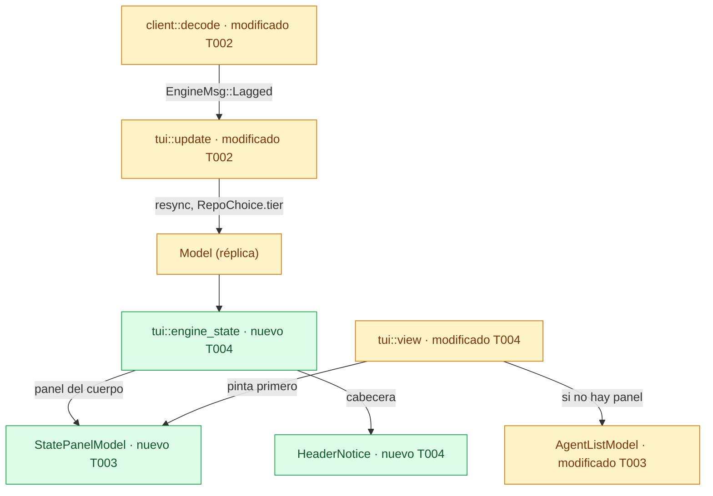
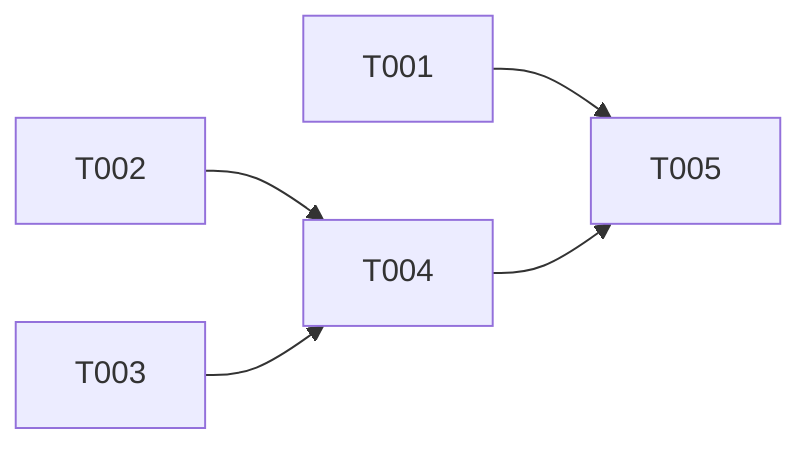

# DS-US-CKP-003 · La TUI dice en qué estado está el motor y qué hacer

## Contexto rápido

Al terminar, quien abre `raptor` ve en el cuerpo de la TUI un panel con qué pasa y qué hacer cuando el motor no arranca, cuando espera a Git o cuando no observa ningún repo. En la cabecera ve "reconciliando" o el motivo de un resync mientras duran. Cada fila dice "no disponible" si su carpeta falta y "no calculable" si la rama base no existe. Hoy esos estados solo se ven como una palabra en la cabecera ("motor esperando Git"), y el cuerpo dice "Esperando al motor…" o una guía sin la ruta. El motivo de un resync no se pinta nunca. Un repo que se está reconciliando se ve igual que uno en vivo.

**Glosario.**

| Término | Qué es aquí |
|---|---|
| Panel de estado | Widget nuevo `StatePanel` que ocupa la región de la lista: título y un mensaje "qué pasó → qué hacer" con su comando |
| Nivel (`tier`) | Cómo observa el motor un repo: `active`, `waking` (se pinta "reconciliando") o `dormant` (TS-GRP-006) |
| Cliente lento | El daemon vacía la cola de una conexión que no lee a tiempo, le manda `events.resync` y la cierra (`crates/core/src/channel/bus.rs:200-213`) |

Las decisiones están incorporadas en las reglas de cada tarea.

| # | Decisión | Validación | Alternativa descartada |
|---|---|---|---|
| D1 | Un widget neutro nuevo, `StatePanel` (título, mensaje "qué pasó → qué hacer" y tono info, aviso o error), para los estados que ocupan el cuerpo | Decisión del orquestador (2026-10-09), validada por Arquitecto y PO | `AgentListModel.empty`: una sola línea, sin título ni acción. `PolicyBanner` y el toast: significan "política" y "desaparece a los 5 s" |
| D2 | Precedencia del cuerpo: conexión sin motor (Motor no disponible, Incompatible, Rechazado, Sin canal) > Esperando Git > pregunta de US-CKP-025 o selector > Sin repos (en lugar de la flota) > flota. Con Esperando Git la TUI no pregunta "¿Observar este repo?". La prioridad Esperando Git > Sin repos la fija el motor (`EngineState::initial`, `crates/core/src/daemon/state.rs:42-48`): la TUI pinta `engine` tal cual y un test lo fija. Incompatible, Rechazado y Sin canal van en panel porque, como Motor no disponible, no se resuelven reconectando: la flota vieja se leería como actual (ADR-CKP-003 § 4). El test de `blocking_panel` recorre todas las variantes de `ConnState` | Decisión del orquestador (2026-10-09), validada por Arquitecto y PO, con ajuste: Incompatible y Rechazado (y Sin canal) también bloquean el cuerpo y el test cubre todo `ConnState` | Recalcular el estado en la TUI a partir de `repo_count` (BR-CKP-CALC-001). Para Incompatible y Rechazado, la flota marcada "desactualizado": no vuelve sola y el aviso en la cabecera se pierde |
| D3 | Esperando Git: "falta Git 2.38 o superior → instálalo o actualízalo; el motor empieza solo al detectarlo". La versión mínima es el literal `2.38` en la TUI, fijado por un test contra `gitraptor_git::resolve::MIN_VERSION`, hasta que US-GRP-014 la publique. La versión antigua encontrada no se muestra: el motor solo publica `git_version` con un Git válido (`crates/core/src/daemon/mod.rs:1284-1294`). Hoy el motor no reacciona a la aparición de Git (`Trigger::GitReady` no se dispara): "empieza solo" depende de US-GRP-014 | Decisión del orquestador (2026-10-09), validada por Arquitecto y PO, con ajuste: sin "reinicia el motor" (US-GRP-014, escenario 2), declarado como dependencia | Publicar la mínima en `EngineView` desde esta historia: cambia el contrato y es de US-GRP-014. Pedir que se reinicie el motor: contradice US-GRP-014 |
| D4 | Con `ConnState::EngineUnavailable` el panel sustituye a la flota también si hay datos viejos: "no se pudo arrancar → arráncalo con `raptor daemon`". La tecla de reintento está en las pistas | Decisión del orquestador (2026-10-09), validada por Arquitecto y PO | Dejar la flota vieja marcada "desactualizado": el motor no vuelve solo y la lista parece viva |
| D5 | El nivel del repo seleccionado se lee del ámbito global (`RepoSummaryView.tier` de la instantánea y el evento `repo.tier`). En la cabecera, `waking` sustituye "en vivo · motor …" por "⚠ reconciliando: datos provisionales" y `dormant` por "⚠ dormido: datos con retraso". Dormido significa que solo corren el centinela y las redes de seguridad, con barrido cada 120 s y fuera de NFR-04 (ADR-GRP-010, Enmienda 2026-10-07, N1 a N3). El cliente ya acepta `observation.tiers`, porque pide toda capacidad posterior al 9 (`crates/api/src/client/mod.rs:345-361`) | Decisión del orquestador (2026-10-09), validada por Arquitecto y PO, con ajuste: textos del PO | Leer `RepoView.tier` de la instantánea del repo: son dos ámbitos con secuencias distintas y un `waking` viejo podría quedarse pegado. Dejar `dormant` fuera: un despertar fallido deja el repo dormido con datos que parecen vivos (`crates/core/src/daemon/tiers.rs:360-369`) |
| D6 | El motivo del resync se guarda en la réplica y la cabecera lo pinta con `Text::Resync(reason)` hasta volver a En vivo, también durante la reconexión que sigue al cliente lento. Al llegar a En vivo se borra. El `events.resync` de la conexión se decodifica como `EngineMsg::Lagged`: hoy `decode` lo descarta (`apps/cli/src/client/mod.rs:694`). La sesión cortada por cliente lento termina en `End::Lagged`, que no pone a cero el intento: la k-ésima caída seguida espera `backoff(k)` y nunca reconecta al instante. Un hueco que detecta el propio cliente sigue diciendo "resincronizando", sin motivo | Decisión del orquestador (2026-10-09), validada por Arquitecto y PO, con ajuste: borrado al llegar a En vivo con test, y reconexión con backoff exponencial con test | Tratar el cliente lento como un resync del ámbito global: marca un solo ámbito y manda `Cmd::Resync` a un enlace que se está cerrando. Reconectar con el intento a cero tras cada caída: un cliente que no da abasto reconectaría cada 250 ms sin crecer |
| D7 | La fila de un worktree no disponible dice "no disponible: falta la carpeta" (o "no disponible: Git no confía en él", "no disponible: ilegible ahora"), con ⚠. Hoy no hay acciones por fila. Un test con `match` exhaustivo sobre `Action` no compila si alguien añade una acción sin clasificarla, y así obliga a la primera acción por fila (US-CKP-012) a desactivarse con motivo (BR-CKP-ELIG-006) | Decisión del orquestador (2026-10-09), validada por Arquitecto y PO, con ajuste: en inglés "unavailable: …" | Un mecanismo de "acción desactivada con motivo" sin ninguna acción que lo use |
| D8 | Rama base ausente: la celda ↑↓ dice "no calculable", nunca `–`, y el título del panel "Flota · ↑↓ no calculable: develop no encontrada", con el nombre publicado en `RepoView.base`. La columna ↑↓ crece de 12 a 15 columnas para que quepa, como ya crecen nombre y actividad (D2 de US-CKP-001) | Decisión del orquestador (2026-10-09), validada por Arquitecto y PO, con ajuste: nunca `–` en la celda | El texto entero en cada celda: en 80 columnas se come la rama |
| D9 | Quedan fuera la observación degradada y el hueco de observación de BR-CKP-WF-004, que no están en los escenarios. El motor solo publica la degradada como recuento en `engine.resources` (`crates/api/src/resources.rs:97-102`) y el hueco por fila es de US-CKP-002 | Decisión del orquestador (2026-10-09), validada por Arquitecto y PO | Pintar la degradada a partir de `engine.resources`: es un recuento del daemon, no un estado por worktree |

## 📋 Índice

> **Para aprobar:** [Contexto rápido](#contexto-rápido) · [⚠️ Gaps](#gaps-y-violaciones-de-la-constitución) · [🔭 La forma](#la-forma) · [El trabajo de un vistazo](#el-trabajo-de-un-vistazo).
> **Para implementar:** [🚀 Plan](#plan-de-implementación), en orden.

| Sección | Propósito |
|---------|-----------|
| [Contexto rápido](#contexto-rápido) | Qué se construye, por qué y las decisiones |
| [⚠️ Gaps y violaciones de la constitución](#gaps-y-violaciones-de-la-constitución) | Qué impide empezar |
| [🔭 La forma](#la-forma) | Qué piezas quedan y la precedencia |
| [🚀 Plan de implementación](#plan-de-implementación) | T001…T005 |
| [Estructura de ficheros](#estructura-de-ficheros) _(ref)_ | Árbol de archivos y rebanadas |
| [Contratos compartidos](#contratos-compartidos) _(ref)_ | Tipos, firmas y textos |
| [Contrato de API](#contrato-de-api) _(ref)_ | Lo que se consume del canal |
| [Estrategia de pruebas y cobertura](#estrategia-de-pruebas-y-cobertura) _(ref)_ | Pruebas |
| [Gate de seguridad](#gate-de-seguridad) | Fronteras y textos |
| [Fuera de alcance](#fuera-de-alcance) | Lo diferido y su dueño |
| [Notas del autor](#notas-del-autor) _(ref)_ | Lo que no bloquea |

---

## ⚠️ Gaps y violaciones de la constitución

_No gaps. Ready to implement._ Lo que el motor todavía no publica tiene dueño en [Fuera de alcance](#fuera-de-alcance), y la TUI muestra mientras tanto lo que dice cada decisión.

---

## 🔭 La forma

Quedan un panel de estado en la biblioteca, un módulo que decide qué panel o qué aviso toca, y dos datos más en la réplica: el motivo del resync y el nivel de cada repo.



🟩 nuevo · 🟨 modificado. `tui::engine_state` es el único sitio que decide la precedencia (D2): `view` solo pregunta.

**Qué ocupa el cuerpo** (la región de la lista), evaluado en este orden:

| # | Condición | Cuerpo |
|---|---|---|
| 1 | `model.conn` ∈ {`EngineUnavailable`, `Incompatible`, `Rejected`, `Unsupported`} | Panel de esa conexión (error) |
| 2 | `global.engine == EngineStateView::WaitingForGit` | Panel Esperando Git (aviso) |
| 3 | `observe_prompt(model)` existe (US-CKP-025) | La pregunta, como hoy |
| 4 | `picker(model)` existe | El selector, como hoy |
| 5 | `global.engine == EngineStateView::NoRepos` y `model.engine.repo` es `None` | Panel Sin repos (info) en el sitio de la flota. El repo descubierto (US-GRP-020) sigue debajo |
| 6 | Cualquier otro caso | La flota, como hoy |

---

## 🚀 Plan de implementación

> Orden topológico (`Depende:`). Rutas relativas a la raíz del repo.

### El trabajo de un vistazo

Tres frentes en paralelo (tests, estado y biblioteca), la vista que los junta y el cierre.

| # | Tarea | Depende | Aterriza en |
|---|---|---|---|
| T001 | Escribir en rojo los tests de proceso y del bucle | — | `apps/cli/tests` |
| T002 | Llevar el motivo del resync y el nivel del repo a la réplica | — | `apps/cli/src/{model,client/mod,present/ingest,tui/update}.rs` |
| T003 | Añadir el panel de estado y ensanchar la columna ↑↓ | — | `apps/cli/src/tui/widgets` |
| T004 | Pintar los estados en en/es, con snapshots | T002, T003 | `apps/cli/src/tui/{engine_state,view,mod}.rs`, `present/i18n.rs` |
| T005 | Cerrar la historia y la documentación | T001, T004 | `docs` |

### En qué orden



### T001 — Escribir en rojo los tests de proceso y del bucle

**Objetivo.** Los siete escenarios de la historia contra el `raptor` real (debug), con perfil, repos y Git temporales, y el cliente lento contra el daemon falso de `tui_loop`.

**Ubicación.**
- `apps/cli/tests/tui_engine_states.rs` (**CREATE**)
- `apps/cli/tests/tui_loop.rs` (**MODIFY**)

**Reglas**
- `tui_engine_states.rs` es solo de macOS (`#[cfg(all(target_os = "macos", debug_assertions))]`), como `tui_unobserved_repo.rs`. Copia su arnés de pty: `script -q /dev/null`, perfil temporal con `GITRAPTOR_PROFILE_DIR`, `PATH=/usr/bin:/bin` y un `Drop` que para el daemon arrancado bajo demanda (`running_pid`). Sin `sleep` fijos: se espera a un texto del pty con un plazo.
- Los textos que se buscan son los de [Textos del catálogo](#textos-del-catálogo), en inglés salvo que el caso diga es.
- Casos:
  - `without_a_daemon_the_tui_starts_it_and_goes_live`: perfil sin repos y sin daemon; `raptor` llega a "live" y `running_pid` da un PID. Ya pasa hoy: es la guarda de regresión del escenario 1.
  - `when_the_engine_cannot_start_the_tui_says_how_and_observes_nothing`: patrón `tui_probe_entry` de `live_fleet.rs`. El hijo es la `App` sin pantalla con `EngineConnector` y `Launcher::Installed(<carpeta temporal>/no-raptor)`, `PATH` = trampa de `git` y cwd = un repo temporal. El padre espera "Engine unavailable" y "`raptor daemon`", pasa `lsof` sobre el PID del hijo (nada del perfil abierto) y comprueba que la trampa no saltó y que la carpeta `data` del perfil sigue vacía.
  - `without_git_and_without_repos_it_waits_for_git_not_the_first_repo_guide`: `GITRAPTOR_TEST_GIT=<carpeta temporal>/no-git` en el entorno del pty (el daemon bajo demanda lo hereda, `crates/core/src/client.rs:314-330`); perfil sin repos. La pantalla tiene "Waiting for Git" y "2.38", y no tiene "raptor repo add". En es: "Esperando Git".
  - `without_repos_it_shows_how_to_add_the_first`: Git real, perfil sin repos, cwd fuera de todo repo. La pantalla tiene "raptor repo add <path>"; en es, "raptor repo add <ruta>".
  - `a_deleted_worktree_says_not_available_and_offers_no_action`: "shop" observado con `feat-x`; se borra la carpeta de `feat-x`; la fila dice "unavailable: folder missing".
  - `a_missing_base_branch_is_not_computable_and_no_other_is_used`: el repo de `base_branch.rs::a_missing_base_branch_is_reported_and_no_other_is_used` (ramas `trunk` y `feat`, `refs/remotes/origin/main` y una etiqueta `main`). Cada fila dice "not computable", el título "not computable: main not found", ninguna fila tiene un recuento ↑/↓ y el título no nombra `trunk` ni `origin`.
  - `no_action_targets_a_row`: `match` exhaustivo, sin comodín, sobre `gitraptor_cli::tui::keymap::Action`, con cada variante clasificada como global. El comentario dice que una acción por fila tiene que desactivarse con motivo en un worktree no disponible (BR-CKP-EDGE-003) antes de clasificarse aquí (D7).
- `tui_loop.rs`: `a_slow_consumer_resync_says_why_and_converges_on_the_new_snapshot`. Con `Harness::new(2)` en vivo se aplica `event_frame(1)`. El stream 0 manda `events.resync` con `SlowConsumer` y se cierra. Mientras no vuelve a "live", la pantalla tiene "the view fell behind the engine". Tras la reconexión, los worktrees de la réplica son los de `repo_snapshot()`, `event_frame(1)` aplica una vez y su repetición no (`applied == 1`), y `model.engine.resync` vuelve a `None`.
- `tui_loop.rs`: `a_slow_consumer_reconnects_with_a_growing_backoff`. Con `Harness::new(3)`, dos caídas seguidas por cliente lento. La primera reconexión no llega antes de `backoff(1)` desde el cierre del stream, y la cabecera pasa por `Reconnecting { attempt: 1 }` y luego por `Reconnecting { attempt: 2 }`. Se mide con `Instant` como cota inferior, sin `sleep`.
- `GITRAPTOR_TEST_GIT` apuntando a una ruta que no existe deja el motor en "Esperando Git" (`daemon_lifecycle.rs::declared_states_without_repos_or_without_git` lo hace con `no_git()`). ⚠️ **ASSUMPTION**: el daemon arranca igual con ese valor. Si no arranca, el test usa un `git` falso que imprime `git version 2.37.9`.

- **Depende:** —
- **Refs:** US-CKP-003, escenarios 1 a 7; D2, D3, D4, D6, D7, D8
- **Aceptación:** `cargo test -p gitraptor-cli --test tui_engine_states` y `cargo test -p gitraptor-cli --test tui_loop`

### T002 — Llevar el motivo del resync y el nivel del repo a la réplica

**Objetivo.** `update` sabe por qué se resincroniza y en qué nivel está cada repo, y no pregunta por el repo de la carpeta mientras el motor espera a Git.

**Ubicación.**
- `apps/cli/src/model.rs` (**MODIFY**)
- `apps/cli/src/client/mod.rs` (**MODIFY**)
- `apps/cli/src/present/ingest.rs` (**MODIFY**)
- `apps/cli/src/tui/update.rs` (**MODIFY**)

**Reglas**
- `decode`: `methods::NOTIFY_RESYNC` (`events.resync`, `ResyncNotification`) pasa a `EngineMsg::Lagged { reason }`. Lo demás sigue igual.
- `session` devuelve `End::Lagged` cuando el enlace se corta justo después de un `events.resync`. En `run`, `End::Lagged` no pone `attempt` a cero: la racha de caídas por cliente lento sigue sumando, así que la k-ésima seguida espera `backoff(k)`. Cualquier otro final de sesión pone la racha a cero, como hoy.
- `EngineMsg::Lagged { reason }`: `engine.resync = Some(reason)`, `engine.mark_all_stale()` y, si `conn == Live`, `conn = Resyncing`. No devuelve `Cmd`: el daemon cierra la conexión y la reconexión rehace todas las instantáneas.
- `on_resync`, salvo `ScopeClosed`: `engine.resync = Some(reason)` antes de `start_resync`. Un hueco (`Verdict::Gap`) no toca `engine.resync`.
- `engine.resync = None` al pasar a `Live`, tanto en `on_conn(State(Live))` como en `on_snapshot` (de `Resyncing` a `Live`).
- `ingest::global`: `RepoChoice.tier = r.tier`.
- `apply`, ámbito global: `REPO_TIER` (`RepoTierData`) pone `tier = Some(data.tier)` en el `RepoChoice` con ese `repo_id`. Si no hay ninguno, cuenta como aplicado y no cambia nada.
- `on_unobserved` con `global.engine == WaitingForGit` sigue por `on_unlocated` y no pregunta (D2).
- Tests unitarios en el módulo `tests` de `update.rs`, con el prefijo `engine_states_`:
  - `engine_states_a_slow_consumer_keeps_its_reason_until_live`;
  - `engine_states_a_daemon_resync_keeps_its_reason`;
  - `engine_states_a_gap_has_no_reason`;
  - `engine_states_the_tier_follows_the_global_stream`;
  - `engine_states_waiting_for_git_never_asks_to_observe`.

- **Depende:** —
- **Refs:** D2, D5, D6; escenarios 3 y 5
- **Aceptación:** `cargo test -p gitraptor-cli --lib tui::update::tests::engine_states`

### T003 — Añadir el panel de estado y ensanchar la columna ↑↓

**Objetivo.** El widget `StatePanel` en la biblioteca, y una columna ↑↓ que crece hasta el texto más ancho de todas las filas.

**Ubicación.**
- `apps/cli/src/tui/widgets/state_panel.rs` (**CREATE**)
- `apps/cli/src/tui/widgets/mod.rs` (**MODIFY**)
- `apps/cli/src/tui/widgets/agent_list.rs` (**MODIFY**)
- `apps/cli/src/tui/widgets/snapshots/` (**CREATE**) `state_panel__{info,warning,error}.snap` y `agentlist__sync_not_computable.snap`

**Reglas**
- `StatePanelModel` implementa `Component`. Se pinta con `panel(...)` de `tui::style` (borde con foco, símbolo y título) y un `paragraph` con `message` en `text.default`.
- Tono a tokens, sin literales: `Info` → `SymbolToken::Info` y `ColorToken::StatusInfo`; `Warning` → `SymbolToken::Warning` y `ColorToken::StatusWarning`; `Error` → `SymbolToken::Error` y `ColorToken::StatusDanger`. Sin color, el símbolo y el título bastan para leerlo.
- Un texto que no cabe se parte en líneas (`paragraph`) y, si se acaba el alto, se corta con el `…` del juego de glifos.
- `agent_list.rs`: `const SYNC_MAX: u16 = 15`. El ancho que se busca pasa a incluir el texto ↑↓ más ancho de todas las filas (`Sync::Unknown` por su texto y `Sync::Known` por `↑a ↓b`). La columna crece de `SYNC` a `SYNC_MAX` solo si la rama conserva `BRANCH_MIN`. Si no cabe, queda en `SYNC`. Los snapshots `fleet_*` que ya existen no cambian.
- Snapshots en Unicode y ASCII, como los del resto de la biblioteca (`widgets/tests.rs`).

- **Depende:** —
- **Refs:** D1, D8; DSYS-GRP-001 § 3 y § 6
- **Aceptación:** `cargo test -p gitraptor-cli --lib tui::widgets`

### T004 — Pintar los estados en en/es, con snapshots

**Objetivo.** El cuerpo y la cabecera dicen el estado del motor y de la conexión con la acción que lo resuelve. Las filas dicen "no disponible" y "no calculable".

**Ubicación.**
- `apps/cli/src/tui/engine_state.rs` (**CREATE**)
- `apps/cli/src/tui/mod.rs` (**MODIFY**)
- `apps/cli/src/tui/view.rs` (**MODIFY**)
- `apps/cli/src/present/i18n.rs` (**MODIFY**)
- `apps/cli/src/tui/snapshots/` (**CREATE**) `engine_state_{engine_unavailable,waiting_for_git,no_repos,reconciling,resync}_80x24_{en,es}.snap` y `engine_state_base_not_found_120x40_{en,es}.snap`

**Reglas**
- `engine_state.rs` contiene las firmas de [Firmas del stack](#firmas-del-stack) y aplica la tabla de [La forma](#la-forma). Su módulo `tests` va al final del archivo, con ese nombre: `tests/tui_boundaries.rs` solo ignora un `#[cfg(test)] mod tests` final, y el test de la versión mínima importa `gitraptor_git`.
- `view()`: `blocking_panel` antes de `observe_prompt`; `fleet_panel` en lugar del widget de la flota (el repo descubierto sigue debajo, como hoy).
- `status_bar()` con `header_notice`:
  - `Resync(reason)`: la etiqueta es `Text::Conn(conn)` y, si hay motivo, el separador y `Text::Resync(reason)`. `Connection::Reconnecting`.
  - `Reconciling` y `Dormant`: su texto sustituye a "en vivo · motor …". `Connection::Reconnecting`, para el ⚠ en tono de aviso.
  - "desactualizado" y el aviso de la última tecla se añaden detrás, como hoy.
- `fleet()`: si alguna fila tiene `DivergenceView::BaseMissing` y `repo.base` es `Some`, el título es `Text::FleetTitleBaseNotFound { base }`.
- La tecla de reintento (`Action::Retry`) se ve en las pistas, como hoy. El mensaje del panel no la repite.
- `i18n.rs`: las variantes nuevas van en un bloque propio de esta historia, al final del `enum Text` y de cada `match`, abierto con el comentario `// Engine and connection states` (sin id de historia en el código). Cambian los textos de `Text::BaseMissing` y `Text::WorktreeUnavailable`. Los textos exactos son los de [Textos del catálogo](#textos-del-catálogo). `every_connection_state_has_both_languages` se amplía a los textos nuevos.
- Se actualizan los tests de `view.rs` que buscan "folder missing" o "base absent".
- Tests en `engine_state.rs`:
  - `the_body_follows_the_precedence` (las seis filas de la tabla, incluido "Esperando Git con 0 repos no muestra la guía de primer repo");
  - `blocking_panel_covers_every_connection_state`: una tabla con todas las variantes de `ConnState` (`Connecting`, `Starting`, `Syncing`, `Live`, `Resyncing`, `Reconnecting`, `EngineUnavailable`, `Incompatible`, `Rejected`, `Unsupported`) y el panel que da cada una (ninguno para las seis primeras), con un `match` exhaustivo para que una variante nueva no compile sin fila;
  - `the_header_says_reconciling_dormant_or_why_it_resyncs`;
  - `the_minimum_git_is_the_one_the_engine_requires` (`MIN_GIT` contra `MIN_VERSION`, `patch == 0`);
  - `a_missing_base_names_the_published_base_and_never_counts` (base `develop`, en y es);
  - `an_unavailable_worktree_says_not_available`;
  - los snapshots de la ubicación, con `set_prepend_module_to_snapshot(false)` como en `view.rs`.

- **Depende:** T002, T003
- **Refs:** D1–D8; escenarios 2 a 7; DSYS-GRP-001 § 5
- **Aceptación:** `cargo test -p gitraptor-cli --lib tui::engine_state`

### T005 — Cerrar la historia y la documentación

**Objetivo.** La historia queda implementada (macOS) y enlaza esta Dev Spec; el backlog y el estado de la release lo reflejan.

**Ubicación.**
- `docs/requirements/features/cockpit/user-stories/US-CKP-003-estados-motor-conexion.md` (**MODIFY**)
- `docs/requirements/features/cockpit/user-stories.md` (**MODIFY**)
- `docs/requirements/features/cockpit/dev-specs/US-CKP-003-estados-motor-conexion.md` (**MODIFY**)
- `docs/requirements/release-status.md` (**MODIFY**)

**Reglas**
- Historia: `status: implemented` y la sección "Estado de la implementación" con el PR, lo diferido de [Fuera de alcance](#fuera-de-alcance) y "Linux y Windows: *Pendiente: etapa de validación multiplataforma*".
- `user-stories.md`: la fila de US-CKP-003 pasa a `implemented ([DS](./dev-specs/US-CKP-003-estados-motor-conexion.md))`.
- Esta Dev Spec: `status: implemented` y su "Estado de la implementación".
- `release-status.md` no se edita a mano: se regenera con `node tools/status/release-status.mjs`.

- **Depende:** T001, T004
- **Refs:** D9
- **Aceptación:** `cargo fmt --all --check`, `cargo clippy --workspace --all-targets -- -D warnings` y `cargo test -p gitraptor-cli` en verde

---

> Las secciones siguientes son de referencia.

## Estructura de ficheros

```text
apps/cli/
├── src/
│   ├── model.rs                         ← MODIFY  EngineReplica.resync, RepoChoice.tier, EngineMsg::Lagged     (T002)
│   ├── client/mod.rs                    ← MODIFY  decode: events.resync → Lagged                               (T002)
│   ├── present/
│   │   ├── ingest.rs                    ← MODIFY  RepoChoice.tier                                              (T002)
│   │   └── i18n.rs                      ← MODIFY  bloque de textos nuevos; BaseMissing, WorktreeUnavailable    (T004)
│   └── tui/
│       ├── update.rs                    ← MODIFY  Lagged, motivo del resync, repo.tier, WaitingForGit           (T002)
│       ├── engine_state.rs              ← CREATE  precedencia, paneles, aviso de cabecera, MIN_GIT              (T004)
│       ├── mod.rs                       ← MODIFY  pub mod engine_state                                          (T004)
│       ├── view.rs                      ← MODIFY  paneles, cabecera, título con base ausente                   (T004)
│       ├── snapshots/                   ← CREATE  engine_state_*                                               (T004)
│       └── widgets/
│           ├── state_panel.rs           ← CREATE  StatePanel                                                   (T003)
│           ├── mod.rs                   ← MODIFY  pub mod state_panel                                          (T003)
│           ├── agent_list.rs            ← MODIFY  SYNC_MAX                                                     (T003)
│           └── snapshots/               ← CREATE  state_panel__*, agentlist__sync_not_computable               (T003)
└── tests/
    ├── tui_engine_states.rs             ← CREATE  escenarios 1–4, 6, 7 y el test de acciones                   (T001)
    └── tui_loop.rs                      ← MODIFY  cliente lento                                                (T001)
```

**Rebanadas disjuntas** (un experto por rebanada; ningún archivo está en dos):

| Rebanada | Tareas | Archivos | Puede correr en paralelo con |
|---|---|---|---|
| A · tests | T001 | `tests/tui_engine_states.rs`, `tests/tui_loop.rs` | B, C, D |
| B · réplica | T002 | `model.rs`, `client/mod.rs`, `present/ingest.rs`, `tui/update.rs` | A, C |
| C · biblioteca | T003 | `tui/widgets/{state_panel,mod,agent_list}.rs`, `tui/widgets/snapshots/` | A, B |
| D · vista | T004 | `tui/{engine_state,mod,view}.rs`, `present/i18n.rs`, `tui/snapshots/` | A (empieza cuando B y C están en la rama) |
| E · cierre | T005 | `docs/…` | — |

---

## Contratos compartidos

### Tipos y datos compartidos

```rust
// apps/cli/src/model.rs
pub struct EngineReplica {
    /* … */
    /// Why the running resync started, as the engine said it; `None` for a gap the client
    /// found, or when nothing is being resynced. Cleared on reaching `Live`.
    pub resync: Option<ResyncReason>,
}
pub struct RepoChoice {
    /* repo_id, name, path */
    /// The repo's observation tier (`observation.tiers`); `None` while not published.
    pub tier: Option<RepoTier>,
}
pub enum EngineMsg {
    /* … */
    /// The daemon dropped this connection for reading too slowly (`events.resync`); it
    /// closes it right after.
    Lagged { reason: ResyncReason },
}

// apps/cli/src/tui/widgets/state_panel.rs
#[derive(Debug, Clone, Copy, PartialEq, Eq)]
pub enum PanelTone { Info, Warning, Error }
#[derive(Debug, Clone, PartialEq, Eq)]
pub struct StatePanelModel {
    pub tone: PanelTone,
    pub title: SafeText,
    /// "What happened → what to do", with the command, as one catalog sentence.
    pub message: SafeText,
}

// apps/cli/src/tui/engine_state.rs
#[derive(Debug, Clone, Copy, PartialEq, Eq)]
pub enum HeaderNotice {
    Resync(Option<ResyncReason>),
    Reconciling,
    Dormant,
}
```

### Ciclos de vida (DI)

_No aplica — TEA sin estado ambiental: `view` y `engine_state` son funciones puras sobre el `Model`._

### Firmas del stack

```rust
// apps/cli/src/tui/engine_state.rs
/// Minimum Git the engine requires (BR-WF-002), pinned by a test to `gitraptor_git`.
pub const MIN_GIT: &str = "2.38";
/// A connection without an engine, or waiting for Git: replaces everything in the body (rows 1–2).
pub fn blocking_panel(model: &Model) -> Option<StatePanelModel>;
/// No repos: replaces the fleet widget only (row 5).
pub fn fleet_panel(model: &Model) -> Option<StatePanelModel>;
/// Resync while it lasts; otherwise, with `Live`, the selected repo's tier.
pub fn header_notice(model: &Model) -> Option<HeaderNotice>;
/// The published base when some row's divergence is `BaseMissing`.
pub fn base_not_found(repo: &RepoView) -> Option<&SafeText>;

// apps/cli/src/client/mod.rs (decode)
methods::NOTIFY_RESYNC => EngineMsg::Lagged { reason: n.reason }  // n: ResyncNotification
```

`header_notice`:

| Condición | Resultado |
|---|---|
| `conn == Resyncing` | `Resync(engine.resync)` |
| `conn ∈ {Connecting, Reconnecting, Syncing}` y `engine.resync.is_some()` | `Resync(engine.resync)` |
| `conn == Live` y el `RepoChoice` del repo seleccionado con `tier == Some(Waking)` | `Reconciling` |
| `conn == Live` y `tier == Some(Dormant)` | `Dormant` |
| Cualquier otro caso | `None` |

### Textos del catálogo

Variantes nuevas de `Text` (bloque `// Engine and connection states`) y textos que cambian. Los comandos van entre comillas invertidas, como en los textos que ya existen.

| Variante | en | es |
|---|---|---|
| `EngineUnavailableTitle` | Engine unavailable | Motor no disponible |
| `EngineUnavailableMessage` | It could not start → start it with \`raptor daemon\`, or at every login with \`raptor daemon enable\`. | No se pudo arrancar → arráncalo con \`raptor daemon\`, o en cada inicio de sesión con \`raptor daemon enable\`. |
| `IncompatibleTitle` | Incompatible engine | Motor incompatible |
| `IncompatibleMessage` | This raptor and the running engine are on incompatible versions → update both to the same version. | Este raptor y el motor en marcha tienen versiones incompatibles → actualiza los dos a la misma versión. |
| `RejectedTitle` | Engine channel refused | El motor rechazó el canal |
| `RejectedMessage` | The GitRaptor runtime folder is not private → check that only your user can open it. | La carpeta de ejecución de GitRaptor no es privada → comprueba que solo tu usuario puede abrirla. |
| `UnsupportedTitle` | No engine channel | Sin canal con el motor |
| `UnsupportedMessage` | This platform has no engine channel yet → use \`raptor status\`. | Esta plataforma aún no tiene canal con el motor → usa \`raptor status\`. |
| `WaitingForGitTitle` | Waiting for Git | Esperando Git |
| `WaitingForGitMessage { min }` | Git {min} or later not found → install or update it; the engine starts on its own once it finds it. | Falta Git {min} o superior → instálalo o actualízalo; el motor empieza solo al detectarlo. |
| `NoReposTitle` | No repos observed | Sin repos observados |
| `NoReposMessage` | Add the first one → \`raptor repo add <path>\` | Añade el primero → \`raptor repo add <ruta>\` |
| `Reconciling` | reconciling: provisional data | reconciliando: datos provisionales |
| `Dormant` | asleep: data may lag | dormido: datos con retraso |
| `FleetTitleBaseNotFound { base }` | Fleet · ↑↓ not computable: {base} not found | Flota · ↑↓ no calculable: {base} no encontrada |
| `BaseMissing` (cambia) | not computable | no calculable |
| `WorktreeUnavailable(Missing)` (cambia) | unavailable: folder missing | no disponible: falta la carpeta |
| `WorktreeUnavailable(Untrusted)` (cambia) | "unavailable: " + el texto actual | "no disponible: " + el texto actual |
| `WorktreeUnavailable(Unreadable)` (cambia) | unavailable: unreadable now | no disponible: ilegible ahora |

Los textos de PO para el título y el mensaje se leen juntos: "Motor no disponible: no se pudo arrancar → arráncalo con `raptor daemon`". Los de Incompatible, Rechazado y Sin canal siguen el mismo formato. **Decisión del orquestador (2026-10-09), validada por PO, con ajuste**: Incompatible nombra las versiones y pide actualizar los dos; el título de Rechazado dice quién rechaza. La acción de Sin canal (`raptor status`) funciona sin canal, porque sin motor lee el perfil del disco (`apps/cli/src/commands/status.rs:95-103`).

`Text::Resync(reason)` y `Text::Conn(Resyncing)` no cambian: se pintan por primera vez.

---

## Contrato de API

_Sin métodos, eventos ni capacidades nuevos._ La TUI consume lo que el daemon ya publica:

| Del canal | Dónde lo publica el motor | Qué hace la TUI |
|---|---|---|
| `GlobalSnapshot.engine.state` y el evento `engine.state` | Estado inicial (`EngineState::initial`) y transiciones `FirstRepoAdded`/`LastRepoRetired` (`crates/core/src/daemon/repos.rs:138,305`) | Paneles Esperando Git y Sin repos |
| `RepoSummaryView.tier` y el evento `repo.tier` (ámbito global, capacidad `observation.tiers`) | `crates/core/src/daemon/tiers.rs:333,347,368` | Aviso de la cabecera |
| `events.resync` con `slow-consumer` (de la conexión) | `crates/core/src/channel/bus.rs:200-213` | `EngineMsg::Lagged` |
| `scope.resync` con su motivo | Canal (TS-GRP-004) | Motivo en la cabecera, como hoy rehace la instantánea |
| `DivergenceView::BaseMissing` y `BaseBranchView.name` | US-GRP-012 | "no calculable" y el título con la base |
| `WorktreeStatus::Unavailable { reason }` | US-GRP-001 | "no disponible: …" |

### Forma del error y del cuerpo de respuesta

| Estado | Dónde se ve | Tono | Acción que se ofrece |
|---|---|---|---|
| Motor no disponible | Panel (cuerpo entero) y cabecera | Error | `raptor daemon`, `raptor daemon enable`; `r` en las pistas |
| Incompatible, Rechazado, Sin canal | Panel (cuerpo entero) y cabecera | Error | Actualizar raptor, revisar la carpeta, `raptor status` |
| Esperando Git | Panel (cuerpo entero) y cabecera | Aviso | Instalar o actualizar Git; el motor empieza solo (US-GRP-014) |
| Sin repos | Panel en el sitio de la flota | Info | `raptor repo add <ruta>` |
| Reconciliando | Cabecera | Aviso | — (dura lo que el motor tarde) |
| Dormido | Cabecera | Aviso | — |
| Resync | Cabecera, con el motivo | Aviso | — (la TUI rehace la instantánea sola) |
| Worktree no disponible | Fila, con ⚠ | Aviso | Ninguna (D7) |
| Base ausente | Celda ↑↓ ("no calculable", nunca `–`) y título de la flota | Atenuado | — |

### Valores numéricos

| Valor | Cifra | Fuente |
|---|---|---|
| Versión mínima de Git | 2.38 | NFR-07, `gitraptor_git::resolve::MIN_VERSION` |
| Columna ↑↓ | de 12 (`SYNC`) a 15 (`SYNC_MAX`) columnas | D8 |
| Tamaños de los snapshots | 80×24 y 120×40 | DSYS-GRP-001 (Enmienda 2026-10-04) |

La TUI no añade temporizadores: cada aviso dura lo que dura el estado publicado.

---

## Estrategia de pruebas y cobertura

### 9.1 Pirámide de pruebas

| Tipo | Cantidad | Tareas dueñas | Herramientas | Cuándo |
|------|---------:|-------------|---------|------|
| Unit | ~12 | T002, T004 | `cargo test`, `TestBackend` | PR gate |
| Snapshot | ~16 | T003, T004 | `insta` | PR gate |
| Bucle con daemon falso | 1 | T001 | `tui_loop` | PR gate |
| E2E (pty o proceso hijo, daemon real) | 7 | T001 | `script` y `lsof` de macOS | PR gate (macOS) |

### 9.2 Umbrales de cobertura

| Capa | Línea | Rama | Mutación | Camino crítico 100% |
|-------|-----:|-------:|---------:|:------------------:|
| `tui::engine_state` | — | — | — | ✅ las seis filas de la precedencia y las cuatro de la cabecera |

### 9.3 Datos de prueba

- Perfil temporal por test (`gitraptor_testkit::Fixture`) y repos temporales (NFR-01). El daemon arrancado bajo demanda se para en el `Drop`.
- Sin Git: `GITRAPTOR_TEST_GIT` a una ruta inexistente (solo en debug, SEC-06).
- Base ausente: el repo de `tests/base_branch.rs` (sin rama `main`, con `origin/main` y la etiqueta `main` como trampas).

### 9.4 Comportamientos críticos verificados

- [ ] Sin daemon, la TUI lo arranca y llega a "en vivo" (T001)
- [ ] Sin poder arrancarlo, "Motor no disponible" con cómo arrancarlo, y el proceso de la TUI no lanza Git ni abre el perfil (T001, T004)
- [ ] Esperando Git gana a Sin repos y nunca pregunta por el repo de la carpeta (T001, T002, T004)
- [ ] Sin repos, la guía con `raptor repo add <ruta>` (T001, T004)
- [ ] Reconciliando, dormido y el motivo del resync en la cabecera mientras duran (T002, T004)
- [ ] Tras el resync por cliente lento la lista es la de la instantánea nueva, sin eventos perdidos ni duplicados (T001)
- [ ] Worktree borrado: "no disponible" y ninguna acción (T001, T004)
- [ ] Base ausente: "no calculable" con el nombre publicado y ningún recuento contra otra rama (T001, T004)

---

## Gate de seguridad

- **Fronteras (ADR-CKP-003 § 5, V5):** `engine_state.rs` y `state_panel.rs` no importan `gitraptor_core`, `gitraptor_git` ni `gitraptor_policy` fuera del `mod tests` final (`tests/tui_boundaries.rs`). Sin motor, la TUI no observa nada por su cuenta: lo comprueba el test de la trampa de `git` y `lsof` (T001).
- **Textos no confiables (SEC-12):** el nombre de la base y del repo llegan como `SafeText`, saneados en la ingesta. Ningún texto del daemon se pinta tal cual.
- **Sin procesos nuevos:** la TUI no lanza nada para estos estados. El arranque del daemon sigue en el `Launch` inyectado (ADR-CKP-003, Enmienda 2026-10-08).
- **Variables de prueba:** `GITRAPTOR_TEST_GIT` y `GITRAPTOR_PROFILE_DIR` solo existen en debug (SEC-06).

Revisión de `security-expert`: no hace falta. No hay `unsafe`, FFI, procesos, sockets ni rutas nuevos.

---

## Fuera de alcance

| Ítem / no-objetivo | Historia que lo cubre | Gate (cómo se verifica) |
|----------------|--------------------|-------------------------|
| La versión antigua encontrada ("se encontró 2.34") y la mínima como dato publicado | US-GRP-014 | `EngineView` no tiene campo para la versión rechazada (`crates/api/src/messages.rs:127-132`) |
| Empezar a observar solo cuando aparece Git, que el texto de Esperando Git ya promete (D3) | US-GRP-014 | `Trigger::GitReady` no se dispara en `crates/core/src/daemon` |
| Observación degradada por worktree (aviso y guía) | Historia del motor que la publique por worktree (propuesta: US-GRP-003) | No hay estado degradado en `WorktreeView` ni en `GlobalSnapshot` |
| Hueco de observación destacado en la fila y en la lista de atención | US-CKP-002 (con US-GRP-005) | `last_activity_in_gap` no se pinta |
| Acciones de fila desactivadas con motivo en un worktree no disponible | US-CKP-012, la primera acción por fila | El test `no_action_targets_a_row` deja de compilar |
| El nivel de cada repo en el selector | US-CKP-025 (pendiente "Niveles en la TUI") | `RepoPickerModel` no pinta `tier` |

---

## Notas del autor

| ID | Nota | Acción | Owner |
|----|------|--------|-------|
| G1 | `present/i18n.rs` y `tui/view.rs` también los tocan US-CKP-002 y US-CKP-005. El bloque único de textos al final del `enum` y de cada `match` reduce los conflictos a un rebase local | Integrar en orden y rebasar | Orquestador |
| G2 | Dependencia: el texto de Esperando Git promete que el motor empieza solo (D3, decisión del PO), pero hoy `Trigger::GitReady` no se dispara. Hasta US-GRP-014, quien instala Git tiene que reiniciar el motor (`raptor daemon stop`) para que lo detecte | Implementar la detección | US-GRP-014 |
| G6 | Orden de implementación de las tres historias de la TUI: US-CKP-005 → US-CKP-003 → US-CKP-002, en serie, porque las tres tocan `present/i18n.rs` y `tui/view.rs` | Respetar el orden al lanzar los PR | Orquestador |
| G3 | Solo se verifica en macOS (`script`, `lsof`). La lógica de `engine_state` es pura y corre en los tres sistemas. Linux y Windows siguen XP-21 | Etapa de validación multiplataforma | Rene |
| G4 | "Reconciliando" no tiene test de proceso: provocar un despertar en un test necesita dormir un repo. Lo cubren los unitarios de `update` y `engine_state`, y la publicación de `repo.tier` está probada en `crates/core` | Ninguna | — |
| G5 | Pista del explorador que resultó falsa: el resync por cliente lento no llega a `update.rs::on_resync`. Llega como `events.resync` de la conexión y `decode` lo descarta (D6) | Corregido en T002 | — |
