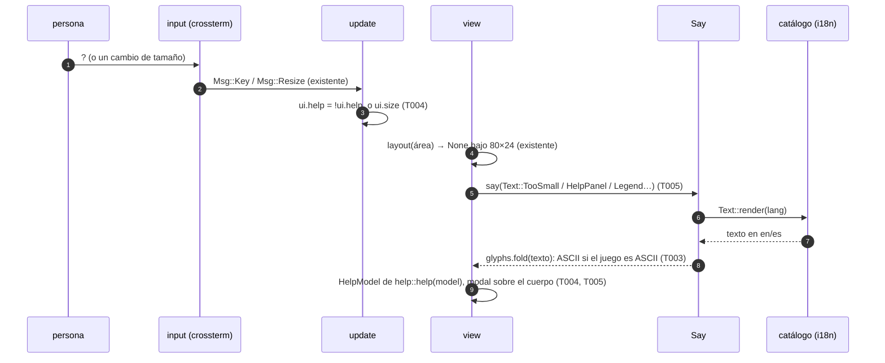
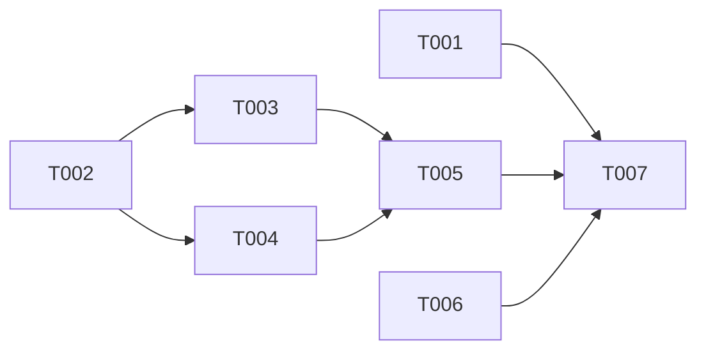

# DS-US-CKP-005 · La TUI en una terminal pequeña, sin color, en ASCII, en tu idioma y con ayuda de teclado

## Contexto rápido

Al terminar, el desarrollador usa la TUI en una terminal de 80×24, sin color o en ASCII, en inglés o en español, y con `?` ve las teclas del panel en el que está. Hoy casi todo existe, pero falta lo que la historia promete: el aviso de tamaño mínimo no dice qué hacer, en ASCII se cuelan glifos Unicode del catálogo (`·`, `↑↓`, `…`, `×`) y de las teclas (`↑`, `↓`, US-CKP-001 § 7), la ayuda `?` está construida (`HelpModel`, `key_hints.rs:138`) pero no cableada, y ningún test recorre la pantalla entera sin color, en ASCII o en los dos idiomas.

Esta entrega no crea widgets ni toca el motor. Concreta cuatro piezas y las prueba:

- el texto del aviso de tamaño mínimo y su prueba de "ampliar sin reiniciar";
- el plegado a ASCII de todo texto del catálogo que pinta la vista, con un único punto de paso (`Say`);
- la ayuda `?` filtrada por el panel actual, con una leyenda de símbolos, y la leyenda de los estados en pantalla en la barra de teclas cuando cabe;
- las pruebas del reparto del espacio, de la pantalla sin color y en ASCII, y del idioma.

| Término | Qué es aquí |
|---|---|
| Plegar a ASCII | Sustituir en un texto ya traducido cada glifo no ASCII por su respaldo del juego ASCII (`·` → `\|`, `…` → `...`). Las letras del idioma (`á`, `ñ`) y `¿` `¡` no se pliegan |
| Panel actual | Lo que recibe las teclas: la flota, el selector de repos (`Pick::Choosing`) o una pregunta (`Pick::Asking` o el repo descubierto) |
| `Say` | El contexto de traducción de la vista: idioma y juego de glifos. Es el único sitio de `view.rs` que llama a `Text::render` |
| Leyenda | Cada símbolo de estado con su significado en texto. Está en dos sitios: el grupo "Símbolos" de la ayuda (todos) y el final de la barra de teclas (solo los estados que hay en pantalla, si caben enteros) |

Cada decisión es una **Decisión del orquestador (2026-10-09), validada por Arquitecto y PO**; la columna "Validación" dice si hubo ajuste. Están incorporadas en las reglas de cada tarea:

| ID | Decisión | Alternativa descartada | Validación |
|---|---|---|---|
| D1 | Aviso de tamaño mínimo: se conserva el tamaño actual y se añade la acción con el texto literal de la historia. es: "Terminal demasiado pequeña (70×20). Amplía la terminal a 80×24 como mínimo."; en: "Terminal too small (70×20). Resize it to at least 80×24." El mínimo llega al catálogo desde `layout::MIN_WIDTH`/`MIN_HEIGHT`, sin literal `80×24` | Solo el texto de la historia: pierde "qué pasó" (el tamaño actual dice cuánto falta) | Decisión del orquestador (2026-10-09), validada por Arquitecto y PO, con ajuste: el texto en inglés es "Resize it to at least 80×24." |
| D2 | El reparto por prioridad no cambia: ya cumple ADR-CKP-003 § 7 (lista > alertas > grafo > detalle; el grafo colapsa primero y el detalle pasa a pantalla completa bajo demanda por debajo de 120 columnas). Se prueba a nivel de `layout()` con un `BodyPlan` completo en 80×24, 100×30 y 120×40 y en todos los tamaños de 80×24 a 200×60. El cableado real de alertas y grafo en la vista es de US-CKP-008 y US-CKP-022 | Cablear ya alertas y grafo con datos de prueba: la vista pintaría datos que el motor no publica (BR-CKP-CALC-001) | Decisión del orquestador (2026-10-09), validada por Arquitecto y PO |
| D3 | ASCII: la vista pliega a ASCII todo texto del catálogo con `Glyphs::fold`, cuya tabla deriva del juego ASCII estructural (`·` → separador, `↑`/`↓` → ahead/behind, `…` → elipsis, `–`/`—` → "no disponible", `×` → `x`, `→` → `->`). Las teclas `↑`/`↓` se etiquetan `Up`/`Down` en ASCII, y la barra muestra entonces la tecla alternativa de la tabla (`k`, `j`) | Parametrizar el catálogo por juego de símbolos: toca unos 40 brazos de `en()`/`es()` en `i18n.rs`, el mismo archivo que US-CKP-002 y US-CKP-003 amplían | Decisión del orquestador (2026-10-09), validada por Arquitecto y PO |
| D4 | Escenario 3: cada estado se distingue por su símbolo (`●`/`◐`/`○`/`⚠`, ASCII `*`/`~`/`o`/`[!]`), y su significado se explica en texto en dos sitios: el grupo "Símbolos" de la ayuda `?` y una leyenda de estados en las KeyHints cuando cabe (patrón F4 de DS-US-CKP-001 § 7, ampliado a los estados que hay en pantalla). Un test garantiza que los respaldos ASCII de los estados son distintos entre sí | Una columna con la palabra del estado en cada fila: cuesta unas 9 columnas en 80×24 y compite con la rama | Decisión del orquestador (2026-10-09), validada por Arquitecto y PO, con ajuste (PO): el grupo "Símbolos" no basta solo; se añaden la leyenda en las KeyHints y el test de respaldos distintos, y el escenario 3 de la historia pasa a "explicado en la ayuda" |
| D5 | Ayuda `?`: `?` abre y cierra, Esc cierra. Es un panel modal sobre el cuerpo y la cabecera y la barra siguen visibles. Tiene tres grupos: el panel actual, "Siempre" (`q`, `r`, `Ctrl-Z`, `?`) y "Símbolos". El hueco fijo de la derecha de la barra pasa de `q salir` a `? ayuda`, y `q salir` entra en la barra como primera pista | Añadir `?` como una pista más: en una terminal estrecha la barra la cortaría, y es la puerta a todo lo demás | Decisión del orquestador (2026-10-09), validada por Arquitecto y PO |
| D6 | En ASCII se pliegan glifos, no letras: un texto en español conserva `á`, `ñ`, `¿` y `¡`. El juego ASCII existe para fuentes y terminales sin glifos de dibujo y símbolos, y transliterar degradaría el idioma | Transliterar a ASCII estricto ("Amplia la terminal") | Decisión del orquestador (2026-10-09), validada por Arquitecto y PO |
| D7 | `—` en `RequesterUnknown` y `Engine(None)` pasa a `–`, que es el glifo de "no disponible" del design system ("No disponible no es cero") | Mantener la raya: dos glifos distintos para el mismo significado | Decisión del orquestador (2026-10-09), validada por Arquitecto y PO |
| D8 | `--plain` queda fuera de esta historia: no está en sus criterios. El PO propone una US nueva para él (ver [Fuera de alcance](#fuera-de-alcance)) | Construirlo aquí sin escenario que lo pida | Decisión del orquestador (2026-10-09), validada por Arquitecto y PO |
| D9 | Escenario 4 en Windows: allí "el idioma del sistema" es el de la interfaz del usuario, no `LANG`, y `--lang` es un rodeo. Esta entrega se mezcla con el escenario 4 de Windows en "Pendiente: etapa de validación multiplataforma" y la historia queda `partially-implemented` hasta leer ese idioma (G1) | Dar el escenario por cumplido en Windows con `--lang` | Decisión del orquestador (2026-10-09), validada por Arquitecto y PO, con ajuste (PO): el pendiente tiene como dueño esta historia |
| D10 | Orden de implementación en serie: US-CKP-005 → US-CKP-003 → US-CKP-002. Esta va primero porque fija `Say`, `Glyphs::fold` y la barra, que las otras dos usan. Las variantes nuevas de `i18n.rs` van en un bloque propio, con un comentario que nombra la historia | Implementar las tres en paralelo y resolver los conflictos de `view.rs` e `i18n.rs` al rebasar | Decisión del orquestador (2026-10-09), validada por Arquitecto y PO (la propuso el Arquitecto) |

## 📋 Índice

> **Para aprobar:** [Contexto rápido](#contexto-rápido) · [⚠️ Gaps](#gaps-y-violaciones-de-la-constitución) · [🔭 La forma](#la-forma) · [El trabajo de un vistazo](#el-trabajo-de-un-vistazo).
> **Para implementar:** [🚀 Plan](#plan-de-implementación), en orden. Las secciones `_(ref)_` se abren desde la tarea que las cita.

| Sección | Propósito |
|---------|-----------|
| [Contexto rápido](#contexto-rápido) | Qué se construye, por qué y las decisiones |
| [⚠️ Gaps y violaciones de la constitución](#gaps-y-violaciones-de-la-constitución) | Qué impide empezar |
| [🔭 La forma](#la-forma) | Cómo fluye una tecla y un texto |
| [🚀 Plan de implementación](#plan-de-implementación) | T001…T007 |
| ↳ [El trabajo de un vistazo](#el-trabajo-de-un-vistazo) | Las tareas, su orden y sus porciones de archivos |
| [Estructura de ficheros](#estructura-de-ficheros) _(ref)_ | Árbol de archivos |
| [Contratos compartidos](#contratos-compartidos) _(ref)_ | Tipos, firmas y textos |
| [Contrato de API](#contrato-de-api) _(ref)_ | Textos, tabla de plegado y valores numéricos |
| [Estrategia de pruebas y cobertura](#estrategia-de-pruebas-y-cobertura) _(ref)_ | Pruebas y matriz de plataformas |
| [Gate de seguridad](#gate-de-seguridad) | Salida a la terminal y fronteras |
| [Fuera de alcance](#fuera-de-alcance) | Lo diferido y su dueño |
| [Notas del autor](#notas-del-autor) _(ref)_ | Lo que no bloquea |

---

## ⚠️ Gaps y violaciones de la constitución

_No gaps. Ready to implement._ Lo diferido tiene dueño en [Fuera de alcance](#fuera-de-alcance), y lo que no bloquea está en [Notas del autor](#notas-del-autor).

---

## 🔭 La forma

No aparece ninguna entidad nueva. Queda un estado más en la interfaz (`Ui.help`), una acción más en la tabla de teclas (`Action::Help`) y un punto único por el que la vista traduce (`Say`).



El paso 8 decide si un texto llega a la terminal en ASCII. Como todo texto del catálogo pasa por `Say`, una variante nueva del catálogo con un glifo no ASCII rompe el test que recorre el catálogo plegado (T003), no la pantalla de un usuario.

---

## 🚀 Plan de implementación

> Orden topológico (`Depende:`). Rutas relativas a la raíz del repo.

### El trabajo de un vistazo

| # | Tarea | Depende | Porción (archivos que solo toca esta tarea) |
|---|---|---|---|
| T001 | Escribir en rojo los tests de proceso (pty) y de fronteras | — | `apps/cli/tests/tui_accessibility.rs`, `apps/cli/tests/tui_boundaries.rs` |
| T002 | Ampliar el catálogo y la tabla de teclas | — | `apps/cli/src/present/i18n.rs`, `apps/cli/src/tui/keymap.rs` |
| T003 | Plegar a ASCII los textos del catálogo | T002 | `apps/cli/src/tui/style.rs` |
| T004 | Cablear la ayuda `?` en el modelo, `update` y el widget | T002 | `apps/cli/src/model.rs`, `apps/cli/src/tui/{update,help,mod}.rs`, `apps/cli/src/tui/widgets/{key_hints,tests}.rs`, `apps/cli/src/tui/gallery/{stories,mod}.rs`, snapshots de la galería |
| T005 | Componer la vista: `Say`, aviso, ayuda y barra | T003, T004 | `apps/cli/src/tui/view.rs`, `apps/cli/src/tui/view/a11y_tests.rs`, `apps/cli/src/tui/snapshots/` |
| T006 | Probar el reparto del espacio por prioridad | — | `apps/cli/src/tui/widgets/layout.rs` |
| T007 | Cerrar la historia y la documentación | T001, T005, T006 | `docs/` |

Ningún archivo está en dos tareas, así que T001, T002 y T006 pueden ir en paralelo, y después T003 y T004. Entre historias el orden es en serie (D10): esta Dev Spec se mezcla antes de empezar US-CKP-003, y US-CKP-003 antes de US-CKP-002.

### En qué orden



### T001 — Escribir en rojo los tests de proceso (pty) y de fronteras

**Objetivo.** Los escenarios 1, 3, 4 y 5 de la historia contra el `raptor` real bajo `script` (macOS, build de depuración), con perfil y repos temporales, y dos guardas estáticas. El escenario 2 se prueba en T006.

**Ubicación.**
- `apps/cli/tests/tui_accessibility.rs` (**CREATE**)
- `apps/cli/tests/tui_boundaries.rs` (**MODIFY**)

**Reglas**
- Mismo arnés que `tui_unobserved_repo.rs`: daemon real en un perfil temporal (`GITRAPTOR_PROFILE_DIR`), un repo observado `shop` con un worktree enlazado `feat-pagos`, `script -q /dev/null /bin/sh -c "stty rows R cols C && exec \"$0\" \"$@\"" raptor <args>`, entorno limpio con `PATH`, `LANG` y `TERM=xterm-256color`. Copia el `Pty` de ese archivo: un tercer uso no justifica todavía un módulo común.
- Todo bajo `#[cfg(all(target_os = "macos", debug_assertions))]` y un `Mutex` que serializa los escenarios. Sin `sleep` fijos: se espera un texto con plazo y la tecla se escribe cuando aparece.
- Casos:
  - `below_80x24_only_the_size_message` (en y es, 70×20): aparece `(70×20)` y `pequeña`/`small`; tras `q`, la salida no contiene `feat-pagos` ni el título de la flota.
  - `the_tui_speaks_the_user_language`: `LANG=es_ES.UTF-8` pinta `Flota` y `ayuda`; `LANG=en_US.UTF-8` pinta `Fleet` y `help`; `LANG=en_US.UTF-8` con `--lang es` pinta `Flota`.
  - `no_color_paints_no_color` (`NO_COLOR=1`, 100×30): tras ver `feat-pagos` y salir, ninguna secuencia SGR (`ESC [ … m`) de la salida lleva un parámetro de color: 30–38, 40–48, 90–97 o 100–107. Negrita, inverso, subrayado, tenue y los reinicios (0, 22, 27, 39, 49) se permiten.
  - `ascii_paints_only_ascii` (`--ascii`, en y es, 100×30): todo carácter de la salida es ASCII, una letra (`char::is_alphabetic`) o `¿`/`¡`.
  - `question_mark_opens_and_closes_the_help` (es, 100×30): `?` pinta `Siempre` (1); Esc y luego `?` lo pintan otra vez (2), lo que prueba que Esc cerró; `?`, `?` lo pintan una tercera vez (3), lo que prueba que `?` cierra.
- En `tui_boundaries.rs`:
  - `the_tui_never_captures_the_mouse`: ningún archivo de `TUI_MODULES` contiene `EnableMouseCapture`;
  - `the_view_translates_only_through_say`: en la parte de `tui/view.rs` anterior a `#[cfg(test)]`, `.render(` aparece una sola vez (dentro de `impl Say`), y en `tui/help.rs` ninguna.

> **Nota técnica.** El diff de ratatui no repinta una celda en blanco que ya estaba en blanco, así que entre dos palabras la salida lleva un movimiento de cursor, no un espacio. Espera fichas sin espacios (`(70×20)`, `Amplía`, `Flota`, `feat-pagos`), como ya hace `tui_unobserved_repo.rs` con `[y/N]`. El pty de `script` arranca sin tamaño: por eso el `stty` antes del `exec`.

- **Depende:** —
- **Refs:** US-CKP-005, escenarios 1, 3, 4 y 5; D1, D3, D5; ADR-CKP-003 § 10 (ratón desactivado)
- **Aceptación:** `cargo test -p gitraptor-cli --test tui_accessibility` y `cargo test -p gitraptor-cli --test tui_boundaries` fallan antes de T005 y pasan después. `the_tui_never_captures_the_mouse` pasa ya: es una guarda de regresión.

### T002 — Ampliar el catálogo y la tabla de teclas

**Objetivo.** Los textos nuevos en en/es, el aviso de tamaño mínimo de D1, la lista de muestras de todo el catálogo para los tests, y `Action::Help` con su tecla `?`.

**Ubicación.**
- `apps/cli/src/present/i18n.rs` (**MODIFY**)
- `apps/cli/src/tui/keymap.rs` (**MODIFY**)

**Reglas**
- `Text::TooSmall { width, height, min_width, min_height }` con los textos de D1. El catálogo no escribe `80` ni `24`.
- Variantes nuevas, con los textos de [Textos nuevos del catálogo](#textos-nuevos-del-catálogo): `KeyHelp`, `KeyClose`, `HelpTitle`, `HelpPanel(HelpPanel)`, `HelpAlways`, `HelpSymbols`, `Legend(Legend)` y `UnixOnly`.
- Las variantes nuevas van en un bloque propio, contiguo, en el `enum Text` y en cada `match` de `en()` y `es()`, abierto con el comentario `// Accessibility and help (terminal size, ASCII, `?`).` (D10). US-CKP-003 y US-CKP-002 añadirán los suyos en bloques aparte.
- D7: `RequesterUnknown` y `Engine(None)` usan `–`, no `—`.
- `#[cfg(test)] pub(crate) fn every_text() -> Vec<Text<'static>>`: una muestra de cada variante, y todas las de los enums anidados que tienen `ALL` (`ErrorCode`, `ScopeRefusal`, `InvalidReason`, `ResyncReason`, `Legend`, `HelpPanel`, `ConnState`). Al lado va `fn sampled(text: &Text<'_>)` con un `match` exhaustivo **sin** comodín, para que una variante nueva no compile hasta tener su muestra.
- Test `every_text_has_both_languages`: para cada muestra, `en` y `es` no están vacíos y no contienen `{` ni `}` sin rellenar.
- Tabla de teclas:
  - `Action::Help` con `keys: &[Key::Char('?')]` y `hint: Text::KeyHelp`;
  - `Action::is_hinted` excluye `Suspend` y `Help`, y `Quit` pasa a mostrarse en la barra (D5);
  - `Action::is_global()` es verdadero para `Quit`, `Retry`, `Suspend` y `Help`;
  - `Key::label(self, set: SymbolSet) -> String`: en ASCII, `Up` → `"Up"` y `Down` → `"Down"`; el resto, igual que hoy.
- Test `every_action_has_a_key`: cada variante de `Action`, enumerada con un `match` exhaustivo sin comodín, tiene una `Binding` con al menos una tecla. Es la regla "sin ratón" del escenario 5.

> **Nota técnica.** `Key::Char` compara el carácter e ignora `SHIFT` (`keymap.rs:55`), así que `?` llega igual con o sin la marca de mayúsculas que manda cada terminal.

- **Depende:** —
- **Refs:** D1, D5, D7; DSYS-GRP-001 § 5 (catálogo tipado)
- **Aceptación:** `cargo test -p gitraptor-cli --lib present::i18n` y `cargo test -p gitraptor-cli --lib tui::keymap`

### T003 — Plegar a ASCII los textos del catálogo

**Objetivo.** `Glyphs::fold`, con su tabla en el juego ASCII, y el test que recorre el catálogo entero plegado en los dos idiomas. Cierra el pendiente de US-CKP-001 § 7 (el `·` literal de `AgentInWorktree` y `NoAgent`).

**Ubicación.** `apps/cli/src/tui/style.rs` (**MODIFY**)

**Reglas**
- `Glyphs` gana el campo `fold: &'static [(char, &'static str)]`: vacío en `UNICODE_GLYPHS` y `ASCII_FOLD` en `ASCII_GLYPHS`, con la tabla de [Tabla de plegado](#tabla-de-plegado).
- `pub fn fold<'a>(&self, text: &'a str) -> Cow<'a, str>`: devuelve `Borrowed` si la tabla está vacía o el texto es ASCII. Si no, sustituye cada carácter de la tabla y deja el resto, letras incluidas, como está.
- Test `the_ascii_fold_matches_the_ascii_glyphs`: para `separator`, `ellipsis`, `ahead`, `behind`, `unknown`, `versus`, `bullet` y `focus`, `ASCII_GLYPHS.fold(UNICODE_GLYPHS.x) == ASCII_GLYPHS.x`. Así la tabla no puede divergir del juego estructural.
- Test `every_catalog_text_folds_to_ascii`: para cada `every_text()` y cada idioma, `ASCII_GLYPHS.fold(&text.render(lang))` solo tiene caracteres ASCII, letras o `¿`/`¡` (D6). El mensaje de fallo nombra la variante y el carácter.
- Test `the_unicode_set_folds_nothing`: `UNICODE_GLYPHS.fold(s)` es `Borrowed` e igual a `s`.
- Test `the_state_symbols_differ_in_both_sets` (D4): en el juego Unicode y en el ASCII, los glifos de `AgentActive`, `AgentIdle`, `AgentDone`, `Warning`, `Conflict` y `Blocked` (`Styles::new(theme).symbol(token).text`) son distintos dos a dos. Hoy en ASCII son `*`, `~`, `o`, `[!]`, `[c]` y `[blocked]`. La fila sin agente comparte `○`/`o` con la sesión terminada a propósito (DS-US-CKP-001 § 7, F1), y la leyenda lo dice: "sin agente o sesión terminada".

- **Depende:** T002
- **Refs:** D3, D6; DSYS-GRP-001, enmienda de TS-CKP-005 (glifos estructurales)
- **Aceptación:** `cargo test -p gitraptor-cli --lib tui::style`

### T004 — Cablear la ayuda `?` en el modelo, `update` y el widget

**Objetivo.** El estado de la ayuda, sus teclas, la lista de acciones del panel actual (una sola fuente para la barra y la ayuda) y el modelo de la ayuda con la leyenda de símbolos.

**Ubicación.**
- `apps/cli/src/model.rs` (**MODIFY**)
- `apps/cli/src/tui/update.rs` (**MODIFY**)
- `apps/cli/src/tui/help.rs` (**CREATE**)
- `apps/cli/src/tui/mod.rs` (**MODIFY**)
- `apps/cli/src/tui/widgets/key_hints.rs` (**MODIFY**)
- `apps/cli/src/tui/gallery/stories.rs` (**MODIFY**)
- `apps/cli/src/tui/gallery/mod.rs` (**MODIFY**): solo el `legend` de su `KeyHintsModel` (`mod.rs:237`)
- `apps/cli/src/tui/widgets/tests.rs` (**MODIFY**): el guard ⛔6.1
- `apps/cli/src/tui/widgets/snapshots/` (**MODIFY**): los de las historias `Help` y `KeyHints` de la galería

**Pasos**
1. Añade `Ui.help: bool`, falso al construir el modelo.
2. En `update::on_action`, justo después de `model.dirty = true` y antes de la pregunta del repo descubierto, atiende la ayuda abierta:
   - `Help` o `Later` (Esc) → `ui.help = false`;
   - `Quit` y `Suspend` siguen su camino normal;
   - cualquier otra tecla → `Notice::UnknownKey`, y la ayuda sigue abierta.

   Con la ayuda cerrada, `Help` → `ui.help = true`.
   2.1 ⛔2.1 Si la ayuda se atiende después de la pregunta del repo descubierto, Esc descarta ese repo ("luego") en vez de cerrar la ayuda.
3. Crea `tui/help.rs` con `context`, `available` y `help` (firmas en [Firmas del stack](#firmas-del-stack)):
   - `available(model)` aplica los filtros que hoy viven en `view::key_hints`: las de lista solo en `Pick::Choosing`; las de respuesta solo con una pregunta; `Later` solo con un repo descubierto.
   - `help(model, say)` arma tres grupos: el del panel (lo de `available` que no es global; si queda vacío, el grupo no se pinta), "Siempre" (lo global) y "Símbolos".
   - Cada entrada lista todas las teclas de su `Binding`, separadas por un espacio. En español, `s` va antes que `y`.
   - Fuera de Unix, `Ctrl-Z` aparece con `disabled(Text::UnixOnly)`.
   - `close` es `Esc` con `Text::KeyClose`.
4. Declara `pub mod help;` en `tui/mod.rs`.
5. En `key_hints.rs`, añade `HelpGroup.legend: Vec<LegendRow>`:
   - los símbolos se pintan con `Pen::symbol`, de modo que la anchura sale del token y no del texto;
   - la columna de teclas mide también la anchura de los símbolos;
   - `rows()` cuenta las filas de la leyenda.
6. En `key_hints.rs`, cambia `KeyHintsModel.legend` de `Option<SafeText>` a `Vec<LegendRow>` (D4):
   - se pinta después de las pistas, una entrada tras otra, con su símbolo (`Pen::symbol`, en su color) y su texto en `text.muted`;
   - cada entrada se pinta solo si cabe entera; la primera que no cabe corta las siguientes;
   - con la lista vacía la barra queda como hoy sin leyenda.
   6.1 ⛔6.1 Si una entrada se pinta a medias, la barra muestra un símbolo sin su significado, que es justo lo que la leyenda evita.
7. En la galería, añade `legend: vec![]` a los grupos de ayuda que ya hay y un grupo "Symbols" con `AgentActive`, `AgentIdle`, `AgentDone` y `Warning` a la historia `Help`. En `KeyHintsModel` de `stories.rs:659` y `gallery/mod.rs:237`, `legend: Vec::new()`, y una historia `KeyHints` "with state legend" con tres entradas. Acepta los snapshots Unicode y ASCII que cambian y revísalos uno a uno.

> **Nota técnica.** `Esc` es la tecla de `Action::Later` (`keymap.rs:117`) y `keymap::action` devuelve la primera acción que la tiene, así que "Esc cierra la ayuda" se decide en `update` según el estado, no en la tabla.

- **Depende:** T002
- **Refs:** D4, D5; ADR-CKP-003 § 7 (superposición modal de la ayuda) y § 10 (tabla única acción ↔ teclas)
- **Aceptación:** `cargo test -p gitraptor-cli --lib tui::update::tests::help`, `cargo test -p gitraptor-cli --lib tui::help` y `cargo test -p gitraptor-cli --lib tui::widgets::tests`
- **Guard ⛔2.1:** `tui::update::tests::help_esc_closes_the_help_before_the_discovered_question`: con un repo descubierto en cola y la ayuda abierta, Esc cierra la ayuda y la cola sigue con su repo.
- **Guard ⛔6.1:** `tui::widgets::tests::the_state_legend_paints_only_whole_entries`: a 80 columnas con tres entradas, cada símbolo pintado lleva su texto completo detrás.

Tests de `help.rs` (`available_follows_the_panel`):
- flota: ni `Up`, `Down`, `Open`, `Yes`, `No` ni `Later`;
- selector: `Up`, `Down` y `Open`;
- pregunta de la carpeta: `Yes` y `No`;
- repo descubierto: `Yes`, `No` y `Later`.

Tests de `update.rs` (`help_*`):
- `?` abre y `?` cierra;
- `?` y luego Esc cierra;
- `q` sale con la ayuda abierta;
- `r` con la ayuda abierta da `UnknownKey` y la ayuda sigue abierta.

### T005 — Componer la vista: `Say`, aviso, ayuda y barra

**Objetivo.** Toda traducción de la vista pasa por `Say`. El aviso de tamaño lleva el mínimo del layout, la ayuda se pinta como modal, la barra sale de `help::available` y las teclas tienen etiqueta ASCII. Las pruebas de pantalla completa viven en un archivo propio.

**Ubicación.**
- `apps/cli/src/tui/view.rs` (**MODIFY**)
- `apps/cli/src/tui/view/a11y_tests.rs` (**CREATE**)
- `apps/cli/src/tui/snapshots/` (**CREATE**/**MODIFY**): los nuevos de `a11y_tests` y los de la flota, las preguntas y el selector que cambian por la barra

**Reglas**
- `pub(crate) struct Say { pub lang: Lang, pub glyphs: &'static Glyphs, pub set: SymbolSet }` (`Copy`) con `text(self, Text) -> String` y `safe(self, Text) -> SafeText`, que devuelven `glyphs.fold(&text.render(lang))`. `view()` lo construye una vez desde `model.ui.lang` y `Styles`.
- Sustituye cada `.render(lang)` y cada `catalog(text, lang)` de la parte no test de `view.rs` por `say`. Las funciones auxiliares (`agent_name`, `kind_name`, `commit_line`, `row`, `hint`…) reciben `say: Say` en lugar de `lang: Lang`. `catalog` desaparece.
- Aviso: `Text::TooSmall { width, height, min_width: layout::MIN_WIDTH, min_height: layout::MIN_HEIGHT }`.
- Barra:
  - `hints` = `help::available(model)` filtrado por `is_hinted`;
  - el hueco `help` = `hint(Action::Help, say)`;
  - `hint()` toma la primera tecla de la `Binding` (o `s` para `Yes` en español, como hoy) y, en ASCII, si es una flecha, toma la siguiente (`k`, `j`).
- Leyenda de la barra (D4): sustituye `hints.legend = Some(NoAgentLegend)` por la lista de los estados que hay en las filas de la flota, en este orden y sin repetir:
  1. `○` sin agente → `Text::NoAgentLegend` (el texto de F4, primero, como hoy);
  2. `○` sesión terminada, solo si no hay filas sin agente → `Legend(Done)`;
  3. `●` → `Legend(Active)`;
  4. `◐` → `Legend(Idle)`;
  5. `⚠` → `Legend(Warning)`.

  Los colores son los de [Mapa de la leyenda](#firmas-del-stack). Con el selector o una pregunta en pantalla no hay leyenda.
- Ayuda: con `model.ui.help` y el layout disponible, pinta `help::help(model, say)` en `modal_area(cuerpo, help::HELP_WIDTH, altura)`, donde cuerpo es el área entre la cabecera y la barra. Va después de la lista o la pregunta y antes de la barra, y limpia su rectángulo antes de pintar (`fill`). Bajo 80×24 no se pinta.
- `mod tests` pasa a `pub(crate) mod tests`, y `shop_model`, `render`, `screen` y `lines` a `pub(crate)`, para reutilizarlos desde `view/a11y_tests.rs`. Se declara con `#[cfg(test)] mod a11y_tests;`.
- `the_last_commit_authorship_in_ascii` espera ahora `| run by` en lugar de `· run by`: es el cierre del pendiente de US-CKP-001 § 7.
- Casos de `a11y_tests.rs` (sin `sleep`, `TestBackend`, snapshots con `insta` y los mismos ajustes de nombre que los snapshots `fleet_*`):
  - `too_small_then_resized_without_restart` (en, es): el mismo `Model` a 70×20 pinta solo el aviso, sin cabecera ni `feat-pagos`. Tras `update(Msg::Resize(80×24))` y otro render a 80×24 pinta la flota y no el aviso. Snapshots `too_small_70x20_{en,es}`.
  - `every_state_reads_without_color` (Unicode y ASCII, `ColorMode::NoColor`, 100×30), con filas activa, inactiva, sin agente y no disponible (`Missing`): cada fila lleva su símbolo (`●`/`*`, `◐`/`~`, `○`/`o`, `⚠`/`[!]`) y su texto, y ninguna celda tiene `fg` ni `bg` distintos de `Reset`. Snapshots `fleet_states_100x30_{unicode,ascii}`.
  - `the_bar_explains_the_states_on_screen` (es, `NoColor`, Unicode y ASCII, 120×30): con filas activa e inactiva, la barra termina con `● agente activo` y `◐ agente inactivo` (`* agente activo`, `~ agente inactivo` en ASCII); sin filas inactivas no aparece `◐`. Los tests de F4 de `view.rs` siguen pasando sin cambios.
  - `nine_agents_are_told_apart_by_name` (`NoColor`): las filas de `claude-1` a `claude-9` aparecen y son distintas entre sí (BR-CKP-EDGE-006).
  - `ascii_screens_paint_only_ascii` (en y es): flota, selector, pregunta de la carpeta, repo descubierto, ayuda abierta, aviso de tamaño y cabecera con `ObserveFailed`. Todo carácter es ASCII, letra o `¿`/`¡`.
  - `the_screen_speaks_the_language`: es contiene `Flota`, `salir` y `ayuda` y no contiene `Fleet`, `quit` ni `help`; en, al revés.
  - `question_mark_shows_the_keys_of_the_panel`:
    - en la flota, "Siempre" con `q`, `r`, `Ctrl-Z` y `?`, sin `↑`;
    - en el selector, el grupo del panel con `↑ k`, `↓ j` y `Enter`;
    - en la pregunta, `s y` y `n`.

    A 80×24 se ven el último símbolo de la leyenda y `Esc`. Snapshots `help_{fleet,picker,question}_80x24_es` y `help_fleet_80x24_en`.

> **Nota técnica.** Al envolver líneas, el aviso de 70×20 se parte: compara contra el texto de la pantalla con cada línea recortada y unidas por un espacio. Los snapshots `fleet_*`, `observe_prompt_*`, `discovered_prompt_*` y `repo_picker_80x24` cambian solo en la barra (`q salir` a la izquierda, la leyenda de estados si cabe y `? ayuda` a la derecha). Acéptalos tras comprobar que no cambia nada más.

- **Depende:** T003, T004
- **Refs:** D1, D3, D4, D5, D6; US-CKP-005, escenarios 1, 3, 4 y 5; DSYS-GRP-001 § 1 ("Teclado primero", "Respeta la terminal") y § 6
- **Aceptación:** `cargo test -p gitraptor-cli --lib tui::view`, y los tests rojos de T001 en verde

### T006 — Probar el reparto del espacio por prioridad

**Objetivo.** El escenario 2 a nivel de `layout()`, con un `BodyPlan` completo. El código de `layout()` no cambia (D2).

**Ubicación.** `apps/cli/src/tui/widgets/layout.rs` (**MODIFY**): solo su módulo de tests

**Reglas**
- `the_body_goes_by_priority_at_the_reference_sizes`, con `BodyPlan { alerts: 8, graph: true, detail: true }`:
  - 80×24: la lista tiene al menos `LIST_MIN` filas, hay alertas y no hay grafo ni detalle;
  - 100×30: lista (≥ `LIST_MIN`), alertas y grafo, sin detalle;
  - 120×40: las cuatro regiones.
- `the_list_and_the_alerts_are_always_there`: para todo tamaño de 80×24 a 200×60 y todo `BodyPlan` (alertas 0, 1 y 8, grafo y detalle sí o no), se cumplen a la vez:
  - la lista tiene al menos `LIST_MIN` filas;
  - con `alerts > 0` hay alertas;
  - si hay detalle, el ancho es de al menos `WIDE`;
  - si hay detalle y se pidió grafo, también hay grafo;
  - las regiones no se solapan y caben en el área.

- **Depende:** —
- **Refs:** D2; BR-CKP-EDGE-005; ADR-CKP-003 § 7
- **Aceptación:** `cargo test -p gitraptor-cli --lib tui::widgets::layout`

### T007 — Cerrar la historia y la documentación

**Objetivo.** La historia queda `partially-implemented` (D9: falta el idioma de la interfaz de Windows), el design system recoge D3 a D7 y el pendiente de US-CKP-001 § 7 queda cerrado.

**Ubicación.**
- `docs/requirements/features/cockpit/user-stories/US-CKP-005-terminal-pequena-sin-color.md` (**MODIFY**)
- `docs/requirements/features/cockpit/dev-specs/US-CKP-005-terminal-pequena-sin-color.md` (**MODIFY**)
- `docs/requirements/features/cockpit/dev-specs/US-CKP-001-flota-en-vivo.md` (**MODIFY**)
- `docs/design-system/README.md` (**MODIFY**)
- `docs/requirements/release-status.md` (**MODIFY**): regenerado, no editado a mano

**Reglas**
- En la historia: `status: partially-implemented`, `updated`, y la sección "Estado de la implementación" con el PR, lo verificado y dos pendientes: "Escenario 4 en Windows (idioma de la interfaz del usuario): Pendiente: etapa de validación multiplataforma; dueño: esta historia (G1)" y "Linux y Windows en terminales reales: Pendiente: etapa de validación multiplataforma (XP-21)".
- En esta Dev Spec: `status` y una sección "Estado de la implementación" como la de DS-US-CKP-025.
- En US-CKP-001, la línea del `·` literal (§ 7) remite a esta Dev Spec como cerrada.
- En el design system, una "Enmienda (fecha, US-CKP-005)" con D3, D4, D5, D6 y D7 (plegado a ASCII, leyenda de estados en la ayuda y en la barra (amplía F4 de US-CKP-001), `? ayuda` en el hueco fijo de la barra, letras sin plegar y `–` como único "no disponible").
- `node tools/status/release-status.mjs` regenera `release-status.md`.

- **Depende:** T001, T005, T006
- **Refs:** D1 a D10
- **Aceptación:** `cargo fmt --all --check`, `cargo clippy -p gitraptor-cli --all-targets -- -D warnings`, `cargo test -p gitraptor-cli` y `node tools/status/release-status.mjs` sin diferencias pendientes

---

> Las secciones siguientes son de referencia.

## Estructura de ficheros

```text
apps/cli/
├── src/
│   ├── model.rs                         ← MODIFY  Ui.help (T004)
│   ├── present/i18n.rs                  ← MODIFY  TooSmall, textos de la ayuda, every_text (T002)
│   └── tui/
│       ├── mod.rs                       ← MODIFY  pub mod help (T004)
│       ├── help.rs                      ← CREATE  context, available, help (T004)
│       ├── keymap.rs                    ← MODIFY  Action::Help, Key::label(set) (T002)
│       ├── style.rs                     ← MODIFY  Glyphs::fold, ASCII_FOLD (T003)
│       ├── update.rs                    ← MODIFY  la ayuda abierta y cerrada (T004)
│       ├── view.rs                      ← MODIFY  Say, aviso, barra y ayuda (T005)
│       ├── view/a11y_tests.rs           ← CREATE  pantalla completa (T005)
│       ├── snapshots/                   ← CREATE/MODIFY (T005)
│       ├── gallery/stories.rs           ← MODIFY  leyenda en la historia Help (T004)
│       └── widgets/
│           ├── key_hints.rs             ← MODIFY  HelpGroup.legend, LegendRow (T004)
│           ├── layout.rs                ← MODIFY  solo tests (T006)
│           └── snapshots/               ← MODIFY  Help de la galería (T004)
└── tests/
    ├── tui_accessibility.rs             ← CREATE  pty (T001)
    └── tui_boundaries.rs                ← MODIFY  ratón y Say (T001)
```

---

## Contratos compartidos

### Tipos y datos compartidos

```rust
// apps/cli/src/model.rs
pub struct Ui { /* … */ pub help: bool }

// apps/cli/src/tui/widgets/key_hints.rs (antes `legend: Option<SafeText>`)
pub struct KeyHintsModel { pub hints: Vec<KeyHint>, pub help: KeyHint, pub legend: Vec<LegendRow> }

// apps/cli/src/present/i18n.rs
pub enum Text<'a> {
    /* … */
    TooSmall { width: u16, height: u16, min_width: u16, min_height: u16 },
    KeyHelp,
    KeyClose,
    HelpTitle,
    HelpPanel(HelpPanel),
    HelpAlways,
    HelpSymbols,
    Legend(Legend),
    UnixOnly,
}
pub enum HelpPanel { Fleet, Picker, Question }            // + ALL
pub enum Legend { Active, Idle, Done, Warning, Conflict, Blocked }  // + ALL

// apps/cli/src/tui/keymap.rs
pub enum Action { /* … */ Help }

// apps/cli/src/tui/style.rs
pub struct Glyphs { /* … */ pub fold: &'static [(char, &'static str)] }

// apps/cli/src/tui/view.rs
#[derive(Clone, Copy)]
pub(crate) struct Say { pub lang: Lang, pub glyphs: &'static Glyphs, pub set: SymbolSet }

// apps/cli/src/tui/widgets/key_hints.rs
pub struct HelpGroup { pub title: SafeText, pub hints: Vec<KeyHint>, pub legend: Vec<LegendRow> }
pub struct LegendRow { pub symbol: SymbolToken, pub color: ColorToken, pub label: SafeText }
```

### Ciclos de vida (DI)

_No ambient state — DI lifetimes follow stack defaults._ `Say` es un valor `Copy` que `view()` construye en cada frame. `Ui.help` vive en el modelo y no se guarda entre ejecuciones.

### Firmas del stack

```rust
// apps/cli/src/tui/style.rs
impl Glyphs { pub fn fold<'a>(&self, text: &'a str) -> std::borrow::Cow<'a, str>; }

// apps/cli/src/tui/keymap.rs
impl Key { pub fn label(self, set: gitraptor_theme::SymbolSet) -> String; }
impl Action { pub fn is_global(self) -> bool; }

// apps/cli/src/tui/view.rs
impl Say {
    pub fn text(self, text: Text<'_>) -> String;     // glyphs.fold(&text.render(lang))
    pub fn safe(self, text: Text<'_>) -> SafeText;
}

// apps/cli/src/tui/help.rs
pub const HELP_WIDTH: u16 = 64;
pub fn context(model: &Model) -> HelpPanel;
pub fn available(model: &Model) -> impl Iterator<Item = &'static Binding> + '_;
pub fn help(model: &Model, say: Say) -> HelpModel;

// apps/cli/src/present/i18n.rs
#[cfg(test)] pub(crate) fn every_text() -> Vec<Text<'static>>;
```

Mapa de la leyenda en `help.rs`:

| `Legend` | Símbolo | Color |
|---|---|---|
| `Active` | `AgentActive` | `AgentStateActive` |
| `Idle` | `AgentIdle` | `AgentStateIdle` |
| `Done` | `AgentDone` | `AgentStateDone` |
| `Warning` | `Warning` | `StatusWarning` |
| `Conflict` | `Conflict` | `StatusWarning` |
| `Blocked` | `Blocked` | `StatusDanger` |

---

## Contrato de API

_Sin métodos nuevos ni cambios en `crates/api`._ La TUI no pide nada nuevo al motor.

### Forma del error y del cuerpo de respuesta

_No aplica a la API._ Lo que esta entrega muestra al usuario son textos del catálogo. Los que cambian o se añaden son estos:

#### Textos nuevos del catálogo

| Variante | en | es |
|---|---|---|
| `TooSmall` | Terminal too small ({w}×{h}). Resize it to at least {mw}×{mh}. | Terminal demasiado pequeña ({w}×{h}). Amplía la terminal a {mw}×{mh} como mínimo. |
| `KeyHelp` | help | ayuda |
| `KeyClose` | close | cerrar |
| `HelpTitle` | Keys | Teclas |
| `HelpPanel(Fleet)` | In the fleet | En la flota |
| `HelpPanel(Picker)` | Choosing a repo | Al elegir repo |
| `HelpPanel(Question)` | In the question | En la pregunta |
| `HelpAlways` | Always | Siempre |
| `HelpSymbols` | Symbols | Símbolos |
| `Legend(Active)` | active agent | agente activo |
| `Legend(Idle)` | idle agent | agente inactivo |
| `Legend(Done)` | no agent or session ended | sin agente o sesión terminada |
| `Legend(Warning)` | warning: the text beside it says why | aviso: el texto de al lado dice por qué |
| `Legend(Conflict)` | predicted conflict | conflicto previsto |
| `Legend(Blocked)` | blocked by policy | bloqueado por política |
| `UnixOnly` | Unix only | solo en Unix |
| `RequesterUnknown` | – | – |
| `Engine(None)` | engine – | motor – |

#### Tabla de plegado

`ASCII_FOLD`, en `tui/style.rs`. Los respaldos coinciden con `ASCII_GLYPHS` (T003 lo comprueba).

| Glifo | Respaldo | Campo de `Glyphs` con el que coincide |
|---|---|---|
| `·` | `\|` | `separator` (`" · "` → `" \| "`) |
| `…` | `...` | `ellipsis` |
| `↑` | `+` | `ahead` |
| `↓` | `-` | `behind` |
| `–` | `-` | `unknown` |
| `—` | `-` | `unknown` |
| `↔` | `<->` | `versus` |
| `•` | `-` | `bullet` |
| `›` | `>` | `focus` |
| `×` | `x` | — |
| `→` | `->` | — |

### Valores numéricos

| Valor | Cifra | Origen |
|---|---|---|
| Tamaño mínimo | 80×24 | `layout::MIN_WIDTH`/`MIN_HEIGHT` (existente) |
| Ancho máximo de la ayuda | 64 columnas, recortado al cuerpo | `help::HELP_WIDTH` (nuevo) |
| Filas de la ayuda en el peor caso | 20 + 2 de borde = 22, justo el cuerpo de 80×24 | panel 3 + "Siempre" 4 + leyenda 6, más título y separador por grupo y la línea de cierre |
| Lista mínima, grafo mínimo, alertas máximas | 10, 6, 8 filas | `layout.rs:22-24` (existente, no cambia) |

---

## Estrategia de pruebas y cobertura

### 9.1 Pirámide de pruebas

| Tipo | Cantidad | Tareas dueñas | Herramientas | Cuándo |
|------|---------:|-------------|---------|------|
| Unit (catálogo, teclas, plegado, layout, update, help) | ~14 | T002, T003, T004, T006 | `cargo test` | PR gate |
| Pantalla completa | 6 + 10 snapshots | T005 | `TestBackend`, `insta` | PR gate |
| Fronteras estáticas | 2 | T001 | lectura de fuentes | PR gate |
| E2E (pty) | 5 | T001 | `script` de macOS, daemon real | PR gate (macOS, depuración) |

### 9.2 Umbrales de cobertura

| Capa | Línea | Rama | Mutación | Camino crítico 100% |
|-------|-----:|-------:|---------:|:------------------:|
| `tui::update` (ayuda) | — | — | — | ✅ abrir, cerrar con `?` y con Esc, salir, tecla sin acción, Esc ante el repo descubierto |
| `tui::style::Glyphs::fold` | — | — | — | ✅ todo el catálogo en los dos idiomas |

### 9.3 Datos de prueba

- Unit y pantalla: los modelos de `view.rs` (`shop_model`, `feat-pagos`) ampliados con sesiones activa e inactiva, un worktree sin sesión, uno `Unavailable(Missing)` y nueve agentes.
- Pty: un `gitraptor_testkit::Fixture` con el repo `shop` observado y su worktree enlazado `feat-pagos`, en un perfil temporal (NFR-01). Nunca este repo ni el perfil real.

### 9.4 Comportamientos críticos verificados

- [ ] Bajo 80×24 solo el aviso, en en y es, y al ampliar aparece la flota sin reiniciar (T005; proceso: T001)
- [ ] Lista y alertas siempre se ven, y el grafo y el detalle ceden primero (T006)
- [ ] Sin color ninguna celda tiene color y cada estado se lee por símbolo y texto (T005, T001)
- [ ] En ASCII ningún glifo Unicode llega a la terminal, catálogo incluido (T003, T005, T001)
- [ ] Todos los textos en el idioma elegido, por locale y por `--lang` (T005, T001)
- [ ] `?` muestra las teclas del panel actual; `?` y Esc la cierran; toda acción tiene tecla; no se captura el ratón (T002, T004, T005, T001)

### Matriz de plataformas

| Plataforma | Estado | Cómo se verifica |
|---|---|---|
| macOS (Terminal, iTerm2) | Soportado | Unit, pantalla y pty en el PR |
| Linux (GNOME Terminal, Konsole, xterm) | Pendiente: etapa de validación multiplataforma (XP-21) | Los tests unit y de pantalla son independientes del SO y corren en el CI de Ubuntu. Los pty son solo de macOS. Falta en terminal real: anchura de `⚡⛔⚠`, `LANG=C` → ASCII e inglés, y redimensionar |
| Windows (Windows Terminal, conhost) | Pendiente: etapa de validación multiplataforma (XP-21) | Falta en máquina real: `--ascii` en conhost, `Resize` de crossterm al cambiar el búfer de la consola, `Ctrl-Z` mostrado como "solo en Unix" en la ayuda, y el idioma sin `LANG` (G1) |

---

## Gate de seguridad

- **Salida a la terminal (SEC-12):** el plegado actúa sobre texto ya saneado y solo sustituye caracteres de su tabla por ASCII. No crea secuencias de escape ni deshace el saneado de `SafeText`. La ayuda solo pinta textos del catálogo y etiquetas de tecla, sin datos del motor.
- **Ratón:** la captura sigue desactivada (ADR-CKP-003 § 10) y una guarda estática lo comprueba (T001).
- **Fronteras (ADR-CKP-003):** la TUI no importa motor, Git ni políticas (`tests/tui_boundaries.rs`). `help.rs` es un módulo de la TUI y entra en esa comprobación.
- **Procesos:** ningún módulo nuevo lanza procesos. Los tests pty usan `/bin/sh -c` con un argv fijo dentro del arnés, como `tui_unobserved_repo.rs`.
- Toca salida de terminal: pásalo por el agente `security-expert` en la revisión, aunque el riesgo es bajo.

Corre `/security-review --scope devspec docs/requirements/features/cockpit/dev-specs/US-CKP-005-terminal-pequena-sin-color.md` antes de mezclar.

---

## Fuera de alcance

| Ítem / no-objetivo | Historia que lo cubre | Gate (cómo se verifica) |
|----------------|--------------------|-------------------------|
| Pintar alertas y grafo en la vista con datos del motor (`BodyPlan` real) | US-CKP-008, US-CKP-022 | `view.rs` sigue llamando a `layout::layout(area, BodyPlan::default())` |
| `--plain` y su nota en la ayuda (R-CKP-10) | US nueva propuesta por el PO: "Quien usa lector de pantalla sigue la flota y las alertas en modo `--plain`" (alcance: lectura y alertas, R-CKP-10). No se crea en esta entrega (G2) | no existe `--plain` en `apps/cli/src/main.rs` |
| Leer el idioma de la interfaz de Windows (`GetUserDefaultUILanguage`) para el escenario 4 | Esta historia, en la etapa de validación multiplataforma (D9, G1) | `Lang::pick` sigue leyendo solo `--lang`, `GITRAPTOR_LANG`, `LC_ALL`, `LC_MESSAGES` y `LANG` |
| Plegar nombres no confiables que la vista pinta fuera del catálogo (repo, rama) | — (se pintan tal cual, saneados) | `Pen::safe` no cambia |
| Un módulo común de pty para los tests de la TUI | Cuando lo use un cuarto archivo | — |
| Probar el redimensionado a nivel de proceso | — (se prueba en la vista, T005) | — |

---

## Notas del autor

| ID | Nota | Acción | Owner |
|----|------|--------|-------|
| G1 | En Windows, sin `LANG`, la TUI sale en inglés aunque la interfaz del usuario esté en español (`i18n.rs:47-59`). Allí "el idioma del sistema" es el de la interfaz, y `--lang` o `GITRAPTOR_LANG` son un rodeo (D9) | Tarea futura de esta historia, en la etapa multiplataforma: en Windows, si no hay `--lang`, `GITRAPTOR_LANG` ni locale, `Lang::pick` usa `GetUserDefaultUILanguage`. La llamada FFI va en el crate de `unsafe` del workspace, con su invariante escrito y su test en la máquina Windows. Hasta entonces la historia queda `partially-implemented` | Esta historia (Rene la valida en Windows) |
| G2 | `--plain` no tiene historia dueña: la Dev Spec de TS-CKP-005 (§ 7) lo atribuye a US-CKP-005 e INF-CKP-001, la ficha de INF-CKP-001 (`Fuera de alcance`) lo remite a "historias dueñas", y US-CKP-005 no lo pide en ningún escenario. El PO propone una US nueva (D8, [Fuera de alcance](#fuera-de-alcance)) | Crear la US nueva | PO |
| G3 | El plegado alcanza también a los nombres que el catálogo intercala (el `{agent} · {worktree}` de una fila). Un nombre con `→` se ve `->` en ASCII: en ese juego la terminal no podría pintarlo de todos modos | Ninguna | — |
| G4 | La ayuda llena justo el cuerpo de 80×24 en el peor caso (selector o pregunta). Si un panel futuro añade teclas, el widget corta el último grupo y la línea de cierre sigue visible | Revisar al añadir acciones (US-CKP-014 y siguientes) | Arquitecto |
| G5 | BR-CKP-EDGE-005 ordena "lista > alertas > grafo > detalle" y a la vez dice "el grafo colapsa primero". ADR-CKP-003 § 7 lo desempata: por debajo de 120 columnas el detalle deja de ser región y se abre a pantalla completa bajo demanda, y el grafo es la primera región que colapsa. El código ya lo hace (`layout.rs:55-101`) | Ninguna (D2) | — |
| G6 | El baseline y la certificación se miden con `cargo`, no con `nx` (regla del 2026-10-07: `nx` desactiva `sccache`) | Ninguna | — |
