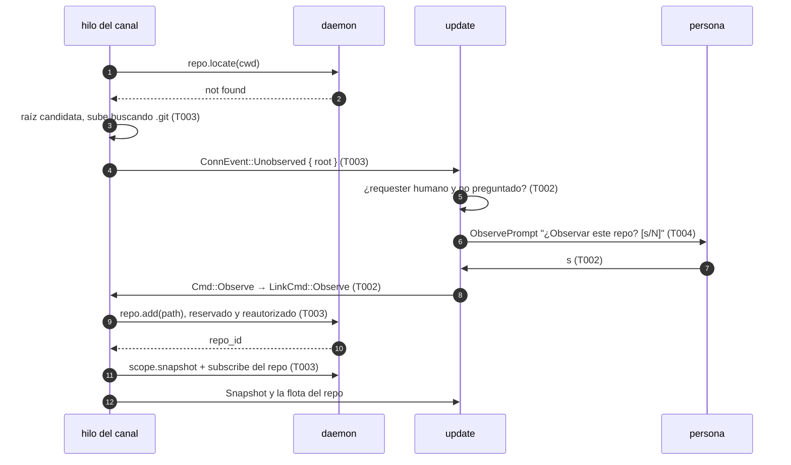
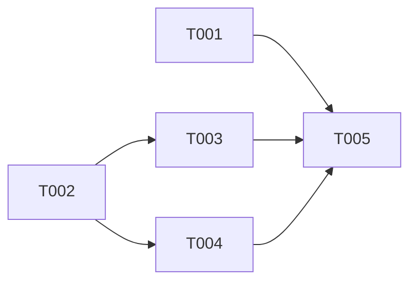

# DS-US-CKP-025 · La TUI ofrece observar el repo en el que se abre

## Contexto rápido

Al terminar, quien abre `raptor` dentro de un repo que el motor no observa ve "¿Observar este repo? [s/N]". Con `s` el repo pasa a observado y la TUI muestra sus worktrees. Con `n`, Intro o Esc no se observa nada y la TUI sigue como en el PR #126: abre el único repo observado, ofrece elegir entre varios o, si no hay ninguno, da la guía de primer repo (US-CKP-003). Hoy la TUI no distingue "estoy en un repo no observado" de "no estoy en ningún repo".

Una TUI lanzada por un agente nunca pregunta: la pregunta solo aparece cuando el daemon resolvió la conexión como la persona (`Requester::Unattributed { layer: Cockpit }`). Sin terminal, `raptor` no arranca la TUI (exit 2, ADR-CKP-003 § 11), así que tampoco pregunta. Con `s`, el cliente llama a `repo.add`, el mismo comando reservado de `raptor repo add`. El daemon lo vuelve a autorizar (BR-AUTH-001, SEC-03), así que la decisión de la TUI solo afecta a la experiencia y no a la seguridad.

**Glosario.** *Raíz candidata*: la primera carpeta, subiendo desde el cwd canonicalizado, que contiene una entrada `.git` (carpeta o archivo). La TUI no lee Git: el daemon la valida en `repo.add`.

**Decisiones del orquestador (2026-10-07), validadas por Arquitecto y PO.** Están incorporadas en las reglas de cada tarea:

- **D1** (Arquitecto, con ajuste): la raíz candidata se busca en el hilo del canal, desde el cwd **canonicalizado**, y solo cuando `repo.locate` responde con un error del daemon. Un fallo de transporte reconecta y no pregunta. No se añade ningún método a la API.
- **D2** (Arquitecto, con ajuste): `ConnEvent::Unobserved { root }` **sustituye** a `Unlocated` en ese caso. `update` pregunta solo con `Requester::Unattributed { layer: Cockpit }`. Con requester `None`, agente, `Unverified` o capa MCP sigue el flujo de #126.
- **D3**: la pregunta es un panel dentro de la TUI (`Pick::Asking`). Se acepta con `s` o `y` en los dos idiomas. Intro, `n` y Esc responden No. `q` y Ctrl-C salen.
- **D4** (Arquitecto y PO, con ajuste): `RepoAddOutcome::AlreadyObserved` cuenta como éxito. Un fallo llega con un motivo tipado (`ObserveFailure`), nunca con el texto del daemon. El aviso dice que el repo no quedó observado, por qué y cómo reintentar (`raptor repo add <ruta>`). Un `reserved-refused` tampoco se vuelve a preguntar.
- **D5**: se pregunta como mucho una vez por ejecución. La bandera vive en el modelo, y el cliente puede volver a mandar `Unobserved` en cada reconexión. El "no" no se recuerda entre ejecuciones: al volver a abrir la TUI en ese repo, pregunta otra vez (PO).
- **D6**: es un widget neutro nuevo, `ObservePrompt`. `ConfirmPrompt` queda para las acciones irreversibles y usa el color de peligro (DSYS-GRP-001 § 3).
- **D8** (coordinador, al aprobar el plan): con un `.git` **archivo** (worktree enlazado), la TUI ofrece el repo al que pertenece el worktree: lo nombra por su worktree principal (`gitdir` → `commondir`) y `repo.add` recibe la raíz del worktree, que el daemon resuelve a su directorio común. No aparece un repo fantasma. Un submódulo (sin `commondir`) se ofrece con su propio nombre. La subida se detiene en el límite del sistema de archivos (`st_dev`). El home solo se ofrece si de verdad contiene `.git`.
- **D9** (coordinador): la carpeta de una ejecución no cambia. El selector abre otros repos, pero no cambia el cwd, así que una sola bandera por ejecución basta.
- **D7** (PO): el escenario 6 (repos descubiertos) y los niveles (`tier`, "reconciliando") quedan fuera: dependen de US-GRP-020/022 y de ADR-GRP-010 N4, que no están construidos. La historia queda en `in-progress`.

## 📋 Índice

> **Para aprobar:** [Contexto rápido](#contexto-rápido) · [⚠️ Gaps](#gaps-y-violaciones-de-la-constitución) · [🔭 La forma](#la-forma) · [El trabajo de un vistazo](#el-trabajo-de-un-vistazo).
> **Para implementar:** [🚀 Plan](#plan-de-implementación), en orden.

| Sección | Propósito |
|---------|-----------|
| [Contexto rápido](#contexto-rápido) | Qué se construye, por qué y las decisiones |
| [⚠️ Gaps y violaciones de la constitución](#gaps-y-violaciones-de-la-constitución) | Qué impide empezar |
| [🔭 La forma](#la-forma) | Cómo fluye |
| [🚀 Plan de implementación](#plan-de-implementación) | T001…T005 |
| [Estructura de ficheros](#estructura-de-ficheros) _(ref)_ | Árbol de archivos |
| [Contratos compartidos](#contratos-compartidos) _(ref)_ | Tipos y firmas |
| [Estrategia de pruebas y cobertura](#estrategia-de-pruebas-y-cobertura) _(ref)_ | Pruebas |
| [Gate de seguridad](#gate-de-seguridad) | Autorización y textos |
| [Fuera de alcance](#fuera-de-alcance) | Lo diferido y su dueño |
| [Notas del autor](#notas-del-autor) _(ref)_ | Lo que no bloquea |

---

## ⚠️ Gaps y violaciones de la constitución

_No gaps. Ready to implement._ Lo diferido tiene dueño en [Fuera de alcance](#fuera-de-alcance).

---

## 🔭 La forma

No aparece ninguna entidad nueva: hay un estado más en la máquina del selector de #126 y un comando más del canal.



Si la respuesta es No, o si hay un fallo, `update` sigue por `on_unlocated` (paso 6 en adelante, igual que en #126).

---

## 🚀 Plan de implementación

> Orden topológico (`Depende:`). Rutas relativas a la raíz del repo.

### El trabajo de un vistazo

| # | Tarea | Depende | Aterriza en |
|---|---|---|---|
| T001 | Escribir en rojo los tests de proceso (pty) | — | `apps/cli/tests` |
| T002 | Añadir la pregunta al modelo, a `update` y al mapa de teclas | — | `apps/cli/src/{model,tui/update,tui/keymap}.rs` |
| T003 | Buscar la raíz candidata y observar desde el hilo del canal | T002 | `apps/cli/src/client/mod.rs` |
| T004 | Pintar la pregunta y el aviso en en/es, con snapshots | T002 | `apps/cli/src/tui/{view,widgets}`, `present/i18n.rs` |
| T005 | Cerrar la historia y la documentación | T001, T003, T004 | `docs` |

### En qué orden



### T001 — Escribir en rojo los tests de proceso (pty)

**Objetivo.** Los escenarios 1 a 3 de la historia contra el `raptor` real, bajo `script` (macOS), con perfil y repos temporales.

**Ubicación.** `apps/cli/tests/tui_unobserved_repo.rs` (**CREATE**)

**Reglas**
- Mismo arnés que `repo_state.rs`: el daemon real, `GITRAPTOR_AGENT_EXECUTABLES=raptor-fake-agent`, el agente simulado como copia del binario de test y la persona bajo `script`.
- Sin `sleep` fijos: se espera a un texto en la salida del pty con un plazo, y se escribe la tecla cuando aparece.
- Casos:
  - `answering_yes_observes_the_repo_and_shows_its_worktrees` (en y es, con `y` y `s`);
  - `answering_yes_in_a_linked_worktree_observes_its_repo` (D8);
  - `answering_no_lists_the_observed_repos` (con `n` y con Intro);
  - `an_agent_is_never_asked`;
  - `without_a_terminal_nothing_is_asked_nor_observed`.

- **Depende:** —
- **Refs:** US-CKP-025, escenarios 1, 2 y 3
- **Aceptación:** `cargo test -p gitraptor-cli --test tui_unobserved_repo`

### T002 — Añadir la pregunta al modelo, a `update` y al mapa de teclas

**Objetivo.** El estado `Pick::Asking`, la bandera de "ya preguntado", `Cmd::Observe` y las respuestas a `ConnEvent::Unobserved`, `ConnEvent::Observed` y `ConnEvent::ObserveFailed`.

**Ubicación.**
- `apps/cli/src/model.rs` (**MODIFY**)
- `apps/cli/src/tui/update.rs` (**MODIFY**)
- `apps/cli/src/tui/keymap.rs` (**MODIFY**)
- `apps/cli/src/tui/app.rs` (**MODIFY**)

**Reglas**
- `Unobserved` pregunta solo si `requester == Some(Unattributed { layer: Cockpit })` y `!ui.asked`. En cualquier otro caso, `on_unlocated`.
- Mientras se pregunta: `Yes` (`s`/`y`) → `ui.asked = true`, `Pick::Observing`, `Cmd::Observe { path }`. `No` (`n`/Esc) y `Open` (Intro) → `ui.asked = true` y `on_unlocated`. Las flechas no hacen nada y dicen "tecla sin acción".
- `ObserveFailed(reason)` → `Notice::ObserveFailed`, que lleva el motivo, y luego `on_unlocated`. La snapshot del repo pone `Pick::None`, como ya hace hoy.
- Fuera de la pregunta, `Yes` y `No` responden "tecla sin acción". Esc no estaba asignada.

- **Depende:** —
- **Refs:** D2, D3, D5
- **Aceptación:** `cargo test -p gitraptor-cli --lib tui::update::tests::observe`

### T003 — Buscar la raíz candidata y observar desde el hilo del canal

**Objetivo.** `session` distingue "no es un repo observado" de "no estoy en un repo", y `LinkCmd::Observe` llama a `repo.add`.

**Ubicación.** `apps/cli/src/client/mod.rs` (**MODIFY**)

**Reglas**
- `locate` devuelve `Result<Option<String>, LinkError>`. `Refused` significa "no observado" y `Ok(None)`. Cualquier otro error termina la sesión con `End::Reconnect`.
- Con `Ok(None)` y sin `chosen`: `candidate_root(cwd)` canonicaliza con `std::fs::canonicalize` y sube por `ancestors()` hasta la primera carpeta con una entrada `.git`. Si la encuentra, envía `Unobserved { root }`. Si no, envía `Unlocated`.
- `LinkCmd::Observe { path }` → `repo.add`. Con `Ok` (sea `New`, `AlreadyObserved` o `Reactivated`), `chosen = Some(repo_id)` y luego `sync` del repo. Con `Refused` y sin datos, `ObserveFailed(Unknown)`. El motivo se lee del error de la llamada: `Link::call_refusal` añade el código y los datos sin cambiar `call`.
- Fuera de una sesión (reconectando), `Observe` se ignora y se manda `ObserveFailed(Disconnected)`.

- **Depende:** T002
- **Refs:** D1, D4
- **Aceptación:** `cargo test -p gitraptor-cli --lib client::tests::candidate_root`

### T004 — Pintar la pregunta y el aviso en en/es, con snapshots

**Objetivo.** El widget `ObservePrompt` (título, nombre del repo, ruta y pregunta con su valor por defecto), las pistas de tecla mientras se pregunta y los textos en/es del aviso de fallo.

**Ubicación.**
- `apps/cli/src/tui/widgets/observe_prompt.rs` (**CREATE**)
- `apps/cli/src/tui/widgets/mod.rs` (**MODIFY**)
- `apps/cli/src/tui/view.rs` (**MODIFY**)
- `apps/cli/src/present/i18n.rs` (**MODIFY**)
- `apps/cli/src/tui/snapshots/observe_prompt_80x24_{en,es}.snap` (**CREATE**)

**Reglas**
- Textos:
  - en: "Observe this repo? [y/N]", con la pista "y observe · n no";
  - es: "¿Observar este repo? [s/N]", con la pista "s observar · n no".
- El nombre y la ruta pasan por el saneador (`SafeText`, SEC-12).
- Aviso de fallo: qué pasó, por qué y qué hacer. Ejemplo: "notes not observed: Git does not trust it → `raptor repo add <ruta>`". El motivo `untrusted` nombra `safe.directory`.
- Colores: solo tokens semánticos (`accent.default` en el borde y `text.muted` en la ruta), nada de `status.danger`.

- **Depende:** T002
- **Refs:** D3, D4, D6; DSYS-GRP-001 § 3 y § 5
- **Aceptación:** `cargo test -p gitraptor-cli --lib tui::view::tests::observe`

### T005 — Cerrar la historia y la documentación

**Objetivo.** La historia enlaza esta Dev Spec y pasa a `in-progress`, porque el escenario 6 queda diferido.

**Ubicación.** `docs/requirements/features/cockpit/user-stories/US-CKP-025-tui-repo-no-observado.md` (**MODIFY**)

**Reglas**
- `status: in-progress` y "Dev Spec: DS-US-CKP-025" en la sección de diseño. El escenario 6 se marca diferido, con US-GRP-020/022 como dueño.

- **Depende:** T001, T003, T004
- **Refs:** D7
- **Aceptación:** `cargo fmt --all --check`, `cargo clippy --all-targets -- -D warnings` y `cargo test --workspace` en verde

---

> Las secciones siguientes son de referencia.

## Estructura de ficheros

```text
apps/cli/
├── src/
│   ├── model.rs                       ← MODIFY  Pick::{Asking, Observing}, Ui.asked/here, ConnEvent, Cmd::Observe, Notice
│   ├── client/mod.rs                  ← MODIFY  candidate_root, locate tipado, LinkCmd::Observe
│   ├── present/i18n.rs                ← MODIFY  textos en/es
│   └── tui/
│       ├── app.rs                     ← MODIFY  Cmd::Observe → LinkCmd::Observe
│       ├── keymap.rs                  ← MODIFY  Action::{Yes, No}, Key::Esc
│       ├── update.rs                  ← MODIFY  on_unobserved, on_question
│       ├── view.rs                    ← MODIFY  el panel y las pistas
│       ├── widgets/observe_prompt.rs  ← CREATE
│       ├── widgets/mod.rs             ← MODIFY
│       └── snapshots/                 ← CREATE  observe_prompt_80x24_{en,es}.snap
└── tests/tui_unobserved_repo.rs       ← CREATE
```

---

## Contratos compartidos

### Tipos y datos compartidos

```rust
// apps/cli/src/model.rs
pub enum Pick { None, Choosing { selected: usize }, Opening, Asking, Observing }
pub struct Ui { /* … */ pub asked: bool, pub here: Option<Candidate> }
pub struct Candidate { pub root: PathBuf, pub name: SafeText, pub path: SafeText }
pub enum ObserveFailure { NotARepo, NotTrusted, Unreadable, Refused, Disconnected, Unknown }
pub enum ConnEvent { /* … */ Unobserved(Candidate), ObserveFailed(ObserveFailure) }
pub enum Cmd { /* … */ Observe { root: PathBuf } }
pub enum Notice { /* … */ ObserveFailed(ObserveFailure) }
// apps/cli/src/client/mod.rs
pub enum LinkCmd { /* … */ Observe { root: PathBuf } }
pub enum Refusal { Engine { code: i64, data: Option<Value> }, Link(LinkError) }
```

### Ciclos de vida (DI)

_No ambient state — DI lifetimes follow stack defaults._

### Firmas del stack

```rust
// apps/cli/src/client/mod.rs
pub fn candidate(cwd: &Path) -> Option<Candidate>;   // raíz, nombre del repo y ruta mostrada
fn main_worktree(root: &Path) -> Option<PathBuf>;     // `.git` archivo → worktree principal
fn locate(link: &mut dyn Link, path: &Path) -> Result<Option<String>, LinkError>;
fn observe(link: &mut dyn Link, path: &Path) -> Result<String, ObserveFailure>;
```

---

## Contrato de API

_Sin métodos nuevos._ La TUI usa `repo.locate` y `repo.add`, que ya existen (US-GRP-001, TS-GRP-004 N4).

### Forma del error y del cuerpo de respuesta

| Error de `repo.add` | `ObserveFailure` | Aviso (en) |
|---|---|---|
| `repo-rejected` + `not-a-repo` | `NotARepo` | "<repo> not observed: it is not a Git repo" |
| `repo-rejected` + `untrusted` | `NotTrusted` | "<repo> not observed: Git does not trust it (safe.directory)" |
| `repo-rejected` + `unreadable` / otro | `Unreadable` | "<repo> not observed: it cannot be read now" |
| `reserved-refused` | `Refused` | "<repo> not observed: only you can observe it, from your terminal" |
| conexión caída | `Disconnected` | "<repo> not observed: the engine disconnected" |
| cualquier otro | `Unknown` | "<repo> not observed" |

Todos terminan con "→ raptor repo add <ruta>". El texto del daemon no se muestra.

### Forma de la configuración

_No aplica — esta entrega no lee configuración._

### Valores numéricos

_No aplica — no hay límites ni plazos nuevos._ La búsqueda de `.git` sube por los ancestros del cwd sin tope: termina en la raíz del sistema de archivos.

---

## Estrategia de pruebas y cobertura

### 9.1 Pirámide de pruebas

| Tipo | Cantidad | Tareas dueñas | Herramientas | Cuándo |
|------|---------:|-------------|---------|------|
| Unit | ~10 | T002, T003, T004 | `cargo test`, `TestBackend`, `insta` | PR gate |
| E2E (pty) | 4 | T001 | `script` de macOS, daemon real | PR gate (macOS) |

### 9.2 Umbrales de cobertura

| Capa | Línea | Rama | Mutación | Camino crítico 100% |
|-------|-----:|-------:|---------:|:------------------:|
| `tui::update` (pregunta) | — | — | — | ✅ humano/agente/sin requester, sí/no/Intro/Esc, fallo |

### 9.3 Datos de prueba

- Repos `notes` (no observado, con un worktree `feat-notas`), `shop` y `api` (observados) en un `gitraptor_testkit::Fixture`. Perfil temporal (NFR-01).

### 9.4 Comportamientos críticos verificados

- [ ] `s`/`y` observa el repo y muestra sus worktrees (T001, T002, T003)
- [ ] Intro/`n` no observa y sigue al flujo de #126 (T001, T002)
- [ ] Un agente nunca ve la pregunta y nada se observa (T001, T002)
- [ ] Sin TTY no se pregunta ni se observa (T001)
- [ ] Snapshots en/es de la pregunta (T004)

---

## Gate de seguridad

- **Autorización:** la TUI no decide quién puede observar. `repo.add` sigue siendo reservado y el daemon lo vuelve a autorizar (`check_reserved`: ascendencia de agente, terminal de control). Que la pregunta no aparezca ante un agente es solo experiencia de uso.
- **Entrada:** la ruta sale del cwd canonicalizado. El daemon la valida (`validate::client_path`, `observe::locate`) y no busca hacia arriba.
- **Textos no confiables:** el nombre y la ruta se sanean antes de pintarse. El texto del error del daemon nunca se muestra, solo el motivo tipado (SEC-12).
- **Fronteras (ADR-CKP-003):** la TUI no importa motor, Git ni políticas (`tests/tui_boundaries.rs`). La búsqueda de `.git` usa `std::fs`.

---

## Fuera de alcance

| Ítem / no-objetivo | Historia que lo cubre | Gate (cómo se verifica) |
|----------------|--------------------|-------------------------|
| Escenario 6: repos descubiertos (`discovery.candidates`, `repo.discovered`, `discovery.dismiss`) | US-GRP-020, US-GRP-022 | no existe `discovery.*` en `crates/api` |
| Niveles (`tier`) y "reconciliando" al abrir un repo dormido | ADR-GRP-010 N4 (enmienda 2026-10-07) | no existe `tier` en `crates/api` |
| Vista recordada que gana sobre esta historia | US-CKP-004 | — |

---

## Notas del autor

| ID | Nota | Acción | Owner |
|----|------|--------|-------|
| G1 | Si `$HOME` es un repo de dotfiles, la TUI preguntará al abrirse desde casa. Es aceptable porque el valor por defecto es N (Arquitecto) | Ninguna | — |
| G2 | Solo se verificó en macOS; Linux y Windows siguen la etapa de validación multiplataforma | Etapa de validación | Rene |
| G3 | El baseline y la certificación se miden con `cargo`, no con `nx` (regla de 2026-10-07: `nx` desactiva `sccache`) | Ninguna | — |

---

## Estado de la implementación (2026-10-07)

- **Hecho**: T001 a T005. Los tests de proceso de "s/y observa" y "n/Intro lista los observados" fallaban antes de implementar. Los de "agente" y "sin terminal" ya pasaban: son guardas de regresión.
- **Revisión** (revisor `general-purpose`, solo lectura). Sin hallazgos Critical ni High. Se corrigieron:
  - el aviso de fallo ya no se borra al reconectar (Medium);
  - una respuesta ilegible de `repo.add` es `Unknown` y no una desconexión;
  - el mapeo de `UnknownRepo` y `NotObserved` está alineado con `support::repo_error`;
  - la ruta del reintento va entre comillas cuando hace falta;
  - la tecla `s` en las pistas se busca por valor;
  - `here` se limpia al llegar la instantánea del repo.
- **Pendiente**: si se pierde la respuesta de un `repo.add` que sí se aplicó, aparece el aviso "el motor se desconectó" y, tras reconectar, `repo.locate` abre el repo. Es aceptable: el estado final es correcto.
- **Sin verificar**: Linux y Windows (G2).
