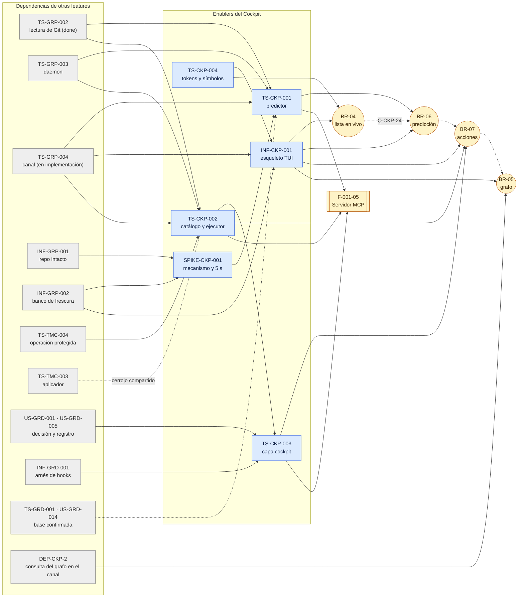

# Technical Stories — INDEX: Cockpit

> Índice. Cada historia vive en su archivo, dentro de [`technical-stories/`](./technical-stories/), con `status: draft` en el frontmatter. La columna Status indica el siguiente paso: `Dev Spec Pending` para los TS y el INF (la Dev Spec se genera con `/aadd-devspec <id>`) y `Research Pending` para el SPIKE, que lleva un Research Brief y no una Dev Spec.
>
> **Criterio de inclusión (Enabler Decision Gate)**: solo entra el trabajo técnico **sin historia de usuario dueña y sin resultado observable** por el usuario. El Cockpit aún no tiene historias (las escribe el PO después), así que la columna "Habilita" apunta a capacidades del BRD (BR-04 a BR-07), a reglas BR-CKP y al Servidor MCP (F-001-05). Hay **6 enablers**: 5 nuevos más SPIKE-CKP-001. El resto del trabajo técnico tendrá una historia dueña y va a su Dev Spec: ver [Trabajo técnico que no es enabler](#trabajo-técnico-que-no-es-enabler).
>
> **Conjunto mínimo**: decisión del orquestador (2026-10-04), validada por Arquitecto. No se crea un INF de arnés ni de banco para la predicción ni para el ejecutor: se reutilizan INF-GRP-001 e INF-GRP-002 con suites y escenarios que entran con TS-CKP-001, TS-CKP-002 e INF-CKP-001.

## Índice

| ID | Tipo | Título | Valor (1 línea) | ADR | Habilita | Depende de | Complejidad | Status |
|----|------|--------|-----------------|-----|----------|-----------|-------------|--------|
| [SPIKE-CKP-001](./technical-stories/SPIKE-CKP-001-prediccion-5s.md) | SPIKE | Predicción de conflictos en ≤ 5 s p95 sin escribir en el repo | Elegir con mediciones el mecanismo del merge en seco y confirmar o corregir S-CKP-1 | ADR-CKP-001 (valida) | BR-06; `check_conflicts` de F-001-05 | Núcleo de INF-GRP-001; repo de 100K commits de INF-GRP-002 | Medium | Research Pending |
| [TS-CKP-001](./technical-stories/TS-CKP-001-predictor-conflictos.md) | TS | Predictor de conflictos en el daemon | Un solo ⚡ y un solo ⚠ para la TUI, la CLI y el MCP, sin escribir en el repo | ADR-CKP-001 | BR-06 (BR-CKP-CALC-002, CALC-003, WF-005, WF-007, EDGE-001); `raptor conflicts`; F-001-05 | SPIKE-CKP-001; TS-GRP-002, TS-GRP-003, TS-GRP-004; base confirmada (TS-GRD-001) para los pares contra la base | High | Dev Spec Pending (bloqueada por SPIKE-CKP-001) |
| [TS-CKP-002](./technical-stories/TS-CKP-002-catalogo-ejecutor.md) | TS | Catálogo de operaciones de usuario y ejecutor del daemon | Una sola vía de escritura para la TUI y el MCP: preparar, revalidar bajo cerrojo y ejecutar como operación protegida, con la capa fijada por el daemon | ADR-CKP-002 | BR-07 (BR-CKP-ELIG-001 a 005, WF-003, WF-008, CONS-002, CONS-004, AUTH-002, AUTH-003); F-001-05: `safe_commit`, `safe_rebase`, `create_worktree`, `snapshot` (DEP-MCP-2, 3, 5) | TS-TMC-004; TS-GRP-002, TS-GRP-003, TS-GRP-004; cerrojo compartido con TS-TMC-003 | High | Dev Spec Pending |
| [TS-CKP-003](./technical-stories/TS-CKP-003-capa-cockpit-guardrails.md) | TS | Capa cockpit en la decisión de Guardrails | Una decisión por operación, antes de cualquier efecto, heredada por los hooks del `git` del ejecutor y registrada una vez | ADR-CKP-002 § 4 | BR-07 gobernadas (BR-CKP-AUTH-001, WF-002); F-001-05 (DEP-MCP-3, DEP-MCP-5) | TS-CKP-002; US-GRD-001; US-GRD-005; INF-GRD-001 (enmiendas de ADR-GRD-003 y ADR-GRD-006 ya aplicadas) | Medium | Dev Spec Pending |
| [INF-CKP-001](./technical-stories/INF-CKP-001-esqueleto-tui.md) | INF | Esqueleto de la TUI: cliente del canal, bucle TEA, saneado único y gate de 100 ms | Mismo bucle, cliente y saneador para todas las pantallas; una regresión de latencia rompe el CI | ADR-CKP-003 | BR-04 a BR-07 (todas sus historias); CLI de solo lectura (Q-CKP-20) | TS-GRP-004 (N1 a N7); TS-CKP-004; INF-GRP-002 | Medium | Dev Spec Pending |
| [TS-CKP-004](./technical-stories/TS-CKP-004-tokens-semanticos-simbolos.md) | TS | Tokens semánticos y símbolos con fallback en el tema | Ningún literal de color ni de glifo; se lee igual en todas las profundidades de color y en ASCII (NFR-09) | ADR-GRP-003, ADR-CKP-003 § 10 | BR-04 a BR-07 (todas las pantallas); NFR-09; BR-CKP-EDGE-006 | — | Low | Dev Spec Pending |

## DAG de enablers

Las flechas continuas son dependencias que bloquean; las discontinuas, coordinación o dependencia parcial. Las capacidades (círculos) son las historias que escribirá el PO; la fila inferior es el orden de entrega de Q-CKP-24.

## Ruta crítica (Q-CKP-24: BR-04 → BR-06 → BR-07 → BR-05)

1. **Día uno, en paralelo**: TS-CKP-004, sin dependencias; SPIKE-CKP-001 en cuanto existan el núcleo de INF-GRP-001 y el repo de 100K commits de INF-GRP-002 (time-box ⚠️ **ASSUMPTION** de 1,5 semanas en macOS).
2. **BR-04**: TS-GRP-004 (N1 a N7 del contrato) → INF-CKP-001 → primeras historias de BR-04. Es la cadena más larga del Cockpit, y su primer eslabón, el canal, lo está implementando otro worker.
3. **BR-06**: SPIKE-CKP-001 → TS-CKP-001 (con TS-GRP-003 y TS-GRP-004) → historias de BR-06. La Dev Spec de TS-CKP-001 no se escribe antes de los resultados del SPIKE.
4. **BR-07**: TS-TMC-004 → TS-CKP-002 → TS-CKP-003 (con US-GRD-001 y US-GRD-005) → historias de BR-07. TS-CKP-002 puede avanzar mientras se cierra BR-06; abortar una operación detenida no está gobernada y solo necesita TS-CKP-002.
5. **BR-05**: ningún enabler propio. La historia del grafo espera a INF-CKP-001 y a la consulta de commits base..rama en el canal (DEP-CKP-2: ADR-GRP-005 § 5 ya enmendado; la forma en el contrato es **pendiente, dueño: worker del canal (TS-GRP-004)**).

**Reparto en la flota de agentes**: TS-CKP-004 (`packages/design-tokens`, `crates/theme`), TS-CKP-001 (módulo de predicción) y TS-CKP-002 (módulo del ejecutor y su invocación) tocan módulos distintos y pueden ir en worktrees paralelos. TS-CKP-001 y TS-CKP-002 añaden tipos al contrato de `crates/api`; esa integración la coordina el worker del canal (TS-GRP-004).

## Encaje con las capacidades

| Capacidad | Espera a (enablers) | Por qué |
|-----------|---------------------|---------|
| BR-04 Lista en vivo | INF-CKP-001, TS-CKP-004 | Toda vista necesita el cliente con secuencia y resync, el saneado SEC-12, el gate de 100 ms y el tema |
| BR-06 Predicción | INF-CKP-001, TS-CKP-004, TS-CKP-001 (tras SPIKE-CKP-001) | El ⚡ y el ⚠ los calcula y publica el daemon; la TUI solo los pinta |
| BR-07 Acciones | INF-CKP-001, TS-CKP-004, TS-CKP-002, TS-CKP-003 | Toda escritura es una operación del catálogo; merge, rebase, crear y borrar worktree están gobernados |
| BR-05 Grafo | INF-CKP-001, TS-CKP-004 | Sin enabler propio; depende de DEP-CKP-2 |
| F-001-05 Servidor MCP | TS-CKP-001 (`check_conflicts`), TS-CKP-002 y TS-CKP-003 (`safe_commit`, `safe_rebase`, `create_worktree`, `snapshot`) | Mismo predictor, mismo catálogo y misma decisión, con la capa `mcp` que fija el daemon (DEP-MCP-2, 3, 5) |

## Dependencias externas

IDs y estados verificados el 2026-10-04 en los índices y en el frontmatter de cada ficha de motor-local, time-machine y guardrails. "Dev Spec pendiente" equivale a la columna Status `Dev Spec Pending` de su índice.

| Dependencia | Feature | Estado | Qué aporta al Cockpit | La necesita | Nota |
|-------------|---------|--------|-----------------------|-------------|------|
| TS-GRP-002 | motor-local | Done | Capa de lectura de Git donde viven el merge en seco y las lecturas de precondiciones | TS-CKP-001, TS-CKP-002 | — |
| TS-GRP-003 | motor-local | Ready (Dev Spec pendiente) | Daemon que aloja el pool de predicción y el ejecutor | TS-CKP-001, TS-CKP-002 | — |
| TS-GRP-004 | motor-local | En implementación (otro worker) | Canal, contrato y biblioteca cliente: N1 a N11 de ADR-CKP-003, forma de la predicción, métodos de operación | INF-CKP-001, TS-CKP-001, TS-CKP-002 | Lo que pide el Cockpit al contrato: **pendiente, dueño: worker del canal (TS-GRP-004)**; no se aplica aquí (DEP-CKP-6) |
| INF-GRP-001 | motor-local | Ready (Dev Spec pendiente) | Núcleo de huella, repo canario y auditoría de `exec` | SPIKE-CKP-001 (núcleo); suites "predicción" (TS-CKP-001), "ejecutor" (TS-CKP-002) y "TUI sin perfil" (INF-CKP-001) | Reutilizado: cada suite entra con su enabler |
| INF-GRP-002 | motor-local | Ready (Dev Spec pendiente) | Repo de 100K commits, suscriptor sin pantalla y gates de frescura | SPIKE-CKP-001, TS-CKP-001 (escenario de predicción), INF-CKP-001 (gate de 100 ms) | Gate de 100 ms: enmienda E2 de ADR-GRP-011, aplicada |
| TS-TMC-004 | time-machine | Draft (Dev Spec pendiente) | Operación protegida, solicitante por ascendencia y reto ligado al plan | TS-CKP-002 | Única vía de escritura (ADR-TMC-004) |
| TS-TMC-003 | time-machine | Draft (Dev Spec pendiente) | Aplicador con el cerrojo de escritura por repo | TS-CKP-002 (coordinación) | El cerrojo es uno solo; lo crea la primera historia que entre |
| TS-TMC-002 | time-machine | Draft (Dev Spec pendiente) | Oplog: intención, resultado y "lo detuvo el ejecutor" | TS-CKP-002, vía TS-TMC-004 | — |
| INF-TMC-001 | time-machine | Draft (Dev Spec pendiente) | Arnés de caos e interrupción | TS-CKP-002 (regresión) | — |
| US-GRD-001 | guardrails | Draft | Función de decisión, cliente del hook y canal autenticado (ADR-GRD-003) | TS-CKP-003 | — |
| US-GRD-005 | guardrails | Draft | Registro de decisiones (ADR-GRD-006) | TS-CKP-003 | — |
| INF-GRD-001 | guardrails | Draft (Dev Spec pendiente) | Fixtures de hooks y suites de encadenado | TS-CKP-003 | Reutilizado como regresión |
| TS-GRD-001, US-GRD-014, US-GRP-016 | guardrails, motor-local | Dev Spec aprobada; Draft; Draft | Rama base confirmada | TS-CKP-001 (pares contra la base), TS-CKP-002 (precondición) | Sin base confirmada: pares "pendiente" y escrituras desactivadas (Q-CKP-27) |
| US-GRD-015 + factor fuera de banda del SO (Q-GRD-19) | guardrails | Bloqueada | Cola de confirmación publicada | Historia de la cola del Cockpit (DEP-CKP-8) | No bloquea ningún enabler; TS-CKP-003 trata "pedir confirmación" como denegar |
| US-GRD-016 | guardrails | Bloqueada por F-001-05 | Misma decisión por MCP | TS-CKP-003 (coordinación de la capa `mcp`) | — |
| US-GRD-017 | guardrails | Draft | Sin snapshot previo no se ejecuta | TS-CKP-002 (coherencia: resultado `aborted`) | — |
| Enmiendas de ADR-CKP-001 a 003 en otros ADR | varios | Aplicadas el 2026-10-04, salvo las pendientes de la nota | ADR-GRP-004, 006, 007, 008, 009, 011, 013; ADR-GRD-003, 006, 007; ADR-TMC-002, 005 | TS-CKP-001 a 003, INF-CKP-001 | Pendientes: ADR-GRD-007 (excepción en el rebase, I-01) y ADR-GRP-006 (esquema de preferencias, L-05), del orquestador; ADR-TMC-002 y ADR-TMC-004 § 4 (captura manual), dueño Time Machine; ADR-GRP-009 Validación 5 (proceso trabajador), condicionada a SPIKE-CKP-001 (M-06). No se aplican aquí |
| Implementación de DEP-CKP-2, 3, 4, 5 y 14 | motor-local, time-machine | ADR enmendados el 2026-10-04 (ADR-GRP-005, 009, 010, 013; ADR-TMC-003); implementación sin historia asignada todavía | Consultas del grafo y del diff, última actividad y última sesión, timeline en vivo, estado en conflicto | Historias de BR-04, BR-05 y BR-07; TS-CKP-002 (`stopped` con rutas, DEP-CKP-14) | Qué historia del motor o de la Time Machine lo implementa: pendiente, dueño: orquestador. La forma en el contrato: **pendiente, dueño: worker del canal (TS-GRP-004)** |

## Trabajo técnico que no es enabler

Trabajo con una sola historia dueña o con resultado observable. Va en los `Requisitos Técnicos` y la Dev Spec de la historia que escriba el PO. Decisión del orquestador (2026-10-04), validada por Arquitecto.

| Trabajo | Motivo (gate) | Destino | DEP |
|---------|---------------|---------|-----|
| Registro del KPI de detección (Q-CKP-21, ADR-CKP-001 § 9) | Observable: el desarrollador consulta el porcentaje detectado antes | Historia del KPI de BR-06 (el PO la crea) | DEP-CKP-11 (parte KPI), DEP-CKP-14 |
| Estados de conexión y arranque del daemon (Q-CKP-22) | Observable | Historia de BR-04 | DEP-CKP-6 (consumo) |
| Última actividad y último agente (Q-CKP-3) | Una historia | Historia de BR-04 | DEP-CKP-4 |
| Merge con o sin la base sacada (ADR-CKP-002 § 7) | Una historia | Historia de merge | — |
| Abortar lo que detuvo el ejecutor (ADR-CKP-002 § 9) | Una historia | Historia de merge o rebase detenido | DEP-CKP-14 |
| Lo no recuperable al descartar (ADR-CKP-002 § 8) | Una historia | Historia de descartar | — |
| Ruta del worktree nuevo (BR-CKP-VAL-001) | Una historia | Historia de crear worktree | DEP-CKP-13 |
| Resolver y lanzar el editor (ADR-CKP-002 § 10, ADR-CKP-003 § 9) | Una historia (Should) | Historia de abrir en el editor | DEP-CKP-12, DEP-CKP-13 |
| Excepción consciente desde el Cockpit (Q-CKP-15, ADR-GRD-007) | Observable | Historia de acción denegada | — |
| Consulta del grafo (Q-CKP-4) | Una historia | Historia de BR-05 | DEP-CKP-2 |
| Consulta del diff (Q-CKP-8) | Una historia; nunca por el MCP | Historia de ver diff | DEP-CKP-3 |
| Timeline en vivo y Deshacer en la TUI | Observable | Historias de presentación de la Time Machine | DEP-CKP-5 |
| Preferencias de la TUI (Q-CKP-17) | Observable | Historia de persistencia del estado | DEP-CKP-11 |
| `--plain` y detección de `NO_COLOR`, `--ascii` y alto contraste | Observable | Historia de accesibilidad (NFR-09) | — |
| `raptor status` y `raptor conflicts` con `--json` (Q-CKP-20) | Observable (Should) | Historia de la CLI de solo lectura | — |
| Cola de confirmación (Q-CKP-14) | Observable | Historia de la cola, bloqueada | DEP-CKP-8 |
| `commit` con el mensaje por stdin (ADR-CKP-002 § 1 y § 6) | Una historia; solo MCP | Historia de `safe_commit` (F-001-05) | DEP-MCP-2 |
| `snapshot` manual (ADR-CKP-002 § 1) | Una historia; solo MCP | Historia de `snapshot` (F-001-05), sobre la API de captura pendiente de la Time Machine | DEP-MCP-2 |
| Modo atómico del rebase con su abort (ADR-CKP-002 § 9) | Una historia; solo MCP | Historia de `safe_rebase` (F-001-05) | DEP-MCP-5 |

## Destino de las dependencias DEP-CKP

| DEP | Destino |
|-----|---------|
| DEP-CKP-1 | SPIKE-CKP-001 → TS-CKP-001; enmiendas de la tabla de ADR-CKP-001 tras el SPIKE |
| DEP-CKP-2, 3 | Historias de BR-05 y de ver diff. ADR-GRP-005 § 5 y ADR-GRP-009 Validación 8 ya enmendados; la forma en el contrato es **pendiente, dueño: worker del canal (TS-GRP-004)** |
| DEP-CKP-4, 5, 14 | ADR-GRP-010 § 4, ADR-GRP-013 y ADR-TMC-003 ya enmendados; la implementación en motor-local y en la Time Machine queda sin historia asignada: pendiente, dueño: orquestador |
| DEP-CKP-6 | Consumo en INF-CKP-001; contrato: **pendiente, dueño: worker del canal (TS-GRP-004)** |
| DEP-CKP-7 | TS-CKP-002 |
| DEP-CKP-8 | Historia de la cola, bloqueada por US-GRD-015 y el factor fuera de banda del SO |
| DEP-CKP-9 | INF-CKP-001 (punto único de saneado); enmienda E1 de ADR-GRP-004 (aplicada) |
| DEP-CKP-10 | TS-CKP-003 |
| DEP-CKP-11 | Parte KPI: historia del KPI (ADR-GRP-006 ya enmendado). Preferencias: su historia; el esquema de L-05 en ADR-GRP-006 sigue pendiente del orquestador, y la forma en el contrato es **pendiente, dueño: worker del canal (TS-GRP-004)** |
| DEP-CKP-12 | Historia del editor más la comprobación estática de INF-CKP-001; enmienda de ADR-GRP-009 Validación 5 (aplicada) |
| DEP-CKP-13 | Historias del editor y de crear worktree; enmiendas de ADR-GRP-007 y ADR-GRP-008 (aplicadas) |
| DEP-MCP-2 (CTX-MCP-001) | Catálogo y ejecutor en TS-CKP-002; `commit`, `snapshot` y rebase atómico en sus historias de F-001-05 |
| DEP-MCP-3 (CTX-MCP-001) | Registro de hijos y resolución de descendientes en TS-CKP-002; actor de los `git` nietos en TS-CKP-003; marca de la conexión: **pendiente, dueño: worker del canal (TS-GRP-004)** |
| DEP-MCP-5 (CTX-MCP-001) | Reutilización de la decisión en el abort en TS-CKP-003; el modo atómico en la historia de `safe_rebase` |

Diagramas de secuencia del feature: [predicción](../../../architecture/diagrams/seq-ckp-prediccion.md), [operación de usuario](../../../architecture/diagrams/seq-ckp-operacion-usuario.md) y [arranque de la TUI](../../../architecture/diagrams/seq-ckp-arranque-tui.md). Componentes: [c4-ckp-components.md](../../../architecture/diagrams/c4-ckp-components.md).
