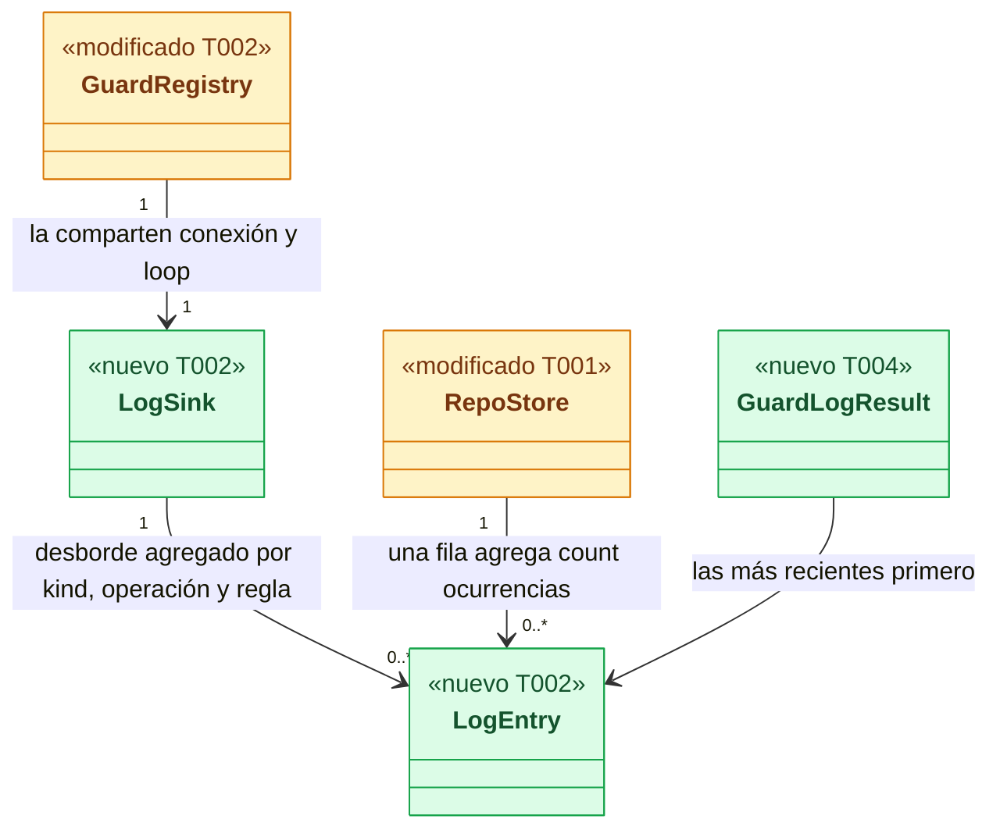
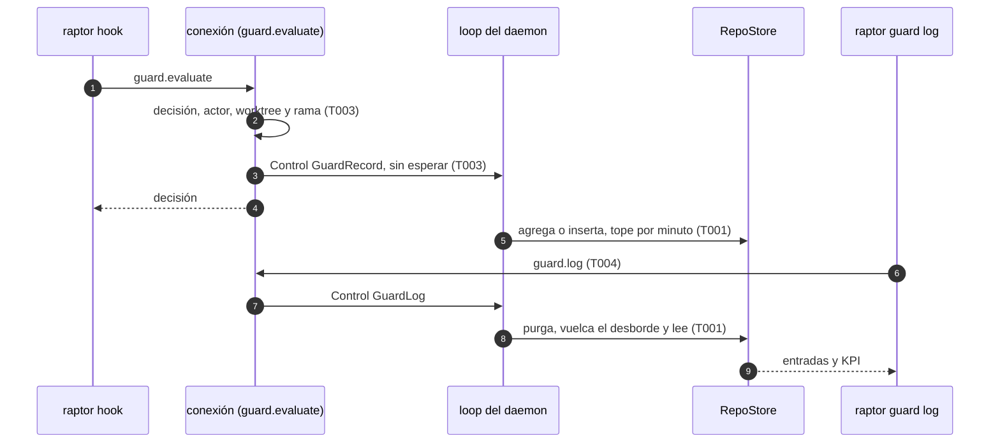
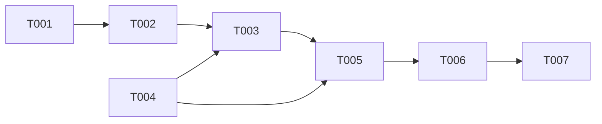

# DS-US-GRD-005 · Registro de bloqueos de Guardrails y su consulta

## Contexto rápido

Al terminar, el desarrollador ve con `raptor guard log` qué operaciones bloqueó Guardrails en un repo, a quién y por qué, y `raptor guard status` le dice cuántas lleva en los últimos 7 días. Hoy no puede: el daemon decide y responde al hook, pero no anota nada. Lo vio el dogfooding del 2026-10-07: un commit de agente, un `--no-verify`, el borrado de `main` y un force-push se bloquearon y no aparecieron en ninguna parte.

Para eso hay cuatro piezas:

- una tabla `guardrails_decisions` en el almacén del repo, con agregación, tope de filas y purga a 90 días;
- la escritura desde el hilo de la conexión hacia el loop, que es el único escritor;
- el método `guard.log`;
- la acción `raptor guard log` en en/es.

Las decisiones son de ADR-GRD-006 y de D12 de DS-US-GRD-018. Aquí no se reabren: se ajustan en la enmienda del 2026-10-07 de ADR-GRD-006.

| Término | Qué es aquí |
|---|---|
| Entrada | Una fila del registro. Agrega ocurrencias idénticas (`count`) |
| KPI | "Acciones bloqueadas": suma de `count` de las entradas `denial` con origen `daemon` en el periodo, incluidas las filas `rate-limited` |
| Aviso | `kind = notice`: un commit de agente que pasó con aviso (`human-author` + `warn`) o con `flexible`. No cuenta en el KPI (BR-AUTH-005 punto 4) |
| Actor | El agente detectado en la ascendencia del cliente del hook (`claude-code`, `other`), o "sin atribuir" |

**Decisiones del orquestador (2026-10-07), validadas por Arquitecto y PO** (`nassa-architect:architect` y `nassa-aadd:product-owner`, una consulta cada uno; sus ajustes están incorporados):

| # | Decisión | Ajuste de la validación |
|---|---|---|
| D1 | La consulta es `raptor guard log`, no `raptor events`: los eventos no caducan y el registro sí (ADR-GRD-006) | PO: `raptor guard status` añade "N acciones bloqueadas en los últimos 7 días · `raptor guard log`" para que se encuentre |
| D2 | Kinds escritos hoy: `denial` (efecto aplicado distinto de `allow`) y `notice` (aviso de autoría, y commit de agente con `flexible`) | Arquitecto: `rate-limited` no es un kind, sino la columna `detail` (`full` \| `rate-limited`). PO: `flexible` entra esta noche como `notice` |
| D3 | Escritura: el hilo de la conexión arma la entrada y la envía con `Control::GuardRecord` **antes** de responder al hook. Sin esperar respuesta | Arquitecto: actor y worktree se resuelven con el cliente vivo; nada bajo el ejecutor del Cockpit; el almacén se localiza por el `common_dir` observado y no por el `repo_id` del cliente |
| D4 | Protección del loop ante una inundación: un contador atómico de mensajes en vuelo (tope 1 024). Por encima, la entrada no se encola y suma en un mapa compartido `(kind, operación, regla) → count`, que el loop vuelca como filas `rate-limited` | Arquitecto (propuesta suya) |
| D5 | Operación normalizada: tipo, refs con su cambio (`create` \| `update` \| `force` \| `delete`), tope de 16 refs y solo las que nombran las razones cuando las hay; el remoto sin `userinfo`, sin query y sin fragmento. Nunca argv, oids ni mensaje | Arquitecto: el tope y la query (M-06) |
| D6 | Autoría (D12): coautores como tipos de agente, si había un trailer de agente, si el mensaje era ilegible y la política efectiva. Sin nombres ni correos. Una denegación de commit muestra "autor no disponible: el commit no llegó a crearse". Un aviso muestra "autor: ver `raptor events`" (la unión por oid queda diferida, G1) | PO: acepta el texto provisional |
| D7 | Sin flag `--unverified` mientras no exista el spool | PO: un 0 diría "no hubo", cuando la verdad es "no se anota" |
| D8 | `guard.log` es un método nuevo del protocolo 9 (`.since(CAPABILITIES_PROTOCOL)`, como `mcp.*`), sin capacidad, no reservado y no ofrecido a `raptor-mcp`. Si el daemon no lo ofrece, la CLI muestra `guard.restart-engine` (precedente: `commands/events.rs`) | Arquitecto: acepta |
| D9 | Capa: siempre `hooks`. Ninguna decisión del MVP llega al daemon por el MCP (`raptor-mcp` no evalúa: `methods/guard.rs`), así que no hay entradas `mcp` | PO: que se diga |

---

## 📋 Índice

> **Para aprobar:** [Contexto rápido](#contexto-rápido) · [⚠️ Gaps](#gaps-y-violaciones-de-la-constitución) · [🔭 La forma](#la-forma) · [El trabajo de un vistazo](#el-trabajo-de-un-vistazo).
> **Para implementar:** [🚀 Plan](#plan-de-implementación), en orden.

| Sección | Propósito |
|---------|-----------|
| [Contexto rápido](#contexto-rápido) | Qué se construye, por qué, y el glosario |
| [⚠️ Gaps y violaciones de la constitución](#gaps-y-violaciones-de-la-constitución) | Qué impide empezar |
| [🔭 La forma](#la-forma) | Qué piezas quedan y cómo fluye |
| [🚀 Plan de implementación](#plan-de-implementación) | T001…T007 |
| [Estructura de ficheros](#estructura-de-ficheros) _(ref)_ | Árbol de archivos |
| [Contratos compartidos](#contratos-compartidos) _(ref)_ | Tipos y firmas |
| [Contrato de API](#contrato-de-api) _(ref)_ | `guard.log` |
| [Modelo de datos](#modelo-de-datos) _(ref)_ | Tabla y migración |
| [Estrategia de pruebas y cobertura](#estrategia-de-pruebas-y-cobertura) _(ref)_ | Pruebas |
| [Gate de seguridad](#gate-de-seguridad) | Privacidad y canal |
| [Fuera de alcance](#fuera-de-alcance) | Lo diferido y su dueño |
| [Notas del autor](#notas-del-autor) _(ref)_ | Lo que no bloquea |

---

## ⚠️ Gaps y violaciones de la constitución

_No gaps. Ready to implement._ Lo diferido tiene dueño en [Fuera de alcance](#fuera-de-alcance). Los huecos informativos están en [Notas del autor](#notas-del-autor).

---

## 🔭 La forma

Al terminar queda una tabla por repo que solo escribe el loop del daemon, una vía de envío sin espera desde el hilo de cada conexión y una consulta que suma el KPI.



🟩 nuevo · 🟨 modificado. El `LogSink` cuelga del `GuardRegistry` porque es el único `Arc` que ya comparten la conexión y el loop, así que no hay que tocar `ServerCtx` ni `DaemonConfig`.

**Cómo fluye:**



El paso 3 va antes que el 4 a propósito: con el canal FIFO, una consulta que llega después de la denegación ya la ve, y los tests no necesitan esperas.

---

## 🚀 Plan de implementación

> Orden topológico (`Depende:`). Rutas relativas a la raíz del repo.

### El trabajo de un vistazo

Tres frentes y un cierre: almacén y contrato (T001, T004), escritura en el daemon (T002, T003), CLI (T005) y verificación e2e con documentos (T006, T007).

| # | Tarea | Depende | Aterriza en |
|---|---|---|---|
| T001 | Crear la tabla y las operaciones del registro en el almacén | — | `crates/core/src/profile` |
| T002 | Crear la entrada normalizada y el sumidero del desborde | T001 | `crates/core/src/guardrails` |
| T003 | Anotar cada decisión desde la conexión y escribirla en el loop | T002, T004 | `crates/core/src/channel`, `crates/core/src/daemon` |
| T004 | Declarar el método `guard.log` y sus tipos | — | `crates/api/src` |
| T005 | Crear `raptor guard log` y el recuento en `raptor guard status` | T003, T004 | `apps/cli` |
| T006 | Verificar de punta a punta con un repo protegido | T005 | `apps/cli/tests` |
| T007 | Enmendar ADR-GRD-006 y cerrar la historia | T006 | `docs` |

### En qué orden

Dos frentes que convergen en T003: el almacén y el contrato.



### T001 — Crear la tabla y las operaciones del registro en el almacén

**Objetivo.** La migración de `guardrails_decisions` y las operaciones `record`, `purge` y `query` en `RepoStore`, con el reloj inyectado.

**Ubicación.**
- `crates/core/src/profile/schema.rs` (**MODIFY**)
- `crates/core/src/profile/guard_log.rs` (**CREATE**)
- `crates/core/src/profile/mod.rs` (**MODIFY**)
- `crates/core/tests/guard_log.rs` (**CREATE**)

**Reglas**
- La migración se añade al final de `STORE_MIGRATIONS`. Nunca se edita una publicada.
- Agregación: una entrada con la misma `agg_key`, `detail = full` y `last_ms` dentro de 60 s suma `count` y mueve `last_ms`. Si no, inserta.
- Tope: con 100 filas `full` insertadas en el último minuto, la siguiente nueva va a la fila `rate-limited` de su `(kind, operación, regla)` en la ventana de un minuto. Esa fila conserva `kind`, la operación sin refs ni remoto y la primera regla. El KPI la suma.
- Purga: `DELETE WHERE last_ms < now − 90 d`. La consulta filtra igual aunque la purga no haya pasado.
- El KPI suma `count` de `kind = 'denial' AND origin = 'daemon'` con `last_ms` en el periodo. Los avisos van aparte.

- **Depende:** —
- **Refs:** ADR-GRD-006 § 1, § 2, § 3 y § 6
- **Aceptación:** `cargo test -p gitraptor-core --test guard_log` (incluye `identical_denials_aggregate_into_one_row`, `excess_goes_to_rate_limited_rows_and_still_counts`, `entries_expire_after_90_days`, `kpi_counts_the_period_only`, `notices_do_not_count`)

### T002 — Crear la entrada normalizada y el sumidero del desborde

**Objetivo.** `guardrails::log`: arma un `LogEntry` a partir de la decisión y la operación, calcula la `agg_key` y lleva el `LogSink` (contador en vuelo y mapa de desborde) dentro de `GuardRegistry`.

**Ubicación.**
- `crates/core/src/guardrails/log.rs` (**CREATE**)
- `crates/core/src/guardrails/mod.rs` (**MODIFY**)
- `crates/core/src/guardrails/registry.rs` (**MODIFY**)

**Reglas**
- `kind`: `denial` si `applied_effect != allow`. Si no, `notice` cuando hay `notices` o cuando la política efectiva es `flexible` con actor agente en `commit-msg` o en una segunda línea que evalúa. Si no se cumple nada, no hay entrada.
- La operación sigue D5. El remoto pasa por `sanitize_remote`.
- `reasons` guarda `{rule, level, cause}`, sin `params`.
- `authorship` solo para `commit`: `coauthors` como tipos, `agentTrailer = coauthors.any(Some)`, `unreadable` y `policy`.

- **Depende:** T001
- **Refs:** ADR-GRD-006 § 1, § 2; DS-US-GRD-018 D12
- **Aceptación:** `cargo test -p gitraptor-core --lib guardrails::log` (incluye `remote_loses_userinfo_query_and_fragment`, `operation_keeps_only_the_refs_the_reasons_name`, `allowed_without_rule_is_not_logged`)

### T003 — Anotar cada decisión desde la conexión y escribirla en el loop

**Objetivo.** El brazo `GUARD_EVALUATE` de `conn.rs` anota la decisión y el loop la escribe. `GUARD_LOG` se atiende por el loop. La purga corre al arrancar y en el heartbeat, como mucho cada 24 h.

**Ubicación.**
- `crates/core/src/channel/conn.rs` (**MODIFY**)
- `crates/core/src/guardrails/actor.rs` (**MODIFY**)
- `crates/core/src/guardrails/evaluate.rs` (**MODIFY**)
- `crates/core/src/daemon/shutdown.rs` (**MODIFY**)
- `crates/core/src/daemon/mod.rs` (**MODIFY**)
- `crates/core/src/daemon/guard.rs` (**MODIFY**)

**Pasos**
1. `evaluate::serve_logged` devuelve la decisión y la política de autoría efectiva cuando se aplicó. `serve_as` sigue igual para sus llamadores.
2. En `conn.rs`, tras decidir, si hay entrada: resolver el actor. En un commit se reutiliza el de `guard_caller`; si no, `actor::resolve_logged`, que devuelve también si el cliente corre bajo una operación del ejecutor. Resolver además el worktree (cwd) y la rama (`HEAD` del worktree). Luego enviar `Control::GuardRecord` y solo después responder.
   2.1 ⛔3.1 Bajo una operación del ejecutor no se anota nada (ADR-GRD-006, Enmienda Cockpit). Anotarla duplicaría la entrada del plan.
3. En el loop: localizar el repo observado por el `common_dir` canónico de la entrada. Sin repo observado se descarta con `guard_log_dropped`, sin contenido.
4. `Control::GuardLog` vuelca el desborde, purga y responde.

- **Depende:** T002, T004
- **Refs:** ADR-GRD-003 § 6; ADR-GRD-006 § 3, § 6
- **Aceptación:** `cargo test -p gitraptor-cli --test guard_us_grd_005`
- **Guard ⛔3.1:** `crates/core/src/guardrails/log.rs` `executor_operations_are_not_logged`

### T004 — Declarar el método `guard.log` y sus tipos

**Objetivo.** `GUARD_LOG` en `methods/guard.rs` y los tipos de [Contratos compartidos](#contratos-compartidos) en `crates/api/src/guard.rs`.

**Ubicación.**
- `crates/api/src/methods/guard.rs` (**MODIFY**)
- `crates/api/src/guard.rs` (**MODIFY**)

**Reglas**
- `method(GUARD_LOG, false, false).since(CAPABILITIES_PROTOCOL)`, como los `mcp.*`: el test de protocolos heredados (`crates/api/tests/legacy_protocols.rs`) fija que un cliente de 5 a 8 no lo ve.
- Los tipos llevan `deny_unknown_fields` y `camelCase`, como los del archivo.

- **Depende:** —
- **Refs:** ADR-GRP-016
- **Aceptación:** `cargo test -p gitraptor-api` (los tests de arquitectura y de nombres siguen verdes)

### T005 — Crear `raptor guard log` y el recuento en `raptor guard status`

**Objetivo.** `raptor guard log [ruta] [--days N] [--limit N] [--json]` y una línea nueva en `guard status`.

**Ubicación.**
- `apps/cli/src/commands/guard.rs` (**MODIFY**)
- `apps/cli/src/guard.rs` (**MODIFY**)
- `apps/cli/i18n/en/guard.txt` (**MODIFY**)
- `apps/cli/i18n/es/guard.txt` (**MODIFY**)

**Reglas**
- `--days` vale 7 por defecto, con mínimo 1 y máximo 90. `--limit` vale 50 por defecto, con máximo 500.
- Texto: primero el resumen ("N acciones bloqueadas en los últimos D días"; los avisos y las filas por tope, aparte). Luego una entrada por bloque: hora local, decisión, operación, regla con su nivel, actor, worktree y rama, y la línea de autor de D6.
- Todo texto no confiable (worktree, rama, refs, remoto) pasa por `sanitized()` y se muestra entre «».
- Si el daemon no ofrece `guard.log`: `guard.restart-engine` y salida 1. En `guard status`, la línea simplemente no aparece.

- **Depende:** T003, T004
- **Refs:** D1, D7 y D8
- **Aceptación:** `cargo test -p gitraptor-cli --bin raptor guard::` (`entry_lines_in_both_languages`, `untrusted_fields_are_sanitized`)

> **Nota técnica.** El renderizado vive en `apps/cli/src/guard.rs`, el archivo de la feature, y no en un archivo nuevo: un módulo nuevo del binario obligaría a tocar `main.rs`, que es compartido (ADR-GRP-016).

### T006 — Verificar de punta a punta con un repo protegido

**Objetivo.** El criterio observable del hallazgo: los cuatro bloqueos del dogfooding aparecen con su regla y su actor, y el texto del mensaje no está en el perfil.

**Ubicación.** `apps/cli/tests/guard_us_grd_005.rs` (**CREATE**)

**Reglas**
- Mismo arnés que `guard_us_grd_018.rs`: el daemon y el hook reales, un agente simulado, repos y perfil temporales y ninguna espera fija.
- Casos:
  - commit de agente sin trailer;
  - `--no-verify` con `human-author`;
  - `git branch -D main`;
  - force-push de la persona a un remoto local;
  - 10 commits permitidos que no dejan entradas;
  - aviso con hooks: exactamente una entrada;
  - `guard status` con su recuento;
  - árbol del repo sin cambios.

- **Depende:** T005
- **Refs:** US-GRD-005 escenarios 1, 3 (de los permitidos) y 4
- **Aceptación:** `cargo test -p gitraptor-cli --test guard_us_grd_005`

### T007 — Enmendar ADR-GRD-006 y cerrar la historia

**Objetivo.** La enmienda (2026-10-07) de ADR-GRD-006 con D2, D4, D5, D9, el actor sin nombre ni origen y el descarte en repos no observados. Además, la historia enlaza esta Dev Spec y DS-US-GRD-018 D12 se marca como cubierto en parte.

**Ubicación.**
- `docs/architecture/decisions/ADR-GRD-006-registro-decisiones.md` (**MODIFY**)
- `docs/requirements/features/guardrails/user-stories/US-GRD-005-registro-de-bloqueos.md` (**MODIFY**)
- `docs/requirements/features/guardrails/dev-specs/US-GRD-018-autoria-commits-persona-y-agente.md` (**MODIFY**)

**Reglas**
- La enmienda no cambia el `status` del ADR ni reabre sus decisiones: solo registra los ajustes de esta entrega.
- La historia pasa a `status: in-progress` porque quedan escenarios diferidos con dueño.

- **Depende:** T006
- **Refs:** ADR-GRD-006
- **Aceptación:** `cargo fmt --all --check` y `cargo clippy --all-targets -- -D warnings` en verde

---

> Las secciones siguientes son de referencia.

## Estructura de ficheros

```text
crates/
├── api/src/
│   ├── guard.rs                     ← MODIFY  tipos de guard.log (ADR-GRP-016: archivo del módulo)
│   └── methods/guard.rs             ← MODIFY  GUARD_LOG
├── core/src/
│   ├── profile/
│   │   ├── schema.rs                ← MODIFY  migración guardrails_decisions
│   │   ├── guard_log.rs             ← CREATE  record / purge / query
│   │   └── mod.rs                   ← MODIFY
│   ├── guardrails/
│   │   ├── log.rs                   ← CREATE  LogEntry, LogSink, normalización
│   │   ├── mod.rs                   ← MODIFY
│   │   ├── registry.rs              ← MODIFY  el sumidero
│   │   ├── actor.rs                 ← MODIFY  resolve_logged
│   │   └── evaluate.rs              ← MODIFY  serve_logged
│   ├── channel/conn.rs              ← MODIFY  anotar y GUARD_LOG
│   └── daemon/
│       ├── shutdown.rs              ← MODIFY  Control::GuardRecord, Control::GuardLog
│       ├── mod.rs                   ← MODIFY  dos brazos y la purga del heartbeat
│       └── guard.rs                 ← MODIFY  record, query, purge
└── core/tests/guard_log.rs          ← CREATE
apps/cli/
├── src/guard.rs                     ← MODIFY  renderizado del registro y recuento en status
├── src/commands/guard.rs            ← MODIFY  acción log
├── i18n/{en,es}/guard.txt           ← MODIFY
└── tests/guard_us_grd_005.rs        ← CREATE
```

---

## Contratos compartidos

### Tipos y datos compartidos

```rust
// crates/api/src/guard.rs
pub enum LogKind { Denial, Notice }                       // kebab-case; el esquema admite los futuros
pub enum LogDetail { Full, RateLimited }
pub enum LogLayer { Hooks }                               // mcp | guardrails | cockpit cuando existan
pub enum LogOrigin { Daemon }                             // spool-unverified con el spool
pub enum RefChange { Create, Update, Force, Delete }
pub struct LoggedRef { pub name: Untrusted, pub change: RefChange }
pub enum LoggedOperation {                                // tag = "kind"
    Push { remote: Option<Untrusted>, refs: Vec<LoggedRef> },
    RefTransaction { refs: Vec<LoggedRef> },
    Rebase { upstream: Option<Untrusted>, branch: Option<Untrusted> },
    Commit { stage: CommitStage },
}
pub struct LoggedReason { pub rule: Rule, pub level: Level, pub cause: Option<Cause> }
pub struct LoggedAuthorship {
    pub coauthors: Vec<Option<AgentKind>>, pub agent_trailer: bool,
    pub unreadable: bool, pub policy: Option<String>,
}
pub struct GuardLogEntry {
    pub at_ms: i64, pub utc_offset_s: i32, pub last_ms: i64, pub count: u64,
    pub worktree: Option<Untrusted>, pub branch: Option<Untrusted>,
    pub actor: Option<AgentKind>,                         // None = sin atribuir
    pub operation: LoggedOperation, pub kind: LogKind, pub detail: LogDetail,
    pub effect: Effect, pub applied_effect: Effect, pub reasons: Vec<LoggedReason>,
    pub layer: LogLayer, pub origin: LogOrigin, pub decision_id: String,
    pub authorship: Option<LoggedAuthorship>,
}
pub struct GuardLogParams { pub path: String, pub since_ms: Option<i64>, pub limit: Option<u32> }
pub struct GuardLogSummary { pub blocked: u64, pub notices: u64, pub rate_limited: u64 }
pub struct GuardLogResult { pub since_ms: i64, pub summary: GuardLogSummary, pub entries: Vec<GuardLogEntry> }
```

### Ciclos de vida (DI)

_No ambient state — DI lifetimes follow stack defaults._ El `LogSink` vive en el `Arc<GuardRegistry>` del daemon, uno por proceso.

### Firmas del stack

```rust
// crates/core/src/profile/guard_log.rs
impl RepoStore {
    pub fn record_guard_decision(&mut self, entry: &LogEntry) -> Result<()>;   // el momento es entry.at_ms
    pub fn record_guard_overflow(&mut self, row: &OverflowRow) -> Result<()>;
    pub fn purge_guard_log(&mut self, now_ms: i64) -> Result<usize>;
    pub fn guard_log(&self, since_ms: i64, limit: u32, now_ms: i64) -> Result<GuardLogResult>;
}
// crates/core/src/guardrails/log.rs
pub fn entry(params: &EvaluateParams, decision: &Decision, ctx: &LogContext) -> Option<LogEntry>;
pub fn sanitize_remote(remote: &str) -> String;
impl LogSink { pub fn offer(&self) -> bool; pub fn done(&self); pub fn overflow(&self, e: &LogEntry); pub fn drain(&self) -> Vec<OverflowRow>; }
// crates/core/src/guardrails/actor.rs
pub fn resolve_logged(peer, checks, marks) -> (Option<AgentKind>, bool /* under executor */);
```

---

## Contrato de API

| Método | Reservado | MCP | Params | Resultado |
|---|---|---|---|---|
| `guard.log` | no | no | `GuardLogParams` | `GuardLogResult` |

### Forma del error y del cuerpo de respuesta

_No aplica — esta entrega no añade caminos de error._ `guard.log` reutiliza los de `guard.status`: `repo-rejected` (no observado) e `internal`.

### Forma de la configuración

_No aplica — esta entrega no lee configuración nueva._

### Valores numéricos

| Concepto | Valor | Fuente |
|---------|-------|--------|
| Ventana de agregación | 60 s | ADR-GRD-006 § 2 (ASSUMPTION) |
| Tope de filas nuevas | 100 por minuto y repo | ADR-GRD-006 § 2 (ASSUMPTION) |
| Retención | 90 días desde `last_ms` | BR-TIME-002 |
| Purga | al arrancar y como mucho cada 24 h | ADR-GRD-006 § 3 |
| Mensajes en vuelo | 1 024 | D4 |
| Refs por operación | 16 | D5 |
| `--days` | 7 por defecto, de 1 a 90 | D1 |
| `--limit` / `limit` | 50 por defecto, máximo 500 | D1 |

---

## Modelo de datos

```sql
CREATE TABLE guardrails_decisions (
    id             INTEGER PRIMARY KEY,
    at_ms          INTEGER NOT NULL,
    utc_offset_s   INTEGER NOT NULL,
    last_ms        INTEGER NOT NULL,
    count          INTEGER NOT NULL CHECK (count >= 1),
    worktree       TEXT,
    branch         TEXT,
    actor          TEXT CHECK (actor IN ('claude-code', 'other')),
    operation      TEXT NOT NULL,
    kind           TEXT NOT NULL CHECK (kind IN ('denial', 'notice', 'request', 'exception',
                       'exception-rejected', 'exception-cancelled', 'protection-state')),
    detail         TEXT NOT NULL CHECK (detail IN ('full', 'rate-limited')),
    effect         TEXT NOT NULL,
    applied_effect TEXT NOT NULL,
    reasons        TEXT NOT NULL,
    layer          TEXT NOT NULL CHECK (layer IN ('hooks', 'mcp', 'guardrails', 'cockpit')),
    request_state  TEXT,
    decision_id    TEXT NOT NULL,
    origin         TEXT NOT NULL CHECK (origin IN ('daemon', 'spool-unverified')),
    authorship     TEXT,
    agg_key        TEXT NOT NULL
) STRICT;
CREATE INDEX guardrails_decisions_by_last ON guardrails_decisions(last_ms);
CREATE INDEX guardrails_decisions_by_key ON guardrails_decisions(agg_key, last_ms);
```

No es append-only: agrega y purga (ADR-GRD-006 § 3). La restricción de BR-AUTH-005 ("la retención de los eventos nunca más corta que la del registro") se cumple, porque los eventos no se borran nunca: lo impide el trigger `events_no_delete`.

---

## Estrategia de pruebas y cobertura

### 9.1 Pirámide de pruebas

| Tipo | Cantidad | Tareas dueñas | Herramientas | Cuándo |
|------|---------:|-------------|---------|------|
| Unit | 5 | T002, T005 | `cargo test` | PR gate |
| Integration | 5 | T001 | `cargo test`, SQLite temporal | PR gate |
| E2E | 4 | T006 | `cargo test`, daemon y hook reales | PR gate |

### 9.2 Umbrales de cobertura

| Capa | Línea | Rama | Mutación | Camino crítico 100% |
|-------|-----:|-------:|---------:|:------------------:|
| `guardrails::log`, `profile::guard_log` | — | — | — | ✅ agregación, tope, purga, KPI |

### 9.3 Datos de prueba

- Fixtures: `gitraptor_testkit::Fixture` y el arnés de `guard_us_grd_018.rs`.
- Reloj: las operaciones del almacén reciben `now_ms`, así que 91/89 días y "semana anterior" se prueban sin esperar.
- PII: ninguna; el test busca el texto del mensaje en el perfil y debe no encontrarlo.

### 9.4 Comportamientos críticos verificados

- [ ] Los cuatro bloqueos del dogfooding quedan con su regla y su actor (T006)
- [ ] El mensaje del commit no llega al perfil (T006)
- [ ] Un permitido sin regla no deja entrada (T002, T006)
- [ ] El KPI suma `count` e incluye las filas `rate-limited` (T001)
- [ ] 91 días no aparece y 89 sí (T001)
- [ ] El remoto no conserva `userinfo`, query ni fragmento (T002)
- [ ] Nada bajo el ejecutor (T002)

---

## Gate de seguridad

- Privacidad (M-06, NFR-03): ni argv, ni mensaje, ni nombres o correos, ni oids. El remoto va saneado.
- El registro vive en el perfil (0700). Nunca en el repo (escenario 5): el e2e comprueba el árbol.
- Canal: `guard.log` no se ofrece a `raptor-mcp`. Los textos no confiables se muestran saneados (M-05).
- El hook no espera al registro: el envío no bloquea y el desborde no se encola.

Corre `/security-review --scope devspec <ruta>` antes de mezclar.

---

## Fuera de alcance

| Ítem / no-objetivo | Historia que lo cubre | Gate (cómo se verifica) |
|----------------|--------------------|-------------------------|
| Spool del modo degradado y `spool-unverified` (escenario 3, ADR-GRD-006 § 5) | US-GRD-005, segunda entrega (TS a crear) | `origin` solo escribe `daemon`; no hay flag `--unverified` |
| Entradas `request` y `exception*` | US-GRD-015, US-GRD-006 | el código no escribe esos kinds |
| `protection-state` de la ventana degradada e instalaciones | US-GRD-003 y la segunda entrega | ídem |
| Unión por oid con el evento para mostrar autor y committer en los avisos | TS a crear (contrato `Commit{stage}` sin oid) | el aviso muestra "ver `raptor events`" |
| Agente registrado (US-GRP-009) como actor | US-GRP-009 | `actor.rs` sin búsqueda de registros |
| Exposición por el MCP | decisión del PO, 2026-10-07 | `method(GUARD_LOG, false, false)` |

---

## Notas del autor

| ID | Nota | Acción | Owner |
|----|------|--------|-------|
| G1 | El oid del commit nuevo no llega en `guard.evaluate`, así que la unión de D12 no se puede hacer hoy | TS siguiente | Arquitecto |
| G2 | La agregación consulta por índice en vez de un mapa en memoria, como propuso el Arquitecto: con el tope en vuelo, el coste por entrada es una consulta indexada | Ninguna | — |
| G3 | Solo se verificó en macOS; Linux y Windows siguen la etapa de validación multiplataforma (Windows no tiene transporte del canal) | Etapa de validación | Rene |

## Enmienda (2026-10-07): ajustes del coordinador al aprobar el plan

El coordinador aprobó el plan con cuatro ajustes, ya incorporados:

| # | Ajuste | Cómo se cumple |
|---|---|---|
| A1 | Reproducir el dogfooding en un repo protegido con `raptor guard install`: commit de agente, `--no-verify` de agente, `branch -D main` de agente y `push --force` de la persona a `main`. Los cuatro, con regla y actor | `the_dogfooding_blocks_are_logged` |
| A2 | El hook nunca espera al registro | El envío no espera. Pasado el tope de 1 024 en vuelo, la ocurrencia se cuenta en el sumidero (`a_full_sink_never_blocks_and_keeps_the_count`) |
| A3 | Una ráfaga no pierde el recuento | `a_burst_of_denials_keeps_its_count`: 120 denegaciones distintas, recuento exacto en `guard log` y en `guard status`, con filas `rate-limited`. Los 500 de la Validación 6 se prueban en el almacén |
| A4 | Con el motor parado, nada de 0 silencioso | `GuardLogResult.unloggedPeriods` combina los huecos del almacén (motor caído o parado, máquina apagada, perfil perdido) y el hueco del arranque en curso, tomado del informe de arranque porque el observador lo escribe más tarde. El texto lo dice en en/es (`a_period_with_the_engine_down_is_not_a_silent_zero`) |

**Línea base (decisión del coordinador)**: la línea base del proyecto es `cargo test --workspace`, la misma que corre la CI, y está en verde en `main`. `nx run-many --target=test` falla en `main` en `apps/cli/tests/mcp_allowlist.rs` porque en esa invocación no se construye el binario `raptor-mcp`. Es un hueco del arnés ajeno a esta historia y el coordinador lo registra aparte.

**`flexible` de punta a punta**: solo relaja desde un suelo confirmado, y hoy ningún comando lo confirma (US-GRD-014). Su entrada `notice` se prueba en `crates/core/tests/guard_evaluate.rs` (`a_confirmed_floor_relaxes_to_flexible`).

## Estado de la implementación (2026-10-07)

Implementado en la rama `feat/US-GRD-005-guard-log`, de T001 a T007. Verificado solo en macOS. Linux queda para la CI. Windows no tiene transporte del canal: la etapa de validación multiplataforma queda pendiente.
