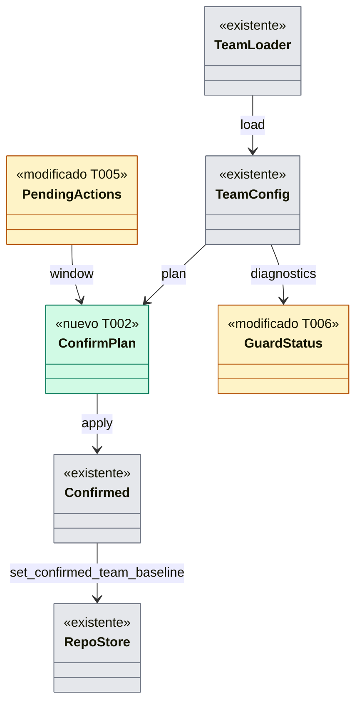

# Dev Spec — US-GRD-014: el equipo fija la rama base y Guardrails la protege

## Contexto rápido

Cuando esto esté hecho, el desarrollador confirma en su máquina, con un comando reservado, la rama base (y el resto del suelo) que el equipo fija en la rama principal. Desde entonces Guardrails protege esa rama en todos los worktrees. Mientras un cambio espera, protege también la nueva. El estado de protección y el `status` del MCP dicen qué espera confirmación y cómo confirmarlo. Hoy nada de eso es posible: la rama base solo se confirma al instalar (`main`, en un repo sin configuración del equipo).

**Invariante**: ninguna lectura confirma nada. Solo `guard.confirm` escribe lo confirmado, y solo lo que el humano vio. Mientras falta la confirmación rige la unión más restrictiva (ADR-GRD-004 § 3.5).

Lo que ya está en `main` y esta historia **no** rehace:

| Pieza | Dónde | Qué da |
|---|---|---|
| Cargador del nivel de equipo (TS-GRD-001, #27) | `crates/policy/src/team.rs`, `TeamLoader::load(reader, confirmed)` | `base_branch()`, `guarded_base_branches()` y los diagnósticos `base-unconfirmed`, `base-change-pending`, `base-change-pending-invalid`, `floor-relax-pending` y `confirmed-floor-missing` (tabla de TS-GRD-001 § 5) |
| Lo confirmado por repo | `crates/core/src/profile/team_baseline.rs`, `RepoStore::{confirmed_team_baseline, set_confirmed_team_baseline}` | Rama base y blob del suelo, juntos, en una transacción. **Sin escritor en producción**: solo la instalación escribe `main` con el suelo `Absent`, y solo en un repo sin configuración del equipo |
| Niveles (#217) | `crates/core/src/guardrails/layers.rs`; `x-gitraptor-levels: ["team"]` en `crates/policy/schema/settings.schema.json` | Un `baseBranch` en un nivel personal se descarta con `key-not-allowed-at-level`; en el worktree, con `floor-only-key` |
| Acción reservada con ventana (US-GRD-003) | `crates/core/src/guardrails/{pending,uninstall}.rs`, `crates/core/src/daemon/guard.rs`; `GUARD_UNINSTALL`, `GUARD_CANCEL` | Ventana de 10 s, cancelación, `status.pending` como anuncio y auditoría con ascendencia (D5 de ADR-GRD-007) |
| `status` del MCP (#216) | `crates/core/src/channel/mcp_status.rs`; `McpBaseState` en `crates/api/src/methods/mcp.rs` | `Pending` existe en el contrato, pero **nadie lo produce** (G1 de DS-US-MCP-004) |
| Autoría y políticas (#137 y siguientes, DS-US-GRD-008) | `crates/policy/src/settings/model.rs` (`policies.commitAuthorship`, `protectedBranches`, `forbiddenPaths`) | Las claves que relajan solo desde el suelo, que el diff de D3 tiene que mostrar |

Lo que falta, verificado en el código:

1. **Guardrails no usa `guarded_base_branches()`.** `serve_audited` (`evaluate.rs`) toma `GuardEntry.bases`, una foto fija del diario de instalación (`install.rs`, `fn bases`). El modo degradado (`hook.rs`, `fn degraded`) usa {`main`, principal} más esa foto.
2. **Lo confirmado se lee del diario, no del almacén.** `install::status` (`base_confirmed`, `protected_bases`), `health.rs` (`BaseUnconfirmed`) y `install::publish` (la foto) leen `journal.confirms_base` y `journal.protected_bases`.
3. **No hay comando de confirmación**: `GuardAction` solo tiene `Install`, `Uninstall`, `Cancel`, `Status` y `Log`.
4. **El estado de protección no conoce los demás pendientes.** `crates/api/src/guard.rs`, `enum Diagnostic`, solo tiene `BaseUnconfirmed`, sin `base-change-pending` ni `floor-relax-pending` ni la acción para confirmar.
5. **El MCP** nunca dice `pending`.

## Gaps

_Ninguno bloqueante._ Lo que queda fuera tiene dueño en § 8. Las informativas están en § 9.

## La forma



`PendingActions` es la cola de acciones reservadas de `crates/core/src/guardrails/pending.rs`, con una acción por repo; su `Entry` gana la huella. `ConfirmPlan` se declara en § 5.

## 1. Decisiones

Cada fila es una **Decisión del orquestador (2026-10-09), validada por el Arquitecto (`nassa-architect:architect`) y el PO (`nassa-aadd:product-owner`)**. Los ajustes que pidieron están incorporados y listados en § 9.

| # | Decisión |
|---|---|
| D1 | **Un solo comando reservado confirma la línea base del equipo entera**: `raptor guard confirm [<ruta>]`, método `guard.confirm`. Es reservado, `writes(RepoWrite::Guardrails)` y nunca está disponible para `raptor-mcp`. Confirma a la vez la rama base resuelta y el blob del suelo de la copia de la rama principal: la rama base es una clave del suelo, y `set_confirmed_team_baseline` guarda las dos juntas. Resuelve `base-unconfirmed`, `base-change-pending` y `floor-relax-pending`. **US-GRD-007 no añade comando**: si añade claves que relajan, añade su fila al diff (D3) |
| D2 | **Tres pasos; el humano ve el plan antes de cualquier efecto** (ADR-GRD-007 D8). (1) `guard.confirm { path }` devuelve `{ plan, fingerprint }` sin escribir ni anunciar. (2) Tras el sí, `guard.confirm { path, accept: fingerprint }`: si la huella cambió, `changed-during-window`. Si no relaja, aplica. Si relaja, abre la ventana (`PendingKind::ConfirmTeam`, con la huella guardada en `pending::Entry`); el anuncio es `status.pending`, como en la desinstalación. (3) `guard.confirm { path, confirm: action_id }` al cerrarse la ventana: vuelve a comparar y aplica. `guard.cancel` la cancela |
| D3 | **El plan** (`ConfirmPlan`, puro, en `crates/policy/src/team/confirm.rs`) lleva el origen: la ref y el commit de la copia de la rama principal y el blob del suelo (R-GRD-10). Lleva también la rama base de la referencia de D4 → la resuelta, y las **relajaciones regla a regla**, en una lista cerrada: `engine.baseBranch`; `permissions` (`allow`, `ask`, `deny`, `disableSafeMinimum`); `policies.protectedBranches`; `policies.forbiddenPaths`; `policies.commitAuthorship`. **Fail-closed**: si una clave relaja algo que el diff no sabe mostrar, no se confirma (`unshowable-relaxation`). El texto del repo va como `Untrusted` y se sanea al mostrarse (SEC-GRD-06). `FloorRelaxPending` y la pista de D8 salen de **la misma función**, que sustituye a la comparación privada de solo permisos (`EffectivePermissions::relaxes`) como criterio de "relaja" |
| D4 | **Una sola regla para la ventana.** Referencia = lo confirmado o, sin confirmación, `Confirmed { main, Absent }` (lo que habría confirmado la instalación, D9). Si `confirmed-floor-missing`, la referencia es `Confirmed { confirmada, Absent }`: más ventanas, nunca menos. **Hay ventana si la rama base difiere de la referencia o si hay alguna relajación.** Así, la primera confirmación de `develop` lleva ventana: deja de proteger `main`, y ADR-GRD-004 § 4 cuenta "quita una rama" como relajación. La rama principal no entra en la referencia, igual que en la instalación. **No se confirma**: una `baseBranch` inválida (`base-invalid`, también con `base-change-pending-invalid`, sin confirmar el resto del suelo) ni un suelo ignorado o parcial (`floor-unreadable`; con el suelo ignorado la resuelta es `main` y se confirmaría basura) |
| D5 | **Lo que se confirma es lo que se vio.** La huella incluye la ref y el commit de origen, el blob del suelo, la rama base resuelta y lo confirmado antes. El daemon la compara al aceptar y otra vez al aplicar, y antes de escribir. Si difiere, `changed-during-window`, sin escribir. Así, una confirmación concurrente desde otro cliente también se detecta |
| D6 | **Guardrails protege `guarded_base_branches()`.** `serve_audited` carga las capas para **toda** operación que consulta las bases, tenga o no `caller.policies`, con una sola carga compartida con `policies()`. El coste es el que ya pagan los hooks actuales: el `TeamLoader` tiene caché por blob. Si la carga falla, fail-safe: {`main`, principal, confirmada} ∪ `GuardEntry.bases` (ADR-GRD-004 § 3.6). Al confirmar, `publish` actualiza `GuardEntry.confirmed` |
| D7 | **Modo degradado**: `default_bases` ∪ `TeamLoader::load(reader, None).guarded_base_branches()` ∪ la confirmada de la foto. No se reconstruye un `Confirmed` desde la foto, porque la foto no lleva el blob del suelo. Siempre es al menos igual de estricto que el daemon. Si la carga falla, se aplica lo de hoy. Cubre el caso real del escenario 1: perfil perdido con los hooks instalados |
| D8 | **Lo confirmado sale del almacén, no del diario.** El diario de instalación es un registro inmutable. `install::status`, `health.rs`, `publish` y `recover` leen `confirmed_team_baseline()`, y `publish` exporta la foto desde su argumento `confirmed`. **Estado de protección** (ADR-GRD-005 § 1, D11): `Diagnostic` gana `BaseChangePending`, `BaseChangePendingInvalid` y `FloorRelaxPending`; `protected_bases` pasa a ser `guarded_base_branches()`. Un campo nuevo `confirm: Option<ConfirmHint>` dice que hay algo que confirmar con el código cerrado `guard-confirm`; el texto del comando lo pone el cliente. Con `base-invalid` no hay pista: el estado dice que hay que corregir el valor del equipo. **Una capacidad, `guard.team-confirmation`** (ADR-GRP-016), cubre los diagnósticos nuevos, `confirm` y `PendingKind::ConfirmTeam` en `status.pending`: un cliente antiguo con `guard.pending-action` no sabría decodificar esa variante. `raptor-mcp` declara la capacidad para ver los diagnósticos, pero la pista `confirm` nunca le llega |
| D9 | **`status` del MCP** (G1 de DS-US-MCP-004): `McpBaseState::Pending` cuando los diagnósticos del estado de protección traen `BaseChangePending` o `BaseChangePendingInvalid`, y **solo sustituye a `Confirmed`**: `Unconfirmed` e `Invalid` del motor mandan. El nombre sigue siendo el de la confirmada. `BaseBranchView` no cambia |
| D10 | **Registro**: el `AuditRow` de siempre, con la operación `guard.confirm` y las salidas `applied`, `cancelled`, `expired` o `changed`, la huella en `reason` y los nombres saneados. `audit_pending` (`daemon/guard.rs`) deja de tener fijo `GUARD_UNINSTALL` y toma la operación de `Entry.kind`. El intento de un agente se rechaza y se audita por `check_reserved` (`RESERVED_REFUSED`). Ninguna de estas entradas cuenta en el KPI de bloqueos |
| D11 | **Confirmar exige un repo observado, no protegido** (Q-GRD-15). La confirmada es la única rama base del repo, también para el motor y el MCP (BR-CONS-003), y sobrevive a la desinstalación. Exigir hooks dejaría un repo "Solo MCP" sin poder confirmar nunca (BR-WF-002). Un repo no observado recibe `not-observed` (reutiliza `NotObserved`) |
| D12 | **El escenario 1 se prueba sin adopción.** Adoptar una instalación huérfana es E5 de US-GRD-003 y no está en `main`. El test parte del estado equivalente: perfil nuevo e instalación en un repo con configuración del equipo, en `base-unconfirmed`. Hay un test aparte para el riesgo real: el perfil se perdió con los hooks instalados, sin adoptar, y borrar `develop` y `main` se deniega (D7). La variante con adopción la verifica US-GRD-003 E5. El Gherkin del escenario 1 se ajusta en esta misma rama (§ 9) |

## 2. Forma (archivos que se tocan)

Cada pieza nueva va en un archivo propio (ADR-GRP-016); los archivos centrales ganan una línea, salvo donde se indica.

| Pieza | Archivo |
|---|---|
| Plan, huella y relajaciones (puro) | `crates/policy/src/team/confirm.rs` (nuevo; `pub mod confirm;` en `team.rs`, sin pasarlo a `team/mod.rs`) |
| Contrato: `GuardConfirmParams`, `GuardConfirmResult`, `ConfirmPlanView`, `PendingKind::ConfirmTeam`, los `Diagnostic` nuevos, `GuardStatus.confirm` | `crates/api/src/guard.rs` |
| Método `guard.confirm` y capacidad `guard.team-confirmation` | `crates/api/src/methods/guard.rs` |
| Comando del daemon (plan, aceptar, ventana en `PendingActions`, aplicar) | `crates/core/src/guardrails/confirm.rs` (nuevo); `pending.rs` (huella en `Entry`); `crates/core/src/daemon/guard.rs` (petición y `audit_pending`); `crates/core/src/daemon/shutdown.rs` (`GuardRequest` y `GuardReply`); `crates/core/src/channel/conn.rs` (brazo nuevo y lectura de parámetros en `guard()`) |
| Bases desde el cargador | `crates/core/src/guardrails/evaluate.rs` (`serve_audited`), `hook.rs` (`degraded`), `registry.rs` |
| Lo confirmado desde el almacén | `crates/core/src/guardrails/install.rs` (`status`, `publish`, `recover`), `health.rs` |
| `status` del MCP | `crates/core/src/channel/mcp_status.rs`; `apps/mcp` (declara la capacidad) |
| CLI | `apps/cli/src/commands/guard.rs` (variante `Confirm`), `apps/cli/src/guard.rs` (plan, estado), `apps/cli/i18n/{en,es}/guard.txt` |
| Historia (Gherkin del escenario 1, dependencias, enlace a esta spec) | `docs/requirements/features/guardrails/user-stories/US-GRD-014-rama-base-del-equipo.md` |
| Tests | § 6 |

## 3. Flujo de `raptor guard confirm`

1. **Plan.** El CLI llama a `guard.confirm { path }`. El daemon comprueba la reserva (`check_reserved`): un agente recibe `RESERVED_REFUSED` y el intento queda auditado. Carga `TeamLoader::load(reader, confirmed)` y calcula el plan. Hay cinco salidas inmediatas, sin escribir nada: `not-observed`, `nothing-to-confirm` (lo resuelto ya es lo confirmado; un suelo que solo endurece rige sin confirmación), `base-invalid`, `floor-unreadable` y `unshowable-relaxation`.
2. **Mostrar.** El CLI muestra el origen, la rama base (anterior → nueva) separada de "Relajaciones (N)" y cada relajación. Si N > 0, la pregunta las nombra ("confirmas la rama base y N relajaciones") y la respuesta por defecto es "no". No hay opción para saltarse el plan. Sin respuesta, no pasa nada.
3. **Aceptar.** Con `accept: fingerprint`, el daemon recarga y compara. Si no relaja, aplica. Si relaja, abre la ventana; una acción pendiente por repo.
4. **Aplicar.** Al cerrarse la ventana, con `confirm: action_id`, el daemon recarga y compara la huella (D5), y escribe con `set_confirmed_team_baseline`. Después llama a `publish`, que actualiza `GuardEntry.confirmed` y reexporta la foto, registra la entrada y emite el cambio de estado.

## 4. Configuración

No hay claves nuevas. `engine.baseBranch` sigue siendo solo de equipo y se lee del suelo (ADR-GRP-007). Un valor en el worktree, el perfil o el local no cambia nada (escenario 3): ya lo cubren `key-not-allowed-at-level` y `floor-only-key`.

## 5. Contrato (`crates/api/src/guard.rs`)

```rust
pub struct GuardConfirmParams {            // deny_unknown_fields
    pub path: String,
    pub accept: Option<String>,            // la huella del plan que el humano vio
    pub confirm: Option<String>,           // el action_id, al cerrarse la ventana
}

pub enum GuardConfirmResult {
    Plan { plan: ConfirmPlanView, fingerprint: String },
    Applied { plan: ConfirmPlanView },
    Pending { plan: ConfirmPlanView, action: PendingAction },
    NothingToConfirm,
    BaseInvalid,
    FloorUnreadable,
    UnshowableRelaxation,
    ChangedDuringWindow,
    NotObserved,
}

pub struct ConfirmPlanView {
    pub source: Option<SourceView>,        // ref (Untrusted), commit y blob del suelo
    pub base: BaseChangeView,              // from: Option<UntrustedName>, to: UntrustedName
    pub relaxations: Vec<RelaxationView>,  // clave (código cerrado), antes y después
    pub relaxes: bool,
}

pub struct ConfirmHint { pub action: ConfirmAction }   // ConfirmAction::GuardConfirm
```

El implementador fija los nombres exactos. La forma no se toca: tres pasos, la huella, el texto no confiable y los códigos cerrados.

## 6. Criterios de aceptación verificables

Suite e2e `apps/cli/tests/guard_us_grd_014.rs`, con Git, `raptor` y `raptor-hook` reales. Repos, remotos y perfiles temporales (NFR-01). La ventana se acorta con `GITRAPTOR_TEST_GUARD_WINDOW_MS` y no hay esperas fijas. Cada test comprueba también el "Entonces" completo: el motivo nombra la protección de la rama base, y tras confirmar, borrar `main` recibe la decisión de una rama no protegida.

| Escenario de la historia | Test |
|---|---|
| 1 · Sin confirmar, `develop` y `main` protegidas; el estado dice "no confirmada" con la acción; tras confirmar, solo `develop` | `unconfirmed_team_base_guards_the_union_until_confirmed` |
| 1 · Riesgo real: perfil perdido, hooks instalados, sin adoptar | `a_lost_profile_still_guards_the_team_base_and_main` |
| 2 · Sin rama base del equipo, `main` | `without_a_team_base_main_is_guarded` |
| 3 · Un nivel personal no cambia la rama base | `a_personal_base_branch_changes_nothing` |
| 4 · Todos los worktrees comparten la rama base de la rama principal; el motivo nombra `develop` | `every_worktree_guards_the_main_branch_base` |
| 5 · Máquina nueva: protegida desde la primera operación | `a_new_machine_guards_the_team_base_from_the_first_operation` |
| 6 · Cambio pendiente: las dos protegidas; el estado y el MCP dicen `pending`; tras confirmar, solo `develop` | `a_base_change_waits_for_the_developer` |
| 6 · Un agente no confirma y el intento queda registrado | `an_agent_cannot_confirm_and_is_logged` |

Además:

| Comportamiento | Test |
|---|---|
| Nada se escribe ni se anuncia antes de aceptar el plan | `the_plan_comes_before_any_effect` |
| Primera confirmación de `develop`: ventana; si se cancela, no se confirma nada | `confirming_a_base_other_than_main_waits_for_the_window` |
| Un suelo que desactiva el mínimo: ventana y relajación en el plan | `a_relaxing_floor_is_shown_and_waits` |
| La huella cambia entre el plan y la aplicación (otro commit, o una confirmación concurrente) | `a_floor_changed_during_the_window_is_not_confirmed` |
| `baseBranch` inválida o suelo ilegible: no se confirma y no se ofrece la acción | `an_invalid_team_base_cannot_be_confirmed` · `an_unreadable_floor_cannot_be_confirmed` |
| Repo observado sin hooks ("Solo MCP"): se confirma | `a_mcp_only_repo_can_confirm_its_base` |
| Tras confirmar y reiniciar el daemon, el estado y la foto conservan la confirmada | `the_confirmed_base_survives_a_daemon_restart` |
| Plan puro: cada clave de la lista cerrada; quitar un patrón de `protectedBranches` da `floor-relax-pending` | `crates/policy` · `team::confirm::` |
| Capacidad en los dos sentidos, también `PendingKind::ConfirmTeam` oculto | `crates/core` · `team_confirmation_capability_both_ways` |
| MCP `pending` tras un cambio real que llega a la rama principal, no un estado preparado a mano | `apps/mcp` · `a_pending_base_is_declared` |

## 7. Orden de implementación

Ver § Plan de implementación: T001 → T002 → T003 → T004 → T005 → T006 → T007 → T008.

## 8. Pendientes, límites y fuera de alcance

- **Motor (US-GRP-016)**: el ahead/behind sin confirmación debe calcularse contra la resuelta, marcada "no confirmada", y eso es de US-GRP-016. Hoy `observe::base_branch` usa la confirmada o `main`. Con esta historia, el motor recibe la confirmada correcta tras confirmar. La prueba de integración "Guardrails y el motor usan el mismo valor" debe estar entre los criterios de US-GRP-016 (petición del PO).
- **MCP sin protección**: en un repo sin hooks no hay diagnósticos del estado de protección, así que el MCP no dice `pending` hasta US-GRP-016.
- **Efecto en el MCP de escritura**: con `pending` activo, `safe_rebase` y `create_worktree` empiezan a rechazarse de verdad cuando hay un cambio pendiente (BR-MCP-EDGE-002). Es comportamiento de otras historias del MCP y se avisa en el PR de implementación.
- **Adopción (US-GRD-003 E5)**: la variante del escenario 1 con adopción (D12).
- **Predicción contra la base (US-CKP-009)**: consume la confirmada; aquí no hay nada que hacer.
- **Factor del SO**: no bloquea (Q-GRD-22). Cuando exista, se aplica también a `guard.confirm`.
- **Riesgo residual R-GRD-10**: aceptado. Lo limitan el plan visible, la huella, la ventana y la auditoría.
- **Windows y Linux**: se validan después en máquinas reales, y el PR lo dice.

## 9. Validación de las decisiones

**Decisión del orquestador (2026-10-09), validada por el Arquitecto (`nassa-architect:architect`) y el PO (`nassa-aadd:product-owner`)**, con una consulta a cada uno sobre el primer borrador. Ajustes incorporados:

| Origen | Ajuste | Dónde |
|---|---|---|
| Arquitecto B1 | El plan y la huella van antes de cualquier efecto; son tres pasos, no dos | D2, § 3 |
| Arquitecto B2 | Lo confirmado se lee del almacén y no del diario (`status`, `health`, `publish`, `recover`) | D8 |
| Arquitecto B3 | Lista cerrada de lo que relaja; fail-closed si una clave no se puede mostrar | D3 |
| Arquitecto | Una sola regla de ventana: la primera confirmación de una rama distinta de `main` también la lleva; `confirmed-floor-missing`; `floor-unreadable` | D4 |
| Arquitecto | La huella guardada en `pending::Entry`, comparada dos veces, con lo confirmado antes | D5 |
| Arquitecto | Cargar las capas en toda operación con bases; el degradado con `load(reader, None)` | D6, D7 |
| Arquitecto | La capacidad oculta también `PendingKind::ConfirmTeam`; `FloorRelaxPending` y la pista salen de la función del plan | D3, D8 |
| Arquitecto | Precedencia de `Pending` en el MCP | D9 |
| Arquitecto | `audit_pending` toma la operación de `Entry.kind`; `reserved-action-pending` no existe en `main` y no se inventa | D10, D2 |
| Arquitecto | `team/confirm.rs` como submódulo; archivos que faltaban en § 2 | § 2 |
| PO 6c y Arquitecto | Confirmar exige un repo observado, no protegido (coincidieron los dos) | D11 |
| PO 2 | Test del perfil perdido sin adoptar; ajuste del Gherkin del escenario 1 y de las dependencias | D12, § 6, historia |
| PO 1 | Cada test comprueba el "Entonces" completo | § 6 |
| PO 4 | Plan con rama base y "Relajaciones (N)" separadas, "no" por defecto, sin opción para saltárselo | § 3 |
| PO 6b | Con `base-invalid` no se ofrece la acción | D8 |
| PO 5 | El test del MCP parte de un cambio real; US-MCP-004 pasa a implementada (salvo Linux y Windows, XP-39) | § 6, T008 |
| PO 3 | La prueba de integración con el motor pasa a los criterios de US-GRP-016 | § 8 |

No hubo desacuerdos entre el Arquitecto y el PO.

## Anexo de forma (perfil `backend-service`)

### 6.1 Tipos compartidos

Los de § 5, en `crates/api/src/guard.rs`. En `crates/policy`: `team::confirm::{ConfirmPlan, Fingerprint, Relaxation, RelaxedKey}`.

### 6.2 Ciclos de vida (DI)

_No aplica — no hay contenedor de dependencias: el plan es una función pura, y el cargador es el `TeamLoader` con caché acotada que ya usa `layers.rs`._

### 6.3 Firmas del stack

`team::confirm::plan(&TeamConfig, Option<&Confirmed>) -> Result<ConfirmPlan, Refusal>`; `TeamConfig::guarded_base_branches(&self) -> &[RefName]` (existente); `RepoStore::set_confirmed_team_baseline(&mut self, &Confirmed) -> Result<()>` (existente).

### 7.1 Forma del error

Los resultados de § 5 son respuestas, no errores JSON-RPC. El rechazo a un agente es el `RESERVED_REFUSED` de siempre.

### 7.2 Forma de la configuración

Sin cambios (§ 4).

### 7.3 Valores numéricos

Ventana de 10 s y gracia de 60 s (`pending.rs`); nombres truncados a 100 caracteres al mostrarse.

### 8. Modelo de datos

_No aplica — no hay almacén nuevo: se escriben las dos claves existentes de `store_meta` (`guardrails.confirmed_base_branch` y `guardrails.confirmed_floor`). La huella vive en memoria, en `pending::Entry`._

### 9. Estrategia de pruebas

§ 6.

## Gaps y violaciones de la constitución

_No gaps. Ready to implement._

## Plan de implementación

> Orden topológico (`Depende:`). Rutas relativas a la raíz del repo. T001 son los tests en rojo.

| # | Tarea | Depende | Aterriza en |
|---|---|---|---|
| T001 | Escribir la suite e2e en rojo | — | `apps/cli/tests` |
| T002 | Plan puro, huella y relajaciones | — | `crates/policy/src/team` |
| T003 | Contrato, método y capacidad | T002 | `crates/api` |
| T004 | Bases desde el cargador y lo confirmado desde el almacén | — | `crates/core/src/guardrails` |
| T005 | Comando `guard.confirm` en el daemon | T002, T003, T004 | `crates/core` |
| T006 | Estado de protección y `status` del MCP | T003, T004 | `crates/core`, `apps/mcp` |
| T007 | CLI `raptor guard confirm` y mensajes | T005, T006 | `apps/cli` |
| T008 | Verificar y documentar | T001, T007 | `docs` |

### T001 — Escribir la suite e2e en rojo

**Objetivo.** `apps/cli/tests/guard_us_grd_014.rs` con los escenarios de § 6. Todos fallan antes de implementar.

**Ubicación.**
- `apps/cli/tests/guard_us_grd_014.rs` (**CREATE**)

**Reglas**
- Repos, remotos y perfiles temporales, nunca este repo (NFR-01); sin esperas fijas; el agente es `raptor-fake-agent`.

- **Depende:** —
- **Refs:** US-GRD-014; § 6
- **Aceptación:** `cargo test -p gitraptor-cli --test guard_us_grd_014`

### T002 — Plan puro, huella y relajaciones

**Objetivo.** `team::confirm::plan`: la referencia de D4, la huella, la rama base anterior → nueva, las relajaciones de la lista cerrada y los rechazos (D3 a D5). `FloorRelaxPending` pasa a usar esta función.

**Ubicación.**
- `crates/policy/src/team/confirm.rs` (**CREATE**)
- `crates/policy/src/team.rs` (**MODIFY**: `pub mod confirm;` y el criterio de `FloorRelaxPending`)

**Reglas**
- Sin E/S; reutiliza `combine`; una clave que relaja y no se sabe mostrar da `unshowable-relaxation`.

- **Depende:** —
- **Refs:** D3, D4, D5
- **Aceptación:** `cargo test -p gitraptor-policy team::confirm`

### T003 — Contrato, método y capacidad

**Objetivo.** `guard.confirm` y sus tipos, `PendingKind::ConfirmTeam`, los diagnósticos nuevos, `GuardStatus.confirm` y la capacidad `guard.team-confirmation`.

**Ubicación.**
- `crates/api/src/guard.rs`, `crates/api/src/methods/guard.rs` (**MODIFY**)

**Reglas**
- Método reservado, nunca para `raptor-mcp`; la capacidad se declara solo en `methods/guard.rs`; `crates/api/tests/architecture.rs` sigue en verde.

- **Depende:** T002
- **Refs:** D1, D2, D8
- **Aceptación:** `cargo test -p gitraptor-api`

### T004 — Bases desde el cargador y lo confirmado desde el almacén

**Objetivo.** `serve_audited` y `degraded` protegen `guarded_base_branches()` (D6, D7). `status`, `health`, `publish` y `recover` leen `confirmed_team_baseline()` (D8).

**Ubicación.**
- `crates/core/src/guardrails/evaluate.rs`, `hook.rs`, `registry.rs`, `install.rs`, `health.rs` (**MODIFY**)

**Reglas**
- Fail-safe ante un error de lectura; el degradado nunca es menos estricto que el daemon; el diario no se reescribe.

- **Depende:** —
- **Refs:** D6, D7, D8
- **Aceptación:** `cargo test -p gitraptor-cli --test guard_us_grd_014 every_worktree_guards_the_main_branch_base`

### T005 — Comando `guard.confirm` en el daemon

**Objetivo.** Plan, aceptar, ventana, aplicar con la huella, `publish` y el registro (§ 3).

**Ubicación.**
- `crates/core/src/guardrails/confirm.rs` (**CREATE**)
- `crates/core/src/guardrails/mod.rs`, `pending.rs` (**MODIFY**)
- `crates/core/src/daemon/guard.rs`, `shutdown.rs` (**MODIFY**)
- `crates/core/src/channel/conn.rs` (**MODIFY**)

**Reglas**
- Sigue `uninstall.rs` para la ventana; una acción pendiente por repo; ninguna escritura si la huella cambió; `audit_pending` toma la operación de `Entry.kind`.

- **Depende:** T002, T003, T004
- **Refs:** D1, D2, D4, D5, D10, D11
- **Aceptación:** `cargo test -p gitraptor-cli --test guard_us_grd_014 a_base_change_waits_for_the_developer`

### T006 — Estado de protección y `status` del MCP

**Objetivo.** Los diagnósticos nuevos, `confirm` y `protected_bases` desde el cargador; `pending` en el MCP (D8, D9).

**Ubicación.**
- `crates/core/src/guardrails/install.rs` (**MODIFY**)
- `crates/core/src/channel/mcp_status.rs` (**MODIFY**)
- `apps/mcp/src/status_tests.rs` (**MODIFY**)

**Reglas**
- Sin la capacidad, la vista de hoy; el MCP nunca recibe la pista `confirm` ni ofrece `guard.confirm`.

- **Depende:** T003, T004
- **Refs:** D8, D9
- **Aceptación:** `cargo test -p gitraptor-mcp status`

### T007 — CLI `raptor guard confirm` y mensajes

**Objetivo.** La variante `Confirm`, el plan legible con "Relajaciones (N)", "no" por defecto, la espera de la ventana y las líneas de estado con la acción.

**Ubicación.**
- `apps/cli/src/commands/guard.rs`, `apps/cli/src/guard.rs` (**MODIFY**)
- `apps/cli/i18n/en/guard.txt`, `apps/cli/i18n/es/guard.txt` (**MODIFY**)

**Reglas**
- Las mismas claves y marcadores en `en` y `es`; el texto del repo, saneado; nunca sugiere cómo saltarse la protección ni el plan.

- **Depende:** T005, T006
- **Refs:** D2, D3, D8
- **Aceptación:** `cargo test -p gitraptor-cli --test guard_us_grd_014`

### T008 — Verificar y documentar

**Objetivo.** La suite completa en verde y el estado de US-GRD-014 y de US-MCP-004 (G1) en las fichas, el backlog y `release-status.md`.

**Ubicación.**
- `docs/requirements/features/guardrails/user-stories/US-GRD-014-rama-base-del-equipo.md` (**MODIFY**)
- `docs/requirements/features/mcp/user-stories/US-MCP-004-quien-mas-trabaja.md` (**MODIFY**)
- `docs/requirements/backlog.md`, `docs/requirements/release-status.md` (**MODIFY**)

**Reglas**
- No se declara hecho lo que no se verificó; `release-status.md` se regenera con `node tools/status/release-status.mjs`.

- **Depende:** T001, T007
- **Refs:** § 8
- **Aceptación:** `cargo test --workspace`
