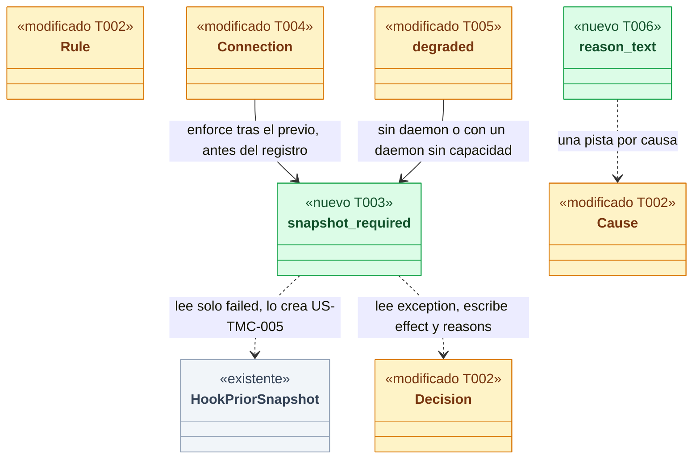
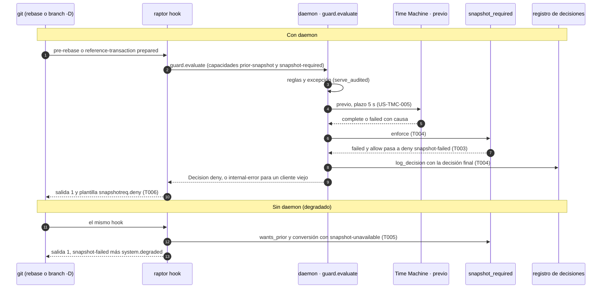
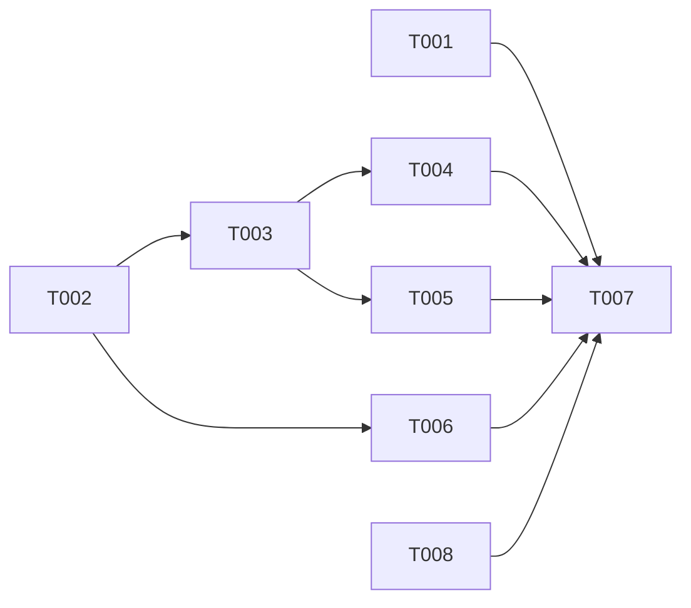

# DS-US-GRD-017 · Sin punto de recuperación, la operación destructiva no se ejecuta

## Contexto rápido

Al terminar, un rebase o un borrado de rama local con Git crudo que las reglas permiten solo se ejecuta si la Time Machine guardó antes su punto de recuperación; si no pudo, la operación no se ejecuta, la rama y el working tree quedan como estaban y el motivo lo dice. Hoy no es así: con US-TMC-005 el hook avisa del fallo y deja pasar (D11 de su Brief), y sin daemon no hay punto y nada lo impide.

Para eso: una conversión en el daemon, entre el snapshot `previo_hook` y el registro de decisiones, que cambia un `failed` por una denegación con la regla `system.snapshot-failed`; la misma denegación en el cliente del hook cuando no hay daemon (modo degradado) o el daemon es de otra versión; los mensajes; y, si US-TMC-005 no lo trae, que los cupos globales del previo solo cuenten a los agentes (Q-GRD-37). Las decisiones de negocio son de [BR-EDGE-005](../business-rules.md) (Q-GRD-11); aquí no se reabren.

**Dependencia dura**: esta Dev Spec es implementable **solo cuando US-TMC-005 esté mergeada**. Todo lo que se marca "lo crea US-TMC-005" vive hoy solo en su Brief aprobado (`docs/dev-briefs/us-tmc-005-pre-hook-snapshot.md`, rama `feat/US-TMC-005-pre-hook-snapshot`, sin PR ni commits): `Decision.priorSnapshot`, los tipos `HookPriorSnapshot` y `HookPriorFailure`, la capacidad `guard.prior-snapshot`, `timemachine::hook_prior::wants_prior`, `Connection::hook_prior`, el plazo `HOOK_PRIOR_DEADLINE` y su override de pruebas. Por eso el Brief no está en `must_read`: se leen la historia US-TMC-005 y ADR-TMC-004, y el Brief en su rama.

| Término | Qué es aquí |
|---|---|
| previo (`previo_hook`) | El snapshot de la Time Machine que el daemon toma dentro de `guard.evaluate`, antes de que Git destruya nada (ADR-TMC-004 § 3, US-TMC-005) |
| `failed` | La respuesta de la Time Machine cuando no pudo guardar el previo, con una causa: `time-limit`, `no-space`, `quota-exceeded`, `discarded`, `no-worktree`, `unavailable`, `internal` |
| alcance destructivo | Las operaciones que piden previo: `pre-rebase` (también `pull --rebase`) y `reference-transaction` `prepared` con un borrado de `refs/heads/*` (D2 del Brief de US-TMC-005) |
| modo degradado | El cliente del hook decide solo, sin daemon o con un daemon de otra instancia (ADR-GRD-003 § 4) |
| conversión | Cambiar una decisión permitida cuyo previo falló en una denegación `system.snapshot-failed` |

---

## 📋 Índice

> **Para aprobar:** [Contexto rápido](#contexto-rápido) · [Decisiones](#decisiones) · [⚠️ Gaps](#gaps-y-violaciones-de-la-constitución) · [🔭 La forma](#la-forma) · [El trabajo de un vistazo](#el-trabajo-de-un-vistazo).
> **Para implementar:** [🚀 Plan](#plan-de-implementación), en orden. Las secciones `_(ref)_` se abren desde la tarea que las cita.

| Sección | Propósito |
|---------|-----------|
| [Contexto rápido](#contexto-rápido) | Qué se construye, por qué, y el glosario |
| [Decisiones](#decisiones) | P1 a P5 del orquestador y las decisiones técnicas (a) a (f) |
| [⚠️ Gaps y violaciones de la constitución](#gaps-y-violaciones-de-la-constitución) | Qué impide empezar o liberar |
| [🔭 La forma](#la-forma) | Qué piezas quedan, qué cambia y cómo fluye |
| [🚀 Plan de implementación](#plan-de-implementación) | T001…T008, en orden |
| ↳ [El trabajo de un vistazo](#el-trabajo-de-un-vistazo) | Las tareas en una tabla, y su orden |
| [Estructura de ficheros](#estructura-de-ficheros) _(ref)_ | Árbol anotado y slices disjuntos |
| [Contratos compartidos](#contratos-compartidos) _(ref)_ | Tipos, ciclos de vida y firmas |
| [Contrato de API](#contrato-de-api) _(ref)_ | Forma de la decisión, configuración y numéricos |
| [Modelo de datos](#modelo-de-datos) _(ref)_ | Registro de decisiones: sin migración |
| [Estrategia de pruebas y cobertura](#estrategia-de-pruebas-y-cobertura) _(ref)_ | Pruebas por escenario, plataformas |
| [NFR](#nfr) _(ref)_ | Coste, NFR-01, seguridad, observabilidad |
| [Gate de seguridad](#gate-de-seguridad) | Checklist pre-merge |
| [Fuera de alcance](#fuera-de-alcance) | Lo que no se construye |
| [Notas del autor](#notas-del-autor) _(ref)_ | Lo que no bloquea |

---

## Decisiones

P1 a P5 (D1 a D5): **Decisión del orquestador (2026-10-09), validada por Arquitecto y PO.** D6 a D12: **Decisión del orquestador (2026-10-09), validada por Arquitecto.**

| # | Decisión |
|---|---|
| D1 (P1) | **Alcance destructivo = el de US-TMC-005 D2**, sin lista propia: la conversión solo actúa donde el daemon tomó el previo, y el cliente del hook usa la misma función pura `hook_prior::wants_prior(&Operation)` (lo crea US-TMC-005). Entran `pre-rebase` (también `pull --rebase`) y el borrado de una rama local. **El alcance es la capa de hooks**: el daemon y su ejecutor (Cockpit, MCP) ya llevan su propio previo garantizado (ADR-GRD-003, Enmienda Cockpit). **Límites declarados de BR-EDGE-005**: (1) **remoto**: un force-push que llega a ejecutarse, sea con la excepción consciente o porque el equipo relajó el mínimo y el humano confirmó esa relajación (Q-GRD-21), y el borrado de una rama remota, pasan sin previo. La Time Machine no guarda el remoto; se reabre cuando lo guarde, y lo complementa US-TMC-014. (2) **Sin aviso previo**: `checkout`, `reset --hard` y `restore` con Git crudo, y el retroceso de una rama sin borrado (`branch -f`, `update-ref`, un renombrado que no borra ninguna `refs/heads/*` a la vista del hook) no tienen previo (ADR-GRD-002, BR-EDGE-003); los cubre la observación (US-TMC-004) |
| D2 (P2) | **Modo degradado**: sin daemon no hay previo, así que una operación del alcance D1 que el cliente permitiría se **deniega** con `system.snapshot-failed` (causa `snapshot-unavailable`) más la razón `system.degraded` con su causa (`daemon-unreachable` o `instance-mismatch`). Nunca es menos estricto que el modo normal (Q-GRD-36: decisión del orquestador validada por el PO, abierta a veto de Rene). Sin excepción en degradado (ADR-GRD-007 § 3, paso 9; BR-AUTH-003). El motivo dice "arranca GitRaptor y repite la operación" (`snapshotreq.hint.start`). Hoy `fn degraded` solo añade `system.degraded` si `effect != allow`; la conversión se hace **antes** de ese bloque, así que la razón degradada se añade también. **Registro**: en degradado no hay entrada, porque el spool está diferido (ADR-GRD-006 § 5). Es coherente con el KPI: cuando exista, una entrada del spool queda fuera del KPI por defecto (`spool-unverified`, Q-GRD-27) |
| D3 (P3) | **Archivo enorme (G2 de US-TMC-005)**: sin tope de 50 MB ni previo parcial. El plazo vencido da `failed` `time-limit` y se deniega con causa `snapshot-time-limit`. El mensaje lleva una pista neutra (ignorar o mover el archivo grande sin commitear, o reintentar) y nunca menciona la excepción (ADR-GRD-003 § 3). **Límite declarado**: un worktree con un archivo nuevo de cientos de MB bloquea el rebase y el borrado de ramas hasta que se ignore o se mueva |
| D4 (P4) | **Todo `failed` deniega**, sea cual sea la causa, también `quota-exceeded`, `unavailable` y `no-worktree`. Verificado: **un repo protegido puede quedar sin observar**. `retire_repo` (`crates/core/src/daemon/repos.rs:242`) quita el repo de la Time Machine (`self.tm.remove`) y no de `GuardRegistry`; tras reiniciar, `recover_guardrails` (`crates/core/src/daemon/guard.rs:383`) solo publica repos observados, y `serve_audited` (`crates/core/src/guardrails/evaluate.rs:289`) evalúa igual con las ramas base por defecto. US-TMC-005 responde entonces `unavailable` (su D4). Decisión (Q-GRD-38): **se deniega**. Sin observación no hay punto al que volver, y dejar pasar contradiría Q-GRD-11. El motivo dice que el repo ya no está observado y cómo volver a observarlo (`raptor repo add`), sin mencionar cómo quitar la protección (`snapshotreq.hint.unobserved`). El aviso antes de retirar un repo protegido es de US-GRP-001 (traspaso N3). En el daemon real `tm_engine` siempre es `Some` (`crates/core/src/daemon/serve.rs:93`). La cuota no deja a la persona sin previo por culpa de un agente (D13) |
| D5 (P5) | **Excepción consciente** (US-GRD-006, en draft): con `exception = applied` el previo se intenta igual. Si falla, la conversión **no** cambia `appliedEffect` (sigue `allow`), pone `effect = deny` y añade la razón `system.snapshot-failed` con su causa. Así la entrada `exception` de US-GRD-006 anota la regla saltada sin tocar este código. **Punto de enganche**: la conversión lee solo `Decision.exception`. US-GRD-006 debe poner `applied` cuando un token válido cubre la transición **aunque las reglas permitan**, antes de la conversión (traspaso en § Notas, N4). El escenario de la excepción ("con GitRaptor en marcha", el último de la historia) se verifica con US-GRD-006; hasta entonces la historia queda `partially-implemented` |
| D6 (a) | **Contrato**. Regla nueva `Rule::SnapshotFailed` = `system.snapshot-failed`, nivel `system` (ya listada en ADR-GRD-003 § 3). Causa en `Reason.cause`, con siete variantes nuevas de `Cause`, una por cada `HookPriorFailure`, con prefijo para que no choquen: `snapshot-time-limit`, `snapshot-no-space`, `snapshot-quota-exceeded`, `snapshot-discarded`, `snapshot-no-worktree`, `snapshot-unavailable`, `snapshot-internal`. Va en `cause` y no en `params` porque el registro guarda `{rule, level, cause}` sin parámetros (ADR-GRD-006, Enmienda US-GRD-005), y así `raptor guard log` dice por qué. **Capacidad nueva `guard.snapshot-required`**, porque `guard.prior-snapshot` no basta: un cliente de la ventana US-TMC-005 la tiene y no conoce la regla ni las causas (`Rule` y `Cause` fallan con una variante desconocida, y `Decision` es `deny_unknown_fields`). Siguiendo el precedente de `guard.config-protection` (`config_guard::legacy_decision`), a una conexión sin la capacidad la denegación le llega igual, como `system.internal-error` sin causa y **sin** `priorSnapshot`, para que no imprima el "sigue adelante" de US-TMC-005. Nunca le llega como un permiso. Lo mismo en `guard.log` |
| D7 (b) | **Orden en el brazo `GUARD_EVALUATE`** (`crates/core/src/channel/conn.rs:867`): `serve_audited` (aquí US-GRD-006 pondrá la excepción) → `commit_decisions.record` → previo (US-TMC-005: `decision.prior_snapshot = self.hook_prior(..)`) → **conversión** (`snapshot_required::enforce`) → `log_decision` → `hook_claims` → mapeos para clientes viejos (`config_guard` y `snapshot_required::legacy_decision`) → respuesta. El registro y los claims ven la decisión final: una denegación deja entrada `denial` y no deja claims. **Reutilización (D3 de US-TMC-005)**: la conversión no distingue un `failed` nuevo de uno reutilizado, así que otra evaluación del mismo `git` también se deniega. **Deduplicación (ADR-GRD-003 § 6)**: no se añade mecanismo. Tras un deny Git aborta (medido, D10), así que el mismo `git` no vuelve a evaluar la misma transición; una transición distinta deja su propia entrada, como manda el § 6 |
| D8 (c) | **Salida del hook**. Con la denegación, el hook imprime la plantilla fija `snapshotreq.deny` con la causa y una pista por causa, y **no** imprime el aviso `hookprior.failed` de US-TMC-005. Ese aviso queda solo para `appliedEffect = allow` con `priorSnapshot = failed`, que tras esta historia solo ocurre con la excepción aplicada. Las claves nuevas van en un archivo propio, grupo `snapshotreq.` (`apps/cli/i18n/{en,es}/snapshotreq.txt`, ADR-GRP-016). El "por qué" de cada causa tiene texto propio (`snapshotreq.cause.*`) con la redacción de la historia ("se agotó el plazo para guardarlo"; en degradado, "GitRaptor no está en marcha; arranca GitRaptor y repite la operación"), así no depende de los textos de aviso de US-TMC-005. Ningún texto menciona la excepción ni cómo quitar la protección |
| D9 (d) | **Registro y KPI**. Una denegación `snapshot-failed` es una entrada `kind = denial` con la regla y la causa, y **cuenta en el KPI "acciones bloqueadas"**, como hoy cuentan las demás denegaciones `system.*` (`internal-error`, `degraded`, `unverifiable`): la consulta suma todo `denial` (`crates/core/src/profile/guard_log.rs:169`). Excluir del KPI las denegaciones de sistema sería un cambio de ADR-GRD-006 § 6 para todas ellas, no de esta historia (pregunta al PO, N2). Con la excepción aplicada la entrada es `exception` (US-GRD-006) y no cuenta. En degradado no hay entrada: el spool está diferido (ADR-GRD-006, Enmienda US-GRD-005) |
| D10 (e) | **Atomicidad**, medida con Git 2.50.1 (macOS). Un deny en `reference-transaction` `prepared` aborta la transacción (`fatal: ref updates aborted by hook`, salida 128): la rama sigue con sus commits. `git branch -D a b` es **una** transacción, así que las dos ramas siguen. Un deny en `pre-rebase` impide empezar el rebase. Con `--autostash`, Git ya creó el autostash y `rebase-merge/` antes del hook, y al rechazar **reaplica el autostash** ("Applied autostash") y borra `rebase-merge/`: el working tree queda como estaba (también con `pull --rebase --autostash`; el `fetch` previo ya actualizó `origin/*`, que no destruye nada). NFR-01 se cumple sin código propio |
| D11 | **Cliente del hook frente a un daemon sin la capacidad** (un daemon que rechazó el reemplazo, ADR-GRP-016 § 1). Igual que M-05 de US-GRD-008, un daemon de otra versión nunca deja menos que el modo degradado. Con `guard.prior-snapshot` y sin `guard.snapshot-required`, el cliente hace él la conversión con el `priorSnapshot` recibido. Sin ninguna de las dos, una operación del alcance D1 permitida se deniega con `snapshot-unavailable`. Residuo declarado: en ese caso también el `git` del ejecutor (Cockpit, MCP), que ya tenía previo garantizado |
| D12 | **Coste**: solo la conversión (comparaciones en memoria, sin E/S) en el daemon y `wants_prior` (pura) en el cliente degradado. Ninguna lectura, ninguna llamada nueva, ningún campo nuevo en la petición. El plazo del previo (5 s) es de US-TMC-005 y cabe en `CALL_TIMEOUT` (10 s) |
| D13 | **Cupos globales solo para agentes** (Q-GRD-37, opción b; decisión del orquestador validada por el PO, abierta a veto de Rene). Los cupos por worktree (300 en 24 h) y por repo (1.000 en 24 h) del previo de hook **solo cuentan y solo se aplican** a peticiones de agentes detectados o registrados. La persona y "sin atribuir" solo gastan su cupo por solicitante (10 por minuto y 120 en 24 h por worktree). **Implementable sin migración nueva**: en la fila `hook-prior` de US-TMC-005, `requester` es el JSON de `Requester` (`to_json`, como `begin_manual_snapshot` en `crates/core/src/timemachine/oplog/mod.rs:384`) y `requester_session` es `Requester::session_id()`, que solo existe para `Requester::Agent` (`oplog/model.rs:167`). El `CHECK` de la migración 4 deja `requester_session` en `NULL` para "sin atribuir". Así, "agente" equivale a `requester_session IS NOT NULL`. Las dos consultas globales añaden ese predicado sobre los índices parciales `(worktree_key, recorded_ms)` y `(recorded_ms)` que ya crea la migración 4; el filtro residual recorre filas de 24 h acotadas por los propios cupos. `hook_prior::quota` salta las ventanas globales si el solicitante no es agente. **Dónde vive**: en US-TMC-005 si aún está en curso (el orquestador se lo pasa a su worker); si se mergea sin ello, lo hace T008 de esta DS. Residuo: un agente no detectado cuenta como persona (R-GRD-2) y puede agotar su cupo propio |

---

## ⚠️ Gaps y violaciones de la constitución

| ID | Qué falta | Severidad | Alcance | Acción | Owner |
|----|-----------|-----------|---------|--------|-------|
| G1 | US-TMC-005 no está mergeada. Su rama `feat/US-TMC-005-pre-hook-snapshot` no tiene commits sobre `main` (`e9dfa23b`), y todo lo que esta Dev Spec consume (`Decision.priorSnapshot`, `HookPriorSnapshot`, `HookPriorFailure`, `guard.prior-snapshot`, `wants_prior`, `Connection::hook_prior`, override de plazo) solo existe en su Brief | Bloqueante | todo el spec | Mergear US-TMC-005; después quitar esta fila y poner `ready_to_implement: true` | Orquestador |
| G2 | El escenario de la excepción ("con GitRaptor en marcha", el último de la historia) no tiene mecanismo: US-GRD-006 está en `draft` y `ExceptionState::Applied` no lo produce nadie (`crates/api/src/guard.rs:166`). La historia la marca como dependencia blanda del mismo hito | Bloquea liberación | T007 | Liberar US-GRD-017 como `partially-implemented`; el e2e de ese escenario va en la Dev Spec de US-GRD-006, que cumple el punto de enganche D5 | Orquestador / US-GRD-006 |

Lo que no bloquea va en [Notas del autor](#notas-del-autor).

---

## 🔭 La forma

Queda una conversión pura en `crates/core/src/guardrails/snapshot_required.rs`, que el daemon llama entre el previo y el registro y que el cliente del hook reutiliza en degradado y frente a un daemon viejo. El contrato gana una regla, siete causas y una capacidad.



🟩 nuevo · 🟨 modificado · ⬜ existente (contexto: no cambia). Cada pieza dice qué tarea la toca.

Lo que el diagrama hace obvio: hay una sola conversión y la usan el daemon y el cliente. Por eso degradado y modo normal no pueden divergir.

**Cómo fluye:**



El paso que decide es el 6: está **antes** de `log_decision` y de `hook_claims`, así que el registro y los claims ven la denegación. El cambio de contrato publicado está en el paso 9: la regla nueva solo llega con `guard.snapshot-required`.

---

## 🚀 Plan de implementación

> Se ejecuta en orden topológico (`Depende:`), **después de mergear US-TMC-005 (G1)**. Una casilla se marca cuando su `Aceptación` está verificada. Las rutas son relativas a la raíz del repo.

### El trabajo de un vistazo

Tres frentes y un cierre: pruebas en rojo (T001), contrato y conversión (T002 a T004), cliente del hook y mensajes (T005, T006), y verificación y documentación (T007).

| # | Tarea | Depende | Aterriza en |
|---|---|---|---|
| T001 | Escribir las pruebas en rojo por escenario | — | `apps/cli/tests`, `crates/core/tests` |
| T002 | Añadir la regla, las causas y la capacidad al contrato | — | `crates/api/src` |
| T003 | Crear la conversión y su forma para clientes viejos | T002 | `crates/core/src/guardrails` |
| T004 | Enganchar la conversión en guard.evaluate y guard.log | T003 | `crates/core/src/channel` |
| T005 | Denegar en el cliente del hook sin daemon o con un daemon viejo | T003 | `crates/core/src/guardrails` |
| T006 | Mostrar el motivo y limitar el aviso de US-TMC-005 | T002 | `apps/cli` |
| T007 | Verificar y documentar | T001, T004, T005, T006, T008 | `docs` |
| T008 | Contar los cupos globales del previo solo para agentes (si US-TMC-005 no lo trae) | — | `crates/core/src/timemachine` |

### En qué orden

Una cadena corta con dos ramas paralelas tras la conversión (daemon y cliente), los mensajes en paralelo desde el contrato y T008 independiente.



### T001 — Escribir las pruebas en rojo por escenario

**Objetivo.** Las suites nuevas con un test por escenario y por decisión de § Estrategia de pruebas, en rojo antes de implementar. No cubre el escenario de la excepción (G2).

**Ubicación.**
- `apps/cli/tests/us_grd_017_hook.rs` (**CREATE**)
- `crates/core/tests/us_grd_017.rs` (**CREATE**)

**Reglas**
- Repos, remotos, perfiles y daemons temporales, nunca este repo (NFR-01); Git, `raptor` y `raptor-hook` reales; el agente es `raptor-fake-agent` (patrón `apps/cli/tests/guard_us_grd_008.rs`); `#![cfg(unix)]`, y la suite se niega a correr sin *debug assertions*.
- El fallo del previo se induce con `GITRAPTOR_TEST_TM_HOOK_PRIOR_DEADLINE_MS=0` en el entorno del daemon de la prueba (override solo debug de US-TMC-005); nunca con esperas fijas ni archivos de 1 GB.
- Cada estado se espera con un plazo y una señal explícita (salida del proceso, texto en stderr, `raptor guard log --json`).
- Los nombres empiezan por el escenario (`scenario_1_`, `scenario_2_`) o por la decisión (`degraded_`, `legacy_`).

- **Depende:** —
- **Refs:** US-GRD-017; § Estrategia de pruebas
- **Aceptación:** `cargo test -p gitraptor-cli --test us_grd_017_hook` falla en rojo por comportamiento, no por compilación

### T002 — Añadir la regla, las causas y la capacidad al contrato

**Objetivo.** `Rule::SnapshotFailed`, las siete `Cause::Snapshot*` y `CAP_GUARD_SNAPSHOT_REQUIRED`, sin códigos de error nuevos.

**Ubicación.**
- `crates/api/src/guard.rs` (**MODIFY**)
- `crates/api/src/methods/guard.rs` (**MODIFY**)

**Reglas**
- La capacidad se declara solo en `methods/guard.rs` y se añade a `GROUP.capabilities` (ADR-GRP-016); `crates/api/tests/architecture.rs` sigue en verde.
- Los nombres en el cable son los de § Contratos compartidos, literal.

- **Depende:** —
- **Refs:** D6; ADR-GRP-016 § 1; extender-sin-archivos-compartidos.md § Añadir una capacidad
- **Aceptación:** `cargo test -p gitraptor-api`

### T003 — Crear la conversión y su forma para clientes viejos

**Objetivo.** `snapshot_required.rs` con `cause`, `enforce`, `legacy_decision`, `legacy_log`, `degraded_reason` y `client_fallback`, todas puras, con sus pruebas unitarias.

**Ubicación.**
- `crates/core/src/guardrails/snapshot_required.rs` (**CREATE**)
- `crates/core/src/guardrails/snapshot_required_tests.rs` (**CREATE**)
- `crates/core/src/guardrails/mod.rs` (**MODIFY**, dos líneas `mod`)

**Pasos**
1. Escribir `enforce`: solo actúa con `priorSnapshot = failed` y `appliedEffect = allow`; añade la razón, pone `effect = deny`; sin excepción aplicada, pone `appliedEffect = deny` y vacía `notices`.
   1.1 ⛔3.1 No usar `evaluate::system_deny`: crea otra decisión con otro `decisionId` y `configStatus` `not-read`, y pierde la causa.
2. Con `exception = applied`, conservar `appliedEffect = allow` (D5).
3. Escribir `legacy_decision` y `legacy_log`: `SnapshotFailed` pasa a `InternalError` sin causa, y la decisión pierde `priorSnapshot`.
   3.1 ⛔3.2 Nunca convertir la denegación en un permiso para un cliente viejo.
4. Escribir `client_fallback` con la tabla de D11 y `degraded_reason` con `snapshot-unavailable`.

- **Depende:** T002
- **Refs:** D5, D6, D7, D11
- **Aceptación:** `cargo test -p gitraptor-core guardrails::snapshot_required`
- **Guard ⛔3.1:** `snapshot_required_tests::enforce_keeps_the_decision_id_and_config_status`
- **Guard ⛔3.2:** `snapshot_required_tests::legacy_decision_stays_a_denial_without_prior_field`

### T004 — Enganchar la conversión en guard.evaluate y guard.log

**Objetivo.** Una línea en el brazo `GUARD_EVALUATE`, justo después del previo de US-TMC-005, y el mapeo para clientes sin `guard.snapshot-required` en la respuesta y en `guard.log`.

**Ubicación.** `crates/core/src/channel/conn.rs` (**MODIFY**)

**Pasos**
1. Llamar a `snapshot_required::enforce(&mut decision)` después de `decision.prior_snapshot = self.hook_prior(..)` y antes de `self.log_decision(..)`.
   1.1 ⛔4.1 Si va después de `log_decision` o de `hook_claims`, el registro guarda un permiso y un agente deja claims de una operación que no ocurrió.
2. Tras `hook_claims`, junto al `config_guard::legacy_decision` que ya existe: si la conexión no tiene `guard.snapshot-required`, `snapshot_required::legacy_decision(&mut decision)`.
3. En `guard_log` (`conn.rs:1363`), el mismo criterio con `legacy_log`.

- **Depende:** T003
- **Refs:** D7, D9
- **Aceptación:** `cargo test -p gitraptor-core --test us_grd_017`
- **Guard ⛔4.1:** `us_grd_017_hook::scenario_2_denial_reaches_the_decision_log_with_its_cause`

### T005 — Denegar en el cliente del hook sin daemon o con un daemon viejo

**Objetivo.** En `fn degraded`, convertir antes de añadir `system.degraded`; en `decide`, aplicar `client_fallback` según las capacidades concedidas.

**Ubicación.** `crates/core/src/guardrails/hook.rs` (**MODIFY**)

**Pasos**
1. En `degraded` (`hook.rs:716`), tras `evaluate_commit`: si `wants_prior(op)` y `eval.effect == allow`, añadir `degraded_reason()` y poner `effect = deny`.
   1.1 ⛔5.1 Hacerlo **antes** del bloque `if eval.effect != Effect::Allow`; si va después, la denegación sale sin la razón `system.degraded`.
2. Cambiar `Asked::Decision(Decision, bool)` por las capacidades concedidas (`policies`, `prior_snapshot`, `snapshot_required`) y llamar a `client_fallback` en `decide`.

- **Depende:** T003
- **Refs:** D2, D11; ADR-GRD-003 § 4
- **Aceptación:** `cargo test -p gitraptor-cli --test us_grd_017_hook scenario_2_degraded`
- **Guard ⛔5.1:** `us_grd_017_hook::scenario_2_degraded_mode_denies_branch_delete_and_rebase` (comprueba las dos razones)

### T006 — Mostrar el motivo y limitar el aviso de US-TMC-005

**Objetivo.** Plantilla fija y pista por causa en en/es; `raptor guard log` nombra la regla; el aviso "sigue adelante" solo con `appliedEffect = allow`.

**Ubicación.**
- `apps/cli/src/guard/snapshot_required.rs` (**CREATE**)
- `apps/cli/src/guard.rs` (**MODIFY**: `mod snapshot_required;`, un brazo en `reason_text`, un brazo en `log_rule_text`, la condición del aviso de US-TMC-005)
- `apps/cli/i18n/en/snapshotreq.txt` (**CREATE**)
- `apps/cli/i18n/es/snapshotreq.txt` (**CREATE**)
- `apps/cli/i18n/en/guard.txt`, `apps/cli/i18n/es/guard.txt` (**MODIFY**, solo `guard.install.unavailable`)

**Reglas**
- Claves solo del grupo `snapshotreq.` en su archivo: `snapshotreq.deny`, `snapshotreq.cause.*` (una por causa, con la redacción de la historia: "se agotó el plazo para guardarlo"; "GitRaptor no está en marcha"; "el repositorio ya no está observado") y `snapshotreq.hint.*` (`start`: "arranca GitRaptor y repite la operación"; `unobserved`: "vuelve a observarlo con raptor repo add y repite la operación"; `large-file`, `no-space`, `retry`, `no-worktree`), más `snapshotreq.log.rule`.
- `guard.install.unavailable` añade "borrar ramas" a lo que queda bloqueado si GitRaptor falta o falla: con D2 es verdad, y la explicación del permiso (BR-AUTH-002) no puede quedarse corta.
- Ningún texto menciona la excepción, `raptor guard exec` ni cómo quitar la protección (ADR-GRD-003 § 3, M-05).

- **Depende:** T002
- **Refs:** D3, D4, D8; extender-sin-archivos-compartidos.md § Añadir un mensaje
- **Aceptación:** `cargo test -p gitraptor-cli guard::snapshot_required` (incluye `messages_never_mention_the_exception` y `every_cause_has_a_hint`)

### T007 — Verificar y documentar

**Objetivo.** Suites en verde, enmiendas, estado de la historia y pendientes multiplataforma.

**Ubicación.**
- `docs/architecture/decisions/ADR-GRD-003-motor-decision-contrato.md` (**MODIFY**: Enmienda US-GRD-017: regla, causas, capacidad, conversión en el daemon, garantía del modo degradado)
- `docs/architecture/decisions/ADR-TMC-004-cobertura-dos-niveles.md` (**MODIFY**: "con `failed`, se deniega (US-GRD-017)" en la Enmienda de US-TMC-005)
- `docs/requirements/features/guardrails/user-stories/US-GRD-017-sin-snapshot-no-se-ejecuta.md` (**MODIFY**: `status: partially-implemented`)
- `docs/architecture/xplat-pendientes.md` (**MODIFY**: fila nueva para Linux y Windows)
- `docs/requirements/backlog.md`, `docs/requirements/release-status.md` (**MODIFY**)

**Reglas**
- No se declara verificado lo que no se corrió: Windows y Linux quedan pendientes; `release-status.md` se regenera con `node tools/status/release-status.mjs`.

- **Depende:** T001, T004, T005, T006, T008
- **Refs:** G2; § 9.5
- **Aceptación:** `cargo test --workspace` y `cargo clippy --workspace --all-targets -- -D warnings`

### T008 — Contar los cupos globales del previo solo para agentes (si US-TMC-005 no lo trae)

**Objetivo.** Q-GRD-37 (D13). **Primero se comprueba si US-TMC-005 se mergeó con ello**: si su `hook_prior::quota` ya salta las ventanas globales para "sin atribuir" y sus consultas filtran por agente, esta tarea solo escribe los tests de abajo (que deben pasar sin tocar código) y no modifica nada de la Time Machine.

**Ubicación.**
- `crates/core/src/timemachine/hook_prior.rs` (**MODIFY**, solo si US-TMC-005 no lo trae)
- `crates/core/src/timemachine/oplog/query.rs` (**MODIFY**, `hook_prior_quota_input`, ídem)
- `crates/core/tests/us_grd_017_quota.rs` (**CREATE**)

**Pasos**
1. En `Oplog::hook_prior_quota_input`, añadir `AND requester_session IS NOT NULL` a las consultas `worktree_ms` y `repo_ms`; con `session = None`, devolver esas dos listas vacías.
   1.1 ⛔8.1 No filtrar parseando el JSON de `requester`: `requester_session` ya lo dice y usa los índices parciales de la migración 4.
2. En `hook_prior::quota`, aplicar las ventanas globales solo si el solicitante es un agente; la ventana por solicitante no cambia (los "sin atribuir" comparten un cubo por worktree, `requester_session IS NULL`).
   2.1 ⛔8.2 Nunca quitar la ventana por solicitante a "sin atribuir": sin ella, un agente no detectado tendría previos ilimitados.
3. Si un test de US-TMC-005 llenaba las ventanas globales con peticiones "sin atribuir", adaptarlo a agentes en este mismo PR.

- **Depende:** —
- **Refs:** D13; Q-GRD-37; US-TMC-005 D6
- **Aceptación:** `cargo test -p gitraptor-core --test us_grd_017_quota`
- **Guard ⛔8.1:** `us_grd_017_quota::global_windows_count_only_agent_rows`
- **Guard ⛔8.2:** `us_grd_017_quota::unattributed_keeps_its_own_window`

---

> Las secciones siguientes son de referencia. Se abren desde la tarea que las cita, no se leen en orden.

## Estructura de ficheros

```text
<raíz>/                                           # ADR-GRP-016: un archivo propio por pieza
├── crates/api/src/
│   ├── guard.rs                                  ← MODIFY  Rule, Cause (D6)
│   └── methods/guard.rs                          ← MODIFY  CAP_GUARD_SNAPSHOT_REQUIRED
├── crates/core/src/
│   ├── guardrails/
│   │   ├── snapshot_required.rs                  ← CREATE  conversión pura (D5, D7, D11)
│   │   ├── snapshot_required_tests.rs            ← CREATE
│   │   ├── mod.rs                                ← MODIFY  dos líneas mod
│   │   └── hook.rs                               ← MODIFY  degradado y daemon viejo (D2, D11)
│   └── channel/conn.rs                           ← MODIFY  brazo GUARD_EVALUATE y guard_log (D7)
│   └── timemachine/{hook_prior.rs, oplog/query.rs} ← MODIFY  solo si US-TMC-005 no trae D13 (T008)
├── crates/core/tests/us_grd_017.rs               ← CREATE
├── crates/core/tests/us_grd_017_quota.rs         ← CREATE  T008
├── apps/cli/
│   ├── src/guard.rs                              ← MODIFY  dos brazos y la condición del aviso
│   ├── src/guard/snapshot_required.rs            ← CREATE  textos de la regla y pistas
│   ├── i18n/{en,es}/snapshotreq.txt              ← CREATE  grupo snapshotreq.
│   ├── i18n/{en,es}/guard.txt                    ← MODIFY  guard.install.unavailable
│   └── tests/us_grd_017_hook.rs                  ← CREATE
└── docs/                                         ← MODIFY  T007
```

`← CREATE`: fichero nuevo. `← MODIFY`: fichero existente.

**Slices disjuntos** (sin archivos en común; `conn.rs` y `apps/cli/src/guard.rs` también los toca US-TMC-005, por eso G1 va primero):

| Slice | Archivos | Tareas |
|---|---|---|
| S1 contrato | `crates/api/src/guard.rs`, `crates/api/src/methods/guard.rs` | T002 |
| S2 núcleo | `crates/core/src/guardrails/{snapshot_required.rs, snapshot_required_tests.rs, mod.rs, hook.rs}`, `crates/core/src/channel/conn.rs` | T003, T004, T005 |
| S3 CLI | `apps/cli/src/guard.rs`, `apps/cli/src/guard/snapshot_required.rs`, `apps/cli/i18n/{en,es}/{snapshotreq,guard}.txt` | T006 |
| S4 cupos (condicional) | `crates/core/src/timemachine/hook_prior.rs`, `crates/core/src/timemachine/oplog/query.rs`, `crates/core/tests/us_grd_017_quota.rs` | T008 |
| Tests | `apps/cli/tests/us_grd_017_hook.rs`, `crates/core/tests/us_grd_017.rs` (no se editan durante la ejecución, R4) | T001 |
| Docs | los de T007 | T007 |

---

## Contratos compartidos

### Tipos y datos compartidos

```rust
// crates/api/src/guard.rs (MODIFY)
pub enum Rule {
    // …
    /// An allowed destructive operation whose prior snapshot failed (US-GRD-017, BR-EDGE-005).
    /// Only with `guard.snapshot-required`; without it the daemon sends `system.internal-error`.
    #[serde(rename = "system.snapshot-failed")]
    SnapshotFailed,
}
pub enum Cause {
    // … (kebab-case: `snapshot-time-limit`, …)
    SnapshotTimeLimit,
    SnapshotNoSpace,
    SnapshotQuotaExceeded,
    SnapshotDiscarded,
    SnapshotNoWorktree,
    /// No Time Machine for this repo, or no daemon (degraded mode).
    SnapshotUnavailable,
    SnapshotInternal,
}

// crates/api/src/methods/guard.rs (MODIFY)
/// `system.snapshot-failed` and its causes in decisions and in `guard.log`. A connection without
/// it receives the same denial as `system.internal-error`, without cause and without
/// `priorSnapshot`.
pub const CAP_GUARD_SNAPSHOT_REQUIRED: Capability = Capability::new("guard.snapshot-required");

// Lo crea US-TMC-005 (Brief, § Wire): no se redefine aquí.
//   gitraptor_api::timemachine::{HookPriorSnapshot, HookPriorFailure}
//   Decision.prior_snapshot: Option<HookPriorSnapshot>   (JSON `priorSnapshot`)
//   methods::CAP_GUARD_PRIOR_SNAPSHOT                    ("guard.prior-snapshot")
//   gitraptor_core::timemachine::hook_prior::{wants_prior, DEADLINE_ENV}

// crates/core/src/guardrails/snapshot_required.rs (CREATE)
/// What the daemon granted to the hook client (D11).
#[derive(Debug, Clone, Copy, Default, PartialEq, Eq)]
pub struct Granted {
    pub policies: bool,
    pub prior_snapshot: bool,
    pub snapshot_required: bool,
}
```

### Ciclos de vida (DI)

_No aplica — no hay contenedor de dependencias ni estado ambiental: la conversión es una función pura sin estado; la memoria por `git` (reutilización) es de US-TMC-005 (`HookPriorBook`)._

### Firmas del stack

```rust
// crates/core/src/guardrails/snapshot_required.rs
pub fn cause(failure: HookPriorFailure) -> Cause;            // total, 1:1
pub fn enforce(decision: &mut Decision);                      // D5, D7: daemon, tras el previo
pub fn legacy_decision(decision: &mut Decision);              // D6: conexión sin la capacidad
pub fn legacy_log(log: &mut GuardLogResult);                  // D6: guard.log sin la capacidad
pub fn degraded_reason() -> Reason;                           // D2: SnapshotFailed + SnapshotUnavailable
pub fn client_fallback(op: &Operation, decision: &mut Decision, granted: Granted); // D11

// crates/core/src/channel/conn.rs: struct Connection<'a> (existente, sin firmas nuevas). Brazo
// GUARD_EVALUATE: serve_audited → commit_decisions → self.hook_prior (US-TMC-005)
// → snapshot_required::enforce → log_decision → hook_claims → legacy_decision → reply.

// crates/core/src/guardrails/hook.rs (existente, sin firmas nuevas):
// fn degraded(args, op, cause) -> HookOutcome; Asked::Decision lleva Granted en vez de bool.

// apps/cli/src/guard/snapshot_required.rs
pub(super) fn reason_text(reason: &Reason) -> String;         // snapshotreq.deny + pista
pub(super) fn log_rule_key() -> &'static str;                 // snapshotreq.log.rule
```

---

## Contrato de API

> Sin método nuevo: cambia la forma de `guard.evaluate` y de `guard.log` (protocolo 9, capacidad `guard.snapshot-required`). Sin códigos de error JSON-RPC nuevos.

| Conexión | Previo falla y las reglas permiten | Qué recibe |
|---|---|---|
| Con `guard.prior-snapshot` y `guard.snapshot-required` | sí | `deny`, razón `system.snapshot-failed` con causa, `priorSnapshot` `failed` |
| Con `guard.prior-snapshot`, sin `guard.snapshot-required` | sí | `deny`, razón `system.internal-error` sin causa, sin `priorSnapshot` |
| Sin `guard.prior-snapshot` | no se toma previo (D4 de US-TMC-005) | la decisión de siempre (residuo, N5) |
| Cliente sin daemon (degradado) | — | `deny`, `system.snapshot-failed` (`snapshot-unavailable`) y `system.degraded` |

### Forma del error y del cuerpo de respuesta

```json
{ "decisionId": "d-…", "effect": "deny", "appliedEffect": "deny",
  "reasons": [{ "rule": "system.snapshot-failed", "level": "system", "cause": "snapshot-time-limit" }],
  "exception": "none", "configStatus": [{ "source": "floor", "status": "ok" }], "configRef": [],
  "priorSnapshot": { "outcome": "failed", "cause": "time-limit" } }
```

Con la excepción aplicada (US-GRD-006): `"effect": "deny"`, `"appliedEffect": "allow"`, `"exception": "applied"`, la misma razón. Para un cliente sin la capacidad: `"reasons": [{ "rule": "system.internal-error", "level": "system" }]` y sin `priorSnapshot`. El hook sale con 1 y escribe por stderr la plantilla fija (M-05).

### Forma de la configuración

_No aplica — esta entrega no lee configuración: el alcance es fijo (D1) y no existe ninguna clave para desactivar la conversión (fail-safe de Q-GRD-11)._

### Valores numéricos

| Concepto | Valor | Fuente |
|---------|-------|--------|
| Plazo del previo | 5 s | US-TMC-005 D5 (`HOOK_PRIOR_DEADLINE`) |
| Espera máxima del cliente del hook | 10 s | `CALL_TIMEOUT`, `crates/api/src/client/mod.rs:40` |
| Plazo en las pruebas | 0 ms | `GITRAPTOR_TEST_TM_HOOK_PRIOR_DEADLINE_MS`, solo debug (US-TMC-005 D15) |
| Cupos del previo | 10/min y 120/24 h por solicitante y worktree; 300/24 h por worktree y 1.000/24 h por repo **solo para agentes** | US-TMC-005 D6 (⚠️ **ASSUMPTION** en los valores); Q-GRD-37 en a quién cuentan (D13) |
| Objetivo de coste del previo | p95 < 200 ms | ADR-TMC-006 § 2 |

---

## Modelo de datos

_No aplica — no hay tabla, columna ni migración: `guardrails_decisions.reasons` es texto JSON (`crates/core/src/profile/schema.rs:226`) y guarda `{rule, level, cause}`; la regla y las causas nuevas son valores nuevos de ese texto. `kind` sigue siendo `denial`._

---

## Estrategia de pruebas y cobertura

### 9.1 Pirámide de pruebas

| Tipo | Cantidad | Tareas dueñas | Herramientas | Cuándo |
|------|---------:|-------------|---------|------|
| Unit | 9 | T003, T006 | `cargo test` | PR gate |
| Integration (canal y oplog) | 6 | T004, T008 | `cargo test`, daemon en proceso, oplog temporal | PR gate |
| E2E | 7 | T001, T005 | `cargo test`, Git y daemon reales | PR gate (macOS local, ubuntu CI) |

### 9.2 Umbrales de cobertura

| Capa | Línea | Rama | Mutación | Camino crítico 100% |
|-------|-----:|-------:|---------:|:------------------:|
| `crates/core/src/guardrails/snapshot_required.rs` | — | — | — | ✅ `enforce`, `legacy_decision`, `client_fallback`: cada rama con su test |

### 9.3 Datos de prueba

- Builders: `Machine` de `apps/cli/tests/guard_us_grd_008.rs` (repo "demo" con `main` y "feat-x" con 3 commits que no están en otra rama, remoto desnudo, perfil temporal); decisiones construidas a mano para las unitarias.
- Fallo inducido: plazo 0 por entorno del daemon; `quota-exceeded` y las demás causas solo en unitarias.
- PII: ninguna; el registro no guarda parámetros.
- Reloj: sin esperas fijas; plazos con señal explícita.

| Escenario / decisión | Test | Archivo |
|---|---|---|
| E1: con previo, el borrado se ejecuta y los 3 commits se recuperan del punto "snapshot previo" | `scenario_1_allowed_branch_delete_runs_with_a_hook_prior` | `apps/cli/tests/us_grd_017_hook.rs` |
| E2, ejemplo "plazo": el borrado no se ejecuta, el motivo dice "se agotó el plazo para guardarlo" y "feat-x" sigue con sus commits | `scenario_2_time_limit_denies_branch_delete_and_keeps_feat_x` | ídem |
| E2, ejemplo "GitRaptor parado": deniega borrado y rebase con las dos razones y "arranca GitRaptor y repite la operación" (D2, ⛔5.1) | `scenario_2_degraded_mode_denies_branch_delete_and_rebase` | ídem |
| E2: la denegación entra en `raptor guard log` con regla y causa (D9, ⛔4.1) | `scenario_2_denial_reaches_the_decision_log_with_its_cause` | ídem |
| E3: rebase de "feat-y" sin previo no se ejecuta y "feat-y" conserva sus 2 commits; con `--autostash` el working tree queda igual (D10) | `scenario_3_failed_prior_denies_rebase_and_feat_y_keeps_its_commits` | ídem |
| D4 (Q-GRD-38): repo protegido retirado de la observación → deny, el motivo dice cómo volver a observarlo | `unobserved_repo_denies_and_says_how_to_observe_it` | ídem |
| D13 (⛔8.1): las ventanas globales solo cuentan filas de agentes | `global_windows_count_only_agent_rows` | `crates/core/tests/us_grd_017_quota.rs` |
| D13: con los cupos globales llenos por un agente, la persona obtiene su previo | `person_gets_her_prior_after_an_agent_fills_the_global_windows` | ídem |
| D13 (⛔8.2): "sin atribuir" conserva su ventana por solicitante | `unattributed_keeps_its_own_window` | ídem |
| D1: control positivo con plazo 0: commit, crear rama, fast-forward y push siguen pasando | `non_destructive_operations_are_not_denied` | ídem |
| D6: conexión sin `guard.snapshot-required` recibe `internal-error` sin `priorSnapshot` | `legacy_connection_reads_internal_error` | `crates/core/tests/us_grd_017.rs` |
| D6: `guard.log` sin la capacidad | `legacy_guard_log_reads_internal_error` | ídem |
| D7: la reutilización de un `failed` deniega también | `reused_failure_denies_again` | ídem |
| D4: cada causa deniega (tabla de `HookPriorFailure`) | `every_failure_cause_denies` | `crates/core/src/guardrails/snapshot_required_tests.rs` |
| ⛔3.1 | `enforce_keeps_the_decision_id_and_config_status` | ídem |
| D5: con excepción aplicada, `appliedEffect` sigue `allow` y la razón queda | `exception_keeps_allow_and_records_the_skipped_rule` | ídem |
| `complete`, sin campo o con `deny` previo: no cambia nada | `only_an_allowed_failure_converts` | ídem |
| ⛔3.2 | `legacy_decision_stays_a_denial_without_prior_field` | ídem |
| D11: las cuatro combinaciones de capacidades | `client_fallback_by_granted_capabilities` | ídem |
| D2: `degraded_reason` lleva `snapshot-unavailable` | `degraded_reason_is_snapshot_unavailable` | ídem |
| D8: pista por causa en en/es | `every_cause_has_a_hint` | `apps/cli/src/guard/snapshot_required.rs` |
| D8: ningún texto menciona la excepción | `messages_never_mention_the_exception` | ídem |

### 9.4 Comportamientos críticos verificados

- [ ] Ninguna operación del alcance D1 permitida se ejecuta sin un previo `complete`, salvo con la excepción aplicada (E1, E2, D4).
- [ ] Una denegación nunca deja la rama, el working tree ni el autostash peor que antes (D10).
- [ ] Un cliente viejo recibe una denegación, nunca un permiso (⛔3.2).
- [ ] El modo degradado nunca es menos estricto que el normal (⛔5.1).
- [ ] La operación no destructiva no se ve afectada aunque el previo falle siempre (control positivo).
- [ ] Un agente no agota el previo de la persona por los cupos globales (D13).

### 9.5 Plataformas

| Plataforma | Cómo se verifica | Pendiente |
|---|---|---|
| macOS | Local: las dos suites y las unitarias | — |
| Linux | CI `ubuntu-latest`, mismas suites (`script -e -c` como `guard_us_grd_008.rs`) | Fila nueva en `xplat-pendientes.md` hasta la primera ejecución verde |
| Windows | El código es el mismo (canal por named pipe); los e2e son `cfg(unix)` y las unitarias corren | **Pendiente: máquina Windows real** (receta de aceptación interactiva); fila nueva en `xplat-pendientes.md` |

---

## NFR

- **Rendimiento**: sin coste propio salvo la conversión (D12). El previo y su plazo son de US-TMC-005 y ADR-TMC-006.
- **NFR-01**: la denegación llega antes de cualquier efecto (D10, medido) y nunca borra ni mueve nada para "arreglar" el fallo.
- **Seguridad**: solo añade denegaciones; ninguna clave la desactiva; los mensajes son plantillas fijas sin parámetros, sin la excepción (ADR-GRD-003 § 3); un cliente viejo recibe un deny (D6); un daemon viejo no deja menos que el degradado (D11).
- **Observabilidad**: la entrada del registro lleva regla y causa (D9); el evento de log `hook_prior` de US-TMC-005 ya lleva causa y duración. Sin evento nuevo.

---

## Gate de seguridad

- Toda ruta de `failed` termina en deny salvo `exception = applied` (`every_failure_cause_denies`).
- El mapeo de compatibilidad nunca produce `allow` (`legacy_decision_stays_a_denial_without_prior_field`).
- Ningún texto de `snapshotreq.*` menciona la excepción ni cómo quitar la protección (`messages_never_mention_the_exception`).
- El daemon no lee nada nuevo del cliente: `EvaluateParams` no cambia.
- Un agente no puede dejar a la persona sin previo agotando los cupos globales (`person_gets_her_prior_after_an_agent_fills_the_global_windows`, Q-GRD-37).

Corre `/security-review --scope devspec docs/requirements/features/guardrails/dev-specs/US-GRD-017-sin-snapshot-no-se-ejecuta.md` antes de mezclar.

---

## Fuera de alcance

> No-goals con gate verificable.

| Ítem / no-objetivo | Historia que lo cubre | Gate (cómo se verifica) |
|----------------|--------------------|-------------------------|
| Tomar el previo, su plazo y su motor | US-TMC-005 | Esta entrega solo toca en `crates/core/src/timemachine/` la cuenta de cupos de T008, y solo si US-TMC-005 no la trae (diff del PR) |
| Avisar antes de retirar de la observación un repo protegido (Q-GRD-38) | US-GRP-001 (motor-local), traspaso N3 | `crates/core/src/daemon/repos.rs` no cambia (diff del PR) |
| Previo en force-push o borrado remoto | Cuando la Time Machine guarde el remoto | `wants_prior` no cambia (diff del PR) |
| Tope de 50 MB o previo parcial | — (descartado, D3) | `HOOK_PRIOR_DEADLINE` y el escritor no cambian (diff del PR) |
| La excepción consciente: token, anuncio, ventana y entrada `exception` | US-GRD-006 | Ningún código nuevo escribe `ExceptionState::Applied` (grep en el diff) |
| Spool del modo degradado | ADR-GRD-006 § 5 (diferido) | Sin escrituras en el directorio de estado desde `hook.rs` (diff del PR) |
| Excluir las denegaciones de sistema del KPI | PO (N2) | `profile/guard_log.rs` no cambia (diff del PR) |
| La misma denegación por MCP o Cockpit | El ejecutor ya toma previo garantizado (ADR-GRD-003, Enmienda Cockpit) | `client_fallback` es el único camino que toca un `git` del ejecutor (D11) |

---

## Notas del autor

| ID | Nota | Acción | Owner |
|----|------|--------|-------|
| N1 | BR-EDGE-005 pone como ejemplo `reset --hard`, que no tiene hook previo (BR-EDGE-003) y queda fuera por D1. | Cambiar el ejemplo por el borrado de una rama | PO |
| N2 | Con D9, el KPI "acciones bloqueadas" cuenta denegaciones que son fallos del sistema (como ya pasa con `internal-error` o `degraded`). | Decidir si ADR-GRD-006 § 6 excluye las reglas `system.*` del KPI | PO |
| N3 | **Traspaso a US-GRP-001** (Q-GRD-38): retirar de la observación un repo con la protección instalada avisa antes de qué queda bloqueado (rebase y borrado de ramas) y de las dos salidas: volver a observarlo o desinstalar la protección. No se exige desinstalar antes. Fuera del alcance de esta DS. | Llevarlo a US-GRP-001 (motor-local) | Orquestador |
| N4 | **Traspaso a US-GRD-006**: poner `exception = applied` en `serve_audited` cuando un token válido cubre la transición, también si las reglas permiten; y escribir la entrada `kind = exception` con las razones que lleva la decisión, `system.snapshot-failed` incluida. **La entrada y `raptor guard log` dicen además, en lenguaje de negocio, que la operación se ejecutó sin punto de recuperación** (por ejemplo, "se ejecutó sin punto de recuperación: se agotó el plazo para guardarlo"), no solo el código de la regla. Con eso el escenario de la excepción no toca este código. | Llevarlo a la Dev Spec de US-GRD-006 | Arquitecto |
| N5 | Residuo: un cliente del hook sin `guard.prior-snapshot` (anterior a US-TMC-005) frente a un daemon nuevo no recibe previo ni denegación, porque US-TMC-005 D4 solo toma el previo con la capacidad. Solo ocurre con un daemon más nuevo que el binario instalado (desarrollo). | Opcional: que el daemon tome el previo en toda evaluación de la capa `hooks` y deniegue como `internal-error` sin capacidad (cambia US-TMC-005 D4) | Orquestador |
| N6 | El Brief de US-TMC-005 (D11) dice "convierte `failed` en `system_deny(Rule::SnapshotFailed)`". Se usa `enforce` en su lugar (⛔3.1), porque `system_deny` cambia el `decisionId`, borra `configStatus` y pierde la causa. | Ninguna | — |
| N7 | ⚠️ **ASSUMPTION**: para un repo que la Time Machine no observa (retirado en caliente), US-TMC-005 responde `unavailable` y no `time-limit`. Si responde `time-limit` se deniega igual (D4), pero la pista sería la equivocada. | Verificarlo con `unobserved_repo_denies_and_says_how_to_observe_it` | Implementador |
| N8 | Medido con Git 2.50.1: `pull --rebase --autostash` hace el `fetch` antes del `pre-rebase`; tras el deny, `origin/*` ya está actualizado. No destruye nada. | Ninguna | — |
