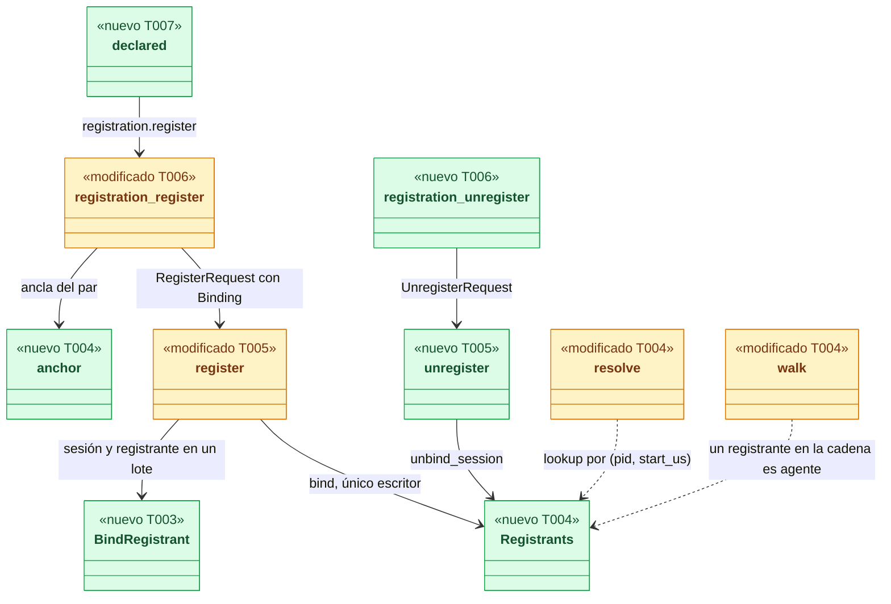
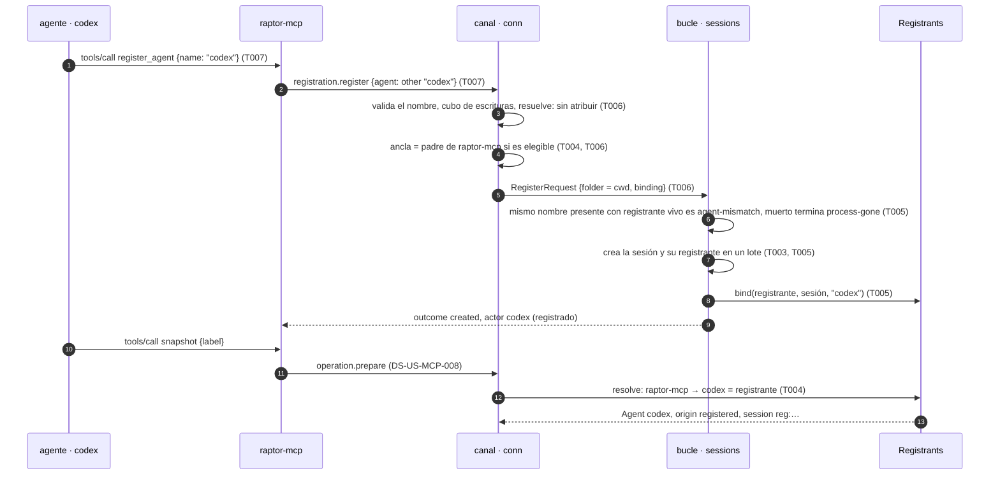
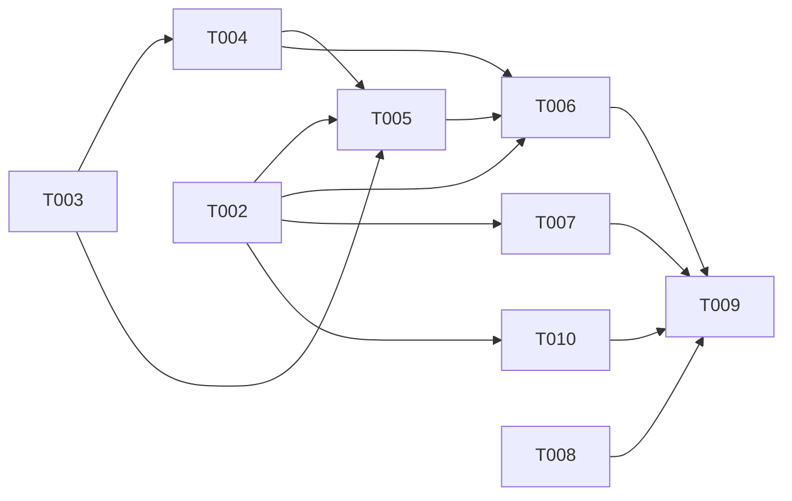

# DS-US-MCP-006 · Herramientas MCP `register_agent` y `unregister_agent`

## Contexto rápido

Al terminar, un agente que GitRaptor no detecta (Codex, Cursor u otro) llama a `register_agent` con su nombre y aparece en `status` como "codex (registrado)". Desde ese momento sus escrituras por MCP, como un `snapshot`, salen a su nombre en `raptor timeline`, y con `unregister_agent` retira su propio registro. Hoy no puede: `raptor-mcp` no ofrece esas herramientas y, aunque el motor ya crea la sesión registrada (US-GRP-009), el solicitante se resuelve solo por ascendencia (`crates/core/src/channel/requester.rs:resolve`) y nunca consulta los registros. El agente registrado sigue saliendo "sin atribuir" y su `snapshot` se rechaza (`executor/mod.rs`, `UnattributedWithoutCockpit`).

La pieza central es ligar el registro a la identidad no reutilizable de un proceso, como ya decidieron ADR-TMC-005 § 1 (TQ-8 → a) y la nota de integración de ADR-GRP-013: la sesión guarda `(pid, start_us)` de su registrante en una columna anulable, y la resolución del solicitante reconoce a los descendientes de ese proceso.

| Término | Qué es aquí |
|---|---|
| Registrante | El proceso al que queda ligado un registro hecho por MCP: el padre de `raptor-mcp` (el agente) si es elegible, o el propio `raptor-mcp` si no lo es (D1, M-01). Identidad `(pid, start_us)`; se guarda también el nombre de su ejecutable para mostrarlo (L-03) |
| Vínculo | La asociación registrante → sesión registrada, persistida en `sessions.registrant_*` y servida desde un índice en memoria (`Registrants`) |
| Registrante vivo | Todo registrante salvo que su lectura dé `ProcError::Gone` o un `start_us` distinto; un error de lectura cuenta como vivo (M-02). Un pid reutilizado nunca coincide |
| Sesión adoptable | Sesión registrada presente sin registrante, creada por el desarrollador (`Author::Developer`) o anterior a la migración (M-05) |
| Familia Claude | Nombres que `raptor-mcp` declara como Claude Code: `claude`, `claude code`, `claude-code`, `claude_code` y `claude-<dígitos>`, sin distinguir mayúsculas (D4) |
| Propio registro | La sesión registrada a la que el llamante resuelve por su registrante, en el worktree de su cwd |

⚠️ **ASSUMPTION**: no existe `architecture-constitution.md`; rigen `AGENTS.md` y los ADR de `must_read` (NFR-01, NFR-02, ADR-GRP-016), como en DS-US-MCP-008.

---

## 📋 Índice

> **Para aprobar:** [Contexto rápido](#contexto-rápido) · [⚠️ Gaps](#gaps-y-violaciones-de-la-constitución) · [🔭 La forma](#la-forma) · [El trabajo de un vistazo](#el-trabajo-de-un-vistazo) · [Decisiones](#decisiones-validadas).
> **Para implementar:** [🚀 Plan](#plan-de-implementación), en orden. Las secciones `_(ref)_` se abren desde la tarea que las cita.

| Sección | Propósito |
|---------|-----------|
| [Contexto rápido](#contexto-rápido) | Qué se construye, por qué, y el glosario |
| [⚠️ Gaps y violaciones de la constitución](#gaps-y-violaciones-de-la-constitución) | Qué impide empezar o liberar |
| [🔭 La forma](#la-forma) | Qué piezas quedan, qué cambia y cómo fluye |
| [🚀 Plan de implementación](#plan-de-implementación) | T001…T010, en orden |
| ↳ [El trabajo de un vistazo](#el-trabajo-de-un-vistazo) | Las tareas en una tabla, y su orden |
| [Estructura de ficheros](#estructura-de-ficheros) _(ref)_ | Tramos disjuntos de ficheros |
| [Contratos compartidos](#contratos-compartidos) _(ref)_ | Tipos y firmas |
| [Contrato de API](#contrato-de-api) _(ref)_ | Métodos, errores, numéricos |
| [Modelo de datos](#modelo-de-datos) _(ref)_ | Migración del almacén de sesiones |
| [Estrategia de pruebas y cobertura](#estrategia-de-pruebas-y-cobertura) _(ref)_ | Escenario → prueba |
| [Gate de seguridad](#gate-de-seguridad) | Checklist pre-merge, condiciones de security-expert y riesgos residuales |
| [Fuera de alcance](#fuera-de-alcance) | Not Built (diferido) |
| [Decisiones validadas](#decisiones-validadas) | Lo que fija esta spec, con los ajustes de Arquitecto, PO y security-expert |
| [Notas del autor](#notas-del-autor) _(ref)_ | Convenciones observadas y mejoras detectadas |

---

## ⚠️ Gaps y violaciones de la constitución

_No gaps. Ready to implement._

Arquitecto y PO validaron D1 a D12 con ajustes, y security-expert firmó D1, D2 y D5 con condiciones (G1 cerrado): están en § Gate de seguridad, cada una con su prueba en § 9.4. Las enmiendas de documentos son la tarea T008.

---

## 🔭 La forma

Queda un vínculo de proceso en la sesión registrada: el daemon lo escribe al registrar por MCP, lo carga al arrancar y lo consulta al resolver a cualquier solicitante.



🟩 nuevo · 🟨 modificado. Las aristas punteadas a `Registrants` son la decisión central: la identidad sale del vínculo de proceso, nunca del nombre que declara el cliente.

**Cómo fluye:**



El paso 4 decide: el ancla se calcula en el daemon con lo que el kernel dice del par, y solo para una conexión `mcp` que declara "otro agente". El paso 6 aplica BR-MCP-VAL-004 con hechos de proceso: el nombre de otro agente presente es el de una sesión cuyo registrante sigue vivo. Los pasos 10 a 13 cierran el hueco que deja hoy US-GRP-009: el solicitante registrado se reconoce por ascendencia, sin cambio de cable (`ResolvedVia::Ancestry`).

---

## 🚀 Plan de implementación

> Orden topológico (`Depende:`). Rutas relativas a la raíz del repo. Cada tramo de § Estructura de ficheros es disjunto; las ediciones de una línea en archivos compartidos se nombran (ADR-GRP-016).

### El trabajo de un vistazo

| # | Tarea | Depende | Aterriza en |
|---|---|---|---|
| T001 | Escribir la suite de aceptación de extremo a extremo en rojo | — | `apps/cli/tests/` |
| T002 | Definir el contrato del registro propio | — | `crates/api/src/`, `apps/cli/i18n/` |
| T003 | Añadir el registrante a la sesión en el almacén | — | `crates/core/src/profile/` |
| T004 | Reconocer al registrante al resolver el solicitante | T003 | `crates/core/src/channel/` (sin `conn.rs`) |
| T005 | Registrar y retirar con vínculo en el bucle del daemon | T002, T003, T004 | `crates/core/src/daemon/` |
| T006 | Atender `register` con vínculo y `unregister` en el canal | T002, T004, T005 | `crates/core/src/channel/conn.rs` |
| T007 | Crear las herramientas `register_agent` y `unregister_agent` | T002 | `apps/mcp/` |
| T008 | Aplicar las enmiendas de ADR, reglas e historia | — | `docs/` |
| T009 | Cerrar el contrato del canal, los pendientes multiplataforma y el estado | T006, T007, T008, T010 | `docs/` |
| T010 | Mostrar el registrante en `raptor sessions` y `raptor status` | T002 | `apps/cli/src/sessions.rs`, `apps/cli/i18n/` |

### En qué orden

Cuatro frentes que arrancan a la vez (suite, api, almacén, enmiendas); la resolución sigue al almacén, el bucle a la resolución, y el canal cierra el motor.

Con las hermanas (A7): DS-US-MCP-006 y DS-US-MCP-007 se serializan, nunca en paralelo, porque chocan en `conn.rs`, `channel/mod.rs`, `profile/schema.rs`, ADR-MCP-001, ADR-GRP-013 y `xplat-pendientes.md`, y la que se mezcla segunda actualiza las dos listas cerradas de métodos (`the_mcp_method_set_is_closed` de DS-007 incluida). Con DS-US-MCP-013 se fija el orden de mezcla y la segunda rebasa `apps/mcp/src/messages.rs`, `engine.rs` y `McpToolError::ALL`.



### T001 — Escribir la suite de aceptación de extremo a extremo en rojo

**Objetivo.** Un test por escenario de la historia, por proceso real (`raptor`, `raptor-mcp`, agentes simulados), escrito contra el JSON del cable para que compile antes de que existan los tipos.

**Ubicación.** `apps/cli/tests/mcp_register.rs` (**CREATE**)

**Reglas**
- Copiar el arnés de `apps/cli/tests/mcp_snapshot.rs` (`Machine`, `fake_agent_entry`, lectura con plazo) y el lanzador `codex` de `apps/cli/tests/agent_registration.rs`, sin editar esos archivos. `#![cfg(target_os = "macos")]`.
- Claude Code simulado: `raptor-fake-agent` (`GITRAPTOR_AGENT_EXECUTABLES`) con `raptor-mcp` como hijo. Codex simulado: una copia del binario del test llamada `codex`, lanzada sin `setsid` y sin terminal (stdin y stdout en tubería), que arranca `raptor-mcp` como hijo en su mismo grupo de procesos. Con `setsid` sería un líder de sesión sin terminal y M-01 lo excluye como ancla.
- `sessions_json_shows_the_registrant`: tras registrarse, `raptor sessions --json` da `registrant.pid` igual al pid de `codex`; la respuesta de `register_agent` no trae `registrant` (L-03).
- ⛔1.1 Nunca lanzar el `raptor-mcp` que se registra directamente desde el proceso del test: su ancla sería el test y todo lo que el test lance después (el `script` del desarrollador incluido) resolvería como ese agente y perdería los comandos reservados.
- Repo `shop` con `shop-feat-a` y `shop-feat-c`, observado; `raptor mcp enable` desde el pty solo en los tests que hacen `snapshot`.
- Rechazos con `LANG=es_ES.UTF-8`; el texto se compara en minúsculas con el de la historia: "nombre no permitido", "texto no válido", "solo puedes retirar tu registro", "no se pudo identificar al agente", "usa register_agent".
- Las sesiones se cuentan con `raptor sessions --json`, antes y después de cada rechazo; nunca leyendo el perfil real (NFR-01). Sin esperas fijas: cada estado con `DEADLINE`.

- **Depende:** —
- **Refs:** US-MCP-006 (Gherkin), DS-US-MCP-008 T001
- **Aceptación:** los tests "e2e" de § Estrategia de pruebas existen y fallan en rojo con el código actual
- **Guard ⛔1.1:** revisión del arnés: todo `raptor-mcp` que llama a `register_agent` tiene como padre `codex` o `raptor-fake-agent`

### T002 — Definir el contrato del registro propio

**Objetivo.** El método `registration.unregister`, su error en un bloque propio, el tope de sesiones registradas, la capacidad del registrante en las sesiones, los códigos nuevos de herramienta y la vista MCP; sin lógica de daemon.

**Ubicación.**
- `crates/api/src/methods/registration.rs` (**MODIFY**): `REGISTRATION_UNREGISTER`, bloque de errores, `REGISTRATION_UNREGISTER_REFUSED`, `MAX_REGISTERED_PER_WORKTREE`, tipos de parámetros, resultado y rechazo
- `crates/api/src/methods/sessions.rs` (**MODIFY**): `CAP_SESSIONS_REGISTRANT` y `capabilities` del `GROUP`
- `crates/api/src/messages.rs` (**MODIFY**, un campo): `SessionView.registrant` y el tipo `RegistrantView`
- `crates/api/src/mcp_view.rs` (**MODIFY**): `McpToolError::{NameNotAllowed, NotOwnRegistration, WorktreeMismatch}`, `McpRegistrationView`, `McpRegistrationOutcome`, `MCP_REGISTRATION_TOKENS`
- `apps/cli/i18n/en/contract.txt` (**MODIFY**, `error.registration-unregister-refused`)
- `apps/cli/i18n/es/contract.txt` (**MODIFY**, la misma clave)

**Reglas**
- Los tipos son los de § Tipos y datos compartidos, literales.
- `method(REGISTRATION_UNREGISTER, false, true)`: no reservado y con marca MCP (ADR-MCP-001 § 4.1). Sin `.since(...)` (guía de extensión). No declara `descendant_may_call` de DS-US-MCP-007: un descendiente del ejecutor recibe el rechazo auditado de esa puerta (A7).
- `SessionView.registrant` es `Option<RegistrantView>` con `#[serde(default, skip_serializing_if = "Option::is_none")]` y solo llega a una conexión con `CAP_SESSIONS_REGISTRANT` (ADR-GRP-016, cambio de forma). `McpRegistrationView` y `McpSession` nunca lo llevan (SEC-12).
- Bloque del módulo `registration`: `FIRST_ERROR_BLOCK - 5 * ERROR_BLOCK_LEN` (-33100). Si al rebasar otro módulo lo tomó, el test de bloques disjuntos falla: tomar el siguiente libre y cambiar el número en § Contrato de API.
- No tocar `lib.rs`, `rpc.rs` ni `methods/mod.rs` (`crates/api/tests/architecture.rs`); en `messages.rs`, solo el campo y su tipo. `RegistrationRejection` no gana variantes: el nombre ocupado viaja como `agent-mismatch`.
- `McpToolError::ALL` crece en tres entradas, al final y en el orden de la declaración: 23 sobre el main de hoy, 24 si DS-US-MCP-013 (`ConfirmationRequired`) se mezcla antes. Al rebasar, el conflicto en `mcp_view.rs` se resuelve conservando las variantes de las dos historias.

- **Depende:** —
- **Refs:** ADR-GRP-016 § 1, ADR-MCP-001 § 4.1 y § 5
- **Aceptación:** `cargo test -p gitraptor-api` en verde, con `registration_unregister_shapes_round_trip`, `a_session_view_without_registrant_keeps_its_wire` y `mcp_tool_codes_are_kebab_and_closed`; el test de claves i18n de `apps/cli` (`codes.rs`) en verde

### T003 — Añadir el registrante a la sesión en el almacén

**Objetivo.** Columnas anulables `registrant_pid`, `registrant_start_us` y `registrant_exe` en `sessions`, la marca `registrant_since_ms` en `store_meta`, el tipo `Registrant`, su lectura en `Session`, la escritura `WriteOp::BindRegistrant` y la consulta de quién creó una sesión.

**Ubicación.**
- `crates/core/src/profile/schema.rs` (**MODIFY**, una entrada al final de `STORE_MIGRATIONS`)
- `crates/core/src/profile/store.rs` (**MODIFY**): `Registrant`, `Session.registrant`, `WriteOp::BindRegistrant`, lectura de la fila
- `crates/core/src/profile/registrant_tests.rs` (**CREATE**, incluido desde `store.rs` con `#[cfg(test)] #[path]`)

**Reglas**
- La migración es la de § Modelo de datos: solo `ALTER TABLE … ADD COLUMN`, sin reconstruir la tabla.
- `BindRegistrant` actualiza solo una sesión sin registrante y sin fin: `WHERE session_id = ?1 AND registrant_pid IS NULL AND end_cause IS NULL`. Si no cambia ninguna fila, el lote falla con el error de escritura del almacén y no se escribe nada de él.
- `registrant_pid` y `registrant_start_us` van juntas: la lectura de una fila con solo una de ellas devuelve `registrant: None`. `registrant_exe` guarda solo el nombre del archivo del ejecutable (sin ruta), o `NULL` si no se pudo leer.
- `RepoStore::created_by(session_id) -> Option<Author>`: el `author` del primer `attribution_records` de tipo `register` de la sesión. `RepoStore::registrant_since_ms() -> Option<i64>`: la marca de la migración. Las dos las usa la regla de adopción (M-05).

> **Nota técnica.** `sessions` no tiene triggers append-only (los tienen `attribution_records`, `events` y `reserved_audit`), así que el `UPDATE` es legal. Un binario anterior que abre el almacén migrado lo ve `SchemaTooNew` (`profile/sqlite.rs`): no pierde datos.

- **Depende:** —
- **Refs:** ADR-GRP-013 (nota de integración, línea "La identidad del proceso que se registra entra con US-MCP-006 como columna anulable")
- **Aceptación:** `cargo test -p gitraptor-core --lib profile::store::registrant_tests` en verde: `the_migration_adds_nullable_registrant_columns_and_keeps_rows`, `the_migration_records_when_registrants_started`, `a_bound_registrant_round_trips`, `binding_an_ended_or_bound_session_writes_nothing`, `created_by_reads_the_first_register_record`

### T004 — Reconocer al registrante al resolver el solicitante

**Objetivo.** El índice `Registrants`, el cálculo del ancla, la vida de un registrante, el plegado único de nombres y su uso en `requester::resolve`, en la presencia del multiplexor y en la comprobación de comandos reservados; nada de registro ni de canal.

**Ubicación.**
- `crates/core/src/channel/registrants.rs` (**CREATE**): `Registrants`, `anchor`, `Liveness`
- `crates/core/src/channel/registrants_tests.rs` (**CREATE**)
- `crates/core/src/channel/mod.rs` (**MODIFY**, una línea `pub mod registrants;`)
- `crates/core/src/channel/requester.rs` (**MODIFY**): `Who::registered`, búsqueda en la ascendencia, `presence`
- `crates/core/src/channel/authz.rs` (**MODIFY**): `Checks.registrants`, `Checks::testing`, `walk`, `daemon_descendant`
- `crates/core/src/channel/validate.rs` (**MODIFY**): `fold_agent_name`, juego de caracteres y nombres reservados
- `crates/core/src/channel/server.rs` (**MODIFY**): `registrants` en `ServerArgs` y `ServerCtx`, `checks()`
- `crates/core/src/detect/hook.rs` (**MODIFY**, solo el helper de tests pasa a `Checks::testing`)
- `crates/core/src/guardrails/second_line.rs` (**MODIFY**, ídem en sus dos `Checks` de test)
- `crates/core/src/timemachine/confirm/tests.rs` (**MODIFY**, ídem)

**Pasos**
1. `Registrants`: `Mutex<HashMap<Registrant, Bound>>` con `Bound { repo_id, session_id, name }`, y las firmas de § Firmas del stack. `lookup` construye `Who::registered(name, session_id)`.
   1.1 ⛔4.1 La clave es `(pid, start_us)` completa; `lookup` nunca compara solo el pid. Un pid reutilizado tiene otro `start_us` y no hereda el registro.
   1.2 `bind` rechaza (devuelve `false` y no cambia nada) si el registrante ya tiene un vínculo abierto a otra sesión; `unbind_session` va por `(repo_id, session_id)` (A1).
2. `anchor(peer, checks)` (M-01): `requester::parent(peer, checks)` es el ancla salvo que sea el daemon (`checks.daemon`), un multiplexor (`is_multiplexer`), Claude Code (`class`), un shell conocido por el nombre de su ejecutable (sin `.exe`: `sh`, `bash`, `zsh`, `fish`, `dash`, `ksh`, `mksh`, `tcsh`, `csh`, `nu`, `elvish`, `xonsh`, `pwsh`, `powershell`, `cmd`), un líder de sesión (`p.session == p.pid`, con o sin terminal), o un proceso con terminal de control cuyo grupo no es el del par (`p.controlling_terminal && p.pgid != peer.pgid`). En cualquiera de esos casos, y si no hay padre legible, el ancla es el propio par.
   2.1 ⛔4.2 Ningún shell con control de trabajos queda como ancla: si lo fuera, todo lo que el desarrollador lance desde ese terminal resolvería como el agente.
3. `Liveness::system(uid)`: muerto solo si la lectura da `ProcError::Gone` o un `start_us` distinto (o otro uid); `Denied`, `Unsupported` y cualquier otro error cuentan como vivo (M-02, falla cerrado hacia `agent-mismatch`).
4. `requester::resolve`, en cada proceso del recorrido y en este orden: marca del ejecutor, daemon, registrante (`checks.registrants`), clase. Un registrante encontrado devuelve `Resolution { who, via: ResolvedVia::Ancestry, executor_operation: None, confirmable: false }`.
5. `presence` (M-04): un proceso vivo que es registrante cuenta como agente en `any_agent` y no entra en `under_server`. Un llamante tras un multiplexor con un agente registrado queda "sin atribuir" y no puede confirmar; nunca se le atribuye el agente registrado.
6. `authz::walk`: `out.agent` también es verdadero si el proceso es un registrante vinculado. Un descendiente del agente registrado recibe `agent-ancestry` en los comandos reservados, y `confirmation_refusal` lo rechaza igual (I-02). `pub(crate) fn daemon_descendant(first, checks) -> bool` expone `walk(first, checks).daemon` para T006 (L-01).
7. `validate` (M-03): `pub fn fold_agent_name(raw) -> String` (recorta, pasa a minúsculas y une los espacios internos en uno) es el único plegado; lo usan los nombres reservados, `same_agent` (T005) y la regla del paso 2 de T006. `declared_agent_name` acepta solo `^[A-Za-z0-9][A-Za-z0-9 ._-]{0,63}$` tras recortar; otro carácter (`сlaude` con la «с» cirílica, acentos, controles) es `Invalid::ControlCharacter`. Añadir `human` y `unattributed` a `RESERVED_AGENT_NAMES` y rechazar como `ReservedName` la familia Claude (también `claude-code`, `claude_code` y `claude-<dígitos>`).
8. `Checks::testing(uid, procs, matcher)` (`#[cfg(test)]`): `daemon`, `marks` y `registrants` a `None`, `terminal_proof` y `orphans_marked` con sus constantes; los cinco helpers de test pasan a usarlo. `ServerCtx.checks()` pasa `registrants: Some(&self.registrants)`.

> **Nota técnica.** `ProcInfo` no lee `tpgid`. La condición de M-01 «terminal y `pgid ≠ tpgid`» se cumple con `pgid` del padre ≠ `pgid` del par: un shell con control de trabajos lanza cada trabajo en su propio grupo, en primer o en segundo plano, así que la regla es igual de estricta o más, y no cambia `peer.rs`.

> **Nota técnica.** `detect/hook.rs:session_of` filtra `RequesterOrigin::Detected`, así que la evidencia S4 de los hooks no cambia aunque el registrante aparezca en la cadena. `guardrails/actor.rs` llama a `requester::resolve` con los `Checks` del servidor: un hook bajo un agente registrado resuelve `Some(AgentKind::Other)` en vez de `None`, y Guardrails ya trata `other` (columna `actor` de `guardrails_decisions`).

- **Depende:** T003
- **Refs:** ADR-TMC-005 § 1 (TQ-8 → a), ADR-GRP-005 § 6 punto 6, ADR-GRP-012 (nota de integración), § Gate de seguridad (M-01 a M-04, I-02)
- **Aceptación:** `cargo test -p gitraptor-core --lib channel::registrants_tests` y `channel::requester` en verde, con los unitarios de § Estrategia de pruebas
- **Guard ⛔4.1:** `a_reused_pid_never_matches_a_registrant`
- **Guard ⛔4.2:** `the_anchor_is_never_an_interactive_job_control_shell`

### T005 — Registrar y retirar con vínculo en el bucle del daemon

**Objetivo.** `register` escribe y aplica el vínculo con sus topes, `unregister` retira el propio registro, el arranque barre y carga los vínculos y el retiro del desarrollador los quita; el bucle es el único escritor de `Registrants`.

**Ubicación.**
- `crates/core/src/daemon/sessions.rs` (**MODIFY**): `register`, `unregister`, `withdraw`, `same_agent`, barrido y carga de vínculos, `session_view`
- `crates/core/src/daemon/sessions_registrant_tests.rs` (**CREATE**, incluido como `sessions_s3_tests.rs`)
- `crates/core/src/daemon/shutdown.rs` (**MODIFY**): `RegisterRequest.binding`, `Binding`, `RegistrationError::TooMany`, `UnregisterRequest`, `UnregisterError`, `Control::Unregister`, `ShutdownHandle::unregister`
- `crates/core/src/daemon/mod.rs` (**MODIFY**, cuatro líneas: campos `registrants: Arc<Registrants>` y `liveness: Liveness`, su construcción con `Liveness::system` y el brazo `Control::Unregister`)
- `crates/core/src/daemon/serve.rs` (**MODIFY**, una línea: `registrants` en `ServerArgs`)

**Pasos**
1. `same_agent` usa `validate::fold_agent_name` (M-03).
2. Barrido (L-02): al empezar cada `register` en un worktree, y al seguir las sesiones registradas abiertas de un repo al arrancar, toda sesión presente del worktree con registrante que `self.liveness` da por muerto termina con `EndCause::ProcessGone`, evento `session-end`, `detector.end_registered` y `registrants.unbind_session`, en el lote del registro (o en su propio lote al arrancar). Al arrancar, las que siguen vivas se cargan con `registrants.bind`.
3. `register` con `request.binding = Some(b)`, después de `locate_worktree`, del control de `named` y del barrido:
   3.1 Si `registrants.session_of(b.registrant)` es una sesión de otro repo, o de este repo en otro worktree: `Rejected(WorktreeMismatch)` (A1, D6).
   3.2 Sesión presente del mismo agente en el worktree, con registrante vivo distinto de `b.registrant` y que no es `caller_session`: `Rejected(AgentMismatch)`, sin escribir nada.
   3.3 Sesión presente del mismo agente sin registrante: adoptable si `created_by == Some(Author::Developer)` o si `started_ms < registrant_since_ms` (M-05). Si no es adoptable, termina como en el paso 2 y se crea otra.
   3.4 `same`: la de `caller_session`; si no, la presente del mismo agente con registrante `b.registrant`; si no, la adoptable más reciente.
   3.5 Adopción: `BindRegistrant` y `AppendAttribution { kind: RecordKind::Register, author: Author::Agent }` en el mismo lote, resultado `Confirmed`, log `registration_adopted` (A2, M-05). Sesión creada: `StartSession`, `AppendAttribution` (como hoy) y `BindRegistrant` en el mismo lote, resultado `Created`.
   3.6 Antes de crear: si el worktree ya tiene `MAX_REGISTERED_PER_WORKTREE` sesiones registradas presentes, `Err(RegistrationError::TooMany)` sin escribir (L-02).
   3.7 ⛔5.1 Nunca re-vincular una sesión que ya tiene registrante: si la elegida lo tiene y es otro, el resultado es el de hoy (`AlreadyRegistered` o `Confirmed`) sin escribir vínculo.
   3.8 Tras escribir: `registrants.bind(b.registrant, &repo_id, &session_id, name)` para una sesión `AgentKind::Other`.
   3.9 Los logs `agent_registered`, `registration_adopted` y el del fin por barrido llevan `registrant_pid`, `registrant_start_us` y `registrant_exe` del ancla (L-03).
4. `register` con `binding = None` se comporta como hoy (desarrollador, CLI de US-GRP-009 y Claude Code), con el barrido del paso 2.
5. `unregister(request)`: `locate_worktree(&request.folder)`; buscar `request.session_id` en ese almacén. Presente, `initial_origin == Registered` y registrante `== request.registrant`: si su worktree no es el del cwd, `Rejected(WorktreeMismatch)`; si lo es, terminarla como `withdraw` (`RecordKind::WithdrawRegistration` con `Author::Agent`, `EndCause::RegistrationWithdrawn`, `session-end`, `detector.end_registered`, `registrants.unbind_session`, log `registration_withdrawn`, `publish_sessions`). Cualquier otro caso: `Refused(NotOwnRegistration)`.
6. `withdraw` (comando reservado del desarrollador): añadir `registrants.unbind_session` tras terminar la sesión. Es la recuperación documentada: `raptor agent withdraw` desde otro terminal, o terminar el proceso registrante (L-03).
7. `session_view` rellena `registrant` (pid, `start_us`, `exe`) para las sesiones con registrante.

> **Nota técnica.** `Session` se construye solo en `profile/store.rs` (lectura de fila), así que los campos nuevos no rompen literales fuera de T003. El retiro de US-GRP-009 escribe `Author::Developer`; el retiro propio y la adopción escriben `Author::Agent`, y así el registro de atribución distingue quién hizo cada cosa.

- **Depende:** T002, T003, T004
- **Refs:** ADR-GRP-013 (nota de integración), BR-MCP-WF-005, BR-MCP-VAL-004, ADR-GRP-005 § 6 punto 6, § Gate de seguridad (M-02, M-05, L-02, L-03)
- **Aceptación:** `cargo test -p gitraptor-core --lib daemon::sessions` en verde, con los unitarios de `sessions_registrant_tests.rs` de § Estrategia de pruebas
- **Guard ⛔5.1:** `a_session_bound_to_a_live_registrant_is_never_rebound`

### T006 — Atender `register` con vínculo y `unregister` en el canal

**Objetivo.** La conexión `mcp` calcula el ancla y la manda al bucle al registrar "otro agente", y atiende `registration.unregister`; el camino del desarrollador y el de la CLI no cambian.

**Ubicación.** `crates/core/src/channel/conn.rs` (**MODIFY**): `registration_register`, `registration_unregister` (nuevo), brazo del `match` junto a los de `registration`, mapeo de errores, filtro de `SessionView.registrant`

**Pasos**
1. `registration_register`, solo con `self.is_mcp()`, después de validar los parámetros: gastar `mcp_write_bucket` (`RATE_LIMITED` si está vacío) y resolver con `self.resolve()?` (la `Resolution` entera).
2. Nueva regla anti-suplantación, junto a la de Claude Code: un llamante que resuelve a un agente registrado de nombre N y declara otro nombre (comparados con `validate::fold_agent_name`) se rechaza como `AgentMismatch`, auditado con `refuse`.
3. L-01: `resolution.via == ResolvedVia::Executor`, o `authz::daemon_descendant` del par: `AgentMismatch` auditado con `refuse`, sin llamar al bucle.
   3.1 ⛔6.1 Nunca calcular el ancla para un proceso bajo el ejecutor o descendiente del daemon: el hook de una operación del agente registraría su propio padre como registrante.
4. `binding`: solo si `agent.kind == AgentKind::Other`. Leer el par (`self.ctx.procs.read(self.peer.pid)`, mismo `start_us` o `IDENTITY_UNVERIFIED`), `registrants::anchor` y el nombre del archivo del ejecutable del ancla.
5. Respuesta del bucle: `Rejected(AgentMismatch)` (nombre ocupado) se audita con `refuse(RefusalReason::AgentMismatch, …)`; `Rejected(WorktreeMismatch)` como hoy; `TooMany` → `RATE_LIMITED`. Un `Ok` con `outcome == Confirmed` y `binding` presente es una adopción: se audita como aceptada (`self.audit(spec.name, Some(repo_id), AuditOutcome::Accepted, None, …)`, M-05).
6. `registration_unregister`: parámetros `RegistrationUnregisterParams`; en MCP, cubo de escrituras; `self.resolve()?`.
   6.1 `Requester::Unattributed` → `REGISTRATION_UNREGISTER_REFUSED` con `unattributed`.
   6.2 `Requester::Agent { origin: Registered, session_id }` con `via == Ancestry`: el registrante es `self.ctx.registrants.registrant_of(&repo_id, &session_id)` (el `repo_id` del vínculo); sin él, `not-own-registration`.
   6.3 Cualquier otro solicitante (Claude Code detectado, resolución `Executor` o `Multiplexer`) → `not-own-registration`.
   6.4 Carpeta: `process_cwd(self.peer.pid)` o `REGISTRATION_REJECTED` `no-working-folder`. Llamar a `self.ctx.control.unregister(UnregisterRequest { … })` y mapear `UnregisterError` (§ Forma del error).
7. A3: todo rechazo `not-own-registration` se audita (`AuditOutcome::Rejected`, `RefusalReason::AgentMismatch`), como pide ADR-GRP-005 § 6 punto 6 para "cualquier otro retiro pedido por un agente". `registration.withdraw` sigue reservado y auditado.
8. Sin `CAP_SESSIONS_REGISTRANT`, la conexión recibe `SessionView.registrant = None` en `sessions.list` y en los eventos de sesión (`apply_capabilities`).

- **Depende:** T002, T004, T005
- **Refs:** ADR-MCP-001 § 4.1 y Enmienda (2026-10-05, US-GRP-009), ADR-GRP-005 § 6 puntos 6 y 7 (M7), BR-MCP-AUTH-002, § Gate de seguridad (L-01, M-05)
- **Aceptación:** `cargo test -p gitraptor-core --lib channel` en verde y los e2e de T001 en verde en macOS
- **Guard ⛔6.1:** `a_process_under_an_operation_never_becomes_a_registrant`

### T007 — Crear las herramientas `register_agent` y `unregister_agent`

**Objetivo.** Dos herramientas del catálogo fijo que llaman a `registration.register` y `registration.unregister` y responden por la tubería de US-MCP-005.

**Ubicación.**
- `apps/mcp/src/register.rs` (**CREATE**): herramientas, esquemas, mapeo del nombre, mapeo de errores, vista
- `apps/mcp/src/register_tests.rs` (**CREATE**)
- `apps/mcp/src/main.rs` (**MODIFY**, una línea `mod register;`)
- `apps/mcp/src/server.rs` (**MODIFY**): `list_tools` con las cuatro herramientas y dos brazos de `call_tool`
- `apps/mcp/src/engine.rs` (**MODIFY**): `Engine::call`
- `apps/mcp/src/messages.rs` (**MODIFY**): plantillas en/es de los tres códigos nuevos, `invalid-text` con `field`
- `apps/mcp/tests/handshake.rs` (**MODIFY**, nombres del catálogo)

**Reglas**
- `register_agent` `inputSchema`: `{"type":"object","properties":{"name":{"type":"string","maxLength":64}},"required":["name"],"additionalProperties":false}`. `unregister_agent`: `{"type":"object","properties":{},"additionalProperties":false}`. Argumento desconocido, `name` ausente o no string: `-32602` `invalid-params` con `field` (DS-US-MCP-005 D7).
- `register::declared(name)`: familia Claude (con `fold_agent_name` reproducido sobre ASCII: recortar, minúsculas, espacios internos unidos) → `DeclaredAgent::ClaudeCode`; el resto → `DeclaredAgent::Other { name }` tal cual llegó. La validación del nombre es la del daemon: `raptor-mcp` no duplica la regla.
- `Engine::call<P, R>(method, params, retry)`: bajo el mismo `try_lock` que `status`; reabre la conexión y repite una vez solo si `retry` y la conexión era reutilizada. `register_agent` llama con `retry = true` (idempotente para el mismo registrante); `unregister_agent`, con `false`.
  - ⛔7.1 Nunca repetir `registration.unregister` tras un fallo de transporte: la segunda llamada respondería `unattributed` y el agente leería que nunca estuvo registrado.
- Tiempo de la llamada: `within(MCP_WRITE_TIME_LIMIT, …)`; si vence, `self.engine.late()`.
- Mapeo de errores y textos: § Forma del error, literales. `tool_params` de `invalid-text` reconstruye `field` solo si es `label` o `name`, y `max_chars: 64`.
- Descripciones constantes en inglés, cada herramienta ≤ 150 tokens con su `inputSchema` (RES-MCP-01): `register_agent` dice que registra la sesión como agente en su worktree para que su trabajo quede a su nombre, que se usa cuando `status` dice "unattributed", que el nombre es ASCII de hasta 64 caracteres y que no cambia ningún archivo; `unregister_agent`, que retira solo el registro propio hecho con `register_agent`.
- La respuesta es `McpRegistrationView`, pasada por `for_mcp` y por `MCP_REGISTRATION_TOKENS`; nunca lleva el registrante (L-03).

- **Depende:** T002
- **Refs:** ADR-MCP-001 § 4.1, § 4.2, § 5 y § 6; DS-US-MCP-005 D1, D3, D4, D7; DS-US-MCP-008 T006
- **Aceptación:** `cargo test -p gitraptor-mcp` en verde, con los unitarios de `apps/mcp` de § Estrategia de pruebas, `handshake.rs` y `token_budget.rs` (catálogo ≤ 1.500 tokens)
- **Guard ⛔7.1:** `unregister_is_never_sent_twice`

### T008 — Aplicar las enmiendas de ADR, reglas e historia

**Objetivo.** Dejar escritas en sus documentos las decisiones de § Decisiones validadas; no toca código.

**Ubicación.**
- `docs/architecture/decisions/ADR-MCP-001-servidor-mcp-cliente-daemon.md` (**MODIFY**, Enmienda (2026-10-09, US-MCP-006))
- `docs/architecture/decisions/ADR-GRP-005-forma-motor-proceso-segundo-plano.md` (**MODIFY**, § 6 punto 6)
- `docs/architecture/decisions/ADR-GRP-013-modelo-eventos-atribucion.md` (**MODIFY**, nota de integración realizada)
- `docs/architecture/decisions/ADR-TMC-005-solicitante-permisos-solape.md` (**MODIFY**, § 1, agentes registrados)
- `docs/requirements/features/mcp/business-rules.md` (**MODIFY**, BR-MCP-VAL-004, BR-MCP-WF-005, BR-MCP-AUTH-002)
- `docs/requirements/features/mcp/context.md` (**MODIFY**, alcance del agente registrado)
- `docs/requirements/features/mcp/user-stories/US-MCP-006-registrar-agente.md` (**MODIFY**, escenarios 1 y 2, Dependencias)

**Reglas**
- ADR-MCP-001: § 4.1, `unregister_agent` usa `registration.unregister` (no reservado, con marca MCP, sin `descendant_may_call`); § 5, añadir `name-not-allowed` y `not-own-registration` a la familia identidad (junto a `worktree-mismatch`, que ya está y que reutilizará US-MCP-011); § 9, el ancla del registro (D1, M-01), que el descendiente desacoplado que se registra queda ligado a su propio proceso, y el riesgo residual del anfitrión compartido (A6).
- ADR-GRP-005 § 6 punto 6: el ⚠️ ASSUMPTION del retiro propio se cierra apuntando a `registration.unregister` (D7); la frase "cualquier otro retiro pedido por un agente se rechaza y queda en la auditoría" no cambia (A3). Los nombres de "otro agente" pasan a `^[A-Za-z0-9][A-Za-z0-9 ._-]{0,63}$` sin la familia Claude, `human` ni `unattributed`; efecto en US-GRP-009: la CLI ya no registra `claude-2` ni nombres con acentos como "otro agente".
- ADR-GRP-013: la nota de integración pasa a "realizada por US-MCP-006": columnas `registrant_pid`, `registrant_start_us` y `registrant_exe`, marca `registrant_since_ms`; barrido `process-gone` de las sesiones con registrante muerto al registrar y al arrancar (L-02); adopción con registro de atribución `register` de `Author::Agent` (M-05).
- ADR-TMC-005 § 1: "Agentes registrados" deja de depender de motor-local: se reconocen por el registrante en la ascendencia; tras un multiplexor solo bloquean la confirmación (D2, M-04).
- `business-rules.md` (PO): BR-MCP-VAL-004 gana "los nombres de la familia Claude están reservados para Claude Code detectado; otro agente no puede usarlos". BR-MCP-WF-005 gana "una sesión registrada sin proceso ligado la confirma quien se registra con su nombre si la creó el desarrollador; si su proceso terminó, se cierra y se abre otra", "un agente registrado en otro worktree no se registra en este" y "lo que el agente haga después figura en el timeline a su nombre". BR-MCP-AUTH-002 y `context.md`: el agente registrado es también el solicitante de los comandos de su shell (Time Machine, Guardrails; los reservados se le rechazan).
- US-MCP-006 (PO): escenario 1, "Y lo que "codex" haga después figura en el timeline a su nombre". Escenario 2: "Dado Claude Code detectado en "shop-feat-a" con la etiqueta "claude-1" / Cuando el agente pide `register_agent` con su etiqueta ("claude-1") o con el nombre genérico de Claude Code ("claude", "claude-code") / Entonces "shop-feat-a" sigue teniendo una sola sesión de "claude-1" / Y su origen visible es "registrado"". En Dependencias, US-GRP-009 pasa a "implementada".

- **Depende:** —
- **Refs:** § Decisiones validadas, `AGENTS.md`
- **Aceptación:** revisión de Arquitecto y PO; `/aadd-analyze` sin BLOCKER

### T009 — Cerrar el contrato del canal, los pendientes multiplataforma y el estado

**Objetivo.** Contrato del canal, pendientes y estado al día; no toca código.

**Ubicación.**
- `docs/architecture/design/api-contract-ipc.md` (**MODIFY**)
- `docs/architecture/xplat-pendientes.md` (**MODIFY**, una fila)
- `docs/requirements/features/mcp/dev-specs/US-MCP-006-dev-spec.md` (**MODIFY**, "Estado de la implementación")

**Reglas**
- `api-contract-ipc.md`: `registration.unregister`, `-33100` `registration-unregister-refused` con sus motivos, el nombre ocupado como `agent-mismatch` de `registration.register`, `RATE_LIMITED` por el tope de sesiones registradas y `CAP_SESSIONS_REGISTRANT` con `SessionView.registrant`. No editar `docs/ARTIFACTS.md`.
- Fila de `xplat-pendientes.md`: el ancla, la lista de shells y la resolución por registrante en Linux (lectura de procesos y cwd del par, DEP-MCP-9) y en Windows (sin canal, XP-01; `session` y `controlling_terminal` describen la consola).
- El `status` de la historia lo cambia el PR al mezclar, no esta tarea.

- **Depende:** T006, T007, T008, T010
- **Refs:** `AGENTS.md` (PR con IDs)
- **Aceptación:** los tests de T001 en verde en macOS

### T010 — Mostrar el registrante en `raptor sessions` y `raptor status`

**Objetivo.** La CLI entiende la forma nueva que su cliente acepta solo (T002) y muestra el proceso registrante para que el desarrollador pueda recuperarse (L-03).

**Ubicación.**
- `apps/cli/src/sessions.rs` (**MODIFY**): `SessionJson.registrant` y la línea humana (`line`, que también usa `status.rs`)
- `apps/cli/i18n/en/sessions.txt` (**MODIFY**, `session.registrant`)
- `apps/cli/i18n/es/sessions.txt` (**MODIFY**, la misma clave)

**Reglas**
- JSON: `"registrant": {"pid": …, "start_us": …, "exe": "…"}` solo si la sesión lo tiene.
- Línea humana: "· proceso {exe} ({pid})" / "· process {exe} ({pid})" tras el origen; `exe` pasa por `sanitized()`.

> **Nota técnica.** El cliente de `crates/core` acepta en `connection.accept` toda capacidad de `capability::all()` (DS-US-MCP-008 T002), así que la CLI recibe `registrant` en cuanto existe la constante y tiene que pintarlo en el mismo PR.

- **Depende:** T002
- **Refs:** ADR-GRP-016 (§ Añadir una capacidad, paso 3), § Gate de seguridad (L-03)
- **Aceptación:** `a_session_line_shows_its_registrant` en `apps/cli/src/sessions.rs` y el test de claves i18n en verde

---

> Las secciones siguientes son de referencia. Se abren desde la tarea que las cita, no se leen en orden.

## Estructura de ficheros

Siete tramos disjuntos: ningún archivo aparece en dos. Los tramos C y D se encadenan (`Depende:`); A, B, E, F y G pueden ir en paralelo desde el principio, G después de A.

### Tramo A — contrato del api (T002)

- `crates/api/src/methods/registration.rs`
- `crates/api/src/methods/sessions.rs`
- `crates/api/src/messages.rs`
- `crates/api/src/mcp_view.rs`
- `apps/cli/i18n/en/contract.txt`
- `apps/cli/i18n/es/contract.txt`

### Tramo B — almacén de sesiones (T003)

- `crates/core/src/profile/schema.rs`
- `crates/core/src/profile/store.rs`
- `crates/core/src/profile/registrant_tests.rs`

### Tramo C — resolución y canal (T004 y T006)

- `crates/core/src/channel/registrants.rs`
- `crates/core/src/channel/registrants_tests.rs`
- `crates/core/src/channel/mod.rs`
- `crates/core/src/channel/requester.rs`
- `crates/core/src/channel/authz.rs`
- `crates/core/src/channel/validate.rs`
- `crates/core/src/channel/server.rs`
- `crates/core/src/channel/conn.rs`
- `crates/core/src/detect/hook.rs`
- `crates/core/src/guardrails/second_line.rs`
- `crates/core/src/timemachine/confirm/tests.rs`

### Tramo D — bucle del daemon (T005)

- `crates/core/src/daemon/sessions.rs`
- `crates/core/src/daemon/sessions_registrant_tests.rs`
- `crates/core/src/daemon/shutdown.rs`
- `crates/core/src/daemon/mod.rs`
- `crates/core/src/daemon/serve.rs`

### Tramo E — servidor MCP (T007)

- `apps/mcp/src/register.rs`
- `apps/mcp/src/register_tests.rs`
- `apps/mcp/src/main.rs`
- `apps/mcp/src/server.rs`
- `apps/mcp/src/engine.rs`
- `apps/mcp/src/messages.rs`
- `apps/mcp/tests/handshake.rs`

### Tramo F — aceptación y documentación (T001, T008 y T009)

- `apps/cli/tests/mcp_register.rs`
- `docs/architecture/decisions/ADR-MCP-001-servidor-mcp-cliente-daemon.md`
- `docs/architecture/decisions/ADR-GRP-005-forma-motor-proceso-segundo-plano.md`
- `docs/architecture/decisions/ADR-GRP-013-modelo-eventos-atribucion.md`
- `docs/architecture/decisions/ADR-TMC-005-solicitante-permisos-solape.md`
- `docs/requirements/features/mcp/business-rules.md`
- `docs/requirements/features/mcp/context.md`
- `docs/requirements/features/mcp/user-stories/US-MCP-006-registrar-agente.md`
- `docs/architecture/design/api-contract-ipc.md`
- `docs/architecture/xplat-pendientes.md`
- `docs/requirements/features/mcp/dev-specs/US-MCP-006-dev-spec.md`

### Tramo G — CLI (T010)

- `apps/cli/src/sessions.rs`
- `apps/cli/i18n/en/sessions.txt`
- `apps/cli/i18n/es/sessions.txt`

---

## Contratos compartidos

### Tipos y datos compartidos

```rust
// crates/api/src/methods/registration.rs (T002)
/// Withdraws the caller's own registration (not reserved, offered to MCP).
pub const REGISTRATION_UNREGISTER: &str = "registration.unregister";
const BLOCK: i64 = FIRST_ERROR_BLOCK - 5 * ERROR_BLOCK_LEN;          // -33100
pub const REGISTRATION_UNREGISTER_REFUSED: ErrorSpec =
    ErrorSpec::new(-33100, "registration-unregister-refused");
#[derive(Debug, Clone, Default, PartialEq, Eq, Serialize, Deserialize, JsonSchema)]
#[serde(deny_unknown_fields)]
pub struct RegistrationUnregisterParams {}
#[derive(Debug, Clone, PartialEq, Eq, Serialize, Deserialize, JsonSchema)]
#[serde(deny_unknown_fields)]
pub struct RegistrationUnregisterResult { pub repo_id: String, pub session_id: String, pub actor: Actor }
#[derive(Debug, Clone, Copy, PartialEq, Eq, Serialize, Deserialize, JsonSchema)]
#[serde(rename_all = "kebab-case")]
pub enum UnregisterRefusal { Unattributed, NotOwnRegistration }
#[derive(Debug, Clone, PartialEq, Eq, Serialize, Deserialize, JsonSchema)]
#[serde(deny_unknown_fields)]
pub struct UnregisterRefusedData { pub reason: UnregisterRefusal }

// crates/api/src/mcp_view.rs (T002)
pub enum McpToolError { /* the twenty of today, */
    NameNotAllowed,      // "name-not-allowed"
    NotOwnRegistration,  // "not-own-registration"
    WorktreeMismatch,    // "worktree-mismatch" (identity family of ADR-MCP-001 § 5)
}
#[derive(Debug, Clone, Copy, PartialEq, Eq, Serialize, JsonSchema)]
#[serde(rename_all = "kebab-case")]
pub enum McpRegistrationOutcome { Created, Confirmed, AlreadyRegistered, Withdrawn }
/// Tool answer of `register_agent` and `unregister_agent`: the allowlist of fields (SEC-12).
#[derive(Debug, Clone, PartialEq, Eq, Serialize, JsonSchema)]
pub struct McpRegistrationView { pub outcome: McpRegistrationOutcome, pub agent: Actor }
pub const MCP_REGISTRATION_TOKENS: usize = 150;

// crates/core/src/profile/store.rs (T003)
/// The process a registration is bound to: identity that survives no pid reuse.
#[derive(Debug, Clone, Copy, PartialEq, Eq, Hash)]
pub struct Registrant { pub pid: u32, pub start_us: u64 }
pub struct Session { /* … */ pub registrant: Option<Registrant>, pub registrant_exe: Option<String> }
pub enum WriteOp { /* … */
    BindRegistrant { session_id: String, registrant: Registrant, exe: Option<String> } }
impl RepoStore {
    pub fn created_by(&self, session_id: &str) -> Result<Option<Author>>;   // first `register` record
    pub fn registrant_since_ms(&self) -> Result<Option<i64>>;              // store_meta mark
}

// crates/api/src/methods/registration.rs (T002)
/// Live registered sessions per worktree (L-02); one more is refused as RATE_LIMITED.
pub const MAX_REGISTERED_PER_WORKTREE: usize = 8;
// crates/api/src/methods/sessions.rs (T002)
pub const CAP_SESSIONS_REGISTRANT: Capability = Capability::new("sessions.registrant");
// crates/api/src/messages.rs (T002)
#[derive(Debug, Clone, PartialEq, Eq, Serialize, Deserialize, JsonSchema)]
#[serde(deny_unknown_fields)]
pub struct RegistrantView { pub pid: u32, pub start_us: u64, pub exe: Option<Untrusted> }
pub struct SessionView { /* … */
    #[serde(default, skip_serializing_if = "Option::is_none")] pub registrant: Option<RegistrantView> }

// crates/core/src/daemon/shutdown.rs (T005)
pub(crate) struct Binding { pub registrant: Registrant, pub exe: Option<String> }
pub(crate) struct RegisterRequest { /* … */ pub binding: Option<Binding> }
pub(crate) enum RegistrationError { /* Rejected, Internal, */ TooMany }  // → RATE_LIMITED
pub(crate) struct UnregisterRequest { pub session_id: String, pub registrant: Registrant, pub folder: PathBuf }
pub(crate) enum UnregisterError { Refused(UnregisterRefusal), Rejected(RegistrationRejection), Internal }
```

### Ciclos de vida (DI)

| Servicio / componente | Ámbito / ciclo de vida | Razón |
|---|---|---|
| `Registrants` | Uno por daemon, `Arc` compartido por el bucle (escribe) y el canal (lee), como `McpRepos` | El bucle es dueño de los almacenes; el canal resuelve en su hilo sin pasar por el bucle |
| Vínculo de una sesión | Desde el registro hasta el retiro, el fin `process-gone` (barrido) o el retiro del desarrollador; persistido, se barre y se recarga al arrancar | ADR-GRP-013, nota de integración; L-02 |
| `Liveness` | Una por daemon, `Liveness::system(uid)` en producción, inyectada en tests | El barrido del arranque y el de cada registro la necesitan en el bucle |

### Firmas del stack

```rust
// crates/core/src/channel/registrants.rs (T004)
impl Registrants {
    /// `false`, and nothing changes, if `registrant` already has an open binding (A1).
    pub fn bind(&self, registrant: Registrant, repo_id: &str, session_id: &str, name: &str) -> bool;
    pub fn unbind_session(&self, repo_id: &str, session_id: &str);
    /// The registered agent `info` is, matched by `(pid, start_us)`.
    pub fn lookup(&self, info: &ProcInfo) -> Option<Who>;
    /// `(repo_id, session_id)` the registrant is bound to.
    pub fn session_of(&self, registrant: Registrant) -> Option<(String, String)>;
    pub fn registrant_of(&self, repo_id: &str, session_id: &str) -> Option<Registrant>;
}
/// The registrant of an MCP server process: its parent when eligible (M-01), else itself.
pub fn anchor(peer: &ProcInfo, checks: &Checks<'_>) -> Registrant;
#[derive(Clone)]
pub struct Liveness(Arc<dyn Fn(Registrant) -> bool + Send + Sync>);
impl Liveness { pub fn new(f: impl Fn(Registrant) -> bool + Send + Sync + 'static) -> Self;
                /// Dead only on `ProcError::Gone` or another start or uid (M-02).
                pub fn system(uid: u32) -> Self;
                pub fn alive(&self, r: Registrant) -> bool; }
impl std::fmt::Debug for Liveness { /* "Liveness" */ }

// crates/core/src/channel/validate.rs (T004)
/// Trim, lowercase, inner whitespace runs as one space: the only folding (M-03).
pub fn fold_agent_name(raw: &str) -> String;
// crates/core/src/channel/authz.rs (T004)
pub(crate) fn daemon_descendant(first: &ProcInfo, checks: &Checks<'_>) -> bool;
#[cfg(test)] impl<'a> Checks<'a> {
    pub(crate) fn testing(uid: u32, procs: &'a dyn ProcSource, matcher: &'a AgentMatcher) -> Self; }

// crates/core/src/channel/requester.rs (T004)
impl Who { pub(crate) fn registered(name: &str, session_id: &str) -> Self; }
/// Existing signature; reads `checks.registrants` in the walk and in `presence`.
pub fn resolve(peer: AcceptedPeer, checks: &Checks<'_>, marks: Option<&ExecutorMarks>)
    -> Result<Resolution, Unverified>;
// crates/core/src/channel/authz.rs: `fn walk(first: &ProcInfo, checks: &Checks<'_>) -> Walk` (existing)
// actor: Agent { kind: Other, name: Some(UntrustedName::new(name)), origin: Registered }
// requester: Agent { name, origin: RequesterOrigin::Registered, session_id }

// crates/core/src/channel/authz.rs (T004)
pub struct Checks<'a> { /* … */ pub registrants: Option<&'a Registrants> }

// crates/core/src/channel/conn.rs (T006)
fn registration_register(&self, spec: &MethodSpec, request: &Request)
    -> Result<RegistrationRegisterResult, ErrorObject>;                    // existing
fn registration_unregister(&self, request: &Request)
    -> Result<RegistrationUnregisterResult, ErrorObject>;                  // new

// crates/core/src/daemon/sessions.rs (T005): `register` keeps its signature
pub(super) fn unregister(&mut self, request: UnregisterRequest)
    -> Result<RegistrationUnregisterResult, UnregisterError>;
// crates/core/src/daemon/shutdown.rs (T005)
pub(crate) fn unregister(&self, request: UnregisterRequest)
    -> Result<RegistrationUnregisterResult, UnregisterError>;

// apps/mcp/src/engine.rs (T007)
pub fn call<P: Serialize, R: DeserializeOwned>(&self, method: &str, params: P, retry: bool)
    -> Result<R, ClientError>;
// apps/mcp/src/register.rs (T007)
pub fn declared(name: &str) -> DeclaredAgent;
pub fn register_refusal(err: &ClientError) -> ToolRefusal;
pub fn unregister_refusal(err: &ClientError) -> ToolRefusal;
```

---

## Contrato de API

| Llamada | Quién | Resultado | Errores |
|---|---|---|---|
| `registration.register {agent}` por MCP | Toda conexión `mcp` (agente) | `RegistrationRegisterResult` (sin cambio de forma) | `INVALID_PARAMS` (`empty`, `too-long`, `control-character`, `reserved-name`), `RATE_LIMITED` (nuevo en MCP, y por el tope de 8 sesiones registradas del worktree), `IDENTITY_UNVERIFIED`, `REGISTRATION_REJECTED` (`agent-mismatch` también por nombre ocupado, ejecutor o descendiente del daemon, `worktree-mismatch` también por vínculo en otro worktree o repo, `not-a-worktree`, `repo-not-observed`, `no-working-folder`), `INTERNAL` |
| `registration.unregister {}` | Toda conexión (no reservado, marca MCP) | `RegistrationUnregisterResult` | `-33100` `{reason: unattributed \| not-own-registration}`, `REGISTRATION_REJECTED` (`worktree-mismatch`, `not-a-worktree`, `repo-not-observed`, `no-working-folder`), `RATE_LIMITED` (MCP), `IDENTITY_UNVERIFIED`, `INTERNAL` |
| `registration.withdraw` | Reservado (sin cambio) | — | sin cambio |
| `sessions.list` y eventos de sesión | Conexión con `sessions.registrant` | `SessionView.registrant` en las sesiones con registrante | sin cambio |
| Herramienta `register_agent {name}` | Cualquier cliente MCP | `{"outcome":"created","agent":{"kind":"other","name":{"untrusted":"codex"},"origin":"registered"}}` | § Forma del error |
| Herramienta `unregister_agent {}` | Agente registrado | `{"outcome":"withdrawn","agent":{…}}` | § Forma del error |

Ninguna de las dos herramientas pasa por la allowlist: escriben en el perfil, no en el repo (ADR-MCP-001, Enmienda 2026-10-05).

### Forma del error y del cuerpo de respuesta

Rechazo de dominio de la herramienta, como DS-US-MCP-005 D4 (`isError: true`, solo bloque de texto): `{"code":"name-not-allowed","message":"…","action":"…"}`.

| Origen en el daemon | Herramienta | `code` | `params` | Mensaje y acción (es) |
|---|---|---|---|---|
| `INVALID_PARAMS` `empty`, `too-long`, `control-character` | `register_agent` | `invalid-text` | `field: "name"`, `max_chars: 64` | "Nombre: texto no válido." · "Usa de 1 a 64 caracteres: letras y cifras ASCII, espacio, punto, guion o guion bajo." |
| `INVALID_PARAMS` `reserved-name`; `REGISTRATION_REJECTED` `agent-mismatch` | `register_agent` | `name-not-allowed` | — | "Nombre no permitido." · "Usa tu propio nombre: ni reservado ni el de otro agente presente en este worktree." |
| `REGISTRATION_REJECTED` `worktree-mismatch` | las dos | `worktree-mismatch` | — | "El worktree no coincide: tu sesión está en otro worktree." · "Usa unregister_agent desde ese worktree y vuelve a registrarte aquí." |
| `REGISTRATION_REJECTED` `not-a-worktree`, `repo-not-observed` | las dos | `not-in-observed-worktree` | — | el de US-MCP-005 |
| `REGISTRATION_REJECTED` `no-working-folder`; `IDENTITY_UNVERIFIED` | las dos | `identity-unverified` | — | el de US-MCP-005 |
| `-33100` `unattributed` | `unregister_agent` | `unattributed` | — | "No se pudo identificar al agente." · "Regístrate: usa register_agent." (texto actual) |
| `-33100` `not-own-registration` | `unregister_agent` | `not-own-registration` | — | "Solo puedes retirar tu registro." · "No hay registro tuyo en este worktree; el de otro agente solo lo retira el desarrollador." |
| `RATE_LIMITED` (cubo o tope de sesiones) | las dos | `rate-limited` | `retry_after_s: 3` | el de US-MCP-008 |
| Sin respuesta en plazo o conexión rota | las dos | `engine.late()`: `time-limit` o `engine-unavailable` | — | los de US-MCP-005 |
| `INTERNAL` u otro | las dos | `internal` | — | el de US-MCP-005 |

En inglés: "Name: invalid text." · "Use 1 to 64 characters: ASCII letters and digits, space, dot, hyphen or underscore."; "Name not allowed." · "Use your own name: not reserved and not another present agent's in this worktree."; "The worktree does not match: your session is in another worktree." · "Use unregister_agent from that worktree and register again here."; "You can only withdraw your own registration." · "There is no registration of yours in this worktree; only the developer can withdraw another agent's.". El mensaje de `worktree-mismatch` es genérico porque US-MCP-011 (`expect_worktree`) reutiliza el código (A4). Cada rechazo ≤ 80 tokens en en y es (RES-MCP-03).

Mapeo del bucle (T006): `RegistrationError::Rejected(r)` → `REGISTRATION_REJECTED {reason: r}`; `RegistrationError::TooMany` → `RATE_LIMITED`; `UnregisterError::Refused(r)` → `-33100 {reason: r}`; `UnregisterError::Rejected(r)` → `REGISTRATION_REJECTED`; `Internal` → `INTERNAL "profile unavailable"`.

### Forma de la configuración

_No aplica — no se añade configuración: el tope del nombre y el cubo de escrituras son constantes del contrato (ADR-MCP-001 § 6)._

### Valores numéricos

| Concepto | Valor | Fuente |
|---|---|---|
| Nombre de "otro agente" | `^[A-Za-z0-9][A-Za-z0-9 ._-]{0,63}$` tras `trim` | `validate::MAX_AGENT_NAME_CHARS`, ADR-MCP-001 § 6, M-03 |
| Sesiones registradas presentes por worktree | ≤ 8 (`MAX_REGISTERED_PER_WORKTREE`) | L-02 |
| Nombres reservados para "otro agente" | `claude code`, `claude`, `gitraptor`, `raptor`, `human`, `unattributed` y la familia Claude | ADR-GRP-005 § 6 punto 6; D4 |
| Rate limit de escrituras | 20/min, ráfaga 5, por conexión `mcp`; lo gastan `register` y `unregister` | ADR-MCP-001 § 6 |
| Tiempo de la llamada | 30 s (`MCP_WRITE_TIME_LIMIT`); la librería del cliente corta antes, a los 10 s | ADR-MCP-001 § 6 |
| Respuesta | ≤ 150 tokens por parte; ≤ 24 KiB | RES-MCP-02; ⚠️ **ASSUMPTION** de la cifra, se mide en `register_tests.rs` |
| Descripción + `inputSchema` | ≤ 150 tokens por herramienta; catálogo ≤ 1.500 | RES-MCP-01 |
| Bloque de errores del módulo `registration` | -33100..=-33119 | ADR-GRP-016 |

---

## Modelo de datos

Entrada nueva al final de `STORE_MIGRATIONS` (`crates/core/src/profile/schema.rs`), en el almacén de cada repo:

```sql
-- US-MCP-006: the process a registration made over MCP is bound to (ADR-GRP-013,
-- integration note). NULL for detected sessions and for registrations without one.
ALTER TABLE sessions ADD COLUMN registrant_pid INTEGER;
ALTER TABLE sessions ADD COLUMN registrant_start_us INTEGER;
ALTER TABLE sessions ADD COLUMN registrant_exe TEXT;
-- Sessions started before this mark and without a registrant may be adopted (M-05).
INSERT OR REPLACE INTO store_meta (key, value)
  VALUES ('registrant_since_ms', CAST(CAST(strftime('%s', 'now') AS INTEGER) * 1000 AS TEXT));
```

- `BindRegistrant`: `UPDATE sessions SET registrant_pid = ?2, registrant_start_us = ?3, registrant_exe = ?4 WHERE session_id = ?1 AND registrant_pid IS NULL AND end_cause IS NULL`; cualquier número de filas afectadas distinto de uno es un error de escritura.
- Las filas existentes quedan con las columnas a `NULL`: ninguna sesión anterior queda vinculada, y una registrada antes de `registrant_since_ms` se puede adoptar (D5, M-05). La marca tiene precisión de segundos: basta para separar las filas anteriores a la migración.
- `end_cause` no cambia de dominio: el fin por registrante muerto usa `process-gone`, que ya está en el `CHECK`.

---

## Estrategia de pruebas y cobertura

### 9.1 Pirámide de pruebas

| Tipo | Cantidad | Tareas dueñas | Herramientas | Cuándo |
|------|---------:|-------------|---------|------|
| Unit | 56 | T002, T003, T004, T005, T006, T007, T010 | `cargo test` | PR gate |
| E2E | 11 | T001 | `cargo test -p gitraptor-cli --test mcp_register` (macOS) | PR gate en macOS |
| Security | 20 | T004, T005, T006, T010 | las condiciones de § Gate de seguridad, listadas en § 9.4 | PR gate, bloquean la mezcla |

Contrato de `/nassa-core:implement`: `"suite": { "command": "node tools/test/nextest-junit.mjs" }` y `"layers": { "runtime": { "commands": [{ "id": "suite", "cmd": "node tools/test/nextest-junit.mjs" }], "report": "target/nextest/ci/junit-paths.xml" } }` (AGENTS.md). Los tests del contrato en rojo van en sus archivos propios (`registrant_tests.rs`, `registrants_tests.rs`, `sessions_registrant_tests.rs`, `register_tests.rs`, `mcp_register.rs`), con stubs que compilan (regla R4).

### 9.2 Umbrales de cobertura

| Capa | Línea | Rama | Mutación | Camino crítico 100% |
|-------|-----:|-------:|---------:|:------------------:|
| `channel::registrants` y la búsqueda en `requester::resolve` | — | — | — | ✅ ancla y sus exclusiones, `lookup`, `Liveness::system`, orden marca → daemon → registrante → clase |
| `daemon::sessions::register` con vínculo | — | — | — | ✅ vivo, muerto, ilegible, adoptable, no adoptable, otro worktree u otro repo, tope |

### 9.3 Datos de prueba

- Unitarios de canal: el `ProcSource` falso de `requester.rs` (árbol de procesos con `pid`, `start_us`, `session`, `pgid`, `controlling_terminal`, `exe`), construido con `Checks::testing`.
- Unitarios del bucle y del almacén: el `Daemon` de prueba de `sessions_s3_tests.rs` y almacenes temporales; `Liveness` inyectada.
- E2E: `gitraptor_testkit::Fixture`, repo, HOME y perfil temporales; nunca este repo ni el perfil real (NFR-01).
- Time / clock: ninguna espera fija; el fin del registrante se provoca matando al `codex` simulado y esperando su salida.

Escenario de la historia → prueba (todas en `apps/cli/tests/mcp_register.rs`; comando `cargo test -p gitraptor-cli --test mcp_register <nombre> -- --exact`):

| Escenario | Prueba |
|---|---|
| 1 · Codex sin atribuir se registra: sesión "codex" registrada en `status` | `an_unattributed_agent_registers_and_appears_in_status` |
| 1 · Lo que "codex" haga después figura en el timeline a su nombre (D10) | `a_registered_agent_can_snapshot_and_the_timeline_names_it` |
| 2 · Claude Code detectado registra "claude-1" (y "claude-code"): una sola sesión, origen registrado | `registering_where_detected_confirms_the_same_session` |
| 3 · "human" → nombre no permitido, sesiones iguales | `a_reserved_name_is_not_allowed` |
| 3 · "claude-2" con claude-2 presente → nombre no permitido | `the_name_of_a_present_claude_is_not_allowed` |
| 3 · Nombre de 65 caracteres → texto no válido | `a_name_over_the_limit_is_invalid_text` |
| 3 · Nombre con U+0007 → texto no válido | `a_name_with_control_characters_is_invalid_text` |
| 4 · "codex" retira su registro | `an_agent_withdraws_its_own_registration` |
| 5 · claude-1 no retira el registro de codex | `an_agent_cannot_withdraw_another_registration` |
| 6 · Sin atribuir pide `unregister_agent` → no identificado, `status` responde | `unattributed_cannot_unregister_and_status_still_answers` |
| L-03 · `raptor sessions --json` muestra el registrante; la herramienta no | `sessions_json_shows_the_registrant` |

Unitarios del motor, del servidor y de la CLI:

- `crates/core/src/channel/registrants_tests.rs`: `a_descendant_of_the_registrant_resolves_to_the_registered_agent`, `a_reused_pid_never_matches_a_registrant`, `the_anchor_is_never_an_interactive_job_control_shell`, `the_anchor_is_never_a_known_shell_nor_a_session_leader`, `the_anchor_is_never_the_daemon_nor_a_multiplexer`, `an_unreadable_registrant_is_alive`, `bind_never_overwrites_an_open_binding`, `an_executor_mark_wins_over_a_registrant`, `a_claude_code_below_a_registrant_is_claude_code`, `a_registrant_behind_a_multiplexer_blocks_confirming_but_is_not_attributed`, `a_registrant_in_the_chain_refuses_reserved_commands`, `confirmation_is_refused_under_a_registrant`, `human_unattributed_and_the_claude_family_are_reserved`, `other_agent_names_are_ascii_only`, `one_folding_for_reserved_names_and_same_agent`.
- `crates/core/src/daemon/sessions_registrant_tests.rs`: `register_with_a_binding_stores_its_registrant`, `the_same_registrant_registering_again_is_already_registered`, `a_live_registrant_of_the_same_name_is_agent_mismatch`, `an_unreadable_registrant_of_the_same_name_is_agent_mismatch`, `a_dead_registrant_session_ends_process_gone_and_a_new_one_starts`, `a_developer_session_without_registrant_is_adopted_and_recorded`, `a_pre_migration_session_without_registrant_is_adopted`, `an_agent_session_without_registrant_is_not_adopted`, `a_session_bound_to_a_live_registrant_is_never_rebound`, `a_registrant_bound_elsewhere_is_worktree_mismatch`, `a_registrant_bound_in_another_repo_is_worktree_mismatch`, `the_ninth_registered_session_of_a_worktree_is_rate_limited`, `dead_registrants_are_swept_on_register_and_at_start`, `registration_logs_carry_the_registrant`, `unregister_ends_only_the_callers_own_registration`, `unregister_of_a_detected_session_is_not_own_registration`, `open_registered_sessions_are_bound_again_at_start`, `withdraw_by_the_developer_unbinds`, `session_views_carry_the_registrant`.
- `crates/core/src/profile/registrant_tests.rs`: los cinco de T003.
- `crates/core/src/channel/conn.rs` (tests del módulo): `a_process_under_an_operation_never_becomes_a_registrant`, `a_daemon_descendant_never_becomes_a_registrant`, `a_registered_agent_declaring_another_name_is_agent_mismatch`, `an_adoption_is_audited`, `a_not_own_registration_refusal_is_audited`, `without_the_capability_sessions_carry_no_registrant`.
- `apps/mcp/src/register_tests.rs`: `claude_family_names_declare_claude_code`, `register_refusals_map_to_the_tool_codes`, `unregister_refusals_map_to_the_tool_codes`, `unregister_is_never_sent_twice`, `an_unknown_argument_is_invalid_params`, `the_spanish_texts_say_what_the_story_says`, `every_refusal_fits_its_budget_in_en_and_es`, `the_answer_fits_its_budget`.
- `crates/api/src/`: `registration_unregister_shapes_round_trip`, `a_session_view_without_registrant_keeps_its_wire`. `apps/cli/src/sessions.rs`: `a_session_line_shows_its_registrant`.

### 9.4 Comportamientos críticos verificados

- [ ] Tras `register_agent("codex")`, un `snapshot` del mismo `raptor-mcp` se acepta y el timeline lo atribuye a "codex" con origen registrado (el hueco del solicitante queda cerrado).
- [ ] Registrar dos veces desde el mismo agente deja una sola sesión (`already-registered`), también con un `raptor-mcp` nuevo bajo el mismo agente.
- [ ] Ningún rechazo de `register_agent` cambia las sesiones del worktree.
- [ ] `unregister_agent` nunca termina una sesión que no es la del registrante del llamante.
- [ ] **Bloquean la mezcla** (security-expert), cada una con su prueba de § Gate de seguridad en verde: M-01 `the_anchor_is_never_an_interactive_job_control_shell` y `the_anchor_is_never_a_known_shell_nor_a_session_leader`; M-02 `an_unreadable_registrant_is_alive`; M-03 `other_agent_names_are_ascii_only` y `one_folding_for_reserved_names_and_same_agent`; M-04 `a_registrant_behind_a_multiplexer_blocks_confirming_but_is_not_attributed`; M-05 `an_agent_session_without_registrant_is_not_adopted` y `an_adoption_is_audited`; L-01 `a_process_under_an_operation_never_becomes_a_registrant` y `a_daemon_descendant_never_becomes_a_registrant`; L-02 `the_ninth_registered_session_of_a_worktree_is_rate_limited` y `dead_registrants_are_swept_on_register_and_at_start`; L-03 `registration_logs_carry_the_registrant` y `sessions_json_shows_the_registrant`; I-02 `confirmation_is_refused_under_a_registrant`; A1 `a_registrant_bound_in_another_repo_is_worktree_mismatch`; A2 `a_developer_session_without_registrant_is_adopted_and_recorded`; A3 `a_not_own_registration_refusal_is_audited`.

### 9.5 Plataformas

| Plataforma | Cómo se verifica | Pendiente |
|---|---|---|
| macOS | e2e de T001 y unitarios en local | — |
| Linux | Unitarios en CI `ubuntu-latest` (árbol falso); e2e no (cwd del par, DEP-MCP-9) | Pendiente: etapa de validación multiplataforma |
| Windows | Compila (`clippy --target x86_64-pc-windows-msvc`); sin canal hoy (XP-01), las herramientas responden sin datos | Pendiente: etapa de validación multiplataforma; `controlling_terminal` y `session` describen la consola, y la lista de shells y el ancla se revisan con el canal |

---

## Gate de seguridad

- La identidad del registrante sale del kernel en el daemon (`(pid, start_us)` del par y de su padre), nunca de un parámetro del cliente; el nombre declarado solo etiqueta.
- Anti-suplantación: Claude Code no se declara otro, "otro agente" no se declara Claude Code (M7, sin cambio), un agente registrado no se declara con otro nombre (T006 paso 2), el nombre de un agente presente vivo se rechaza y se audita, y los nombres de "otro agente" son ASCII (sin homoglifos).
- Un registrante vinculado cuenta como agente en la cadena de los comandos reservados y bloquea la confirmación tras un multiplexor: registrarse nunca da privilegios de humano.
- Un pid reutilizado nunca hereda un registro: la clave incluye `start_us`, como en las marcas del ejecutor.
- El nombre viaja como `{"untrusted": …}` y se valida en el daemon (juego de caracteres, tope, reservados).
- Sin shell, sin `git` lanzado y sin escritura en el repo: solo el almacén del perfil (NFR-02).

### Condiciones de seguridad

Firma de security-expert (2026-10-09): D1, D2 y D5 **firmadas con condiciones**; las del Arquitecto que tocan seguridad van con ellas. Todas bloquean la mezcla (§ 9.4).

| ID | Condición | Tarea | Prueba |
|---|---|---|---|
| M-01 | El ancla nunca es un shell con control de trabajos: se excluye además el padre con terminal cuyo grupo no es el del par (equivale a `pgid ≠ tpgid` o es más estricto, Nota técnica de T004), un ejecutable de la lista de shells y todo líder de sesión, con o sin terminal; entonces el ancla es el par. T001 lanza el `codex` simulado sin `setsid` | T004, T001 | `registrants_tests.rs::the_anchor_is_never_an_interactive_job_control_shell`, `the_anchor_is_never_a_known_shell_nor_a_session_leader` |
| M-02 | Solo `ProcError::Gone` o otro `start_us` cuentan como registrante muerto; cualquier otro error de lectura es vivo → `agent-mismatch` auditado | T004, T005 | `registrants_tests.rs::an_unreadable_registrant_is_alive`, `sessions_registrant_tests.rs::an_unreadable_registrant_of_the_same_name_is_agent_mismatch` |
| M-03 | Nombres de "otro agente" `^[A-Za-z0-9][A-Za-z0-9 ._-]{0,63}$`; un solo plegado (`fold_agent_name`) para reservados, `same_agent` y T006 paso 2 | T004, T005, T006 | `registrants_tests.rs::other_agent_names_are_ascii_only`, `one_folding_for_reserved_names_and_same_agent` |
| M-04 | Tras un multiplexor, el registrante cuenta en `any_agent` (bloquea la confirmación) y no en `under_server`: el llamante queda "sin atribuir" y no confirmable. Decisión del orquestador: la opción más estricta de security-expert; el argumento de paridad del Arquitecto queda anotado | T004 | `registrants_tests.rs::a_registrant_behind_a_multiplexer_blocks_confirming_but_is_not_attributed` |
| M-05 | Solo se adopta una sesión sin registrante creada por `Author::Developer` o anterior a `registrant_since_ms`; una creada por el camino del agente se trata como registrante muerto (se cierra y se abre otra). La adopción escribe un registro `register` de `Author::Agent`, el log `registration_adopted` con el registrante y una entrada aceptada en la auditoría | T003, T005, T006 | `sessions_registrant_tests.rs::an_agent_session_without_registrant_is_not_adopted`, `conn.rs::an_adoption_is_audited` |
| L-01 | `registration.register` por MCP desde un proceso bajo el ejecutor o descendiente del daemon → `agent-mismatch` auditado, sin vínculo | T004, T006 | `conn.rs::a_process_under_an_operation_never_becomes_a_registrant`, `a_daemon_descendant_never_becomes_a_registrant` |
| L-02 | ≤ 8 sesiones registradas presentes por worktree (`rate-limited`); en cada registro y al arrancar, toda sesión del worktree con registrante muerto termina `process-gone` | T002, T005 | `sessions_registrant_tests.rs::the_ninth_registered_session_of_a_worktree_is_rate_limited`, `dead_registrants_are_swept_on_register_and_at_start` |
| L-03 | Los logs del vínculo, del fin por barrido y de la adopción llevan `(pid, start_us, exe)` del ancla; `raptor sessions --json` y `raptor status` muestran el registrante, nunca la respuesta MCP. Recuperación: terminar el proceso registrante o `raptor agent withdraw` desde otro terminal | T005, T010, T001 | `sessions_registrant_tests.rs::registration_logs_carry_the_registrant`, `mcp_register.rs::sessions_json_shows_the_registrant` |
| I-02 | `confirmation_refusal` también rechaza bajo un registrante | T004 | `registrants_tests.rs::confirmation_is_refused_under_a_registrant` |
| A1 | `Registrants` guarda el repo; un registrante vinculado en otro repo recibe `worktree-mismatch`; `bind` nunca pisa un vínculo abierto | T004, T005 | `sessions_registrant_tests.rs::a_registrant_bound_in_another_repo_is_worktree_mismatch`, `registrants_tests.rs::bind_never_overwrites_an_open_binding` |
| A2 | La adopción deja rastro en `attribution_records` (`register`, `Author::Agent`) en el mismo lote que el vínculo | T005 | `sessions_registrant_tests.rs::a_developer_session_without_registrant_is_adopted_and_recorded` |
| A3 | Todo rechazo `not-own-registration` se audita, como pide ADR-GRP-005 § 6 punto 6 | T006 | `conn.rs::a_not_own_registration_refusal_is_audited` |

### Riesgos residuales

- **Medio**: un proceso del mismo usuario en el worktree puede adoptar una sesión registrada por el desarrollador, sin registrante, declarando su nombre, y deshacer después su trabajo. Cota: M-05 limita la adopción a las creadas por el desarrollador o anteriores a la migración, y la adopción queda en `attribution_records` (`Author::Agent`), en el log con el registrante y en la auditoría; el proceso ya tiene la misma shell y los mismos permisos sobre el worktree (ADR-MCP-001 § 9, I-01).
- **Medio** (A6): si el cliente MCP es un anfitrión compartido (el *extension host* de un IDE, una app Electron), el ancla es el anfitrión y los procesos de otras extensiones (su `git`, por ejemplo) se atribuyen al agente. Tienen menos privilegio que antes (pierden los comandos reservados), pero la atribución es errónea. Se revisa con el soporte de Cursor (D2 del documento de negocio).
- **Bajo**: si el agente lanza `raptor-mcp` a través de un envoltorio de vida larga (`npx`, un shell que no hace `exec`), el ancla es el envoltorio. Los comandos de shell del agente quedan como hoy: "sin atribuir" y, si cumplen los controles, capaces de confirmar. Las llamadas MCP sí quedan a su nombre.
- **Bajo** (PO): Claude Code instalado con npm (`node`) no se puede registrar como "claude" (`name-not-allowed`), y `status` muestra la sesión registrada de un agente muerto hasta el siguiente registro en ese worktree o el siguiente arranque del daemon (barrido de L-02).

Corre `/security-review --scope devspec docs/requirements/features/mcp/dev-specs/US-MCP-006-dev-spec.md` antes de mezclar.

---

## Fuera de alcance

Not Built (diferido): lo que esta entrega no construye, con la condición que lo traerá.

| Ítem / no-objetivo | Historia que lo cubre | Gate (cómo se verifica) |
|----------------|--------------------|-------------------------|
| Vínculo de proceso para el registro hecho desde la CLI del agente (US-GRP-009): el padre de `raptor` es un shell de vida corta | Cuando una historia de CLI lo pida, con su propia ancla | `binding` solo en `is_mcp()` |
| Fin en vivo de la sesión registrada cuando muere su registrante (tick del detector) | Cuando el dogfooding muestre sesiones registradas huérfanas en `status` | Solo el barrido de L-02, al registrar y al arrancar |
| Retirar la confirmación de una sesión detectada de Claude Code | US-GRP-010 (corrección) | `not-own-registration` para Claude Code |
| Claude Code instalado con npm (`node`) registrándose como Claude Code | US-GRP-009 / SPIKE-GRP-001 (argv del intérprete) | `agent-mismatch` sin cambios |
| Atribuir al agente registrado tras un multiplexor (paridad con Claude Code) | Cuando security-expert lo reabra (M-04) | `under_server` sin registrantes |
| Perfil `mcp` por solicitante y cupo compartido entre conexiones (S-01, S-03) | US-MCP-009 | cubo por conexión |
| Atribución vigente corregida en el vínculo (el `Who` se fija al vincular) | US-GRP-010 | `Registrants::bind` guarda el nombre declarado |
| Cambios en `crates/git`, `crates/policy`, `Cargo.toml` y `Cargo.lock` | — | `deny_paths` del contrato de la corrida |

---

## Decisiones validadas

Todas son Decisión del orquestador (2026-10-09), validada por Arquitecto/PO el 2026-10-09; D1, D2 y D5, además, por security-expert (firmadas con condiciones, § Condiciones de seguridad).

| # | Decisión | Validación y ajuste aplicado |
|---|---|---|
| D1 | Ancla del registro por MCP: el padre de `raptor-mcp` si es elegible; si no, el propio `raptor-mcp`. Persistida en `sessions` (ADR-GRP-013) y en `Registrants`. Descartados: el propio `raptor-mcp` siempre (los comandos de shell del agente quedarían sin atribuir) y el primer ancestro no intérprete (adivina) | Validada por Arquitecto, PO y security-expert. Ajustes: exclusiones de M-01 (shells conocidos, todo líder de sesión, terminal con otro grupo); el ejecutable del ancla se guarda y se muestra (L-03); riesgo residual del anfitrión compartido (A6) |
| D2 | `requester::resolve` reconoce al registrante en la ascendencia con `ResolvedVia::Ancestry` (sin cambio de cable), después de las marcas del ejecutor y antes de la clase; `authz::walk` lo cuenta como agente | Validada por Arquitecto, PO y security-expert. Ajustes: tras un multiplexor solo bloquea la confirmación y no se atribuye (M-04, decisión del orquestador por la opción estricta); `confirmation_refusal` probado (I-02); el alcance (el agente registrado es solicitante de su shell) va a BR-MCP-AUTH-002 y `context.md` (PO, T008) |
| D3 | Solo una conexión `mcp` que declara "otro agente" crea vínculo. Claude Code se reconoce por detección y no se vincula | Validada por Arquitecto y PO. Ajuste: ejecutor o descendiente del daemon → `agent-mismatch` auditado (L-01) |
| D4 | `raptor-mcp` declara Claude Code para la familia Claude; el daemon reserva `human`, `unattributed` y la familia Claude para "otro agente" | Validada por Arquitecto y PO. Ajustes: nombres ASCII y plegado único (M-03); escenario 2 y BR-MCP-VAL-004 reescritos por el PO (T008); un Claude que pide "claude-2" sin nadie presente también se rechaza (un Claude no cambia de etiqueta al registrarse); efecto en la CLI de US-GRP-009 anotado en ADR-GRP-005 |
| D5 | Nombre ocupado = sesión presente del mismo agente con registrante vivo distinto → `agent-mismatch` auditado. Registrante muerto → `process-gone` y sesión nueva. Sin registrante → adopción | Validada por Arquitecto, PO y security-expert. Ajustes: error de lectura = vivo (M-02); adopción solo de sesiones del desarrollador o anteriores a la migración, con registro `register` de `Author::Agent`, log y auditoría (M-05, A2); `outcome` distingue `confirmed` (adopción) de `created`; barrido y tope de 8 (L-02); línea nueva en BR-MCP-WF-005 |
| D6 | Un registrante ya vinculado en otro worktree no se registra en este: `worktree-mismatch` | Validada por Arquitecto y PO. Ajuste (A1): el control lee `Registrants::session_of`, que guarda el repo; también otro repo; línea nueva en BR-MCP-WF-005 |
| D7 | `unregister_agent` usa `registration.unregister`, sin parámetros, que retira la sesión del registrante del llamante si está en el worktree de su cwd; errores en el bloque -33100 | Validada por Arquitecto y PO. Ajuste (A3, decisión del orquestador): el rechazo `not-own-registration` se audita, como dice ADR-GRP-005 § 6 punto 6; T008 solo cierra su ⚠️ ASSUMPTION apuntando a este método. No declara `descendant_may_call` de DS-US-MCP-007 (A7) |
| D8 | Códigos de herramienta nuevos: `name-not-allowed`, `not-own-registration`, `worktree-mismatch`; `invalid-text` lleva `field` (`label` o `name`) | Validada por Arquitecto y PO. Ajustes: mensaje genérico de `worktree-mismatch` para US-MCP-011 (A4); acción de `not-own-registration` del PO; los dos primeros entran en ADR-MCP-001 § 5 (T008) |
| D9 | Las dos herramientas sin allowlist (como `register_agent`, Enmienda 2026-10-05) y con el cubo de escrituras de la conexión `mcp` | Validada por Arquitecto y PO, tal cual |
| D10 | "Aparece en el timeline" (escenario 1) significa que lo que el agente hace después figura en `raptor timeline` a su nombre; el timeline no gana una entrada de inicio de sesión | Validada por Arquitecto y PO. Ajuste: el escenario 1 y BR-MCP-WF-005 pasan a "Y lo que "codex" haga después figura en el timeline a su nombre" (T008) |
| D11 | Respuesta `McpRegistrationView { outcome, agent }`, sin rutas, worktree ni registrante (SEC-12) | Validada por Arquitecto y PO, tal cual |
| D12 | `register_agent` se reintenta una vez tras una conexión rota (idempotente para el mismo registrante); `unregister_agent` nunca; un fallo de transporte responde `time-limit` o `engine-unavailable`, sin `outcome-unknown` | Validada por Arquitecto y PO, tal cual |

Ajustes transversales: DS-US-MCP-006 y DS-US-MCP-007 se serializan y DS-US-MCP-013 rebasa en orden fijo (A7, § En qué orden); `Checks::testing` sustituye los literales de los helpers de test (Arquitecto).

---

## Notas del autor

| ID | Nota | Acción | Owner |
|----|------|--------|-------|
| N1 | US-GRP-009 D1 dejó fuera "la identidad del proceso que se registra, para el solicitante de la Time Machine (con US-MCP-006)"; esta spec la implementa con el ancla de D1 solo para MCP | T008 marca la nota de ADR-GRP-013 como realizada | Arquitecto |
| N2 | Hoy un "sin atribuir" por MCP que repite `register_agent` crea una sesión `reg:` nueva cada vez (`sessions.rs:register`, `caller_session` vacío); el vínculo lo convierte en `already-registered` | Ninguna (lo cubre T005) | — |
| N3 | `"human"` no estaba en `RESERVED_AGENT_NAMES` y `"unattributed"` choca con el filtro `--agent unattributed` del timeline (`timeline.rs:AgentFilter::parse`) | T004 paso 7 | — |
| N4 | Un nombre fuera del juego ASCII viaja como `InvalidReason::ControlCharacter`: `rpc.rs` está congelado y no admite un motivo nuevo. `raptor-mcp` lo muestra como `invalid-text` con el juego de caracteres en la acción | Ninguna | — |
| N5 | `same_agent` (`sessions.rs`) no unía los espacios internos y `declared_agent_name` sí: dos plegados distintos para el mismo nombre. M-03 los une en `fold_agent_name` | T004 paso 7, T005 paso 1 | — |

### Convenciones observadas

- Marcas de proceso por `(pid, start_us)` y búsqueda en la ascendencia: `crates/core/src/channel/marks.rs:ExecutorMarks::lookup`.
- Estado compartido escrito por el bucle y leído por el canal: `crates/core/src/timemachine/protected/McpRepos` en `ServerCtx.mcp_repos`.
- Rechazos de registro auditados: `crates/core/src/channel/conn.rs:registration_register` (`refuse`).
- Tests incluidos por `#[path]`: `crates/core/src/daemon/sessions.rs` → `sessions_s3_tests.rs`.
- Herramienta en su archivo y despacho en `server.rs`: `apps/mcp/src/snapshot.rs`.

### Mejoras detectadas

- `apps/mcp/src/server.rs` despacha las herramientas en un `match`; con cuatro, un registro por archivo (ADR-GRP-016) evitaría que cada historia MCP edite `server.rs`, `messages.rs` y `McpToolError` a la vez.
