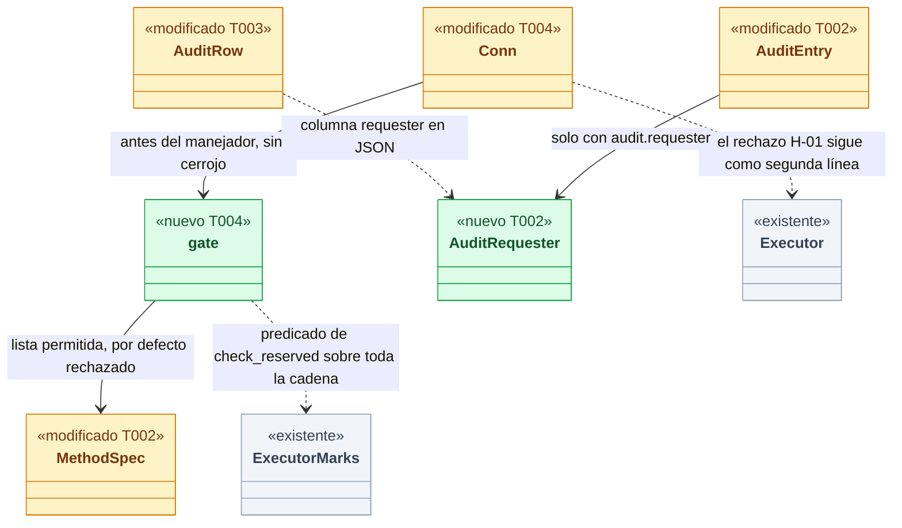
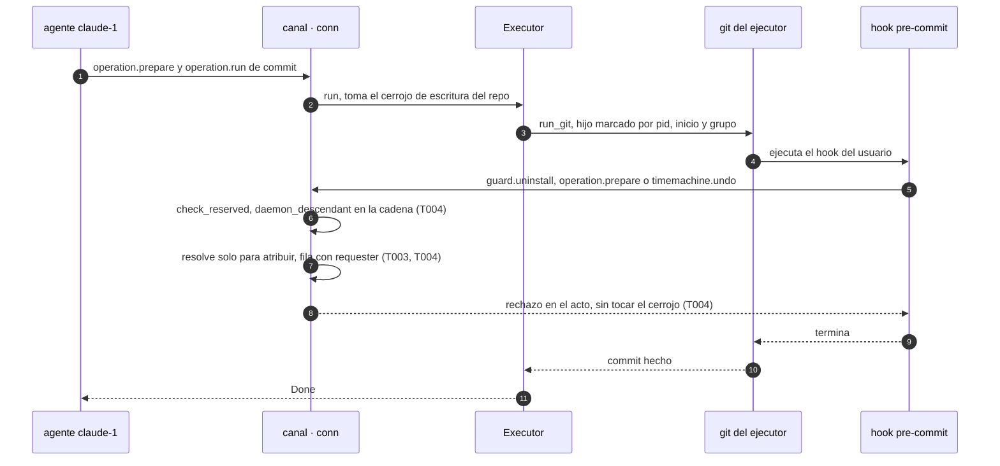
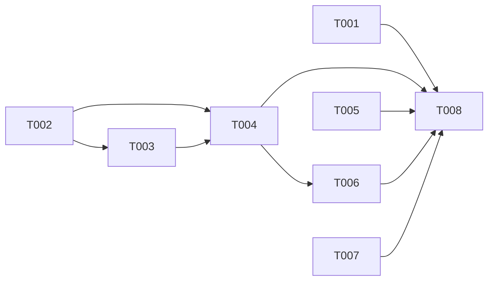

# DS-US-MCP-007 · Confused deputy: los procesos de una operación de un agente no usan los poderes del desarrollador

## Contexto rápido

Al terminar, el desarrollador puede abrir la auditoría y ver a nombre de claude-1 cada cosa que pidió un hook lanzado por una operación de claude-1. Ese hook solo puede leer y evaluar: no relaja Guardrails, no lanza ni cancela operaciones, no da confirmaciones, no deshace, no se registra como agente y no reemplaza el daemon. Además se le responde al momento, sin esperar al cerrojo que tiene su propia operación. Hoy el rechazo de los comandos reservados ya funciona, pero la auditoría guarda el proceso y no a quién representa. Los rechazos de `operation.*` no quedan auditados. Un `undo` pedido desde el hook se queda esperando al cerrojo de su propia operación. Y un hook puede registrar a claude-1 en otro worktree.

La mayor parte del mecanismo ya está en main: las marcas del ejecutor, el rechazo `daemon-descendant` de lo reservado y el rechazo `executor-descendant` del ejecutor (H-01). Esta entrega hace cuatro cosas: verifica los cuatro escenarios de extremo a extremo con un hook real; añade el solicitante a la auditoría; pone en el canal una puerta con lista permitida para los descendientes del daemon; y añade casos al corpus del MCP. Las decisiones de fondo son de ADR-GRP-005 § 6 y su Enmienda (2026-10-04, Cockpit), y de ADR-CKP-002 § 3, § 4 y Validación 17. Aquí no se reabren.

| Término | Qué es aquí |
|---|---|
| Descendiente del daemon | Proceso cuya cadena de ascendencia (la propia o la de su líder de sesión) pasa por el daemon o por un proceso marcado por una operación. Es el predicado de `daemon-descendant`: `check_reserved(..).client.daemon_descendant` (`authz.rs:208`) |
| Marca | `ExecutorMarks`: `(pid, start)` y grupo de procesos de cada hijo que lanza un paso, mientras la operación sigue abierta. `run_git` marca a sus hijos (`timemachine/protected/mod.rs:325-331`) |
| Solicitante | Quién pidió la operación (`Who`), según lo resuelve el daemon. Un proceso marcado se resuelve con `via: executor` y hereda el solicitante del plan |
| claude-1 | Etiqueta de la historia para la sesión de agente que pidió la operación. En las pruebas es la sesión del agente simulado; se compara por `session_id`, no por nombre |
| Puerta | Rechazo en el canal, antes del manejador, de todo método que no declare `descendant_may_call` cuando quien llama es descendiente del daemon (§ Firmas del stack) |
| Comando reservado | Método con `reserved: true` en `crates/api/src/methods/*.rs`. `daemon.replace` fuera del caso de actualización también lo es |
| A-2 | Vector de ADR-GRP-005 (Enmienda TS-GRP-004, punto 9): ascendencia limpia y terminal de control conseguidas por otra aplicación del usuario |

⚠️ **ASSUMPTION**: no existe `architecture-constitution.md`; rigen `AGENTS.md` y los ADR de `must_read` (NFR-01, NFR-02, ADR-GRP-016), como en DS-US-MCP-008.

---

## 📋 Índice

> **Para aprobar:** [Contexto rápido](#contexto-rápido) · [⚠️ Gaps](#gaps-y-violaciones-de-la-constitución) · [🔭 La forma](#la-forma) · [Análisis de amenazas](#análisis-de-amenazas) · [Decisiones](#decisiones-validadas).
> **Para implementar:** [🚀 Plan](#plan-de-implementación), en orden. Las secciones `_(ref)_` se abren desde la tarea que las cita.

| Sección | Propósito |
|---------|-----------|
| [Contexto rápido](#contexto-rápido) | Qué se construye, por qué, y el glosario |
| [⚠️ Gaps y violaciones de la constitución](#gaps-y-violaciones-de-la-constitución) | Qué impide empezar o liberar |
| [🔭 La forma](#la-forma) | Qué piezas quedan y cómo fluye |
| [Análisis de amenazas](#análisis-de-amenazas) | STRIDE: amenaza → control → prueba, y riesgos residuales |
| [🚀 Plan de implementación](#plan-de-implementación) | T001…T008, en orden |
| ↳ [El trabajo de un vistazo](#el-trabajo-de-un-vistazo) | Las tareas en una tabla, y su orden |
| [Estructura de ficheros](#estructura-de-ficheros) _(ref)_ | Tramos disjuntos |
| [Contratos compartidos](#contratos-compartidos) _(ref)_ | Tipos y firmas |
| [Contrato de API](#contrato-de-api) _(ref)_ | Errores, capacidad, numéricos |
| [Modelo de datos](#modelo-de-datos) _(ref)_ | Migración 6 del índice |
| [Estrategia de pruebas y cobertura](#estrategia-de-pruebas-y-cobertura) _(ref)_ | Escenario → prueba |
| [Gate de seguridad](#gate-de-seguridad) | Checklist pre-merge |
| [Fuera de alcance](#fuera-de-alcance) | Not Built (diferido) |
| [Decisiones validadas](#decisiones-validadas) | Lo que fija esta spec, con los ajustes de Arquitecto y PO |
| [Notas del autor](#notas-del-autor) _(ref)_ | Evidencia, pistas y colisiones |

---

## ⚠️ Gaps y violaciones de la constitución

_No gaps. Ready to implement._ Arquitecto y PO validaron D1 a D9 el 2026-10-09, con los ajustes que recoge § Decisiones validadas, y security-expert las firmó con condiciones (D10, § Gate de seguridad), todas aplicadas. Las enmiendas de documentos son la tarea T007.

---

## 🔭 La forma

Queda una sola regla en el canal para los descendientes del daemon. Lo reservado se rechaza como hoy, y todo método que no declara `descendant_may_call` se rechaza en la puerta. La puerta decide con el mismo predicado que `daemon-descendant`, sobre la cadena completa. Cada intento deja una fila de auditoría con el solicitante que el daemon resolvió.



🟩 nuevo · 🟨 modificado · ⬜ existente. La arista `gate --> MethodSpec` es la decisión central: un método nuevo nace rechazado para los descendientes hasta que su módulo declare lo contrario.

**Cómo fluye:**



El paso 6 es el que decide. No usa `requester::resolve`, que se detiene en el primer ejecutable `claude` (`requester.rs:236`) antes de ver la marca. Usa el recorrido de `check_reserved`, que mira toda la cadena. Así un `timemachine.undo` del hook ya no llega a `repo_lock::lock_queued` (`timemachine/undo.rs:706`). El paso 7 cambia un contrato publicado: `audit.list` sirve `requester` solo a quien acepta `audit.requester`.

---

## Análisis de amenazas

Superficie: un proceso del mismo usuario que nace dentro de una operación pedida por un agente y habla con el canal. Modelo de ADR-GRP-005 § 6: un agente comprometido que controla el contenido de los hooks del repo.

| ID | STRIDE | Amenaza | Control | Prueba |
|---|---|---|---|---|
| A1 | S, E | El hook pide un comando reservado haciéndose pasar por el desarrollador | `check_reserved` marca `daemon` si un eslabón es el daemon o está marcado (`authz.rs:208`) → `daemon-descendant` | `us_mcp_007.rs::a_hook_cannot_relax_a_guardrails_rule` y `every_reserved_method_is_refused_to_an_executor_descendant` |
| A2 | E | El hook abre una pty (`script`) para tener terminal y líder de sesión | El recorrido del propio llamante encuentra el eslabón marcado antes de mirar la terminal | `us_mcp_007.rs::a_hook_under_a_pty_is_still_refused` |
| A3 | E | El hook pide una operación del catálogo o la ejecuta | Puerta (T004) y, detrás, `Executor::prepare`/`run_any`/`run` (`executor/mod.rs:505`, `:659`, `:769`) | `us_mcp_007.rs::a_hook_cannot_ask_for_a_catalog_operation` |
| A4 | E | El hook cancela la operación que lo lanzó | Puerta y `Executor::cancel` (`executor/mod.rs:1001`) | `us_mcp_007.rs::a_hook_cannot_cancel_the_running_operation` |
| A5 | E | El hook da una confirmación pendiente: aplica la desinstalación anunciada o pasa un token de confirmación de la Time Machine | `guard.uninstall` es reservado, lleve `confirm` o no; `timemachine.undo`/`restore` caen en la puerta; además `confirmation_refusal` da `daemon-descendant` (`requester.rs:339`) | `us_mcp_007.rs::a_hook_cannot_give_a_pending_confirmation` |
| A6 | D | Interbloqueo por reentrada: el hook pide `undo`, `redo` o `restore` y espera al cerrojo que tiene su propia operación; `git` espera al hook | Puerta: respuesta conservadora `repo-busy` antes de `lock_queued` (D3) | `us_mcp_007.rs::a_hook_undo_is_refused_without_waiting_for_the_lock` y `a_hook_undo_on_another_repo_is_refused_too` |
| A7 | S | Nieto desacoplado con doble fork (`sh -c '… &'`) que sigue vivo cuando el hook termina | Marca por grupo de procesos hasta que la operación se cierra (`marks.rs`, Unix) | existente: `channel_protected.rs::a_child_of_the_operation_cannot_use_a_reserved_command` |
| A8 | S | Nieto con `setsid` (sale del grupo) que pide después | Fuera del árbol: sin terminal de control → `no-controlling-terminal`; como "sin atribuir" no tiene capa `cockpit` → `unattributed-without-cockpit` | existentes de `authz.rs` y de `admit` en `executor`; residual R1 si además consigue una pty |
| A9 | S | Reutilización de PID: un proceso nuevo con el pid de un hijo marcado, o un padre más joven que su hijo | Identidad `(pid, start)` comprobada antes y después del recorrido; padre más joven → `broken`; un grupo solo marca procesos que arrancaron después de abrir la operación (`opened_us`) | existentes: `authz.rs::a_descendant_of_the_daemon_is_refused` y `marks.rs::children_and_their_group_are_marked_until_the_operation_closes` |
| A10 | T | El hook altera su entorno (`HOME`, `PATH`, `CLAUDE_PROJECT_DIR`, `GITRAPTOR_AGENT_EXECUTABLES`) para cambiar su clasificación | La decisión sale solo de la tabla de procesos del SO (`Checks` no tiene entrada de entorno); los ajustes de entorno de prueba solo existen en debug | `us_mcp_007.rs::a_hook_with_a_hostile_environment_gets_the_same_answers` |
| A11 | E | La conexión del MCP fabrica un método reservado | Perfil `mcp` → `not-available-to-mcp` para todo reservado (`Conn::reserved`, `conn.rs:2264`); el catálogo de herramientas no tiene ninguno | `us_mcp_007.rs::every_reserved_method_over_mcp_is_refused_and_changes_nothing`; casos del corpus de T005 |
| A12 | R, E | Suplantación de identidad. Hoy (`conn.rs:1716-1790`) el hook falla `check_reserved`, sigue la rama de agente y se resuelve como claude-1. Después registra "Claude Code" en el cwd del hook con la sesión de claude-1. Con un `cd` previo, ata a claude-1 a otro worktree. Además la fila de auditoría no dice a quién representa el proceso | `registration.register` no declara `descendant_may_call`: la puerta lo rechaza con `agent-mismatch` y la fila lleva `daemon-descendant` (D4). `requester` resuelto por el daemon en cada fila (D1). Tabla append-only | `us_mcp_007.rs::a_hook_cannot_register_itself_as_an_agent` (registra desde el cwd de otro worktree) y `a_hook_request_is_attributed_to_the_operation_requester` |
| A13 | D | El hook inunda la auditoría o fuerza recorridos de procesos sin límite | La puerta mira el cubo (`RESERVED_BURST`, 5 por conexión) **antes** de recorrer la cadena y lo gasta una sola vez por petición; sin cubo, `rate-limited`, sin recorrido y sin fila (L-03) | `deputy.rs::the_gate_spends_the_reserved_bucket_once` y `the_bucket_is_checked_before_the_walk` |
| A14 | S | El hook se conecta antes de que el hijo quede marcado | Con un arranque pendiente, la puerta espera `marks.wait_registered(REGISTRATION_WAIT)` antes de recorrer (L-01); pasado el plazo, `Unverified` y rechazo | existente: `requester.rs::an_unmarked_child_after_the_start_barrier_is_unverified_without_a_terminal_proof`; `deputy.rs::the_gate_waits_for_a_pending_spawn` |
| A15 | E, R | Salto de la puerta con un `claude` interpuesto: el hook lanza un ejecutable llamado `claude` con `setpgid` fuera del grupo marcado. Su hijo se resuelve por ascendencia como agente sin pasar por la marca, `prepare` no lo rechaza y espera al cerrojo (vuelve A6). Y la fila lo atribuiría al `claude` falso (repudio) | La puerta usa `check_reserved(..).client.daemon_descendant`, que recorre toda la cadena, nunca `ResolvedVia`. El `requester` de la fila sale del primer eslabón **marcado** de `verdict.chain` (`marks.lookup`: `who` y `operation_id`); `resolve` solo si ningún eslabón está marcado (M-02) | `us_mcp_007.rs::an_interposed_claude_does_not_open_the_gate`, que comprueba además que `requester.session_id` es el de claude-1 |
| A16 | E, D | `daemon.replace` desde un hook durante una actualización: el punto 4 de la Enmienda TS-GRP-004 lo aceptaría sin controles y reemplazaría el daemon con una operación protegida abierta (NFR-01). También por el saludo incompatible: `incompatible()` entra en `replace()` sin pasar por `dispatch` (`conn.rs:661-663`), y la rama `installed` acepta sin recorrer la cadena (`conn.rs:2170-2179`); el binario del hook de Guardrails es justo ese | `daemon.replace` no declara `descendant_may_call`, y la comprobación de descendiente es la **primera** sentencia de `Conn::replace` (H-01), no solo de `dispatch`: `-32003` `daemon-descendant` | `us_mcp_007.rs::a_hook_cannot_replace_the_daemon` y `a_hook_cannot_replace_the_daemon_from_an_incompatible_greeting`; regresión: `a_refused_replace_keeps_the_granted_capabilities` |
| A18 | D, E | El hook, o un nieto que sobrevive, cancela la ventana de `guard.uninstall` que abrió el desarrollador: `guard.cancel` no mira quién llama ni gasta cubo (`daemon/guard.rs:191`) | `guard.cancel` sale de la lista permitida (M-01): la puerta lo rechaza a un descendiente. El resto del problema queda como deuda (N9) | `us_mcp_007.rs::a_hook_cannot_cancel_the_developers_pending_uninstall` |
| A19 | S | Tras cerrarse la operación, un nieto que sobrevive pide como si fuera el desarrollador | Sin marca, se resuelve "sin atribuir" y, sin terminal, no pasa los controles 1 a 3 | `us_mcp_007.rs::a_grandchild_after_the_operation_closes_is_unattributed` (`operation.prepare`, `undo`, `registration.register`, `guard.cancel`) |
| A17 | E | Un hook bajo un plan "sin atribuir" con capa `cockpit` hereda la capa o confirma (Validación 17, última frase) | `layer_for` da `mcp` a `via: executor`; el `test_layer_override` no se aplica a un descendiente (`conn.rs:2855`); la puerta rechaza la confirmación | `us_mcp_007.rs::a_hook_under_an_unattributed_plan_cannot_confirm_or_inherit_the_layer` |

### Riesgos residuales

- **R1, alto, aceptado** (ADR-MCP-001 § 9, S-05; ADR-GRP-005 § 6). Un descendiente que se desacopla con `setsid` y consigue una pty con un líder de sesión limpio (`open x.command`, `tmux new-window`: A-2) pasa los controles 1 a 3 fuera del MCP. Su fila de auditoría mostrará `requester` "sin atribuir", no claude-1. Lo mismo vale para una suscripción (`events.*`, `scope.subscribe`) abierta durante la operación, que sigue viva cuando la operación se cierra. Lo cierra el factor fuera de banda de ADR-GRD-008, que ya lista la allowlist del MCP entre sus candidatos.
- **R2, medio**. En Windows no hay grupos de procesos (`ORPHANS_MARKED = false`, W6). Un nieto huérfano no está marcado, su recorrido sale `broken` y un "sin atribuir" sin aval se rechaza (`requester.rs:199`). Es fail-closed, pero falta validarlo en una máquina real. Pendiente: etapa de validación multiplataforma.
- **R3, medio**. En Linux el daemon como *subreaper* (XP-17) no lo ejercita ningún test. Además, `start_us` en Linux tiene la granularidad del *tick* del reloj, así que la identidad `(pid, start)` es más débil (I-03). Pendiente: etapa de validación multiplataforma.
- **R6, bajo, aceptado** (I-01). `events.history`, `audit.list` y `sessions.list` siguen permitidos y muestran a un hook otros repos, otras sesiones y rutas de ejecutables. Con el mismo uid el hook ya puede leer el perfil (R5).
- **R4, bajo**. Un hook que abre muchas conexiones multiplica el cubo de auditoría. Lo acota el límite global de conexiones del canal.
- **R5, bajo** (I-01). Con el mismo uid, un hook puede escribir directamente en los archivos del perfil o en la configuración de Guardrails, sin pedir nada a GitRaptor. Las relajaciones del nivel del repo ya se ignoran (`config_guard.rs`); el resto es de ADR-GRD-008.
- **Por diseño**: el hook sigue pudiendo leer y evaluar (lista permitida de T002). Esas peticiones se atribuyen a claude-1. El hook de Guardrails depende de ello.

---

## 🚀 Plan de implementación

> Orden topológico (`Depende:`). Rutas relativas a la raíz del repo. Los tramos de § Estructura de ficheros son disjuntos; las ediciones de una línea en archivos compartidos se nombran (ADR-GRP-016).

### El trabajo de un vistazo

Cuatro frentes y un cierre: las pruebas en rojo (T001), el contrato y la auditoría (T002, T003), la puerta del canal (T004), el corpus y la E2E del escenario 4 (T005, T006), las enmiendas (T007) y el cierre (T008).

| # | Tarea | Depende | Aterriza en |
|---|---|---|---|
| T001 | Escribir las pruebas de los escenarios y amenazas en rojo | — | `crates/core/tests/` |
| T002 | Definir `descendant_may_call`, la capacidad `audit.requester` y `AuditRequester` | — | `crates/api/src/` |
| T003 | Añadir el solicitante a la fila de auditoría | T002 | `crates/core/src/profile/`, `crates/core/src/daemon/guard.rs` |
| T004 | Crear la puerta del canal y auditar con el solicitante | T002, T003 | `crates/core/src/channel/` |
| T005 | Añadir los casos de confused deputy al corpus del MCP | — | `apps/cli/tests/mcp_corpus/cases/` |
| T006 | Escribir la E2E del escenario 4 con los binarios reales | T004 | `apps/cli/tests/` |
| T007 | Aplicar las enmiendas de ADR, historias, guía y pendientes | — | `docs/` |
| T008 | Cerrar la verificación y el estado de la historia | T001, T004, T005, T006, T007 | `docs/` |

### En qué orden

Tres frentes paralelos (pruebas, corpus y documentos) y una cadena (contrato → auditoría → puerta → E2E) que convergen en el cierre.



### T001 — Escribir las pruebas de los escenarios y amenazas en rojo

**Objetivo.** Un archivo de pruebas de integración con un daemon en proceso y un hook real en un repo temporal: cubre los escenarios 1 a 3 y las amenazas de § Análisis de amenazas. Las pruebas se escriben contra el JSON del cable, para que compilen antes que T002.

**Ubicación.** `crates/core/tests/us_mcp_007.rs` (**CREATE**)

**Reglas**
- Copiar del arnés de `crates/core/tests/channel_protected.rs` lo necesario (`TempProfile`, `Backend`, `Snap`, `Gate`, `start_with`, `real_repo`), sin editar ese archivo. `#![cfg(unix)]`; las pruebas con `script`, `#[cfg(target_os = "macos")]`.
- El backend de prueba lleva una operación real, `commit` → `UserOp::CommitStaged`, ejecutada con el `run_git` de producción (`executor/git.rs:103`). Es `run_git` el que marca a sus hijos (`timemachine/protected/mod.rs:325-331`), y eso hace válida la prueba: el hook es un descendiente marcado igual que con el `commit` de producción. Guardrails, con el doble `Gate` en `Allow`.
- Repo temporal con un archivo preparado y un hook `.git/hooks/pre-commit` ejecutable: `#!/bin/sh` que lanza el binario de esta prueba con `hook_client_entry --exact --nocapture --test-threads=1` y la lista de llamadas en una variable de entorno. Termina con 0 para que el commit siga.
- `hook_client_entry` abre **una conexión por llamada** (el cubo es por conexión), mide cada respuesta con `Instant` y escribe `{method, code, data, elapsed_ms}` en un archivo de respuestas.
- Solicitante agente: `ChannelConfig.agents = AgentMatcher::only(["raptor-fake-agent"])`. El commit lo piden `operation.prepare` y `operation.run` desde una copia del binario de prueba llamada `raptor-fake-agent`, con `fake_agent_entry`. El cliente del hook no se llama así.
- A15: el hook copia el binario de prueba como `claude` en una carpeta temporal y lo lanza en su propio grupo (`setpgid` vía `std::os::unix::process::CommandExt::process_group(0)` en la entrada de prueba); su hijo pide `operation.prepare` y `timemachine.undo`. Con `AgentMatcher::only(["raptor-fake-agent", "claude"])` en esa prueba.
- La auditoría se lee con `audit.list` como `serde_json::Value` desde una conexión que acepta `audit.requester`. Se compara `requester.session_id` con la sesión del solicitante registrada en el oplog de la operación, `requester.via == "executor"` y `requester.operation_id` presente.
- "Nada cambia": antes y después se comparan la allowlist (`mcp.allowlist`), los repos observados, las raíces de descubrimiento, `guard.status`, los registros de agente y las sesiones (`sessions.list`), y el número de operaciones del oplog (exactamente la de claude-1); `HEAD` avanza solo por el commit de claude-1.
- "En el acto": cada respuesta del hook tarda menos de `HOOK_ANSWER_BUDGET` mientras la operación sigue abierta. Es un techo de la prueba, no una promesa de tiempo de respuesta al usuario. Sin esperas fijas: los bucles tienen plazo.
- Los tests de § 9.4 que viven en este archivo, con esos nombres.

- **Depende:** —
- **Refs:** US-MCP-007 (Gherkin), ADR-CKP-002 Validación 17, DS-US-MCP-008 T001
- **Aceptación:** `cargo test -p gitraptor-core --test us_mcp_007` compila y falla en rojo en las aserciones de `requester` y de la puerta (A6, A12, A15, A16) con el código actual

### T002 — Definir `descendant_may_call`, la capacidad `audit.requester` y `AuditRequester`

**Objetivo.** La lista permitida declarada por cada módulo y el cambio de forma de la auditoría como capacidad (ADR-GRP-016); sin lógica de daemon.

**Ubicación.**
- `crates/api/src/methods/mod.rs` (**MODIFY**, una vez: el campo `MethodSpec.descendant_may_call`, `const fn descendant_may_call(self)` y `false` en `method()` y `pending()`)
- `crates/api/src/methods/connection.rs`, `events.rs`, `requester.rs`, `guard.rs`, `engine.rs`, `sessions.rs`, `scope.rs`, `repo.rs`, `timemachine.rs`, `operation.rs`, `mcp.rs`, `audit.rs`, `discovery.rs` (**MODIFY**, `.descendant_may_call()` en los métodos de la lista permitida)
- `crates/api/src/methods/audit.rs` (**MODIFY**, además): `CAP_AUDIT_REQUESTER` en `capabilities` de `GROUP`
- `crates/api/src/messages.rs` (**MODIFY**): `AuditRequester` y el campo `AuditEntry.requester`
- `crates/api/tests/us_mcp_007_contract.rs` (**CREATE**)

**Pasos**
1. Añadir el campo y el constructor de § Tipos y datos compartidos. Por defecto `false`: un método nuevo nace rechazado para los descendientes.
   1.1 ⛔2.1 Todo literal `MethodSpec { .. }` lleva el campo: `time_machine()` en `timemachine.rs` y `REPLACE_AS_STOP` en `conn.rs:95` (este último lo pone T004). Si alguno queda en `true` por copia, un descendiente pasa la puerta.
2. Declarar `.descendant_may_call()` exactamente en: `hello`, `ping`, `connection.accept`, `events.subscribe`, `events.unsubscribe`, `events.history`, `requester.resolve`, `guard.evaluate`, `guard.status`, `guard.plan`, `guard.log`, `engine.snapshot`, `engine.resources`, `sessions.list`, `scope.snapshot`, `scope.subscribe`, `repo.locate`, `timemachine.timeline`, `operation.describe`, `mcp.status`, `mcp.allowlist`, `audit.list`, `discovery.roots` y `discovery.candidates`. Ni `guard.cancel` (M-01) ni `timemachine.snapshot` (M-03, N5).
3. `AuditRequester` y `AuditEntry.requester` con `#[serde(default, skip_serializing_if = "Option::is_none")]`: sin solicitante, el JSON es byte a byte el de hoy.
4. No tocar `lib.rs` ni `rpc.rs` (`crates/api/tests/architecture.rs`).

> **Nota técnica.** El cliente de `crates/core` acepta en `connection.accept` toda capacidad de `capability::all()` (`crates/core/src/client.rs:77`). Por eso los clientes del repo que leen `AuditEntry` reciben `requester` en cuanto existe la constante, y tienen que seguir en verde (paso 3 de "Añadir una capacidad" de la guía).

- **Depende:** —
- **Refs:** ADR-GRP-016 § 1, `extender-sin-archivos-compartidos.md` (§ Añadir un método, § Añadir una capacidad)
- **Aceptación:** `cargo test -p gitraptor-api --test us_mcp_007_contract` en verde con `the_descendant_set_is_closed` (la lista exacta del paso 2), `the_mcp_method_set_is_closed`, `an_audit_entry_without_requester_keeps_the_old_shape` y `an_audit_entry_round_trips_with_requester`; y `cargo test -p gitraptor-cli --test agent_registration --test repo_state --test channel_process` en verde
- **Guard ⛔2.1:** `the_descendant_set_is_closed`

### T003 — Añadir el solicitante a la fila de auditoría

**Objetivo.** La columna `requester` del índice y el campo de `AuditRow`; las filas viejas quedan con `NULL`.

**Ubicación.**
- `crates/core/src/profile/schema.rs` (**MODIFY**): migración 6 de `INDEX_MIGRATIONS`
- `crates/core/src/profile/index.rs` (**MODIFY**): `AuditRow.requester`, `append_audit`, `audit`
- `crates/core/src/daemon/guard.rs` (**MODIFY**): `audit_pending` con `requester: None`
- `crates/core/tests/profile_reserved_audit.rs` (**MODIFY**): el literal de `row()` y la prueba de la migración

**Pasos**
1. Añadir la migración 6 de § Modelo de datos al final de `INDEX_MIGRATIONS`.
   1.1 ⛔3.1 Nunca editar las migraciones 1 a 5 publicadas. Si al rebasar otra rama tomó la 6, tomar la siguiente libre.
2. `AuditRow.requester: Option<String>` (JSON de `AuditRequester`); `INSERT` y `SELECT` con la columna.

- **Depende:** T002
- **Refs:** ADR-GRP-013 § 1, ADR-GRP-006 § 4
- **Aceptación:** `cargo test -p gitraptor-core --test profile_reserved_audit` en verde, con `migration_6_keeps_every_row_and_the_triggers` (filas de la versión 5 intactas, `UPDATE` y `DELETE` siguen fallando)
- **Guard ⛔3.1:** `migration_6_keeps_every_row_and_the_triggers`

### T004 — Crear la puerta del canal y auditar con el solicitante

**Objetivo.** Rechazar en el canal, antes de cualquier manejador y sin cerrojo, todo método no permitido a un descendiente del daemon, y escribir el solicitante en toda fila de auditoría.

**Ubicación.**
- `crates/core/src/channel/deputy.rs` (**CREATE**): `gate`, `refusal`, `audit_requester`, pruebas unitarias
- `crates/core/src/channel/mod.rs` (**MODIFY**, una línea `mod deputy;`)
- `crates/core/src/channel/conn.rs` (**MODIFY**): `REPLACE_AS_STOP`, `dispatch`, `reserved`, `audit`, `audit_list`, `audit_entry`

**Pasos**
1. En `dispatch`, después de la comprobación de existencia y antes del manejador, si `!spec.descendant_may_call && !spec.reserved`, en este orden:
   1.1 ⛔4.2 Cubo primero (L-03): si el método no lo gastó ya (`reserved_like`, `conn.rs:692`), tomar `reserved_bucket`; vacío → `RATE_LIMITED`, sin recorrido y sin fila. Nunca se gasta dos veces.
   1.2 Si `marks.spawn_pending()`, `marks.wait_registered(REGISTRATION_WAIT)` antes de recorrer (L-01).
   1.3 ⛔4.1 `check_reserved(self.peer, &self.ctx.checks())` y `deputy::gate(&verdict, &marks)`. El predicado es `verdict.client.daemon_descendant`, sobre toda la cadena y la del líder; nunca `ResolvedVia::Executor` (A15). La identidad no verificada (`identity-unverified`, o `unsupported` con la cadena vacía) es rechazo **solo mientras** `!marks.is_empty() || marks.spawn_pending()` (M-04). Sin operaciones abiertas, una cadena rota pasa la puerta y decide el manejador, como hoy: si no, en Windows dejaría fuera al desarrollador y a los agentes con un `repo-busy` falso.
   1.4 Con rechazo: el `requester` de la fila sale del primer eslabón marcado de `verdict.chain` (`marks.lookup`: `who` y `operation_id`); `requester::resolve` solo si ningún eslabón está marcado (M-02). Escribir la fila (`outcome: rejected`, `reason` del predicado) y responder `deputy::refusal(spec)`. Si la fila no se escribe, `INTERNAL` y nada se ejecuta.
   1.5 ⛔4.3 Nada de la puerta toma `repo_lock` ni espera al ejecutor; la única espera es la barrera de 1.2.
2. ⛔4.4 `Conn::replace`: su **primera** sentencia es la misma comprobación (1.1 a 1.4) con `spec = daemon.replace` (H-01). `replace()` también se alcanza desde `incompatible()` sin pasar por `dispatch` (`conn.rs:661-663`), y su rama `installed` acepta sin recorrer la cadena (`conn.rs:2170-2179`).
3. Invariante: el manejador nunca concede más que la puerta. Su segundo recorrido solo puede ser más restrictivo, y el solicitante de la conexión no se guarda en caché entre peticiones.
4. `reserved()`: el solicitante de la fila sale igual que en 1.4 (eslabón marcado primero, `resolve` si no hay), en los dos perfiles; `Err(Unverified)` → `requester: None`.
5. `audit()` recibe `requester: Option<&AuditRequester>` y lo guarda en `AuditRow.requester`.
6. `audit_entry`: un `requester` ilegible da `requester: None`, nunca `None` para toda la fila: una fila de auditoría no desaparece de `audit.list` por su solicitante. Los demás campos siguen como hoy.
7. `audit_list`: `requester` solo si `self.has(CAP_AUDIT_REQUESTER.name)`. El evento `reserved.audit` se publica siempre con `requester: None`.
8. `deputy::audit_requester`: `via == executor` ⇒ `operation_id` presente; si faltara, `debug_assert!` y `via` tal cual.
9. Los rechazos del ejecutor (`executor/mod.rs`) no cambian: quedan como segunda línea.

> **Nota técnica.** `requester::resolve` se detiene en el primer ejecutable clasificado como agente (`requester.rs:236`) antes de mirar marcas más arriba. `check_reserved` sigue recorriendo y acumula `daemon` sobre toda la cadena (`authz.rs:202-209`). Por eso la puerta usa este último.

> **Nota técnica.** `timemachine.undo` y `restore` toman `repo_lock::lock_queued` (`undo.rs:706`, `restore.rs:309`) y no miran si quien llama desciende del daemon: hoy un hook que los pide espera a su propia operación (A6).

- **Depende:** T002, T003
- **Refs:** ADR-GRP-005, Enmienda (2026-10-04, TS-GRP-004) puntos 4 y 7 y Enmienda (2026-10-04, Cockpit); ADR-CKP-002 § 3 y Validación 17
- **Aceptación:** `cargo test -p gitraptor-core --test us_mcp_007` en verde (T001); `cargo test -p gitraptor-core --lib channel::deputy` con `the_gate_uses_the_daemon_descendant_predicate`, `the_gate_spends_the_reserved_bucket_once`, `the_bucket_is_checked_before_the_walk`, `the_gate_waits_for_a_pending_spawn`, `an_unverified_identity_passes_without_running_operations` (M-04) y `an_unreadable_requester_keeps_the_row`; `channel.rs`, `channel_protected.rs` y `channel_scopes.rs` en verde
- **Guard ⛔4.1:** `us_mcp_007.rs::an_interposed_claude_does_not_open_the_gate`
- **Guard ⛔4.2:** `deputy.rs::the_gate_spends_the_reserved_bucket_once`
- **Guard ⛔4.3:** `us_mcp_007.rs::a_hook_undo_is_refused_without_waiting_for_the_lock`
- **Guard ⛔4.4:** `us_mcp_007.rs::a_hook_cannot_replace_the_daemon_from_an_incompatible_greeting`

### T005 — Añadir los casos de confused deputy al corpus del MCP

**Objetivo.** Casos de nivel `server` por cada ejemplo del escenario 3 que no tiene caso todavía; un caso nuevo es un JSON, sin código.

**Ubicación.**
- `apps/cli/tests/mcp_corpus/cases/tool-unknown-mcp-disable.json` (**CREATE**)
- `apps/cli/tests/mcp_corpus/cases/tool-unknown-repo-add.json` (**CREATE**)
- `apps/cli/tests/mcp_corpus/cases/tool-unknown-repo-retire.json` (**CREATE**)
- `apps/cli/tests/mcp_corpus/cases/tool-unknown-guard-config.json` (**CREATE**)
- `apps/cli/tests/mcp_corpus/cases/tool-unknown-queue-decide.json` (**CREATE**)
- `apps/cli/tests/mcp_corpus/cases/tool-unknown-guard-install.json` (**CREATE**)
- `apps/cli/tests/mcp_corpus/cases/tool-unknown-guard-exec.json` (**CREATE**)
- `apps/cli/tests/mcp_corpus/cases/tool-unknown-daemon-stop.json` (**CREATE**)

**Reglas**
- Forma de `tool-unknown-reserved.json` (ya cubre "habilitar otro repo"): `threats: ["MCP02", "MCP07", "BR-MCP-AUTH-004"]`, `tier: "server"`, las tres plataformas, `forbidden: ["{repo}"]` y `expect.protocol_error {code: -32602, message: "unknown-tool"}`.
- Nombres de herramienta: el método del canal (`mcp.disable`, `repo.add`, `repo.retire`, `guard.install`, `daemon.stop`) o, sin método todavía, un nombre plausible (`guard.config.edit`, `guard.queue.approve`, `guard.exec`).

- **Depende:** —
- **Refs:** DS-INF-MCP-001 (formato del caso), BR-MCP-AUTH-004
- **Aceptación:** `cargo test -p gitraptor-cli --test mcp_security_corpus` en verde, con los ocho casos rechazados en el informe

### T006 — Escribir la E2E del escenario 4 con los binarios reales

**Objetivo.** Terminada una operación de claude-1, el desarrollador habilita "shop-docs" desde su terminal y la auditoría lo muestra como pedido por el desarrollador, no a nombre de claude-1.

**Ubicación.** `apps/cli/tests/mcp_confused_deputy.rs` (**CREATE**)

**Reglas**
- Copiar el arnés de `apps/cli/tests/mcp_allowlist.rs` (`Machine`, `fake_agent_entry`, `developer` con `script`), sin editar ese archivo. `#![cfg(target_os = "macos")]`.
- La operación de claude-1 es un `snapshot` por `raptor-mcp` bajo `raptor-fake-agent` en "shop" habilitado: hoy es la única operación del catálogo en producción.
- "shop-docs" es `f.other_repo`, observado con `raptor repo add` desde la pty.
- `raptor mcp enable <shop-docs>` desde `developer` termina con éxito. La última fila de `audit.list` (con `audit.requester`) es `mcp.enable` y `accepted`, sin `reason`, con `client.controlling_terminal` verdadero (pasó los controles 1 a 3). Su `requester` no es la sesión de claude-1: `actor` "sin atribuir" y `via != "executor"`.

- **Depende:** T004
- **Refs:** US-MCP-007 (escenario 4, con la redacción de T007), DS-US-MCP-002
- **Aceptación:** `cargo test -p gitraptor-cli --test mcp_confused_deputy` en verde: `after_the_agent_operation_the_developer_enables_shop_docs`

### T007 — Aplicar las enmiendas de ADR, historias, guía y pendientes

**Objetivo.** Dejar escritas las decisiones D1 a D7 con sus ajustes; no toca código.

**Ubicación.**
- `docs/architecture/decisions/ADR-GRP-005-forma-motor-proceso-segundo-plano.md` (**MODIFY**, Enmienda a § 6: punto 4 `daemon.replace` nunca desde un descendiente, § 6.6 registro desde un descendiente, § 6.7 solicitante en la auditoría)
- `docs/architecture/decisions/ADR-GRP-013-modelo-eventos-atribucion.md` (**MODIFY**, Enmienda: `requester` en la auditoría y las filas de la puerta)
- `docs/architecture/decisions/ADR-CKP-002-catalogo-operaciones-ejecutor.md` (**MODIFY**, nota en Validación 17: la puerta, el predicado y `repo-busy`)
- `docs/architecture/decisions/ADR-MCP-001-servidor-mcp-cliente-daemon.md` (**MODIFY**, § 4.3: el rechazo en preparar, ejecutar y cancelar ya está en main; fila MCP07)
- `docs/architecture/extender-sin-archivos-compartidos.md` (**MODIFY**, paso nuevo en "Añadir un método": declarar `.descendant_may_call()` si un hook bajo el ejecutor puede llamarlo; por defecto, no)
- `docs/requirements/features/mcp/user-stories/US-MCP-007-confused-deputy.md` (**MODIFY**: Dependencias, nota "Heredado" bajo las dos tablas de ejemplos, escenario 4)
- `docs/requirements/features/mcp/user-stories/US-MCP-009-safe-commit.md` (**MODIFY**, criterio: repetir los escenarios 1 y 2 de US-MCP-007 con el `commit` de producción y el hook real de Guardrails)
- `docs/requirements/features/mcp/technical-stories.md` (**MODIFY**, cadena de la línea ~111 sin TS-CKP-003 antes de US-MCP-007)
- `docs/requirements/features/mcp/technical-stories/INF-MCP-001-corpus-seguridad-mcp.md` (**MODIFY**, fila "Confused deputy" del estado del corpus)
- `docs/architecture/xplat-pendientes.md` (**MODIFY**, fila nueva con el siguiente número libre: R2, la E2E del hook en Linux, la cadena rota de Windows frente a la puerta (M-04) y la granularidad de `start_us` en Linux (I-03))
- `docs/requirements/features/guardrails/technical-stories/` (**CREATE**, la TD de N9 con el siguiente id libre de deuda de Guardrails)
- La historia US-TMC-005 (**MODIFY**, la condición de N5)
- Las historias de US-GRD-013, US-GRD-015 y la de la excepción consciente de ADR-GRD-007 § 3 (**MODIFY**, criterio "un hook lanzado por una operación de un agente y la conexión del MCP no pueden usarlo"; la ruta de cada una la localiza esta tarea en `docs/requirements/features/guardrails/`)

**Reglas**
- Cada enmienda lleva la fecha 2026-10-09 y "validada por Arquitecto y PO"; no se editan secciones ya aceptadas, se añade una Enmienda.
- Escenario 4 de la historia: "Entonces el comando se completa / Y el registro de auditoría lo muestra como pedido por el desarrollador, no a nombre de "claude-1"".
- Nota "Heredado" bajo las dos tablas de ejemplos: "editar la configuración de Guardrails", "decidir en la cola de confirmación" y "usar la excepción consciente" se verifican contra esta historia cuando llegue su método (US-GRD-013, US-GRD-015 y la historia de la excepción consciente de ADR-GRD-007 § 3).
- `release-plan.md` no lista TS-CKP-003 como requisito de US-MCP-007 (línea 194): no se toca.
- No tocar ADR-GRD-008 ni `docs/ARTIFACTS.md`.

- **Depende:** —
- **Refs:** § Decisiones validadas
- **Aceptación:** revisión; cada decisión D1 a D7 aparece en su documento con la fecha 2026-10-09

### T008 — Cerrar la verificación y el estado de la historia

**Objetivo.** La suite completa en verde y la historia marcada como implementada.

**Ubicación.** `docs/requirements/features/mcp/user-stories/US-MCP-007-confused-deputy.md` (**MODIFY**, `status`) · `docs/requirements/features/mcp/user-stories.md` (**MODIFY**, estado y changelog)

**Reglas**
- `cargo clippy --workspace --all-targets -- -D warnings` y `node tools/test/nextest-junit.mjs` en verde antes del PR.
- La sección "Estado de la implementación" de esta spec dice qué quedó pendiente en Linux y Windows.

- **Depende:** T001, T004, T005, T006, T007
- **Refs:** AGENTS.md (Reglas de calidad)
- **Aceptación:** `node tools/test/nextest-junit.mjs` sale con 0 y `target/nextest/ci/junit-paths.xml` lista `crates/core/tests/us_mcp_007.rs` sin fallos

---

> Las secciones siguientes son de referencia. Se abren desde la tarea que las cita, no se leen en orden.

## Estructura de ficheros

```text
crates/api/                               # Tramo A (T002) · ADR-GRP-016
├── src/methods/mod.rs                    ← MODIFY (campo y constructor, una vez)
├── src/methods/<módulo>.rs               ← MODIFY (.descendant_may_call() en la lista permitida)
├── src/messages.rs                       ← MODIFY (AuditRequester, AuditEntry.requester)
└── tests/us_mcp_007_contract.rs          ← CREATE
crates/core/src/profile/                  # Tramo B (T003) · ADR-GRP-013 § 1
├── schema.rs                             ← MODIFY (migración 6)
└── index.rs                              ← MODIFY
crates/core/src/daemon/guard.rs           ← MODIFY (Tramo B)
crates/core/tests/profile_reserved_audit.rs ← MODIFY (Tramo B)
crates/core/src/channel/                  # Tramo C (T004)
├── deputy.rs                             ← CREATE
├── mod.rs                                ← MODIFY (una línea)
└── conn.rs                               ← MODIFY
crates/core/tests/us_mcp_007.rs           ← CREATE (Tramo D, T001)
apps/cli/tests/                           # Tramo E (T005, T006)
├── mcp_confused_deputy.rs                ← CREATE
└── mcp_corpus/cases/tool-unknown-*.json  ← CREATE (ocho)
docs/                                     # Tramo F (T007, T008)
```

`← CREATE`: fichero nuevo. `← MODIFY`: fichero existente. Ningún fichero está en dos tramos. La prueba de regresión de A16 vive en el archivo del cliente del hook de Guardrails que pide `daemon.replace` (N7) y es parte del tramo C.

---

## Contratos compartidos

### Tipos y datos compartidos

```rust
// crates/api/src/methods/mod.rs
pub struct MethodSpec {
    // … fields of today …
    /// Whether a process started by a running operation (a hook under the executor) may call
    /// this method. `false` by default: a new method is refused to such a process until its
    /// module says otherwise.
    pub descendant_may_call: bool,
}
impl MethodSpec {
    pub(crate) const fn descendant_may_call(self) -> Self { Self { descendant_may_call: true, ..self } }
}

// crates/api/src/methods/audit.rs
/// `requester` in the entries of `audit.list` (US-MCP-007).
pub const CAP_AUDIT_REQUESTER: Capability = Capability::new("audit.requester");

// crates/api/src/messages.rs
/// Who the daemon attributed an audited request to: never declared by the client.
/// `via == executor` implies `operation_id` is present.
#[derive(Debug, Clone, PartialEq, Eq, Serialize, Deserialize, JsonSchema)]
#[serde(deny_unknown_fields)]
pub struct AuditRequester {
    pub actor: Actor,
    pub via: crate::timemachine::ResolvedVia,
    /// The agent session the request counts for; `None` when unattributed.
    #[serde(default, skip_serializing_if = "Option::is_none")]
    pub session_id: Option<String>,
    /// The running operation whose step started the caller (`via: executor`).
    #[serde(default, skip_serializing_if = "Option::is_none")]
    pub operation_id: Option<String>,
}

pub struct AuditEntry {
    // … fields of today, unchanged …
    /// Only for a connection with `audit.requester`; absent in older rows and when unreadable.
    #[serde(default, skip_serializing_if = "Option::is_none")]
    pub requester: Option<AuditRequester>,
}

// crates/core/src/profile/index.rs
pub struct AuditRow {
    // … fields of today …
    /// JSON of `AuditRequester`; `None` in rows written before migration 6.
    pub requester: Option<String>,
}
```

### Ciclos de vida (DI)

_No ambient state — DI lifetimes follow stack defaults._ `ExecutorMarks` sigue compartido por `Arc` entre la operación protegida y el canal, como hoy.

### Firmas del stack

```rust
// crates/core/src/channel/deputy.rs
/// Why the gate refuses a caller for a method without `descendant_may_call`, or `None`.
/// `DaemonDescendant` when the walk of `check_reserved` saw the daemon or a marked process
/// anywhere in the caller's chain or its session leader's; `IdentityUnverified`, or
/// `Unsupported` with an empty chain, when the walk could not be made, but only while an
/// operation is open or a spawn is pending (`!marks.is_empty() || marks.spawn_pending()`).
pub(crate) fn gate(verdict: &Verdict, marks: &ExecutorMarks) -> Option<RefusalReason>;

/// The answer to a refused method, in the error shape its clients already read.
pub(crate) fn refusal(spec: &MethodSpec) -> ErrorObject;

/// The audited requester: the `who` and `operation_id` of the first marked link of `chain`
/// (`marks.lookup`); `fallback` (a `requester::resolve`) only when no link is marked.
/// `operation_id` is set whenever `via == executor`.
pub(crate) fn audit_requester(
    chain: &[ChainLink],
    marks: &ExecutorMarks,
    fallback: impl FnOnce() -> Option<Resolution>,
) -> Option<AuditRequester>;

// crates/core/src/executor/mod.rs — Executor, existing and unchanged: prepare, run_any, run
// and cancel keep refusing `ResolvedVia::Executor` with `RejectReason::ExecutorDescendant`.

// crates/core/src/channel/conn.rs — Conn (private method, gains `requester`)
fn audit(
    &self,
    operation: &'static str,
    repo_id: Option<String>,
    outcome: AuditOutcome,
    reason: Option<RefusalReason>,
    client: &ClientIdentity,
    chain: &[ChainLink],
    requester: Option<&AuditRequester>,
) -> Result<(), ErrorObject>;
```

---

## Contrato de API

| Método | Desde un descendiente del daemon | Antes |
|---|---|---|
| Todo reservado | `RESERVED_REFUSED` `daemon-descendant`, fila con `requester` | igual, sin `requester` |
| `operation.prepare`, `run`, `cancel` | rechazo en la puerta, con fila | rechazo del ejecutor, sin fila; `prepare` podía dar antes un error de ámbito |
| `timemachine.undo`, `redo`, `restore` | `repo-busy` al momento, en cualquier repo; la fila guarda `daemon-descendant` | esperaba el cerrojo de su propia operación |
| `registration.register` | `agent-mismatch`; la fila guarda `daemon-descendant` | registraba a claude-1 en el cwd del hook |
| `daemon.replace` | `RESERVED_REFUSED` `daemon-descendant`, con fila | reemplazo sin controles si el binario cambió |
| `guard.cancel` | `RESERVED_REFUSED` `daemon-descendant`, con fila | cancelaba la ventana de cualquiera |
| `daemon.replace` desde el saludo incompatible | rechazo en la primera sentencia de `Conn::replace` | aceptado sin recorrer la cadena |
| Cualquier método nuevo sin `descendant_may_call` | rechazo en la puerta | — |
| `audit.list` | `requester` con `audit.requester`; un `requester` ilegible sale `None` y la fila se queda | sin campo; una fila ilegible desaparecía |

### Forma del error y del cuerpo de respuesta

Ningún código nuevo: la puerta reutiliza las formas que cada cliente ya lee. La respuesta y el motivo de la fila pueden diferir (`repo-busy` o `agent-mismatch` frente a `daemon-descendant`): la respuesta es la que el cliente sabe pintar, y la fila guarda el motivo real.

```json
// operation.prepare | run | cancel
{ "code": "OPERATION_REJECTED", "data": { "reason": "executor-descendant" } }
// timemachine.undo | redo | restore: la forma de TmRejectReason de un repo ocupado
{ "code": "OPERATION_REJECTED", "data": { "reason": "repo-busy" } }
// registration.register
{ "code": "REGISTRATION_REJECTED", "data": { "reason": "agent-mismatch" } }
// daemon.replace y todo reservado
{ "code": -32003, "data": { "reason": "daemon-descendant" } }
// fila de audit.list con audit.requester
{ "id": 7, "at_ms": 0, "operation": "operation.prepare", "repo_id": null, "outcome": "rejected",
  "reason": "daemon-descendant", "client": { "pid": 0, "start_us": 0, "exe": null, "agent_ancestor": false,
  "daemon_descendant": true, "controlling_terminal": false, "chain_truncated": false },
  "requester": { "actor": { "agent": "…" }, "via": "executor", "session_id": "…", "operation_id": "…" } }
```

`deputy::refusal` construye cada respuesta con el helper que ya existe para esa forma (`exec_error`, `registration_rejected`, el de la Time Machine y el de `RESERVED_REFUSED`), nunca a mano. Un método sin forma propia responde `RESERVED_REFUSED`. La forma exacta de `actor` es la de `gitraptor_api::Actor`.

### Forma de la configuración

_No aplica — esta entrega no lee configuración nueva._

### Valores numéricos

| Concepto | Valor | Fuente |
|---------|-------|--------|
| Intentos auditados por conexión | 1 por segundo, ráfaga de 5 | `RESERVED_BURST`, `conn.rs:92` |
| Espera de la barrera de arranque | 2 s | `REGISTRATION_WAIT`, `marks.rs` |
| Techo de la prueba para "en el acto" | < 5 s (`HOOK_ANSWER_BUDGET`), no es una promesa al usuario | D6: barrera de 2 s más holgura de CI |
| Página máxima de `audit.list` | 500 | `MAX_AUDIT_PAGE`, `conn.rs:87` |
| Tiempo máximo de una operación con capa `mcp` | 300 s | ADR-CKP-002 § 6 |

---

## Modelo de datos

Migración 6 de `INDEX_MIGRATIONS` (`crates/core/src/profile/schema.rs`):

```sql
-- US-MCP-007: who an audited request counts for, resolved by the daemon (ADR-GRP-013 § 1).
-- NULL in rows written before this migration.
ALTER TABLE reserved_audit ADD COLUMN requester TEXT;
```

`ADD COLUMN` sobre la tabla `STRICT` no reescribe filas ni dispara los triggers `BEFORE UPDATE`/`BEFORE DELETE`, y la tabla sigue siendo append-only. Un binario anterior que abre un índice migrado lo ve demasiado nuevo, sin perder datos.

---

## Estrategia de pruebas y cobertura

Contrato de `/implement`: `"suite": { "command": "node tools/test/nextest-junit.mjs" }` y `"layers": { "runtime": { "commands": [{ "id": "suite", "cmd": "node tools/test/nextest-junit.mjs" }], "report": "target/nextest/ci/junit-paths.xml" } }`. Las pruebas en rojo del contrato van en su propio archivo (`us_mcp_007.rs`, regla R4).

### 9.1 Pirámide de pruebas

| Tipo | Cantidad | Tareas dueñas | Herramientas | Cuándo |
|------|---------:|-------------|---------|------|
| Unit | 7 | T004 | cargo | PR gate |
| Contract | 4 | T002 | cargo | PR gate |
| Integration | 21 | T001, T003, T004 | cargo, git, repos temporales | PR gate |
| E2E | 1 | T006 | binarios `raptor` y `raptor-mcp`, `script` | PR gate (macOS) |
| Security | 8 | T005 | corpus INF-MCP-001 | merge gate |

### 9.2 Umbrales de cobertura

| Capa | Línea | Rama | Mutación | Camino crítico 100% |
|-------|-----:|-------:|---------:|:------------------:|
| `crates/core/src/channel/deputy.rs` | 100 % | 100 % | — | ✅ `gate`, `refusal` |

### 9.3 Datos de prueba

- Builders / fixtures: arnés copiado de `channel_protected.rs` con el `run_git` de producción; `Fixture` de `gitraptor-testkit` en la E2E.
- Multi-tenant data: no aplica.
- PII / PHI: ninguno; perfiles y repos temporales (NFR-01).
- Time / clock: sin esperas fijas; plazos con `Instant`.

### 9.4 Comportamientos críticos verificados

En `crates/core/tests/us_mcp_007.rs` salvo que se diga otro archivo:

- [ ] Escenario 1: `a_hook_request_is_attributed_to_the_operation_requester`. Control negativo: el hook también llama a `requester.resolve` y a `guard.status`, y los dos responden
- [ ] Escenario 2, relajar: `a_hook_cannot_relax_a_guardrails_rule` (`guard.uninstall`)
- [ ] Escenario 2, operación: `a_hook_cannot_ask_for_a_catalog_operation` (`operation.prepare` y `run` de `commit`)
- [ ] Escenario 2, cancelar: `a_hook_cannot_cancel_the_running_operation` (la operación termina `Done`)
- [ ] Escenario 2, confirmar: `a_hook_cannot_give_a_pending_confirmation` (`guard.uninstall` con `confirm`, `timemachine.undo` con `confirmation`)
- [ ] Todo reservado: `every_reserved_method_is_refused_to_an_executor_descendant` recorre `METHODS` (todo `reserved`), una conexión por método
- [ ] A6: `a_hook_undo_is_refused_without_waiting_for_the_lock` y `a_hook_undo_on_another_repo_is_refused_too`
- [ ] A2: `a_hook_under_a_pty_is_still_refused` (macOS)
- [ ] A10: `a_hook_with_a_hostile_environment_gets_the_same_answers`
- [ ] A12: `a_hook_cannot_register_itself_as_an_agent` (desde el cwd de otro worktree; respuesta `agent-mismatch`, fila `daemon-descendant`, ni registros ni sesiones nuevas)
- [ ] A15: `an_interposed_claude_does_not_open_the_gate` (y `requester.session_id` de la fila es el de claude-1)
- [ ] A16: `a_hook_cannot_replace_the_daemon` y `a_hook_cannot_replace_the_daemon_from_an_incompatible_greeting`; regresión `a_refused_replace_keeps_the_granted_capabilities` (el cliente del hook de Guardrails recibe `-32003` en vez de `-32602`, sigue con lo concedido y no deniega el commit)
- [ ] A18: `a_hook_cannot_cancel_the_developers_pending_uninstall`
- [ ] A19: `a_grandchild_after_the_operation_closes_is_unattributed`
- [ ] M-04: `deputy.rs::an_unverified_identity_passes_without_running_operations`
- [ ] A17: `a_hook_under_an_unattributed_plan_cannot_confirm_or_inherit_the_layer`
- [ ] Escenario 3: `every_reserved_method_over_mcp_is_refused_and_changes_nothing` recorre `METHODS`, una conexión `mcp` por método, y comprueba `not-available-to-mcp`, una fila por intento y nada cambiado
- [ ] Escenario 4: `apps/cli/tests/mcp_confused_deputy.rs::after_the_agent_operation_the_developer_enables_shop_docs`
- [ ] D1: `deputy.rs::an_unreadable_requester_keeps_the_row`

**Heredado** (D5): "editar la configuración de Guardrails", "decidir en la cola de confirmación" y "usar la excepción consciente" no tienen método hoy. Los cubren `the_descendant_set_is_closed`, `the_mcp_method_set_is_closed` y los casos `unknown-tool` del corpus, y se verifican contra esta historia cuando llegue su método (US-GRD-013, US-GRD-015 y la historia de la excepción consciente de ADR-GRD-007 § 3). "Relajar una regla" se prueba hoy con `guard.uninstall`, y "dar una confirmación", con `guard.uninstall` + `confirm` y el token de la Time Machine.

### 9.5 Plataformas

| Plataforma | Cómo se verifica | Pendiente |
|---|---|---|
| macOS | `cargo test` local y CI | — |
| Linux | `us_mcp_007` corre en CI `ubuntu-latest` (`cfg(unix)`); las pruebas con `script`, no | Pendiente: etapa de validación multiplataforma (XP-17, la fila nueva de T007) |
| Windows | Canal por named pipe ya existe (XP-01); marcas sin grupos de procesos (R2) | Pendiente: etapa de validación multiplataforma (la fila nueva de T007) |

---

## Gate de seguridad

- La decisión sale solo de la tabla de procesos del SO; el cliente no declara identidad, terminal ni solicitante.
- La puerta es una lista permitida: un método nuevo nace rechazado para los descendientes, y `the_descendant_set_is_closed` fija la lista.
- La puerta usa el predicado de `daemon-descendant` sobre toda la cadena, no la resolución del solicitante.
- La puerta no toma ningún cerrojo y responde antes de que el manejador lea el repo.
- Cada intento rechazado o aceptado deja una fila con `requester`; sin fila no hay ejecución; una fila nunca desaparece de `audit.list` por su solicitante.
- El catálogo de herramientas del MCP y la lista de métodos `mcp: true` son conjuntos cerrados con prueba.
- Los rechazos del ejecutor (H-01) siguen como segunda línea.
- Riesgos residuales R1 a R6 de § Análisis de amenazas.
- **Invariante**: el manejador nunca concede más que la puerta. Su segundo recorrido solo puede ser más restrictivo, y el solicitante de la conexión no se guarda en caché.

Firma de security-expert (2026-10-09): **firmada con condiciones**, todas aplicadas en esta spec.

| ID | Condición | Dónde | Prueba |
|---|---|---|---|
| H-01 | La comprobación de descendiente es la primera sentencia de `Conn::replace`, también desde el saludo incompatible | T004 paso 2, A16 | `a_hook_cannot_replace_the_daemon_from_an_incompatible_greeting` |
| M-01 | `guard.cancel` fuera de la lista permitida; deuda N9 | T002 paso 2, A18 | `a_hook_cannot_cancel_the_developers_pending_uninstall` |
| M-02 | `requester` de la fila desde el primer eslabón marcado; `resolve` solo sin eslabón marcado | T004 paso 1.4, A15 | `an_interposed_claude_does_not_open_the_gate` |
| M-03 | `timemachine.snapshot` fuera de la lista permitida hasta US-TMC-005 | T002 paso 2, § Fuera de alcance | `the_descendant_set_is_closed` |
| M-04 | Identidad no verificada es rechazo solo con operaciones abiertas o arranque pendiente | T004 paso 1.3; fila de xplat en T007 | `an_unverified_identity_passes_without_running_operations` |
| L-01 | Esperar la barrera antes del recorrido; invariante declarada arriba | T004 pasos 1.2 y 3 | `the_gate_waits_for_a_pending_spawn` |
| L-02 | Nieto tras el cierre "sin atribuir"; R1 incluye suscripciones | A19, R1 | `a_grandchild_after_the_operation_closes_is_unattributed` |
| L-03 | Cubo antes del recorrido | T004 paso 1.1 | `the_bucket_is_checked_before_the_walk` |
| I-01 | R6 aceptado | § Riesgos residuales | — |
| I-02 | `guard.policies` omitido por un descendiente | § Fuera de alcance | — |
| I-03 | Granularidad de `start_us` en Linux | R3, T007 | validación multiplataforma |

Corre `/security-review --scope devspec docs/requirements/features/mcp/dev-specs/US-MCP-007-dev-spec.md` antes de mezclar.

---

## Fuera de alcance

| Ítem / no-objetivo | Historia que lo cubre | Gate (cómo se verifica) |
|----------------|--------------------|-------------------------|
| `requester` en el evento `reserved.audit` y en la TUI. Añadir cuando el Cockpit muestre la auditoría | Cockpit (sin historia) | el evento publica `requester: None` (T004 paso 7) |
| Un descendiente puede no pedir `guard.policies` y recibir una evaluación más débil (`methods/guard.rs:58-62`, I-02). Añadir cuando Guardrails exija la capacidad a los hooks | ADR-GRD (nuevo hallazgo) | `guard.evaluate` sin cambios en este PR |
| `timemachine.snapshot` para el hook previo de la Time Machine. Añadir con su prueba, su cubo propio y sin desplazar la retención (M-03) | US-TMC-005 | `the_descendant_set_is_closed` no lo incluye |
| Factor fuera de banda contra A-2. Añadir cuando se acepte ADR-GRD-008 | ADR-GRD-008 | R1 en § Análisis de amenazas |
| Decisión de Guardrails heredada por los hooks del ejecutor | TS-CKP-003 | `guard.evaluate` declara `descendant_may_call` (`the_descendant_set_is_closed`) |
| `commit` del catálogo en producción, y repetir los escenarios 1 y 2 con él y con el hook real de Guardrails | US-MCP-009 (criterio añadido por T007) | `ProductionCatalog` sin cambios en este PR |
| Perfil `mcp` por solicitante (S-01) | v0.1.0 | sin cambios en `conn.rs` fuera de los pasos de T004 |
| Edición de la configuración, cola de confirmación y excepción consciente como métodos | US-GRD-013, US-GRD-015, ADR-GRD-007 § 3 | `the_descendant_set_is_closed` y `the_mcp_method_set_is_closed` |

---

## Decisiones validadas

| ID | Decisión | Estado |
|---|---|---|
| D1 | La auditoría guarda el solicitante (`requester`, columna nueva por migración 6 sobre la tabla `STRICT`) y `audit.list` lo sirve solo con la capacidad `audit.requester`. El evento `reserved.audit` conserva su forma. Ajuste: un `requester` ilegible sale `None` y la fila se queda en `audit.list`; invariante `via == executor` ⇒ `operation_id`; T002 deja en verde los clientes que leen `AuditEntry` | Validada por Arquitecto y PO (2026-10-09), con ajuste |
| D2 | Puerta en el canal con **lista permitida**: cada método declara `.descendant_may_call()` en el `MethodSpec` de su módulo y por defecto se rechaza; `the_descendant_set_is_closed` fija la lista. El predicado es el de `daemon-descendant` sobre toda la cadena (`check_reserved`), no `ResolvedVia`; `resolve` solo atribuye; `Unverified` dentro de la puerta es rechazo. El cubo se gasta una vez. Ajuste: la lista de rechazos propuesta se sustituyó, porque dejaba pasar métodos nuevos como `registration.unregister` (DS-US-MCP-006) | Validada por Arquitecto (2026-10-09), con ajuste: se rechazó la lista de rechazos |
| D3 | `undo`, `redo` y `restore` de un descendiente del daemon responden `repo-busy` al momento, en cualquier repo, sin cambio de forma. Es una respuesta conservadora: también se rechaza un `undo` sobre otro repo cuyo cerrojo nadie tiene. La fila guarda el motivo real (`daemon-descendant`) | Validada por Arquitecto y PO (2026-10-09), con ajuste |
| D4 | `registration.register` de un descendiente del daemon responde `agent-mismatch` y la fila guarda `daemon-descendant`. La amenaza es mayor que la propuesta: hoy el hook registraría a claude-1 en su cwd, y con un `cd` en otro worktree | Validada por Arquitecto y PO (2026-10-09), con ajuste |
| D5 | "Relajar una regla" = `guard.uninstall`; "dar una confirmación" = `guard.uninstall` + `confirm` y el token de la Time Machine. Ajuste: nota "Heredado" para los tres ejemplos sin método, criterio añadido a sus historias (T007) y la prueba genérica `every_reserved_method_is_refused_to_an_executor_descendant` | Validada por PO (2026-10-09), con ajuste |
| D6 | Los escenarios 1 a 3 se prueban con un daemon en proceso y un `commit` real de un backend de prueba que usa el `run_git` de producción (marca a sus hijos). El escenario 4 se prueba con los binarios reales y `snapshot`. Ajuste: registros y sesiones en "nada cambia"; US-MCP-009 repite los escenarios 1 y 2 con el `commit` de producción y el hook real de Guardrails. "< 5 s" es un techo de la prueba | Validada por Arquitecto y PO (2026-10-09), con ajuste |
| D7 | El corpus no puede lanzar un hook: añade casos `server` y la fila "Confused deputy" de INF-MCP-001 apunta a `crates/core/tests/us_mcp_007.rs` | Validada por Arquitecto y PO (2026-10-09) |
| D8 | TS-CKP-003 deja de ser requisito de US-MCP-007; T007 lo quita de la cadena de `technical-stories.md` | Validada por Arquitecto y PO (2026-10-09) |
| D9 | Escenario 4 de la historia: "Entonces el comando se completa / Y el registro de auditoría lo muestra como pedido por el desarrollador, no a nombre de "claude-1"". La prueba comprueba que la fila no es de claude-1 y que pasó los controles 1 a 3 | Validada por PO (2026-10-09) |

| D10 | Condiciones de security-expert H-01, M-01 a M-04, L-01 a L-03 e I-01 a I-03 (§ Gate de seguridad): puerta en `Conn::replace`, `guard.cancel` y `timemachine.snapshot` fuera de la lista permitida, solicitante desde el eslabón marcado, rechazo por identidad no verificada solo con operaciones abiertas, barrera antes del recorrido, cubo antes del recorrido | Validada por Arquitecto/PO y security-expert (2026-10-09) |

D1 a D9 quedan, además, firmadas por security-expert con esas condiciones: validadas por Arquitecto/PO y security-expert (2026-10-09).

Lo que fijan los ADR se cita y no se redecide: rechazo `daemon-descendant` (ADR-GRP-005, Enmienda TS-GRP-004, punto 7), atribución al solicitante del plan (Enmienda Cockpit), H-01 en el ejecutor (ADR-CKP-002 § 3) y el riesgo residual del desacople (ADR-MCP-001 § 9).

---

## Notas del autor

| ID | Nota | Acción | Owner |
|----|------|--------|-------|
| N1 | Hoy `Conn::audit` guarda `ClientIdentity` y la cadena, nunca el solicitante (`conn.rs:2302`), aunque ADR-GRP-005 (Enmienda Cockpit) y ADR-CKP-002 Validación 17 piden "la auditoría lo registra como claude-1". Es la brecha que cierra D1 | T003, T004 | rust-expert |
| N2 | `AuditEntry` es `deny_unknown_fields` (`messages.rs:1119`): un campo nuevo sin capacidad rompe a los clientes viejos. En el repo lo leen las pruebas `apps/cli/tests/{agent_registration,repo_state,channel_process}.rs` | T002 las deja en verde | rust-expert |
| N3 | ⚠️ **ASSUMPTION**: `AgentMatcher::only` resuelve al agente simulado como `Actor::Agent` en `requester::resolve`, como `self_as_agent` (`channel.rs:45`) lo hace para `check_reserved`. T001 lo comprueba primero; si no, el agente simulado se identifica con `GITRAPTOR_AGENT_EXECUTABLES` como en `mcp_allowlist.rs` | T001 | rust-expert |
| N4 | `raptor mcp enable` no pide confirmación interactiva hoy (`mcp_allowlist.rs:360` la usa sin `--yes`). Por eso el escenario 4 cambia de redacción (D9); el `requester` del desarrollador es "sin atribuir", y la prueba se queda con la comprobación negativa y la de los controles 1 a 3 | T007 | PO |
| N5 | `timemachine.snapshot` (US-TMC-005, sin implementar) **no** declara `descendant_may_call` (M-03). US-TMC-005 lo añade con su prueba, un cubo propio, sin desplazar la retención y sin esperar al cerrojo de escritura bajo el ejecutor | Anotar en US-TMC-005 (T007) | Arquitecto |
| N6 | La puerta recorre la cadena con `check_reserved` y resuelve al solicitante solo cuando rechaza; el manejador resuelve otra vez para los métodos que pasan. Son dos recorridos de procesos en escrituras, limitadas por los cubos | Ninguna | — |
| N7 | El camino del servidor lo fijó security-expert: `incompatible()` (`conn.rs:661-663`) y la rama `installed` de `replace()` (`conn.rs:2170-2179`). El cliente del hook de Guardrails que pide `daemon.replace` cuando le falta una capacidad no lo abrí: `grep -rn DAEMON_REPLACE crates apps` solo lo encontró en `channel/server.rs` y `conn.rs`. T004 lo localiza y pone ahí `a_refused_replace_keeps_the_granted_capabilities` | T004 | rust-expert |
| N9 | Deuda técnica (M-01): `guard.cancel` cancela la ventana de cualquiera, sin mirar quién llama ni gastar cubo (`daemon/guard.rs:191`). Solo debería poder cancelar quien abrió la ventana o quien pasa `check_reserved` | Crear la TD en Guardrails (T007) | Arquitecto |
| N8 | Colisión con DS-US-MCP-006: `the_mcp_method_set_is_closed` y `the_descendant_set_is_closed` frente a `registration.unregister`. Las dos specs tocan `conn.rs` y `schema.rs`. Quien mezcle después actualiza las listas cerradas y toma la siguiente migración libre | Coordinar al rebasar | orquestador |
