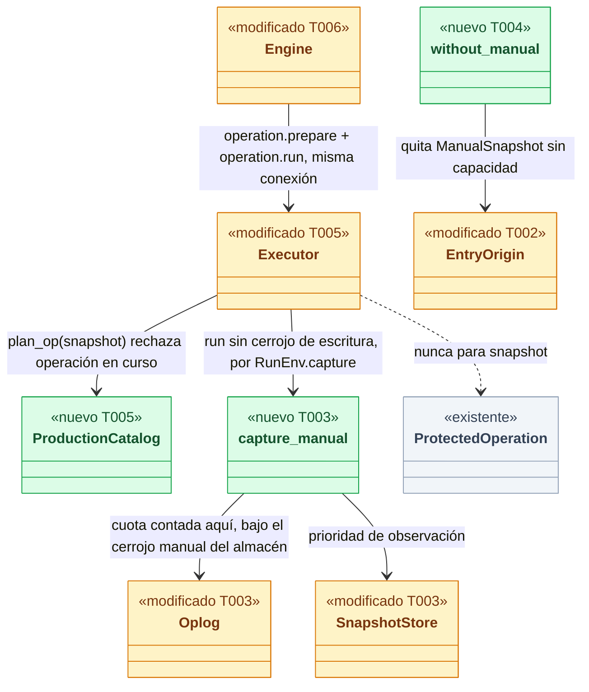
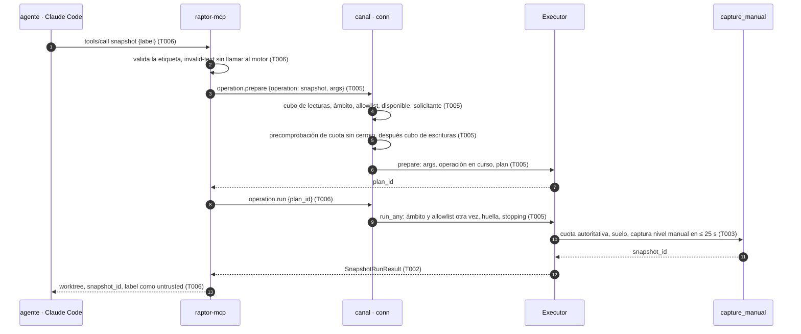
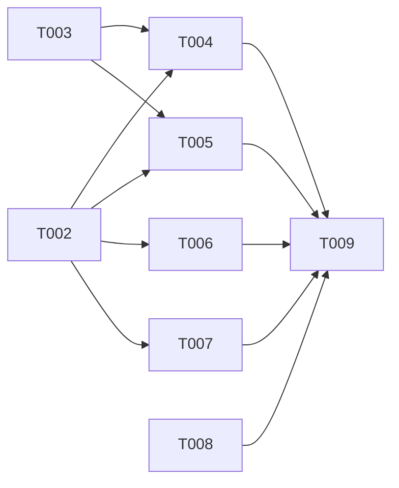

# DS-US-MCP-008 · Herramienta MCP `snapshot`: punto de recuperación manual

## Contexto rápido

Al terminar, un agente atribuido (Claude Code) llama a la herramienta MCP `snapshot` con una etiqueta corta y la Time Machine guarda un punto `manual` de su worktree, que el desarrollador ve en `raptor timeline` con el actor, el canal `mcp` y la etiqueta. Un agente en bucle choca con una cuota propia, recibe la espera real y nunca llena el disco ni borra nada. Hoy no puede: `raptor-mcp` solo ofrece `status` y el daemon responde "no implementado" a la operación `snapshot` del catálogo.

Para eso: el contrato (capacidades, códigos, vistas) en `crates/api`; la captura manual con cuota en la Time Machine y una migración del oplog; el ejecutor del catálogo cableado en producción, con `snapshot` fuera de la operación protegida; la herramienta en `raptor-mcp`; la fila nueva en `raptor timeline`; y las enmiendas de ADR, reglas e historias que esta entrega fija. Las cifras son de ADR-MCP-001 § 6 y ADR-TMC-004, Enmienda (2026-10-05, MCP).

| Término | Qué es aquí |
|---|---|
| Punto `manual` | Snapshot de la Time Machine pedido por un agente, con nivel `manual` (ADR-TMC-004 § 4). No es operación protegida, no toma el cerrojo de escritura del repo y no entra en la pila de `undo` |
| Cuota manual | Por (solicitante, worktree): ≤ 5 intentos en 60 s y ≤ 20 en 24 h. Techos de 24 h entre todos los solicitantes: ≤ 60 por worktree y ≤ 200 por repo. Ventanas móviles; cuenta todo intento que llegó a capturar, descartes incluidos (C1) |
| Solicitante | El `Requester::Agent` resuelto por ascendencia; su `session_id` es la clave de la cuota |
| Capacidad | Cambio de forma que el daemon sirve solo a quien lo declaró en `connection.accept` (ADR-GRP-016) |
| Suelo de espacio | `FreeSpaceFloor` de SEC-TMC-12, máx(5 GB, 5 %), el mismo de la captura continua |

⚠️ **ASSUMPTION**: no existe `architecture-constitution.md`; rigen `AGENTS.md` y los ADR de `must_read` (NFR-01, NFR-02, ADR-GRP-016), como en DS-US-TMC-006.

---

## 📋 Índice

> **Para aprobar:** [Contexto rápido](#contexto-rápido) · [⚠️ Gaps](#gaps-y-violaciones-de-la-constitución) · [🔭 La forma](#la-forma) · [El trabajo de un vistazo](#el-trabajo-de-un-vistazo) · [Decisiones](#decisiones-validadas).
> **Para implementar:** [🚀 Plan](#plan-de-implementación), en orden. Las secciones `_(ref)_` se abren desde la tarea que las cita.

| Sección | Propósito |
|---------|-----------|
| [Contexto rápido](#contexto-rápido) | Qué se construye, por qué, y el glosario |
| [⚠️ Gaps y violaciones de la constitución](#gaps-y-violaciones-de-la-constitución) | Qué impide empezar o liberar |
| [🔭 La forma](#la-forma) | Qué piezas quedan, qué cambia y cómo fluye |
| [🚀 Plan de implementación](#plan-de-implementación) | T001…T009, en orden |
| ↳ [El trabajo de un vistazo](#el-trabajo-de-un-vistazo) | Las tareas en una tabla, y su orden |
| [Estructura de ficheros](#estructura-de-ficheros) _(ref)_ | Tramos disjuntos de ficheros |
| [Contratos compartidos](#contratos-compartidos) _(ref)_ | Tipos y firmas |
| [Contrato de API](#contrato-de-api) _(ref)_ | Métodos, errores, numéricos |
| [Modelo de datos](#modelo-de-datos) _(ref)_ | Migración 3 del oplog |
| [Estrategia de pruebas y cobertura](#estrategia-de-pruebas-y-cobertura) _(ref)_ | Escenario → prueba |
| [Gate de seguridad](#gate-de-seguridad) | Checklist pre-merge y riesgos residuales |
| [Condiciones de seguridad](#condiciones-de-seguridad) | Lo que firmó security-expert, con su prueba |
| [Fuera de alcance](#fuera-de-alcance) | Not Built (diferido) |
| [Decisiones validadas](#decisiones-validadas) | Lo que fija esta spec, con los ajustes de Arquitecto y PO |
| [Notas del autor](#notas-del-autor) _(ref)_ | Convenciones observadas y mejoras detectadas |

---

## ⚠️ Gaps y violaciones de la constitución

_No gaps. Ready to implement._ Arquitecto y PO validaron todas las decisiones y security-expert firmó D5 y D8 con condiciones (§ Condiciones de seguridad); las que bloquean la mezcla están en § 9.4. Las enmiendas de documentos son la tarea T008.

---

## 🔭 La forma

Queda montada la primera escritura por MCP: `raptor-mcp` prepara y ejecuta la operación `snapshot` del catálogo en una sola llamada, el ejecutor la desvía fuera de la operación protegida hacia la captura manual de la Time Machine, y el timeline la muestra como una entrada propia.



🟩 nuevo · 🟨 modificado · ⬜ existente. La arista punteada a `ProtectedOperation` es la decisión central: `snapshot` pasa por el catálogo (precondiciones, solicitante, huella) pero no por la operación protegida.

**Cómo fluye:**



El paso 10 decide: la cuota se cuenta y el punto se graba bajo el mismo cerrojo manual del almacén, así dos conexiones del mismo agente nunca pasan las dos del punto 20. El paso 5 da la espera real a un agente en bucle: la cuota de 5 por minuto responde antes que el cubo de escrituras. El paso 4 cambia un contrato publicado: `operation.prepare` por MCP resuelve el worktree más profundo que contiene el cwd, como `mcp.status`.

---

## 🚀 Plan de implementación

> Orden topológico (`Depende:`). Rutas relativas a la raíz del repo. Cada tramo de § Estructura de ficheros es disjunto; las ediciones de una línea en archivos compartidos se nombran (ADR-GRP-016).

### El trabajo de un vistazo

Siete frentes y un cierre: la suite de aceptación en rojo (T001), el contrato (T002), la captura manual (T003), el timeline (T004), el ejecutor y el canal (T005), la herramienta MCP (T006), la CLI (T007), las enmiendas de documentos (T008) y el cierre documental (T009).

| # | Tarea | Depende | Aterriza en |
|---|---|---|---|
| T001 | Escribir la suite de aceptación de extremo a extremo en rojo | — | `apps/cli/tests/` |
| T002 | Definir el contrato del snapshot manual | — | `crates/api/src/` |
| T003 | Crear la captura manual con cuota y la migración del oplog | — | `crates/core/src/timemachine/` |
| T004 | Añadir los puntos manuales al timeline | T002, T003 | `crates/core/src/timemachine/timeline.rs` |
| T005 | Cablear el catálogo de producción y ejecutar `snapshot` fuera de la operación protegida | T002, T003 | `crates/core/src/executor/`, `crates/core/src/channel/conn.rs` |
| T006 | Crear la herramienta `snapshot` en `raptor-mcp` | T002 | `apps/mcp/src/` |
| T007 | Mostrar el punto manual en `raptor timeline` | T002 | `apps/cli/src/commands/timeline.rs`, `apps/cli/i18n/` |
| T008 | Aplicar las enmiendas de ADR, reglas, historias y guía de extensión | — | `docs/` |
| T009 | Cerrar el contrato del canal, los pendientes multiplataforma y el estado de la historia | T004, T005, T006, T007, T008 | `docs/` |

### En qué orden

Cinco frentes paralelos (suite, api, Time Machine, enmiendas, y luego CLI y MCP sobre el api) que convergen en el canal y en el cierre.



### T001 — Escribir la suite de aceptación de extremo a extremo en rojo

**Objetivo.** Un test por escenario de la historia que se resuelve por proceso real (`raptor`, `raptor-mcp`, agente simulado), escrito contra el JSON del cable para que compile antes de que existan los tipos.

**Ubicación.** `apps/cli/tests/mcp_snapshot.rs` (**CREATE**)

**Reglas**
- Copiar el arnés de `apps/cli/tests/mcp_allowlist.rs` (`Machine`, `fake_agent_entry`, `server()`), sin editar ese archivo. `#![cfg(target_os = "macos")]`.
- Sesión MCP de agente: lanzar `raptor-fake-agent` con `RAPTOR_FAKE_AGENT_ARGV=[<raptor-mcp>]` y stdin/stdout en tubería; `raptor-mcp` hereda la tubería y su padre es el agente. Sesión "sin atribuir": `raptor-mcp` lanzado por el test directamente.
- El repo `shop` con el worktree enlazado `shop-feat-a`, observado y habilitado con `raptor mcp enable` desde el pty (`developer`).
- Los escenarios de HEAD separado, rebase a medias y "sin atribuir" mandan una etiqueta válida ("antes de migrar"): solo así el rechazo prueba la regla del escenario y no la etiqueta.
- Los rechazos de rebase, etiqueta y "sin atribuir" se piden con `LANG=es_ES.UTF-8` y comprueban el texto literal de la historia: "operación en curso", "texto no válido", "usa register_agent".
- Contar puntos manuales con `raptor timeline --json` (entradas `entry: "manual-snapshot"`), nunca leyendo el perfil real (NFR-01).
- Sin esperas fijas: cada estado con plazo (`DEADLINE`).
- C2: un cliente JSON-RPC directo lanzado bajo `raptor-fake-agent` que se declara `cli` comparte la cuota y los techos del agente; un "sin atribuir" se rechaza sea cual sea el canal que declare.
- Rebase a medias: `git rebase` con un conflicto en `shop-feat-a`, hecho por el test con el `git` del fixture.

- **Depende:** —
- **Refs:** US-MCP-008 (Gherkin), DS-US-MCP-005 D4
- **Aceptación:** los nueve tests "e2e" de § Estrategia de pruebas existen y fallan en rojo con el código actual

### T002 — Definir el contrato del snapshot manual

**Objetivo.** Tipos, constantes, capacidades y códigos de error del snapshot manual; sin lógica de daemon.

**Ubicación.**
- `crates/api/src/catalog.rs` (**MODIFY**): `MAX_LABEL_CHARS` 80 → 64, `check_snapshot_label`, `SnapshotRunResult`, `RejectReason::WriteInProgress`, `entry(Snapshot).protected = false`
- `crates/api/src/methods/operation.rs` (**MODIFY**): `CAP_OPERATION_SNAPSHOT`, bloque de errores, `OPERATION_SNAPSHOT_QUOTA`, `OPERATION_SNAPSHOT_TIME_LIMIT`, `SnapshotQuotaData`
- `crates/api/src/methods/timemachine.rs` (**MODIFY**): `CAP_TM_TIMELINE_MANUAL`
- `crates/api/src/timemachine.rs` (**MODIFY**): `EntryOrigin::ManualSnapshot`, `ProtectionLevel::Manual`, `TimelineChannel`
- `crates/api/src/mcp_view.rs` (**MODIFY**): códigos nuevos de `McpToolError`, `McpSnapshotView`, constantes de escritura

**Reglas**
- Los tipos son los de § Tipos y datos compartidos, literales.
- `op()` de `catalog.rs`: `protected: !matches!(id, OpenInEditor | Snapshot)`. `DescribedOperation` no lleva `protected`: no cambia el cable de `operation.describe`.
- `OperationArgs::check` para `Snapshot` llama a `check_snapshot_label`; el mensaje pasa a "must be 1 to 64 characters". Actualizar `snapshot_labels`. `check_snapshot_label` aplica además L1 y L2 (§ Condiciones de seguridad); `is_forbidden_char` no cambia para los demás campos.
- `RejectReason::WriteInProgress` y los dos códigos nuevos solo los recibe una conexión con `CAP_OPERATION_SNAPSHOT`: solo `snapshot` los produce y solo esa conexión puede prepararlo.
- Bloque de errores del módulo `operation`: `FIRST_ERROR_BLOCK - 3 * ERROR_BLOCK_LEN` (-33060). Si al rebasar otro módulo lo tomó, el test de bloques disjuntos falla: tomar el siguiente libre.
- No tocar `lib.rs`, `rpc.rs` ni `methods/mod.rs` (`crates/api/tests/architecture.rs`).

> **Nota técnica.** El cliente de `crates/core` y el de `crates/api` aceptan en `connection.accept` toda capacidad de `capability::all()` (`crates/core/src/client.rs:77`). Por eso la CLI y `raptor-mcp` reciben la forma nueva en cuanto existe la constante, y T007 tiene que saber pintarla en el mismo PR.

- **Depende:** —
- **Refs:** ADR-GRP-016 § 1, ADR-MCP-001 § 5 y § 6, ADR-CKP-002 § 1
- **Aceptación:** `cargo test -p gitraptor-api` en verde, con `snapshot_labels` (64), `snapshot_labels_refuse_hidden_and_odd_characters`, `a_label_over_256_bytes_is_refused_before_reading_chars`, `the_manual_snapshot_shapes_round_trip` y `mcp_tool_codes_are_kebab_and_closed` en `crates/api/src/`

### T003 — Crear la captura manual con cuota y la migración del oplog

**Objetivo.** `timemachine::manual`: cuota pura, captura `manual` atómica con su cuota y con presupuesto de tiempo, sin escribir en el repo ni borrar nunca un punto; la migración 3 del oplog con copia de seguridad y verificación de la cadena.

**Ubicación.**
- `crates/core/src/timemachine/manual.rs` (**CREATE**)
- `crates/core/src/timemachine/mod.rs` (**MODIFY**, una línea `pub mod manual;`)
- `crates/core/src/timemachine/oplog/schema.rs` (**MODIFY**, migración 3)
- `crates/core/src/timemachine/oplog/chain.rs` (**MODIFY**, `FORMAT` 3)
- `crates/core/src/timemachine/oplog/model.rs` (**MODIFY**, `SnapshotLevel::Manual`, `ManualMeta`, `SnapshotRecord.manual`)
- `crates/core/src/timemachine/oplog/mod.rs` (**MODIFY**, `begin_manual_snapshot`, copia y verificación alrededor de la migración 3)
- `crates/core/src/timemachine/oplog/query.rs` (**MODIFY**, columnas nuevas y consultas de cuota)
- `crates/core/src/timemachine/oplog/tests.rs` (**MODIFY**, prueba de la restauración)
- `crates/core/src/timemachine/store/capture.rs` (**MODIFY**, `capture_manual`, prioridad)
- `crates/core/src/timemachine/store/mod.rs` (**MODIFY**, estado manual del almacén)
- `crates/core/src/timemachine/continuous.rs` (**MODIFY**, solo brazos de `match` por `SnapshotLevel::Manual`)
- `crates/core/src/timemachine/undo.rs` (**MODIFY**, ídem)
- `crates/core/tests/us_mcp_008.rs` (**CREATE**)

**Pasos**
1. Escribir primero `crates/core/tests/us_mcp_008.rs` en rojo, sobre `tm_common::Env` (repo y perfil temporales).
2. Antes de la migración 3, copiar `oplog.db` junto a sí con la API de backup de SQLite (`rusqlite::backup` si su feature ya está activa; si no, `VACUUM INTO`, sin tocar `Cargo.toml`).
3. Migración 3 (§ Modelo de datos): borrar los dos triggers de `snapshots`, reconstruir la tabla, copiar las filas, recrear los triggers e índices.
   3.1 ⛔3.1 Las columnas nuevas van al final y las viejas se copian tal cual: el hash de una fila de formato 1 o 2 se recalcula con su `SELECT` antiguo; si cambia un byte, `verify_chain` marca todo el oplog como manipulado.
4. Tras migrar, `verify_chain`. Una rotura nueva (que no estaba antes de migrar): restaurar la copia y dejar cerrada la Time Machine de ese repo con el error tipado `OplogError::MigrationBroke`, registrado en el log con códigos fijos. Sin rotura nueva, borrar la copia.
5. `chain.rs`: `FORMAT = 3` es global. Toda fila nueva se hashea con formato 3; para `snapshot`, `select(3)` añade `label, requester, requester_session, worktree_key, channel`; para las otras clases, `select(3)` es el mismo `SELECT` del formato 2. Los formatos 1 y 2 conservan su `SELECT`.
6. `SnapshotLevel::Manual => "manual"` y los `match` exhaustivos que rompa: un punto `manual` cuenta como uno de `observation`.
7. `SnapshotStore::capture`: `prior = matches!(req.level, GuaranteedPrior | HookPrior)`. `Manual` cede ante un previo, usa el tope de 50 MB por archivo y los hilos de observación, y nunca consume la reserva del previo garantizado.
8. `SnapshotStore::capture_manual(oplog, req, meta)`: el cuerpo de `capture` con la fila inicial por `Oplog::begin_manual_snapshot` y `meta.requested_ms` como marca de todas sus filas. La fila `pending` se escribe al empezar, bajo el cerrojo manual y antes de leer el worktree: reserva el intento (C1). En el punto de validez se crea el ref y la fila pasa a `complete`. Una captura que falla o se descarta deja la fila en `discarded`: no hay punto y nada se borra, pero el intento cuenta en todas las ventanas.
9. Estado manual del almacén (`ManualState`): conjunto de `session_id` en vuelo y cerrojo de grabación con `Condvar`, separado del escritor del almacén: un previo garantizado nunca lo espera, y una captura manual en curso cede o termina dentro de `DEFAULT_PRIOR_DEADLINE` (S4).
10. `manual::capture_in_store` (firma en § Firmas):
   10.1 Si la sesión ya está en vuelo: `ManualError::InFlight` al momento (S-11), sin esperar.
   10.2 Esperar el cerrojo de grabación como mucho hasta `deadline`; si vence, `TimeLimit`.
   10.3 Bajo ese cerrojo y en una sola lectura (K3, T3): `quota` (ventanas del solicitante, techo del worktree, techo del repo), suelo de espacio manual (S1, S2) y operación en curso; después la fila `pending`.
   10.4 Capturar con un `still_valid` que exige `GitState` igual, ninguna operación en curso, `now < deadline` y el volumen por encima del suelo manual. Guarda que dice no: fila `discarded`, `ManualError::Discarded`, nada borrado.
   10.5 ⛔3.2 Cuota, techos, suelo, operación en curso y la fila van bajo el mismo cerrojo; si algo se comprueba fuera, dos conexiones del mismo agente graban el punto 21.
11. `manual::precheck`: la misma `quota` con una consulta indexada al oplog, sin el cerrojo de grabación; la usa `prepare` (T005).
12. `manual::capture` (con `CaptureDeps`): `settle` del motor dentro del presupuesto, índice ocupado → `Busy`, y `capture_in_store` con `deadline = inicio + MANUAL_BUDGET` e `include_credentials` leído del perfil, nunca de la petición (S3).

> **Nota técnica.** `Oplog` recibe `now_ms` en cada escritura (`oplog/mod.rs:318`), así que el reloj inyectable es el `now_ms` de `capture_in_store` y de `precheck`: los tests pasan instantes del pasado sin esperar. `crates/api/src/clock.rs` es un reloj monótono, no inyectable.

> **Nota técnica.** ⚠️ **ASSUMPTION**: con los triggers borrados antes, `DROP TABLE snapshots` dentro de la transacción de la migración no dispara nada. Lo prueba `the_migration_keeps_every_chain_hash` sobre un oplog de formato 2 con filas. Un binario anterior que abre un oplog migrado lo ve `SchemaTooNew`: no pierde datos y deja ese repo sin protección hasta volver a la versión nueva.

- **Depende:** —
- **Refs:** ADR-TMC-004 § 2 y Enmienda (2026-10-05, MCP), ADR-TMC-003 § 2, ADR-TMC-007, SEC-TMC-12
- **Aceptación:** `cargo test -p gitraptor-core --test us_mcp_008` en verde (§ Estrategia de pruebas) y `a_new_break_after_migrating_restores_the_copy` en `oplog/tests.rs`, más las pruebas de su tramo en § Condiciones de seguridad
- **Guard ⛔3.1:** `the_migration_keeps_every_chain_hash`
- **Guard ⛔3.2:** `two_requests_at_the_edge_never_record_the_twenty_first`

### T004 — Añadir los puntos manuales al timeline

**Objetivo.** Entradas `ManualSnapshot` en `build_timeline_from` y `without_manual` para las conexiones sin capacidad; nada más del timeline cambia.

**Ubicación.** `crates/core/src/timemachine/timeline.rs` (**MODIFY**)

**Reglas**
- Fuente: `OplogRead.all_snapshots` con nivel `Manual`, estado disponible y sin `tampered`; los filtros `since`, `only_worktree` y `agent` aplican como a una operación.
- Entrada: `actor = recorded_actor(requester)`, `attribution = Recorded`, `protection = {level: Manual, snapshot_id}`, `files = Available { paths: [], total: 0 }`, `occurred_utc_ms = recorded_ms`, orden `(recorded_ms, 0, seq)`.
- `protection()`: `SnapshotLevel::Manual → ProtectionLevel::Manual`. El punto que protege a un evento se elige por cobertura de worktree (`Points::before_event` por clave): un punto manual de un worktree nunca protege un evento de otro.
- `pub fn without_manual(result: &mut TimelineResult)`: quita las entradas `ManualSnapshot` y convierte `ProtectionLevel::Manual` en `Observation`.

- **Depende:** T002, T003
- **Refs:** DS-US-TMC-006 T003, ADR-TMC-004 § 4
- **Aceptación:** `timeline_shows_a_manual_snapshot_with_its_label_and_channel`, `without_the_capability_the_timeline_is_unchanged` y `a_manual_point_of_one_worktree_does_not_serve_another` en `crates/core/tests/us_mcp_008.rs`

### T005 — Cablear el catálogo de producción y ejecutar `snapshot` fuera de la operación protegida

**Objetivo.** `operation.prepare`/`run` de `snapshot` funcionan en el daemon real para conexiones con `CAP_OPERATION_SNAPSHOT`; las demás operaciones siguen respondiendo "no implementado" con su historia. No solapa TS-CKP-002: ese enabler está implementado (ADR-CKP-002, "Implementación (TS-CKP-002, 2026-10-05)") y esta tarea no cambia `prepare` ni `run` de las operaciones protegidas, solo añade la rama no protegida.

**Ubicación.**
- `crates/core/src/executor/ops/mod.rs` (**CREATE**): `ProductionCatalog`, `OperationsWiring::production`
- `crates/core/src/executor/ops/snapshot.rs` (**CREATE**): `plan_op` de `snapshot`
- `crates/core/src/executor/mod.rs` (**MODIFY**): `pub mod ops;`, `RunDone`, `run_any`, `ExecError::Capture`, `RunEnv.capture`, `RunInput.rescope`
- `crates/core/src/channel/conn.rs` (**MODIFY**): ámbito MCP de `operation.prepare`, precomprobación de cuota, cubo de escrituras, `operation_run`, mapeo de errores, filtro del timeline
- `crates/core/src/daemon/mod.rs` (**MODIFY**, una línea: `operations: Some(OperationsWiring::production())` en `for_current_user`)
- `crates/core/tests/channel_protected.rs` (**MODIFY**, solo si sus preparaciones por MCP dependían de `repo_of(cwd)`: sembrar el bus o esperar `not-in-observed-worktree`)

**Pasos**
1. `ProductionCatalog::plan_op`: una línea por brazo, en el orden de `OperationId`; hoy solo `Snapshot → snapshot::plan_op`, el resto `PlanError::NotImplemented`. `step` → `StepError` para todo.
   1.1 ⛔5.1 `snapshot::plan_op` rechaza `facts.in_progress.is_some()` con `RejectReason::OperationInProgress`: `check_common` deja pasar las operaciones `NoRepoWrite` sin mirarlo (`executor/facts.rs:76`). HEAD separado se permite. `OpPlan { expected: {}, warnings: [], affected: Nobody, other_session: false }`.
   1.2 ⛔5.2 `OperationsWiring::production()` rechaza al construirse un brazo de una operación gobernada mientras la puerta sea `NoGuardrails`.
2. `conn.rs`, `operation_prepare` sin `CAP_OPERATION_SNAPSHOT`: `snapshot` responde `NOT_IMPLEMENTED` con `implemented_by: "US-MCP-008"`, como hoy.
3. `conn.rs`, `operation_prepare` por MCP, en este orden (ADR-MCP-001 § 2), después del cubo de lecturas que ya gasta toda petición MCP:
   3.1 `mcp_worktree()`: resolver, leer y canonicalizar el cwd, resolver otra vez (identidad distinta → `identity-unverified`), `mcp_scope::locate` sobre el bus. Sin coincidencia: `not-in-observed-worktree`.
   3.2 Allowlist → `repo-not-enabled`; repo no disponible → `repo-unavailable`; después el solicitante.
   3.3 Solo `snapshot` y solo un agente: `manual::precheck` antes de leer nada del repo; cuota llena → `-33060` con la espera real.
   3.4 Cubo de escrituras (`MCP_WRITES_PER_MINUTE`, `MCP_WRITE_BURST`), por conexión. `operation.run` no gasta cubo: consume un plan.
4. `Executor::run_any`: tomar el plan una sola vez, de forma atómica y antes de capturar; el plan está ligado a conexión, `session_id` y `worktree_key`, caduca y cuenta en el máximo de planes por conexión; repetir `run` → `plan-unknown` (T1). Si `entry(op).protected`, delegar en `run` y devolver `RunDone::Protected`. Si no:
   4.1 `stopping` activo → `DaemonStopping`, sin efectos.
   4.2 Avisos exactos; `input.rescope()` (ámbito por cwd con doble comprobación de identidad y allowlist otra vez; deshabilitado → `repo-not-enabled` sin efectos); re-resolver al solicitante; `same_identity`, que incluye el `(dev, inode)` del worktree (T2); rehacer el plan y comparar la huella.
   4.3 Llamar a `env.capture` con un `ManualAsk`.
   4.4 ⛔5.3 Nunca `repo_lock::lock_queued` ni `ProtectedOperation` para `snapshot`: si entra, un `undo` posterior lo trataría como su operación (ADR-TMC-004, Enmienda MCP).
5. `conn.rs`, `operation_run`: `RunEnv.capture` envuelve `timemachine::manual::capture(deps, …, wall_now_ms())` con `self.ctx.tm_engine`; sin motor, `ManualError::Unavailable`. `RunDone::Captured` → `SnapshotRunResult` (y `for_mcp` en MCP).
6. Mapeo de errores en `exec_error`: § Forma del error.
7. `tm_timeline`: sin `CAP_TM_TIMELINE_MANUAL`, `timeline::without_manual(&mut result)`.

> **Nota técnica.** `ManualAsk`, `ManualCaptured` y `ManualError` viven en `timemachine::manual`, fuera de la capa de escritura de la Time Machine; el ejecutor solo importa esos tipos y llama a la captura por `RunEnv.capture`. La comprobación estática de ADR-CKP-002 § 11 (`crates/core/tests/executor_boundary.rs`) sigue en verde sin cambios.

> **Nota técnica.** `DaemonConfig.operations` documenta que lo cablea "la primera historia de operación (US-MCP-008)" (`daemon/mod.rs:170`). `NoGuardrails` basta para `snapshot`: no es gobernada y su `gate_request` es `None`.

- **Depende:** T002, T003
- **Refs:** ADR-CKP-002 § 2, § 11 y § 12; ADR-MCP-001 § 2 y § 6; Implementación (TS-CKP-002) de ADR-CKP-002
- **Aceptación:** `cargo test -p gitraptor-core --lib executor` y `channel` en verde, con los unitarios de § Estrategia de pruebas y los de su tramo en § Condiciones de seguridad; `crates/core/tests/channel_protected.rs` y `executor_boundary.rs` en verde
- **Guard ⛔5.1:** `snapshot_plan_refuses_an_operation_in_progress`
- **Guard ⛔5.2:** `production_wiring_has_no_governed_arm_without_guardrails`
- **Guard ⛔5.3:** `snapshot_runs_without_the_repo_write_lock` (el cerrojo del repo tomado por otro hilo no bloquea el snapshot)

### T006 — Crear la herramienta `snapshot` en `raptor-mcp`

**Objetivo.** La segunda herramienta del catálogo fijo: valida, prepara y ejecuta en una llamada, y responde por la tubería de US-MCP-005.

**Ubicación.**
- `apps/mcp/src/snapshot.rs` (**CREATE**): herramienta, esquema y vista
- `apps/mcp/src/main.rs` (**MODIFY**, una línea `mod snapshot;`)
- `apps/mcp/src/server.rs` (**MODIFY**): `list_tools` con las dos herramientas, brazo de `call_tool`, `respond` con `ToolRefusal`
- `apps/mcp/src/engine.rs` (**MODIFY**): `Engine::snapshot`, mapeo de errores
- `apps/mcp/src/messages.rs` (**MODIFY**): plantillas en/es de los códigos nuevos y `params`
- `apps/mcp/tests/token_budget.rs` (**MODIFY**, la herramienta nueva en el presupuesto)

**Reglas**
- `inputSchema`: `{"type":"object","properties":{"label":{"type":"string","maxLength":64}},"required":["label"],"additionalProperties":false}`. Argumento desconocido, `label` ausente o no string: `-32602` `invalid-params` con `field` (DS-US-MCP-005 D7).
- `label` string que no pasa `catalog::check_snapshot_label` (vacía, más de 64, controles): rechazo de dominio `invalid-text` con `params {field: "label", max_chars: 64}`, sin llamar al motor. Es la excepción de D7 a ADR-MCP-001 § 4.2: el esquema declara `maxLength`, pero la longitud y el contenido del texto libre se rechazan como dominio.
- `Engine::snapshot`: bajo el mismo `try_lock` del cliente que `status`; `operation.prepare` y `operation.run` en la misma conexión. Reconectar y repetir solo `prepare` si la conexión rota se detecta antes de enviar `run`; nunca reenviar `run`.
- Tiempo de la llamada: `MCP_WRITE_TIME_LIMIT` (30 s). El daemon acota su trabajo a 25 s y responde `time-limit` sin punto; `outcome-unknown` solo si falla el transporte (vencen los 30 s o se rompe la conexión tras enviar `run`).
- Plantillas en/es de § Forma del error; en español dicen literalmente "operación en curso", "texto no válido" y "usa register_agent".
- `quota-exceeded`: minuto → `retry_after_s` real del daemon; día → `retry_after_s` y `release_utc` ("HH:MM UTC", calculado de `release_utc_ms` sin dependencias).
- Descripción constante en inglés, que declare la cuota, que la etiqueta es dato y que no cambia ningún archivo (RES-MCP-01: ≤ 150 tokens).
- La respuesta es `McpSnapshotView`, pasada por `for_mcp` y el presupuesto de 24 KiB.

- **Depende:** T002
- **Refs:** ADR-MCP-001 § 4.2, § 4.3, § 5 y § 6; DS-US-MCP-005 D1, D3, D4, D7, D8
- **Aceptación:** `cargo test -p gitraptor-mcp` en verde, con los unitarios de `apps/mcp` de § Estrategia de pruebas

### T007 — Mostrar el punto manual en `raptor timeline`

**Objetivo.** La CLI entiende la forma nueva que su cliente acepta solo (T002) y la pinta; los códigos nuevos del contrato tienen su texto.

**Ubicación.**
- `apps/cli/src/commands/timeline.rs` (**MODIFY**)
- `apps/cli/i18n/en/timemachine.txt` (**MODIFY**, grupo `timeline.`)
- `apps/cli/i18n/es/timemachine.txt` (**MODIFY**, grupo `timeline.`)
- `apps/cli/i18n/en/contract.txt` (**MODIFY**, `error.snapshot-quota-exceeded`, `error.snapshot-time-limit`)
- `apps/cli/i18n/es/contract.txt` (**MODIFY**, las mismas claves)

**Reglas**
- Fila: "snapshot manual «{label}» · canal mcp" / "manual snapshot «{label}» · channel mcp", con el actor como el resto de entradas `recorded`. La etiqueta pasa por `sanitized()`.
- `ProtectionLevel::Manual` → "punto manual" / "manual point".
- `--json` imprime el resultado del daemon sin reformatear (riesgo residual, § Gate de seguridad).

- **Depende:** T002
- **Refs:** ADR-GRP-016 (§ Añadir un código de error, paso 4), DS-US-TMC-006 T005
- **Aceptación:** `a_manual_snapshot_row_is_sanitized` en `apps/cli/src/commands/timeline.rs` y el test de claves i18n (`codes.rs`) en verde

### T008 — Aplicar las enmiendas de ADR, reglas, historias y guía de extensión

**Objetivo.** Dejar escritas en sus documentos las decisiones de § Decisiones validadas; no toca código.

**Ubicación.**
- `docs/architecture/decisions/ADR-MCP-001-servidor-mcp-cliente-daemon.md` (**MODIFY**, Enmienda (2026-10-08, US-MCP-008))
- `docs/architecture/decisions/ADR-CKP-002-catalogo-operaciones-ejecutor.md` (**MODIFY**, nota en § 11)
- `docs/architecture/decisions/ADR-TMC-003-oplog-diario-recuperacion.md` (**MODIFY**, columnas del punto manual y formato 3)
- `docs/architecture/decisions/ADR-TMC-004-cobertura-dos-niveles.md` (**MODIFY**, Validación de la etiqueta, N2)
- `docs/requirements/features/mcp/business-rules.md` (**MODIFY**, v0.4)
- `docs/requirements/features/mcp/user-stories.md` (**MODIFY**, fila D-3 y changelog)
- `docs/requirements/features/mcp/user-stories/US-MCP-008-snapshot-manual.md` (**MODIFY**, Dependencias y ejemplo)
- `docs/requirements/features/mcp/user-stories/US-MCP-009-safe-commit.md` (**MODIFY**, Dependencias)
- `docs/requirements/release-plan.md` (**MODIFY**, criterio de salida de v0.1.0)
- `docs/architecture/extender-sin-archivos-compartidos.md` (**MODIFY**, sección nueva)

**Reglas**
- ADR-MCP-001, Enmienda (2026-10-08, US-MCP-008): § 6, S-03 estrechado (D8) y techo por worktree de 60 en 24 h; § 6, la cuota de snapshot responde antes que el cubo de escrituras (D7); § 4.2 y § 5, `invalid-text` para longitud o contenido de texto libre, y `operation-in-progress` con `params.kind`; § 5 y § 6, excepción de `snapshot`: `time-limit` si el daemon agota sus 25 s, `outcome-unknown` sin id solo por fallo de transporte; disparador: cuando exista US-MCP-017, el `snapshot_id` se crea al empezar `run` y se devuelve `running` con id. S-03 sigue siendo condición de entrada dura de US-MCP-009 y entra en la puerta de release v0.1.0 (DEP-MCP-8).
- C3: esa Enmienda lleva S-03 completo a condición de entrada de US-MCP-009 y al criterio de salida de v0.1.0 en `release-plan.md`, junto con S-01, y lista los dos riesgos residuales con sus cotas (§ Gate de seguridad).
- ADR-CKP-002 § 11: "`snapshot` corre en el ejecutor sin el cerrojo de escritura ni la operación protegida; captura por `RunEnv.capture`".
- `business-rules.md` v0.4 (PO): BR-MCP-TIME-001, `outcome-unknown` sin id solo para `snapshot`, acción "revisa `raptor timeline`"; BR-MCP-VAL-004, `invalid-text`; nota de N1.
- `user-stories.md`: D-3 pasa a "US-MCP-009 hereda de US-MCP-008 el cubo de escrituras, el mapeo de errores y la resolución del ámbito; no hereda la llamada única: `safe_commit` necesita una segunda llamada para reconocer avisos (BR-MCP-WF-001)", con su fila de changelog.
- US-MCP-008: en Dependencias, la línea de S-03 dice que la cuota durable lo cubre aquí y que el resto es de US-MCP-009; la línea de US-MCP-009 dice "US-MCP-009 hereda el flujo de escritura que fija esta historia". El esquema de etiqueta inválida gana el ejemplo `una etiqueta vacía`.
- US-MCP-009: en Dependencias, S-03 completo como condición de entrada y el flujo heredado (con el límite de la fila D-3).
- `extender-sin-archivos-compartidos.md`: sección "Añadir una operación del catálogo": un archivo `crates/core/src/executor/ops/<op>.rs` y una línea en `ops/mod.rs`, en el orden de `OperationId`; una operación gobernada no se cablea con `NoGuardrails`.

- **Depende:** —
- **Refs:** § Decisiones validadas, `AGENTS.md`
- **Aceptación:** revisión de Arquitecto y PO; `/aadd-analyze` sin BLOCKER

### T009 — Cerrar el contrato del canal, los pendientes multiplataforma y el estado de la historia

**Objetivo.** Contrato del canal, pendientes y estado al día; no toca código.

**Ubicación.**
- `docs/architecture/design/api-contract-ipc.md` (**MODIFY**)
- `docs/architecture/xplat-pendientes.md` (**MODIFY**, una fila)
- `docs/requirements/features/mcp/dev-specs/US-MCP-008-dev-spec.md` (**MODIFY**, "Estado de la implementación")

**Reglas**
- `api-contract-ipc.md`: `CAP_OPERATION_SNAPSHOT`, `CAP_TM_TIMELINE_MANUAL`, `-33060` y `-33061`, `write-in-progress`, `SnapshotRunResult` y la entrada `manual-snapshot`. No editar `docs/ARTIFACTS.md`.
- El `status` de la historia lo cambia el PR (memoria del proyecto: implemented al mezclar), no esta tarea.

- **Depende:** T004, T005, T006, T007, T008
- **Refs:** `AGENTS.md` (PR con IDs)
- **Aceptación:** los nueve tests de T001 en verde en macOS

---

> Las secciones siguientes son de referencia. Se abren desde la tarea que las cita, no se leen en orden.

## Estructura de ficheros

Seis tramos disjuntos: ningún archivo aparece en dos. Cada tramo lo puede llevar un experto en paralelo, respetando `Depende:`. Si el compilador pide un brazo nuevo de SnapshotLevel en otro archivo de la carpeta timemachine (por ejemplo los módulos apply o protected), ese archivo entra en el Tramo B: ningún otro tramo toca esa carpeta.

### Tramo A — contrato del api (T002)

- `crates/api/src/catalog.rs`
- `crates/api/src/methods/operation.rs`
- `crates/api/src/methods/timemachine.rs`
- `crates/api/src/timemachine.rs`
- `crates/api/src/mcp_view.rs`

### Tramo B — Time Machine (T003 y T004)

- `crates/core/src/timemachine/manual.rs`
- `crates/core/src/timemachine/mod.rs`
- `crates/core/src/timemachine/oplog/schema.rs`
- `crates/core/src/timemachine/oplog/chain.rs`
- `crates/core/src/timemachine/oplog/model.rs`
- `crates/core/src/timemachine/oplog/mod.rs`
- `crates/core/src/timemachine/oplog/query.rs`
- `crates/core/src/timemachine/oplog/tests.rs`
- `crates/core/src/timemachine/store/capture.rs`
- `crates/core/src/timemachine/store/mod.rs`
- `crates/core/src/timemachine/timeline.rs`
- `crates/core/src/timemachine/continuous.rs`
- `crates/core/src/timemachine/undo.rs`
- `crates/core/tests/us_mcp_008.rs`

### Tramo C — ejecutor, canal y daemon (T005)

- `crates/core/src/executor/mod.rs`
- `crates/core/src/executor/ops/mod.rs`
- `crates/core/src/executor/ops/snapshot.rs`
- `crates/core/src/channel/conn.rs`
- `crates/core/src/daemon/mod.rs`
- `crates/core/tests/channel_protected.rs`

### Tramo D — servidor MCP (T006)

- `apps/mcp/src/snapshot.rs`
- `apps/mcp/src/main.rs`
- `apps/mcp/src/server.rs`
- `apps/mcp/src/engine.rs`
- `apps/mcp/src/messages.rs`
- `apps/mcp/tests/token_budget.rs`

### Tramo E — CLI (T007)

- `apps/cli/src/commands/timeline.rs`
- `apps/cli/i18n/en/timemachine.txt`
- `apps/cli/i18n/es/timemachine.txt`
- `apps/cli/i18n/en/contract.txt`
- `apps/cli/i18n/es/contract.txt`

### Tramo F — aceptación y documentación (T001, T008 y T009)

- `apps/cli/tests/mcp_snapshot.rs`
- `docs/architecture/decisions/ADR-MCP-001-servidor-mcp-cliente-daemon.md`
- `docs/architecture/decisions/ADR-CKP-002-catalogo-operaciones-ejecutor.md`
- `docs/architecture/decisions/ADR-TMC-003-oplog-diario-recuperacion.md`
- `docs/architecture/decisions/ADR-TMC-004-cobertura-dos-niveles.md`
- `docs/requirements/features/mcp/business-rules.md`
- `docs/requirements/features/mcp/user-stories.md`
- `docs/requirements/features/mcp/user-stories/US-MCP-008-snapshot-manual.md`
- `docs/requirements/features/mcp/user-stories/US-MCP-009-safe-commit.md`
- `docs/architecture/extender-sin-archivos-compartidos.md`
- `docs/requirements/release-plan.md`
- `docs/architecture/design/api-contract-ipc.md`
- `docs/architecture/xplat-pendientes.md`
- `docs/requirements/features/mcp/dev-specs/US-MCP-008-dev-spec.md`

---

## Contratos compartidos

### Tipos y datos compartidos

```rust
// crates/api/src/catalog.rs (T002)
pub const MAX_LABEL_CHARS: usize = 64;                       // ADR-MCP-001 § 6
/// 1..=64 chars, none of `is_forbidden_char`. Shared by raptor-mcp and the daemon.
pub fn check_snapshot_label(label: &str) -> Result<(), Invalid>;
pub enum RejectReason { /* … */ WriteInProgress }            // "write-in-progress", only with the capability

/// `operation.run` result of a `snapshot` plan (only with CAP_OPERATION_SNAPSHOT).
#[derive(Serialize, Deserialize, JsonSchema)] #[serde(deny_unknown_fields)]
pub struct SnapshotRunResult {
    pub snapshot_id: String,
    pub worktree: UntrustedName,        // folder name of the worktree root, never the path
    pub label: UntrustedName,
    pub requester: RequesterView,
    pub layer: Layer,
    pub outcome: OperationOutcome,      // always Done on success
}

// crates/api/src/methods/operation.rs (T002)
pub const CAP_OPERATION_SNAPSHOT: Capability = Capability::new("operation.snapshot");
const BLOCK: i64 = FIRST_ERROR_BLOCK - 3 * ERROR_BLOCK_LEN;  // -33060
pub const OPERATION_SNAPSHOT_QUOTA: ErrorSpec = ErrorSpec::new(-33060, "snapshot-quota-exceeded");
pub const OPERATION_SNAPSHOT_TIME_LIMIT: ErrorSpec = ErrorSpec::new(-33061, "snapshot-time-limit");
#[derive(Serialize, Deserialize, JsonSchema)] #[serde(rename_all = "kebab-case")]
pub enum QuotaWindow { Minute, Day, WorktreeDay, RepoDay, Disk }
#[derive(Serialize, Deserialize, JsonSchema)] #[serde(deny_unknown_fields)]
pub struct SnapshotQuotaData {
    pub window: QuotaWindow,
    /// Seconds until a slot frees; absent for `disk`.
    pub retry_after_s: Option<u64>,
    /// When the oldest entry leaves the window (ms since the epoch); absent for `disk`.
    pub release_utc_ms: Option<i64>,
}

// crates/api/src/methods/timemachine.rs (T002)
pub const CAP_TM_TIMELINE_MANUAL: Capability = Capability::new("timemachine.timeline-manual");

// crates/api/src/timemachine.rs (T002)
pub enum EntryOrigin { /* Operation, GitEvent, */
    ManualSnapshot { snapshot_id: String, label: UntrustedName, channel: TimelineChannel },
}
#[serde(rename_all = "kebab-case")] pub enum TimelineChannel { Cli, Tui, Mcp, Hook }
pub enum ProtectionLevel { /* GuaranteedPrior, HookPrior, Observation, */ Manual, /* None */ }

// crates/api/src/mcp_view.rs (T002)
pub const MCP_WRITES_PER_MINUTE: u32 = 20;
pub const MCP_WRITE_BURST: u32 = 5;
pub const MCP_WRITE_RETRY_AFTER_S: u64 = 60u64.div_ceil(MCP_WRITES_PER_MINUTE as u64); // 3
pub const MCP_WRITE_TIME_LIMIT: Duration = Duration::from_secs(30);
pub const MCP_SNAPSHOT_TOKENS: usize = 200;
pub enum McpToolError { /* the nine of US-MCP-005, */
    Unattributed,         // "unattributed"
    OperationInProgress,  // "operation-in-progress", params.kind: "git" | "write"
    GitBusy,              // "git-busy"
    QuotaExceeded,        // "quota-exceeded"
    InvalidText,          // "invalid-text" (addition to the § 5 families)
    StateChanged,         // "state-changed"
    OutcomeUnknown,       // "outcome-unknown"
}
/// Tool answer of `snapshot`: the allowlist of fields (SEC-12).
pub struct McpSnapshotView { pub worktree: UntrustedName, pub snapshot_id: String, pub label: UntrustedName }

// crates/core/src/timemachine/oplog/model.rs (T003)
SnapshotLevel { /* … */ Manual => "manual" }
pub struct ManualMeta { pub label: String, pub requester: Requester, pub channel: Channel, pub worktree_key: String, pub requested_ms: i64 }
pub struct SnapshotRecord { /* … */ pub manual: Option<ManualMeta> }

// crates/core/src/timemachine/manual.rs (T003)
pub const PER_MINUTE: usize = 5;      pub const MINUTE_MS: i64 = 60_000;
pub const PER_DAY: usize = 20;        pub const DAY_MS: i64 = 86_400_000;
pub const PER_WORKTREE_DAY: usize = 60;                      // ⚠️ ASSUMPTION (D5)
pub const PER_REPO_DAY: usize = 200;                         // ⚠️ ASSUMPTION (K2)
pub const MAX_LABEL_BYTES: usize = 256;                      // L2, checked before iterating chars
pub const MANUAL_BUDGET: Duration = Duration::from_secs(25); // ⚠️ ASSUMPTION (D11), engine wait included
pub struct ManualAsk { pub repo_id: String, pub worktree: PathBuf, pub label: String, pub requester: Requester, pub channel: Channel }
pub struct ManualCaptured { pub snapshot_id: String, pub worktree: PathBuf }
pub struct QuotaHit { pub window: QuotaWindow, pub release_at_ms: i64 }
/// What the quota counts, read once.
/// Every manual row that reached capture, `discarded` included (C1); worktree by `worktree_key` equality (K1).
pub struct QuotaInput { pub requester_ms: Vec<i64>, pub worktree_ms: Vec<i64>, pub repo_ms: Vec<i64> }
pub enum ManualError { Quota(QuotaHit), NoSpace, InProgress, InFlight, Busy, Discarded, TimeLimit, Unavailable, Capture(CaptureError) }

// crates/core/src/executor/mod.rs (T005)
pub enum RunDone { Protected(Executed), Captured(Captured) }
pub struct Captured { pub snapshot: ManualCaptured, pub label: String, pub who: Who, pub layer: Layer, pub channel: RequestChannel }
pub enum ExecError { /* … */ Capture(ManualError) }
```

### Ciclos de vida (DI)

| Servicio / componente | Ámbito / ciclo de vida | Razón |
|---|---|---|
| `ProductionCatalog` | Uno por daemon, en `OperationsWiring` | Sin estado; despacha por operación |
| `ManualState` (`SnapshotStore`) | Uno por almacén (repo) | Sesiones en vuelo y cerrojo de grabación; el almacén ya es único por repo (`TmRepos::repo`). Se pierde al reiniciar: las ventanas son durables en el oplog |
| `mcp_write_bucket` | Uno por conexión `mcp` | Como `mcp_read_bucket` (DS-US-MCP-005 D9) |
| `Engine` de `raptor-mcp` | Uno por proceso | Una conexión por sesión (ADR-MCP-001 § 1) |

### Firmas del stack

```rust
// crates/core/src/timemachine/manual.rs
/// Pure. Requester minute, requester day, worktree day, repo day. A stamp counts when
/// `stamp > now_ms - window`, with no upper bound (K5). `release_at_ms` = oldest in window + window.
pub fn quota(input: &QuotaInput, now_ms: i64) -> Result<(), QuotaHit>;
/// Indexed read of the oplog, without the store's recording lock (used by prepare).
pub fn precheck(oplog: &Mutex<Oplog>, store: &SnapshotStore, session_id: &str, worktree_key: &str,
                now_ms: i64) -> Result<(), QuotaHit>;
/// In flight → InFlight at once; recording lock within `deadline`; count, check, capture
/// and record under it. Writes nothing in the repo.
pub fn capture_in_store(store: &SnapshotStore, oplog: &Mutex<Oplog>, ask: &ManualAsk,
                        engine_mark: Option<i64>, include_credentials: bool, now_ms: i64,
                        deadline: Instant) -> Result<ManualCaptured, ManualError>;
/// The daemon's path: settle, busy index, free-space floor, then `capture_in_store`.
pub fn capture(deps: &CaptureDeps, ask: &ManualAsk, now_ms: i64) -> Result<ManualCaptured, ManualError>;
pub fn wall_now_ms() -> i64;

// crates/core/src/timemachine/oplog/mod.rs
pub fn begin_manual_snapshot(&mut self, new: &NewSnapshot, meta: &ManualMeta) -> Result<String>;
// crates/core/src/timemachine/store/capture.rs
pub fn capture_manual(&self, oplog: &Mutex<Oplog>, req: &CaptureRequest, meta: &ManualMeta)
    -> Result<CaptureOutcome, CaptureError>;
// crates/core/src/timemachine/timeline.rs
pub fn without_manual(result: &mut TimelineResult);

// crates/core/src/executor/mod.rs: `Executor` (existente) gana `run_any`; `ProtectedOperation`
// (existente, timemachine::protected) no se usa en la rama de `snapshot`.
pub struct RunEnv<'a> { /* … */
    pub capture: &'a (dyn Fn(&ManualAsk) -> Result<ManualCaptured, ManualError> + Sync) }
pub struct RunInput<'a> { /* … */
    /// Scope by cwd again, with the double identity check and the allowlist.
    pub rescope: &'a dyn Fn(&RepoHandle) -> Result<(), ExecError> }
pub fn run_any(&self, backend: &dyn ProtectedBackend, input: RunInput<'_>, env: &RunEnv<'_>)
    -> Result<RunDone, ExecError>;
// crates/core/src/executor/ops/mod.rs
pub struct ProductionCatalog;
impl OperationCatalog for ProductionCatalog { /* one line per arm, in OperationId order */ }
impl OperationsWiring { pub fn production() -> Self; } // NoGuardrails; refuses a governed arm

// apps/mcp/src/engine.rs
pub fn snapshot(&self, label: &str) -> Result<SnapshotRunResult, ToolRefusal>;
// apps/mcp/src/messages.rs
pub struct ToolRefusal { pub code: McpToolError, pub params: Option<serde_json::Value> }
pub fn refusal(r: &ToolRefusal, lang: Lang) -> serde_json::Value;
```

`OperationsWiring::production()` vive en `executor/ops/mod.rs` como `impl` de un tipo de `protected/backend.rs`, para no tocar ese archivo. `RunInput.rescope` lo implementa `conn.rs` con el mismo `mcp_worktree()` de `prepare`; fuera de MCP devuelve `Ok`.

---

## Contrato de API

| Llamada | Quién | Resultado | Errores |
|---|---|---|---|
| `operation.prepare {operation: "snapshot", args: {label}}` | Conexión con `operation.snapshot`; sin `worktree` en MCP | `McpPrepareResult` (MCP) / `PrepareResult` | `RATE_LIMITED`, `SCOPE_REFUSED`, `IDENTITY_UNVERIFIED`, `-33060`, `OPERATION_REJECTED` (`unattributed-without-cockpit`, `operation-in-progress`, `repo-identity-changed`), `INVALID_PARAMS` (`label`) |
| ídem, sin la capacidad | Cualquiera | — | `NOT_IMPLEMENTED` `{implemented_by: "US-MCP-008"}` (sin cambio) |
| `operation.run {plan_id}` de un plan `snapshot` | La misma conexión | `SnapshotRunResult` / su vista MCP `McpSnapshotView` | `SCOPE_REFUSED` (`not-allowlisted`), `OPERATION_REJECTED` (`plan-unknown`, `state-changed`, `warnings-mismatch`, `operation-in-progress`, `write-in-progress`, `git-busy`, `daemon-stopping`), `-33060` + `SnapshotQuotaData`, `-33061`, `INTERNAL` |
| `timemachine.timeline` | Con `timemachine.timeline-manual` | Entradas `manual-snapshot` | sin cambio |
| Herramienta MCP `snapshot {label}` | Agente atribuido | `{"worktree":{"untrusted":…},"snapshot_id":"…","label":{"untrusted":…}}` | § Forma del error |

### Forma del error y del cuerpo de respuesta

Rechazo de dominio de la herramienta, como DS-US-MCP-005 D4 (`isError: true`, solo bloque de texto):

```json
{"code":"quota-exceeded","message":"…","action":"…","params":{"window":"day","retry_after_s":3600,"release_utc":"14:05 UTC"}}
```

| Origen en el daemon | `code` de la herramienta | `params` | Mensaje y acción (es) |
|---|---|---|---|
| `RATE_LIMITED` | `rate-limited` | `retry_after_s` (3 en escrituras) | "Demasiadas llamadas en esta conexión." · "Espera N s y reintenta." |
| `OPERATION_REJECTED` `unattributed-without-cockpit` | `unattributed` | — | "No se pudo identificar al agente." · "Regístrate: usa register_agent." |
| `OPERATION_REJECTED` `operation-in-progress` | `operation-in-progress` | `kind: "git"` | "Hay una operación en curso en este worktree." · "Termina o aborta la operación de Git y reintenta." |
| `OPERATION_REJECTED` `write-in-progress` | `operation-in-progress` | `kind: "write"` | "Hay una operación en curso: tu snapshot anterior aún no terminó." · "Espera su respuesta antes de pedir otro." |
| `OPERATION_REJECTED` `git-busy` | `git-busy` | — | "Git está ocupado en este worktree." · "Reintenta cuando Git termine." |
| `OPERATION_REJECTED` `state-changed`, `plan-unknown`; descarte por la guarda | `state-changed` | — | "El worktree cambió durante el snapshot; no se guardó nada." · "Reintenta." |
| `SCOPE_REFUSED` `not-allowlisted` en `run` | `repo-not-enabled` | — | el de US-MCP-005 |
| `-33060` `minute` | `quota-exceeded` | `window`, `retry_after_s` | "Alcanzaste el límite de snapshots por minuto." · "Espera N s." |
| `-33060` `day` / `worktree-day` | `quota-exceeded` | `window`, `retry_after_s`, `release_utc` | "Alcanzaste el límite de snapshots de 24 h en este worktree." · "Reintenta después de las HH:MM UTC." |
| `-33060` `disk` | `quota-exceeded` | `window` | "No queda espacio para más snapshots." · "Pide al desarrollador que libere espacio." |
| `-33061` | `time-limit` | — | "El snapshot no terminó a tiempo; no se guardó nada." · "Reintenta más tarde." |
| Etiqueta inválida (local) | `invalid-text` | `field`, `max_chars: 64` | "Etiqueta: texto no válido." · "Usa de 1 a 64 caracteres sin caracteres de control." |
| Transporte: 30 s sin respuesta o conexión rota tras `run` | `outcome-unknown` | — | "No se sabe si el snapshot se guardó." · "Revisa `raptor timeline` antes de reintentar." |

Mapeo del daemon (`exec_error`, T005): `Quota` y `NoSpace` → `-33060` con `SnapshotQuotaData`; `TimeLimit` → `-33061`; `InProgress` → `operation-in-progress`; `InFlight` → `write-in-progress`; `Busy` → `git-busy`; `Discarded` → `state-changed`; `Unavailable` y `Capture` → `INTERNAL "capture failed"`. Ninguno deja un punto.

### Forma de la configuración

_No aplica — no se añade configuración: las cifras son constantes del contrato (ADR-MCP-001 § 6). La única línea nueva de `DaemonConfig` es el cableado de `operations` (T005)._

### Valores numéricos

| Concepto | Valor | Fuente |
|---|---|---|
| Etiqueta | 1 a 64 caracteres (escalares Unicode), sin `is_forbidden_char` | ADR-MCP-001 § 6 |
| Cuota por minuto | 5 intentos (puntos y descartes por la guarda) en 60.000 ms | ADR-MCP-001 § 6; ajuste del Arquitecto |
| Cuota diaria por solicitante y worktree | 20 intentos que llegaron a capturar, descartes incluidos, en 86.400.000 ms | ADR-MCP-001 § 6; C1 |
| Techo diario por worktree, todos los solicitantes | 60 en 86.400.000 ms | ⚠️ **ASSUMPTION** (D5) |
| Techo diario por repo, todos los worktrees | 200 en 86.400.000 ms | ⚠️ **ASSUMPTION** (K2) |
| Suelo de espacio manual | suelo de SEC-TMC-12 + máx(1 GB, tamaño estimado del worktree) | ⚠️ **ASSUMPTION** (S2) |
| Etiqueta en bytes | ≤ 256, antes de recorrer caracteres | L2 |
| Rate limit de escrituras | 20/min, ráfaga 5, por conexión `mcp`, después de la cuota de snapshot | ADR-MCP-001 § 6, D7 |
| Trabajo del daemon por snapshot | ≤ 25 s, espera del motor incluida | ⚠️ **ASSUMPTION** (D11) |
| Tiempo de la llamada de escritura | 30 s | ADR-MCP-001 § 6 |
| Suelo de espacio | máx(5 GB, 5 %) del volumen del perfil | SEC-TMC-12, `FreeSpaceFloor::default` |
| Tope por archivo en la captura manual | 50 MB (`OBSERVATION_MAX_FILE_BYTES`), excluidos declarados | ADR-TMC-004 § 2 |
| Presupuesto de la respuesta | ≤ 200 tokens por parte; ≤ 24 KiB | RES-MCP-02/03, DS-US-MCP-005 D3 |
| Bloque de errores del módulo `operation` | -33060..=-33079 | ADR-GRP-016 |

---

## Modelo de datos

Migración 3 de `OPLOG_MIGRATIONS` (`crates/core/src/timemachine/oplog/schema.rs`), con copia previa y `verify_chain` posterior (T003 pasos 2 y 4), en este orden dentro de su transacción:

```sql
DROP TRIGGER snapshots_no_update;
DROP TRIGGER snapshots_no_delete;
CREATE TABLE snapshots_v3 (
    snapshot_id TEXT PRIMARY KEY, seq INTEGER NOT NULL UNIQUE,
    level TEXT NOT NULL CHECK (level IN ('guaranteed-prior','observation','hook-prior','manual')),
    worktrees TEXT NOT NULL, store_ref TEXT NOT NULL, engine_mark INTEGER,
    cause_operation TEXT, cause_event_seq INTEGER, recorded_ms INTEGER NOT NULL,
    label TEXT, requester TEXT, requester_session TEXT, worktree_key TEXT,
    channel TEXT CHECK (channel IS NULL OR channel IN ('cli','tui','mcp','hook')),
    CHECK ((level = 'manual') = (label IS NOT NULL AND requester IS NOT NULL
        AND requester_session IS NOT NULL AND worktree_key IS NOT NULL AND channel IS NOT NULL))
) STRICT;
INSERT INTO snapshots_v3 (snapshot_id, seq, level, worktrees, store_ref, engine_mark,
    cause_operation, cause_event_seq, recorded_ms)
  SELECT snapshot_id, seq, level, worktrees, store_ref, engine_mark,
    cause_operation, cause_event_seq, recorded_ms FROM snapshots;
DROP TABLE snapshots;
ALTER TABLE snapshots_v3 RENAME TO snapshots;
CREATE INDEX snapshots_manual ON snapshots(requester_session, recorded_ms) WHERE level = 'manual';
CREATE INDEX snapshots_manual_worktree ON snapshots(worktree_key, recorded_ms) WHERE level = 'manual';
CREATE INDEX snapshots_manual_time ON snapshots(recorded_ms) WHERE level = 'manual';
-- los dos triggers append-only, recreados con el texto de la migración 1
```

- `requester` guarda el `Requester` en JSON, como `operations.requester`; `requester_session` su `session_id`.
- `worktree_key` es la clave canónica del daemon (raíz resuelta y `(dev, inode)`), en su columna indexada; se compara por igualdad exacta, nunca con LIKE ni `instr` sobre el JSON `worktrees` (K1, `oplog/mod.rs:319`).
- Toda fila nueva se hashea con `FORMAT = 3`; las antiguas verifican con su formato.
- Retención: un punto `manual` se retiene y purga por ADR-TMC-007 como cualquier otro. "La purga los cuenta para liberar cuota" (ADR-TMC-004, Enmienda MCP) habla de la cuota de disco; la cuota de 24 h cuenta todas las filas `manual`, también las `discarded` (C1), aunque luego se purguen, y la purga no devuelve cupo (endurecimiento).
- Bajar de versión: el binario anterior ve `SchemaTooNew`, no pierde datos y deja ese repo sin protección.

---

## Estrategia de pruebas y cobertura

### 9.1 Pirámide de pruebas

| Tipo | Cantidad | Tareas dueñas | Herramientas | Cuándo |
|------|---------:|-------------|---------|------|
| Unit | 25 | T002, T003, T005, T006, T007 | `cargo test` | PR gate |
| Integration | 27 | T003, T004 | `cargo test -p gitraptor-core --test us_mcp_008` | PR gate |
| E2E | 9 | T001 | `cargo test -p gitraptor-cli --test mcp_snapshot` (macOS) | PR gate en macOS |
| Security | 8 | T001, T003, T005 | las que bloquean la mezcla (§ 9.4) | PR gate |

### 9.2 Umbrales de cobertura

| Capa | Línea | Rama | Mutación | Camino crítico 100% |
|-------|-----:|-------:|---------:|:------------------:|
| `timemachine::manual` | — | — | — | ✅ `quota`, `capture_in_store` |
| `executor::run_any` (rama no protegida) | — | — | — | ✅ ámbito, huella, solicitante, sin cerrojo |

### 9.3 Datos de prueba

- Builders / fixtures: `gitraptor_testkit::Fixture` y `tm_common::Env` (repo, HOME y perfil temporales; nunca este repo ni el perfil real, NFR-01).
- Multi-tenant data: varios `Requester::Agent` con `session_id` distintos para la cuota por solicitante y el techo por worktree.
- PII / PHI: no aplica.
- Time / clock: `now_ms` explícito en `manual::quota`, `precheck` y `capture_in_store`; ninguna espera fija.

Escenario de la historia → prueba:

| Escenario | Prueba | Comando |
|---|---|---|
| Snapshot con etiqueta; timeline con actor y canal `mcp`; respuesta con worktree, id y etiqueta `untrusted` | e2e `snapshot_with_a_label_is_in_the_timeline_with_actor_and_mcp_channel` | `cargo test -p gitraptor-cli --test mcp_snapshot snapshot_with_a_label_is_in_the_timeline_with_actor_and_mcp_channel -- --exact` |
| HEAD separado se permite (etiqueta válida) | e2e `snapshot_with_detached_head_is_allowed` | ídem con el nombre |
| Rebase a medias → "operación en curso", nada creado (etiqueta válida) | e2e `snapshot_with_a_rebase_in_progress_is_refused_and_creates_nothing` | ídem |
| Etiqueta que supera el tope → "texto no válido" | e2e `a_label_over_the_limit_is_invalid_text` | ídem |
| Etiqueta con controles → "texto no válido" | e2e `a_label_with_control_characters_is_invalid_text` | ídem |
| Etiqueta vacía → "texto no válido" | e2e `an_empty_label_is_invalid_text` | ídem |
| Sin atribuir → "usa register_agent", nada creado (etiqueta válida) | e2e `an_unattributed_client_cannot_snapshot` | ídem |
| Bucle por MCP: el 6.º en un minuto → `quota-exceeded` con la espera real, 5 puntos intactos | e2e `a_looping_agent_gets_the_real_wait_and_keeps_its_snapshots` | ídem |
| 5 en el último minuto → segundos de espera; anteriores intactos; previo garantizado | core `the_sixth_manual_snapshot_in_a_minute_is_refused_with_the_seconds_to_wait` | `cargo test -p gitraptor-core --test us_mcp_008 the_sixth_manual_snapshot_in_a_minute_is_refused_with_the_seconds_to_wait -- --exact` |
| 20 en 24 h → hora de liberación; anteriores intactos; previo garantizado | core `the_twenty_first_in_24h_is_refused_with_the_release_time` | ídem |
| Respuesta de la herramienta, minuto → `retry_after_s` | mcp `messages::tests::a_minute_quota_refusal_gives_the_real_wait` | `cargo test -p gitraptor-mcp --bin raptor-mcp messages::tests::a_minute_quota_refusal_gives_the_real_wait -- --exact` |
| Respuesta de la herramienta, día → `release_utc` | mcp `messages::tests::a_day_quota_refusal_gives_the_release_time` | ídem |
| NFR-01: el worktree y su `.git` no cambian | core `a_manual_snapshot_never_modifies_the_worktree` | `cargo test -p gitraptor-core --test us_mcp_008 a_manual_snapshot_never_modifies_the_worktree -- --exact` |

Resto de `crates/core/tests/us_mcp_008.rs`: `a_rebase_in_progress_refuses_the_capture_and_records_nothing`, `the_quota_is_per_requester_and_worktree`, `rotating_sessions_cannot_exceed_the_worktree_ceiling`, `a_second_snapshot_of_the_same_requester_in_flight_is_refused`, `a_discarded_attempt_counts_in_the_minute_but_not_in_the_day`, `below_the_free_space_floor_nothing_is_captured_or_deleted`, `with_the_disk_at_the_floor_a_later_guaranteed_prior_completes`, `the_undo_stack_ignores_manual_snapshots`, `a_manual_point_of_one_worktree_does_not_serve_another`, `the_migration_keeps_every_chain_hash`, `two_requests_at_the_edge_never_record_the_twenty_first`, `a_capture_past_its_budget_is_discarded_without_a_point`, `timeline_shows_a_manual_snapshot_with_its_label_and_channel`, `without_the_capability_the_timeline_is_unchanged`, `a_hidden_character_in_a_label_comes_out_escaped`.

Unitarios: `crates/api/src/` (`snapshot_labels`, `the_manual_snapshot_shapes_round_trip`, `mcp_tool_codes_are_kebab_and_closed`); `oplog/tests.rs` (`a_new_break_after_migrating_restores_the_copy`); `executor` (`snapshot_plan_refuses_an_operation_in_progress`, `snapshot_runs_without_the_repo_write_lock`, `a_repo_disabled_between_prepare_and_run_records_nothing`, `a_stopping_daemon_runs_no_snapshot`, `production_wiring_has_no_governed_arm_without_guardrails`); `channel` (`prepare_without_the_capability_is_not_implemented`); `apps/mcp` (`the_catalog_has_status_and_snapshot`, `an_invalid_label_never_reaches_the_engine`, `every_refusal_fits_its_budget_in_en_and_es`, `engine_refusals_map_to_the_tool_codes`, `a_minute_quota_refusal_gives_the_real_wait`, `a_day_quota_refusal_gives_the_release_time`, `the_spanish_texts_say_what_the_story_says`); `apps/cli` (`a_manual_snapshot_row_is_sanitized`).

### 9.4 Comportamientos críticos verificados

- [ ] El worktree, su índice, sus refs y su `.git` quedan byte a byte iguales tras un snapshot (hash recursivo antes y después) (NFR-01).
- [ ] Un rechazo (etiqueta, cuota, operación en curso, sin atribuir, disco, repo deshabilitado, tiempo) no deja fila en el oplog ni ref en el almacén.
- [ ] Ningún camino borra un punto para hacer sitio; con la cuota o el disco llenos, se rechaza.
- [ ] Tras llenar la cuota manual, y con el disco en el suelo, un previo garantizado del mismo repo se completa.
- [ ] Un `undo` posterior a un snapshot deshace la operación anterior, no el snapshot.
- [ ] La etiqueta nunca forma parte de un nombre de ref ni de archivo: el ref es `SNAPSHOT_REF_PREFIX + uuid`.
- [ ] Cuota y grabación son atómicas por almacén; un segundo snapshot del mismo solicitante en vuelo se rechaza al momento.
- [ ] Una migración que rompe la cadena se deshace con la copia y deja la Time Machine del repo cerrada con error tipado.
- [ ] Sin `CAP_OPERATION_SNAPSHOT` ni `CAP_TM_TIMELINE_MANUAL`, el cable es el de hoy.
- [ ] **Bloquean la mezcla** (security-expert): C1, C2, K1, K5, S1, S2, T1 y T2, cada una con su prueba de § Condiciones de seguridad en verde.

### 9.5 Plataformas

| Plataforma | Cómo se verifica | Pendiente |
|---|---|---|
| macOS | e2e de T001 y `us_mcp_008.rs` en local | — |
| Linux | `us_mcp_008.rs` y unitarios en CI `ubuntu-latest`; e2e no (cwd del par, DEP-MCP-9) | Pendiente: etapa de validación multiplataforma |
| Windows | Compila (`clippy --target x86_64-pc-windows-msvc`); sin canal hoy (XP-01), `status` y `snapshot` rechazan sin datos | Pendiente: etapa de validación multiplataforma; `below_floor` devuelve `false` fuera de Unix |

---

## Gate de seguridad

- Sin shell ni `git` lanzado: la captura lee con gitoxide y escribe solo en el almacén del perfil (NFR-02, ADR-TMC-002 § 1).
- La etiqueta se valida dos veces (`raptor-mcp` y `OperationArgs::parse` en el daemon), se guarda como dato y sale como `{"untrusted": …}` por `for_mcp` y por `sanitized()` en la CLI.
- El repo y el worktree salen del cwd del par entre dos resoluciones de identidad, en `prepare` y otra vez en `run`; la allowlist se aplica en las dos fases (S-06).
- "Sin atribuir" nunca llega a capturar (`admit`, TQ-7).
- Cuota durable en el oplog, inmune a reinicios del daemon y a varias conexiones del mismo agente; techo por worktree contra la rotación de sesiones.
- Errores nuevos con datos tipados; ningún texto del repo en mensajes de error.

### Riesgos residuales

- **Medio**: sin S-01 (perfil `mcp` por solicitante), un agente que habla directo con el socket o usa la CLI esquiva el cubo de escrituras de la conexión `mcp`. Cotas: C1, la cuota durable por (solicitante, worktree), los techos por worktree y por repo y el suelo de espacio, que el daemon aplica a cualquier cliente. Caduca con S-01 en v0.1.0.
- `raptor timeline --json` emite la etiqueta sin el envoltorio `{"untrusted": …}` a un agente con perfil completo. **Bajo**: el agente ya puede leer el perfil con su shell (ADR-MCP-001 § 9, I-01). Caduca con S-01 en v0.1.0.

Corre `/security-review --scope devspec docs/requirements/features/mcp/dev-specs/US-MCP-008-dev-spec.md` antes de mezclar.

---

## Condiciones de seguridad

Firma de security-expert (2026-10-08): D5 y D8 **firmadas con condiciones**. Decisión del orquestador: K2 se implementa, no se acepta como riesgo. Las marcadas **(mezcla)** bloquean la mezcla (§ 9.4).

| ID | Condición | Tarea | Prueba |
|---|---|---|---|
| C1 (mezcla) | Las ventanas y los techos cuentan todo intento que llegó a capturar, descartes incluidos; los rechazos previos (etiqueta, sin atribuir, cuota, disco) no cuentan | T003 | `crates/core/tests/us_mcp_008.rs::discarded_captures_consume_quota` |
| C2 (mezcla) | La clave de la cuota es el solicitante que el daemon resuelve por ascendencia, nunca el canal que declara el cliente: un cliente directo que se declara `cli` bajo el agente choca con la misma cuota y los mismos techos; "sin atribuir" se rechaza con cualquier canal | T001, T005 | `apps/cli/tests/mcp_snapshot.rs::a_direct_client_under_the_agent_shares_the_quota` |
| C3 | La Enmienda de ADR-MCP-001 lleva S-03 completo a condición de entrada de US-MCP-009 y al criterio de salida de v0.1.0 (`release-plan.md`), junto con S-01, con los dos riesgos residuales y sus cotas | T008 | revisión |
| C4 | Riesgos residuales con severidad: salto del cubo de escrituras, Medio; etiqueta sin envoltorio en `timeline --json`, Bajo; los dos caducan con S-01 en v0.1.0 | — | § Gate de seguridad |
| K1 (mezcla) | El worktree se identifica por la clave canónica del daemon (raíz resuelta y `(dev, inode)`) en su columna indexada `worktree_key`, por igualdad exacta; nunca LIKE ni `instr` sobre el JSON `worktrees` | T003 | `crates/core/tests/us_mcp_008.rs::the_quota_matches_the_worktree_key_exactly` |
| K2 | Techo por repo, entre todos los worktrees: ≤ 200 en 24 h (⚠️ **ASSUMPTION** del valor), en la misma lectura bajo el cerrojo | T003 | `crates/core/tests/us_mcp_008.rs::rotating_worktrees_cannot_exceed_the_repo_ceiling` |
| K3 | Los techos se cuentan bajo el mismo cerrojo manual del almacén y en la misma lectura | T003 | guarda ⛔3.2 |
| K4 | Un techo lleno bloquea solo los snapshots manuales; nunca la observación, los previos ni la retención | T003 | `crates/core/tests/us_mcp_008.rs::a_full_ceiling_never_blocks_observation_or_priors` |
| K5 (mezcla) | Una marca cuenta si `stamp > now - window`, sin cota superior (nada de `BETWEEN … AND now`): un reloj que retrocede no vacía la ventana | T003 | `crates/core/tests/us_mcp_008.rs::windows_have_no_upper_bound_when_the_clock_goes_back` (con `now_ms` inyectado hacia atrás) |
| L1 | `check_snapshot_label` rechaza además U+00AD, U+034F, U+115F, U+1160, U+17B4–17B5, U+180B–180F, U+3164, U+FFA0, U+FE00–FE0F, U+E0100–E01EF, U+FFF0–FFFB, uso privado (U+E000–F8FF, U+F0000–10FFFF), no-caracteres (U+FDD0–FDEF, U+xFFFE/xFFFF), una etiqueta que empieza por una marca combinante (Mn/Me) o con más de 4 marcas combinantes seguidas, solo espacios, y espacios al principio o al final | T002 | `crates/api/src/catalog.rs::snapshot_labels_refuse_hidden_and_odd_characters` |
| L2 | La validación del daemon manda; la longitud en bytes (≤ 256) se comprueba antes de recorrer caracteres | T002 | `crates/api/src/catalog.rs::a_label_over_256_bytes_is_refused_before_reading_chars` |
| L3 | La etiqueta nunca entra en un ref, una ruta, un argv, un nombre de rama ni un log; en trazas, se omite o va con `{:?}` | T003, T005 | `crates/core/tests/us_mcp_008.rs::the_label_never_reaches_a_ref_path_or_log` |
| S1 (mezcla) | El suelo de espacio se vuelve a comprobar bajo el cerrojo manual justo antes de capturar | T003 | `crates/core/tests/us_mcp_008.rs::the_floor_is_checked_again_under_the_lock` |
| S2 (mezcla) | Suelo manual = suelo de SEC-TMC-12 + reserva para el previo garantizado, máx(1 GB, tamaño estimado del worktree) (⚠️ **ASSUMPTION**); cruzarlo a mitad de captura la aborta: `discarded` (cuenta por C1), nada borrado | T003 | `crates/core/tests/us_mcp_008.rs::crossing_the_manual_floor_mid_capture_discards_and_deletes_nothing` |
| S3 | `include_credentials` sale siempre de la configuración del perfil, nunca de la petición | T003 | revisión (la petición no tiene el campo) |
| S4 | Un previo garantizado nunca espera al cerrojo manual; una captura manual en curso cede o termina dentro de `DEFAULT_PRIOR_DEADLINE` | T003 | `crates/core/tests/us_mcp_008.rs::a_manual_capture_never_delays_a_prior` |
| T1 (mezcla) | `plan_id` de un solo uso, consumido de forma atómica antes de capturar, ligado a conexión, `session_id` y `worktree_key`, con caducidad y máximo de planes por conexión; repetir `run` → `plan-unknown` | T005 | `crates/core/src/executor/mod.rs::replaying_a_snapshot_run_is_plan_unknown` |
| T2 (mezcla) | `run_any` comprueba otra vez la marca de la allowlist directamente (`repo-not-enabled`) y el `(dev, inode)` del worktree | T005 | `crates/core/src/executor/mod.rs::a_worktree_replaced_between_prepare_and_run_records_nothing` y `a_repo_disabled_between_prepare_and_run_records_nothing` |
| T3 | Cuota, techos, suelo, operación en curso y la fila del oplog bajo un solo cerrojo | T003 | guarda ⛔3.2 ampliada |
| O1 | Tras la migración 3 los triggers append-only existen otra vez (UPDATE y DELETE sobre `snapshots` fallan); una migración que falla se deshace entera | T003 | `crates/core/src/timemachine/oplog/tests.rs::the_append_only_triggers_exist_after_migration_3` y `a_failed_migration_3_rolls_back_fully` |

---

## Fuera de alcance

Not Built (diferido): lo que esta entrega no construye, con la condición que lo traerá.

| Ítem / no-objetivo | Historia que lo cubre | Gate (cómo se verifica) |
|----------------|--------------------|-------------------------|
| Cupo de rate limit compartido entre conexiones del mismo solicitante y ≤ 8 conexiones por solicitante (S-03): condición de entrada dura de US-MCP-009 y de la puerta de v0.1.0 (DEP-MCP-8) | US-MCP-009 | `conn.rs` sin mapa de cubos por solicitante |
| `expect_worktree` en las escrituras | US-MCP-011 | `inputSchema` de `snapshot` solo con `label` (instantánea de T006) |
| Respuesta `running` con id: cuando exista US-MCP-017, el `snapshot_id` se crea al empezar `run` | US-MCP-017 | `outcome-unknown` sin id en el mapeo |
| `register_agent` (la acción del rechazo lo nombra) | US-MCP-006 | `tools/list` con `status` y `snapshot` |
| Restaurar un punto `manual` | US-TMC-009 | sin cambios en restore salvo brazos de `match` |
| Cuota del almacén de RES-09 (`maxDiskSizeGiB`) | US-TMC-022 | solo el suelo de espacio libre |
| Vista MCP del timeline (`explain_history`) | US-MCP-017 | `TM_TIMELINE` sigue sin marca MCP |
| Guardrails para `snapshot` | ninguna (no gobernada) | `entry(Snapshot).governed == None` |
| Endurecer `is_forbidden_char` para todos los campos con la lista de L1 | otro PR | `is_forbidden_char` sin cambios; L1 vive en `check_snapshot_label` |
| Cambios en `crates/git`, `crates/policy` y `Cargo.toml` | — | `deny_paths` del contrato de la corrida |

---

## Decisiones validadas

Las marcadas † son **Decisión del orquestador (2026-10-08), validada por Arquitecto y PO**. D5 y D8 están **validadas por Arquitecto, PO y security-expert** (firmadas con condiciones, § Condiciones de seguridad).

| # | Decisión | Validación y ajuste aplicado |
|---|---|---|
| D1 † | Ruta del catálogo: `operation.prepare` + `operation.run` en la misma llamada, con `snapshot` fuera de la operación protegida (`entry.protected = false`, `Executor::run_any`). Descartadas: `timemachine.snapshot` (previo vía hook, US-TMC-005) y un `mcp.snapshot` nuevo | Con ajustes (Arquitecto): `run_any` re-resuelve el ámbito por cwd con doble identidad, revalida la allowlist (`repo-not-enabled`, sin efectos) y respeta `stopping`; plan consumido una vez; captura por `RunEnv.capture`; `ManualAsk`/`ManualError` fuera de la capa de escritura; la comprobación de ADR-CKP-002 § 11 sigue verde; test `a_repo_disabled_between_prepare_and_run_records_nothing` |
| D2 † | Capacidad `operation.snapshot`; sin ella, `NOT_IMPLEMENTED` como hoy | Aprobada tal cual |
| D3 † | Migración 3 del oplog que reconstruye `snapshots` y `FORMAT = 3` | Con ajustes (Arquitecto): copia con la API de backup antes, `verify_chain` después, rotura nueva → restaurar y cerrar la Time Machine del repo con error tipado; `requester_session IS NOT NULL` en el CHECK; bajar de versión deja `SchemaTooNew`; `FORMAT` global |
| D4 † | Cuota contada en el oplog, bajo un cerrojo por almacén; ventanas móviles con liberación = más antigua + ventana | Con ajustes (Arquitecto): segundo snapshot del mismo solicitante en vuelo → `operation-in-progress` al momento (S-11); espera acotada entre solicitantes distintos; los descartes de la guarda cuentan en todas las ventanas (C1 amplía el ajuste del minuto); descarte → `state-changed`; la purga no devuelve cupo de 24 h |
| D5 † | Clave de la cuota: (`session_id`, worktree) | Validada por Arquitecto, PO y security-expert (condiciones C1, C2, K1 a K5; techo por repo de 200 implementado, K2). Con ajustes (Arquitecto): en la misma consulta, techo por worktree entre todos los solicitantes, ⚠️ ≤ 60 / 24 h, ventana `worktree-day`; test `rotating_sessions_cannot_exceed_the_worktree_ceiling` |
| D6 † | Etiqueta obligatoria, 1 a 64; `MAX_LABEL_CHARS` baja de 80 a 64 | Con ajustes (PO): ejemplo "una etiqueta vacía" en el esquema de la historia y test `an_empty_label_is_invalid_text`; los escenarios 2, 3 y "sin atribuir" mandan una etiqueta válida |
| D7 † | Códigos nuevos de la herramienta y `invalid-text` como rechazo de dominio | Con ajustes (Arquitecto y PO): enmienda de ADR-MCP-001 § 4.2 y § 5, `maxLength: 64` se mantiene en el esquema como excepción documentada; `operation-in-progress` con `params.kind: git | write`. Espera real: **la cuota de snapshot se comprueba antes del cubo de escrituras** (el cubo de lecturas sigue primero, como manda § 2), así el 6.º del minuto recibe `quota-exceeded` con su espera, no `rate-limited` con 3 s; tests de respuesta minuto y día; textos en español literales de la historia |
| D8 † | S-03 estrechado: cubo de escrituras por conexión más cuota durable; el cupo compartido y el tope de 8 conexiones pasan a US-MCP-009 | Validada por Arquitecto, PO y security-expert (condiciones C3, C4, T1, T2). Con ajustes (Arquitecto): precomprobación de cuota en `prepare` con consulta indexada y sin cerrojo, antes de leer el repo; la autoritativa en `run`; S-03 sigue siendo condición de entrada dura de US-MCP-009 aun con D14 y entra en la puerta de v0.1.0 (DEP-MCP-8) |
| D9 † | `operation.prepare` por MCP resuelve el worktree más profundo que contiene el cwd, con doble identidad | Con ajustes (Arquitecto): sin coincidencia → `not-in-observed-worktree` (sin respaldo al cwd crudo); orden del § 2: worktree, allowlist, repo no disponible, solicitante |
| D10 † | Alcance ampliado a `apps/cli` (fila del timeline y textos de los códigos nuevos) | Aprobada tal cual |
| D11 † | Sin `running` con id: el id del punto no existe hasta grabarlo | Con ajustes (Arquitecto y PO): el daemon acota su trabajo a ⚠️ 25 s y, al vencer, descarta sin punto → `time-limit`; `outcome-unknown` solo por fallo de transporte; enmienda de § 5 con la excepción y su disparador (US-MCP-017); una captura fallida no deja punto ni borra nada; el intento sí cuenta (C1); BR-MCP-TIME-001 v0.4 |
| D12 † | Catálogo de producción con un brazo y un archivo por operación, cableado con `NoGuardrails` | Con ajustes (Arquitecto): `production()` rechaza un brazo gobernado con `NoGuardrails`; una línea por brazo en el orden de `OperationId`; sección "Añadir una operación del catálogo" en la guía de extensión |
| D13 † | Un punto `manual` cuenta como `observation` al buscar el último punto antes de un evento | Con ajustes (Arquitecto): elección por cobertura de worktree; test `a_manual_point_of_one_worktree_does_not_serve_another` |
| D14 † | Se invierte D-3: esta spec fija el flujo de escritura MCP y US-MCP-009 lo hereda | Con ajustes (PO): la herencia se limita al cubo de escrituras, el mapeo de errores y la resolución del ámbito; la llamada única no aplica a `safe_commit` (BR-MCP-WF-001, segunda llamada para reconocer avisos); enmienda de D-3 y changelog en `user-stories.md` |

Ajustes transversales aplicados: prueba "con el disco en el suelo, un previo garantizado posterior se completa" (ADR-TMC-004); riesgos residuales escritos (§ Gate de seguridad); enmiendas de ADR-MCP-001 y nota de ADR-CKP-002 § 11 como tarea T008; T005 no solapa TS-CKP-002.

---

## Notas del autor

| ID | Nota | Acción | Owner |
|----|------|--------|-------|
| N1 | BR-MCP-TIME-001 dice "20 vivos por worktree"; ADR-MCP-001 § 6 dice "20 por (solicitante, worktree) en 24 h". Manda el ADR | T008 alinea la regla (v0.4) | PO |
| N2 | ADR-TMC-004, Enmienda MCP, valida "una etiqueta con U+202E sale escapada en el timeline", pero U+202E es un control bidi y la etiqueta se rechaza. La prueba equivalente usa un selector de variación (U+FE0F) o U+034F, que la validación admite y el escape sustituye | T008 ajusta la Validación del ADR | Arquitecto |
| N3 | `scope_for` en `protected/scope.rs` compara el cwd con la raíz del worktree; por MCP nunca funcionó desde una subcarpeta. D9 lo corrige para todas las operaciones del catálogo | Ninguna | — |

### Convenciones observadas

- Errores del módulo en su bloque y capacidades en su archivo: `crates/api/src/methods/guard.rs:BLOCK`, `crates/api/src/methods/mcp.rs:CAP_MCP_STATUS_BRANCH`.
- Forma servida solo con capacidad: `crates/core/src/channel/conn.rs:mcp_status` (`self.has(CAP_MCP_STATUS_BRANCH.name)`).
- Parte propia de cada operación por `OperationCatalog::plan_op`: `crates/core/src/timemachine/protected/backend.rs:OperationCatalog`.
- Precondiciones comunes en orden Q-MCP-30: `crates/core/src/executor/facts.rs:check_common`.
- Operación en curso leída con gitoxide: `crates/git/src/reader.rs:RepoReader::in_progress`, vía `crates/git/src/preflight.rs:preflight`.
- Captura con guarda de validez y suelo de espacio: `crates/core/src/timemachine/continuous.rs:observe`.
- Reloj inyectable por parámetro `now_ms`: `crates/core/src/timemachine/oplog/mod.rs:Oplog::begin_snapshot`.
- Formato de hash por versión de fila: `crates/core/src/timemachine/oplog/chain.rs:RowKind::select`.
- Tubería de respuesta MCP y plantillas en/es: `apps/mcp/src/server.rs:respond`, `apps/mcp/src/messages.rs:texts`.
- Agente simulado en e2e: `apps/cli/tests/mcp_allowlist.rs:fake_agent_entry`.

### Mejoras detectadas

- `crates/api/src/catalog.rs:MAX_LABEL_CHARS` vale 80 frente a 64 del ADR; se corrige en T002 porque la operación nunca se sirvió.
- `crates/api/src/clock.rs` no es inyectable; las ventanas largas dependen de `now_ms` por parámetro. Un `Clock` de crate sería útil si otra historia necesita ventanas en el canal.
- `apps/mcp/src/server.rs` tiene el despacho de herramientas en un `if`; con tres o más herramientas conviene un registro por archivo, como el de ADR-GRP-016.
- `DaemonConfig` sigue siendo un punto de conflicto (pendiente de ADR-GRP-016); T005 añade una línea.
