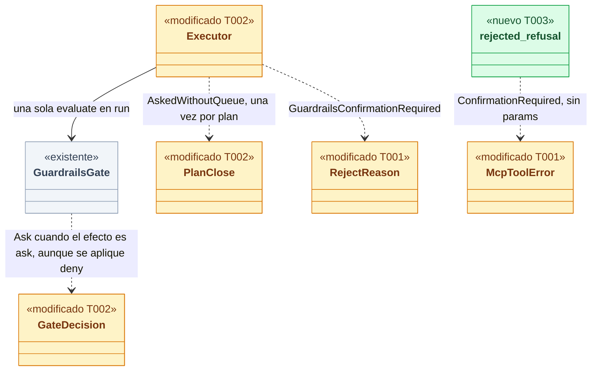
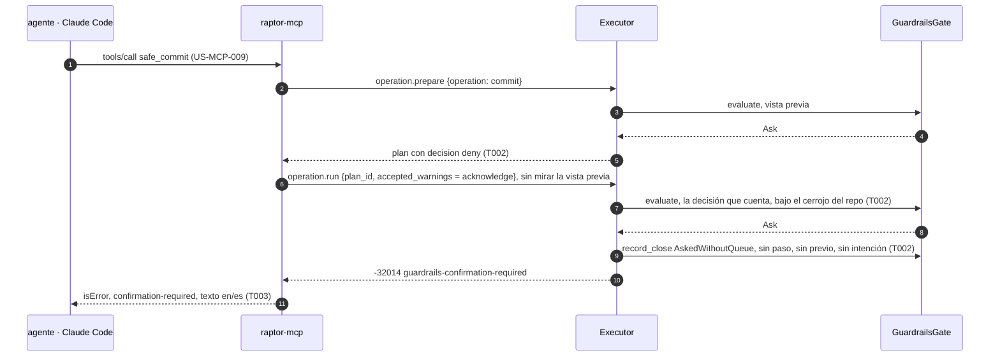
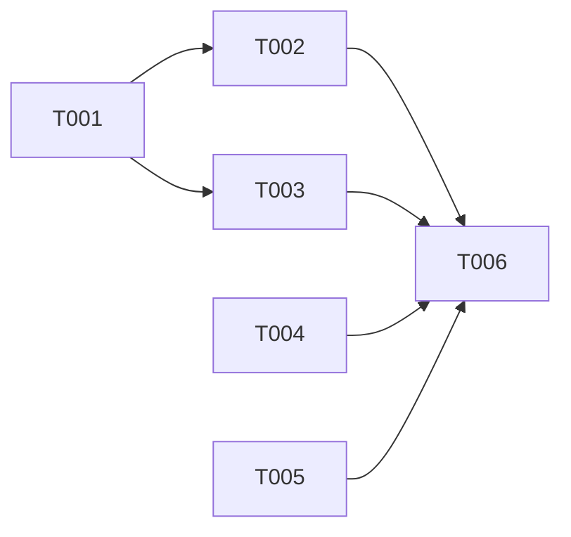

# DS-US-MCP-013 · Rechazo por MCP de una escritura que requiere confirmación

## Contexto rápido

Al terminar, cuando Guardrails decide "pedir confirmación" sobre una escritura que pidió un agente, el daemon la rechaza antes de cualquier efecto con un motivo propio, cierra el plan una sola vez para el registro de decisiones, y `raptor-mcp` responde al agente `confirmation-required`: "requiere confirmación del desarrollador", y que la decisión es suya. El servidor no pregunta nada al cliente del agente. Hoy no puede: el ejecutor solo distingue "permitir" de "no permitir", y un rechazo de Guardrails llega al agente como `internal`.

Los escenarios de la historia usan `safe_commit` en un repo cuyo equipo fija `commit` en "pedir confirmación". Esas tres piezas (la herramienta, la decisión real conectada al ejecutor y el permiso del equipo evaluado) son de US-MCP-009, TS-CKP-003 y US-GRD-007, y ninguna existe. Esta entrega construye el camino completo desde la decisión hasta el texto del agente y lo prueba en el ejecutor con un gate doble que responde "pedir confirmación" para `commit`. La aceptación de extremo a extremo pasa a US-MCP-009: dos escenarios y un criterio de certificación (D1). Evaluar el permiso del equipo no es de esta entrega: su dueña es US-GRD-007.

| Término | Qué es aquí |
|---|---|
| Pedir confirmación | El permiso `ask` de una operación gobernada (BR-VAL-002). Sin cola de confirmación se aplica como denegar (S-GRD-9) |
| Decisión que cuenta | La evaluación de Guardrails que el ejecutor hace en `run`, bajo el cerrojo del repo y antes de cualquier efecto (ADR-CKP-002 § 2, punto 4). La de `prepare` es una vista previa |
| Gate | `GuardrailsGate`, la interfaz por la que el ejecutor pregunta a Guardrails y cierra cada plan gobernado. En producción es `NoGuardrails` hasta TS-CKP-003 |
| Cierre del plan | La única llamada a `record_close` de un plan gobernado; de ella sale como mucho una entrada del registro de ADR-GRD-006 |
| Cola de confirmación | US-GRD-015. Con ella llega la respuesta "pendiente" con id (US-MCP-014, código reservado `confirmation-pending`) |
| Elicitation | Petición del servidor MCP al cliente para que el usuario responda algo. ADR-MCP-001 § 1 la excluye: la contestaría el cliente del agente |

⚠️ **ASSUMPTION**: no existe `architecture-constitution.md`; rigen `AGENTS.md` y los ADR de `must_read` (NFR-01, NFR-02, ADR-GRP-016), como en DS-US-MCP-008.

---

## 📋 Índice

> **Para aprobar:** [Contexto rápido](#contexto-rápido) · [⚠️ Gaps](#gaps-y-violaciones-de-la-constitución) · [🔭 La forma](#la-forma) · [El trabajo de un vistazo](#el-trabajo-de-un-vistazo) · [Decisiones](#decisiones-validadas).
> **Para implementar:** [🚀 Plan](#plan-de-implementación), en orden. Las secciones `_(ref)_` se abren desde la tarea que las cita.

| Sección | Propósito |
|---------|-----------|
| [Contexto rápido](#contexto-rápido) | Qué se construye, por qué, y el glosario |
| [⚠️ Gaps y violaciones de la constitución](#gaps-y-violaciones-de-la-constitución) | Qué impide empezar o liberar |
| [🔭 La forma](#la-forma) | Qué piezas quedan, qué cambia y cómo fluye |
| [🚀 Plan de implementación](#plan-de-implementación) | T001…T006, en orden |
| ↳ [El trabajo de un vistazo](#el-trabajo-de-un-vistazo) | Las tareas en una tabla, y su orden |
| [Estructura de ficheros](#estructura-de-ficheros) _(ref)_ | Tramos disjuntos de ficheros |
| [Contratos compartidos](#contratos-compartidos) _(ref)_ | Tipos y firmas |
| [Contrato de API](#contrato-de-api) _(ref)_ | Rechazo del daemon y de la herramienta, numéricos |
| [Modelo de datos](#modelo-de-datos) _(ref)_ | Sin cambios |
| [Estrategia de pruebas y cobertura](#estrategia-de-pruebas-y-cobertura) _(ref)_ | Escenario → prueba |
| [Gate de seguridad](#gate-de-seguridad) | Checklist pre-merge |
| [Fuera de alcance](#fuera-de-alcance) | Not Built (diferido) |
| [Decisiones validadas](#decisiones-validadas) | Lo que fija esta spec, con los ajustes de Arquitecto y PO |
| [Notas del autor](#notas-del-autor) _(ref)_ | Hechos del código que sostienen las decisiones |

---

## ⚠️ Gaps y violaciones de la constitución

| ID | Qué falta | Severidad | Alcance | Acción | Owner |
|----|-----------|-----------|---------|--------|-------|
| G7 | Ningún camino de producción produce `Ask` hasta US-GRD-007 y TS-CKP-003: el cableado sigue con `NoGuardrails` (`crates/core/src/executor/ops/mod.rs`) y `policy::guard::evaluate` no aplica los permisos del equipo (G3). El código se construye y se prueba con un gate doble, pero la historia no entrega valor al agente hasta entonces | Bloquea liberación | — | Liberar US-MCP-013 junto con US-MCP-009, cuando sus dos escenarios heredados pasen de extremo a extremo (D1) | PO |

Todas las tareas son construibles hoy. Las decisiones D1 a D7 están validadas con ajustes (§ Decisiones validadas); las enmiendas de documentos son la tarea T005.

---

## 🔭 La forma

Queda montado el tercer desenlace de la decisión que cuenta: el gate puede responder `Ask`, el ejecutor lo aplica como denegar con su propio motivo y su propio cierre, y `raptor-mcp` lo traduce a `confirmation-required` en la tabla de rechazos de escritura que US-MCP-009 hereda.



🟩 nuevo · 🟨 modificado · ⬜ existente. La arista de `GuardrailsGate` a `GateDecision` es el contrato que TS-CKP-003 tiene que cumplir: el gate real devuelve `Ask` por el efecto de la decisión (`ask`), no por el efecto aplicado (`deny`).

**Cómo fluye:**



El paso 6 decide que haya registro: `raptor-mcp` no rechaza por ningún campo de la vista previa del paso 5 (ni `decision` ni `warnings`); pasa `acknowledge` como `accepted_warnings` y decide `run`. Si rechazara en `prepare`, el plan caducaría como `Dropped` y la decisión no quedaría registrada (D5). El paso 9 añade un motivo al cable del canal, `guardrails-confirmation-required`.

---

## 🚀 Plan de implementación

> Orden topológico (`Depende:`). Rutas relativas a la raíz del repo. Cada tramo de § Estructura de ficheros es disjunto.

### El trabajo de un vistazo

Tres frentes de código y dos de documentos: el contrato (T001), el ejecutor (T002), la traducción en `raptor-mcp` (T003), la guarda contra la elicitation (T004), las enmiendas (T005) y el cierre (T006).

| # | Tarea | Depende | Aterriza en |
|---|---|---|---|
| T001 | Definir el contrato del rechazo por confirmación | — | `crates/api/src/`, `apps/mcp/src/messages.rs` |
| T002 | Aplicar "pedir confirmación" en el ejecutor con su motivo y un solo cierre | T001 | `crates/core/src/executor/` |
| T003 | Traducir el motivo a `confirmation-required` en `raptor-mcp` | T001 | `apps/mcp/src/engine.rs` |
| T004 | Fijar con pruebas que el servidor nunca pide nada al cliente del agente | — | `apps/mcp/tests/` |
| T005 | Aplicar las enmiendas de ADR, historias y contrato del canal | — | `docs/` |
| T006 | Cerrar el estado de la historia y su traspaso a US-MCP-009 | T002, T003, T004, T005 | `docs/` |

### En qué orden

Dos frentes de código sobre el contrato, uno independiente de guardas y uno de documentos, que convergen en el cierre.



### T001 — Definir el contrato del rechazo por confirmación

**Objetivo.** El motivo nuevo del canal, el código nuevo de la herramienta y sus textos en/es; nada los produce todavía.

**Ubicación.**
- `crates/api/src/catalog.rs` (**MODIFY**): `RejectReason::GuardrailsConfirmationRequired`
- `crates/api/src/mcp_view.rs` (**MODIFY**): `McpToolError::ConfirmationRequired`, `ALL`, `as_str` y la `match` cerrada de `mcp_tool_codes_are_kebab_and_closed`
- `crates/api/tests/us_mcp_013_wire.rs` (**CREATE**)
- `apps/mcp/src/messages.rs` (**MODIFY**): dos brazos de `texts` y la línea `#[path]` del módulo de pruebas
- `apps/mcp/src/messages_confirmation_tests.rs` (**CREATE**)

**Pasos**
1. Escribir primero `crates/api/tests/us_mcp_013_wire.rs` y `apps/mcp/src/messages_confirmation_tests.rs` en rojo (§ Estrategia de pruebas).
2. Añadir `GuardrailsConfirmationRequired` a `RejectReason` justo después de `GuardrailsDenied`, con el doc comment de § Tipos.
   2.1 ⛔1.1 El nombre en el cable es `guardrails-confirmation-required`. `confirmation-required` ya existe en `RejectReason` (variante `ConfirmationRequired`) y significa "falta el token del desafío ligado al plan" (ADR-CKP-002 § 3), un token que un agente nunca puede dar. Con el mismo nombre, un cliente no distingue los dos desenlaces.
3. Añadir `McpToolError::ConfirmationRequired` al final del enum y de `ALL` (que pasa a `[Self; 21]`), con `as_str` → `"confirmation-required"`.
4. En `messages.rs`, los brazos `(E::ConfirmationRequired, Lang::En)` y `(E::ConfirmationRequired, Lang::Es)` con los textos literales de § Forma del error. `tool_params` no cambia: el código no lleva `params`.

- **Depende:** —
- **Refs:** ADR-MCP-001 § 5 (familia "decisión"), BR-MCP-WF-004, ADR-GRP-016 § 1, RES-MCP-03
- **Aceptación:** `cargo test -p gitraptor-api` y `cargo test -p gitraptor-mcp --bin raptor-mcp messages::` en verde, con `guardrails_confirmation_required_is_its_own_wire_reason`, `the_confirmation_refusal_says_what_the_story_says` y `the_confirmation_refusal_has_no_params_and_fits_its_budget`
- **Guard ⛔1.1:** `us_mcp_013_wire.rs::guardrails_confirmation_required_is_its_own_wire_reason`

### T002 — Aplicar "pedir confirmación" en el ejecutor con su motivo y un solo cierre

**Objetivo.** Con un gate que responde `Ask`, `run` rechaza con `GuardrailsConfirmationRequired` antes de cualquier efecto y cierra el plan una vez con `PlanClose::AskedWithoutQueue`; `Deny` y `NotEvaluated` siguen como hoy. No cambia `NoGuardrails` ni el cableado de producción.

**Ubicación.**
- `crates/core/src/executor/gate.rs` (**MODIFY**): `GateDecision::Ask`, `PlanClose::AskedWithoutQueue`, doc del módulo
- `crates/core/src/executor/mod.rs` (**MODIFY**): vista previa de `prepare` y decisión de `run`
- `crates/core/tests/us_mcp_013.rs` (**CREATE**)

**Pasos**
1. Escribir primero `crates/core/tests/us_mcp_013.rs` en rojo. Copiar el rig de `crates/core/tests/us_mcp_008_executor.rs` (ejecutor real, backend doble, oplog real en perfil temporal), sin editar ese archivo, con estos cambios:
   1.1 El backend planea `OperationId::Commit` (`OpPlan { expected: {}, warnings: [], affected: Nobody, other_session: false }`) y cuenta las llamadas a `step`, que devuelve `StepError`.
   1.2 Un `PriorSnapshotter` que cuenta sus llamadas.
   1.3 Un gate doble con la decisión fija, un contador de `evaluate` y la lista de cierres como `(Layer, GovernedAs, PlanClose)`.
   1.4 Solicitante agente atribuido y `Layer::Mcp`; argumentos `{"message": "fix: a", "paths": ["src/a.rs"]}`.
2. `gate.rs`: añadir `GateDecision::Ask` y `PlanClose::AskedWithoutQueue` (§ Tipos). El doc del módulo dice que `Ask` nunca ejecuta mientras no exista la cola.
3. `prepare` (`executor/mod.rs`, la `match` de la vista previa): `GateDecision::Ask => DecisionView::Deny`.
4. `run`, en el punto de "la decisión que cuenta": una sola llamada a `self.gate.evaluate(&req)` y una `match` sobre su resultado:
   - `Allow` sigue;
   - `Ask` → `self.close(&plan, PlanClose::AskedWithoutQueue)` y `Err(RejectReason::GuardrailsConfirmationRequired.into())`;
   - `Deny | NotEvaluated` → `self.close(&plan, PlanClose::Denied)` y `Err(RejectReason::GuardrailsDenied.into())`.
   4.1 ⛔2.1 Evaluar dos veces (por ejemplo, `== Ask` y después `!= Allow`) pregunta dos veces al gate: con el gate real de TS-CKP-003 la decisión puede cambiar entre las dos llamadas y el plan se cierra con un desenlace que no fue el aplicado.
   4.2 ⛔2.2 El orden no cambia: la decisión sigue después del cerrojo, de la re-resolución del solicitante y de la huella, y antes de `backend.step` y del snapshot previo. Moverla antes del cerrojo la convierte en una vista previa.

- **Depende:** T001
- **Refs:** ADR-CKP-002 § 2 punto 4 y § 4 ("Registro único"), ADR-GRD-003 § 3 (`appliedEffect`), S-GRD-9
- **Aceptación:** `cargo test -p gitraptor-core --test us_mcp_013` en verde (seis pruebas, § Estrategia de pruebas) y `cargo test -p gitraptor-core --test channel_protected guardrails_decide_before_any_effect -- --exact` sigue en verde
- **Guard ⛔2.1:** `the_gate_is_asked_once_at_run`
- **Guard ⛔2.2:** `an_ask_is_refused_with_its_own_reason_before_any_effect` (sin `step`, sin previo, oplog en `last_seq() == 0`)

### T003 — Traducir el motivo a `confirmation-required` en `raptor-mcp`

**Objetivo.** La tabla de rechazos de escritura de `raptor-mcp` traduce `guardrails-confirmation-required` a `confirmation-required` sin `params`. Es la tabla que US-MCP-009 hereda (DS-US-MCP-008 D14).

**Ubicación.**
- `apps/mcp/src/engine.rs` (**MODIFY**): `rejected_refusal` y la línea `#[path]` del módulo de pruebas
- `apps/mcp/src/engine_confirmation_tests.rs` (**CREATE**)

**Pasos**
1. Escribir primero `engine_confirmation_tests.rs` en rojo, construyendo el `ClientError::Rpc` con `code::OPERATION_REJECTED` y `data: {"reason": "guardrails-confirmation-required"}`.
2. Extraer de `snapshot_refusal` la `match` sobre `RejectedData::reason` a `fn rejected_refusal(reason: Option<RejectReason>) -> ToolRefusal`, sin cambiar ninguna de sus filas; `snapshot_refusal` la llama en la rama `OPERATION_REJECTED`.
3. Añadir la fila `Some(RejectReason::GuardrailsConfirmationRequired) => McpToolError::ConfirmationRequired.into()`.
   3.1 ⛔3.1 `GuardrailsDenied` no se traduce a `confirmation-required`: un "denegar" del equipo no se resuelve pidiendo confirmación. Su código (`policy-denied`) es de US-MCP-009 y US-GRD-016, y hasta entonces sigue en `internal`.
   3.2 ⛔3.2 `rejected_refusal(None)` (un `data` que no decodifica, por ejemplo un motivo que este binario no conoce) sigue dando el rechazo genérico `internal`, sin `params`. Es la caída a genérico en la que se apoya D2.

- **Depende:** T001
- **Refs:** ADR-MCP-001 § 5, BR-MCP-WF-004, DS-US-MCP-008 D14, ADR-GRP-016 § 3
- **Aceptación:** `cargo test -p gitraptor-mcp --bin raptor-mcp engine::` en verde, con `a_guardrails_ask_is_confirmation_required_without_params` y `engine_refusals_map_to_the_tool_codes`
- **Guard ⛔3.1:** `a_guardrails_deny_is_never_confirmation_required`
- **Guard ⛔3.2:** `an_undecodable_reason_stays_a_generic_refusal`

### T004 — Fijar con pruebas que el servidor nunca pide nada al cliente del agente

**Objetivo.** Dos guardas de regresión del escenario 2: `raptor-mcp` se compila sin la elicitation de `rmcp` y una sesión real nunca recibe una petición del servidor. Pasan con el código de hoy y fallan si alguien la añade.

**Ubicación.** `apps/mcp/tests/no_elicitation.rs` (**CREATE**)

**Reglas**
- `the_server_is_built_without_elicitation`, primera mitad: corre `cargo metadata --format-version 1` con el `cargo` de `env!("CARGO")` y `--manifest-path` de la raíz del workspace, busca en `resolve.nodes` el nodo del paquete `rmcp` y comprueba que su lista `features` no contiene `elicitation`. Mira las features resueltas, no el manifiesto: otro crate del workspace podría activarla por unificación de features.
- Segunda mitad: recorre `apps/mcp/src/**/*.rs` y ningún archivo contiene los identificadores `ElicitRequest`, `create_elicitation` ni `.elicit(`. Se buscan identificadores, no la palabra suelta: un comentario puede nombrar la elicitation.
- `a_session_never_receives_a_request_from_the_server`: copia `exchange` de `apps/mcp/tests/handshake.rs` sin editar ese archivo, con perfil y cwd temporales. Envía `tools/list`, `tools/call` de `snapshot` con `{"label": ""}` (rechazo de dominio `invalid-text` que no llega al motor) y `tools/call` de `push` (`unknown-tool`). Cierra stdin, lee stdout hasta EOF y comprueba que cada línea es la respuesta a un id enviado y que ninguna lleva `method`.
- Sin esperas fijas: el proceso termina al cerrar stdin (`completes_the_mcp_handshake_over_stdio_and_exits_when_stdin_closes`).
- El perfil temporal no llega a existir: el motor no arrancó.

> **Nota técnica.** En `rmcp` 3.5.0, `create_elicitation` y `Peer::elicit` están detrás de la feature `elicitation` (`src/service/server.rs:896-910` y `:1143`), pero el tipo `ElicitRequest` existe sin ella y se podría mandar con `send_request`. Por eso la guarda mira las dos cosas: las features resueltas y el código fuente. `cargo metadata` sin `--offline` puede tocar la red si falta el índice; el CI ya hizo `cargo fetch`.

- **Depende:** —
- **Refs:** ADR-MCP-001 § 1 (capacidades), BR-MCP-WF-004 ("nunca elicitation")
- **Aceptación:** `cargo test -p gitraptor-mcp --test no_elicitation` en verde, y `server::tests::announces_only_the_tools_capability` sigue en verde

### T005 — Aplicar las enmiendas de ADR, historias y contrato del canal

**Objetivo.** Dejar escritas en sus documentos las decisiones de § Decisiones validadas; no toca código.

**Ubicación.**
- `docs/architecture/decisions/ADR-MCP-001-servidor-mcp-cliente-daemon.md` (**MODIFY**, Enmienda (2026-10-09, US-MCP-013))
- `docs/architecture/decisions/ADR-CKP-002-catalogo-operaciones-ejecutor.md` (**MODIFY**, nota en § 4)
- `docs/architecture/decisions/ADR-GRP-016-extension-registro-capacidades.md` (**MODIFY**, nota en § 3)
- `docs/architecture/decisions/ADR-GRD-006-registro-decisiones.md` (**MODIFY**, fila "`layer` hoy siempre es `hooks`")
- `docs/requirements/features/cockpit/technical-stories/TS-CKP-003-capa-cockpit-guardrails.md` (**MODIFY**, Alcance Técnico y Criterios)
- `docs/requirements/features/mcp/business-rules.md` (**MODIFY**, BR-MCP-WF-004)
- `docs/requirements/features/guardrails/business-rules.md` (**MODIFY**, pregunta abierta nueva)
- `docs/requirements/features/mcp/user-stories/US-MCP-009-safe-commit.md` (**MODIFY**, `blocked_by`, Dependencias y Criterios)
- `docs/requirements/features/mcp/user-stories/US-MCP-013-confirmacion-sin-cola.md` (**MODIFY**, escenario 1, Dependencias, Requisitos Técnicos y Diseño y Dev Spec)
- `docs/architecture/design/api-contract-ipc.md` (**MODIFY**, fila `-32014`)

**Reglas**
- ADR-MCP-001, Enmienda: § 5, `confirmation-required` sin `params`, traducido desde el motivo del canal `guardrails-confirmation-required` (D2, D4). § 4.3: `raptor-mcp` nunca rechaza por ningún campo de la vista previa (ni `decision` ni `warnings`); pasa `acknowledge` como `accepted_warnings` y decide `run` (D5). § 4.3 también, como prerrequisito bloqueante de US-MCP-018: hoy `run` devuelve el rechazo por avisos antes que la denegación de Guardrails, al revés de lo que pide § 4.3 (G6). § 1, las guardas de T004 (D6).
- ADR-CKP-002 § 4, nota: `GateDecision::Ask` y `PlanClose::AskedWithoutQueue`; el gate devuelve `Ask` si y solo si `effect == ask` y `appliedEffect == deny`; la vista previa muestra `deny` (D3, D7). Los mismos tipos van a la Dev Spec de TS-CKP-003 cuando se escriba.
- ADR-GRP-016 § 3, nota: "un valor nuevo de `data.reason` bajo un código congelado es aditivo sin capacidad; todo cliente del repo decodifica `RejectedData` con caída a genérico". Marcada ⚠️ **ASSUMPTION**: convención ratificada por el precedente de `confirmation-unavailable` (D2).
- ADR-GRD-006: la fila "`layer` hoy siempre es `hooks` … el MCP no evalúa decisiones" deja de ser cierta; pasa a "hasta TS-CKP-003, `hooks`; con el gate real, también la capa del plan del ejecutor (`mcp`, `cockpit`)".
- TS-CKP-003, en lenguaje llano y sin nombres de tipos en el Alcance: "distinguir 'pedir confirmación' de 'denegar' en el desenlace del plan aunque se aplique como denegar, y registrarlo con la capa del plan"; en Criterios, una entrada `denial` con efecto `ask`, efecto aplicado `deny` y motivo `ask-unavailable` (ADR-GRD-003 § 3) (D7).
- BR-MCP-WF-004 (PO): "y la acción (hacerlo desde el Cockpit)" pasa a "y la acción (avisar al desarrollador; cuando exista la cola, decidir desde el Cockpit)" (D4).
- `guardrails/business-rules.md` (PO): pregunta abierta nueva para Rene, con el siguiente id libre de su lista: "Sin cola, ¿'pedir confirmación' también deniega al desarrollador, o solo a los agentes?" (G1).
- US-MCP-009 (PO): en Criterios, dos escenarios heredados de US-MCP-013 escritos para `safe_commit`: "Una escritura que requiere confirmación se rechaza con la acción" (incluye "el worktree no cambia" y "registrada una vez con capa `mcp`") y "Reintentar no cambia la decisión"; y un criterio de Certificación: "el servidor nunca pide confirmación al cliente del agente". `blocked_by: [US-GRD-007, TS-CKP-003]` (su cuerpo ya las nombra). La regla de D5 en Dependencias (D1).
- US-MCP-013 (PO): el escenario 1 cambia "la acción indica que el desarrollador la hace desde GitRaptor" por "la acción indica que la decisión es del desarrollador"; en Dependencias se quita "remite a GitRaptor (Cockpit, F-001-02) solo como texto"; Requisitos Técnicos dice que su aceptación de extremo a extremo vive en US-MCP-009, y enlaza esta spec (D1, D4).
- `api-contract-ipc.md`: `guardrails-confirmation-required` en la lista de `data.reason` de `-32014`, aditivo como `confirmation-unavailable`.

- **Depende:** —
- **Refs:** § Decisiones validadas, `AGENTS.md`
- **Aceptación:** revisión de Arquitecto y PO; `/aadd-analyze` sin BLOCKER

### T006 — Cerrar el estado de la historia y su traspaso a US-MCP-009

**Objetivo.** Estado de la historia y plan de releases al día; no toca código.

**Ubicación.**
- `docs/requirements/features/mcp/user-stories/US-MCP-013-confirmacion-sin-cola.md` (**MODIFY**, `status`)
- `docs/requirements/release-plan.md` (**MODIFY**, fila de US-MCP-006, 007, 013 y 017)

**Reglas**
- `status: partially-implemented`. La historia pasa a `implemented` cuando los dos escenarios heredados y el criterio de certificación pasen de extremo a extremo en US-MCP-009 (D1, G7).
- En la fila del plan de releases: "US-MCP-013: contrato y ejecutor hechos; aceptación de extremo a extremo en US-MCP-009". No editar `docs/ARTIFACTS.md`.

- **Depende:** T002, T003, T004, T005
- **Refs:** `AGENTS.md` (PR con IDs)
- **Aceptación:** `cargo test -p gitraptor-api -p gitraptor-core -p gitraptor-mcp` en verde en macOS y en CI `ubuntu-latest`

---

> Las secciones siguientes son de referencia. Se abren desde la tarea que las cita, no se leen en orden.

## Estructura de ficheros

Cinco tramos disjuntos: ningún archivo está en dos. Un experto por tramo; B y C esperan a A.

```text
# Tramo A — contrato (T001)
crates/api/src/catalog.rs                     ← MODIFY  RejectReason::GuardrailsConfirmationRequired
crates/api/src/mcp_view.rs                    ← MODIFY  McpToolError::ConfirmationRequired
crates/api/tests/us_mcp_013_wire.rs           ← CREATE
apps/mcp/src/messages.rs                      ← MODIFY  textos en/es
apps/mcp/src/messages_confirmation_tests.rs   ← CREATE
# Tramo B — ejecutor (T002)
crates/core/src/executor/gate.rs              ← MODIFY  GateDecision::Ask, PlanClose::AskedWithoutQueue
crates/core/src/executor/mod.rs               ← MODIFY  vista previa y decisión de run
crates/core/tests/us_mcp_013.rs               ← CREATE
# Tramo C — raptor-mcp (T003)
apps/mcp/src/engine.rs                        ← MODIFY  rejected_refusal
apps/mcp/src/engine_confirmation_tests.rs     ← CREATE
# Tramo D — guardas (T004)
apps/mcp/tests/no_elicitation.rs              ← CREATE
# Tramo E — documentos (T005 y T006): los archivos de sus `Ubicación`, todos MODIFY
```

Sin cambios: `crates/policy`, `crates/core/src/guardrails/`, `crates/core/src/executor/ops/` (el cableado de producción sigue con `NoGuardrails`), `apps/mcp/src/server.rs`, `apps/mcp/Cargo.toml` y `Cargo.lock`.

---

## Contratos compartidos

### Tipos y datos compartidos

```rust
// crates/api/src/catalog.rs — en RejectReason, después de GuardrailsDenied
/// The decision that counts asks for the developer's confirmation. Without the
/// confirmation queue it is applied as deny, and nothing ran. Additive: an
/// older client shows a generic rejection.
GuardrailsConfirmationRequired, // wire: "guardrails-confirmation-required"

// crates/api/src/mcp_view.rs — al final de McpToolError y de ALL ([Self; 21])
/// Guardrails asks for the developer's confirmation; the decision is the
/// developer's. No params.
ConfirmationRequired, // wire: "confirmation-required"

// crates/core/src/executor/gate.rs
pub enum GateDecision {
    Allow,
    /// The rule asks for the developer's confirmation. Without the queue it is
    /// applied as deny: the plan never runs.
    Ask,
    Deny,
    /// No decision engine: never read as "allow".
    NotEvaluated,
}

pub enum PlanClose {
    /// The decision that counts denied it.
    Denied,
    /// The decision that counts asked for confirmation and there is no queue:
    /// applied as deny (effect `ask`, applied effect `deny`).
    AskedWithoutQueue,
    Rejected,
    Dropped,
    Ran(OperationOutcome),
}
```

`GateRequest`, `GuardrailsGate`, `NoGuardrails` y `DecisionView` no cambian.

### Ciclos de vida (DI)

_No ambient state — DI lifetimes follow stack defaults._ El gate sigue siendo un `Arc<dyn GuardrailsGate>` por daemon, inyectado en `Executor::new`.

### Firmas del stack

```rust
// crates/core/src/executor/mod.rs — Executor::run, sin cambio de firma.
// Orden: plan tomado → avisos → desafío → cerrojo → solicitante → huella
//        → UNA evaluate → Allow sigue | Ask | Deny | NotEvaluated → step.

// apps/mcp/src/engine.rs
/// The tool refusal for a plan the daemon rejected: the write table every write
/// tool shares.
fn rejected_refusal(reason: Option<RejectReason>) -> ToolRefusal;
fn snapshot_refusal(err: &ClientError) -> ToolRefusal; // llama a rejected_refusal
```

---

## Contrato de API

| Superficie | Cambio | Quién lo recibe |
|---|---|---|
| Canal, `operation.run` | `-32014` con `data.reason: "guardrails-confirmation-required"` | Toda conexión que ejecute un plan gobernado. Hoy ninguna en producción: el cableado no arma operaciones gobernadas |
| Canal, `operation.prepare` | Sin cambio de forma; con un gate que pide confirmación, `decision: "deny"` | Ídem |
| Herramienta MCP | Rechazo de dominio `confirmation-required` | El agente, cuando exista una herramienta gobernada (US-MCP-009) |

### Forma del error y del cuerpo de respuesta

Canal (JSON-RPC, `-32014`, sin apunte en el oplog):

```json
{ "code": -32014, "message": "operation rejected", "data": { "reason": "guardrails-confirmation-required" } }
```

Herramienta MCP: `isError: true`, sin `structuredContent`, y en `content[0].text` el JSON compacto `{"code": "confirmation-required", "message": …, "action": …}` con estos textos literales:

| Idioma | `message` | `action` |
|---|---|---|
| en | `This action requires the developer's confirmation.` | `Tell the developer: the decision is theirs. Retrying gets the same answer.` |
| es | `Esta acción requiere confirmación del desarrollador.` | `Avisa al desarrollador: la decisión es suya. Reintentar da la misma respuesta.` |

Sin `params`: ni la regla, ni el nivel, ni el repo, ni la ruta (SEC-05). El `message` de `-32014` es el que el canal ya usa (`crates/core/src/channel/conn.rs:2368`).

### Forma de la configuración

_No aplica — ninguna tarea lee configuración._ El permiso "pedir confirmación" de `commit` en la configuración del equipo lo evalúa US-GRD-007.

### Valores numéricos

| Concepto | Valor | Fuente |
|---------|-------|--------|
| Tamaño del rechazo de la herramienta | ≤ 80 tokens en en y en es (`MCP_REFUSAL_TOKENS`) | RES-MCP-03, Enmienda (2026-10-07, presupuesto de tokens) de ADR-MCP-001 |
| Llamadas a `evaluate` por plan | 1 en `prepare` (vista previa) y 1 en `run` | ADR-CKP-002 § 2 punto 4 |
| Cierres por plan gobernado | 1 | ADR-CKP-002 § 4, "Registro único" |
| Espera propia del rechazo | ninguna; solo el cerrojo de escritura del repo, en orden de llegada | ADR-CKP-002 § 5, Q-CKP-19 (G2) |

---

## Modelo de datos

_No aplica — esta entrega no cambia el oplog, el registro de decisiones ni el perfil._ La entrada del registro la escribe el gate real de TS-CKP-003 (D7).

---

## Estrategia de pruebas y cobertura

### 9.1 Pirámide de pruebas

| Tipo | Cantidad | Tareas dueñas | Herramientas | Cuándo |
|------|---------:|-------------|---------|------|
| Unit | 6 | T001, T003 | `cargo test` | PR gate |
| Integration | 6 | T002 | `cargo test -p gitraptor-core --test us_mcp_013` | PR gate |
| Security | 2 | T004 | `cargo test -p gitraptor-mcp --test no_elicitation` | PR gate |

El contrato de `/nassa-core:implement` declara `"suite": { "command": "node tools/test/nextest-junit.mjs" }` y `"layers": { "runtime": { "commands": [{ "id": "suite", "cmd": "node tools/test/nextest-junit.mjs" }], "report": "target/nextest/ci/junit-paths.xml" } }` (AGENTS.md). Las pruebas en rojo de cada tarea van en sus archivos propios: `us_mcp_013_wire.rs`, `messages_confirmation_tests.rs`, `us_mcp_013.rs` y `engine_confirmation_tests.rs`.

### 9.2 Umbrales de cobertura

| Capa | Línea | Rama | Mutación | Camino crítico 100% |
|-------|-----:|-------:|---------:|:------------------:|
| `executor::run`, decisión que cuenta | — | — | — | ✅ los cuatro brazos de `GateDecision` |
| `engine::rejected_refusal` | — | — | — | ✅ `GuardrailsConfirmationRequired`, `GuardrailsDenied`, `None` |

### 9.3 Datos de prueba

- Builders / fixtures: el rig de `us_mcp_008_executor.rs` copiado (backend doble, oplog real en un perfil temporal de `tempfile`), nunca este repo ni el perfil real (NFR-01). El proceso de T004 usa perfil y cwd temporales.
- Multi-tenant data: un solo solicitante agente atribuido con `Layer::Mcp`.
- PII / PHI: no aplica. El mensaje de commit de las pruebas es `"fix: a"`.
- Time / clock: ninguna espera fija; el proceso de T004 termina al cerrar stdin.

Escenario de la historia → prueba:

| Escenario | Prueba en esta entrega | De extremo a extremo |
|---|---|---|
| 1. Rechazo con "requiere confirmación del desarrollador" y la acción | `us_mcp_013::an_ask_is_refused_with_its_own_reason_before_any_effect`, `engine::confirmation_tests::a_guardrails_ask_is_confirmation_required_without_params`, `messages::confirmation_tests::the_confirmation_refusal_says_what_the_story_says` | US-MCP-009, escenario heredado "Una escritura que requiere confirmación se rechaza con la acción" (D1) |
| 1. El worktree no cambia | `an_ask_is_refused_with_its_own_reason_before_any_effect`: `step` 0 veces, previo 0 veces, oplog `last_seq() == 0` | Ídem |
| 1. Registrada una vez con capa `mcp` | `us_mcp_013::an_ask_closes_the_plan_once_with_the_mcp_layer`: cierres `== [(Mcp, Commit, AskedWithoutQueue)]` | Ídem; la entrada del registro la escribe TS-CKP-003 (D7) |
| 2. Nunca pide confirmación al cliente | `no_elicitation::the_server_is_built_without_elicitation`, `no_elicitation::a_session_never_receives_a_request_from_the_server`, `server::tests::announces_only_the_tools_capability` | US-MCP-009, criterio de Certificación |
| 2. Responde sin esperar a nadie | `an_ask_is_refused_with_its_own_reason_before_any_effect` (el rechazo vuelve en la misma llamada a `run`) | Ídem |
| 3. Reintentar da el mismo rechazo y nada cambia | `us_mcp_013::retrying_an_ask_gets_the_same_refusal_and_changes_nothing` | US-MCP-009, escenario heredado "Reintentar no cambia la decisión" |

Comandos:

```bash
cargo test -p gitraptor-api --test us_mcp_013_wire
cargo test -p gitraptor-core --test us_mcp_013
cargo test -p gitraptor-mcp --bin raptor-mcp messages::confirmation_tests
cargo test -p gitraptor-mcp --bin raptor-mcp engine::confirmation_tests
cargo test -p gitraptor-mcp --test no_elicitation
```

Las seis de `us_mcp_013.rs`: `an_ask_is_refused_with_its_own_reason_before_any_effect`, `an_ask_closes_the_plan_once_with_the_mcp_layer`, `retrying_an_ask_gets_the_same_refusal_and_changes_nothing`, `the_preview_of_an_ask_is_the_applied_deny`, `the_gate_is_asked_once_at_run` y `a_deny_and_no_engine_keep_guardrails_denied`. Unitarias: `guardrails_confirmation_required_is_its_own_wire_reason` (el motivo serializa como `guardrails-confirmation-required` y no como `confirmation-required`), `the_confirmation_refusal_says_what_the_story_says`, `the_confirmation_refusal_has_no_params_and_fits_its_budget`, `a_guardrails_ask_is_confirmation_required_without_params`, `a_guardrails_deny_is_never_confirmation_required` y `an_undecodable_reason_stays_a_generic_refusal`. El texto de `the_confirmation_refusal_says_what_the_story_says` comprueba en es "requiere confirmación del desarrollador" y "la decisión es suya", y en en "the decision is theirs".

### 9.4 Comportamientos críticos verificados

- [ ] Con `Ask`, ningún paso, ningún snapshot previo ni ninguna intención en el oplog (NFR-01).
- [ ] Cada plan gobernado llama una vez a `record_close`, con la capa del plan.
- [ ] El gate se consulta una vez en `run`.
- [ ] `Deny` y `NotEvaluated` siguen en `guardrails-denied` con `PlanClose::Denied`.
- [ ] `confirmation-required` sale sin `params` y cabe en 80 tokens en en y en es.
- [ ] `raptor-mcp` no enlaza la elicitation y una sesión no recibe ninguna petición del servidor.

### 9.5 Plataformas

| Plataforma | Cómo se verifica | Pendiente |
|---|---|---|
| macOS | todas las pruebas de § 9.1 en local | — |
| Linux | todas en CI `ubuntu-latest`: el rig del ejecutor y el proceso de T004 no dependen del canal ni del cwd del par | — |
| Windows | Las pruebas no llevan `cfg` de plataforma; compila con `clippy --target x86_64-pc-windows-msvc` | Pendiente: etapa de validación multiplataforma (correrlas en la máquina Windows). Sin código por plataforma: no abre fila en `xplat-pendientes.md` |

---

## Gate de seguridad

- Fallo cerrado: `Ask` nunca ejecuta y `NotEvaluated` sigue negando; el cableado de producción sigue sin armar operaciones gobernadas (`production_wiring_has_no_governed_arm_without_guardrails`).
- Una sola evaluación en `run`, bajo el cerrojo y después de la huella: no hay ventana entre dos decisiones (⛔2.1, ⛔2.2).
- El rechazo no revela la política: sin regla, nivel, rama, ruta ni repo; plantilla fija por código (ADR-MCP-001 § 5, SEC-05, SEC-12).
- Sin elicitation, sin petición del servidor al cliente: el agente no puede autoconfirmarse (BR-MCP-WF-004, BR-AUTH-004).
- Sin entrada nueva que validar: el código no lee argumentos nuevos del agente.
- Toca la superficie de rechazos del MCP: revisión de `security-expert` recomendada, de riesgo bajo.

Corre `/security-review --scope devspec docs/requirements/features/mcp/dev-specs/US-MCP-013-dev-spec.md` antes de mezclar.

---

## Fuera de alcance

| Ítem / no-objetivo | Historia que lo cubre | Gate (cómo se verifica) |
|----------------|--------------------|-------------------------|
| Herramienta `safe_commit`, los dos escenarios heredados y el criterio de certificación | US-MCP-009 (D1) | `the_catalog_has_status_and_snapshot` sigue en verde: `tools/list` solo tiene `status` y `snapshot` |
| Gate real en el ejecutor, entrada del registro con capa `mcp`, `LogLayer::Mcp` | TS-CKP-003 (D7) | `ops/mod.rs` sigue con `NoGuardrails`; `git diff --stat main -- crates/core/src/guardrails crates/core/src/profile crates/api/src/guard.rs` vacío |
| Evaluar el permiso del equipo ("pedir confirmación" de `commit`) | US-GRD-007 | `git diff --stat main -- crates/policy` vacío |
| Cola de confirmación y `confirmation-pending` con id | US-GRD-015, US-MCP-014 | `McpToolError::ALL` no tiene `ConfirmationPending` (`mcp_tool_codes_are_kebab_and_closed`) |
| `DecisionView::Ask` en la vista previa | US-GRD-015, cuando "pedir" deje de aplicarse como denegar | `DecisionView` sin cambios en `catalog.rs` |
| `policy-denied` para `guardrails-denied` | US-MCP-009, US-GRD-016 | `a_guardrails_deny_is_never_confirmation_required` |
| Orden "Guardrails antes que avisos" en un plan con avisos | US-MCP-018 (`safe_rebase`, la primera herramienta con avisos), como prerrequisito bloqueante escrito en la Enmienda de ADR-MCP-001 (T005, G6) | La comprobación de `WarningsMismatch` en `run` no cambia de sitio |

---

## Decisiones validadas

Todas son **Decisión del orquestador (2026-10-09)**, validadas por quien indica la columna "Validación" con el ajuste aplicado. Lo que ya fijan ADR-MCP-001 § 1 y § 5, BR-MCP-WF-004 y S-GRD-9 se cita y no se redecide.

| # | Decisión | Validación y ajuste aplicado | Alternativas descartadas |
|---|---|---|---|
| D1 | Esta entrega construye el camino genérico "Guardrails pide confirmación → `confirmation-required`" y lo prueba en el ejecutor con un gate doble. La aceptación de extremo a extremo pasa a US-MCP-009. US-MCP-013 queda `partially-implemented` hasta que pase; su `blocked_by` sigue vacío porque esta spec es construible hoy. Evaluar el permiso del equipo no es de esta spec: su dueña es US-GRD-007 | Validada por Arquitecto y PO, con ajustes: hueco de liberación G7 (`gaps_release: 1`, `ready_to_release: false`); US-MCP-009 recibe por escrito en T005 dos escenarios (rechazo con la acción, que incluye "el worktree no cambia", y reintento) más un criterio de Certificación ("el servidor nunca pide confirmación al cliente del agente"), y `blocked_by: [US-GRD-007, TS-CKP-003]`; los Requisitos Técnicos de US-MCP-013 dicen que su aceptación de extremo a extremo vive en US-MCP-009 | (b) Esperar a US-MCP-009 y TS-CKP-003: deja el contrato sin fijar y carga a US-MCP-009 con él. (c) Construir aquí el puente política → gate para `commit`: duplica el trabajo de US-GRD-007 (aplicar los permisos del equipo en `policy::guard::evaluate`) y de TS-CKP-003 (gate real y registro), en archivos que esas historias editan |
| D2 | `GateDecision::Ask`, `PlanClose::AskedWithoutQueue` y el motivo del canal `guardrails-confirmation-required`, distinto de `confirmation-required` (el desafío del Cockpit). Aditivo, sin capacidad nueva | Validada por Arquitecto, con ajustes: T005 añade a ADR-GRP-016 § 3 la nota "un valor nuevo de `data.reason` bajo un código congelado es aditivo sin capacidad; todo cliente del repo decodifica `RejectedData` con caída a genérico" (⚠️ **ASSUMPTION**, ratificada por el precedente de `confirmation-unavailable`); T003 añade `an_undecodable_reason_stays_a_generic_refusal` | Reutilizar `GuardrailsDenied` con un campo de efecto en `RejectedData`: `RejectedData` es `deny_unknown_fields` y el campo rompe a todo cliente; reutilizar `confirmation-required`: un cliente pediría un token |
| D3 | La vista previa de `prepare` muestra el efecto aplicado: `Ask` → `DecisionView::Deny` | Validada por Arquitecto, tal cual | `DecisionView::Ask` ahora: cambio de forma sin consumidor hasta la cola |
| D4 | Código `confirmation-required` sin `params`, con los textos de § Forma del error | Validada por PO, con ajustes: la acción pasa a "Avisa al desarrollador: la decisión es suya. Reintentar da la misma respuesta." / "Tell the developer: the decision is theirs. Retrying gets the same answer."; T005 enmienda BR-MCP-WF-004 ("avisar al desarrollador; cuando exista la cola, decidir desde el Cockpit") y el escenario 1 y las Dependencias de US-MCP-013; la pregunta abierta de G1 queda para Rene | Nombrar la regla o el nivel en `params`: revela la política al agente y no le sirve para nada. Decir "desde GitRaptor": `commit` no tiene marca de Cockpit (G1) |
| D5 | `raptor-mcp` nunca rechaza por ningún campo de la vista previa (ni `decision` ni `warnings`); pasa `acknowledge` como `accepted_warnings` y decide `run`. Sin `run`, el plan caduca como `Dropped` y la decisión no queda registrada | Validada por Arquitecto, con ajustes: esta redacción; la Enmienda de ADR-MCP-001 escribe G6 como prerrequisito bloqueante de US-MCP-018 | Rechazar en `prepare` para ahorrar una ida y vuelta: rompe el registro único |
| D6 | Guardas de la ausencia de elicitation: features resueltas, código fuente y una sesión real sin peticiones del servidor | Validada por Arquitecto, con ajustes: las features de `rmcp` se leen resueltas con `cargo metadata` (sección `resolve`), por la unificación de features; el código se recorre buscando identificadores (`ElicitRequest`, `create_elicitation`, `.elicit(`), no la palabra suelta | Solo la prueba de capacidades de `get_info`: no ve un `send_request` de `ElicitRequest`. Leer el texto de `Cargo.toml`: no ve la unificación |
| D7 | Contrato para TS-CKP-003: el gate devuelve `Ask` si y solo si `effect == ask` y `appliedEffect == deny`; `AskedWithoutQueue` se registra como `denial` con `effect: ask`, `appliedEffect: deny`, motivo `ask-unavailable` y la capa del plan. `LogLayer::Mcp` lo añade esa historia, que es la que lo escribe | Validada por Arquitecto, con ajustes: la condición doble; en TS-CKP-003 solo lenguaje llano en el Alcance, y los tipos van a la nota de ADR-CKP-002 § 4 y a la Dev Spec de TS-CKP-003; T005 corrige también ADR-GRD-006 ("`layer` hoy siempre es `hooks`") | Añadir `LogLayer::Mcp` aquí: variante sin escritor |

---

## Notas del autor

| ID | Nota | Acción | Owner |
|----|------|--------|-------|
| G1 | Decisión pendiente para Rene: "Sin cola, ¿'pedir confirmación' también deniega al desarrollador, o solo a los agentes?". Hoy S-GRD-9 deniega en todas las capas (ADR-GRD-003, Enmienda (2026-10-04, Cockpit), "igual que en `mcp`"): el `git commit` del propio desarrollador también se deniega, y solo pasa con `--no-verify` o con una excepción consciente. Además `commit` no tiene marca de Cockpit (`crates/api/src/catalog.rs:193-200`, `(false, true)`), por eso la acción ya no dice "desde GitRaptor" (D4). No bloquea M2a: solo afecta si el equipo configura "pedir confirmación" para `commit`. Un aviso al guardar esa configuración es de US-GRD-007 | T005 la registra como pregunta abierta en `guardrails/business-rules.md` | Rene (PO la registra) |
| G2 | "Sin esperar a nadie": el rechazo llega después del cerrojo de escritura del repo, en orden de llegada (`crates/core/src/executor/mod.rs:812-826`). Puede esperar a otra operación del repo, nunca a una persona. Se sigue ADR-CKP-002 § 2 punto 4: la decisión que cuenta va bajo el cerrojo | Ninguna | — |
| G3 | Los permisos del equipo se leen y combinan por niveles (`crates/policy/src/layers.rs:23-35`), pero `policy::guard::evaluate` no los aplica (`crates/policy/src/guard/mod.rs:110-158`; el brazo de rebase dice "US-GRD-007 adds rules"). Hoy nada produce `Effect::Ask` en producción | Ninguna: es US-GRD-007 | — |
| G4 | `decision()` ya aplica `ask` como `deny` en el efecto aplicado (`crates/core/src/guardrails/evaluate.rs:141-146`). Si el gate real tradujera `appliedEffect`, nunca devolvería `Ask` y el agente recibiría `guardrails-denied`. Por eso D7 | Llevarlo a TS-CKP-003 (T005) | Arquitecto |
| G5 | Precedente de motivo aditivo sin capacidad: `confirmation-unavailable` (`docs/architecture/design/api-contract-ipc.md:125`). Ningún código fuera del ejecutor hace `match` exhaustivo sobre `RejectReason` ni sobre `GateDecision` | Ninguna | — |
| G6 | En `run`, la comprobación de avisos (`WarningsMismatch`) va antes de la decisión de Guardrails (`executor/mod.rs:776` frente a `:875`), y ADR-MCP-001 § 4.3 pide el orden inverso. `commit` no lleva avisos en `catalogVersion` 1, así que no afecta a esta historia | T005 lo escribe en la Enmienda de ADR-MCP-001 como prerrequisito bloqueante de US-MCP-018 | Arquitecto |
