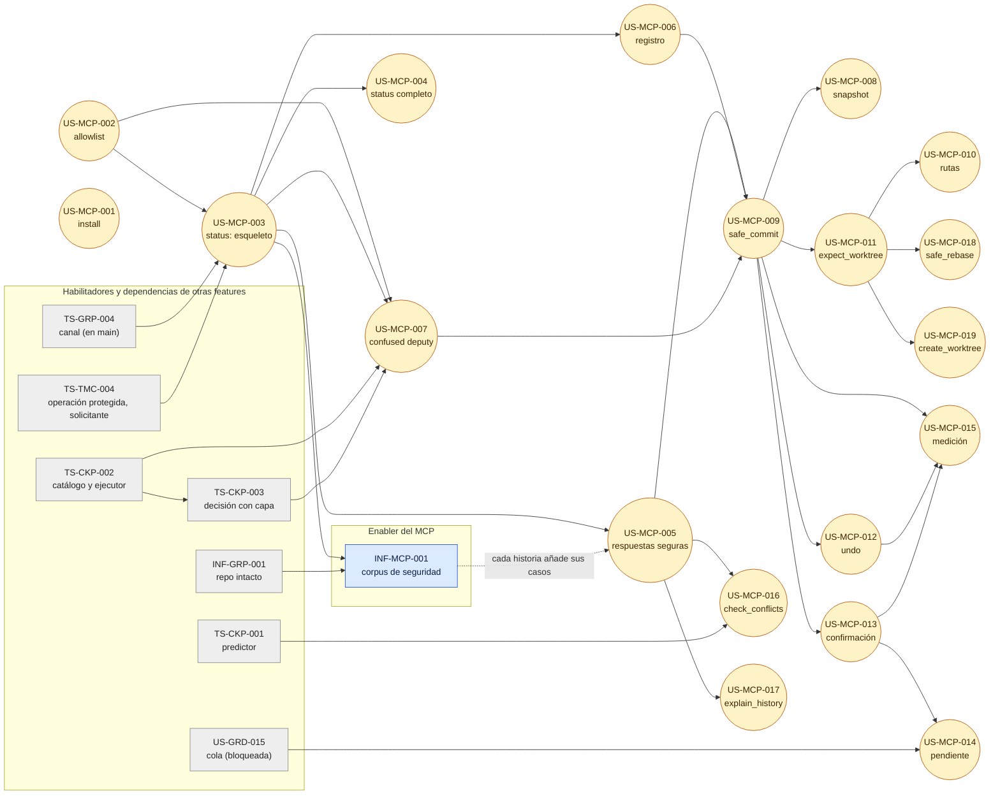

# Technical Stories — INDEX: Servidor MCP

> Índice. Cada historia vive en su archivo, dentro de [`technical-stories/`](./technical-stories/), con `status: draft`. La columna Status indica el siguiente paso: `Dev Spec Pending` (se genera con `/aadd-devspec <id>`).
>
> **Criterio de inclusión (Enabler Decision Gate)**: solo entra el trabajo técnico **sin historia de usuario dueña y sin resultado observable**. El Servidor MCP tiene 19 historias que ya son dueñas de casi todo su trabajo técnico (ámbito, vistas, allowlist, instalación, cada herramienta). **Hay 1 enabler propio**: el corpus de seguridad como suite de CI, que pidió el PO en el índice de historias ("Pendiente para la Fase 2 del Arquitecto") y ninguna historia entrega. Los habilitadores compartidos son del Cockpit (TS-CKP-001, TS-CKP-002, TS-CKP-003). Decisión del orquestador (2026-10-05), validada por Arquitecto.

## Índice

| ID | Tipo | Título | Valor (1 línea) | ADR | Habilita | Depende de | Complejidad | Status |
|----|------|--------|-----------------|-----|----------|-----------|-------------|--------|
| [INF-MCP-001](./technical-stories/INF-MCP-001-corpus-seguridad-mcp.md) | INF | Corpus de seguridad del MCP como suite de CI | El KPI "100 % del corpus rechazado" se mide en cada PR y una regresión de seguridad rompe el CI | ADR-MCP-001 § 9 | BR-16, NFR-02, SEC-MCP-01 a 11 (DEP-MCP-8); KPI de Q-MCP-18 | US-MCP-003 (nace con el primer servidor); INF-GRP-001 (huella) | Medium | Parcialmente implementada (#224) |

## DAG

Las flechas continuas bloquean; las discontinuas son coordinación. Las historias de la feature van en amarillo; los enablers de otras features, en gris.

## Ruta crítica

1. **Esqueleto andante** (ola 1): TS-GRP-004 y TS-TMC-004 (en main) → US-MCP-002 → US-MCP-003. INF-MCP-001 nace con US-MCP-003 y se ejecuta en CI desde entonces; US-MCP-005 añade los casos de respuesta.
2. **Escrituras**: TS-CKP-002 → TS-CKP-003 → US-MCP-007 → US-MCP-009 → US-MCP-011 → US-MCP-018. Es la cadena más larga y depende del Cockpit: TS-CKP-002 se construye en paralelo y fija la forma del contrato de ejecución (`prepare`/`execute` o `operation.run` con `planId`); ADR-MCP-001 § 4.3 solo exige sus propiedades.
3. **Lecturas de otras features**: US-MCP-016 espera TS-CKP-001 (que espera SPIKE-CKP-001); US-MCP-017 solo espera US-MCP-005 y la vista MCP del timeline (ADR-GRP-013, Enmienda (2026-10-05, MCP)).
4. **US-MCP-014** sigue bloqueada por producto (US-GRD-015).

**Reparto en la flota**: INF-MCP-001 vive en `apps/mcp/tests` y en CI; no comparte archivos con las historias salvo los casos que cada una añade en su PR. Los tipos del contrato MCP en `crates/api` los añade cada historia dueña, coordinada por el worker del canal (TS-GRP-004).

## Trabajo técnico que no es enabler

Trabajo con una historia dueña. Va en su Dev Spec. Decisión del orquestador (2026-10-05), validada por Arquitecto.

| Trabajo | Motivo (gate) | Destino | Fuente |
|---------|---------------|---------|--------|
| Servidor `rmcp` por stdio, capability `tools`, ciclo de vida, arranque perezoso del daemon, frontera de dependencias por comprobación estática de los `use` (amplía la Validación 5 de ADR-GRP-009; quita `gitraptor-policy` de `apps/mcp`) | Esqueleto andante | US-MCP-003 | ADR-MCP-001 § 1, SEC-MCP-09 |
| Ámbito por cwd con doble comprobación de identidad, `process_cwd` en macOS (hoy devuelve `None`; compartido con US-GRP-009: la primera que entre), worktree más profundo y orden de rechazos | Una historia | US-MCP-003 | ADR-MCP-001 § 2, SEC-MCP-02 |
| Perfil `mcp` por solicitante agente, sea cual sea el cliente | Observable (rechazo y vista) | US-MCP-003 | ADR-MCP-001 § 2, SEC-MCP-01 |
| Marca `mcp_enabled`, cascada y comandos reservados `mcp.enable`/`mcp.disable` | Una historia | US-MCP-002 | ADR-MCP-001 § 3, ADR-GRP-006 (Enmienda) |
| Vista MCP de `status` | Una historia | US-MCP-004 | ADR-MCP-001 § 4.1 |
| Tipos de respuesta, códigos de error, escape, topes, rate limit, límites por solicitante e instantánea de `initialize` y `tools/list` | Una historia | US-MCP-005 | ADR-MCP-001 § 5 y § 6, SEC-MCP-03, 05 a 08 |
| Registro y retiro del propio agente (métodos no reservados) | Una historia | US-MCP-006 | ADR-GRP-005 (Enmienda (2026-10-05, MCP)) |
| `acknowledge` y propiedades del contrato de ejecución para el MCP | Una historia (primera escritura) | US-MCP-009 | ADR-MCP-001 § 4.3 |
| API de captura manual de la Time Machine (nivel `manual`) | Una historia | US-MCP-008 | ADR-TMC-004 (Enmienda (2026-10-05, MCP)) |
| `undo` sin mover refs protegidas con capa `mcp` | Una historia | US-MCP-012 | SEC-MCP-04 |
| Consulta de la predicción para el perfil `mcp` | Una historia | US-MCP-016 | ADR-CKP-001 (Enmienda (2026-10-05, MCP)) |
| Vista MCP del timeline con filtro por id de operación | Una historia | US-MCP-017 | ADR-GRP-013 (Enmienda (2026-10-05, MCP)) |
| `raptor mcp install`/`uninstall` y detección de *shadow server* en `raptor doctor` | Una historia | US-MCP-001 | ADR-MCP-001 § 8, SEC-MCP-10 |
| Revisión OWASP / MCP Top 10 por release | Proceso, no código | Checklist del PR de release | SEC-MCP-12 |

## Destino de las dependencias DEP-MCP

| DEP | Destino | Estado |
|-----|---------|--------|
| DEP-MCP-1 | ADR-MCP-001 | Aceptado (2026-10-05) |
| DEP-MCP-2 | ADR-CKP-002 (aceptado) y su Enmienda (2026-10-05, MCP); ADR-TMC-004, Enmienda (2026-10-05, MCP) (captura manual); implementación en TS-CKP-002 y US-MCP-008, 009, 018, 019 | Aplicada |
| DEP-MCP-3 | Canal en main (`daemon-descendant`); ejecutor en TS-CKP-002; allowlist reservada en ADR-GRP-005 y SEC-03, Enmienda (2026-10-05, MCP); implementación en US-MCP-002 y US-MCP-007 | Aplicada |
| DEP-MCP-4 | ADR-GRP-006, Enmienda (2026-10-05, MCP); implementación en US-MCP-002 | Aplicada |
| DEP-MCP-5 | ADR-GRD-003, enmiendas (2026-10-04, Cockpit) y (2026-10-05, MCP); implementación en TS-CKP-003 y US-MCP-018 | Aplicada |
| DEP-MCP-6 | ADR-CKP-001 y ADR-GRP-013, Enmienda (2026-10-05, MCP); implementación en US-MCP-016 y US-MCP-017 | Aplicada |
| DEP-MCP-7 | Sin artefacto nuevo; código `confirmation-pending` reservado (ADR-MCP-001 § 5); US-MCP-014 bloqueada por US-GRD-015 | Sin cambio |
| DEP-MCP-8 | SEC-MCP-01 a 12 en `non-functional.md`; INF-MCP-001 | Aplicada |
| DEP-MCP-9 | Pendiente: etapa de validación multiplataforma | Pendiente |

Diagrama de secuencia del feature: [herramienta MCP de escritura](../../../architecture/diagrams/seq-mcp-herramienta-escritura.md).
