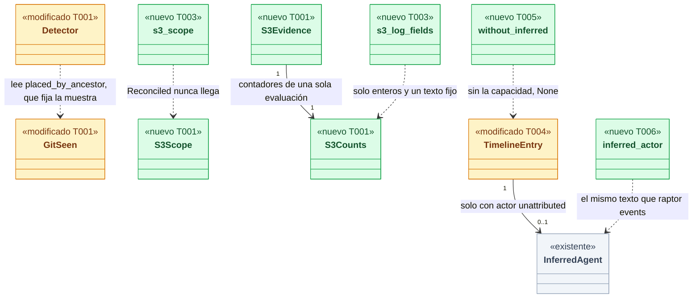
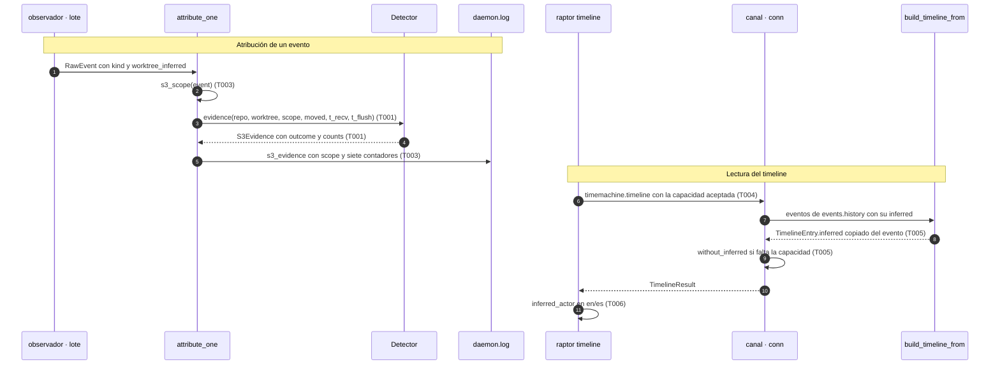
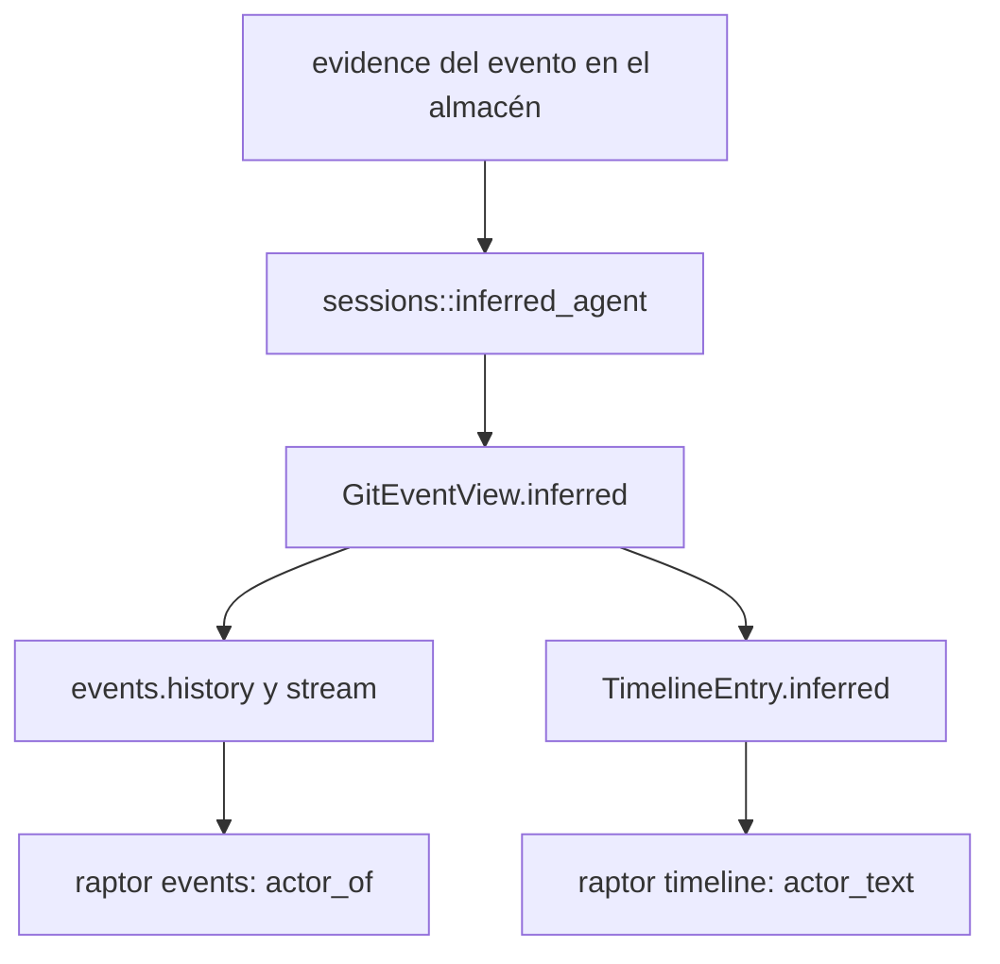
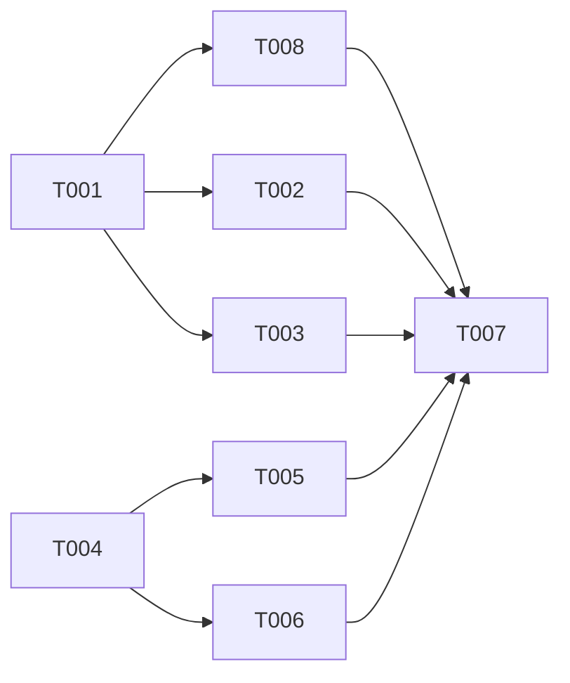

# DS-TS-GRP-008 · Ámbito del `git` ajeno en S3 y la pista en `raptor timeline`

## Contexto rápido

Al terminar, un commit que Claude Code hace en su worktree sale atribuido a su sesión con origen "detectado" aunque otros worktrees del mismo repo tengan actividad de Git en ese momento, y `raptor timeline` muestra la pista "sin agente; inferido: Claude Code" igual que `raptor events`. Hoy no puede: S3 declara ambiguo el commit si ve un `git` ajeno en cualquier worktree del repo, y con unos 20 worktrees vivos casi siempre hay uno (273 de 572 commits del dogfooding salieron `ambiguous`, ninguno `no-sighting`).

Para eso: el detector cuenta el `git` ajeno en el ámbito del evento (worktree o repo, según su tipo) y devuelve contadores; el daemon calcula el ámbito y escribe los contadores en la línea `s3_evidence`; el contrato del timeline lleva la pista en un campo opcional tras una capacidad nueva; la CLI la muestra. Las decisiones son de la Enmienda (2026-10-09) de ADR-GRP-012 y de TS-GRP-008; aquí no se reabren.

| Término | Qué es aquí |
|---|---|
| S3 | Regla de ADR-GRP-012: en la ventana del lote, un único `git` de una sesión en el worktree del evento y ningún `git` ajeno atribuyen el evento a esa sesión |
| `git` ajeno | Un proceso `git` que no desciende de ninguna sesión presente del repo (`Owner::Other`), o que lanzó el daemon (`Owner::Daemon`) |
| Ámbito worktree | Solo cuenta el `git` ajeno cuyo cwd está en el worktree del evento, más los tres casos que siempre cuentan |
| Ámbito repo | Cuenta el `git` ajeno con cwd en cualquier worktree del repo: la regla de hoy |
| Situado por ancestro | `git` ajeno cuyo cwd no se pudo leer (estaba terminando) y al que `launched_from` le dio el cwd de su ancestro vivo más cercano |
| Directorio Git común | `RepoPaths::common` (`<repo>/.git`); el escritor de la Time Machine corre con el cwd en `<común>/worktrees/<w>` |
| Pista (`inferred`) | `InferredAgent` de un evento "sin atribuir": la única sesión activa del worktree cuando S3 no vio ningún `git` (`NoSighting`). Nunca cambia el actor |
| SEC-04 | Regla de seguridad: el log del daemon no lleva rutas, nombres de worktree o rama, pids ni argv |

⚠️ **ASSUMPTION**: no existe `architecture-constitution.md`; rigen `AGENTS.md` y los ADR de `must_read` (NFR-01, NFR-02, ADR-GRP-016), como en DS-US-MCP-008.

---

## 📋 Índice

> **Para aprobar:** [Contexto rápido](#contexto-rápido) · [⚠️ Gaps](#gaps-y-violaciones-de-la-constitución) · [🔭 La forma](#la-forma) · [El trabajo de un vistazo](#el-trabajo-de-un-vistazo).
> **Para implementar:** [🚀 Plan](#plan-de-implementación), en orden. Las secciones `_(ref)_` se abren desde la tarea que las cita.

| Sección | Propósito |
|---------|-----------|
| [Contexto rápido](#contexto-rápido) | Qué se construye, por qué, y el glosario |
| [⚠️ Gaps y violaciones de la constitución](#gaps-y-violaciones-de-la-constitución) | Qué impide empezar |
| [🔭 La forma](#la-forma) | Qué piezas quedan, qué cambia y cómo fluye |
| [🚀 Plan de implementación](#plan-de-implementación) | T001…T007, en orden |
| ↳ [El trabajo de un vistazo](#el-trabajo-de-un-vistazo) | Las tareas en una tabla, y su orden |
| [Estructura de ficheros](#estructura-de-ficheros) _(ref)_ | Tres tramos disjuntos |
| [Contratos compartidos](#contratos-compartidos) _(ref)_ | Tipos y firmas que comparten las tareas |
| [Contrato de API](#contrato-de-api) _(ref)_ | Capacidad, campo opcional, log y numéricos |
| [Modelo de datos](#modelo-de-datos) _(ref)_ | Sin cambios de almacén |
| [Estrategia de pruebas y cobertura](#estrategia-de-pruebas-y-cobertura) _(ref)_ | Escenario → test → comando |
| [Gate de seguridad](#gate-de-seguridad) | Checklist pre-merge |
| [Fuera de alcance](#fuera-de-alcance) | Lo que esta entrega no toca |
| [Notas del autor](#notas-del-autor) _(ref)_ | Deducciones del código que no bloquean |

---

## ⚠️ Gaps y violaciones de la constitución

_No gaps. Ready to implement._ El diseño está validado por Arquitecto y PO (Decisión del orquestador, 2026-10-09) en la Enmienda (2026-10-09) de ADR-GRP-012. Lo que el spec deduce del código está en § Notas del autor (N1 a N6).

---

## 🔭 La forma

Queda un detector que recibe el ámbito del evento y devuelve, junto al resultado de S3, cuántos `git` contó y por qué; un daemon que decide ese ámbito por el tipo de evento y lo deja en el log; y un timeline que transporta la pista que el almacén ya guarda.



🟩 nuevo · 🟨 modificado · ⬜ existente. La cardinalidad `0..1` de la pista depende del actor: una entrada con agente nunca la lleva, aunque el evento la tuviera.

**Cómo fluye:**



El paso 3 decide: con ámbito worktree, un `git` ajeno de otro worktree con cwd legible deja de hacer ambiguo el evento. El paso 9 cambia un contrato publicado: `TimelineEntry` lleva `#[serde(deny_unknown_fields)]`, así que el campo nuevo solo viaja a quien aceptó `timemachine.timeline-inferred`.

**Dónde acaba el dato:**



La pista sale de la misma `GitEventView` por los dos caminos; los dos textos salen de `inferred_actor` (T006), y `an_inferred_event_says_so` más `an_inferred_entry_reads_like_raptor_events_in_en_and_es` comprueban que coinciden.

---

## 🚀 Plan de implementación

> Orden topológico (`Depende:`). Rutas relativas a la raíz del repo. Los tres tramos de § Estructura de ficheros son disjuntos.

### El trabajo de un vistazo

Dos frentes y un cierre: el detector y el daemon (T001-T003), el timeline de contrato a CLI (T004-T006) y la documentación con la verificación completa (T007).

| # | Tarea | Depende | Aterriza en |
|---|---|---|---|
| T001 | Acotar el `git` ajeno al ámbito del evento en el detector | — | `crates/core/src/detect/` |
| T002 | Escribir los tests del ámbito y de los contadores del detector | T001 | `crates/core/src/detect/tests.rs` |
| T003 | Calcular el ámbito por tipo de evento y escribir los contadores en `s3_evidence` | T001 | `crates/core/src/daemon/sessions.rs` |
| T004 | Añadir la pista y su capacidad al contrato del timeline | — | `crates/api/src/` |
| T005 | Llevar la pista a las entradas del timeline y quitarla sin la capacidad | T004 | `crates/core/src/timemachine/timeline.rs`, `crates/core/src/channel/conn.rs` |
| T006 | Mostrar la pista en `raptor timeline` | T004 | `apps/cli/src/` |
| T007 | Documentar la capacidad, cerrar el estado de la historia y correr el gate | T002, T003, T005, T006 | `docs/` |

### En qué orden

Dos frentes paralelos, uno por tramo, que convergen en el cierre.



### T001 — Acotar el `git` ajeno al ámbito del evento en el detector

**Objetivo.** `Detector::evidence` recibe un `S3Scope` y devuelve `S3Evidence` (resultado y contadores); la regla de combinación de S3, S4 y la pista no cambian.

**Ubicación.**
- `crates/core/src/detect/mod.rs` (**MODIFY**)
- `crates/core/src/detect/tests.rs` (**MODIFY**): solo los helpers `Rig::evidence` y `Rig::evidence_moved`, para que compile

**Pasos**
1. Declara `S3Scope`, `S3Counts` y `S3Evidence` en `detect/mod.rs`, junto a `S3Outcome`, con las formas de § Tipos y datos compartidos.
2. Añade `placed_by_ancestor: bool` a `GitSeen` y fíjalo en `Inner::sample()` (≈ línea 885) a `true` solo cuando el cwd vino de `launched_from`, en el mismo `if` que hoy incrementa el contador atómico `placed_by_ancestor`.
3. Cambia la firma de `evidence` a la de § Firmas del stack. `NoSession` y `Hook` devuelven `S3Counts::default()`.
4. Sustituye el bucle de S3 (≈ líneas 612-637) por la tabla de clasificación de § Tipos y datos compartidos. Para cada `GitSeen` de cada muestra de la ventana, la primera fila que se cumple decide el efecto y el único contador que sube.
   4.1 ⛔1.1 Comprueba el directorio Git común antes que `worktree_of`. `/r/.git/worktrees/x` empieza por `/r`, así que `worktree_of` lo sitúa en el worktree principal: un `git` ajeno ahí pasaría por "otro worktree" y el ámbito worktree lo ignoraría.
   4.2 ⛔1.2 Un `git` de sesión es evidencia solo si `repo.worktree_of(cwd) == Some(worktree)` y su cwd no está en el directorio común. `cwd.starts_with(worktree)` (lo de hoy) hace que el `git` de una sesión en `/r/.claude/worktrees/x` cuente para `/r`.
   4.3 El `git` situado por ancestro cuenta como ajeno sea cual sea el ámbito y el worktree de su cwd, siempre que ese cwd esté en el repo.
5. Deja la combinación final como está: `([], false)` → `NoSighting`; `([id], false)` → `Attributed` (o `NoSighting` si la sesión ya no está presente); el resto → `Ambiguous`.
6. Exporta los tres tipos desde `crate::detect` (son `pub` en el módulo; `daemon/sessions.rs` los importa por `crate::detect::{…}`).
7. En `detect/tests.rs`, cambia `Rig::evidence(worktree, t_recv)` y `Rig::evidence_moved(worktree, t_recv)` para que pasen `S3Scope::Repo` y devuelvan `.outcome`; añade `Rig::evidence_in(worktree, scope, t_recv) -> S3Evidence`. Los tests existentes no se editan.

> **Nota técnica.** Con `S3Scope::Repo`, la tabla da el mismo resultado que el código de hoy en todos los tests existentes. El único cambio de comportamiento con `Repo` es el de los `git` de sesión en worktrees anidados (⛔1.2), y ningún test existente lo cubre. Por eso los tests de hoy siguen siendo la prueba de no regresión del ámbito repo.

- **Depende:** —
- **Refs:** ADR-GRP-012, Enmienda (2026-10-09); TS-GRP-008 § Alcance 1
- **Aceptación:** `cargo test -p gitraptor-core --lib detect::tests` en verde sin editar ningún test existente
- **Guard ⛔1.1:** `cargo test -p gitraptor-core --lib detect::tests::s3_worktree_scope_counts_the_daemons_git_anywhere_in_the_repo -- --exact`
- **Guard ⛔1.2:** `cargo test -p gitraptor-core --lib detect::tests::s3_the_worktree_of_a_session_git_is_the_longest_root -- --exact`

### T002 — Escribir los tests del ámbito y de los contadores del detector

**Objetivo.** Un test determinista por regla de la Enmienda, sobre el `ProcLister` falso (`Table`), `Rig::new` y `sample_now`; sin `sleep` y sin tocar ningún repo.

**Ubicación.** `crates/core/src/detect/tests.rs` (**MODIFY**)

**Reglas**
- Usa los worktrees de `Rig::new`: `/r` (principal, común `/r/.git`), `/wt/feat-login` y el anidado `/r/.claude/worktrees/x`. La sesión es `rig.claude(20, 2_000, "/wt/feat-login")` seguido de `rig.scan()`.
- Los `git` se crean con el helper `git(&rig, pid, parent, cwd)`. Un `git` que termina es `cwd: None` bajo una shell con cwd legible (`rig.table.add(pid, 10, 1_500, "/bin/zsh", Some(<cwd>))`). Un `git` del daemon cuelga de `std::process::id()`, como en `s3_counts_the_daemons_own_git_and_exiting_ones_of_the_repo_as_foreign`.
- Cada test comprueba `outcome` y los contadores que su regla mueve, con `rig.evidence_in(…)`.
- Los diez tests, con los casos de § 9.3:
  1. `s3_worktree_scope_ignores_a_foreign_git_of_another_worktree`: el dogfooding. Sesión con `git` en `/wt/feat-login` y un `git` de Orca con cwd `/r` → `Attributed`, `foreign_other_wt == 1`, `foreign_wt == 0`, `sessions_wt == 1`.
  2. `s3_worktree_scope_a_person_in_the_agents_worktree_is_foreign`: con cwd legible `/wt/feat-login/src` → `Ambiguous` y `foreign_wt == 1`; en un segundo `Rig`, un `git` que termina bajo una shell en `/wt/feat-login` → `Ambiguous` y `foreign_by_ancestor == 1`.
  3. `s3_worktree_scope_a_git_placed_by_its_ancestor_is_foreign_from_any_worktree`: una shell en `/r` con un `git` que termina; el commit es de `/wt/feat-login` → `Ambiguous`, `foreign_by_ancestor == 1`, `foreign_other_wt == 0`.
  4. `s3_worktree_scope_counts_the_daemons_git_anywhere_in_the_repo`: un `git` del daemon con cwd `/r/.git/worktrees/feat-login` → `Ambiguous` y `foreign_daemon == 1`; en otro `Rig`, con cwd `/r` → `Ambiguous` y `foreign_daemon == 1`.
  5. `s3_worktree_scope_counts_a_foreign_git_in_the_common_dir`: `git` ajeno con cwd `/r/.git` → `Ambiguous` y `foreign_gitdir == 1`.
  6. `s3_repo_scope_keeps_a_foreign_git_of_another_worktree_ambiguous`: la tabla del test 1 con `S3Scope::Repo` → `Ambiguous` y `foreign_other_wt == 1`. Cubre las refs compartidas (`BranchUpdate`, `BranchCreate`, `Push`) y el worktree inferido, que T003 asigna a `Repo`.
  7. `s3_the_worktree_of_a_session_git_is_the_longest_root`: sesión en `/r/.claude/worktrees/x` con su `git` allí. Evento de `/r` → `NoSighting`; evento de `/r/.claude/worktrees/x` → `Attributed`. Un `git` ajeno con cwd en el anidado y un evento de `/r` con ámbito worktree: `foreign_other_wt == 1`, sin `foreign_wt`.
  8. `s3_worktree_scope_two_sessions_stay_ambiguous_without_hint`: dos sesiones con `git` en `/wt/feat-login` más un ajeno en `/r` → `Ambiguous`, y `rig.detector.single_session("r", Path::new("/wt/feat-login"))` es `None`.
  9. `s3_no_sighting_keeps_the_hint_with_git_in_other_worktrees`: una sesión sin `git` y un ajeno en `/r` → `NoSighting`, y `single_session` devuelve `"20:2000"`.
  10. `s3_counts_gits_started_after_the_notice`: un `git` de la sesión con `start_us = wall_us() + 60_000_000` → `NoSighting` y `gits_after_notice == 1`.

- **Depende:** T001
- **Refs:** US-GRP-007, escenarios del 2026-10-09; TS-GRP-008 § Plan de Verificación
- **Aceptación:** `cargo test -p gitraptor-core --lib detect::tests::s3_` en verde con los diez tests nuevos

### T003 — Calcular el ámbito por tipo de evento y escribir los contadores en `s3_evidence`

**Objetivo.** `attribute_one` pasa a `evidence` el ámbito que dicta el tipo del evento y escribe en `s3_evidence` el ámbito y los siete contadores; la atribución, la pista y el registro no cambian.

**Ubicación.** `crates/core/src/daemon/sessions.rs` (**MODIFY**)

**Pasos**
1. Añade `fn s3_scope(event: &RawEvent) -> S3Scope` junto a `branch_move`, con la tabla de § Tipos y datos compartidos.
   1.1 ⛔3.1 Escribe el `match` sobre `GitEventKind` sin brazo comodín `_`. Una variante nueva de `GitEventKind` tiene que obligar a decidir su ámbito; un `_ => S3Scope::Worktree` la atribuiría con la regla relajada sin que nadie lo decida. `Reconciled` va al brazo de `Repo` (nunca llega: `attribute_one` sale antes).
2. En `attribute_one`, pasa `s3_scope(event)` a `detector.evidence(…)`; trabaja con `evidence.outcome` donde hoy se usa `outcome`.
3. Extrae los campos del log a `fn s3_log_fields(…)` con la firma de § Firmas del stack y llámala desde `attribute_one`. Mantén los seis campos de hoy, en su orden, y añade detrás `scope` y los siete contadores con los nombres de § Contrato de API.
   3.1 ⛔3.2 Usa solo `Field::Int`, `Field::Text(&'static str)` y el `Field::id` del repo que ya existe. `Field` es cerrado y no puede llevar rutas; no añadas una variante a `Field` para esta línea.
4. Añade a `mod tests` de `sessions.rs` los dos tests de la Aceptación. El del log abre un `Logger` con `tempfile::tempdir()` (como `daemon::log::tests`), escribe `s3_evidence` con `s3_log_fields` y lee `daemon.log`.

- **Depende:** T001
- **Refs:** TS-GRP-008 § Alcance 1 y 2; ADR-GRP-012, Enmienda (2026-10-09), "Diagnóstico"
- **Aceptación:** `cargo test -p gitraptor-core --lib daemon::sessions::tests` en verde, con `s3_scope_follows_the_event_kind` y `the_s3_log_line_carries_only_counters`
- **Guard ⛔3.1:** `cargo test -p gitraptor-core --lib daemon::sessions::tests::s3_scope_follows_the_event_kind -- --exact` (recorre las 12 variantes)
- **Guard ⛔3.2:** `cargo test -p gitraptor-core --lib daemon::sessions::tests::the_s3_log_line_carries_only_counters -- --exact`

### T004 — Añadir la pista y su capacidad al contrato del timeline

**Objetivo.** `TimelineEntry` lleva `inferred: Option<InferredAgent>` opcional y el módulo `timemachine` declara la capacidad `timemachine.timeline-inferred`; sin lógica de daemon.

**Ubicación.**
- `crates/api/src/timemachine.rs` (**MODIFY**)
- `crates/api/src/methods/timemachine.rs` (**MODIFY**)

**Reglas**
- El campo va después de `actor`, con `#[serde(default, skip_serializing_if = "Option::is_none")]` y el doc comment de § Tipos y datos compartidos.
- Declara `CAP_TM_TIMELINE_INFERRED` junto a `CAP_TM_TIMELINE_MANUAL` y añádela a `GROUP.capabilities` del mismo archivo. Ningún otro registro cambia (ADR-GRP-016).
- Ajusta el helper `entry(…)` de `mod tests` (≈ línea 923) con `inferred: None`.
- Test nuevo en `crates/api/src/timemachine.rs`: `a_timeline_entry_carries_the_hint_only_when_present`. Con `trailer: Some(Confirmed)` el JSON tiene `inferred.kind == "claude-code"`, `inferred.session_id` y `inferred.trailer == "confirmed"`; con `Unconfirmed`, `"unconfirmed"`; con `None` la clave `inferred` no aparece. Las tres formas vuelven por `serde_json::from_value` (con `deny_unknown_fields`).

> **Nota técnica.** El cliente de `crates/api` pide en `connection.accept` toda capacidad posterior al protocolo 9 que conoce y que el daemon anuncia (`client/mod.rs`, `accept_capabilities`). Declararla en `GROUP` basta para que `raptor` la pida. `raptor-mcp` también la pide, y no pasa nada: `timemachine.timeline` no se ofrece por MCP.

- **Depende:** —
- **Refs:** ADR-GRP-016; `docs/architecture/extender-sin-archivos-compartidos.md` § Añadir una capacidad
- **Aceptación:** `cargo test -p gitraptor-api --lib timemachine::tests::a_timeline_entry_carries_the_hint_only_when_present -- --exact` en verde

### T005 — Llevar la pista a las entradas del timeline y quitarla sin la capacidad

**Objetivo.** La entrada de un evento Git copia la pista del evento cuando su actor es `unattributed`; una conexión sin `timemachine.timeline-inferred` recibe el timeline sin pistas.

**Ubicación.**
- `crates/core/src/timemachine/timeline.rs` (**MODIFY**)
- `crates/core/src/channel/conn.rs` (**MODIFY**)

**Reglas**
- En `build_timeline_from`, la entrada `EntryOrigin::GitEvent` lleva `inferred: ev.inferred.clone()` solo si `ev.actor == Actor::Unattributed`; en otro caso, `None`. Las entradas de operación y de punto manual llevan `inferred: None`.
- Añade `pub fn without_inferred(result: &mut TimelineResult)` junto a `without_manual`: pone `inferred = None` en todas las entradas.
- En `conn.rs`, en el método del timeline, justo después del bloque de `CAP_TM_TIMELINE_MANUAL` (≈ línea 3257): `if !self.has(methods::CAP_TM_TIMELINE_INFERRED.name) { crate::timemachine::timeline::without_inferred(&mut result); }`.
- Ajusta el helper `event(…)` de `mod tests` (≈ línea 873) solo si el compilador lo pide; ya lleva `inferred: None`.
- Tests nuevos en `timeline.rs`: `a_git_event_entry_carries_its_inferred_hint` (un evento `unattributed` con pista `Confirmed` → la entrada la lleva igual; el mismo evento con actor `detected(AgentKind::ClaudeCode)` → `None`; una entrada de operación → `None`) y `without_inferred_removes_every_hint`.

> **Nota técnica.** La pista contradicha por el trailer y la de un repo `human-author` no se guardan (`daemon/authorship.rs`, `checked_hint`), así que `GitEventView.inferred` ya llega `None` en esos casos. El timeline no repite esa regla.

- **Depende:** T004
- **Refs:** TS-GRP-008 § Alcance 3; ADR-GRP-012, Enmienda (2026-10-09), "Presentación"; US-GRD-019
- **Aceptación:** `cargo test -p gitraptor-core --lib timemachine::timeline::tests` en verde, con los dos tests nuevos

### T006 — Mostrar la pista en `raptor timeline`

**Objetivo.** `raptor timeline` dice "(no agent; inferred: Claude Code)" / "(sin agente; inferido: Claude Code)", con "(confirmed by the trailer)" / "(confirmado por el trailer)" o la variante "not confirmed" cuando aplica, con los mismos textos que `raptor events`; `--json` deja pasar el campo.

**Ubicación.**
- `apps/cli/src/events.rs` (**MODIFY**)
- `apps/cli/src/commands/timeline.rs` (**MODIFY**)
- `apps/cli/src/tui/gallery/stories.rs` (**MODIFY**): `inferred: None` en el constructor de `TimelineEntry`

**Pasos**
1. En `events.rs`, extrae del brazo `(Actor::Unattributed, Some(hint))` de `actor_of` la función `pub(crate) fn inferred_actor(hint: &InferredAgent) -> String` y haz que `actor_of` la llame. El texto no cambia.
2. En `commands/timeline.rs`, en `actor_text`, añade como primer brazo `(Attribution::Current, Actor::Unattributed)` con `entry.inferred` presente → `events::inferred_actor(hint)`. Va antes del brazo de `timeline.actor-unavailable`: la pista es un dato guardado y no depende de que el motor detecte ahora.
3. No añadas claves de i18n: se reutilizan `events.no_agent_inferred`, `events.inferred_confirmed` y `events.inferred_unconfirmed` de `apps/cli/i18n/{en,es}/events.txt`, que ya siguen la guía de contenido (`docs/design-system/README.md`, fila "Fila sin agente").
4. Ajusta el helper `entry(…)` de `mod tests` con `inferred: None` y añade los dos tests de la Aceptación. El de idiomas comprueba con `crate::i18n::text_in` los textos en/es de las tres claves y que `render` contiene `t("events.no_agent_inferred", …)` con el sufijo `confirmed` y con el `unconfirmed`.

> **Nota técnica.** `raptor timeline --json` imprime el valor del daemon tal cual (`commands/timeline.rs`, rama `if self.json`), así que el JSON lleva `inferred` en cuanto el daemon lo sirve. La forma del JSON la prueba el test de T004.

- **Depende:** T004
- **Refs:** TS-GRP-008 § Alcance 3; US-GRD-019; `docs/design-system/README.md`
- **Aceptación:** `cargo test -p gitraptor-cli --bin raptor commands::timeline::tests` y `cargo test -p gitraptor-cli --bin raptor events::tests::an_inferred_event_says_so -- --exact` en verde

### T007 — Documentar la capacidad, cerrar el estado de la historia y correr el gate

**Objetivo.** El contrato IPC documenta la capacidad nueva, la historia enlaza esta Dev Spec y queda en implementada, y el gate del workspace pasa.

**Ubicación.**
- `docs/architecture/design/api-contract-ipc.md` (**MODIFY**)
- `docs/requirements/features/motor-local/technical-stories/TS-GRP-008-ambito-git-ajeno-s3.md` (**MODIFY**)
- `docs/requirements/features/motor-local/technical-stories.md` (**MODIFY**)
- `docs/requirements/features/motor-local/user-stories/US-GRP-007-sesiones-claude-code.md` (**MODIFY**)
- `docs/requirements/features/motor-local/dev-specs/TS-GRP-008-dev-spec.md` (**MODIFY**): `status`

**Pasos**
1. En `api-contract-ipc.md`, añade a la tabla de capacidades la fila `timemachine.timeline-inferred | — (TS-GRP-008) | timemachine.timeline sirve inferred en las entradas de eventos Git sin agente; sin la capacidad no aparece`. Añade una línea igual junto a la de `timemachine.timeline-manual` (≈ línea 172).
2. En TS-GRP-008, cambia la línea "Dev Spec: Pendiente…" por el enlace a `../dev-specs/TS-GRP-008-dev-spec.md` y `status` a `implemented`, con el PR.
3. En `technical-stories.md`, el estado de TS-GRP-008 pasa a "Implementada" con el PR.
4. En US-GRP-007, § Estado de la implementación, añade el PR a "Implementado en".
5. Corre el gate de la Aceptación. Si algo falla o no se pudo verificar, dilo en el PR (AGENTS.md).

- **Depende:** T002, T003, T005, T006
- **Refs:** AGENTS.md § Reglas de calidad; ADR-GRP-016
- **Aceptación:** `cargo fmt --all --check`, `cargo clippy --workspace --all-targets -- -D warnings`, `cargo test -p gitraptor-core --lib`, `cargo test -p gitraptor-api --lib`, `cargo test -p gitraptor-cli --bin raptor` y `cargo test -p gitraptor-git --test repo_intact_exec` en verde

---

> Las secciones siguientes son de referencia. Se abren desde la tarea que las cita, no se leen en orden.

## Estructura de ficheros

Tres tramos disjuntos: ningún archivo aparece en dos. A y B pueden ir en paralelo; C cierra.

### Tramo A — detector y daemon (T001, T002 y T003)

```text
crates/core/src/
├── detect/
│   ├── mod.rs              ← MODIFY  S3Scope, S3Counts, S3Evidence, GitSeen.placed_by_ancestor, evidence
│   └── tests.rs            ← MODIFY  helpers del Rig y diez tests s3_
└── daemon/
    └── sessions.rs         ← MODIFY  s3_scope, s3_log_fields, attribute_one y dos tests
```

### Tramo B — timeline de contrato a CLI (T004, T005 y T006)

```text
crates/api/src/
├── timemachine.rs          ← MODIFY  TimelineEntry.inferred y un test
└── methods/timemachine.rs  ← MODIFY  CAP_TM_TIMELINE_INFERRED en GROUP
crates/core/src/
├── timemachine/timeline.rs ← MODIFY  copia de la pista, without_inferred y dos tests
└── channel/conn.rs         ← MODIFY  una línea tras el filtro de CAP_TM_TIMELINE_MANUAL
apps/cli/src/
├── events.rs               ← MODIFY  inferred_actor extraída de actor_of
├── commands/timeline.rs    ← MODIFY  actor_text y dos tests
└── tui/gallery/stories.rs  ← MODIFY  inferred: None
```

### Tramo C — documentación y gate (T007)

```text
docs/
├── architecture/design/api-contract-ipc.md                                   ← MODIFY
└── requirements/features/motor-local/
    ├── technical-stories.md                                                  ← MODIFY
    ├── technical-stories/TS-GRP-008-ambito-git-ajeno-s3.md                   ← MODIFY
    ├── user-stories/US-GRP-007-sesiones-claude-code.md                       ← MODIFY
    └── dev-specs/TS-GRP-008-dev-spec.md                                      ← MODIFY
```

`← CREATE`: fichero nuevo. `← MODIFY`: fichero existente. Si el compilador pide `inferred: None` en otro constructor de `TimelineEntry` fuera de esta lista, ese archivo entra en el Tramo B: el grep de hoy (`TimelineEntry {`) solo encuentra los de arriba.

---

## Contratos compartidos

### Tipos y datos compartidos

```rust
// crates/core/src/detect/mod.rs

/// Where a foreign `git` counts for one Git event.
#[derive(Debug, Clone, Copy, PartialEq, Eq)]
pub enum S3Scope {
    /// Only a foreign `git` whose folder is in the event's worktree, plus the
    /// daemon's, the ones placed by an ancestor and the ones in the common dir.
    Worktree,
    /// A foreign `git` whose folder is anywhere in the repo.
    Repo,
}

impl S3Scope {
    /// Stable text of the `scope` field of `s3_evidence`.
    pub fn as_str(self) -> &'static str; // "worktree" | "repo"
}

/// What one S3 evaluation counted, for the dogfooding review. Integers only:
/// never a path, a name, a pid or an argv. Each counts (sample, `git`) pairs
/// of the window, so a `git` seen in two samples counts twice.
#[derive(Debug, Clone, Copy, Default, PartialEq, Eq)]
pub struct S3Counts {
    /// `git`s of a session whose folder is in the event's worktree (evidence).
    pub sessions_wt: u32,
    /// Foreign `git`s whose readable folder is in the event's worktree.
    pub foreign_wt: u32,
    /// Foreign `git`s whose readable folder is in another worktree of the
    /// repo: foreign only with `S3Scope::Repo`.
    pub foreign_other_wt: u32,
    /// The daemon's own `git`s in the repo or exiting.
    pub foreign_daemon: u32,
    /// Foreign `git`s placed by the folder of a live ancestor, in the repo.
    pub foreign_by_ancestor: u32,
    /// Foreign `git`s whose folder is in the common Git dir.
    pub foreign_gitdir: u32,
    /// `git`s that started after the write: not evidence and not foreign.
    pub gits_after_notice: u32,
}

/// The S3 (or S4) outcome of one event and what it counted.
#[derive(Debug, Clone, PartialEq, Eq)]
pub struct S3Evidence {
    pub outcome: S3Outcome,
    /// Zero for `NoSession` and `Hook`: the S3 loop did not run.
    pub counts: S3Counts,
}

// Private, same file.
struct GitSeen {
    owner: Owner,
    cwd: Option<PathBuf>,
    started_before: bool,
    /// `cwd` is the folder of the nearest live ancestor, not its own.
    placed_by_ancestor: bool,
}
```

**Clasificación de cada `GitSeen` de la ventana** (T001). La primera fila que se cumple decide; sube como mucho un contador. `common` es `RepoPaths::common`; `wt(c)` es `repo.worktree_of(c)`; `in_repo(c)` es `repo.contains(c)`.

| # | Condición | Efecto | Contador |
|---|---|---|---|
| 1 | `!started_before` | ninguno | `gits_after_notice` |
| 2 | `Session(id)`, `cwd = Some(c)`, `!c.starts_with(common)`, `wt(c) == Some(worktree)` | evidencia de `id` | `sessions_wt` |
| 3 | `Session(_)`, cualquier otro caso | ninguno | — |
| 4 | `Daemon`, `cwd = None` | ajeno | `foreign_daemon` |
| 5 | `Daemon`, `cwd = Some(c)`, `in_repo(c)` | ajeno | `foreign_daemon` |
| 6 | `Daemon`, `cwd = Some(c)`, fuera del repo | ninguno | — |
| 7 | `Other`, `cwd = None` | ninguno | — |
| 8 | `Other`, `cwd = Some(c)`, fuera del repo | ninguno | — |
| 9 | `Other`, `c.starts_with(common)` | ajeno | `foreign_gitdir` |
| 10 | `Other`, `placed_by_ancestor` | ajeno | `foreign_by_ancestor` |
| 11 | `Other`, `wt(c) == Some(worktree)` | ajeno | `foreign_wt` |
| 12 | `Other`, en otro worktree del repo | ajeno solo si `scope == Repo` | `foreign_other_wt` |

**Ámbito por tipo de evento** (T003, `s3_scope`):

| `GitEventKind` | Ámbito |
|---|---|
| `Reset`, `BranchSwitch` | `Worktree` |
| `Commit`, `Merge`, `Rebase` con `details.worktree_inferred == false` | `Worktree` |
| `Commit`, `Merge`, `Rebase` con `details.worktree_inferred == true` | `Repo` |
| `BranchUpdate`, `BranchCreate`, `BranchDelete`, `Push`, `WorktreeCreate`, `WorktreeDelete`, `Reconciled` | `Repo` |

```rust
// crates/api/src/timemachine.rs — campo nuevo de TimelineEntry, después de `actor`
/// For a Git event without an agent, the agent it is inferred to come from,
/// checked against the commit's trailer: a hint shown as "inferred", never an
/// attribution. Only with the capability `timemachine.timeline-inferred`.
#[serde(default, skip_serializing_if = "Option::is_none")]
pub inferred: Option<crate::messages::InferredAgent>,

// crates/api/src/methods/timemachine.rs
/// `timemachine.timeline` serves `inferred` on the entries of Git events
/// without an agent. A connection without it never receives the field.
pub const CAP_TM_TIMELINE_INFERRED: Capability = Capability::new("timemachine.timeline-inferred");
```

`InferredAgent` y `TrailerCheck` (`crates/api/src/messages.rs`) no cambian.

### Ciclos de vida (DI)

_No ambient state — DI lifetimes follow stack defaults._ El `Detector` sigue siendo el único del daemon, con su `Mutex` interno; `S3Evidence` y `S3Counts` son valores de una sola llamada y no se guardan.

### Firmas del stack

```rust
// crates/core/src/detect/mod.rs
impl Detector {
    pub fn evidence(
        &self,
        repo_id: &str,
        worktree: &Path,
        scope: S3Scope,
        moved: Option<RefMove<'_>>,
        t_recv: u64,
        t_flush: u64,
    ) -> S3Evidence;
}

// crates/core/src/detect/tests.rs (helpers del Rig)
fn evidence(&self, worktree: &str, t_recv: u64) -> S3Outcome;          // S3Scope::Repo
fn evidence_moved(&self, worktree: &str, t_recv: u64) -> S3Outcome;    // S3Scope::Repo
fn evidence_in(&self, worktree: &str, scope: S3Scope, t_recv: u64) -> S3Evidence;

// crates/core/src/daemon/sessions.rs
fn s3_scope(event: &RawEvent) -> S3Scope;
fn s3_log_fields(
    repo_id: &str,
    kind: GitEventKind,
    outcome: &'static str,
    diag: Diagnostics,
    scope: S3Scope,
    counts: S3Counts,
) -> Vec<(&'static str, Field)>;

// crates/core/src/timemachine/timeline.rs
pub fn without_inferred(result: &mut TimelineResult);

// apps/cli/src/events.rs
pub(crate) fn inferred_actor(hint: &InferredAgent) -> String;
```

---

## Contrato de API

| Superficie | Cambio | Quién lo recibe |
|---|---|---|
| `timemachine.timeline` (JSON-RPC) | `TimelineEntry.inferred` opcional | Conexiones que aceptaron `timemachine.timeline-inferred`; las demás reciben la forma de hoy |
| Capacidades del daemon | `timemachine.timeline-inferred` en el grupo `timemachine` | `hello.capabilities` de protocolo 9 |
| `daemon.log`, línea `s3_evidence` | `scope` y siete contadores al final | Solo lectura humana (SPIKE-GRP-001) |
| `raptor timeline` texto | Actor con la pista, como `raptor events` | Persona |
| `raptor timeline --json` | `inferred` en las entradas que lo llevan | Persona o script |

Forma de la entrada con pista:

```json
{
  "id": "event:42",
  "actor": "unattributed",
  "inferred": { "kind": "claude-code", "session_id": "20:2000", "trailer": "confirmed" },
  "attribution": "current"
}
```

Línea `s3_evidence` (los seis primeros campos son los de hoy):

```text
<ms> info s3_evidence repo=<id> event=commit outcome=attributed samples=N s3_cwd_unreadable=N s3_placed_by_ancestor=N scope=worktree sessions_wt=N foreign_wt=N foreign_other_wt=N foreign_daemon=N foreign_by_ancestor=N foreign_gitdir=N gits_after_notice=N
```

### Forma del error y del cuerpo de respuesta

_No aplica — esta entrega no añade caminos de error._ `timemachine.timeline` mantiene sus errores, y un campo opcional ausente no es un error.

### Forma de la configuración

_No aplica — ninguna tarea lee configuración._ `SessionConfig` (`s3_lead`, `start_tolerance`) no cambia.

### Valores numéricos

| Concepto | Valor | Fuente |
|---------|-------|--------|
| Adelanto de la ventana S3 (`s3_lead`) | 100 ms | `detect/mod.rs`, `SessionConfig::default` (sin cambios) |
| Tolerancia de "empezó antes" (`start_tolerance`) | 1 s en Linux, 0 en macOS y Windows | `detect/mod.rs` (sin cambios) |
| Muestras guardadas por repo (`MAX_SIGHTINGS`) | 256 | `detect/mod.rs` (sin cambios) |
| Profundidad de ancestros (`MAX_DEPTH`) | 64 | `detect/mod.rs` (sin cambios) |
| Contadores de `S3Counts` | `u32`, `saturating_add` | Esta spec |

---

## Modelo de datos

_No aplica — sin cambios de almacén._ La pista ya se guarda en la columna `evidence` del evento (`{"signals":["single-session"],"session":…,"trailer":…}`) y se lee con `sessions::inferred_agent`. Esta entrega no añade columnas, migraciones ni valores del actor (Q34, Q35).

---

## Estrategia de pruebas y cobertura

### 9.1 Pirámide de pruebas

| Tipo | Cantidad | Tareas dueñas | Herramientas | Cuándo |
|------|---------:|-------------|---------|------|
| Unit | 17 | T002, T003, T004, T005, T006 | `cargo test --lib` / `--bin raptor` | PR gate |
| Integration | 1 | T007 | `cargo test -p gitraptor-git --test repo_intact_exec` (no regresión, BR-CONS-001) | PR gate |

### 9.2 Umbrales de cobertura

| Capa | Línea | Rama | Mutación | Camino crítico 100% |
|-------|-----:|-------:|---------:|:------------------:|
| `detect::Detector::evidence` | — | — | — | ✅ las 12 filas de la clasificación |
| `daemon::sessions::s3_scope` | — | — | — | ✅ las 12 variantes de `GitEventKind` |

### 9.3 Datos de prueba

- Builders / fixtures: el `ProcLister` falso `Table`, `Rig::new` y `sample_now` de `detect/tests.rs`; ningún repo real ni temporal (los tests del detector no tocan Git).
- Multi-tenant data: dos sesiones (`rig.claude(20, …)` y `rig.claude(21, …)`) en el mismo worktree para el caso ambiguo.
- PII / PHI: no aplica. El test del log usa un id de repo no hexadecimal como canario (`"/home/u/canary-wt"`) y comprueba que la línea dice `repo=invalid-id` y no contiene `canary`.
- Time / clock: `t_recv` explícito y `wall_us()` para los inicios; ninguna espera fija.

Escenario → prueba:

| Escenario (US-GRP-007 / TS-GRP-008) | Prueba | Comando |
|---|---|---|
| Commit del agente con Git ajeno en otro worktree → atribuido (dogfooding) | `s3_worktree_scope_ignores_a_foreign_git_of_another_worktree` | `cargo test -p gitraptor-core --lib detect::tests::s3_worktree_scope_ignores_a_foreign_git_of_another_worktree -- --exact` |
| Persona en el worktree del agente, cwd legible o situado por ancestro → ambiguo | `s3_worktree_scope_a_person_in_the_agents_worktree_is_foreign` | `cargo test -p gitraptor-core --lib detect::tests::s3_worktree_scope_a_person_in_the_agents_worktree_is_foreign -- --exact` |
| Shell en B con un `git` que termina → ambiguo para el commit de A | `s3_worktree_scope_a_git_placed_by_its_ancestor_is_foreign_from_any_worktree` | `cargo test -p gitraptor-core --lib detect::tests::s3_worktree_scope_a_git_placed_by_its_ancestor_is_foreign_from_any_worktree -- --exact` |
| `git` del daemon con cwd en `.git/worktrees/A` o en B → ambiguo | `s3_worktree_scope_counts_the_daemons_git_anywhere_in_the_repo` | `cargo test -p gitraptor-core --lib detect::tests::s3_worktree_scope_counts_the_daemons_git_anywhere_in_the_repo -- --exact` |
| `git` ajeno en el directorio común → ambiguo | `s3_worktree_scope_counts_a_foreign_git_in_the_common_dir` | `cargo test -p gitraptor-core --lib detect::tests::s3_worktree_scope_counts_a_foreign_git_in_the_common_dir -- --exact` |
| Refs compartidas y worktree inferido → ámbito repo, ambiguo | `s3_repo_scope_keeps_a_foreign_git_of_another_worktree_ambiguous` + `s3_scope_follows_the_event_kind` | `cargo test -p gitraptor-core --lib detect::tests::s3_repo_scope_keeps_a_foreign_git_of_another_worktree_ambiguous -- --exact` y `cargo test -p gitraptor-core --lib daemon::sessions::tests::s3_scope_follows_the_event_kind -- --exact` |
| Worktree anidado: la raíz más larga | `s3_the_worktree_of_a_session_git_is_the_longest_root` | `cargo test -p gitraptor-core --lib detect::tests::s3_the_worktree_of_a_session_git_is_the_longest_root -- --exact` |
| Dos sesiones → ambiguo y sin pista | `s3_worktree_scope_two_sessions_stay_ambiguous_without_hint` | `cargo test -p gitraptor-core --lib detect::tests::s3_worktree_scope_two_sessions_stay_ambiguous_without_hint -- --exact` |
| Nadie vio el commit → `NoSighting` con pista | `s3_no_sighting_keeps_the_hint_with_git_in_other_worktrees` | `cargo test -p gitraptor-core --lib detect::tests::s3_no_sighting_keeps_the_hint_with_git_in_other_worktrees -- --exact` |
| `git` que empezó después de la escritura | `s3_counts_gits_started_after_the_notice` | `cargo test -p gitraptor-core --lib detect::tests::s3_counts_gits_started_after_the_notice -- --exact` |
| Log con contadores, sin rutas ni canarios | `the_s3_log_line_carries_only_counters` | `cargo test -p gitraptor-core --lib daemon::sessions::tests::the_s3_log_line_carries_only_counters -- --exact` |
| JSON del timeline con pista `confirmed` / `unconfirmed`, sin clave sin pista | `a_timeline_entry_carries_the_hint_only_when_present` | `cargo test -p gitraptor-api --lib timemachine::tests::a_timeline_entry_carries_the_hint_only_when_present -- --exact` |
| La entrada copia la pista solo sin agente; sin capacidad no aparece | `a_git_event_entry_carries_its_inferred_hint`, `without_inferred_removes_every_hint` | `cargo test -p gitraptor-core --lib timemachine::timeline::tests::a_git_event_entry_carries_its_inferred_hint -- --exact` y el mismo con `without_inferred_removes_every_hint` |
| `raptor timeline` en/es con pista y sufijo del trailer | `an_inferred_entry_reads_like_raptor_events_in_en_and_es` | `cargo test -p gitraptor-cli --bin raptor commands::timeline::tests::an_inferred_entry_reads_like_raptor_events_in_en_and_es -- --exact` |
| Sin pista (contradicha o `human-author`) → "no agent" | `an_entry_without_hint_reads_no_agent` | `cargo test -p gitraptor-cli --bin raptor commands::timeline::tests::an_entry_without_hint_reads_no_agent -- --exact` |
| No regresión de `raptor events` | `an_inferred_event_says_so` (existente) | `cargo test -p gitraptor-cli --bin raptor events::tests::an_inferred_event_says_so -- --exact` |
| BR-CONS-001: el repo observado no cambia | arnés `repo_intact_exec` (existente) | `cargo test -p gitraptor-git --test repo_intact_exec` |

### 9.4 Comportamientos críticos verificados

- [ ] Una persona que trabaja en el worktree del agente sigue haciendo ambiguo el evento, con el cwd legible o situado por su ancestro (BR-EDGE-004).
- [ ] El `git` del daemon nunca deja atribuir un evento a una sesión, esté su cwd en un worktree o en el directorio común.
- [ ] Ningún tipo de evento de refs compartidas (`BranchUpdate`, `BranchCreate`, `BranchDelete`, `Push`, `WorktreeCreate`, `WorktreeDelete`) ni un commit con worktree inferido usa el ámbito worktree.
- [ ] La línea `s3_evidence` solo lleva enteros, los textos fijos `scope` / `event` / `outcome` y el id del repo filtrado por `Field::id` (SEC-04).
- [ ] La pista nunca cambia el actor: `actor` sigue en `unattributed` en el JSON, y una entrada con agente no lleva `inferred`.
- [ ] Sin `timemachine.timeline-inferred`, el cable de `timemachine.timeline` es el de hoy.

### 9.5 Plataformas

| Plataforma | Cómo se verifica | Pendiente |
|---|---|---|
| macOS | Todos los tests en local; dogfooding con el binario instalado (SPIKE-GRP-001) | — |
| Linux | Unitarios en CI `ubuntu-latest`; la regla usa la misma tabla de procesos falsa | Pendiente: etapa de validación multiplataforma para el dogfooding |
| Windows | Unitarios y `cargo clippy --workspace --all-targets --target x86_64-pc-windows-msvc -- -D warnings` en CI | Pendiente: etapa de validación multiplataforma; `worktree_of` compara rutas por componentes y no normaliza mayúsculas (sin cambios) |

---

## Gate de seguridad

- La entrega amplía cuándo un evento se atribuye a una sesión, y la atribución da permisos de `undo` en la Time Machine (ADR-TMC-005). Revisión de `security-expert` recomendada sobre T001 (lectura de cwd de procesos ajenos y clasificación).
- Los riesgos de la Enmienda (2026-10-09) siguen declarados, sin mitigar aquí: un `git --git-dir=<común>/.git/worktrees/A` sin chdir lanzado desde fuera de A, y una rama activa en dos worktrees (`--ignore-other-worktrees`).
- El log no recibe rutas: `Field` es cerrado y T003 solo usa `Int`, `Text(&'static str)` y `Field::id` (SEC-04).
- La CLI no imprime texto nuevo del repo: la pista solo lleva `kind` (enum) y el sufijo del trailer; `session_id` no se muestra en texto.
- Sin `unsafe`, sin procesos nuevos, sin escritura en el repo observado (NFR-01, BR-CONS-001).

Corre `/security-review --scope devspec docs/requirements/features/motor-local/dev-specs/TS-GRP-008-dev-spec.md` antes de mezclar.

---

## Fuera de alcance

| Ítem / no-objetivo | Historia que lo cubre | Gate (cómo se verifica) |
|----------------|--------------------|-------------------------|
| Origen `active-session` (opción a, diferida) | TS-GRP-008 § Descripción; se reabre si los contadores muestran muchos `no-sighting` | `grep -rn "active-session" crates apps` no devuelve nada |
| Separar `BranchUpdate` por su mensaje de reflog | TS-GRP-008 § Fuera de alcance | `s3_scope_follows_the_event_kind` fija `BranchUpdate` en `Repo` |
| Cambios de BR-EDGE-004, BR-AUTH-005 o BR-26 | Ratificación de Rene | `git diff main -- docs/requirements/features/motor-local/business-rules.md` vacío |
| S4, el registro (regla 3), la pista `single-session` y los valores del actor | ADR-GRP-012, ADR-GRP-013 | Los tests existentes de `detect::tests` y `daemon::sessions::tests` pasan sin editarse |
| La pista en la vista de timeline de la TUI | Cockpit, cuando lo pida una historia | `apps/cli/src/tui/widgets/timeline.rs` no cambia |
| `--agent claude-code` en `raptor timeline` incluyendo eventos con pista | US-TMC-006 | `AgentFilter::keeps` en `timeline.rs` no cambia |

---

## Notas del autor

Deducciones del código que el spec sigue sin abrir gap. Las tareas que las aplican lo dicen.

| ID | Nota | Acción | Owner |
|----|------|--------|-------|
| N1 | El `git` del daemon con cwd fuera del repo no cuenta como ajeno. La Enmienda dice "sea cual sea su cwd"; el código de hoy (`detect/mod.rs:629`, `foreign \|= repo.contains(cwd)`) lo acota al repo, y un `git` del daemon para otro repo no escribe en este. T001 sigue el código (filas 5 y 6) | Ninguna | — |
| N2 | Un `git` de sesión con el cwd en el directorio común no es evidencia (fila 2). Es la misma razón por la que la Enmienda saca del worktree principal al escritor de la Time Machine: por ruta, `<común>/worktrees/<w>` cae en el principal sin ser parte de él | Ninguna | — |
| N3 | Los contadores cuentan pares (muestra, `git`): `GitSeen` no guarda el pid (SEC-04 en memoria) y la línea es diagnóstico, no una medida exacta | Leerlos como proporción en SPIKE-GRP-001 | SM |
| N4 | Con `Hook` (S4) los contadores salen a cero: S4 decide antes del bucle de S3 (`detect/mod.rs:600-610`) | Ninguna | — |
| N5 | La línea de `conn.rs` que filtra la pista no tiene test de proceso: un evento con pista exige una sesión detectada real. La cubren `without_inferred_removes_every_hint` y la revisión, igual que `without_manual` | Ninguna | — |
| N6 | `raptor timeline` muestra la pista aunque el motor diga ahora "agente no disponible": la pista es un dato guardado cuando la detección funcionaba (T006, paso 2) | Ninguna | — |

## Enmiendas

| Fecha | Origen | Qué cambia | Ids |
|---|---|---|---|
| 2026-10-09 | Coordinador, al aprobar el plan (**Decisión del orquestador (2026-10-09)**) | Un `git` ajeno puede escribir en un worktree distinto del de su cwd. Con `--git-dir` o `GIT_DIR` no hace chdir; `-C` y `--work-tree` sí lo hacen, pero se tratan igual por prudencia. El ámbito worktree solo se fía del cwd si el `git` **no redirige su destino**. Ver § E1 | T001, T002, T008, ADR-GRP-012 (Enmienda 2026-10-09) |

### E1 — `git` ajeno que redirige su destino

**Regla.** Un `git` ajeno (`Owner::Other`) con su propio cwd legible en el repo cuenta en **todo el repo**, sea cual sea el ámbito, en dos casos:

- **Redirige su destino**: lleva `-C`, `--git-dir` o `--work-tree` entre las opciones globales (antes del subcomando, en forma separada o con `=`), o tiene `GIT_DIR`, `GIT_WORK_TREE` o `GIT_COMMON_DIR` en el entorno.
- **No se puede saber**: el argv o el entorno no se pudieron leer (fail-safe hacia `Ambiguous`).

Solo un `git` ajeno que se pudo leer y no redirige su destino sigue las filas 11 y 12.

**Qué se lee y qué no.**
- Se calcula un único booleano por proceso. Nunca se guardan ni se registran valores del argv o del entorno, ni siquiera en `GitSeen` (SEC-04). El entorno solo se compara **por nombre** contra los tres de arriba.
- **macOS**: el área de `KERN_PROCARGS2`, la misma que ya lee `gitraptor_macsys::process::process_args` (DS-US-GRD-018 § 5.3). Una función pura nueva recorre el argv y luego los nombres del entorno. No hay `unsafe` nuevo.
- **Linux**: `/proc/<pid>/cmdline` y `/proc/<pid>/environ`, con un tope de 256 KiB cada uno.
- **Windows** y el resto: no se lee, el resultado es "no se puede saber" y el `git` cuenta en todo el repo. En Windows el comportamiento es el de antes de esta TS. *Pendiente: etapa de validación multiplataforma.*
- **Coste**: solo para los `git` `Other` con cwd propio legible dentro del repo y fuera del directorio común, una vez por muestra.

**Opciones globales con valor** (se salta su valor para encontrar el subcomando): `-C`, `-c`, `--git-dir`, `--work-tree`, `--namespace`, `--config-env`, `--exec-path` (solo la forma con `=`), `--super-prefix`. El primer argumento que no es opción es el subcomando, y lo que va detrás no se mira. Así `git log -C` (opción de `log`) no redirige, y `git -c core.x=1 status` tampoco.

**Clasificación.** Fila nueva entre la 10 y la 11:

| # | Condición | Efecto | Contador |
|---|---|---|---|
| 10b | `Other`, `cwd` propio legible en el repo, `redirect != Some(false)` | ajeno | `foreign_redirected` |

`S3Counts` gana el campo `foreign_redirected: u32`, y `s3_evidence` lo escribe como entero.

### T008 — Leer si un `git` ajeno redirige su destino

**Objetivo.** El ámbito worktree solo se fía del cwd de un `git` ajeno que se pudo leer y no redirige su destino (§ E1).

**Ubicación.** Tramo A:
- `crates/macsys/src/process.rs` (**MODIFY**): `pub fn process_git_redirect(pid) -> Option<bool>` y la función pura `parse_procargs2_git_redirect(area) -> Option<bool>`.
- `crates/core/src/detect/procs.rs` (**MODIFY**):
  - método `ProcLister::git_redirect(&self, pid: u32) -> Option<bool>`, por defecto `None`;
  - función pura `git_redirects(args: &[OsString], env_names: impl Iterator<Item = &OsStr>) -> bool`;
  - implementaciones para macOS (macsys) y Linux (`/proc`).
- `crates/core/src/detect/mod.rs` (**MODIFY**): `GitSeen.redirect: Option<bool>`, fijado en `sample()` solo en el caso de arriba, y la fila 10b.
- `crates/core/src/detect/tests.rs` (**MODIFY**): el `Table` falso implementa `git_redirect` con un mapa por pid (`Some(false)` por defecto) y el helper `Table::redirect(pid, Option<bool>)`.

**Pasos**
1. Escribe en macsys la función pura `parse_procargs2_git_redirect`: argc, el ejecutable, el argv con las opciones globales de § E1 y luego los nombres del entorno, comparados contra `GIT_DIR`, `GIT_WORK_TREE` y `GIT_COMMON_DIR`. Si el área está mal formada, devuelve `None`.
2. Escribe en `detect/procs.rs` el método `git_redirect` y la función pura `git_redirects`. En Linux, lee `/proc/<pid>/cmdline` y `/proc/<pid>/environ` con el tope de 256 KiB.
3. En `sample()`, fija `GitSeen.redirect` solo para `Other` con cwd propio legible en el repo y fuera del directorio común. Añade la fila 10b y el contador `foreign_redirected`, y escribe ese contador en `s3_log_fields`.
4. ⛔8.1 Ningún valor del argv o del entorno sale de la función que lo lee: ni en `GitSeen`, ni en el log, ni en un error.

- **Depende:** T001
- **Refs:** § E1; ADR-GRP-012, Enmienda (2026-10-09); SEC-04
- **Aceptación:** los cuatro grupos de tests de abajo en verde.
- **Guard ⛔8.1:** `cargo test -p gitraptor-core --lib daemon::sessions::s3_tests::the_s3_log_line_carries_only_counters -- --exact` (los canarios del argv y del entorno no aparecen en la línea)

**Tests** (contrato, en rojo primero):
- `detect::tests::s3_scope::s3_worktree_scope_a_redirected_foreign_git_counts_in_the_whole_repo`;
- `detect::tests::s3_scope::s3_worktree_scope_an_unreadable_foreign_git_counts_in_the_whole_repo`;
- `detect::procs::redirect_tests::*` (`-C`, `--work-tree`, `--git-dir=`, `GIT_DIR` en el entorno, y los negativos `log -C` y `-c`);
- `gitraptor-macsys`: `process::redirect_tests::*` sobre áreas `KERN_PROCARGS2` sintéticas.
