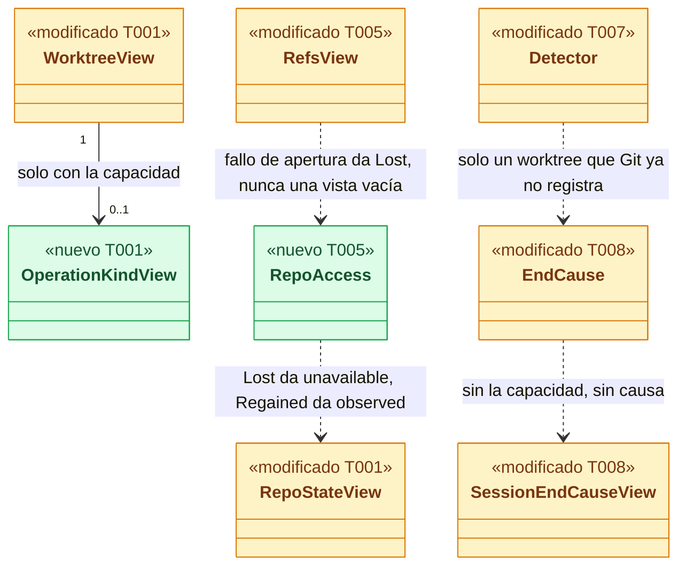
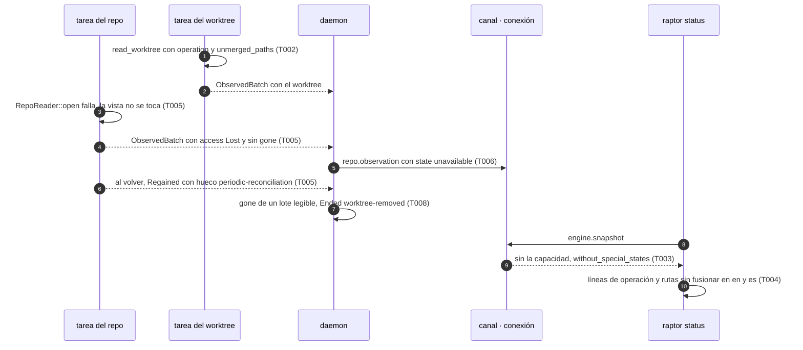
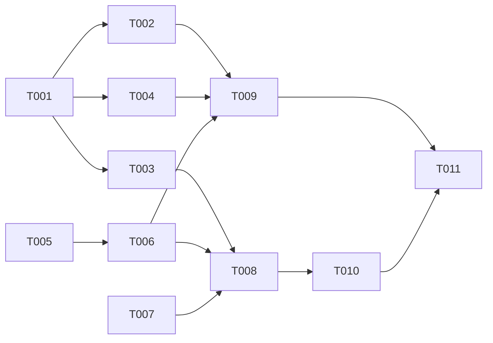

# DS-US-GRP-003 · Estados especiales de Git y worktrees o repos que ya no están

## Contexto rápido

Al terminar, el desarrollador ve en `raptor status` (y cualquier cliente del canal) qué worktree tiene un rebase, un merge, un cherry-pick, un revert, un `am` o un bisect a medias y cuántas rutas le quedan sin fusionar, qué worktree o repo ya no se puede leer, y que las sesiones de un worktree retirado de Git pasan a "Terminado", sin que el motor toque nada del repo. Hoy no puede: el motor solo guarda un booleano interno de "operación en curso" que no publica, un repo movido o borrado se publica como si se hubieran retirado todos sus worktrees, y las sesiones de un worktree retirado siguen presentes.

Para eso: el contrato publica la operación en curso y el recuento de rutas sin fusionar tras una capacidad nueva; el observador falla cerrado cuando no puede abrir el repo y el daemon lo marca no disponible; el detector termina las sesiones de un worktree que Git ya no registra, con la causa nueva de la Enmienda (2026-10-09, US-GRP-003) de ADR-GRP-013.

| Término | Qué es aquí |
|---|---|
| Estado especial | Operación de Git a medias (marcadores `MERGE_HEAD`, `rebase-merge/`, `rebase-apply/`, `CHERRY_PICK_HEAD`, `REVERT_HEAD`, `BISECT_LOG`), `HEAD` separado o rutas sin fusionar (BR-EDGE-002) |
| Ruta sin fusionar | Entrada del índice con etapa mayor que 0; `gix` la da como `EntryStatus::Conflict`, que `crates/git` convierte en `ChangeKind::Conflicted` (`crates/git/src/reader.rs:596`) |
| Worktree retirado | Git ya no lo registra en `<común>/worktrees/` (`git worktree remove` o `prune`): el observador lo pone en `ObservedBatch.gone` |
| Worktree sin carpeta | Git lo sigue registrando pero su raíz no existe: se lee `unavailable { reason: missing }` (`crates/core/src/observe.rs:731`) |
| Repo no disponible | En el perfil, pero su directorio Git común no se puede abrir ahora (movido, borrado, disco desmontado o ilegible) |
| Repo activo / dormido | Niveles de observación de ADR-GRP-010, Enmienda (2026-10-07). Solo el activo está dentro de NFR-04 |

⚠️ **ASSUMPTION**: no existe `architecture-constitution.md`; rigen `AGENTS.md` y los ADR de `must_read`, como en DS-TS-GRP-008.

---

## 📋 Índice

> **Para aprobar:** [Contexto rápido](#contexto-rápido) · [⚠️ Gaps](#gaps-y-violaciones-de-la-constitución) · [🔭 La forma](#la-forma) · [El trabajo de un vistazo](#el-trabajo-de-un-vistazo).
> **Para implementar:** [🚀 Plan](#plan-de-implementación), en orden. Las secciones `_(ref)_` se abren desde la tarea que las cita.

| Sección | Propósito |
|---------|-----------|
| [Contexto rápido](#contexto-rápido) | Qué se construye, por qué, y el glosario |
| [⚠️ Gaps y violaciones de la constitución](#gaps-y-violaciones-de-la-constitución) | Qué impide empezar |
| [Decisiones y fallos del PO](#decisiones-y-fallos-del-po) | D1-D8 validadas y P1-P5 decididas |
| [🔭 La forma](#la-forma) | Qué piezas quedan y cómo fluye |
| [🚀 Plan de implementación](#plan-de-implementación) | T001…T011, en orden |
| ↳ [El trabajo de un vistazo](#el-trabajo-de-un-vistazo) | Las tareas en una tabla, y su orden |
| [Estructura de ficheros](#estructura-de-ficheros) _(ref)_ | Tramos y archivos |
| [Contratos compartidos](#contratos-compartidos) _(ref)_ | Tipos y firmas |
| [Contrato de API](#contrato-de-api) _(ref)_ | Capacidades, cable y frescura garantizada |
| [Modelo de datos](#modelo-de-datos) _(ref)_ | Migración de `sessions.end_cause` |
| [Estrategia de pruebas y cobertura](#estrategia-de-pruebas-y-cobertura) _(ref)_ | Escenario → test → comando |
| [Gate de seguridad](#gate-de-seguridad) | Checklist pre-merge |
| [Fuera de alcance](#fuera-de-alcance) | Lo que esta entrega no toca |
| [Notas del autor](#notas-del-autor) _(ref)_ | Hallazgos que no bloquean |

---

## ⚠️ Gaps y violaciones de la constitución

_No gaps. Ready to implement._ La causa `worktree-removed` la fija la [Enmienda (2026-10-09, US-GRP-003)](../../../../architecture/decisions/ADR-GRP-013-modelo-eventos-atribucion.md#enmienda-2026-10-09-us-grp-003) de ADR-GRP-013 (antes G1). El PO separó "carpeta que desaparece" de "worktree retirado" en la historia y en BR-EDGE-001 (antes G2).

---

## Decisiones y fallos del PO

**Decisiones.** Todas son **Decisión del orquestador (2026-10-09), validada por Arquitecto y PO**, con los ajustes de la validación ya incorporados.

| # | Decisión | Por qué |
|---|---|---|
| D1 | `WorktreeView.operation: Option<OperationKindView>` con seis valores (`rebase`, `merge`, `cherry-pick`, `revert`, `am`, `bisect`) que agrupan los diez de `InProgress`, tras la capacidad `observation.special-states`. Es el primer tramo de la forma del "estado en conflicto" que ADR-GRP-010, Enmienda (2026-10-04, Cockpit), deja pendiente para TS-GRP-004: los oids y la lista acotada de rutas llegan después sin renombrar estos campos | `WorktreeView` lleva `deny_unknown_fields` (`crates/api/src/messages.rs:346`): un campo nuevo exige capacidad (ADR-GRP-016) |
| D2 | `WorktreeView.unmerged_paths: u32`, contado sobre el status completo, con la misma capacidad. Es un añadido sobre la historia, que solo pide reportar los conflictos sin resolver: es el total que citará la lista acotada futura | Hay rutas sin fusionar sin operación en curso (`git stash pop` con conflicto). No se llama `conflicts`: `AttentionView.conflicts` es el conflicto predicho (`crates/api/src/scope.rs:104`) |
| D3 | Worktree sin carpeta (Git aún lo registra): `unavailable { missing }`, sin temporizador. Worktree retirado de Git: sale de la lista y queda su evento `worktree-delete` (comportamiento actual, `daemon/repos.rs:563-575`) | Fallo P1 del PO |
| D4 | Si `RepoReader::open` falla, el repo pasa a `RepoStateView::Unavailable`, publicado con `repo.observation { observed: true, state: unavailable }`, y la vista no se toca. Si abre pero falla un listado, se descarta el lote y se reintenta, sin pasar a `Lost`. Al volver (`Regained`) se registran de nuevo las vigilancias y el lote lleva un hueco `periodic-reconciliation` | Hoy un fallo de apertura deja la vista vacía (`watch/repo.rs:70-72`): `classify` emite un `worktree-delete` por worktree, `apply` los pone todos en `gone` y llama a `stop_worktree`, y al volver salen `worktree-create` falsos. No salen `branch-delete` falsos (con la vista vacía `place` devuelve `None` y `push` lo descarta); esos solo salen si abre y falla `local_branches()`. Sin el hueco, los cambios de mientras se atribuirían (BR-EDGE-005) |
| D5 | Una sesión, detectada o registrada, termina con `worktree-removed` solo cuando Git ya no registra su worktree. Nunca por `missing`, nunca mientras el repo está `Lost` o `unavailable`, y en `detect_repo` nunca con `read == None`. Sin la capacidad `sessions.worktree-removed`, la sesión llega terminada sin `end_cause` | Fallos P2 y P4 del PO; ADR-GRP-013, Enmienda (2026-10-09, US-GRP-003); ADR-GRP-010 § 6. Una sesión terminada no vuelve (Q41): un fin falso no tiene arreglo |
| D6 | El detector no sitúa un proceso cuyo cwd ya no existe. En Linux se decide con `metadata("/proc/<pid>/cwd")` (`nlink == 0`) o con el sufijo `" (deleted)"` del kernel, no con `is_dir()` sobre el texto. Un Claude Code vivo con el cwd borrado no se cierra como `process-gone`: sigue en `live` hasta que su proceso termina o su worktree se retira, y no se vuelve a situar | `readlink /proc/<pid>/cwd` devuelve `<ruta> (deleted)` (`channel/peer.rs:291`), que por componentes cae en el worktree padre: sin esto, un Claude Code de `/r/.claude/worktrees/x` borrado sería una sesión nueva de `/r` |
| D7 | `HEAD` separado ya se publica: `head.kind = detached` siempre, y `detached_at` solo con `scope.activity` (`messages.rs:370`); no cambia | `crates/api/src/messages.rs:262`, `:370` |
| D8 | No se persiste la operación en `last_known_state.operation`. Es una desviación declarada de ADR-GRP-013 § 1 (el último estado conocido incluye la operación en curso) y de su Enmienda (2026-10-04, Cockpit): una operación que empieza y termina dentro de un hueco no se detecta | Nadie lee hoy ese campo (solo se escribe a `None`, `observe.rs:230`, `daemon/repos.rs:390`) |

**Fallos del PO** (2026-10-09, `nassa-aadd:product-owner`):

- **P1**: aceptada D3. La historia separa "desaparece la carpeta" (escenario 2) de "se retira de Git" (escenario 5 nuevo), y BR-EDGE-001 lleva la enmienda.
- **P2**: la causa propia "worktree retirado" (`worktree-removed`) es visible: sí.
- **P3**: se exponen los seis tipos. La tabla de ejemplos de la historia conserva sus cuatro filas.
- **P4**: una sesión solo termina cuando Git ya no registra el worktree (D5). El escenario 3 usa "Codex" registrado por US-GRP-009: los tests usan el registro, nunca la detección.
- **P5**: "observación degradada" queda fuera de US-GRP-003; dueño US-CKP-003, cuyo arquitecto decide la forma del contrato.

---

## 🔭 La forma

Queda una vista de worktree que dice qué operación hay a medias y cuántas rutas faltan por fusionar, un observador que distingue "no puedo abrir el repo" de "el repo no tiene worktrees", y un detector que cierra las sesiones de un worktree que Git retira.



🟩 nuevo · 🟨 modificado · ⬜ existente. `unmerged_paths` puede ser mayor que cero sin operación: por eso no cuelga de `OperationKindView`. `RepoStateView` solo cambia su doc comment.

**Cómo fluye:**



El paso 4 cambia el comportamiento publicado: hoy ese lote lleva todos los worktrees en `gone`. El paso 7 solo ocurre con un lote cuya vista se leyó entera.

---

## 🚀 Plan de implementación

> Orden topológico (`Depende:`). Rutas relativas a la raíz del repo. Ningún test toca este repo: repos temporales del arnés de INF-GRP-001 (`gitraptor_testkit::{Fixture, check}`).

### El trabajo de un vistazo

Tres frentes y un cierre: estados especiales de contrato a CLI (T001-T004), repo no disponible (T005-T006), sesiones de un worktree retirado (T007-T008), y pruebas y documentación (T009-T011).

| # | Tarea | Depende | Aterriza en |
|---|---|---|---|
| T001 | Añadir la operación, las rutas sin fusionar y sus capacidades al contrato | — | `crates/api/src/` |
| T002 | Leer la operación en curso y contar las rutas sin fusionar | T001 | `crates/core/src/observe.rs` |
| T003 | Servir los campos nuevos solo a quien acepta la capacidad | T001 | `crates/core/src/channel/` |
| T004 | Mostrar la operación y las rutas sin fusionar en `raptor status` | T001 | `apps/cli/` |
| T005 | Hacer que el observador falle cerrado cuando no puede abrir el repo | — | `crates/core/src/watch/` |
| T006 | Publicar el repo como no disponible y devolverlo al leerse | T005 | `crates/core/src/daemon/` |
| T007 | Terminar en el detector las sesiones de un worktree y no situar un cwd que no existe | — | `crates/core/src/detect/` |
| T008 | Registrar la causa `worktree-removed` y terminar las sesiones desde el daemon | T003, T006, T007 | `crates/core/src/`, `crates/api/src/` |
| T009 | Escribir las pruebas de estados especiales y de repo no disponible | T002, T004, T006 | `crates/core/tests/` |
| T010 | Escribir las pruebas de sesiones de un worktree retirado | T008 | `crates/core/tests/` |
| T011 | Documentar el contrato, cerrar el estado de la historia y correr el gate | T009, T010 | `docs/` |

### En qué orden

Tres frentes paralelos; el de sesiones espera a los otros dos porque comparte `conn.rs`, `bus.rs` y `daemon/repos.rs`.



### T001 — Añadir la operación, las rutas sin fusionar y sus capacidades al contrato

**Objetivo.** Tipos y capacidades de § Tipos y datos compartidos, sin lógica de daemon. La variante `SessionEndCauseView::WorktreeRemoved` va en T008.

**Ubicación.**
- `crates/api/src/messages.rs` (**MODIFY**): `OperationKindView`, los dos campos de `WorktreeView`, `without_special_states` en `WorktreeView`, `RepoView` y `WorktreeStateData`, y el doc comment de `RepoStateView::Unavailable`
- `crates/api/src/methods/observation.rs` (**MODIFY**): `CAP_OBSERVATION_SPECIAL_STATES` en `GROUP.capabilities`
- `crates/api/src/special_states_tests.rs` (**CREATE**), enlazado desde `messages.rs` con `#[cfg(test)] #[path = "special_states_tests.rs"] mod special_states_tests;` (patrón de `timemachine_inferred_tests.rs`)
- Literales de `WorktreeView` que pida el compilador (`operation: None, unmerged_paths: 0`): `crates/core/src/observe.rs`, `crates/core/tests/observe.rs`, `crates/core/src/channel/mcp_status_tests.rs`, `crates/core/src/channel/mcp_status_more_tests.rs`, `apps/cli/src/tui/view.rs`, `apps/cli/tests/tui_loop.rs`, `apps/cli/src/status.rs` (**MODIFY**)

**Reglas**
- Los dos campos van detrás de `detached_at`, con `#[serde(default, skip_serializing_if = …)]`: `Option::is_none` para `operation` y un `is_zero` privado para `unmerged_paths`.
- El doc de `RepoStateView::Unavailable` pasa de "its store could not be opened" a "its store or its Git directory cannot be opened now".
- La capacidad va en `observation.rs`; `methods/mod.rs` no se toca (ADR-GRP-016).
- Tests: `a_worktree_carries_its_operation_and_unmerged_paths_only_when_present` (JSON con `"operation":"rebase"` y `"unmerged_paths":2`; sin operación y con 0, ninguna de las dos claves; ida y vuelta con `deny_unknown_fields`) y `without_special_states_drops_both_fields`.

- **Depende:** —
- **Refs:** ADR-GRP-016; `extender-sin-archivos-compartidos.md` § Añadir una capacidad; D1, D2
- **Aceptación:** `cargo test -p gitraptor-api --lib special_states_tests` en verde

### T002 — Leer la operación en curso y contar las rutas sin fusionar

**Objetivo.** `read_worktree` rellena `operation` y `unmerged_paths`; `reconcile` y las tareas del observador los heredan sin cambios.

**Ubicación.** `crates/core/src/observe.rs` (**MODIFY**)

**Pasos**
1. Añade `fn operation_kind(p: InProgress) -> OperationKindView` con la tabla de § Tipos y datos compartidos.
   1.1 ⛔2.1 Escribe el `match` sin brazo `_`. Una variante nueva de `InProgress` tiene que obligar a decidir su valor; un comodín la publicaría con el nombre de otra operación.
2. En el cierre `read` de `read_worktree` (≈ línea 685), guarda `before = reader.in_progress()` y `after = reader.in_progress()` alrededor de `head()` y `status()`, como hoy. `operation = after.or(before).map(operation_kind)` e `in_progress = operation.is_some()`.
3. Cuenta `unmerged_paths` en `changes()` sobre `status.unstaged` con `ChangeKind::Conflicted`, no sobre la lista acotada.
4. Un worktree `Unavailable` lleva `operation: None` y `unmerged_paths: 0`.

> **Nota técnica.** `repo.state()` de `gix` solo mira si existen los marcadores; `status()` no escribe el índice (`crates/git/src/reader.rs:550`). Ninguna lectura lanza `git` (ADR-GRP-009), así que nada de esto completa, continúa ni aborta la operación (BR-CONS-001, "Operaciones en curso").

- **Depende:** T001
- **Refs:** BR-EDGE-002; ADR-GRP-010 § 4 y Enmienda (2026-10-04, Cockpit); D1, D2
- **Aceptación:** `cargo test -p gitraptor-core --test us_grp_003_states` en verde (T009)
- **Guard ⛔2.1:** `cargo test -p gitraptor-core --lib observe::tests::every_operation_has_its_kind -- --exact`

### T003 — Servir los campos nuevos solo a quien acepta la capacidad

**Objetivo.** Sin `observation.special-states`, el cable de los tres snapshots y de `worktree.state` es el de hoy.

**Ubicación.**
- `crates/core/src/channel/bus.rs` (**MODIFY**): flag `without_special_states` en `Outbox`, `true` por defecto, aplicado en `shape` a `worktree.state`
- `crates/core/src/channel/conn.rs` (**MODIFY**): `set_without_special_states(!self.has(…))` junto a `set_without_activity` (≈ línea 586), y `without_special_states()` en los tres sitios donde hoy se quita la actividad: `repo.add` (≈ línea 1123), `engine.snapshot` (≈ línea 1842) y `scope.snapshot` (≈ línea 1945)

**Reglas**
- `shape` aplica los dos filtros al mismo `WorktreeStateData` cuando faltan las dos capacidades; ninguno pisa al otro.
- Tests en `bus.rs`: `worktree_state_without_special_states_has_no_operation`; en `conn.rs`, `every_snapshot_drops_the_special_states_without_the_capability` (los tres métodos).

- **Depende:** T001
- **Refs:** ADR-GRP-016 § capacidades
- **Aceptación:** `cargo test -p gitraptor-core --lib channel::bus::tests::worktree_state_without_special_states_has_no_operation -- --exact` y `cargo test -p gitraptor-core --lib channel::conn::tests::every_snapshot_drops_the_special_states_without_the_capability -- --exact`

### T004 — Mostrar la operación y las rutas sin fusionar en `raptor status`

**Objetivo.** El texto añade una línea por cada uno, debajo de la del `HEAD`; el JSON añade `operation` y `unmerged_paths`.

**Ubicación.**
- `apps/cli/src/status.rs` (**MODIFY**): `worktree_text` y `worktree_json`
- `apps/cli/i18n/en/status.txt` y `apps/cli/i18n/es/status.txt` (**MODIFY**): `status.operation-<kind>` (seis claves) y `status.unmerged` con `{count}`

**Reglas**
- Textos de partida: "rebase in progress" / "rebase en curso", y así con `merge`, `cherry-pick`, `revert`, `am` ("applying patches" / "aplicando parches") y `bisect`; "{count} unmerged paths" / "{count} rutas sin fusionar".
- `raptor` acepta la capacidad: el cliente de `crates/core` pide toda capacidad que conoce (ADR-GRP-016, paso 3). La TUI la recibe y la ignora (US-CKP-016).
- Tests en `status.rs`: `a_rebase_with_unmerged_paths_reads_in_en_and_es` y `the_json_carries_operation_and_unmerged_paths`.

- **Depende:** T001
- **Refs:** US-GRP-003, escenario 1
- **Aceptación:** `cargo test -p gitraptor-cli --bin raptor status::tests` en verde

### T005 — Hacer que el observador falle cerrado cuando no puede abrir el repo

**Objetivo.** Un repo que no abre nunca produce `gone` ni eventos de retiro; la tarea del repo publica `RepoAccess::Lost` una vez y `Regained` al volver, con sus vigilancias registradas de nuevo.

**Ubicación.**
- `crates/core/src/watch/repo.rs` (**MODIFY**): `RefsView::read -> Result<Self, RefsReadError>`, estado `lost` de la tarea, `flush` y `poll`
- `crates/core/src/watch/mod.rs` (**MODIFY**): `RepoAccess`, `ObservedBatch.access`, las llamadas de las líneas ≈ 939 y ≈ 1045, y el registro de vigilancias al recuperar el repo
- `crates/core/src/watch/worktree.rs` (**MODIFY**): `access: RepoAccess::Unchanged` en `send`
- `crates/core/tests/observe.rs` (**MODIFY**): `access` en el helper `batch`

**Pasos**
1. `RefsView::read` devuelve `Err(Unopenable)` si falla `RepoReader::open` y `Err(Listing)` si abre y falla `local_branches()`, `remote_branches()` o `worktrees()`. Quita los `unwrap_or_default` de esas tres listas.
2. Con `Err(Listing)`: descarta el lote y deja que el sondeo siguiente reintente. La tarea no pasa a `lost`.
   2.1 ⛔5.1 No marques `lost` por un listado fallido: un `git worktree add` concurrente puede dejar `worktrees()` a medias un instante, y el repo parpadearía entre disponible y no disponible.
3. Con `Err(Unopenable)`: no llames a `apply`. Si la tarea no estaba `lost`, márcala y envía un lote vacío con `access: Lost`.
4. Con `Ok` y la tarea `lost`: quita la marca, registra de nuevo las vigilancias del `.git` común y de cada raíz de worktree (hoy solo se registran al añadir el repo), aplica el diff contra la última vista buena y envía el lote con `access: Regained` y un `GapMark { cause: PeriodicReconciliation, started_ms: <cuando se perdió>, ended_ms: now }` aunque no haya cambios. Después manda `WtMsg::Reconcile` a cada tarea de worktree.
   4.1 ⛔5.2 Si la tarea arrancó sin vista buena (≈ línea 939 con `Err`), la primera lectura buena es la base y no se clasifica: comparada con una vista vacía, saldría un `worktree-create` por cada worktree.
5. Mientras está `lost`, la tarea sigue con el sondeo de `WatchConfig::backup_poll`; no hay temporizador nuevo.

> **Nota técnica.** La causa `periodic-reconciliation` es la existente más cercana. Una causa propia para "repo no disponible" es de US-GRP-005 (§ Fuera de alcance).

- **Depende:** —
- **Refs:** BR-EDGE-001, BR-EDGE-005; ADR-GRP-010 § 5 y § 6; D4
- **Aceptación:** `cargo test -p gitraptor-core --lib watch::repo::tests::an_unopenable_repo_is_lost_not_emptied -- --exact`
- **Guard ⛔5.1:** `cargo test -p gitraptor-core --lib watch::repo::tests::a_failed_listing_is_retried_without_losing_the_repo -- --exact`
- **Guard ⛔5.2:** `cargo test -p gitraptor-core --lib watch::repo::tests::a_task_started_lost_takes_its_first_view_as_base -- --exact`

### T006 — Publicar el repo como no disponible y devolverlo al leerse

**Objetivo.** `RepoView.state` y `RepoSummaryView.state` dicen `unavailable` mientras el repo no se puede abrir, en vivo, al despertar y al arrancar; los demás repos no cambian.

**Ubicación.**
- `crates/core/src/daemon/availability.rs` (**CREATE**): `Daemon::set_repo_state`
- `crates/core/src/daemon/repos.rs` (**MODIFY**): en el lote, `Lost` llama a `set_repo_state(Unavailable)` y sale antes de persistir; `Regained` llama a `set_repo_state(Observed)` y sigue con el lote normal
- `crates/core/src/daemon/tiers.rs` (**MODIFY**): `wake_repo` con `reconcile` en `Err` llama a `set_repo_state(Unavailable)` antes de `fail_wake`; con éxito, `set_repo_state(Observed)`
- `crates/core/src/daemon/mod.rs` (**MODIFY**): al arrancar, `read == None` da `RepoStateView::Unavailable` (hoy `Observed` con cero worktrees, ≈ línea 533), y un `mod availability;`

**Reglas**
- `set_repo_state` publica `repo.observation { repo_id, observed: true, state, path }` solo si el estado cambia, y en su `apply` actualiza el `state` del repo en el snapshot del bus.
- Un repo `unavailable` conserva sus worktrees como los publiquen sus tareas (lo normal: `missing`).
- Log: `repo_unavailable` y `repo_available` con `Field::id` del repo y nada más (SEC-04).
- Un repo ilegible al arrancar se vigila igual, con una tarea de repo que arranca `lost` (T005, ⛔5.2). Cómo `observe()` llega a `watch_repo` sin `RepoRead` lo resuelve el implementador dentro de `watch/mod.rs` (Tramo B).
- El MCP ya falla cerrado con un repo `unavailable` (`conn.rs:2776`, `mcp_status.rs:108`): no cambia.

- **Depende:** T005
- **Refs:** BR-EDGE-001; ADR-GRP-010, Enmienda (2026-10-07), N3 y N4; D4
- **Aceptación:** `cargo test -p gitraptor-core --test us_grp_003_daemon a_moved_repo_is_unavailable_and_the_other_keeps_going -- --exact` (T009)

### T007 — Terminar en el detector las sesiones de un worktree y no situar un cwd que no existe

**Objetivo.** `Detector::end_worktree` deja de seguir las sesiones de un worktree y devuelve sus ids; un proceso con el cwd borrado no se sitúa.

**Ubicación.**
- `crates/core/src/detect/mod.rs` (**MODIFY**)
- `crates/core/src/detect/procs.rs` (**MODIFY**): `ProcLister::cwd_gone`
- `crates/core/src/detect/tests.rs` (**MODIFY**): el `Table` falso implementa `cwd_gone` con un conjunto de pids

**Reglas**
- `end_worktree` quita de `live` y de `registered` las sesiones con ese `repo_id` y ese worktree, y devuelve sus `session_id` en orden de inicio. No emite `SessionChange`: la causa la pone T008.
- `ProcLister::cwd_gone(&self, pid) -> bool`, por defecto `self.cwd(pid).is_some_and(|c| !c.is_dir())`. En Linux: `true` si `metadata("/proc/<pid>/cwd")` da `nlink == 0` o si `read_link` termina en `" (deleted)"`.
- En `scan_processes`, `place` devuelve `None` si `cwd_gone(pid)`. Un proceso ya en `live` no se toca: sigue hasta que muere (`process-gone`) o hasta `end_worktree`.
- Tests: `ending_a_worktree_stops_its_detected_and_registered_sessions`, `a_process_whose_folder_is_gone_is_not_a_new_session` (cwd `/r/.claude/worktrees/x (deleted)` con el worktree anidado de `Rig::new` → ninguna sesión en `/r`) y `a_live_session_whose_folder_is_gone_is_not_ended` (sigue en `live`, sin `Ended`).

- **Depende:** —
- **Refs:** BR-EDGE-001; BR-WF-001 (Q41); D5, D6
- **Aceptación:** `cargo test -p gitraptor-core --lib detect::tests` en verde sin editar tests existentes

### T008 — Registrar la causa `worktree-removed` y terminar las sesiones desde el daemon

**Objetivo.** Un worktree que Git ya no registra termina sus sesiones con `worktree-removed`, en vivo y al empezar a observar el repo; la conexión sin `sessions.worktree-removed` las recibe sin `end_cause`.

**Ubicación.**
- `crates/core/src/profile/store.rs` (**MODIFY**): `EndCause::WorktreeRemoved => "worktree-removed"`
- `crates/core/src/profile/schema.rs` (**MODIFY**): migración nueva al final de `STORE_MIGRATIONS` (§ Modelo de datos)
- `crates/api/src/messages.rs` (**MODIFY**): `SessionEndCauseView::WorktreeRemoved` y `SessionView::without_worktree_removed`
- `crates/api/src/methods/sessions.rs` (**MODIFY**): `CAP_SESSIONS_WORKTREE_REMOVED`
- `crates/core/src/daemon/sessions.rs` (**MODIFY**): `end_absent_worktrees`, `detect_repo` y `session_view`
- `crates/core/src/daemon/repos.rs` (**MODIFY**): una llamada a `end_absent_worktrees` tras persistir el lote
- `crates/core/src/channel/bus.rs`, `crates/core/src/channel/conn.rs` (**MODIFY**): flag `without_worktree_removed` para `session.state` y `sessions.list`

**Pasos**
1. `end_absent_worktrees(&mut self, batch)`: por cada raíz de `batch.gone` de un lote con `access != Lost`, llama a `detector.end_worktree` y pasa a `sessions_changed` un `SessionChange::Ended { at_ms: Some(now), cause: EndCause::WorktreeRemoved }` por id.
   1.1 ⛔8.1 No lo dispares por un worktree `Unavailable { Missing }` ni con el repo `unavailable`: la carpeta puede volver (un disco desmontado, un repo movido y devuelto) y una sesión terminada no vuelve (Q41).
2. En `detect_repo`, solo con un `RepoRead` leído (nunca con `read == None`), después de `watch_repo` y antes de re-registrar las registradas: una sesión abierta, detectada o registrada, cuyo worktree no está en `read.worktrees` se cierra con `at_ms: None` y `worktree-removed`, y no se re-registra. Un worktree que está pero `missing` conserva sus sesiones.
3. `session_view` mapea la causa nueva; `without_worktree_removed` pone `end_cause = None` solo si es `WorktreeRemoved`.
   3.1 ⛔8.2 Sin la capacidad, nunca la conviertas en `process-gone` ni en `registration-withdrawn`: las dos afirman algo que no pasó.

- **Depende:** T003, T006, T007
- **Refs:** BR-EDGE-001 (Enmienda 2026-10-09); BR-WF-001; ADR-GRP-013, Enmienda (2026-10-09, US-GRP-003); ADR-GRP-010 § 6; D5
- **Aceptación:** `cargo test -p gitraptor-core --test us_grp_003_sessions` en verde (T010)
- **Guard ⛔8.1:** `cargo test -p gitraptor-core --test us_grp_003_sessions a_lost_repo_ends_no_sessions -- --exact` y `a_missing_folder_keeps_its_session`
- **Guard ⛔8.2:** `cargo test -p gitraptor-core --test us_grp_003_sessions an_old_client_sees_the_session_ended_without_a_cause -- --exact`

### T009 — Escribir las pruebas de estados especiales y de repo no disponible

**Objetivo.** Los escenarios 1, 2, 4 y 5 de la historia, en repos temporales y con el arnés de repo intacto.

**Ubicación.**
- `crates/core/tests/us_grp_003_states.rs` (**CREATE**): sin daemon, con `observe::reconcile` y el `Observer` (helper `watch` como el de `tests/suites/watch.rs`, copiado; ese archivo no se toca)
- `crates/core/tests/us_grp_003_daemon.rs` (**CREATE**): daemon en proceso con `common::TempProfile` y cliente real, como `channel_scopes.rs`; `#![cfg(any(target_os = "macos", target_os = "linux"))]`

**Reglas**
- Los tests de § 9.3, con sus datos. Cada uno espera la notificación o el lote que prueba el hecho, con 10 s de techo, sin `sleep` fijo.
- Los tests de repo movido y devuelto no pueden esperar al sondeo de 30 s: arranca el daemon de test con un `backup_poll` corto. ⚠️ **ASSUMPTION**: la configuración del daemon de test expone `WatchConfig`; si no, añade un gancho de test `poll_now` en el observador, como `simulate_overflow`.
- `a_repo_moved_back_is_observed_again` comprueba además que un cambio de archivo posterior se publica.
- Cada test que observa un estado especial lo envuelve en `check(…).assert_intact()` y comprueba después que el marcador sigue (`rebase-merge/`, `MERGE_HEAD`, `CHERRY_PICK_HEAD`, `BISECT_LOG`) y que `git status` del test lo sigue diciendo.

- **Depende:** T002, T004, T006
- **Refs:** US-GRP-003; INF-GRP-001
- **Aceptación:** `cargo test -p gitraptor-core --test us_grp_003_states --test us_grp_003_daemon` en verde

### T010 — Escribir las pruebas de sesiones de un worktree retirado

**Objetivo.** El escenario 3, la causa en el cable con y sin capacidad, y los casos que no terminan sesiones.

**Ubicación.** `crates/core/tests/us_grp_003_sessions.rs` (**CREATE**), mismo arnés que `us_grp_003_daemon.rs` · `crates/core/tests/us_grp_003_store.rs` (**CREATE**)

**Reglas**
- "Codex" se registra siempre con `registration.register` (US-GRP-009), nunca por detección.
- `a_registered_agent_ends_when_its_worktree_is_removed`: `git worktree remove` → `session.state` con `ended` y `worktree-removed`.
- `a_missing_folder_keeps_its_session`: se borra la carpeta y el worktree sigue registrado → `unavailable { missing }` y la sesión sigue `active` o `inactive`.
- `a_lost_repo_ends_no_sessions`: se mueve el repo entero → `unavailable` y ninguna sesión termina; al devolverlo, la sesión sigue abierta.
- `a_session_of_a_worktree_removed_while_stopped_ends_at_start`: daemon parado, worktree retirado, daemon arrancado → `ended`, sin `ended_utc_ms`, causa `worktree-removed`.
- `an_old_client_sees_the_session_ended_without_a_cause`.
- `us_grp_003_store.rs`: `the_migration_keeps_every_session_and_accepts_worktree_removed` (almacén con la versión anterior y tres sesiones, una por causa → migrado: mismas filas, `attribution_records` intactas, `PRAGMA foreign_key_check` vacío, y una sesión nueva con `worktree-removed`).

- **Depende:** T008
- **Refs:** BR-WF-001; ADR-GRP-006 § 4
- **Aceptación:** `cargo test -p gitraptor-core --test us_grp_003_sessions --test us_grp_003_store` en verde

### T011 — Documentar el contrato, cerrar el estado de la historia y correr el gate

**Objetivo.** El contrato IPC dice lo que se construyó y la historia queda `implemented` con su PR.

**Ubicación.**
- `docs/architecture/design/api-contract-ipc.md` (**MODIFY**): la frase de la línea 143 (`repo.observation` también publica el paso a `unavailable` y la vuelta, con `observed: true`) y § Estado de un worktree (las dos capacidades, los seis valores, `unmerged_paths`, `worktree-removed`)
- `docs/requirements/features/motor-local/user-stories/US-GRP-003-estados-especiales-no-disponible.md` (**MODIFY**)
- `docs/requirements/features/motor-local/user-stories.md` (**MODIFY**)
- `docs/requirements/features/motor-local/dev-specs/US-GRP-003-dev-spec.md` (**MODIFY**)

**Reglas**
- La historia y su fila del índice pasan a `implemented` con el enlace al PR; el spec, a `status: implemented`.
- El contrato IPC cita las dos capacidades por su nombre literal.

- **Depende:** T009, T010
- **Refs:** AGENTS.md § Reglas de calidad
- **Aceptación:** `cargo clippy --workspace --all-targets -- -D warnings` y `cargo test --workspace` en verde

---

> Las secciones siguientes son de referencia. Se abren desde la tarea que las cita.

## Estructura de ficheros

Tramo A (T001-T004): `crates/api/src/{messages.rs, methods/observation.rs, special_states_tests.rs}`, `crates/core/src/observe.rs`, `crates/core/src/channel/{bus.rs, conn.rs}`, `apps/cli/src/status.rs`, `apps/cli/i18n/{en,es}/status.txt` y los literales de T001.
Tramo B (T005-T006): `crates/core/src/watch/{repo.rs, mod.rs, worktree.rs}`, `crates/core/src/daemon/{availability.rs, repos.rs, tiers.rs, mod.rs}`.
Tramo C (T007): `crates/core/src/detect/{mod.rs, procs.rs, tests.rs}`.
Sin tramo propio: T008 edita archivos de A (`messages.rs`, `bus.rs`, `conn.rs`) y de B (`daemon/repos.rs`). No se puede repartir; corre después de T003 y T006. T009 a T011 crean archivos nuevos o tocan `docs/`.

`crates/core/tests/observe.rs` lo tocan T001 (literal) y T005 (`access`): si corren a la vez, T005 lo edita después de T001.

---

## Contratos compartidos

### Tipos y datos compartidos

```rust
// crates/api/src/messages.rs
/// A Git operation left half-way in a worktree, from its marker files (BR-EDGE-002).
#[derive(Debug, Clone, Copy, PartialEq, Eq, Serialize, Deserialize, JsonSchema)]
#[serde(rename_all = "kebab-case")]
pub enum OperationKindView { Rebase, Merge, CherryPick, Revert, Am, Bisect }

// WorktreeView, after `detached_at`. Only with `observation.special-states`.
/// The operation in progress, if any. Absent without one.
#[serde(default, skip_serializing_if = "Option::is_none")]
pub operation: Option<OperationKindView>,
/// Paths with unresolved conflicts (index stage above 0), counted on the full status.
#[serde(default, skip_serializing_if = "is_zero")]
pub unmerged_paths: u32,

// SessionEndCauseView (T008). Only with `sessions.worktree-removed`.
/// Git no longer registers its worktree (BR-EDGE-001).
WorktreeRemoved,

// crates/core/src/profile/store.rs (T008), stored in `sessions.end_cause`
EndCause { ProcessGone => "process-gone", EndedDuringGap => "ended-during-gap",
           RegistrationWithdrawn => "registration-withdrawn", WorktreeRemoved => "worktree-removed" }

// crates/core/src/watch/mod.rs
/// Whether the repo task could open the repo for this batch.
#[derive(Debug, Clone, Copy, Default, PartialEq, Eq)]
pub enum RepoAccess { #[default] Unchanged, Lost, Regained }

// crates/core/src/watch/repo.rs
/// Why the view could not be read: the repo does not open, or a listing failed.
#[derive(Debug, Clone, Copy, PartialEq, Eq)]
pub enum RefsReadError { Unopenable, Listing }
```

| `InProgress` (`crates/git`) | `OperationKindView` |
|---|---|
| `Rebase`, `RebaseInteractive`, `ApplyMailboxRebase` | `Rebase` |
| `Merge` | `Merge` |
| `CherryPick`, `CherryPickSequence` | `CherryPick` |
| `Revert`, `RevertSequence` | `Revert` |
| `ApplyMailbox` | `Am` |
| `Bisect` | `Bisect` |

### Ciclos de vida (DI)

_No ambient state — DI lifetimes follow stack defaults._ El estado `lost` vive en la tarea del repo; el estado del repo publicado, en el snapshot del bus.

### Firmas del stack

```rust
// crates/api/src/methods/observation.rs
pub const CAP_OBSERVATION_SPECIAL_STATES: Capability = Capability::new("observation.special-states");
// crates/api/src/methods/sessions.rs
pub const CAP_SESSIONS_WORKTREE_REMOVED: Capability = Capability::new("sessions.worktree-removed");
// crates/api/src/messages.rs
impl WorktreeView { pub fn without_special_states(&mut self); }
impl RepoView { pub fn without_special_states(&mut self); }
impl WorktreeStateData { pub fn without_special_states(&mut self); }
impl SessionView { pub fn without_worktree_removed(&mut self); }
// crates/core/src/watch/repo.rs
impl RefsView { pub fn read(common: &Path) -> Result<Self, RefsReadError>; }
// crates/core/src/detect/procs.rs
trait ProcLister { fn cwd_gone(&self, pid: u32) -> bool; }
// crates/core/src/detect/mod.rs
impl Detector { pub fn end_worktree(&self, repo_id: &str, worktree: &Path) -> Vec<String>; }
// crates/core/src/daemon/availability.rs
impl Daemon { pub(super) fn set_repo_state(&mut self, repo_id: &str, state: RepoStateView); }
// crates/core/src/daemon/sessions.rs
impl Daemon { pub(super) fn end_absent_worktrees(&mut self, batch: &ObservedBatch); }
```

---

## Contrato de API

| Qué | Cable | Sin la capacidad |
|---|---|---|
| Operación en curso | `WorktreeView.operation`: `rebase`, `merge`, `cherry-pick`, `revert`, `am` o `bisect` | No aparece |
| Rutas sin fusionar | `WorktreeView.unmerged_paths` (> 0) | No aparece |
| Repo no disponible en vivo | `repo.observation { observed: true, state: "unavailable" }`; `RepoView.state` igual en snapshots | Igual: valor y evento ya existen |
| Sesión terminada por worktree retirado | `SessionView.end_cause = "worktree-removed"` | `state: ended` sin `end_cause` |

**Lo que el motor garantiza, y nada más.** Un estado especial, una entrada o salida de él, un worktree sin carpeta o un repo ilegible se publican con el recomputo que los descubre:

| Caso | Cuándo se publica | Fuente |
|---|---|---|
| Repo activo | Con el evento de `HEAD`, índice, marcadores o raíz que lo dispara, dentro de NFR-04 (≤ 300 ms p95 el motor). Si el evento se pierde: sondeo de respaldo (30 s) para lo del `.git` y reconciliación periódica (5 min) para la raíz | ADR-GRP-011 § 2; ADR-GRP-010 § 5 |
| Repo dormido | El centinela despierta el repo (≤ 2 s, RES-12) y la reconciliación lo publica. Sin evento: barrido de metadatos (120 s; 300 s en ahorro), que mira `HEAD`, índice y marcadores pero no la raíz del worktree; una carpeta borrada sin evento espera a la reconciliación lenta (≥ 60 min) | ADR-GRP-010, Enmienda (2026-10-07), N2-N3 |
| Worktree degradado | Sondeo completo cada 2 s, fuera de NFR-04 | ADR-GRP-010 § 5 |
| Repo movido o borrado sin evento | ≤ 30 s activo (sondeo de respaldo) y ≤ 120 s dormido (barrido); fuera de NFR-04 | D4; ADR-GRP-010 § 5 y N3 |

Un repo vuelve a `observed` en el sondeo de respaldo siguiente (activo) o en el siguiente barrido (dormido), con un hueco `periodic-reconciliation` desde que se perdió: lo que cambió mientras tanto sale "sin atribuir" (BR-EDGE-005).

### Forma del error y del cuerpo de respuesta

_No aplica — esta entrega no añade caminos de error._ Un repo o worktree no disponible es un estado del cuerpo; los rechazos del MCP siguen los de DS-US-MCP-004.

### Forma de la configuración

_No aplica — esta entrega no añade claves de configuración._ Usa `WatchConfig::backup_poll`, `periodic` y `degraded_poll` tal cual.

### Valores numéricos

| Concepto | Valor | Fuente |
|---|---|---|
| Motor, p95 | ≤ 300 ms | ADR-GRP-011 § 2 |
| Sondeo de respaldo (activo) | 30 s | `watch/mod.rs:80` |
| Reconciliación periódica (activo) | 5 min | `watch/mod.rs:81` |
| Sondeo degradado | 2 s | `watch/mod.rs:82` |
| Barrido de dormidos | 120 s (300 s en ahorro) | ADR-GRP-010, Enmienda (2026-10-07), N3 |
| Reconciliación lenta (dormido) | ≥ 60 min (180 min en ahorro) | ídem |
| Despertar | ≤ 2 s | RES-12 |
| Espera máxima de un test | 10 s | `channel_scopes.rs` (`DEADLINE`) |

---

## Modelo de datos

Una migración de almacén por repo (T008), añadida al final de `STORE_MIGRATIONS`, con el patrón de la de causas de hueco (`schema.rs:199-215`): `sessions_v2` con las mismas columnas y el `CHECK` de `end_cause` ampliado con `'worktree-removed'`, `INSERT … SELECT` de todas las filas, `DROP TABLE sessions`, `ALTER TABLE sessions_v2 RENAME TO sessions` y de nuevo `CREATE INDEX sessions_by_worktree`. `migrate` ya corre con claves foráneas desactivadas y comprueba `PRAGMA foreign_key_check` antes del commit (`profile/sqlite.rs:113-143`); `attribution_records` referencia `sessions` por nombre. Lo demás no cambia.

---

## Estrategia de pruebas y cobertura

### 9.1 Pirámide de pruebas

| Tipo | Cantidad | Tareas dueñas | Herramientas | Cuándo |
|------|---------:|-------------|---------|------|
| Unit | 15 | T001-T005, T007 | `cargo test` | PR gate |
| Integration | 20 | T009, T010 | `cargo test`, repos temporales | PR gate |

### 9.2 Umbrales de cobertura

| Capa | Línea | Rama | Mutación | Camino crítico 100% |
|-------|-----:|-------:|---------:|:------------------:|
| `observe::operation_kind` | — | — | — | ✅ las 10 variantes de `InProgress` |
| `RefsView::read` | — | — | — | ✅ apertura fallida y los tres listados fallidos |

### 9.3 Datos de prueba

- Builders / fixtures: `gitraptor_testkit::Fixture` y `check`; repo "demo" con `feat-pagos`, `feat-login` y hasta 10 worktrees enlazados; "otro" como segundo repo. Rebase y merge detenidos por conflicto (dos ramas que tocan la misma línea), `git checkout --detach`, `git cherry-pick` con conflicto, `git bisect start`, `git stash pop` con conflicto.
- Multi-tenant data: dos repos observados a la vez (escenario 4).
- PII / PHI: no aplica.
- Time / clock: sin `sleep` fijo; cada espera tiene su señal y 10 s de techo; `backup_poll` corto en los tests de repo movido.

| Escenario | Prueba | Comando |
|---|---|---|
| 1 · Rebase en curso, tal cual y sin tocarlo | `a_stopped_rebase_is_reported_and_left_as_is` | `cargo test -p gitraptor-core --test us_grp_003_states a_stopped_rebase_is_reported_and_left_as_is -- --exact` |
| 1 · Merge en curso con rutas sin fusionar | `a_conflicted_merge_reports_its_unmerged_paths` | ídem con su nombre |
| 1 · HEAD separado | `a_detached_head_is_reported_without_an_operation` | ídem |
| 1 · Conflictos sin operación | `unmerged_paths_without_an_operation` | ídem |
| 1 · Cherry-pick y bisect | `cherry_pick_and_bisect_have_their_kind` | ídem |
| 1 · En vivo: entrar y salir de un merge | `the_observer_publishes_entering_and_leaving_a_merge` | ídem |
| 2 · Carpeta borrada, los otros 9 siguen | `a_deleted_worktree_folder_is_missing_and_nine_keep_changing` | `cargo test -p gitraptor-core --test us_grp_003_daemon a_deleted_worktree_folder_is_missing_and_nine_keep_changing -- --exact` |
| 5 · Worktree retirado, sale de la lista | `a_removed_worktree_leaves_the_list_and_nine_keep_changing` | ídem con su nombre |
| 5 · Su retiro queda en el historial | `a_removed_worktree_is_recorded_in_the_history` (`events.history` con `worktree-delete`) | ídem |
| 4 · Repo movido, el otro sigue | `a_moved_repo_is_unavailable_and_the_other_keeps_going` | ídem |
| 4 · Sin `worktree-delete` ni `worktree-create` falsos | `a_lost_repo_emits_no_worktree_events` | ídem |
| 4 · Repo que vuelve, con hueco y cambios posteriores | `a_repo_moved_back_is_observed_again` | ídem |
| Sin capacidad, cable de hoy | `without_the_capability_the_worktree_has_no_operation` | ídem |
| 3 · Sesiones de un worktree retirado | los cinco de T010 | `cargo test -p gitraptor-core --test us_grp_003_sessions` |
| Migración | `the_migration_keeps_every_session_and_accepts_worktree_removed` | `cargo test -p gitraptor-core --test us_grp_003_store` |
| BR-CONS-001 | `check(…).assert_intact()` en cada test de estados | incluido arriba |

### 9.4 Comportamientos críticos verificados

- [ ] Ninguna lectura completa, continúa ni aborta una operación: marcadores y `git status` iguales antes y después, y `assert_intact` en verde.
- [ ] Un repo que no abre nunca produce `gone` ni eventos de worktree; un listado fallido se reintenta sin marcar el repo no disponible.
- [ ] La caída de un worktree o de un repo no deja de publicar los cambios de los demás.
- [ ] Solo un worktree que Git ya no registra termina sesiones; ni `missing` ni un repo `unavailable` terminan ninguna.
- [ ] Un proceso con el cwd borrado no crea sesión nueva en el worktree padre y, si ya era una sesión, no se cierra como `process-gone`.
- [ ] Sin las capacidades, el cable es el de hoy.

### 9.5 Plataformas

| Plataforma | Cómo se verifica | Pendiente |
|---|---|---|
| macOS | Todo en local y en dogfooding | — |
| Linux | CI `ubuntu-latest` (los tests de daemon son `cfg(macos, linux)`); `cwd_gone` con `nlink` y `" (deleted)"` | — |
| Windows | `cargo clippy … --target x86_64-pc-windows-msvc` y los tests sin daemon en CI | Pendiente: etapa de validación multiplataforma. Borrar una carpeta vigilada con `ReadDirectoryChangesW` puede quedar "pendiente de borrado" hasta cerrar el handle; el cwd de un proceso con la carpeta borrada da `None` (`canonicalize` falla, `channel/peer.rs:411`), así que D6 ya se cumple |

---

## Gate de seguridad

- La tabla de procesos que leen el detector y `cwd_gone` es la del mismo usuario en los tres sistemas (`detect/procs.rs:210`, `:281-283`, `current_user_processes`): no se lee el cwd de procesos de otro uid.
- Rutas y nombres de rama siguen siendo texto no confiable (SEC-12); los campos nuevos son un enum y un entero, sin texto del repo.
- El log del daemon solo recibe `Field::id` del repo y textos fijos (SEC-04).
- Lectura con `gix` y sin procesos `git` (ADR-GRP-009); nada escribe en el repo observado (NFR-01, BR-CONS-001).
- Un repo que no abre falla cerrado: no se publica nada inventado de él (D4).
- La migración reconstruye `sessions`: datos del perfil, no del repo. Una migración fallida hace rollback y deja el almacén como estaba.

Corre `/security-review --scope devspec docs/requirements/features/motor-local/dev-specs/US-GRP-003-dev-spec.md` antes de mezclar.

---

## Fuera de alcance

| Ítem / no-objetivo | Historia que lo cubre | Gate (cómo se verifica) |
|----------------|--------------------|-------------------------|
| Pintar la operación detenida en la TUI | US-CKP-016 | `apps/cli/src/tui/` solo cambia en literales de test |
| Fila "no disponible" en la TUI | US-CKP-003 | ídem |
| "Observación degradada" en el contrato | US-CKP-003 (su arquitecto decide la forma), fallo P5 | `grep -rn "degraded" crates/api/src` sin resultados nuevos |
| Oids de `MERGE_HEAD` y `onto` y lista de rutas sin fusionar con tope 1.000 (resto del estado en conflicto) | TS-GRP-004 / Cockpit, DEP-CKP-14 (ADR-GRP-010, Enmienda Cockpit) | `grep -rn "merge_head\|onto" crates/api/src` sin resultados nuevos |
| Causa de hueco propia para "repo no disponible" | US-GRP-005 (con enmienda de ADR-GRP-013) | `GapCause` sin variantes nuevas |
| Estado especial en `mcp.status` | Historia MCP posterior | `crates/api/src/mcp_view.rs` no cambia |
| Persistir la operación en `last_known_state` | Cuando una reconciliación lea el último estado conocido (D8) | `operation: None` sigue en `observe.rs` y `daemon/repos.rs` |

---

## Notas del autor

| ID | Nota | Acción | Owner |
|----|------|--------|-------|
| N1 | Un worktree que ya estaba sin carpeta al arrancar no tiene tarea (`is_watchable`, `watch/mod.rs:1672`): si la carpeta vuelve, se ve en el siguiente arranque o al retirar y volver a añadir el repo | Ninguna en esta entrega; se añade si el dogfooding lo pide | Arquitecto |
| N2 | Hay que comprobar en T009 que `gix` da un solo `Conflict` por ruta y que el diff árbol-índice no la repite en `staged`; si la repite, se cuenta `unstaged` (T002, paso 3) | Lo fija `a_conflicted_merge_reports_its_unmerged_paths` | rust-expert |
| N3 | `RefsView` omite un worktree enlazado que no pasa `linked_is_trusted` y `reconcile` lo lista como `untrusted`: inconsistencia previa, no cambia aquí | Ninguna | — |
| N4 | Un Claude Code vivo con su carpeta borrada sigue como sesión presente mientras Git registre el worktree (D5, D6): es el precio de no terminar sesiones por `missing` | Ninguna | — |
