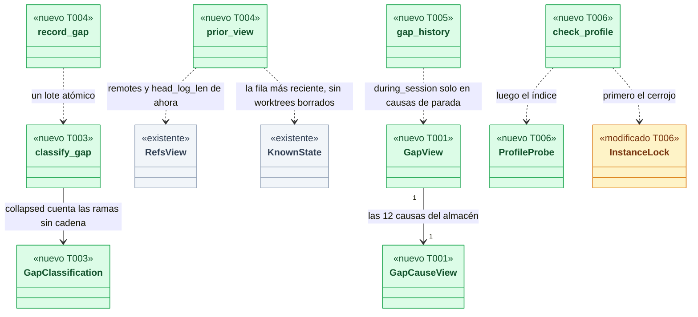
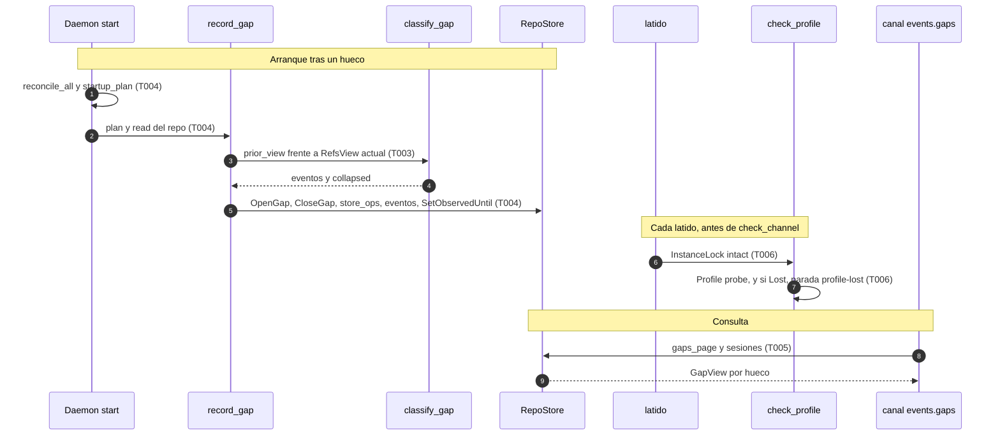
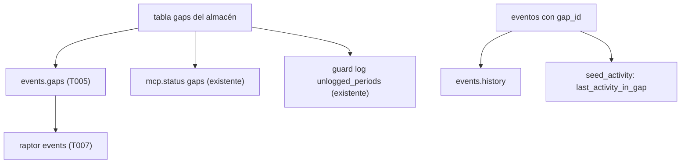
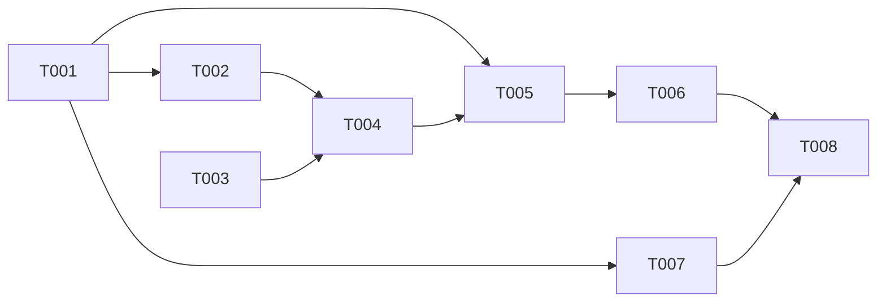

# DS-US-GRP-005 · Huecos de observación: registro al arrancar, consulta y perfil perdido en marcha

## Contexto rápido

Al terminar, el desarrollador que reinicia el motor ve en `raptor events` los commits y ramas que aparecieron mientras el motor no corría, todos "sin atribuir", y el periodo sin observar como un hueco con su causa. Si borra el perfil con el motor en marcha, el siguiente cliente recibe un motor que funciona, sin acción manual, con la lista de repos vacía. Hoy no puede: el arranque calcula el hueco (`PendingGap`) pero no lo guarda, `persist_read` sobrescribe el último estado conocido sin compararlo (`observe.rs:210`, `store_ops`), ningún método del canal devuelve los huecos y nada vigila el perfil.

Para eso: una clasificación del reflog para huecos que solo enumera cuando la cadena es continua (T003); el hueco y su reconciliación en una transacción antes de observar (T004); el método `events.gaps` (T001, T005); el cerrojo y el perfil comprobados en el latido, con parada ordenada si el perfil se perdió (T006); la presentación en `raptor events` (T007). Las decisiones están validadas (§ Decisiones) y las enmiendas de ADR-GRP-013, ADR-GRP-006 y ADR-GRP-005 ya están escritas (2026-10-09, US-GRP-005).

| Término | Qué es aquí |
|---|---|
| Hueco | Intervalo sin observar con su causa (`GapCause`, ADR-GRP-013 § 1). Tabla `gaps` del almacén del repo |
| Último estado conocido | `KnownState` por worktree: `head`, `refs` (puntas locales `nombre oid`), huella de cambios, `updated_ms` |
| "Observado hasta" | `store_meta.observed_until`, que mueven el latido (60 s) y cada lote |
| Cadena continua | Entradas del reflog de una rama desde la punta guardada hasta la actual, con el `new` de cada una igual al `old` de la siguiente, dentro del tope de 64 |
| Perfil perdido | `data/index.sqlite` ya no es el archivo que el daemon abrió (no existe o es otro) |
| SEC-13 | No repudio: un hueco con una sesión de agente presente se muestra destacado |

⚠️ **ASSUMPTION**: no existe `architecture-constitution.md`; rigen `AGENTS.md` y los ADR de `must_read`, como en DS-TS-GRP-008.

**Lo que la reconciliación garantiza.** El estado actual (ramas, worktrees, cambios) y un evento por cada movimiento de rama registrado en el reflog, solo con la cadena continua; un fast-forward de N commits es un solo evento. Lo que se encuentra es el estado neto, no la historia completa. No recupera: un archivo editado y revertido, una rama creada y borrada, un commit descartado por `reset` o force-push sin rastro en el reflog, los commits de una rama creada en el hueco (solo su punta), los commits con `HEAD` separado, los `reset` que no mueven rama ni los `push`. Todo lo encontrado queda "sin atribuir".

---

## 📋 Índice

> **Para aprobar:** [Contexto rápido](#contexto-rápido) · [⚠️ Gaps](#gaps-y-violaciones-de-la-constitución) · [Decisiones](#decisiones) · [🔭 La forma](#la-forma) · [El trabajo de un vistazo](#el-trabajo-de-un-vistazo).
> **Para implementar:** [🚀 Plan](#plan-de-implementación), en orden. Las secciones `_(ref)_` se abren desde la tarea que las cita.

| Sección | Propósito |
|---------|-----------|
| [Contexto rápido](#contexto-rápido) | Qué se construye, por qué, y el glosario |
| [⚠️ Gaps y violaciones de la constitución](#gaps-y-violaciones-de-la-constitución) | Qué impide empezar |
| [Decisiones](#decisiones) | D1 a D14 y las respuestas del PO |
| [🔭 La forma](#la-forma) | Qué piezas quedan y cómo fluye |
| [🚀 Plan de implementación](#plan-de-implementación) | T001…T008, en orden |
| ↳ [El trabajo de un vistazo](#el-trabajo-de-un-vistazo) | Las tareas y los dos PR |
| [Estructura de ficheros](#estructura-de-ficheros) _(ref)_ | Tramos disjuntos |
| [Contratos compartidos](#contratos-compartidos) _(ref)_ | Tipos y firmas |
| [Contrato de API](#contrato-de-api) _(ref)_ | Método, errores, log y numéricos |
| [Modelo de datos](#modelo-de-datos) _(ref)_ | Sin migración |
| [Estrategia de pruebas y cobertura](#estrategia-de-pruebas-y-cobertura) _(ref)_ | Escenario → test → comando |
| [Gate de seguridad](#gate-de-seguridad) | Checklist pre-merge |
| [Fuera de alcance](#fuera-de-alcance) | Lo diferido, con su disparador |
| [Notas del autor](#notas-del-autor) _(ref)_ | Deducciones y pistas sin verificar |

---

## ⚠️ Gaps y violaciones de la constitución

_No gaps. Ready to implement._ Las decisiones están validadas por Arquitecto y PO (2026-10-09) y las tres enmiendas de ADR están aplicadas. Las pistas sin verificar están en [Notas del autor](#notas-del-autor) (N5): si una falla, el implementador se para con un BLOQUEO.

---

## Decisiones

Todas: **Decisión del orquestador (2026-10-09), validada por Arquitecto y PO**; los ajustes aplicados están en la columna derecha.

| # | Decisión | Ajuste de la validación |
|---|---|---|
| D1 | El hueco del arranque se escribe en `Daemon::start`, antes de `observe()` y del primer latido, en un lote: `OpenGap`, `CloseGap(ahora)`, `store_ops`, eventos, `SetObservedUntil(ahora)` | Con ajuste (Arquitecto): un repo ilegible (`read = None`) no escribe nada y sigue D8; su "observado hasta" no se mueve |
| D2 | La vista anterior sale del último estado conocido: ramas de `KnownState.refs`, `commit` de cada worktree de `KnownState.head`; `remotes` y `head_log_len` se copian de la vista actual (sin `push` ni `reset` inventados) | Con ajuste (Arquitecto): `refs` de la fila con el `updated_ms` más reciente; solo worktrees no marcados como borrados |
| D3 | `classify_gap`: una rama movida da un evento por entrada solo con la cadena continua; si no, un `branch-update` de la punta vieja a la nueva | Con ajuste (Arquitecto): la continuidad se comprueba en cada par consecutivo; `git reflog delete` y `--expire-unreachable` quitan entradas del medio |
| D4 | Los eventos del hueco llevan la hora del fin del hueco. Orden: alfabético entre ramas, el del reflog dentro de una | Con ajuste (Arquitecto): se desvía de la Enmienda (2026-10-07) de ADR-GRP-013, que da a los eventos de un despertar la hora del reflog; un reloj desviado podría sacarla del hueco. Riesgo para US-TMC-007: sus filtros por periodo tratan estos eventos como del intervalo del hueco |
| D5 | Un `reconciled` por worktree cuya huella cambió, o cuyo `HEAD` cambió sin evento clasificado en él (US-GRP-002 D10) | Aprobada tal cual |
| D6 | Los eventos del hueco no pasan por S3, registro ni pista: sin sesión, `evidence` ni `authorship` (BR-EDGE-005) | Aprobada tal cual |
| D7 | Inicio del hueco: "observado hasta"; si falta, el `updated_ms` más reciente; si falta, el `added_ms` del repo. Un almacén recuperado (`StoreOpen::Recovered`) abre un hueco `store-corrupt` desde `added_ms`, sin eventos | Con ajuste (Arquitecto): ese lote lleva también los `store_ops`, para que la observación en vivo tenga base |
| D8 | Si el lote no se escribe, el repo queda `unavailable` esa ejecución: no se observa y su almacén sale de `stores` | Aprobada; cierra N4 de la versión anterior (el latido ya no mueve la marca de un repo no observado) |
| D9 | Método `events.gaps` en el módulo `events`, ni reservado ni MCP, sin capacidad (ADR-GRP-016 § 1; reutilizar `events.history` cambiaría su forma). `GapView` sin `requested_by` | Con ajuste (Arquitecto): `during_session` solo se calcula para `daemon-down`, `daemon-down-during-session` y `daemon-stopped`; en el resto, `false` |
| D10 | El perfil perdido se detecta en el latido comparando la identidad del índice (dev/ino; en Windows, volumen e índice de archivo) con la del arranque. `NotFound` u otra identidad = perdido; otro error de E/S = desconocido, sin acción | Aprobada tal cual |
| D11 | Antes del perfil se comprueba el cerrojo de instancia: si su archivo no es el tomado, se vuelve a tomar; si lo tiene otro proceso, el daemon se para sin escribir | Con ajuste (Arquitecto): las dos comprobaciones van antes de `check_channel`. Riesgo residual (NFR-01): `repo_lock` solo es de proceso (`repo_lock.rs:65`), así que durante un latido como mucho dos daemons pueden escribir con la Time Machine en el mismo repo |
| D12 | Perfil perdido con el cerrojo intacto: cuando no hay escrituras protegidas en curso ni en cola, el daemon se para ordenadamente con causa `profile-lost` y sale con 0. El siguiente cliente arranca uno nuevo por el camino bajo demanda (ADR-GRP-005 § 3): perfil nuevo, `instance_id` nuevo, `NoRepos`, SEC-06 incluido | Sustituye al reinicio en caliente (rechazado por el Arquitecto). Aceptable porque, perdido el perfil, no queda repo que observar. Con autoarranque, la salida 0 no se relanza (`KeepAlive.SuccessfulExit = false`, `Restart=on-failure`); el motor vuelve con el siguiente cliente |
| D13 | Una carpeta insegura al recrear el perfil (0755, otro dueño, enlace) la rechaza el arranque normal (SEC-06) | Absorbida por D12 |
| D14 | La pérdida del perfil no registra hueco: no queda almacén. Lo anterior a volver a añadir el repo no tiene eventos, así que no tiene agente. `ProfileLost` sigue declarada, sin emisor | Aprobada; el diferimiento está en la enmienda de ADR-GRP-013 |

**Respuestas del PO (2026-10-09):**

| # | Pregunta | Respuesta |
|---|---|---|
| P1 | Presentación del hueco en `raptor events` | Una línea a la hora de fin del hueco, antes de los eventos que encontró. en `-- observation gap (engine stopped), 12:00 → 13:00 · unattributed`; es `-- hueco de observación (motor detenido), 12:00 → 13:00 · sin atribuir`. Abierto: `since 12:00 (still open)` / `desde las 12:00 (abierto)`. Con sesión: `· an agent session was active` / `· había una sesión de agente activa`. "sin atribuir" (BR-CONS-003), nunca "sin agente". JSON como propone T007, con `cause` en kebab-case sin traducir |
| P2 | Granularidad | Suficiente. El `branch-update` agrupado se lee "de X a Y", nunca como un commit. El escenario 1 usa una cadena continua |
| P3 | Aviso de perfil recreado | No en esta historia: log y lista vacía; la guía es de US-GRP-015 |
| P4 | "Observado desde" | Diferido a US-TMC-007 y US-GRP-015 |
| P5 | Qué es "borrar el perfil" | Caso de referencia: la raíz entera; `data/` es un subcaso. Los tests cubren los dos |
| P6 | Parada por comando con sesión activa | Sí, `during_session`. La causa se lee "motor detenido" y el texto nunca dice "caída"; quién lo paró está en `audit.list` |
| P7 | Microhuecos | Se listan todos con su causa, sin agrupar en el MVP; se revisa con Q49 si hacen ruido |

Todo texto de producto repite que lo encontrado es el estado neto, no la historia completa.

---

## 🔭 La forma

Queda un arranque que guarda el hueco y lo que encontró antes de observar, una consulta de huecos por repo y un latido que comprueba cerrojo y perfil antes de escribir.



🟩 nuevo · 🟨 modificado · ⬜ existente.

**Cómo fluye:**



Si el paso 5 falla, el repo no se observa (D8). El paso 7 es el único que para el daemon.

**Dónde acaba el dato:**



El hueco llega al almacén antes de servir, así que `mcp.status` y el log de Guardrails lo ven sin cambios; `guard_log` ya descarta el duplicado por `from_ms` (`daemon/guard.rs:520-530`).

---

## 🚀 Plan de implementación

> Orden topológico (`Depende:`). Rutas relativas a la raíz del repo. El Tramo B va en serie: T004, T005 y T006 editan `crates/core/src/daemon/mod.rs`.

### El trabajo de un vistazo

Dos PR (Arquitecto). **PR-A**: T001 a T005 y T007, con la parte de T008 que les toca. **PR-B**: T006 y el resto de T008.

| # | Tarea | Depende | Aterriza en |
|---|---|---|---|
| T001 | Declarar `events.gaps` y `GapView` en el contrato | — | `crates/api/src/methods/` |
| T002 | Escribir las pruebas de aceptación de US-GRP-005 en rojo | T001 | `crates/core/tests/` |
| T003 | Clasificar los eventos de un hueco solo con la cadena continua del reflog | — | `crates/core/src/watch/` |
| T004 | Registrar el hueco del arranque y su reconciliación antes de observar | T002, T003 | `crates/core/src/daemon/` |
| T005 | Servir `events.gaps` | T001, T004 | `crates/core/src/` |
| T006 | Comprobar el cerrojo y el perfil en el latido y parar si el perfil se perdió | T005 | `crates/core/src/` |
| T007 | Mostrar los huecos en `raptor events` | T001 | `apps/cli/` |
| T008 | Documentar contrato y pendientes, y correr el gate | T006, T007 | `docs/` |

### En qué orden

Dos frentes desde T001 y una cadena del motor que converge en T008.



### T001 — Declarar `events.gaps` y `GapView` en el contrato

**Objetivo.** El módulo `events` declara el método y sus tipos; sin lógica de daemon.

**Ubicación.** `crates/api/src/methods/events.rs` (**MODIFY**)

**Reglas**
- Declara `EVENTS_GAPS`, `MAX_GAPS_PAGE` y los tipos de § Tipos y datos compartidos en este archivo; añade `method(EVENTS_GAPS, false, false)` a `GROUP.methods`. Sin capacidad y sin tocar otro registro (ADR-GRP-016 § 1).
- `GapCauseView` lleva las 12 variantes en `kebab-case`, con el texto de `GapCause::as_str` (`crates/core/src/profile/store.rs:69`).
- Tests en `mod tests` del archivo: `a_gap_view_round_trips_and_omits_what_is_absent`, `gap_causes_read_as_the_store_text` y `events_gaps_is_neither_reserved_nor_mcp` (con `methods::spec`).

- **Depende:** —
- **Refs:** ADR-GRP-013 § 6 y Enmienda (2026-10-09, US-GRP-005); ADR-GRP-016 § 1
- **Aceptación:** `cargo test -p gitraptor-api --lib methods::events::tests`

### T002 — Escribir las pruebas de aceptación de US-GRP-005 en rojo

**Objetivo.** Los tres escenarios y los bordes quedan como tests que compilan y fallan hasta T004 a T006.

**Ubicación.**
- `crates/core/tests/us_grp_005.rs` (**CREATE**)
- `crates/core/tests/us_grp_005_profile_loss.rs` (**CREATE**)

**Reglas**
- Repos y perfiles temporales (`TempProfile`, `init_repo`, `common_dir`, `files_under` de `tests/common`); el daemon en un hilo con el patrón `Running` de `crates/core/tests/channel_capabilities.rs:28-100`. Nunca este repo ni el perfil real.
- Sin esperas fijas: se espera al `join` del hilo del daemon, al EOF de la conexión o a una línea de `daemon.log`, con un tope de 10 s.
- `us_grp_005.rs` (latido de 3600 s):
  1. `the_commits_of_a_gap_are_reconciled_unattributed`: "demo" con el worktree `feat-login` y una sesión registrada de Claude Code escrita en el almacén (como `daemon_lifecycle.rs:200-230`). Se suelta el daemon sin `stop`, se hacen 2 commits en `feat-login` (cadena continua) y `git branch hotfix`, y arranca otro. `events.history`: 2 `commit` con `new_commit` c1 y c2 en orden, actor `unattributed` y el mismo `gap_id`; un `branch-create` de `hotfix` con ese `gap_id`. `events.gaps`: ese hueco, `daemon-down-during-session`, `during_session = true`. `scope.snapshot` con `scope.activity`: `feat-login` en c2 con `last_activity_in_gap = true`.
  2. `the_gap_is_listed_in_the_repo_history`: parada con `StopCause::StopCommand`, nada cambia, rearranque. Un hueco `daemon-stopped` con `started_utc_ms <= ended_utc_ms`, sin eventos con su `gap_id`.
  3. `a_stop_command_during_a_session_marks_the_gap`: el 2 con la sesión registrada; `during_session = true`.
  4. `a_reflog_that_does_not_reach_the_old_tip_collapses_into_one_branch_update`: 2 commits y `git reflog expire --expire=now --all`; un `branch-update` de la punta vieja a la nueva y ningún `commit`.
  5. `a_corrupt_store_records_a_store_corrupt_gap_from_the_add_date`: el almacén sobrescrito con basura; un hueco `store-corrupt` desde el `added_ms` del repo, ningún evento, y el `last_known_state` del worktree principal escrito.
  6. `an_unreadable_repo_is_not_observed_and_keeps_its_mark`: la carpeta del repo renombrada antes del rearranque; el repo sale `unavailable`, no hay hueco nuevo y `observed_until` no cambia tras dos latidos (con un latido de 50 ms y la línea `daemon.log` del segundo latido como señal).
  7. `the_gap_reconciliation_writes_nothing_in_the_repo`: el rearranque del test 1 dentro de `gitraptor_testkit::check(…, &Exceptions::none(), …).assert_intact()`.
  8. `events_gaps_rejects_an_invalid_or_unknown_repo`: `-32602` con un id no hexadecimal; el rechazo de `repo_command_error` con un id válido sin repo.
- `us_grp_005_profile_loss.rs` (latido de 50 ms):
  9. `deleting_the_whole_profile_stops_the_engine_and_the_next_start_works` (`#[cfg(unix)]`, caso de referencia de P5): `remove_dir_all` de la raíz; el hilo termina con `StopCause::ProfileLost`; un `Daemon::start` nuevo arranca en `NoRepos` con otro `instance_id` y `data/` en 0700.
  10. `deleting_the_profile_data_stops_the_engine_and_the_next_start_works`: lo mismo borrando solo `data/` (en todos los SO; en Windows el borrado puede fallar, ver § 9.5, y el test lo da por omitido si `remove_dir_all` falla).
  11. `a_repo_added_again_after_the_loss_has_no_agent_before_it`: tras el 10, `repo.add` de "demo" por el canal (como `crates/core/tests/channel.rs`): el snapshot muestra su `HEAD` actual, `events.history` no tiene `commit` y `sessions.list` está vacía.
  12. `another_instance_holding_the_lock_stops_this_daemon_without_writing`: se borra `state/daemon.lock` y el test toma `InstanceLock::acquire(&dirs.state)`; el hilo termina con `StopCause::InstanceLost` y los archivos de `data/` (`files_under`, contenido y tamaño) no cambian.
  13. `an_insecure_recreated_folder_is_refused_by_the_next_start` (`#[cfg(unix)]`): `data/` a 0755 y se borra `data/index.sqlite`; el hilo termina con `StopCause::ProfileLost` y el siguiente `Daemon::start` falla con `ProfileError::InsecureDir`.

- **Depende:** T001
- **Refs:** US-GRP-005, los tres escenarios; ADR-GRP-013, Validación 9 y 13; ADR-GRP-006, Validación 5
- **Aceptación:** `cargo test -p gitraptor-core --test us_grp_005 --no-run` y `cargo test -p gitraptor-core --test us_grp_005_profile_loss --no-run` compilan; ejecutados, fallan

### T003 — Clasificar los eventos de un hueco solo con la cadena continua del reflog

**Objetivo.** `classify_gap` da los eventos entre dos vistas con la regla D3; `classify` (en vivo) no cambia.

**Ubicación.**
- `crates/core/src/watch/repo.rs` (**MODIFY**)
- `crates/core/src/watch/mod.rs` (**MODIFY**): `pub use repo::{EventPlace, GapClassification, RefsView, classify, classify_gap};`
- `crates/core/tests/gap_classify.rs` (**CREATE**)

**Reglas**
- Mueve el cuerpo de `classify` (`watch/repo.rs:300`) a una función privada con un modo `Live` o `Strict`; `classify` usa `Live` y `classify_gap`, `Strict`.
- ⛔3.1 Con `Strict`, una rama movida da un evento por entrada solo si, tras recortar a la punta actual, la más antigua tiene `old == punta guardada`, la más nueva `new == punta actual` y cada par consecutivo enlaza (`new` de una = `old` de la siguiente). Si no, un `branch-update` y `collapsed += 1`. `reflog_since` devuelve las 64 más nuevas si no encuentra la punta (`crates/git/src/reader.rs:243`), y `git reflog delete` deja huecos en medio.
- Tests en `gap_classify.rs`, con la vista anterior leída con `RefsView::read` antes de cambiar un repo temporal: `a_continuous_chain_gives_one_event_per_reflog_entry`, `a_chain_that_does_not_reach_the_old_tip_collapses`, `a_chain_with_a_missing_middle_entry_collapses` (`git reflog delete refs/heads/feat-login@{1}`), `more_than_64_entries_collapse` (70 commits), `a_branch_created_in_the_gap_is_one_branch_create_with_its_tip`, `a_deleted_branch_is_one_branch_delete`.

- **Depende:** —
- **Refs:** ADR-GRP-013, Enmienda (2026-10-09, US-GRP-005); ADR-GRP-010 § 6; US-GRP-002 Dev Spec D5 y D6
- **Aceptación:** `cargo test -p gitraptor-core --test gap_classify` y `cargo test -p gitraptor-core --test watch` en verde sin editar tests existentes
- **Guard ⛔3.1:** `cargo test -p gitraptor-core --test gap_classify a_chain_with_a_missing_middle_entry_collapses -- --exact`

### T004 — Registrar el hueco del arranque y su reconciliación antes de observar

**Objetivo.** Un repo con hueco pendiente o almacén recuperado guarda hueco, eventos y estado nuevo en un lote antes de observarse; uno ilegible o cuyo lote falla no se observa.

**Ubicación.**
- `crates/core/src/daemon/gaps.rs` (**CREATE**)
- `crates/core/src/daemon/mod.rs` (**MODIFY**): `mod gaps;` y la llamada en `start`
- `crates/core/src/daemon/guard.rs` (**MODIFY**): solo el comentario de `guard.rs:515`

**Pasos**
1. Escribe en `gaps.rs` `startup_plan`, `prior_view`, `cause_view` y `record_gap` con las firmas de § Firmas del stack y las reglas D2, D5, D6 y D7.
   1.1 ⛔4.1 El orden del lote es `OpenGap`, `CloseGap`, `read.store_ops(...)`, los `AppendEvent`, `SetObservedUntil`. Un evento cuyo worktree aún no está en el almacén rompe la clave foránea.
   1.2 Cada `AppendEvent` lleva `session_id`, `evidence` y `authorship` en `None` y `gap_id: Some(id)`, con `id = format!("{}-{}", cause.as_str(), run_id())`, como `daemon/repos.rs:417`.
2. En `Daemon::start` (`daemon/mod.rs:540-546`), cuando `startup_plan` da `Some`, llama a `record_gap` en lugar de `persist_read`, antes de calcular el `state` del repo.
   2.1 ⛔4.2 Con `read` en `None`, o si `record_gap` devuelve `false`: añade el repo a `report.unavailable`, quita su almacén de `stores` y su lectura de `reads`, y no lo observes (D1, D8). Así el latido no mueve su "observado hasta", y `persist_read` no borra la base del siguiente intento.
3. Cambia el comentario de `guard.rs:515`: el hueco de este arranque ya está en el almacén al servir; el bloque solo cubre el intervalo y descarta el duplicado. La lógica no cambia.
4. Escribe el log `startup_gap` o `startup_gap_failed` (§ Contrato de API).
5. Tests en `mod tests` de `gaps.rs`: `the_prior_view_takes_refs_from_the_latest_known_state_and_remotes_from_now`, `gone_worktrees_are_not_in_the_prior_view`, `without_known_state_there_is_no_prior_view`, `a_recovered_store_plans_a_store_corrupt_gap_from_the_add_date`, `the_gap_starts_at_observed_until_then_known_state_then_add_date`, `a_reconciled_event_only_where_no_git_event_explains_the_change`, `every_gap_cause_has_a_view`, `a_failed_gap_write_leaves_the_repo_unobserved` (almacén de solo lectura).

- **Depende:** T002, T003
- **Refs:** ADR-GRP-013 § 5 y Enmienda (2026-10-09, US-GRP-005); TS-GRP-003 Dev Spec, "Clasificación de la ejecución anterior"
- **Aceptación:** `cargo test -p gitraptor-core --lib daemon::gaps::tests` y los tests 1, 4, 5, 6 y 7 de `us_grp_005`; `--test daemon_lifecycle` y `--test channel_capabilities` sin regresión
- **Guard ⛔4.1:** `cargo test -p gitraptor-core --test us_grp_005 the_commits_of_a_gap_are_reconciled_unattributed -- --exact`
- **Guard ⛔4.2:** `cargo test -p gitraptor-core --test us_grp_005 an_unreadable_repo_is_not_observed_and_keeps_its_mark -- --exact`

### T005 — Servir `events.gaps`

**Objetivo.** El canal devuelve los huecos de un repo con su causa y `during_session`.

**Ubicación.**
- `crates/core/src/profile/store.rs` (**MODIFY**): `gaps_page` y su test
- `crates/core/src/daemon/gaps.rs` (**MODIFY**): `during_session`, `gap_view`, `Daemon::gap_history`
- `crates/core/src/daemon/shutdown.rs` (**MODIFY**): `Control::GapHistory` y `ShutdownHandle::gap_history`
- `crates/core/src/daemon/mod.rs` (**MODIFY**): un brazo junto al de `Control::EventHistory`
- `crates/core/src/channel/conn.rs` (**MODIFY**): brazo `EVENTS_GAPS` junto a `EVENTS_HISTORY` y `fn events_gaps`

**Reglas**
- `gaps_page`: SQL parametrizado; con `since_ms`, `WHERE ended_ms IS NULL OR ended_ms >= ?1 ORDER BY started_ms, gap_id LIMIT ?2`; sin él, los `limit` más recientes en orden ascendente.
- `conn.rs` valida con `valid_repo_id`, limita con `limit.unwrap_or(MAX_GAPS_PAGE).clamp(1, MAX_GAPS_PAGE)` y mapea errores con `repo_command_error`, como `events_history` (`conn.rs:2071`). El brazo del bucle llama a `wake_for_request` antes de responder.
- `during_session` (D9): `false` fuera de `daemon-down`, `daemon-down-during-session` y `daemon-stopped`; verdadero con `daemon-down-during-session`, o si una sesión empezó antes del inicio del hueco y su fin (o, sin fin, la hora de su último evento `session-*`) no es anterior a ese inicio. Tests: `during_session_covers_a_session_present_at_the_gap_start`, `a_session_ended_in_an_earlier_gap_does_not_mark_a_later_one`, `an_observer_gap_is_never_during_session`.
- `cause_view` es un `match` sin brazo `_`.

- **Depende:** T001, T004
- **Refs:** ADR-GRP-013 § 5 (SEC-13), § 6 y Enmienda (2026-10-09, US-GRP-005); `docs/architecture/extender-sin-archivos-compartidos.md` § Añadir un método
- **Aceptación:** tests 1, 2, 3 y 8 de `us_grp_005`; `cargo test -p gitraptor-core --lib profile::store` y `daemon::gaps::tests`

### T006 — Comprobar el cerrojo y el perfil en el latido y parar si el perfil se perdió

**Objetivo.** El latido aplica D10 a D12 antes de `check_channel`; un perfil perdido para el daemon con `profile-lost` y salida 0.

**Ubicación.**
- `crates/core/src/daemon/profile_loss.rs` (**CREATE**)
- `crates/core/src/daemon/mod.rs` (**MODIFY**): `mod profile_loss;`, la llamada en el latido y que `stop` no escriba con `InstanceLost`
- `crates/core/src/daemon/shutdown.rs` (**MODIFY**): `StopCause::ProfileLost` y `StopCause::InstanceLost`
- `crates/core/src/daemon/lock.rs` (**MODIFY**): `InstanceLock::intact`
- `crates/core/src/profile/mod.rs` (**MODIFY**): identidad del índice al abrir y `Profile::probe`
- `crates/core/src/profile/fsperm.rs` (**MODIFY**): `file_identity` y `handle_identity`

**Pasos**
1. Escribe `file_identity(path)` (sin seguir enlaces: `symlink_metadata` en Unix, `winsys::file_id::of_path` en Windows) y `handle_identity(&File)` (`metadata` del descriptor; `winsys::file_id::of_file`).
2. Captura la identidad del índice en `Profile::open` y escribe `Profile::probe`.
3. Escribe `InstanceLock::intact`: compara `handle_identity(&self.file)` con `file_identity(&self.path)`; `NotFound` da `Ok(false)`.
4. Añade `StopCause::ProfileLost` (`as_str` `profile-lost`) y `StopCause::InstanceLost` (`instance-lost`); los dos dan `StopCauseCode::Signal` en `code()`, así que el cable de `daemon.stopping` no cambia.
5. Escribe `check_profile` en `profile_loss.rs`.
   5.1 ⛔6.1 Primero el cerrojo (D11): si no está intacto, crea las carpetas privadas hasta `state/` como `Daemon::start` y vuelve a tomarlo; con `AlreadyRunning` u otro error, `Stop(InstanceLost)`. Con `InstanceLost`, `stop` no escribe en almacenes ni en el perfil: ese perfil puede ser ya de otra instancia.
   5.2 Después el perfil (D10): `Intact` sigue; `Unknown` escribe `profile_probe_failed` y sigue; `Lost` sigue al paso 5.3.
   5.3 ⛔6.2 Con escrituras protegidas en curso o en cola (Time Machine o ejecutor), escribe `profile_reset_deferred` y sigue; el siguiente latido vuelve a mirar. Si no hay, `Stop(ProfileLost)`.
6. En el latido de `Daemon::run` (`daemon/mod.rs:829-835`), antes de `persist_observed_until` y de `check_channel`: `if let ProfileCheck::Stop(cause) = self.check_profile() { return self.stop(cause); }`.
7. Test en `mod tests` de `profile_loss.rs`: `pending_protected_writes_defer_the_stop`.

> **Nota técnica.** En Unix, borrar `data/` desvincula los archivos que SQLite tiene abiertos: las escrituras siguen sin error y se pierden. Por eso se comparan identidades. `raptor daemon` sale con 0 cuando `run` termina, y el gestor de servicios no relanza una salida 0 (`autostart.rs:67`).

- **Depende:** T005
- **Refs:** ADR-GRP-006 § 4 y Enmienda (2026-10-09, US-GRP-005); ADR-GRP-005 § 2, § 3 y Enmienda (2026-10-09, US-GRP-005)
- **Aceptación:** tests 9 a 13 de `us_grp_005_profile_loss`; `cargo test -p gitraptor-core --lib daemon::profile_loss::tests`; `--test daemon_lifecycle` sin regresión
- **Guard ⛔6.1:** `cargo test -p gitraptor-core --test us_grp_005_profile_loss another_instance_holding_the_lock_stops_this_daemon_without_writing -- --exact`
- **Guard ⛔6.2:** `cargo test -p gitraptor-core --lib daemon::profile_loss::tests::pending_protected_writes_defer_the_stop -- --exact`

### T007 — Mostrar los huecos en `raptor events`

**Objetivo.** `raptor events` intercala los huecos de cada repo con sus eventos, en texto y JSON, con los textos de P1.

**Ubicación.**
- `apps/cli/src/commands/events.rs` (**MODIFY**)
- `apps/cli/src/events.rs` (**MODIFY**)
- `apps/cli/i18n/en/events.txt` (**MODIFY**)
- `apps/cli/i18n/es/events.txt` (**MODIFY**)

**Reglas**
- Si el daemon ofrece `events.gaps` (`offers`), pide por repo con `since_utc_ms` = hora del evento más antiguo mostrado de ese repo; sin eventos mostrados, sin `since`; con `--all`, `Some(0)`. Si no lo ofrece, la clave `events.gaps-restart-engine` una vez por stderr.
- Una línea por hueco a su hora de fin (de inicio si sigue abierto), antes de los eventos de la misma hora, con los textos de P1: `events.gap_line`, `events.gap_open`, `events.gap_during_session`. Las causas `daemon-down`, `daemon-down-during-session` y `daemon-stopped` se leen "engine stopped" / "motor detenido" (P6); cada causa tiene su clave `gap.cause.<causa>` en en/es, en el mismo estilo, sin la palabra "caída".
- JSON: un elemento `{"kind":"gap","repo_id","gap_id","cause","started_utc_ms","ended_utc_ms","during_session","actor":"unattributed"}` en el mismo orden, con `cause` en kebab-case sin traducir.
- Tests en `mod tests` de `events.rs`: `a_gap_reads_as_an_unattributed_observation_gap_in_en_and_es`, `an_open_gap_reads_still_open`, `a_gap_sorts_before_the_events_it_found`, `a_gap_during_a_session_says_so`, `a_gap_in_json_is_an_unattributed_gap_entry`.

- **Depende:** T001
- **Refs:** US-GRP-005, escenario 2; US-GRP-002 Dev Spec D14; BR-CONS-003
- **Aceptación:** `cargo test -p gitraptor-cli --bin raptor events::tests`

### T008 — Documentar contrato y pendientes, y correr el gate

**Objetivo.** El contrato IPC, la historia y los pendientes multiplataforma reflejan lo construido; las enmiendas de ADR ya están escritas.

**Ubicación.**
- `docs/architecture/design/api-contract-ipc.md` (**MODIFY**)
- `docs/architecture/xplat-pendientes.md` (**MODIFY**)
- `docs/requirements/features/motor-local/user-stories/US-GRP-005-hueco-sin-atribuir.md` (**MODIFY**)
- `docs/requirements/features/motor-local/user-stories.md` (**MODIFY**)
- `docs/requirements/features/motor-local/dev-specs/US-GRP-005-dev-spec.md` (**MODIFY**): `status`

**Reglas**
- PR-A: fila de `events.gaps` en § Métodos de `api-contract-ipc.md`, forma de `GapView`, y en § Pendiente que `gap.recorded` y `attention.gaps` siguen sin emisor.
- PR-B: la siguiente fila libre de `xplat-pendientes.md` (hoy XP-43) con lo de § 9.5; la historia y el índice pasan a implementada con los dos PR. Si algo falla o no se pudo verificar, dilo en el PR (AGENTS.md).

- **Depende:** T006, T007
- **Refs:** AGENTS.md § Reglas de calidad; ADR-GRP-016
- **Aceptación:** `cargo fmt --all --check`, `cargo clippy --workspace --all-targets -- -D warnings`, `cargo test -p gitraptor-api --lib`, `cargo test -p gitraptor-core`, `cargo test -p gitraptor-cli --bin raptor` y `cargo test -p gitraptor-git --test repo_intact_exec` en verde

---

> Las secciones siguientes son de referencia. Se abren desde la tarea que las cita, no se leen en orden.

## Estructura de ficheros

A primero; después B, C y D en paralelo; E cierra. B va en serie (T003 → T004 → T005 → T006).

```text
crates/api/src/methods/events.rs                ← MODIFY  Tramo A (T001)
crates/core/
├── src/watch/repo.rs                           ← MODIFY  Tramo B (T003)
├── src/watch/mod.rs                            ← MODIFY  Tramo B (T003)
├── tests/gap_classify.rs                       ← CREATE  Tramo B (T003)
├── src/daemon/gaps.rs                          ← CREATE  Tramo B (T004, T005)
├── src/daemon/guard.rs                         ← MODIFY  Tramo B (T004, comentario)
├── src/daemon/mod.rs                           ← MODIFY  Tramo B (T004, T005, T006)
├── src/daemon/shutdown.rs                      ← MODIFY  Tramo B (T005, T006)
├── src/profile/store.rs                        ← MODIFY  Tramo B (T005)
├── src/channel/conn.rs                         ← MODIFY  Tramo B (T005)
├── src/daemon/profile_loss.rs                  ← CREATE  Tramo B (T006)
├── src/daemon/lock.rs                          ← MODIFY  Tramo B (T006)
├── src/profile/mod.rs                          ← MODIFY  Tramo B (T006)
├── src/profile/fsperm.rs                       ← MODIFY  Tramo B (T006)
├── tests/us_grp_005.rs                         ← CREATE  Tramo D (T002)
└── tests/us_grp_005_profile_loss.rs            ← CREATE  Tramo D (T002)
apps/cli/
├── src/commands/events.rs                      ← MODIFY  Tramo C (T007)
├── src/events.rs                               ← MODIFY  Tramo C (T007)
└── i18n/{en,es}/events.txt                     ← MODIFY  Tramo C (T007)
docs/ (los cinco de T008)                       ← MODIFY  Tramo E (T008)
```

`← CREATE`: fichero nuevo. `← MODIFY`: fichero existente.

---

## Contratos compartidos

### Tipos y datos compartidos

```rust
// crates/api/src/methods/events.rs
/// Reads the observation gaps of one repo (ADR-GRP-013 § 6).
pub const EVENTS_GAPS: &str = "events.gaps";
/// Most gaps one `events.gaps` page returns.
pub const MAX_GAPS_PAGE: u32 = 200;

#[derive(Debug, Clone, Default, PartialEq, Eq, Serialize, Deserialize, JsonSchema)]
#[serde(deny_unknown_fields)]
pub struct EventsGapsParams {
    pub repo_id: String,
    /// Only gaps still open or ended at or after this time. Without it, the latest `limit`.
    #[serde(default)]
    pub since_utc_ms: Option<i64>,
    #[serde(default)]
    pub limit: Option<u32>,
}

#[derive(Debug, Clone, PartialEq, Eq, Serialize, Deserialize, JsonSchema)]
#[serde(deny_unknown_fields)]
pub struct EventsGapsResult {
    /// Oldest first, by start.
    pub gaps: Vec<GapView>,
}

/// A period the engine did not observe. What it found there is unattributed.
#[derive(Debug, Clone, PartialEq, Eq, Serialize, Deserialize, JsonSchema)]
#[serde(deny_unknown_fields)]
pub struct GapView {
    pub gap_id: String,
    pub started_utc_ms: i64,
    /// Absent: still open.
    #[serde(default, skip_serializing_if = "Option::is_none")]
    pub ended_utc_ms: Option<i64>,
    pub cause: GapCauseView,
    /// The engine stopped while an agent session was present (SEC-13).
    #[serde(default, skip_serializing_if = "std::ops::Not::not")]
    pub during_session: bool,
}

#[derive(Debug, Clone, Copy, PartialEq, Eq, Serialize, Deserialize, JsonSchema)]
#[serde(rename_all = "kebab-case")]
pub enum GapCauseView {
    MachineOff, DaemonDown, DaemonDownDuringSession, DaemonStopped, RepoRetired,
    GitUnavailable, ProfileLost, StoreCorrupt, WatcherOverflow, StreamRecreated,
    PeriodicReconciliation, Dormant,
}

// crates/core/src/watch/repo.rs
#[derive(Debug, Clone, Default, PartialEq, Eq)]
pub struct GapClassification {
    pub events: Vec<RawEvent>,
    /// Moved branches without a continuous reflog chain: one `branch-update` each.
    pub collapsed: u32,
}

// crates/core/src/daemon/gaps.rs
#[derive(Debug, Clone, PartialEq, Eq)]
pub(super) struct GapPlan {
    pub cause: GapCause,
    pub started_ms: i64,
    pub requested_by: Option<String>,
}

// crates/core/src/profile/mod.rs
#[derive(Debug, Clone, Copy, PartialEq, Eq)]
pub enum ProfileProbe { Intact, Lost, Unknown }

// crates/core/src/daemon/profile_loss.rs
pub(super) enum ProfileCheck { Continue, Stop(StopCause) }

// crates/core/src/daemon/shutdown.rs, new variants of StopCause
ProfileLost,   // "profile-lost", code() = StopCauseCode::Signal
InstanceLost,  // "instance-lost", code() = StopCauseCode::Signal; stop() writes nothing
```

### Ciclos de vida (DI)

_No ambient state — DI lifetimes follow stack defaults._ `Daemon.lock` es uno por daemon y T006 lo sustituye si vuelve a tomar el cerrojo; `GapPlan` y `GapClassification` son valores de una llamada.

### Firmas del stack

```rust
// crates/core/src/watch/repo.rs
pub fn classify_gap(common: &Path, before: &RefsView, now_view: &RefsView, now: (i64, i32)) -> GapClassification;

// crates/core/src/daemon/gaps.rs
pub(super) fn startup_plan(store: &RepoStore, pending: Option<&PendingGap>, status: &StoreOpen, added_ms: i64) -> Option<GapPlan>;
pub(super) fn prior_view(known: &[(PathBuf, KnownState)], current: &RefsView) -> Option<RefsView>;
/// `false` when the batch could not be written: the caller leaves the repo unobserved.
pub(super) fn record_gap(store: &mut RepoStore, read: &RepoRead, plan: &GapPlan, logger: &Logger, repo_id: &str) -> bool;
pub(super) fn cause_view(cause: GapCause) -> GapCauseView;
pub(super) fn during_session(gap: &Gap, sessions: &[SessionWithState]) -> bool;
pub(super) fn gap_view(gap: &Gap, sessions: &[SessionWithState]) -> GapView;
impl Daemon {
    pub(super) fn gap_history(&self, params: &EventsGapsParams) -> Result<Vec<GapView>, RepoCommandError>;
}

// crates/core/src/profile/store.rs
pub fn gaps_page(&self, since_ms: Option<i64>, limit: u32) -> Result<Vec<Gap>>;

// crates/core/src/profile/fsperm.rs
pub(crate) fn file_identity(path: &Path) -> std::io::Result<(u64, u64)>;
pub(crate) fn handle_identity(file: &std::fs::File) -> std::io::Result<(u64, u64)>;

// crates/core/src/profile/mod.rs
impl Profile { pub fn probe(&self) -> ProfileProbe; }

// crates/core/src/daemon/lock.rs
impl InstanceLock { pub fn intact(&self) -> std::io::Result<bool>; }

// crates/core/src/daemon/profile_loss.rs
impl Daemon { pub(super) fn check_profile(&mut self) -> ProfileCheck; }

// crates/core/src/daemon/shutdown.rs
Control::GapHistory { params: EventsGapsParams, reply: SyncSender<Result<Vec<GapView>, RepoCommandError>> }
pub(crate) fn gap_history(&self, params: EventsGapsParams) -> Result<Vec<GapView>, RepoCommandError>;
```

---

## Contrato de API

| Superficie | Cambio | Quién lo recibe |
|---|---|---|
| `events.gaps` (JSON-RPC) | Método nuevo, ni reservado ni MCP, sin capacidad | Protocolo 9; se descubre en `hello.methods` |
| `events.history` | Sin cambio de forma; tras un arranque aparecen eventos con `gap_id` | Todas |
| `daemon.stopping` | `cause: signal` también para `profile-lost` e `instance-lost` | Todas |
| `raptor events` | Líneas de hueco (P1) | Persona o script |

```json
{"jsonrpc":"2.0","id":3,"method":"events.gaps","params":{"repo_id":"0f3a…","since_utc_ms":1791148000000}}
{"jsonrpc":"2.0","id":3,"result":{"gaps":[{"gap_id":"daemon-down-during-session-7c1e…","started_utc_ms":1791148000000,"ended_utc_ms":1791151600000,"cause":"daemon-down-during-session","during_session":true}]}}
```

Líneas del log (SEC-04: solo `Field::id`, enteros y textos fijos):

```text
<ms> info  startup_gap repo=<id> cause=daemon-down events=3 collapsed=0
<ms> error startup_gap_failed repo=<id> kind=<kind>
<ms> warn  instance_lock_restored
<ms> error instance_lost
<ms> warn  profile_probe_failed kind=io
<ms> info  profile_reset_deferred busy=N
<ms> warn  daemon_stopped cause=profile-lost recorded=…
```

### Forma del error y del cuerpo de respuesta

`events.gaps` usa los errores de `events.history`:

```json
{"jsonrpc":"2.0","id":3,"error":{"code":-32602,"message":"invalid repo_id"}}
{"jsonrpc":"2.0","id":3,"error":{"code":-32603,"message":"profile unavailable"}}
```

El repo desconocido sale de `repo_command_error` (`RepoCommandError::UnknownRepo` → `rejected(RepoRejection::UnknownRepo)`), sin forma nueva.

### Forma de la configuración

_No aplica — ninguna tarea lee configuración nueva._ El latido es el `DaemonConfig.heartbeat` existente.

### Valores numéricos

| Concepto | Valor | Fuente |
|---------|-------|--------|
| Latido (cerrojo y perfil) | 60 s | `DaemonConfig::for_current_user` (sin cambios) |
| Entradas de reflog por rama | 64 | `watch/repo.rs`, `MAX_REFLOG_ENTRIES` (sin cambios) |
| Huecos por página de `events.gaps` | 200 | Esta spec, `MAX_GAPS_PAGE` |
| Espera máxima de los tests | 10 s | Esta spec |

---

## Modelo de datos

_No hay migración._ Se escriben filas en tablas existentes del almacén del repo: `gaps` (su `CHECK` ya admite las 12 causas), `events` (con `gap_id`), `last_known_state`, `worktrees` y `store_meta.observed_until`. El perfil nuevo tras una pérdida lo crea el arranque normal (`Profile::open`).

---

## Estrategia de pruebas y cobertura

### 9.1 Pirámide de pruebas

| Tipo | Cantidad | Tareas dueñas | Herramientas | Cuándo |
|------|---------:|-------------|---------|------|
| Unit | 23 | T001, T004, T005, T006, T007 | `cargo test --lib` / `--bin raptor` | PR gate |
| Integration | 19 | T002, T003 | `cargo test -p gitraptor-core --test …` | PR gate |

### 9.2 Umbrales de cobertura

| Capa | Línea | Rama | Mutación | Camino crítico 100% |
|-------|-----:|-------:|---------:|:------------------:|
| `classify_gap` | — | — | — | ✅ cadena continua, sin la punta, cortada en medio, más de 64 |
| `check_profile` | — | — | — | ✅ intacto, perdido, aplazado, otra instancia |

### 9.3 Datos de prueba

- Builders / fixtures: `TempProfile`, `init_repo`, `common_dir`, `files_under` de `crates/core/tests/common`; `gitraptor_testkit::{Fixture, check, Exceptions}`.
- Multi-tenant data: no aplica (un perfil por test).
- PII / PHI: no aplica; el log se comprueba sin rutas.
- Time / clock: horas del almacén explícitas; esperas por señal con tope.

### 9.4 Comportamientos críticos verificados

- [ ] Ningún evento de un hueco del arranque tiene sesión, aunque hubiera un agente registrado (BR-EDGE-005).
- [ ] Una rama sin cadena continua da un solo `branch-update`, nunca una lista parcial.
- [ ] Un repo cuyo hueco no se escribió no se observa y su "observado hasta" no se mueve.
- [ ] La reconciliación no escribe en el repo observado (BR-CONS-001).
- [ ] Sin el cerrojo de instancia, el daemon se para sin escribir en el perfil.

### 9.5 Plataformas

| Plataforma | Cómo se verifica | Pendiente |
|---|---|---|
| macOS | Todos los tests en local | — |
| Linux | CI `ubuntu-latest` (mismo borrado con archivos abiertos) | Etapa de validación multiplataforma |
| Windows | CI y clippy `x86_64-pc-windows-msvc`; los tests 9 y 13 son `cfg(unix)` | ⚠️ **ASSUMPTION**: SQLite abre sin `FILE_SHARE_DELETE`, así que `data/` no se borra con el motor en marcha y la pérdida se trata en el siguiente arranque. Verificar en la máquina Windows (fila nueva en `xplat-pendientes.md`) |

---

## Gate de seguridad

- Perfil nuevo: lo crea el arranque normal, con 0700 y 0600, y una carpeta insegura lo rechaza (SEC-06).
- Única instancia: el cerrojo se comprueba antes del perfil; sin él, el daemon se para sin escribir (D11).
- Riesgo residual (NFR-01): `repo_lock` es de proceso, así que entre el borrado de `state/` y el siguiente latido (≤ 60 s) dos daemons pueden escribir con la Time Machine en el mismo repo.
- NFR-01: la parada por perfil perdido espera a que no haya escrituras protegidas en curso ni en cola.
- Los mensajes del reflog son texto no confiable (SEC-12): solo se comparan prefijos en `kind_of` y no van al log.
- La reconciliación solo lee, con `gix` (BR-CONS-001).
- T006 toca cerrojos y rutas del perfil: revisión de `security-expert`.

Corre `/security-review --scope devspec docs/requirements/features/motor-local/dev-specs/US-GRP-005-dev-spec.md` antes de mezclar.

---

## Fuera de alcance

| Ítem / no-objetivo | Historia que lo cubre | Gate (cómo se verifica) |
|----------------|--------------------|-------------------------|
| Evento `gap.recorded`: cuando un cliente en vivo se suscriba a huecos | US-TMC-007 o Cockpit | `grep -rn "gap.recorded" crates/core/src` vacío |
| `attention.gaps` y `repo.attention`: cuando el PO defina qué cuenta | Cockpit | `attention.gaps` sigue `not-published` |
| "Observado desde" (P4) | US-TMC-007, US-GRP-015 | `grep -rn "observed_since" crates/api/src` vacío |
| Aviso de perfil recreado (P3) | US-GRP-015 | Sin claves i18n nuevas fuera de `events.txt` |
| Causa `machine-off` por la hora de arranque del SO | Cuando se lea en los tres SO | `startup_plan` nunca devuelve `MachineOff` |
| Autoría declarada de los commits del hueco | US-GRD-019 si la política lo pide | `authorship: None` en `record_gap` |
| Hueco al volver a añadir un repo retirado | US-GRP-006 (reutiliza `record_gap`) | `repo_add` no cambia |
| Hueco de "Esperando Git" | US-GRP-014 (reutiliza `record_gap`) | `daemon/state.rs` no cambia |
| Enlazar al hueco los eventos clasificados de un lote en vivo con hueco | US-GRP-002 D10 | `repos.rs` solo enlaza `Reconciled` |

---

## Notas del autor

| ID | Nota | Acción | Owner |
|----|------|--------|-------|
| N1 | Verificado por el autor y el Arquitecto: `PendingGap` no se persiste (solo se lee en `guard.rs:520`), `persist_read` sobrescribe sin comparar (`observe.rs:210`) y `reflog_since` devuelve las 64 más nuevas si no encuentra la punta | Ninguna | — |
| N2 | Tras un despertar por red de seguridad, los eventos del reflog llegan en un lote sin hueco (`watch/mod.rs:1083-1144`) y pasan por S3 y el registro. Riesgo bajo: un repo con sesión presente no duerme | Revisar con TS-GRP-006 | Arquitecto |
| N3 | `RepoView` no lista ramas sin worktree: `hotfix` se comprueba por su `branch-create` | Ninguna | — |
| N4 | D4 da a los eventos del hueco la hora de su fin: los filtros por periodo de US-TMC-007 deben tratarlos como del intervalo del hueco | Avisar al arquitecto de US-TMC-007 | Orquestador |
| N5 | Pistas sin verificar: (a) la API que dice si hay escrituras protegidas en curso o en cola sin cambiar la visibilidad de `TmRepos::lock_key`; (b) que `winsys::file_id::of_path` no siga enlaces; (c) que `raptor-mcp` también arranque el daemon bajo demanda | Comprobarlas al empezar T006; si (a) o (b) fallan, BLOQUEO | Implementador |
| N6 | `StopCause::ProfileLost` e `InstanceLost` viajan como `signal` en `daemon.stopping`; una variante nueva de `StopCauseCode` sería un cambio de forma (ADR-GRP-016) | Ninguna | — |
