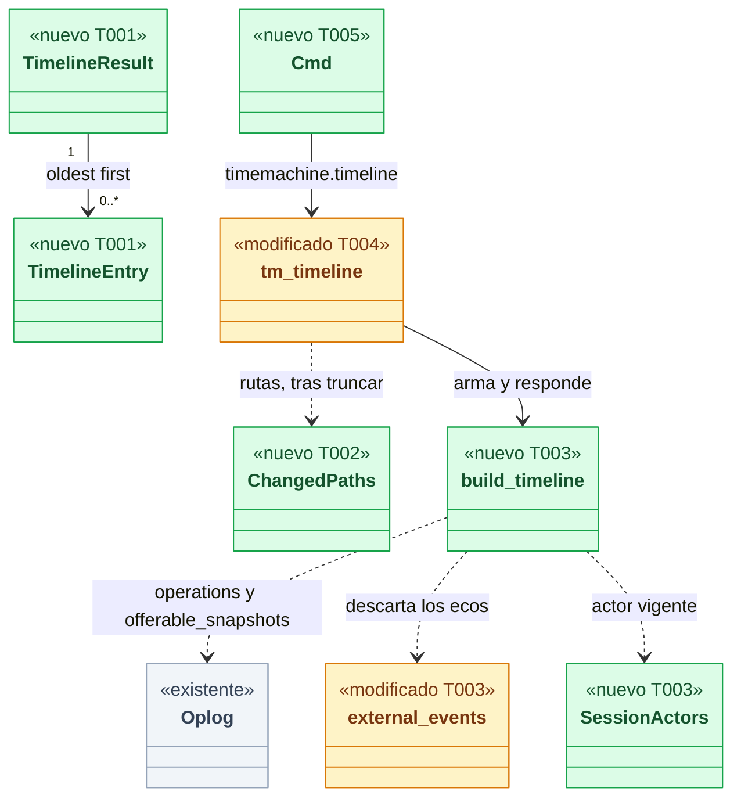
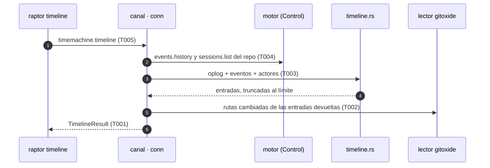
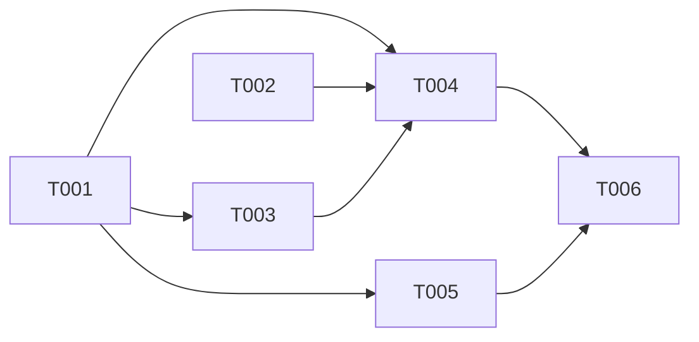

# DS-US-TMC-006 · Timeline del repo: qué cambió, cuándo y quién

## Contexto rápido

Al terminar, el desarrollador ejecuta `raptor timeline` y ve, por repo, cada operación de la Time Machine y cada evento de Git crudo con su momento, su worktree, sus archivos cambiados, su actor y su nivel de protección, sin que nada figure nunca como "humano". Hoy no puede: `timemachine.timeline` existe en el catálogo y responde "no implementado".

Para eso: el contrato del resultado (api), un lector de rutas cambiadas entre dos commits (git), el ensamblado del timeline sobre el oplog y los eventos del motor (core), la ruta del canal y el subcomando `raptor timeline` (cli). La TUI, los huecos de observación (US-TMC-007) y restaurar un punto (US-TMC-009) quedan fuera.

| Término | Qué es aquí |
|---|---|
| Entrada | Una fila del timeline: una operación del oplog (`protected`, `undo`, `redo`, `restore`) o un evento de Git crudo del motor |
| Eco | Evento que el motor observó como efecto de una operación de GitRaptor; no es entrada, la operación ya lo representa (DS-US-TMC-004 § 2.5) |
| Nivel | `guaranteed-prior`, `hook-prior`, `observation` o `none` (sin protección) |
| `sin agente` | Texto de `unattributed` para el usuario; el cable y `--json` dicen `unattributed` |

⚠️ **ASSUMPTION**: no existe `architecture-constitution.md` en la cascada; rigen `AGENTS.md` y los ADR listados (NFR-01, NFR-02, ADR-GRP-016). Formalizar con `/aadd-architect --init-constitution`.

---

## ⚠️ Gaps y violaciones de la constitución

_No gaps. Ready to implement._ Las decisiones abiertas las cerró el PO el 2026-10-08 (§ Decisiones).

---

## 🔭 La forma

El timeline es una **lectura** del daemon que cruza dos fuentes sin escribir nada: el oplog de la Time Machine (operaciones y snapshots) y el historial de eventos del motor. Reutiliza lo que ya existe y solo añade el ensamblado.



🟩 nuevo · 🟨 modificado · ⬜ existente. El eco se descarta con `external_events`, el mismo criterio que usa la pila de undo: una operación y su efecto no cuentan dos veces.

**Cómo fluye:**



---

## 🚀 Plan de implementación

> Orden topológico (`Depende:`). Las rutas son relativas a la raíz del repo. Cada tarea es una rebanada **disjunta**: nadie edita el archivo de otro. Las ediciones en archivos compartidos son las que se nombran, de una línea (ADR-GRP-016).

### El trabajo de un vistazo

Cinco frentes y un cierre: contrato (T001), lector de rutas (T002), ensamblado (T003), canal (T004), CLI (T005) y documentación (T006). T001 y T002 son paralelos; T003 y T005 solo esperan a lo que usan.

| # | Tarea | Depende | Aterriza en |
|---|---|---|---|
| T001 | Definir el contrato del timeline | — | `crates/api/src/` |
| T002 | Crear el lector de rutas cambiadas entre dos commits | — | `crates/git/src/` |
| T003 | Crear el ensamblado del timeline y la atribución vigente | T001 | `crates/core/src/timemachine/` |
| T004 | Servir `timemachine.timeline` en el canal | T001, T002, T003 | `crates/core/src/channel/`, `crates/core/tests/` |
| T005 | Crear el subcomando `raptor timeline` | T001 | `apps/cli/` |
| T006 | Actualizar la documentación y los pendientes multiplataforma | T004, T005 | `docs/` |

### En qué orden

Dos frentes paralelos (api, git) que convergen en el canal; la CLI solo necesita los tipos.



### T001 — Definir el contrato del timeline

**Objetivo.** Los tipos del resultado y el campo `only_worktree` de los parámetros; sin lógica.

**Ubicación.** `crates/api/src/timemachine.rs` (**MODIFY**)

**Reglas**
- El actor es `Actor` (dos variantes, sin "humano"); el resultado no tiene ningún campo para mensajes de commit ni contenido de archivos.
- Cada ruta y cada nombre viaja como `Untrusted` / `UntrustedName` (texto del repo).
- `TimelineParams` gana `only_worktree` (filtro por raíz de worktree); `worktree` sigue siendo el ancla que nombra el repo, como en `undo`. El método nunca respondió algo distinto de "no implementado": no hay cliente anterior, no se necesita capacidad nueva ni protocolo nuevo (ADR-GRP-016 § 1).
- `validate()` acepta `agent = "unattributed"` (ya cabe en `check_agent_id`); es palabra reservada.

- **Depende:** —
- **Refs:** ADR-GRP-013 § 6, ADR-GRP-016 § 1
- **Aceptación:** `timeline_schema_has_no_human_variant_and_no_message_field` y `timeline_wire_form` en `crates/api/src/timemachine.rs`

### T002 — Crear el lector de rutas cambiadas entre dos commits

**Objetivo.** `RepoReader::changed_paths(old, new, max, deadline)`: rutas distintas entre dos commits y el total real, sin cargar blobs ni leer contenidos.

**Ubicación.** `crates/git/src/changed_paths.rs` (**CREATE**) · `crates/git/src/lib.rs` (**MODIFY**, una línea `mod` y el `pub use`)

**Reglas**
- Solo compara árboles; ni mensajes ni blobs. `old` ausente compara contra el árbol vacío (primer commit); ids no hexadecimales: `InvalidInput`.
- Devuelve a lo sumo `max` rutas ordenadas y el total real; si vence el `deadline` o falta un objeto, `Err`: nunca un total parcial ni un 0 inventado.
- Sin detección de renombrados: un renombrado cuenta como dos rutas.

> **Nota técnica.** El árbol de features de `gix` del repo no lista `blob-diff`. ⚠️ **ASSUMPTION**: el diff de árboles de `gix` está disponible a través de `status`; si no, recorrer los dos árboles con `tree.decode()` como `committed_file_names` (solo ids de entrada, sin blobs). No añadir el feature `blob-diff` sin pedirlo.

- **Depende:** —
- **Refs:** ADR-GRP-009 (frontera de solo lectura)
- **Aceptación:** `changed_paths_between_two_commits`, `a_root_commit_is_compared_with_the_empty_tree`, `the_total_is_real_beyond_max`, `a_missing_object_is_an_error_not_zero`, `an_expired_deadline_is_an_error` en `crates/git/src/changed_paths.rs`

### T003 — Crear el ensamblado del timeline y la atribución vigente

**Objetivo.** Función pura que une operaciones y eventos en entradas ordenadas con actor y nivel, y la implementación de producción de `CurrentAttribution`.

**Ubicación.** `crates/core/src/timemachine/timeline.rs` (**CREATE**) · `crates/core/src/timemachine/mod.rs` (**MODIFY**, una línea `mod`) · `crates/core/src/timemachine/undo.rs` (**MODIFY**, solo `external_events` pasa a `pub(crate)`)

**Pasos**
1. Leer `Oplog::operations` (filtro por `from_ms` y worktree) y quedarse con los estados `applying`, `finished` e `interrupted`; descartar las filas con `tampered`.
2. Por cada evento recibido (todos los tipos salvo `reconciled`): calcular el eco con `external_events` y descartar los que tienen `caused_by`.
3. Nivel de una operación: el del snapshot previo si es punto ofrecible (`offerable_snapshots`); si no, `none`. Nivel de un evento: el último punto ofrecible del worktree, de la generación actual, con marca menor que la secuencia del evento; sin ninguno, `none`. No usa `store.verify`: la integridad se comprueba al deshacer o restaurar.
4. Actor: eventos y operaciones `protected` con la atribución vigente (`attribution: current`); `undo`, `redo` y `restore` con el solicitante registrado, tal como se grabó (`attribution: recorded`, D-TMC-18). Un solicitante sin sesión resoluble se muestra con su registro, nunca como "sin atribuir".
5. Orden `(occurred_utc_ms, fuente, secuencia)` ascendente, desempate estable; aplicar los filtros; conservar las últimas `limit`; `truncated` si alguna fuente llenó su página o sobraron entradas.

> **Nota técnica.** `RawGitEvent` no trae hora ni commits: los eventos para mostrar salen de `events.history` (ya trae actor vigente, hora y `old_commit`/`new_commit`), y `EngineLink::raw_events` solo alimenta el eco. La implementación de `CurrentAttribution` se construye desde `sessions.list` (con `include_ended`): TS-TMC-002 § 10 la dejó para esta historia.

- **Depende:** T001
- **Refs:** ADR-TMC-003 § 3 y § 4, ADR-GRP-013 § 2, DS-US-TMC-004 § 2.5
- **Aceptación:** los unitarios de `timeline.rs` de § Estrategia de pruebas
- **Guard ⛔4:** `an_undo_entry_shows_the_recorded_requester_not_the_current_actor` falla si el actor de un undo cambia con la atribución

### T004 — Servir `timemachine.timeline` en el canal

**Objetivo.** La ruta del canal: validar, resolver el repo, leer fuentes, ensamblar y rellenar rutas; no escribe nada.

**Ubicación.** `crates/core/src/channel/conn.rs` (**MODIFY**, el brazo `TM_TIMELINE` y una función `tm_timeline`) · `crates/core/tests/us_tmc_006.rs` (**CREATE**)

**Pasos**
1. Separar `TM_TIMELINE` de `TM_SNAPSHOT` en el `match`. `TM_SNAPSHOT` sigue como está.
2. Validar con `TimelineParams::validate`; ancla y repo como `tm_undo` (`named_worktree`, `tm_scope_for`); carpeta no observada o `only_worktree` de otro repo: `SCOPE_REFUSED`. Sobre MCP el método sigue sin existir.
3. Leer `events.history` (página máxima) y `sessions.list` por el `control` ya presente; coger el oplog un instante, ensamblar (T003) y soltarlo antes de tocar Git.
4. Quitar las entradas `reset` si la conexión no tiene la capacidad `events.git-reset`, como `events_history`.
5. Con la lista ya truncada, pedir las rutas de las entradas nuevas a más antiguas con un presupuesto total; sin lector, sin commits o vencido el presupuesto: `files` `unavailable`.
6. Una fuente ilegible va a `unavailable` del resultado (nunca "sin actividad"); `detection_available` sale de `sessions.list`.

> **Nota técnica.** Los tests de `channel_protected.rs` que mandan `TM_TIMELINE` con parámetros inválidos y por MCP siguen valiendo (la validación va antes y el método no es MCP); revisar que no esperen `NOT_IMPLEMENTED` con parámetros válidos.

- **Depende:** T001, T002, T003
- **Refs:** DS-US-TMC-002 § 2.1, ADR-GRP-016
- **Aceptación:** `crates/core/tests/us_tmc_006.rs` completo (§ Estrategia de pruebas)

### T005 — Crear el subcomando `raptor timeline`

**Objetivo.** El `Cmd` de clap de `raptor timeline [--worktree <ruta>] [--since <dur>] [--agent <id|unattributed>] [--limit <n>] [--json]`, con textos en/es.

**Ubicación.** `apps/cli/src/commands/timeline.rs` (**CREATE**) · `apps/cli/src/commands/mod.rs` (**MODIFY**, una línea en `commands!`) · `apps/cli/src/events.rs` (**MODIFY**, `actor` pasa a `pub(crate)`) · `apps/cli/i18n/en/timemachine.txt` (**MODIFY**, grupo `timeline.`) · `apps/cli/i18n/es/timemachine.txt` (**MODIFY**, mismo grupo) · `apps/cli/tests/timeline_process.rs` (**CREATE**)

**Reglas**
- Toda la lógica va en `commands/timeline.rs`; no se toca `lib.rs`, `main.rs` ni `i18n.rs`. El ancla es la raíz del worktree del cwd (`crate::undo::worktree_root`).
- Actor `current`: el texto de `raptor events` (`events::actor`): "sin agente" / "no agent"; con `detection_available = false`, "agente no disponible" / "agent not available". Actor `recorded`: el nombre guardado y su origen, sin el prefijo "otro agente".
- Niveles: `guaranteed-prior` y `hook-prior` → "snapshot previo"; `observation` → "capturado por observación"; `none` → "sin protección".
- Rutas: las 20 primeras y "+K más" con el total real; `unavailable` → "archivos: no disponible". Sin entradas y sin fuentes caídas: el aviso "aún no hay actividad"; con una fuente caída, "timeline incompleto" y nunca ese aviso.
- Todo texto del repo se imprime saneado (`sanitized()`); `--json` imprime el resultado del daemon sin reformatear.

- **Depende:** T001
- **Refs:** `docs/design-system/README.md` § Enmienda 2026-10-06 (fila "sin agente")
- **Aceptación:** `apps/cli/tests/timeline_process.rs` y los unitarios de § Estrategia de pruebas

### T006 — Actualizar la documentación y los pendientes multiplataforma

**Objetivo.** Dejar el contrato y los pendientes al día; no toca código.

**Ubicación.** `docs/architecture/design/api-contract-ipc.md` (**MODIFY**) · `docs/architecture/xplat-pendientes.md` (**MODIFY**, una fila nueva con el número siguiente) · `docs/requirements/features/time-machine/dev-specs/US-TMC-006-timeline-que-cuando-quien.md` (**MODIFY**, "Estado de la implementación") · `docs/requirements/features/time-machine/user-stories/US-TMC-006-timeline-que-cuando-quien.md` (**MODIFY**, solo `status` y vínculos)

**Reglas**
- `api-contract-ipc.md`: la forma de `timemachine.timeline`, `only_worktree`, la palabra reservada `unattributed` y el tope de rutas. No se edita `docs/ARTIFACTS.md` (lo regenera la herramienta).
- La fila de `xplat-pendientes.md` recoge § 9.5.

- **Depende:** T004, T005
- **Refs:** `AGENTS.md` (PR con IDs; estado de la historia)
- **Aceptación:** revisión; `/aadd-analyze` sin BLOCKER

---

## Estructura de ficheros

```text
crates/api/src/timemachine.rs                 ← MODIFY  (T001)
crates/git/src/changed_paths.rs               ← CREATE  (T002)
crates/git/src/lib.rs                         ← MODIFY  (T002, 2 líneas)
crates/core/src/timemachine/timeline.rs       ← CREATE  (T003)
crates/core/src/timemachine/{mod,undo}.rs     ← MODIFY  (T003, 1 línea y 1 visibilidad)
crates/core/src/channel/conn.rs               ← MODIFY  (T004, un brazo y una función)
crates/core/tests/us_tmc_006.rs               ← CREATE  (T004)
apps/cli/src/commands/{timeline,mod}.rs       ← CREATE / MODIFY (T005)
apps/cli/src/events.rs, apps/cli/i18n/{en,es}/timemachine.txt  ← MODIFY (T005)
apps/cli/tests/timeline_process.rs            ← CREATE  (T005)
docs/…                                        ← MODIFY  (T006)
```

## Contratos compartidos

### Tipos y datos compartidos

```rust
// crates/api/src/timemachine.rs (T001) — Serialize + Deserialize + JsonSchema, deny_unknown_fields
pub const TIMELINE_DEFAULT_LIMIT: u32 = 50;
pub const TIMELINE_MAX_LIMIT: u32 = 200;   // = MAX_HISTORY_PAGE
pub const TIMELINE_MAX_FILES: usize = 20;

pub struct TimelineParams { /* worktree, since, agent, limit existentes */ pub only_worktree: Option<String> }

pub struct TimelineResult {
    pub repo_id: String,
    pub entries: Vec<TimelineEntry>,       // la más antigua primero
    pub truncated: bool,
    pub unavailable: Vec<TimelineSource>,  // fuentes que no se pudieron leer
    pub detection_available: bool,
}
#[serde(rename_all = "kebab-case")] pub enum TimelineSource { Operations, Events }

pub struct TimelineEntry {
    pub id: String,                        // "operation:<id>" | "event:<seq>"
    pub origin: EntryOrigin,
    pub occurred_utc_ms: i64,
    pub utc_offset_s: i32,
    pub worktrees: Vec<Untrusted>,
    pub actor: Actor,
    pub attribution: Attribution,          // Current | Recorded
    pub protection: Protection,
    pub files: ChangedFiles,
}
#[serde(tag = "entry", rename_all = "kebab-case")]
pub enum EntryOrigin {
    Operation { operation_id: String, kind: TimelineOperationKind, subtype: Option<Untrusted>,
                state: TimelineOperationState, acted_on: Vec<ActedOn> },
    GitEvent  { seq: i64, kind: GitEventKind, branch: Option<UntrustedName> },
}
pub enum TimelineOperationKind { Protected, Undo, Redo, Restore }
pub enum TimelineOperationState { Applying, Finished, Interrupted }
#[serde(tag = "target", content = "id", rename_all = "kebab-case")]
pub enum ActedOn { Operation(String), GitEvent(i64), Snapshot(String) }
pub struct Protection { pub level: ProtectionLevel, pub snapshot_id: Option<String> }
pub enum ProtectionLevel { GuaranteedPrior, HookPrior, Observation, None }
#[serde(tag = "state", rename_all = "kebab-case")]
pub enum ChangedFiles { Available { paths: Vec<Untrusted>, total: u32 }, Unavailable }
```

### Ciclos de vida (DI)

| Servicio / componente | Ámbito / ciclo de vida | Razón |
|---|---|---|
| Oplog del repo (`Mutex`) | Cogido solo durante la lectura (pasos 1 a 3 de T003) | No retiene el lock mientras lee Git: no frena a una operación protegida |
| Lector gitoxide | Uno por petición, se cierra al responder | Sin estado en el daemon; un worktree borrado da `unavailable` |
| `SessionActors` | Una consulta, construido de `sessions.list` | La atribución vigente se resuelve en cada consulta (Q37) |

### Firmas del stack

```rust
// crates/git/src/changed_paths.rs
pub struct ChangedPaths { pub paths: Vec<String>, pub total: u32 }
impl RepoReader {
    pub fn changed_paths(&self, old: Option<&str>, new: &str, max: usize,
                         deadline: Instant) -> Result<ChangedPaths, ReadError>;
}
// crates/core/src/channel/conn.rs — método de la conexión, mismo patrón que `tm_undo`
fn tm_timeline(&self, spec: &MethodSpec, request: &Request) -> Result<serde_json::Value, ErrorObject>;
// apps/cli/src/commands/timeline.rs — `Cmd` de clap: `worktree`, `since`, `agent`, `limit`, `json`
impl Cmd { pub(crate) fn run(self, _: &Global) -> ExitCode; }
// crates/core/src/timemachine/timeline.rs  (usa `external_events` de undo.rs, hecha `pub(crate)`)
pub struct SessionActors(HashMap<String, Actor>);          // impl CurrentAttribution<Actor = Actor>
pub struct TimelineQuery { pub since_ms: Option<i64>, pub agent: Option<AgentFilter>,
                           pub only_worktree: Option<String>, pub limit: usize }
pub enum AgentFilter { Unattributed, Named(String) }       // Named: nombre declarado o tipo (`claude-code`)
pub struct EngineSide { pub events: Vec<GitEventView>, pub raw: HashMap<String, RawSide>,
                        pub detection_available: bool }
pub fn build_timeline(oplog: &Oplog, refs: &dyn SnapshotRefs, query: &TimelineQuery,
                      engine: Option<&EngineSide>, actors: &SessionActors,
                      now: (i64, i32)) -> TimelineResult;   // `files` sale `Unavailable`; T004 lo rellena
```

## Contrato de API

| Método | Canal | Parámetros | Resultado |
|---|---|---|---|
| `timemachine.timeline` | CLI/TUI; no MCP | `worktree` (ancla, requerido), `only_worktree`, `since`, `agent`, `limit` (1 a 200, defecto 50) | `TimelineResult` |

### Forma del error y del cuerpo de respuesta

_No aplica — esta entrega no añade códigos de error: usa `INVALID_PARAMS` (validación), `SCOPE_REFUSED` (carpeta no observada u `only_worktree` ajeno) y `METHOD_NOT_FOUND` por MCP, ya definidos._ Una fuente caída no es un error: va en `unavailable`.

### Forma de la configuración

_No aplica — la entrega no añade configuración._

### Valores numéricos

| Concepto | Valor | Fuente |
|---|---|---|
| Entradas por consulta | defecto 50, máximo 200 | Decisión del Arquitecto (= `MAX_HISTORY_PAGE`) |
| Eventos leídos | 200 (la página máxima de `events.history`) | `MAX_HISTORY_PAGE` |
| Rutas por entrada | 20, más el total real | Decisión del PO (2026-10-08) |
| Presupuesto de lectura de rutas por consulta | 750 ms en total, entradas nuevas a más antiguas | Decisión del Arquitecto; ⚠️ **ASSUMPTION**: se mide en T004 |
| Ventana `--since` | máximo 30 días | `MAX_SINCE_SECS` |
| Sesiones leídas | `MAX_SESSIONS_PAGE` (500) | `sessions.list` |

---

## Modelo de datos

_No aplica — es una lectura: no hay tablas, migraciones ni cambios en el oplog ni en el almacén del motor._

---

## Estrategia de pruebas y cobertura

### 9.1 Pirámide de pruebas

Repos, perfiles y worktrees temporales (`Fixture`, `TempProfile`); nunca este repo (NFR-01). Sin esperas fijas: cada paso espera un estado con plazo (modelos: `crates/core/tests/us_tmc_004.rs`, `apps/cli/tests/raw_git_undo.rs`, `agent_registration.rs`).

| Tipo | Cantidad | Tareas dueñas | Herramientas | Cuándo |
|---|---:|---|---|---|
| Unit | 14 | T001, T002, T003, T005 | `cargo test` | PR gate |
| Integration | 18 | T004 | `cargo test -p gitraptor-core --test us_tmc_006` | PR gate |
| E2E | 5 | T005 | `cargo test -p gitraptor-cli --test timeline_process` | PR gate (macOS) |
| Security | 2 | T004, T005 | las mismas | PR gate |

### 9.2 Umbrales de cobertura

| Capa | Línea | Rama | Mutación | Camino crítico 100% |
|---|---:|---:|---:|:---:|
| `timeline.rs` | ≥ 90 % | ≥ 85 % | — | nunca "humano"; solicitante registrado intacto; eco no duplicado |

### 9.3 Datos de prueba

- Fixture del testkit con worktrees `feat-login` y `feat-pagos`; commits con mensaje y contenido centinela para la privacidad.
- El cliente en proceso y el `git` del test se resuelven como "sin atribuir"; el agente detectado y el registrado solo existen en el e2e (`raptor-fake-agent`, como US-GRP-007 y US-TMC-004 D9).
- Operaciones de GitRaptor: catálogo de prueba, como `apps/cli/tests/undo_process.rs`.

### 9.4 Comportamientos críticos verificados

Aceptación de la historia (con las enmiendas de § Enmienda a la historia) → test:

| Escenario | Test |
|---|---|
| 1. Operación de un agente detectado | e2e `timeline_process.rs::a_detected_agent_commit_shows_when_where_which_files_and_who` (actor Claude Code, detectado; worktree; rutas); core `a_raw_commit_shows_when_where_and_which_files` |
| 2. Agente registrado | e2e `a_registered_agent_commit_is_shown_as_registered` (patrón de `agent_registration.rs`) |
| 3. Lo no atribuido nunca es humano | core `nothing_is_ever_attributed_to_a_human` (JSON y esquema); e2e `unattributed_changes_say_no_agent_in_es_and_en` (stdout sin "human" ni "humano") |
| 4. Nivel de protección | core `a_gitraptor_operation_shows_its_prior_snapshot_level`, `a_raw_git_change_shows_observation`, `an_event_without_a_point_is_shown_unprotected`, `the_protection_of_an_event_is_the_undo_target` |
| Filtro por no atribuido (D3) | e2e `agent_unattributed_filters_what_nobody_attributed`; core `the_filters_narrow_by_worktree_period_and_agent` |
| 5. Sin actividad | core `an_empty_repo_gives_an_empty_timeline_with_sources_available`; e2e `a_new_repo_says_there_is_no_activity_yet`; unitario `an_unavailable_source_is_never_called_no_activity` |
| Tope de rutas (nuevo) | core `files_are_capped_and_the_real_total_is_reported` (25 archivos → 20 y total 25); unitario `plus_k_more_is_shown_with_the_real_total` |
| Entrada de un undo (nuevo) | core `an_undo_is_an_entry_with_what_it_acted_on`; unitario `an_undo_entry_shows_the_recorded_requester_not_the_current_actor` |

Además, en `us_tmc_006.rs`: `the_echo_of_a_gitraptor_operation_is_not_a_second_entry`, `files_are_unavailable_when_commits_cannot_be_read` (nunca 0), `the_files_budget_degrades_to_unavailable`, `a_reset_entry_is_not_sent_without_the_capability`, `the_filters_narrow_by_worktree_period_and_agent` (incluye `agent = unattributed`), `limit_keeps_the_latest_entries_in_order`, `a_tampered_operation_is_not_an_entry`, `an_unobserved_folder_is_refused`, `a_source_down_is_declared_not_hidden`. En `timeline.rs`: `operations_that_did_not_run_are_not_entries`, `reconciled_events_are_not_entries`, `ties_keep_a_stable_order`, `the_actor_is_resolved_on_each_query`.

**Privacidad** (los dos tests de Security): `no_commit_message_or_file_content_leaves_the_daemon` (mensaje y contenido centinela ausentes de la respuesta JSON, del `--json` y del log del daemon) y `paths_with_control_characters_are_printed_sanitized` (CLI, ANSI y saltos de línea en una ruta).

### 9.5 Plataformas

| Plataforma | Cómo se verifica | Pendiente |
|---|---|---|
| macOS | `cargo clippy --workspace --all-targets -- -D warnings` y `cargo test --workspace` en Apple Silicon | — |
| Linux | `us_tmc_006.rs` compila con `cfg(any(macos, linux))`; el e2e es solo macOS | **Pendiente: etapa de validación multiplataforma** (ejecutar `us_tmc_006` y el e2e) |
| Windows | Compila; los tests de canal no corren allí | **Pendiente: etapa de validación multiplataforma** (rutas con `\` solo en la pantalla, no en el cable; el ancla del cwd sin prefijo verbatim; `detection_available` falso → "agente no disponible") |

---

## Gate de seguridad

- Solo lectura: ninguna escritura en el repo, el oplog ni el almacén (NFR-01). El lector de rutas vive en `crates/git`, que ya es la única frontera con Git (ADR-GRP-009); sin shell ni argv nuevos (NFR-02).
- Nunca mensajes de commit, contenido ni nombres de autor: el esquema no tiene dónde ponerlos y el test de privacidad lo comprueba también en el log.
- Las rutas y los nombres son texto no confiable: `Untrusted` en el cable y saneado en pantalla. Las rutas no entran en el log del daemon.
- Filas manipuladas del oplog no son entradas ni puntos (SEC-TMC-09).
- Método solo para CLI/TUI; la vista MCP la define US-MCP-017.

Corre `/security-review --scope devspec docs/requirements/features/time-machine/dev-specs/US-TMC-006-timeline-que-cuando-quien.md` antes de mezclar.

---

## Fuera de alcance

| Ítem / no-objetivo | Historia que lo cubre | Gate (cómo se verifica) |
|---|---|---|
| Vista navegable del timeline en la TUI | F-001-02 Cockpit | `git diff --stat` sin cambios bajo `apps/cli/src/tui/` |
| Huecos de observación e intervalos | US-TMC-007 | el resultado no tiene un tipo de hueco; `reconciled` no es entrada |
| Restaurar un punto desde el timeline | US-TMC-009 | ningún método de escritura nuevo: `git diff` sin cambios en `TM_RESTORE` |
| Corregir la atribución y reatribuir | US-GRP-010 / US-TMC-008 | `SessionActors` solo lee `sessions.list` |
| Hook-prior real (el nivel ya existe en el cable) | US-TMC-005 | el nivel `hook-prior` no tiene test de extremo a extremo aquí |
| Archivos de operaciones del catálogo (reset-hard, etc.) | US-TMC-009 | `files` de una operación es `unavailable` |
| Vista MCP | US-MCP-017 | `METHOD_NOT_FOUND` por MCP sigue en `channel_protected.rs` |

---

## Decisiones

| # | Decisión | Origen |
|---|---|---|
| D1 | El texto del actor sin atribuir es "sin agente" / "no agent" (con pista: "sin agente; inferido: X"); sin información de sesiones del motor, "agente no disponible". Cable y `--json`: `unattributed`; nunca "humano" | Decisión del orquestador (2026-10-08), validada por PO |
| D2 | Archivos cambiados: rutas de `old_commit..new_commit` para eventos con ambos commits distintos (el primer commit contra el árbol vacío); máximo 20 y "+K más" con el total real; lectura perezosa y con presupuesto; sin contenido ni mensajes. Eventos sin pareja de commits y operaciones: "no disponible", nunca un 0 inventado; un fallo de lectura degrada a "no disponible" | Decisión del orquestador (2026-10-08), validada por PO; N y presupuesto: Arquitecto |
| D3 | CLI `raptor timeline [--worktree --since --agent --limit] [--json]`; TUI fuera. `--agent unattributed` filtra lo no atribuido; otro valor coincide con el nombre declarado o el tipo (`claude-code`), exacto. ⚠️ **ASSUMPTION**: hasta que P17 de motor-local fije un id estable de agente, esta es la sintaxis; US-TMC-011 puede afinarla | Decisión del orquestador (2026-10-08), validada por PO; sintaxis: Arquitecto |
| D4 | El timeline mezcla operaciones del oplog (incluidos `undo`, `redo` y `restore`, con su solicitante registrado, D-TMC-18) y eventos de Git crudo; un evento sin snapshot previo se muestra "sin protección". Niveles visibles: "snapshot previo", "capturado por observación", "sin protección" | Decisión del orquestador (2026-10-08), validada por PO |
| D5 | `worktree` sigue siendo el ancla (nombra el repo, como `undo`) y el resultado es del repo entero (D-TMC-19); el filtro por worktree es un campo nuevo, `only_worktree`. No hay capacidad nueva: el método nunca respondió | Decisión del Arquitecto (2026-10-08) |
| D6 | Los filtros (`since`, `agent`, `only_worktree`) se entregan aquí porque comparten el ensamblado; US-TMC-007 conserva los huecos y sus escenarios de filtro como pruebas de certificación | Decisión del Arquitecto (2026-10-08); a conciliar con el orquestador |
| D7 | Solo son entradas las operaciones `applying`, `finished` e `interrupted` (las que cambiaron algo, como en la pila de undo) y todos los eventos salvo `reconciled`; los ecos se omiten. El `reset` solo llega a clientes con `events.git-reset` | Decisión del Arquitecto (2026-10-08) |
| D8 | La atribución vigente la da `sessions.list` (ya resuelve `session_actor`): cuando US-GRP-010 permita corregir, el timeline la refleja sin cambios aquí | Decisión del Arquitecto (2026-10-08) |
| D9 | El nivel de un evento usa los puntos "ofrecibles" (ref en el almacén, fila completa, sin manipular), no `store.verify`, y la misma regla de marca que el destino de undo | Decisión del Arquitecto (2026-10-08) |
| D10 | Los rutas se calculan solo desde árboles con gix: nunca `git diff` por shell ni filtros/drivers del repo. Caché acotada por `(old_oid, new_oid)`; el presupuesto de 750 ms es por petición y un diff truncado lo dice explícitamente (`+K más` o marcador parcial), nunca en silencio. Un commit de merge usa el diff contra el primer padre (se declara en la salida) | Decisión del coordinador (2026-10-08), validada por el Arquitecto |
| D11 | `timemachine.timeline` no se expone por MCP en esta historia (`mcp=false`); test de que MCP responde `METHOD_NOT_FOUND` (ya en `channel_protected.rs`, se mantiene). Si algún día se expone, deberá respetar RES-MCP-01..04 y US-MCP-005 | Decisión del coordinador (2026-10-08) |
| D12 | Pruebas obligatorias añadidas: commit con más de 20 rutas (tope) y commit de merge (primer padre) | Decisión del coordinador (2026-10-08) |

## Enmienda a la historia (la aplica el orquestador)

Cambios propuestos a [US-TMC-006](../user-stories/US-TMC-006-timeline-que-cuando-quien.md); esta ficha los da por hechos:

- **Escenario 1**: "los archivos cambiados" pasa a "las rutas de los archivos cambiados, hasta un máximo"; el actor es "Claude Code (detectado)", porque un agente detectado no declara nombre (`claude-1` es un ejemplo, no un dato).
- **Escenario 3**: "Tú u otro (sin atribuir)" pasa a "sin agente" (D1); sigue sin aparecer "humano".
- **Nuevo, tope de rutas**: Dado un commit que cambió 25 archivos, Cuando se consulta el timeline, Entonces figuran 20 rutas, "+5 más" y el total real, sin contenido ni mensajes.
- **Nuevo, undo en el timeline**: Dado un undo hecho por un agente, Cuando se consulta el timeline, Entonces la entrada del undo figura con su solicitante tal como se registró y con lo que deshizo, aunque la atribución cambie después.
- **Requisitos Técnicos**: la tercera viñeta pasa a "El texto de actor sin atribuir lo pone el cliente (`sin agente`); el contrato solo tiene agente o `unattributed`".

## Notas del autor

| ID | Nota | Acción | Owner |
|---|---|---|---|
| G1 | TS-TMC-002 § 10 asigna `CurrentAttribution` a US-TMC-008 y el orquestador la asignó a esta historia: se implementa aquí (T003), mínima, y US-TMC-008 la certifica con correcciones | Ninguna | — |
| G2 | El rango de eventos y operaciones puede mezclar dos relojes (hora del motor y del oplog): una corrección del reloj puede ordenar mal entradas cercanas. Riesgo conocido, sin gate | Medir en uso real | Arquitecto |
| G3 | Coste: el oplog se lee entero (N+1 por operación). Con la retención de 30 días es acotado; ⚠️ **ASSUMPTION**: aceptable hasta ~1.000 operaciones. Si se mide peor, filtrar por `from_ms` en el oplog | Medir con un repo de referencia | Arquitecto |
| G4 | `kind` del agente se pierde en el solicitante registrado (solo guarda nombre y origen): por eso el actor `recorded` se muestra por nombre | Ninguna | — |

## Estado de la implementación (2026-10-08)

Implementado en: PR #198.

Notas (fuera del alcance de esta ficha o sin bloquearla):
- Linux y Windows: *Pendiente: etapa de validación multiplataforma* ([`xplat-pendientes.md`](../../../../architecture/xplat-pendientes.md), XP-35).
- La vista navegable del timeline en la TUI: F-001-02 (Cockpit). Los huecos (`reconciled`) y los filtros adicionales: US-TMC-007.
- La pista "(sin agente; inferido: X)" no está en el contrato actual de `TimelineEntry`: queda como mejora cuando el contrato lo lleve.
