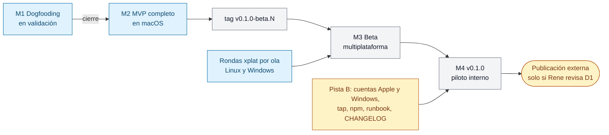

# Plan de releases y control de estado

> **Estado: propuesto (2026-10-08). Pendiente de la aprobación de Rene Bonilla.** Las decisiones que solo él puede tomar están en [Decisiones para Rene](#decisiones-para-rene).
>
> GitRaptor no usa board. Este documento es el **control de estado** del proyecto: los hitos después de M1, el criterio de salida de cada uno, las fichas que lo componen, su avance y una fecha estimada a partir de la velocidad real. No hay sprints: cada hito termina cuando se cumple su criterio de salida (mejora 3.3 del informe AADD).
>
> Fuentes: [documento de negocio](../business/gitraptor-documento-de-negocio.md) (§ 6, 7, 8, 11 y 12), [backlog](backlog.md) (hito M1), los índices de cada feature, [xplat-pendientes.md](../architecture/xplat-pendientes.md) y `.github/workflows/release*.yml`. Composición propuesta por el PO, criterios de M3 y v0.1.0 por el Arquitecto y estimación por el Scrum Master, todos el 2026-10-08.

## Resumen

| Hito | Criterio de salida (resumen) | % completado | Fecha estimada (días naturales) | Depende de |
|---|---|---|---|---|
| **M1** Dogfooding | 6 criterios del [backlog](backlog.md#hito-m1--dogfooding): 10 días de uso real, detección ≥ 90 %, un `undo` real, force-push bloqueado, recursos y frescura | Construido 100 %; criterios 50 % (2 cumplidos, 2 en parte, 1 en curso, 1 sin cumplir) | 2026-10-22 a 2026-11-06 | Rene: racha de 10 días con registro diario |
| **M2** MVP completo en macOS | Las 110 fichas Must y Should del MVP que no son de M1, implementadas; gates del MVP obligatorios en CI, rendimiento medido en la máquina de referencia y la demo del BRD § 13 en macOS | 18,2 % (17 implementadas y 6 en parte de 110) | 2026-10-26 a 2026-11-12 | La flota y las ventanas de revisión; cierre de M1; la cola de confirmación |
| **M3** Beta multiplataforma | Sobre un tag `v0.1.0-beta.N`: los XP Must de `xplat-pendientes.md` cerrados, `cargo test` y "repo intacto" en verde en Linux y Windows reales, humo de punta a punta instalado | 37,5 % (8 hechos y 8 en parte de 32) | 2026-11-02 a 2026-12-01 | Cierre de M2; rondas manuales de Rene; una máquina con Windows 11 |
| **M4** v0.1.0: primera release instalable (piloto interno) | Release firmada en macOS y Windows, instalación y actualización verificadas en los tres SO, primera experiencia en una máquina nueva | 14,3 % (2 en parte de 7) | 2026-11-09 a 2026-12-15 | Cierre de M3; cuentas de firma (externos); decisión D1 |

Los rangos salen de 4,5 días de datos y son amplios a propósito. **El optimista no es un compromiso**: exige empezar esta semana el dogfooding y la pista de firma, y que no haya días sin revisión como el 2026-10-07.



## Velocidad observada y método de estimación

Medida por el Scrum Master el 2026-10-08, del 2026-10-04 00:00Z al 2026-10-08 12:37Z (unos 4,5 días naturales). Los días del 1 al 3 se excluyen: hubo 5 PR en total y aún no había flota. La flota trabaja también en fin de semana, así que todo se mide en **días naturales**.

| Métrica | Total | Media por día | Día malo / bueno |
|---|---|---|---|
| PR mergeados | 123 | 27 | 12 (10-07) / 31 (10-06) |
| PR `feat` | 51 | 11 | 5 / 17 |
| Fichas completas | 34 | 7,5 | 3 / 12 |
| Fichas equivalentes (completa = 1, en parte = 0,5) | 40 | 8,8 | 3,5 / 14,5 |

**Método.** Cada ficha cuenta el día de su **primer** PR citado en "Estado de la implementación". El 2026-10-08 se sincronizaron los estados en lote y la fecha del último PR lo inflaría. Cada ficha equivalente cuesta unos 3 PR, con 0,45 `fix` por cada `feat`: el retrabajo ya está incluido.

**Supuestos** (⚠️ **ASSUMPTION** del Scrum Master):

- **Flota de 3 a 5 workers.** Pasar de 3 a 5 no escala la velocidad de forma lineal: el cuello de botella es la revisión y el merge del coordinador y el CI de macOS, no el número de workers.
- **Ventanas de uso.** El 2026-10-07 no se mergeó nada durante unas 18 horas: encaja con un límite de uso o con que Rene no estuviera supervisando. Los merges se concentran entre las 19 y las 21Z y entre las 00 y las 03Z. Un día así quita en torno a la mitad de la velocidad, y es la principal razón de que el rango conservador sea la mitad del optimista.
- **M2 es más difícil que lo cerrado hasta hoy.** Hasta ahora se cerraron esqueletos y fundamentos; M2 trae escrituras, el predictor y cadenas secuenciales. Se aplica un factor de complejidad k de 0,6 a 0,7 en el caso optimista y de 0,35 a 0,4 en el conservador.
- **Velocidad aplicada a M2: de 3 a 6 fichas equivalentes por día natural.**

**Fórmula para recalcular:**

```
restante_equiv = fichas_sin_empezar + 0,5 × fichas_en_parte
v              = fichas equivalentes cerradas (por fecha del PRIMER PR) en los últimos 7 días naturales / 7
fecha_opt      = hoy + restante_equiv / (p75_diario × k_opt)
fecha_cons     = hoy + restante_equiv / (p25_diario × k_cons) × 1,1
fecha_hito     = max(fecha_flota, ruta_crítica, dependencias humanas) + cierre (demo o tag)
```

**Comandos:**

```
gh pr list --state merged --limit 500 --json number,title,mergedAt,headRefName > prs.json
grep -rh '^status:' docs/requirements/features --include='*.md' | sort | uniq -c
```

La fecha del primer PR de cada ficha se obtiene cruzando los PR citados en su sección "Estado de la implementación" con el `mergedAt` de `prs.json`.

**Cuándo revisar:** al cerrar cada ola del DAG y, como mínimo, una vez por semana con una ventana móvil de 7 días. Además, enseguida si la velocidad cae por debajo de 3 fichas equivalentes por día dos días seguidos, o si un spike de la ruta crítica (SPIKE-CKP-001, SPIKE-GRD-002) cambia el diseño.

## M1: Dogfooding

El objetivo, el criterio de salida, el alcance, el DAG y el estado de cada criterio están en el [backlog](backlog.md#hito-m1--dogfooding). Todo lo que hay que construir está en `main`: lo que falta es **evidencia de uso real**, y eso depende de Rene, no de la flota.

| Fecha | Supuesto |
|---|---|
| Optimista: **2026-10-22** | El registro diario de dogfooding empieza el 2026-10-09 y no falla ningún día laborable |
| Conservadora: **2026-11-06** | Arranque tardío o un día perdido que reinicia la racha. Riesgo propio: el dogfooding se hace sobre un `main` que recibe unos 25 PR al día, y una regresión puede cortar la racha |

### Fichas de M1

Las fichas del alcance de M1 que siguen en este hito. INF-GRP-001, INF-GRP-002 y TS-GRP-004 tienen hecha la parte que exige M1 y se siguen en M2, donde está lo que les falta. Los Should de M1 sin empezar (TS-GRP-005 y US-TMC-005) pasan a M2.

| Ids | Qué | Estado |
|---|---|---|
| US-GRP-001, US-GRP-002, US-GRP-004, US-GRP-007, US-GRP-009 | Repo observado, eventos en vivo, observación continua, sesiones de Claude Code, registro explícito | I |
| US-GRP-012, US-GRP-017 | Rama base `main`; `raptor status --resources` | I |
| INF-CKP-001, US-CKP-001 | Esqueleto de la TUI; flota en vivo | I |
| TS-TMC-004, US-TMC-001, US-TMC-002, US-TMC-004 | Operación protegida; snapshot previo; `raptor undo`; captura del Git crudo | I |
| INF-GRD-001, US-GRD-001 | Arnés de hooks; force-push bloqueado | I |
| US-MCP-001, US-MCP-002, US-MCP-003 | MCP mínimo (Should) | I |
| SPIKE-GRP-001 | Precisión de la detección: falta la medición en el dogfooding (criterio 2) | P |

Lo primero que necesita M1 es el **registro diario de dogfooding**: fecha, sesiones, daemon encendido, lectura de `raptor status --resources` e incidentes. Hoy no existe (hueco 1 de [Huecos y limpieza](#huecos-y-limpieza)) y es la evidencia de los criterios 1, 2, 3 y 5. El primer uso del 2026-10-06 no cuenta para la racha porque no hubo registro ni continuidad.

## M2: MVP funcionalmente completo en macOS

**Objetivo.** En macOS, las cinco features del MVP cumplen todos sus Must y Should, la demo del BRD § 13 funciona de punta a punta y los gates del MVP bloquean el merge.

### Criterio de salida

1. Las 110 fichas de M2 están en `implemented` (frontmatter e índice), cada una con su PR. Un Should bloqueado está implementado o Rene lo sacó del MVP, con la decisión anotada en el backlog.
2. La demo del BRD § 13 se ejecuta en macOS y queda anotada en el registro de dogfooding: 4 sesiones de Claude Code, un conflicto previsto antes del merge (US-CKP-006), un force-push bloqueado y `raptor undo --agent <id> --since` restaurando (US-TMC-011).
3. Estos gates están en verde y son obligatorios en CI:
   - "repo intacto", con la auditoría dinámica de `exec` en macOS (INF-GRP-001);
   - caos de snapshots (INF-TMC-001, NFR-12);
   - el corpus de seguridad del MCP, rechazado al 100 % (INF-MCP-001, NFR-02);
   - RES-01 (ventana de 10 min), RES-02, RES-03, RES-05 y RES-07 (INF-GRP-002).
4. El rendimiento está medido en la máquina de referencia, con el informe del banco adjunto:
   - TUI < 500 ms p95 (TD-GRP-003);
   - snapshot < 200 ms p95 en el repo mediano (US-TMC-020);
   - predicción ≤ 5 s p95 (SPIKE-CKP-001, con su Research Brief cerrado);
   - 10 worktrees y 100K commits sin degradarse (escenario `tiered-scale`, NFR-05);
   - el motor estable bajo una ráfaga de archivos (TD-GRP-002).
5. Los KPIs del BRD § 9 se leen con un comando: bloqueos (US-GRD-005), porcentaje de conflictos previstos (US-CKP-010) y métricas del MCP (US-MCP-015).
6. M1 está cerrado: sus seis criterios cumplidos con evidencia. M1 es requisito para **cerrar** M2, no para empezarlo.

### Composición

Estados: **I** = implemented, **P** = partially-implemented, **Pend** = draft, ready o blocked. El MoSCoW sale de los índices de cada feature. Time Machine no tiene MoSCoW en su índice: se tomó del frontmatter (high = Must, medium = Should, low = Could) y es un ⚠️ **ASSUMPTION** que Rene debe confirmar ([Decisiones para Rene](#decisiones-para-rene), decisión 7).

**Cockpit** (25 US y 6 enablers)

| Ids | Qué | MoSCoW | Estado | Bloqueo |
|---|---|---|---|---|
| US-CKP-026 | Autoría del último commit | Should | I | — |
| US-CKP-025 | TUI en un repo no observado | Should | P | Falta el escenario 6 y los niveles |
| US-CKP-002, US-CKP-003, US-CKP-005 | Prioriza lo que pide atención; estado del motor; terminal pequeña o ASCII | Must | Pend | — |
| US-CKP-006, US-CKP-007, US-CKP-008, US-CKP-009, US-CKP-010 | Predicción de conflictos: choque, vigencia, aviso, base sin confirmar y KPI | Must | Pend | SPIKE-CKP-001 → TS-CKP-001 |
| US-CKP-012, US-CKP-014, US-CKP-015, US-CKP-016, US-CKP-017, US-CKP-018, US-CKP-024 | Revisar, integrar, poner al día, choque detenido, descartar, crear worktree, integrar con seguridad | Must | Pend | TS-CKP-003 |
| US-CKP-019, US-CKP-020, US-CKP-021, US-CKP-022 | Por qué frena Guardrails; confirmar un plan sobre trabajo ajeno; historial; grafo | Must | Pend | — |
| US-CKP-004, US-CKP-011, US-CKP-013 | Recordar la vista; consulta por CLI; abrir en el editor | Should | Pend | — |
| US-CKP-023 | Cola de confirmación en la TUI | Should | Pend (blocked) | US-GRD-015 |
| TS-CKP-002, TS-CKP-004, TS-CKP-005 | Catálogo y ejecutor; tokens; widgets | Must | I | — |
| SPIKE-CKP-001, TS-CKP-001 | Predicción en ≤ 5 s; predictor en el daemon | Must | Pend | — |
| TS-CKP-003 | Capa del Cockpit en la decisión de Guardrails | Must | Pend | — |

**Guardrails** (18 US y 2 enablers)

| Ids | Qué | MoSCoW | Estado | Bloqueo |
|---|---|---|---|---|
| US-GRD-019 | Quién ejecutó y a nombre de quién | Should | I | — |
| US-GRD-005 | Registro de bloqueos (KPI) | Must | P | El spool en modo degradado (TS sin crear) y las entradas `request` y `exception` |
| US-GRD-018 | Política de autoría | Should | P | Agente registrado; nivel local (US-GRP-013) |
| US-GRD-002, US-GRD-003, US-GRD-006, US-GRD-007, US-GRD-008, US-GRD-010, US-GRD-011, US-GRD-012 | Hooks previos; retirar sin rastro; excepción consciente; políticas; ramas y rutas; endurecer; fail-safe; un agente no relaja | Must | Pend | — |
| US-GRD-016 | La misma decisión por MCP y por hooks | Must | Pend | Las escrituras del MCP |
| US-GRD-017 | Destructiva permitida con punto previo | Must | Pend | US-TMC-005 |
| US-GRD-004, US-GRD-009, US-GRD-014 | Aviso de protección caída; tamaño de diff y formato; rama base del equipo | Should | Pend | — |
| US-GRD-013, US-GRD-015 | Configuración por comando; cola de confirmación | Should | Pend | Dev Spec tras SPIKE-GRD-002; US-GRD-013 espera además Q-GRD-32 |
| TS-GRD-001 | Configuración commiteada | Must | I | — |
| SPIKE-GRD-002 | Factor de autenticación del SO (la parte de macOS) | Must | Pend | — |

**Time Machine** (17 US y 5 enablers; MoSCoW supuesto)

| Ids | Qué | MoSCoW | Estado | Bloqueo |
|---|---|---|---|---|
| US-TMC-006, US-TMC-009, US-TMC-012, US-TMC-013, US-TMC-018, US-TMC-019 | Timeline; restaurar a un punto; no pisar a otro; un agente no deshace lo ajeno; los snapshots no se publican; recuperable si el proceso muere | Must | Pend | — |
| US-TMC-011 | Undo por agente y periodo | Must | Pend (blocked) | P17 (producto) |
| US-TMC-003, US-TMC-005, US-TMC-007, US-TMC-008, US-TMC-010, US-TMC-014, US-TMC-015, US-TMC-016, US-TMC-022 | Redo; previo por hooks; filtros; correcciones; últimos N minutos; aviso del remoto; rebase a medias; disco; tope | Should | Pend | — |
| US-TMC-020 | Overhead < 200 ms | Should | Pend | — (SPIKE-TMC-001 ya está hecho) |
| TS-TMC-001, TS-TMC-002, TS-TMC-003, SPIKE-TMC-001 | Almacén, oplog, aplicador; spike | Must | I | — |
| INF-TMC-001 | Arnés de caos | Must | Pend | — |

**MCP** (16 US y 1 enabler)

| Ids | Qué | MoSCoW | Estado | Bloqueo |
|---|---|---|---|---|
| US-MCP-005 | Respuestas acotadas | Must | I | — |
| US-MCP-004, US-MCP-006, US-MCP-007, US-MCP-013, US-MCP-017 | Quién más trabaja; agente sin soporte; hook sin poderes; "necesita al humano"; `explain_history` | Must | Pend | US-MCP-017 espera US-TMC-006, US-TMC-007 |
| US-MCP-008, US-MCP-009, US-MCP-010, US-MCP-011, US-MCP-012, US-MCP-018, US-MCP-019 | `snapshot`, `safe_commit`, archivos nombrados, worktree esperado, `undo`, `safe_rebase`, `create_worktree` | Must | Pend | TS-CKP-003 |
| US-MCP-016 | `check_conflicts` | Must | Pend | TS-CKP-001 |
| US-MCP-014 | Acción en espera del humano | Should | Pend | US-GRD-015 |
| US-MCP-015 | Métricas del MCP | Should | Pend | — |
| INF-MCP-001 | Corpus de seguridad en CI | Must | Pend | — |

**Motor local** (10 US y 10 enablers)

| Ids | Qué | MoSCoW | Estado | Bloqueo |
|---|---|---|---|---|
| US-GRP-020, US-GRP-022 | Repos descubiertos | Should | I | — |
| US-GRP-003, US-GRP-005, US-GRP-008, US-GRP-010 | Estado especial; lo que no se vio; el editor nunca se atribuye; corregir la atribución | Must | Pend | — |
| US-GRP-006, US-GRP-011, US-GRP-013, US-GRP-016 | Historial de un repo retirado; sesiones compartidas; umbral por repo; rama base del equipo | Should | Pend | — |
| TS-GRP-001, TS-GRP-002, TS-GRP-003, TS-GRP-006 | Almacén, lectura, daemon, niveles | Must | I | — |
| TS-GRP-004 | Canal: N8 a N11 y retención de la auditoría | Should | P | — |
| INF-GRP-001 | Parte de M2: auditoría de `exec` en macOS (eslogger) | Must | P | — |
| INF-GRP-002 | Parte de M2: RES-01 de 10 min, RES-03, RES-05, RES-07 y `tiered-scale` | Must | P | — |
| TS-GRP-005, TD-GRP-002, TD-GRP-003 | Prioridad del SO; motor bajo ráfaga; NFR-04 en la máquina de referencia | Should; Must; Must | Pend | — |

**Fuera de M2** (no bloquean el cierre): los Could US-GRP-018 (`raptor doctor`), US-GRP-019 (batería), US-GRP-021 (`raptor clone`) y US-TMC-017 (retención personal); US-TMC-021 (Fase 2); SPIKE-GRP-001 (es de M1). SPIKE-GRD-001, SPIKE-GRP-002 y TD-GRP-001 van a M3, porque lo único que les falta es Linux y Windows. US-GRP-014 y US-GRP-015 van a v0.1.0: son la experiencia de una máquina nueva y solo tienen sentido cuando instala otra persona.

### Avance

M2 son **todos los Must y Should del MVP que no son de M1**: 110 fichas (86 US y 24 enablers), con 17 implementadas (5 US y 12 enablers) y 6 en parte (3 y 3). Las fichas de M1 cuentan en M1 aunque también sean del MVP.

- Hito completo: (17 + 0,5 × 6) / 110 = **18,2 %**.
- Solo historias: (5 + 0,5 × 3) / 86 = **7,6 %**. Refleja mejor el valor que falta por entregar.
- Con M1 incluido (el MVP en macOS completo): (35 + 0,5 × 7) / 129 = **29,8 %**.

### Ruta crítica y fecha

Quedan unas **90 fichas equivalentes** (87 sin empezar y 6 en parte).

- **Por ritmo de la flota:** optimista a 6 por día, 15 días (2026-10-23); conservador a 3 por día con un 10 % de colchón, 30 días (2026-11-10).
- **Ruta crítica:** SPIKE-CKP-001 → TS-CKP-001 → US-CKP-006 a 010 y US-MCP-016, con 4 o 5 eslabones de 1 a 2 días cada uno (6 a 10 días). No limita en el caso optimista. **Riesgo:** si SPIKE-CKP-001 concluye que el predictor no funciona como está diseñado, se replanifica todo el bloque de predicción.
- **Otras cadenas:** TS-CKP-003 → US-CKP-012 a 024 y las escrituras del MCP (US-MCP-008 a 019); US-TMC-006 → 007 → US-MCP-017; SPIKE-GRD-002 → US-GRD-013 y 015 → US-CKP-023 y US-MCP-014 (la cola de confirmación: si se queda en M2 suma de 3 a 6 días al optimista).
- **Cierre:** lo que llegue más tarde entre la flota y M1, más 1 o 2 días de demo. **Optimista: 2026-10-26. Conservadora: 2026-11-12.**

## M3: Beta multiplataforma

**Objetivo.** Lo que M2 entrega en macOS funciona igual en Linux y Windows, validado sobre un binario de release, en máquina real, contenedor o VM según lo que exija cada pendiente.

### Criterio de salida

Propuesto por el Arquitecto y aceptado por el orquestador:

| # | Criterio | Evidencia |
|---|---|---|
| 1 | Se valida un binario de release, no un build de desarrollo: un tag `v0.1.0-beta.N` sobre el alcance cerrado de M2, construido por `release.yml` (6 targets, musl en Linux) | Enlace al run y borrador de prerelease. Hoy el workspace está en `0.0.0` y no hay ningún tag real |
| 2 | `repo-intact.yml` en verde en los tres SO y **Windows bloquea**: se quitan los `continue-on-error` del lint y los tests de Windows | Diff del workflow y run en verde (XP-10) |
| 3 | Linux arm64: `xplat/run-linux.sh` sin fallos con Git 2.38.5, 2.43 y 2.56, más `repo_intact` con strace; los ignorados son solo los de diseño. Linux x86_64 lo cubre el CI de ubuntu | Nueva tabla de ronda en `xplat-pendientes.md` |
| 4 | Windows x64 real: `cargo test --workspace --no-fail-fast` sin `--skip` y sin fallos, y `repo_intact` en verde | Tabla de ronda en `xplat-pendientes.md` |
| 5 | Todo XP Must está en `pasa` o `hecho`. Los Should están en `pasa` o tienen ficha y una degradación *fail-closed* documentada. Ninguno queda en `pendiente` sin una decisión | Columna Estado de `xplat-pendientes.md` |
| 6 | Humo de punta a punta con el binario instalado por `install.sh` o `install.ps1`, en una VM Linux y en Windows real: enable, añadir repo, observar, snapshot y `undo`, bloqueo de Guardrails, `raptor-mcp` en Claude Code, stop y disable. Repite la demo del BRD § 13 | XP-27; registro de dogfooding. El guion no existe todavía (hueco 2) |
| 7 | NFR-04, RES-01, RES-02 y RES-04 medidos en la referencia Linux (Lima) y en Windows real con `--gate reference`. En `non-functional.md`, NFR-04 deja de ser ASSUMPTION en Linux y Windows, o se abre una TD | XP-06, INF-GRP-002, TD-GRP-003; informe JSON adjunto |
| 8 | Seguridad de Windows cerrada: TD-GRP-001 completa, named pipe con un cliente de otra cuenta (XP-01), rutas UNC (XP-25), ámbito del MCP (XP-24) y revisión de `security-expert` sobre `crates/winsys` | PR y revisión |
| 9 | Autoarranque por SO: `systemd --user` (XP-23) y la clave `Run` de HKCU, con el ciclo enable/disable completo | Test e2e por SO |
| 10 | Ninguna marca "Pendiente: etapa de validación multiplataforma" queda sin su XP cerrado | `grep` sobre `docs/` |

### Composición (estado al 2026-10-08)

| Grupo | Ítems | Estado |
|---|---|---|
| Ya pasan | XP-07, 13, 14, 15, 31; XP-30 en contenedor | pasa o hecho |
| Linux, en parte | XP-03 (falta `SO_PEERPIDFD`), XP-04 (el e2e de procesos solo existe en macOS), XP-05 (límites del kernel), XP-11 (reflink) | parcial |
| Linux, pendientes | XP-09 (otro uid), XP-16 (`/proc` del multiplexor), XP-17 (subreaper), XP-18 (ejecutor), XP-23 (systemd) | pendiente |
| Windows, en parte | XP-01 (otra cuenta), XP-12 (e2e de `raptor undo` por el canal), XP-32 (dispatcher) | parcial o hecho con resto |
| Windows, pendientes | XP-02 (QPC), XP-08 (ACE de Git, ETW), XP-19 (ejecutor: hoy rechaza todo lanzamiento), XP-25 (UNC); XP-30 por repetir | pendiente |
| Los dos SO | XP-06, 20, 21, 22, 24, 26, 27 | pendiente |
| Fichas | SPIKE-GRD-001, SPIKE-GRP-002, TD-GRP-001 | P |
| Fichas de M2 con parte multiplataforma | INF-GRP-001, INF-GRP-002, TS-GRP-004 (P); SPIKE-TMC-001 (hecho solo en macOS; se cierra con el gate de CI de US-TMC-020); TD-GRP-003 (ready); INF-TMC-001, SPIKE-GRD-002, INF-MCP-001 (draft) | Se cuentan en M2; su parte de Linux y Windows cierra aquí |

- **Must**: todo lo anterior salvo lo que sigue.
- **Should**: XP-11 (el respaldo por copia ya funciona), XP-22 (editor externo) y la parte ETW de XP-08.
- **Según lo que entre en M2**: XP-18, 19 y 20 (ejecutor y predictor). Si no entran, basta el *fail-closed* documentado. XP-26 se verifica como *fail-closed*; el factor del SO completo puede ir después.
- **Van a v0.1.0**: XP-28 y XP-29.

**Avance.** 32 ítems (29 XP y 3 fichas): 8 hechos y 8 en parte → (8 + 0,5 × 8) / 32 = **37,5 %**. El [estado de release](release-status.md) solo cuenta las 3 fichas de este hito; el avance de los XP sale de la columna Estado de `xplat-pendientes.md`.

### Dónde se valida

- **Contenedor Linux.** Vale para lo funcional: `/proc`, inotify básico, strace sin root, `renameat2`, varias versiones de Git y un segundo uid (XP-09). **No vale** para los límites de inotify (XP-05: son del kernel de la VM de Docker y globales), `systemd --user` (XP-23), la sesión gráfica y los terminales (XP-18, 21, 22), polkit (XP-26), el reflink sobre btrfs o xfs (XP-11) ni los tiempos de referencia (XP-06). Eso va a Lima o UTM. ⚠️ **ASSUMPTION**: una VM basta como máquina de referencia para Linux (decisión de Rene del 2026-10-07).
- **Windows real.** Lo interactivo y lo de identidad, que el runner `windows-latest` no da: la consola y crossterm en la TUI, `CREATE_NO_WINDOW` y el editor, Windows Hello, un named pipe con una segunda cuenta, las DACL de NTFS y las ACE de Git for Windows, actualizar con winget con el daemon en marcha, la firma (SmartScreen) y los tiempos.
- **Alertas sobre la máquina.** La de las rondas es Windows 10 19045, sin soporte desde octubre de 2025; la beta debería validarse en **Windows 11** (⚠️ **ASSUMPTION**). No hay máquina Windows ARM: XP-28 y la ejecución real en ARM no se pueden verificar.

### Fecha

M3 se solapa con M2 y ya avanza: las rondas de Linux y Windows siguen a lo que se mergea, y 8 XP pendientes y los 5 parciales tratan piezas que ya existen. **El cierre no se solapa**: cada historia nueva de M2 añade marcas de xplat, así que los criterios 1, 5 y 6 se miden sobre el tag beta con M2 cerrado. Recomendación: una ronda por ola de M2 y la ronda final sobre la RC.

- **Optimista: 2026-11-02.** M2 más una ronda en Linux y otra en Windows, con sus correcciones.
- **Conservadora: 2026-12-01.** Dos o tres rondas y la espera de la máquina con Windows 11.
- **Factor dominante:** las rondas manuales de Rene y el hardware, no la flota.

## M4: v0.1.0, primera release instalable (piloto interno)

**Decisión del orquestador (2026-10-08), validada por el PO y el Arquitecto:** la propuesta de partida llamaba a v0.1.0 "primera release pública". **D1 sigue vigente** (herramienta interna al inicio; se publica fuera cuando el MVP esté estable internamente) y ADR-GRP-014 e INF-GRP-004 se diseñaron sin publicar nada. Por eso v0.1.0 es la **primera release versionada, firmada e instalable para el piloto interno** (KPI del BRD § 9: 5 desarrolladores en 2 equipos). Publicarla en los canales externos es una decisión aparte de Rene (decisión 1 de [Decisiones para Rene](#decisiones-para-rene)).

**Objetivo.** Una persona que no es Rene instala, arranca y actualiza GitRaptor en macOS, Linux o Windows desde una release firmada y verificable.

### Criterio de salida

1. **macOS** firmado con Developer ID y notarizado: `spctl -a -vv` y `codesign --verify` sobre los tres binarios de los dos targets. El log del job no contiene el aviso de "requiere secreto".
2. **Windows** firmado: `Get-AuthenticodeSignature` válido en x64. En arm64, XP-28 resuelto o una decisión explícita de entregarlo sin firmar o sacarlo de esta versión.
3. **Instalación:** en cada SO y en cada canal que se active, instalación limpia, `raptor --version` y el humo del criterio 6 de M3. En una máquina nueva se llega a un repo observado (US-GRP-014 y US-GRP-015 implementadas).
4. **Actualización** de `v0.1.0-beta.N` a `v0.1.0` por cada canal, con el daemon en marcha (XP-29):
   - el daemon viejo se sustituye por "versión incompatible" (ADR-GRP-005 § 4; ya está en `crates/api/src/client`, `PROTOCOL_VERSION 9`, `MIN_COMPATIBLE_PROTOCOL 5`);
   - las migraciones del perfil avanzan, y un perfil escrito por un binario más nuevo se deja intacto;
   - el cambio de versión no pierde ningún snapshot (NFR-01). Hoy no hay ficha ni test de actualización entre versiones publicadas (hueco 5).
5. **Desinstalación:** borra solo los binarios y deja intactos el perfil y la Time Machine. El artefacto de autoarranque queda resuelto, por `disable` o porque se documenta que hay que ejecutarlo.
6. **Cadena de suministro:** `cargo audit` en verde y SBOM adjuntos (ya hecho); `RELEASE_ATTEST` y `attest-sbom` activados y `gh attestation verify` en verde; `cargo-deny` (SEC-07, NFR-11) en CI (hueco).
7. **Licencia:** `license.yml` en verde y los manifiestos con FSL-1.1-ALv2 (ya está). La revisión legal recomendada (titular de la propiedad intelectual, CLA o DCO) está cerrada o aceptada como riesgo.
8. **Seguridad:** la revisión OWASP y MCP Top 10 de NFR-02 "antes de cada release" (SEC-MCP-12), con el corpus de INF-MCP-001 como suite, adjunta al PR de la release.
9. **Rendimiento:** el informe NFR-04 de la máquina de referencia, adjunto a la release (INF-GRP-003, TD-GRP-003).
10. **Pasos humanos** hechos y anotados en INF-GRP-003 e INF-GRP-004: secretos, releases inmutables, tags de prueba `v0.0.0*` borrados, versión subida a `0.1.0`, y `winget validate` y `brew audit` en verde para los canales que se activen.
11. M3 está cerrado.

### Canales: qué existe y qué falta

| Canal | Ya hecho | Falta |
|---|---|---|
| GitHub Release (borrador) | `release.yml`: 6 targets, `cargo audit`, SBOM CycloneDX, `SHA256SUMS`, borrador. Ensayo en verde con `v0.0.0-test.1` | Activar releases inmutables; borrar los tags `v0.0.0` y `v0.0.0-test.1`; subir la versión a `0.1.0`; publicar (paso humano) |
| `install.sh` e `install.ps1` | Probados en CI, incluido el rechazo de un checksum manipulado | Documentar la URL estable; probar la actualización con el daemon vivo (XP-29) |
| Homebrew (tap propio) | El render y el job de `release-channels.yml` | Crear el repo del tap, el secreto `HOMEBREW_TAP_TOKEN` y `brew audit` |
| winget | El render (zip y portable) | El secreto `WINGET_TOKEN`, `winget validate` y XP-29. Sin verificar: que `raptor-hook.exe` quede junto a `raptor.exe` (no está en `NestedInstallerFiles`). La revisión del PR en winget-pkgs tarda |
| npm | El render de los 7 paquetes y el *launcher* | Reservar `gitraptor` y `@gitraptor` (no se comprobó que estén libres) y configurar el *trusted publisher* |

Todos los canales dependen además de `RELEASE_PUBLISH_CHANNELS=true`. Las prereleases nunca publican en canales, así que la beta no ensaya de verdad el tap, winget ni npm: para eso hace falta un tap de prueba o `brew audit` y `winget validate` sin publicar.

### Composición

| Id | Qué | MoSCoW | Estado | Qué le falta |
|---|---|---|---|---|
| INF-GRP-003 | Pipeline de release (firma, SBOM) | Must | P | Secretos, releases inmutables, XP-28, tags de prueba |
| INF-GRP-004 | Canales Homebrew, winget, npm y scripts | Must | P | Tap, tokens, nombres de npm, validate y audit, XP-29 |
| US-GRP-014 | Sabe qué Git le falta | Must | Pend | — |
| US-GRP-015 | Primer repo guiado | Should | Pend | — |
| XP-27, XP-28, XP-29 | Binarios probados más allá de `--version`, firma en ARM, actualización | Must | pendiente | — |

Relacionadas, sin contar en el avance: TS-GRP-003 (I: SEC-14 ya rechaza `npx` y `node_modules`, y el autoarranque usa la ruta estable), TD-GRP-001 (P, en M3), TD-GRP-003 (ready, en M2), INF-MCP-001 (draft, en M2) y US-GRP-018 (`raptor doctor`, Could; candidata a entrar aquí como herramienta de soporte del piloto).

**Avance.** (0 + 0,5 × 2) / 7 = **14,3 %**, contando las 4 fichas y los 3 XP. El [estado de release](release-status.md) solo cuenta las 4 fichas.

### Fecha

La pista B (cuentas, firma, tap, nombres de npm, runbook, CHANGELOG, `SECURITY.md`, revisión legal) **no depende de M2** y conviene empezarla ya, por lo que tardan las validaciones de identidad. `release.yml` firma también las prereleases, así que la firma se puede ensayar con el tag beta.

- **Optimista: 2026-11-09**, si la pista de cuentas y firma arranca esta semana.
- **Conservadora: 2026-12-15.** Si la firma de Windows empieza tarde, pasa a ser la ruta crítica: fecha de inicio más 2 a 6 semanas.
- **Riesgo de ruta crítica:** la firma de Windows (identidad y elegibilidad) y la máquina con Windows 11, no el código: el pipeline ya existe y tiene un ensayo en verde.

## Decisiones para Rene

Ninguna se ha tomado en su nombre. Hasta que decida, el plan aplica la recomendación indicada.

| # | Decisión | Recomendación | Efecto en el plan |
|---|---|---|---|
| 1 | **D1**: ¿v0.1.0 se publica en los canales externos o se queda interna (script y tap)? ¿Quiere una `v0.1.0-beta.N` solo de macOS justo después de M2 para el piloto? | Interna; publicar más tarde | Define el criterio 10 de v0.1.0 y los canales |
| 2 | **Pregunta abierta 3 del BRD: fecha objetivo del MVP** | Fijarla tras ver la primera semana de velocidad de M2 | Sin ella el plan dice cuándo terminaría, no si es viable ni qué recortar |
| 3 | **Pregunta abierta 1: qué pesa más.** Si gana "proteger y deshacer", partir M2 en **M2a** (Time Machine, Guardrails y escrituras del MCP) y **M2b** (predictor y acciones del Cockpit) | Partir M2 si confirma la propuesta v0.7 | Adelanta lo diferencial de seguridad |
| 4 | **BR-13, la cola de confirmación** (US-GRD-015, US-CKP-023, US-MCP-014; Should) | Sacarla de M2: S-GRD-9 trata "pedir confirmación" como "denegar", así que es seguro | Si se queda, suma de 3 a 6 días al optimista de M2 |
| 5 | **P17** (US-TMC-011, BR-09 Must, parte de la demo) | Aceptar el supuesto: al retirar una corrección, los eventos vuelven a su atribución detectada | Desbloquea US-TMC-011 y el criterio 2 de M2 |
| 6 | **Los Could** (US-GRP-018, US-GRP-019, US-GRP-021 y US-TMC-017) | Fuera de M2; US-GRP-018 podría entrar en v0.1.0 | — |
| 7 | **MoSCoW de Time Machine**, sobre todo US-TMC-016 (disco) y US-TMC-020 (overhead), hoy Should por supuesto | Confirmar o subir a Must | Cambia el total de M2 |
| 8 | **Cifras de RES-01 y RES-02** (CPU < 1 %, RSS < 150 MB con 10 worktrees), abiertas desde M1 | Confirmarlas | Cierra el criterio 5 de M1 |
| 9 | **Cuentas y firma:** Apple Developer Program (individual u organización; si es organización, D-U-N-S) y firma de Windows (Artifact Signing, certificado OV o sin firmar con el aviso de SmartScreen). ⚠️ **ASSUMPTION**: Artifact Signing para personas solo existe en EE. UU. y Canadá | Empezar esta semana | Ruta crítica de v0.1.0 |
| 10 | **Máquina con Windows 11 x64**, y si se consigue una ARM o se saca arm64 de Windows (o sale sin firmar) | Conseguir Windows 11; arm64 sin firmar o fuera | Ruta crítica de M3 |
| 11 | **Activar** `RELEASE_ATTEST`, `RELEASE_PUBLISH_CHANNELS` y las releases inmutables, y publicar el borrador | Solo en el tag final (las attestations son públicas e irreversibles) | v0.1.0 |
| 12 | **Revisión legal:** titular de la propiedad intelectual (Rene o ASSA) y CLA o DCO | Cerrarla antes de v0.1.0 | Criterio 7 de v0.1.0 |
| 13 | **Paridad en la beta:** ¿M3 exige paridad funcional en Windows y Linux o acepta degradación documentada (*fail-closed*)? | Aceptar degradación documentada en los XP Should | Criterio 5 de M3 |
| 14 | **TD-GRP-002** (NFR-04 y NFR-05 no se cumplen bajo ráfaga en macOS): ¿bloquea v0.1.0 o sale como limitación conocida? | Bloquea M2 (criterio 4) | — |
| 15 | **Pendientes de Guardrails:** Q-GRD-32 (relajación personal pendiente), adopción del factor por D8, desinstalar y la excepción de OQ-GRD-008-3: ¿entran al MVP? | Decidir antes de la ola de Guardrails de M2 | Pueden añadir historias a M2 |

## Huecos y limpieza

**Huecos sin ficha.** No se les asigna id aquí: cada uno se crea con el siguiente número libre cuando se tome.

| # | Hueco | Lo necesita | Quién |
|---|---|---|---|
| 1 | Registro diario de dogfooding (artefacto, no historia) | M1 (criterios 1, 2, 3 y 5) y la demo de M2 | Orquestador |
| 2 | Guion o test e2e de la demo del BRD § 13 (el D-5 del MCP la declara prueba de aceptación) | M2 (criterio 2) y M3 (criterio 6) | PO y Arquitecto |
| 3 | TS del spool en modo degradado de US-GRD-005 | M2 | Arquitecto |
| 4 | Historias de Guardrails que debe el PO: relajación personal (Q-GRD-32), adopción del factor (D8), desinstalar y excepción (OQ-GRD-008-3) | M2, según la decisión 15 | PO |
| 5 | Actualizar y desinstalar GitRaptor como experiencia del usuario, con su test entre versiones publicadas (perfil, Time Machine y daemon); `raptor --version` con el canal de origen | v0.1.0 (criterios 4 y 5) | PO y Arquitecto |
| 6 | Historia de instalación en un paso por el canal de cada SO (anotada como pendiente del PO en INF-GRP-004) | v0.1.0 | PO |
| 7 | `cargo-deny` en CI (SEC-07, NFR-11; ADR-GRP-014 lo da por pendiente) | v0.1.0 (criterio 6) | Arquitecto |
| 8 | Checklist de la revisión de seguridad por release (SEC-MCP-12, NFR-02) y runbook de release con los pasos humanos | v0.1.0 | Arquitecto |
| 9 | `CHANGELOG`, notas de versión, `SECURITY.md` (política de divulgación) y matriz de soporte (versiones mínimas de SO y degradaciones) | v0.1.0 | Orquestador |
| 10 | Gate de i18n en/es (NFR-10): ningún workflow lo comprueba (⚠️ **ASSUMPTION** del PO) | M2, si se quiere como criterio | Arquitecto |
| 11 | No hay `architecture-constitution.md` en el repo; el Arquitecto usó AGENTS.md y los ADR-GRP como restricciones | — | Arquitecto (`/aadd-architect --init-constitution`) |

**Estados obsoletos detectados** (limpieza fuera del alcance de este PR):

- El backlog (líneas de Cockpit y MCP) y US-CKP-023 citan bloqueos ya resueltos por ADR-GRD-008, ADR-MCP-001 y ADR-CKP-002, todos aceptados.
- US-GRD-016 sigue "bloqueada por MCP" en el índice de Guardrails.
- US-TMC-020 sigue bloqueada por SPIKE-TMC-001, que está hecho.
- XP-10 sigue en `pendiente`, aunque el backlog cita #163 como "obligatorio en los tres SO".
- TS-GRP-001, TS-GRP-002 y SPIKE-TMC-001 dicen `done` en lugar de `implemented`.
- US-GRP-006 dice Must en el cuerpo y Should en el índice.

## Cómo se mantiene este documento

- **Contrato con el generador de estado** (`node tools/status/release-status.mjs`, que escribe [release-status.md](release-status.md)): cada hito es un encabezado `## M<n>` y una ficha pertenece al **primer** hito que la lista con su id completo en una fila de tabla (un campo `milestone` en el frontmatter de la ficha manda sobre el plan). Por eso las tablas de composición usan ids completos y no rangos, y las fichas de M1 solo aparecen en la tabla de M1. Si se cambia una tabla de este plan, hay que regenerar `release-status.md` en el mismo PR: docs-lint compara el archivo byte a byte.
- **Cada PR que cierra una ficha** actualiza su frontmatter y su fila en el backlog (regla del 2026-10-08) y regenera `release-status.md`. Este plan no repite el estado ficha a ficha: los porcentajes y las fechas se recalculan con el método de [Velocidad observada](#velocidad-observada-y-método-de-estimación) al cerrar cada ola y al menos una vez por semana.
- **Al cerrar un hito**, su fila del resumen pasa a "Cerrado (fecha)" con la evidencia, y el hito siguiente recibe su DAG en olas (como el de M1 en el backlog).
- **Al aprobarlo Rene**, `status` pasa de `proposed` a `approved` y cada decisión de [Decisiones para Rene](#decisiones-para-rene) se anota con "Decisión de Rene (fecha)".

## Decisiones registradas

| Decisión | Quién |
|---|---|
| Hitos M2 (MVP completo en macOS), M3 (beta multiplataforma) y v0.1.0, cada uno con criterio de salida verificable y sin sprints | Decisión del orquestador (2026-10-08), validada por el PO (composición) y el Arquitecto (M3 y v0.1.0) |
| v0.1.0 es la primera release instalable para el **piloto interno**, no pública: D1 sigue vigente | Propuesta del PO y del Arquitecto, por separado; aceptada por el orquestador (2026-10-08). Publicar es la decisión 1 de Rene |
| US-GRP-014 y US-GRP-015 pasan de M2 a v0.1.0; SPIKE-GRD-001, SPIKE-GRP-002 y TD-GRP-001 pasan a M3 | Propuesta del PO, aceptada por el orquestador (2026-10-08) |
| M3 se valida sobre un binario de release (`v0.1.0-beta.N`), no sobre un build de desarrollo; Linux en contenedor para lo funcional y en VM para kernel, systemd, sesión gráfica y tiempos | Propuesta del Arquitecto, aceptada por el orquestador (2026-10-08) |
| Estimación por velocidad real en días naturales, por fecha del primer PR de cada ficha, con factor de complejidad para M2 | Scrum Master (2026-10-08) |
| Porcentaje de M1 por criterios de salida (2 cumplidos, 2 en parte, 1 en curso y 1 sin cumplir = 50 %), no por fichas: todo lo construible ya está en `main` | Decisión del orquestador (2026-10-08). El SM estimaba la evidencia en torno al 5 %: los dos números miden cosas distintas |
| Este documento no lleva id canónico: el esquema de AADD no tiene un tipo "plan" y sigue el patrón de `xplat-pendientes.md` | Decisión del orquestador (2026-10-08) |
| La v0.1.0 es el hito **M4**: el generador de estado (#184) solo reconoce hitos `M<n>`. El tag sigue siendo `v0.1.0` | Decisión del orquestador (2026-10-08), por el contrato del generador |
| M2 son los Must y Should del MVP **que no son de M1** (110 fichas). Las fichas de M1 cuentan en M1; INF-GRP-001, INF-GRP-002 y TS-GRP-004, con la parte de M1 hecha, se siguen en M2. US-GRP-018, US-GRP-019, US-GRP-021, US-TMC-017 (Could) y US-TMC-021 (Fase 2) quedan sin hito | Decisión del orquestador (2026-10-08). El PO contaba M2 con las de M1 (128 fichas, 29,7 %); con el contrato del generador cada ficha va a un solo hito |
